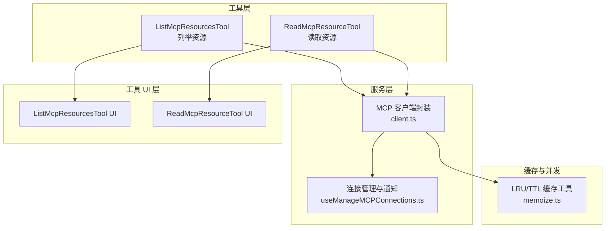
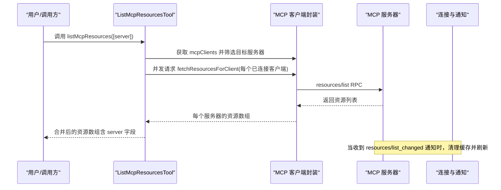
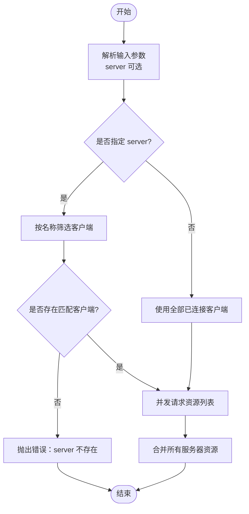
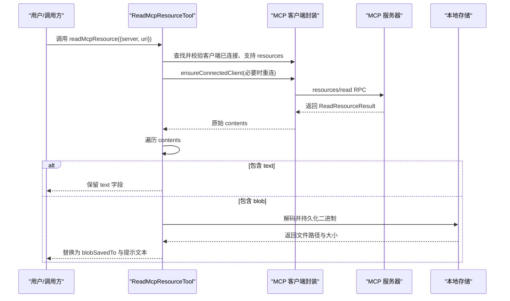
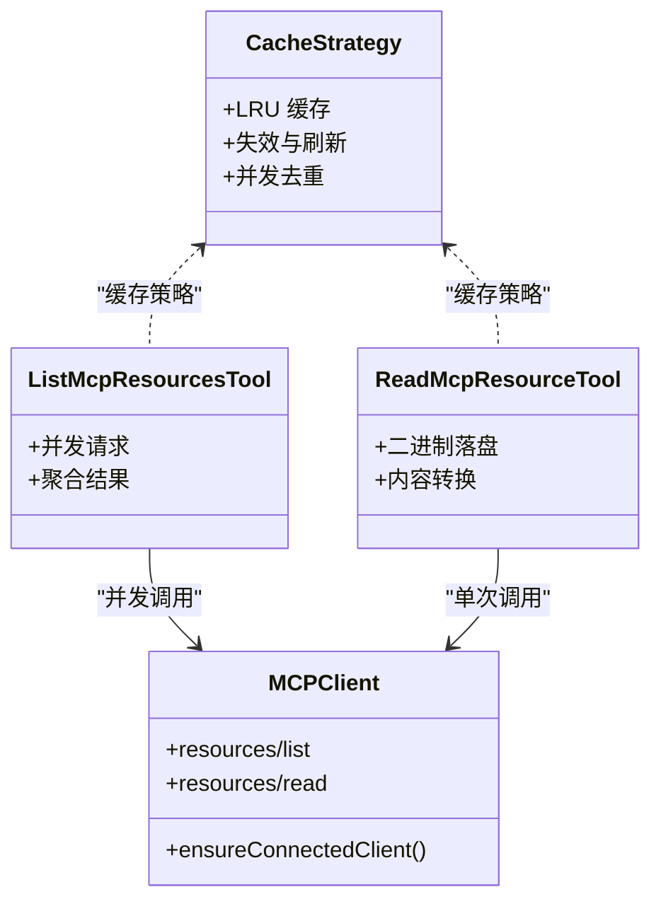
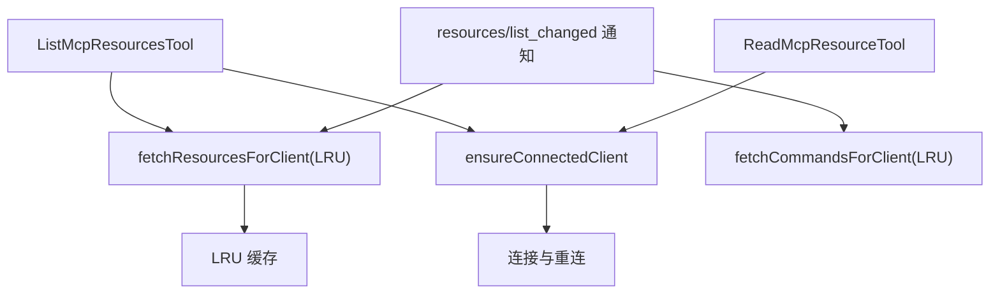

# MCP 资源管理

<cite>
**本文引用的文件**
- [ListMcpResourcesTool.ts](file://src/tools/ListMcpResourcesTool/ListMcpResourcesTool.ts)
- [prompt.ts](file://src/tools/ListMcpResourcesTool/prompt.ts)
- [UI.tsx](file://src/tools/ListMcpResourcesTool/UI.tsx)
- [ReadMcpResourceTool.ts](file://src/tools/ReadMcpResourceTool/ReadMcpResourceTool.ts)
- [UI.tsx](file://src/tools/ReadMcpResourceTool/UI.tsx)
- [client.ts](file://src/services/mcp/client.ts)
- [useManageMCPConnections.ts](file://src/services/mcp/useManageMCPConnections.ts)
- [memoize.ts](file://src/utils/memoize.ts)
</cite>

## 目录
1. [简介](#简介)
2. [项目结构](#项目结构)
3. [核心组件](#核心组件)
4. [架构总览](#架构总览)
5. [详细组件分析](#详细组件分析)
6. [依赖关系分析](#依赖关系分析)
7. [性能考量](#性能考量)
8. [故障排查指南](#故障排查指南)
9. [结论](#结论)
10. [附录](#附录)

## 简介
本文件面向 MCP（Model Context Protocol）资源管理工具，系统性阐述两类核心工具：ListMcpResourcesTool（资源发现与枚举）与 ReadMcpResourceTool（资源读取与解析）。文档覆盖以下要点：
- 资源发现与枚举：资源类型识别、元数据获取、按服务器过滤与聚合展示
- 资源读取与解析：内容格式处理（文本/二进制）、数据转换与错误恢复
- 缓存策略：LRU 缓存、失效与刷新、连接健康保障
- 性能优化：并发处理、批处理调度、去重与写穿透保护
- 并发处理：工具级并发安全、连接级重连与幂等
- 实际使用场景：批量操作与增量更新

## 项目结构
围绕 MCP 资源管理的关键文件组织如下：
- 工具层
  - ListMcpResourcesTool：列举资源，支持按服务器筛选
  - ReadMcpResourceTool：按 URI 读取单个资源，自动处理文本与二进制
- 服务层
  - MCP 客户端封装：连接管理、能力检测、RPC 请求、缓存与失效
  - 连接生命周期管理：通知监听、资源变更刷新
- 工具 UI 层
  - 工具调用与结果渲染（人类可读输出）
- 缓存与并发工具
  - LRU 缓存与 TTL 并发缓存工具

图表来源
- [ListMcpResourcesTool.ts:40-123](file://src/tools/ListMcpResourcesTool/ListMcpResourcesTool.ts#L40-L123)
- [ReadMcpResourceTool.ts:49-158](file://src/tools/ReadMcpResourceTool/ReadMcpResourceTool.ts#L49-L158)
- [client.ts:1999-2031](file://src/services/mcp/client.ts#L1999-L2031)
- [useManageMCPConnections.ts:705-751](file://src/services/mcp/useManageMCPConnections.ts#L705-L751)
- [memoize.ts:234-269](file://src/utils/memoize.ts#L234-L269)

章节来源
- [ListMcpResourcesTool.ts:1-125](file://src/tools/ListMcpResourcesTool/ListMcpResourcesTool.ts#L1-L125)
- [ReadMcpResourceTool.ts:1-160](file://src/tools/ReadMcpResourceTool/ReadMcpResourceTool.ts#L1-L160)
- [client.ts:1999-2031](file://src/services/mcp/client.ts#L1999-L2031)
- [useManageMCPConnections.ts:705-751](file://src/services/mcp/useManageMCPConnections.ts#L705-L751)
- [memoize.ts:234-269](file://src/utils/memoize.ts#L234-L269)

## 核心组件
- ListMcpResourcesTool
  - 输入：可选 server 字段用于筛选目标服务器
  - 输出：资源数组，包含 uri、name、mimeType、description、server
  - 特性：并发安全、只读、延迟执行、结果截断检测、UI 渲染
- ReadMcpResourceTool
  - 输入：server、uri
  - 输出：contents 数组，每项包含 uri、mimeType、text 或 blobSavedTo
  - 特性：并发安全、只读、延迟执行、二进制内容落盘与路径替换、UI 渲染

章节来源
- [ListMcpResourcesTool.ts:15-38](file://src/tools/ListMcpResourcesTool/ListMcpResourcesTool.ts#L15-L38)
- [ReadMcpResourceTool.ts:22-47](file://src/tools/ReadMcpResourceTool/ReadMcpResourceTool.ts#L22-L47)

## 架构总览
MCP 资源管理由“工具层—服务层—缓存层”构成，工具通过服务层访问 MCP 服务器，服务层负责连接、能力检测、RPC 调用与缓存控制；连接状态变化触发资源列表刷新。

图表来源
- [ListMcpResourcesTool.ts:66-101](file://src/tools/ListMcpResourcesTool/ListMcpResourcesTool.ts#L66-L101)
- [client.ts:1999-2031](file://src/services/mcp/client.ts#L1999-L2031)
- [useManageMCPConnections.ts:705-751](file://src/services/mcp/useManageMCPConnections.ts#L705-L751)

## 详细组件分析

### ListMcpResourcesTool 组件分析
- 功能职责
  - 资源发现与枚举：遍历已配置的 MCP 客户端，按需筛选目标服务器，调用统一的资源拉取函数
  - 元数据获取：从服务器返回的资源对象中附加 server 字段，便于后续定位
  - 分类展示：将多服务器资源扁平化合并，作为统一资源清单返回
- 关键流程
  - 输入校验与过滤：若指定 server 且未匹配到客户端，抛出明确错误
  - 并发拉取：对每个已连接客户端并发发起请求，失败不阻塞整体
  - 结果聚合：将各服务器返回的资源数组合并为单一数组
- 错误处理
  - 单点失败：某服务器连接异常或无资源时记录日志并跳过，保证其他服务器结果可用
  - 参数错误：当 server 名称无效时，提示可用服务器列表
- UI 与截断
  - UI 渲染：空结果时显示占位提示，非空时以 JSON 格式输出
  - 截断检测：根据序列化后字符长度判断是否截断

图表来源
- [ListMcpResourcesTool.ts:66-101](file://src/tools/ListMcpResourcesTool/ListMcpResourcesTool.ts#L66-L101)

章节来源
- [ListMcpResourcesTool.ts:40-123](file://src/tools/ListMcpResourcesTool/ListMcpResourcesTool.ts#L40-L123)
- [prompt.ts:1-20](file://src/tools/ListMcpResourcesTool/prompt.ts#L1-L20)
- [UI.tsx:1-28](file://src/tools/ListMcpResourcesTool/UI.tsx#L1-L28)

### ReadMcpResourceTool 组件分析
- 功能职责
  - 资源读取：基于 server 与 uri 发起 resources/read 请求
  - 内容格式处理：区分 text 与 blob，对二进制进行解码并持久化到本地临时目录，返回保存路径与提示信息
  - 数据转换：将原始结果映射为统一输出结构，确保上下文注入安全
  - 错误恢复：对二进制保存失败进行降级处理，保留 MIME 类型与可读提示
- 关键流程
  - 客户端校验：必须已连接且具备 resources 能力
  - 连接保障：通过 ensureConnectedClient 确保连接有效（必要时重连）
  - 内容处理：逐条处理 contents，二进制转为本地路径，文本原样保留
- UI 与截断
  - UI 渲染：空内容时显示占位提示，非空时以 JSON 格式输出
  - 截断检测：根据序列化后字符长度判断是否截断

图表来源
- [ReadMcpResourceTool.ts:75-143](file://src/tools/ReadMcpResourceTool/ReadMcpResourceTool.ts#L75-L143)
- [client.ts:1688-1704](file://src/services/mcp/client.ts#L1688-L1704)

章节来源
- [ReadMcpResourceTool.ts:49-158](file://src/tools/ReadMcpResourceTool/ReadMcpResourceTool.ts#L49-L158)
- [UI.tsx:1-36](file://src/tools/ReadMcpResourceTool/UI.tsx#L1-L36)

### 资源缓存策略与并发处理
- LRU 缓存
  - fetchResourcesForClient 使用 memoizeWithLRU，以服务器名为键，容量默认 100，避免重复拉取
  - 缓存键函数仅依赖服务器名，确保同一服务器的资源列表共享缓存
- 失效与刷新
  - 连接关闭或收到 resources/list_changed 通知时，清理对应服务器的缓存条目
  - 刷新采用“写穿 + 异步后台刷新”，先返回旧值，再异步更新，保证低延迟
- 并发与批处理
  - ListMcpResourcesTool 对多个客户端并发请求，失败不影响其他结果
  - 批处理采用 pMap，每个槽位空闲即处理下一个，避免慢服务器阻塞
- 连接健康保障
  - ensureConnectedClient 在连接不可用时自动重连，确保工具调用始终可用

图表来源
- [client.ts:1999-2031](file://src/services/mcp/client.ts#L1999-L2031)
- [client.ts:1688-1704](file://src/services/mcp/client.ts#L1688-L1704)
- [useManageMCPConnections.ts:705-751](file://src/services/mcp/useManageMCPConnections.ts#L705-L751)
- [memoize.ts:234-269](file://src/utils/memoize.ts#L234-L269)

章节来源
- [client.ts:1999-2031](file://src/services/mcp/client.ts#L1999-L2031)
- [client.ts:1688-1704](file://src/services/mcp/client.ts#L1688-L1704)
- [useManageMCPConnections.ts:705-751](file://src/services/mcp/useManageMCPConnections.ts#L705-L751)
- [memoize.ts:234-269](file://src/utils/memoize.ts#L234-L269)

## 依赖关系分析
- 工具对服务层的依赖
  - ListMcpResourcesTool 依赖 fetchResourcesForClient 与 ensureConnectedClient
  - ReadMcpResourceTool 依赖 ensureConnectedClient 与二进制落盘工具
- 服务层对缓存与并发工具的依赖
  - memoizeWithLRU 提供 LRU 缓存
  - pMap 提供批处理并发
- 通知驱动的增量更新
  - 收到 resources/list_changed 通知后，清理缓存并重新拉取资源与命令，实现增量更新

图表来源
- [ListMcpResourcesTool.ts:66-101](file://src/tools/ListMcpResourcesTool/ListMcpResourcesTool.ts#L66-L101)
- [ReadMcpResourceTool.ts:75-143](file://src/tools/ReadMcpResourceTool/ReadMcpResourceTool.ts#L75-L143)
- [client.ts:1999-2031](file://src/services/mcp/client.ts#L1999-L2031)
- [client.ts:2033-2107](file://src/services/mcp/client.ts#L2033-L2107)
- [useManageMCPConnections.ts:705-751](file://src/services/mcp/useManageMCPConnections.ts#L705-L751)

章节来源
- [ListMcpResourcesTool.ts:66-101](file://src/tools/ListMcpResourcesTool/ListMcpResourcesTool.ts#L66-L101)
- [ReadMcpResourceTool.ts:75-143](file://src/tools/ReadMcpResourceTool/ReadMcpResourceTool.ts#L75-L143)
- [client.ts:1999-2107](file://src/services/mcp/client.ts#L1999-L2107)
- [useManageMCPConnections.ts:705-751](file://src/services/mcp/useManageMCPConnections.ts#L705-L751)

## 性能考量
- 缓存命中率与内存占用
  - LRU 缓存容量默认 100，避免无限增长；对资源列表这类热点数据显著降低 RPC 次数
- 并发调度
  - ListMcpResourcesTool 对多个服务器并发请求，pMap 将空闲槽位复用，提升吞吐
- 写穿透与刷新一致性
  - 缓存刷新采用“先返回旧值，再异步更新”的策略，避免阻塞调用方
- 连接重连与幂等
  - ensureConnectedClient 在连接失效时自动重连，工具调用幂等，避免重复副作用
- 输出截断与人类可读性
  - UI 层对输出进行 JSON 格式化，结合截断检测，平衡信息完整性与可读性

## 故障排查指南
- 常见错误与定位
  - server 不存在：检查可用服务器列表，确认名称拼写
  - 服务器未连接：等待连接建立或手动触发重连
  - 服务器不支持 resources：确认服务器能力声明
  - 二进制保存失败：检查磁盘权限与 MIME 类型，查看提示中的错误信息
- 增量更新验证
  - 观察 resources/list_changed 通知是否触发缓存清理与刷新
- 日志与调试
  - 工具层与服务层均提供日志记录，便于定位 RPC 失败与缓存问题

章节来源
- [ListMcpResourcesTool.ts:73-77](file://src/tools/ListMcpResourcesTool/ListMcpResourcesTool.ts#L73-L77)
- [ReadMcpResourceTool.ts:80-92](file://src/tools/ReadMcpResourceTool/ReadMcpResourceTool.ts#L80-L92)
- [useManageMCPConnections.ts:705-751](file://src/services/mcp/useManageMCPConnections.ts#L705-L751)

## 结论
MCP 资源管理工具通过“工具层—服务层—缓存层”的清晰分层，实现了：
- 高效的资源发现与读取
- 稳健的缓存与连接管理
- 友好的 UI 与错误恢复
在实际使用中，建议优先利用缓存与并发特性进行批量操作，并通过通知机制实现资源的增量更新，从而获得更佳的性能与稳定性。

## 附录
- 实际使用场景与最佳实践
  - 批量操作：使用 ListMcpResourcesTool 对多个服务器并发拉取资源，再在上层进行聚合与过滤
  - 增量更新：依赖 resources/list_changed 通知，自动清理缓存并刷新资源与命令
  - 安全注入：ReadMcpResourceTool 将二进制内容落盘并以路径替代，避免大体积 base64 直接进入上下文
- 相关工具与 UI
  - 工具调用与结果渲染由各自 UI 文件负责，确保人类可读输出与交互友好