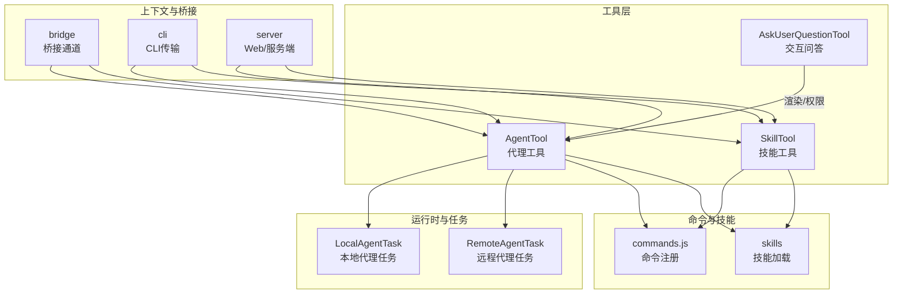
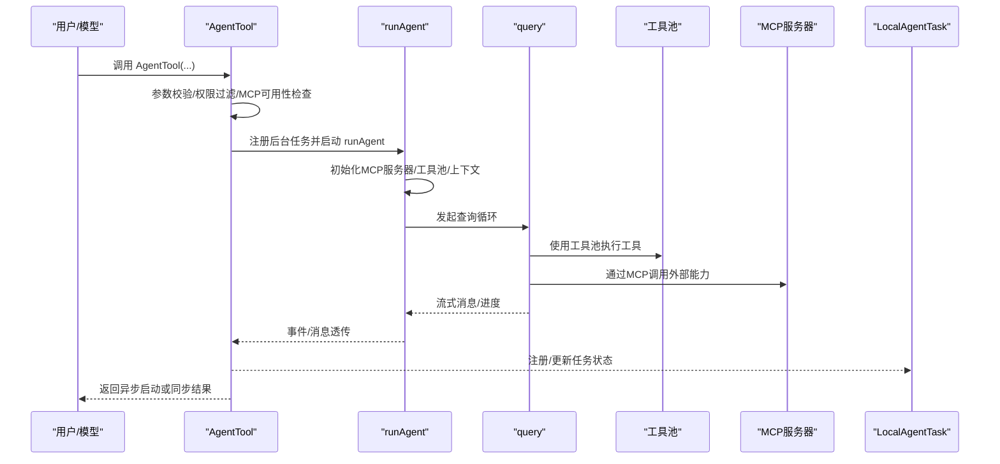
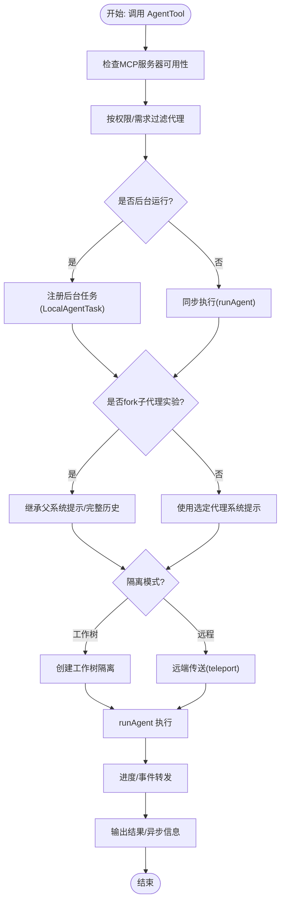
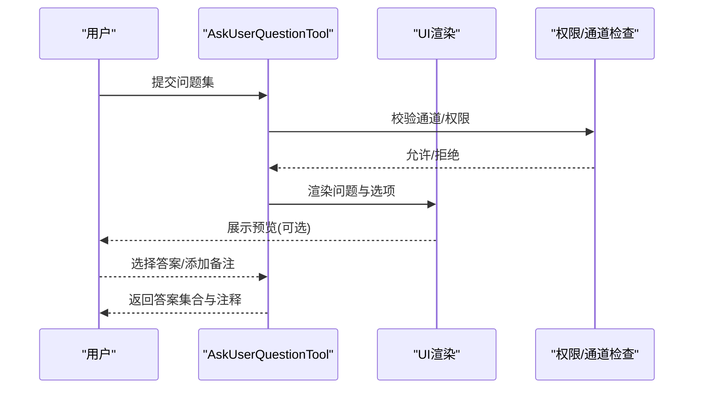
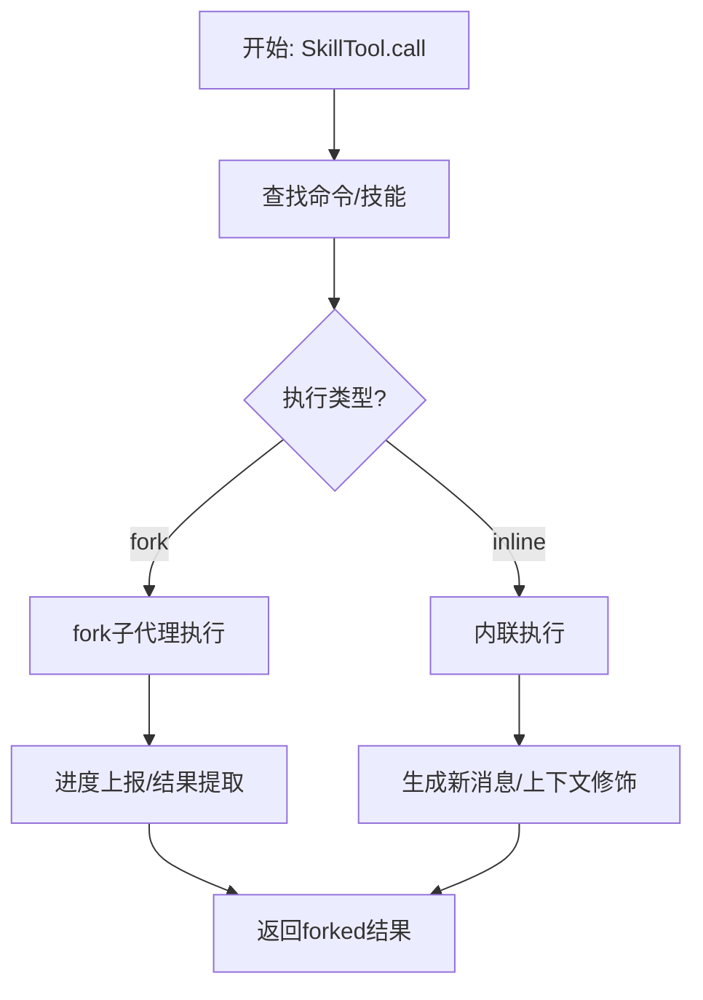
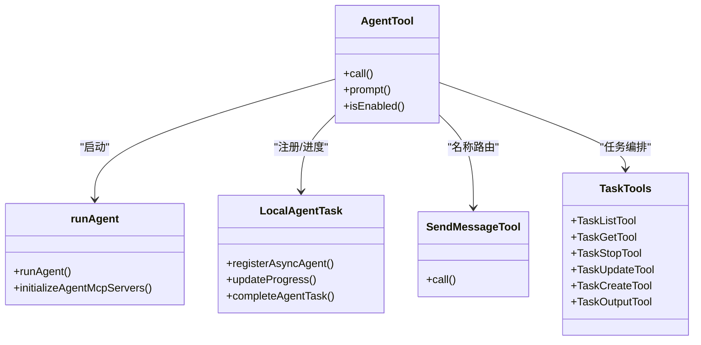
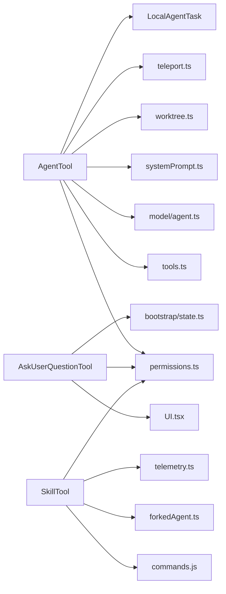

# 代理工具

<cite>
**本文引用的文件**
- [AgentTool.tsx](file://src/tools/AgentTool/AgentTool.tsx)
- [runAgent.ts](file://src/tools/AgentTool/runAgent.ts)
- [builtInAgents.ts](file://src/tools/AgentTool/builtInAgents.ts)
- [forkSubagent.ts](file://src/tools/AgentTool/forkSubagent.ts)
- [AskUserQuestionTool.tsx](file://src/tools/AskUserQuestionTool/AskUserQuestionTool.tsx)
- [SkillTool.ts](file://src/tools/SkillTool/SkillTool.ts)
- [UI.tsx](file://src/tools/AgentTool/UI.tsx)
- [UI.tsx](file://src/tools/AskUserQuestionTool/UI.tsx)
- [UI.tsx](file://src/tools/SkillTool/UI.tsx)
- [prompt.ts](file://src/tools/AgentTool/prompt.ts)
- [prompt.ts](file://src/tools/AskUserQuestionTool/prompt.ts)
- [prompt.ts](file://src/tools/SkillTool/prompt.ts)
- [agentToolUtils.ts](file://src/tools/AgentTool/agentToolUtils.ts)
- [constants.ts](file://src/tools/AgentTool/constants.ts)
- [constants.ts](file://src/tools/SkillTool/constants.ts)
- [agentDisplay.ts](file://src/tools/AgentTool/agentDisplay.ts)
- [agentMemory.ts](file://src/tools/AgentTool/agentMemory.ts)
- [agentMemorySnapshot.ts](file://src/tools/AgentTool/agentMemorySnapshot.ts)
- [resumeAgent.ts](file://src/tools/AgentTool/resumeAgent.ts)
- [loadAgentsDir.ts](file://src/tools/AgentTool/loadAgentsDir.ts)
- [agentColorManager.ts](file://src/tools/AgentTool/agentColorManager.ts)
- [agentToolUtils.ts](file://src/tools/AgentTool/agentToolUtils.ts)
- [LocalAgentTask.ts](file://src/tasks/LocalAgentTask/LocalAgentTask.ts)
- [RemoteAgentTask.ts](file://src/tasks/RemoteAgentTask/RemoteAgentTask.ts)
- [sendMessageTool.ts](file://src/tools/SendMessageTool/SendMessageTool.ts)
- [teamCreateTool.ts](file://src/tools/TeamCreateTool/TeamCreateTool.ts)
- [teamDeleteTool.ts](file://src/tools/TeamDeleteTool/TeamDeleteTool.ts)
- [taskListTool.ts](file://src/tools/TaskListTool/TaskListTool.ts)
- [taskGetTool.ts](file://src/tools/TaskGetTool/TaskGetTool.ts)
- [taskStopTool.ts](file://src/tools/TaskStopTool/TaskStopTool.ts)
- [taskUpdateTool.ts](file://src/tools/TaskUpdateTool/TaskUpdateTool.ts)
- [taskCreateTool.ts](file://src/tools/TaskCreateTool/TaskCreateTool.ts)
- [taskOutputTool.ts](file://src/tools/TaskOutputTool/TaskOutputTool.ts)
- [messages.ts](file://src/utils/messages.ts)
- [agentContext.ts](file://src/utils/agentContext.ts)
- [worktree.ts](file://src/utils/worktree.ts)
- [permissions.ts](file://src/utils/permissions/permissions.ts)
- [permissionMode.ts](file://src/utils/permissions/PermissionMode.ts)
- [telemetry.ts](file://src/services/analytics/index.ts)
- [systemPrompt.ts](file://src/utils/systemPrompt.ts)
- [model/agent.ts](file://src/utils/model/agent.ts)
- [forkedAgent.ts](file://src/utils/forkedAgent.ts)
- [sleep.ts](file://src/utils/sleep.ts)
- [envUtils.ts](file://src/utils/envUtils.ts)
- [agentSwarmsEnabled.ts](file://src/utils/agentSwarmsEnabled.ts)
- [teammate.ts](file://src/utils/teammate.ts)
- [teammateContext.ts](file://src/utils/teammateContext.ts)
- [teleport.ts](file://src/utils/teleport.ts)
- [task/diskOutput.ts](file://src/utils/task/diskOutput.ts)
- [sessionStorage.ts](file://src/utils/sessionStorage.ts)
- [tokens.ts](file://src/utils/tokens.ts)
- [cwd.ts](file://src/utils/cwd.ts)
- [debug.ts](file://src/utils/debug.ts)
- [errors.ts](file://src/utils/errors.ts)
- [uuid.ts](file://src/utils/uuid.ts)
- [systemPromptType.ts](file://src/utils/systemPromptType.ts)
- [prompts.ts](file://src/constants/prompts.ts)
- [xml.ts](file://src/constants/xml.ts)
- [ids.ts](file://src/types/ids.ts)
- [tools.ts](file://src/tools.ts)
- [agent.ts](file://src/commands/agents/agent.ts)
- [advisor.ts](file://src/commands/advisor.ts)
- [init.ts](file://src/commands/init.ts)
- [status.ts](file://src/commands/status.ts)
- [tasks.ts](file://src/tasks.ts)
- [task.ts](file://src/Task.ts)
- [tool.ts](file://src/Tool.ts)
- [bootstrap/state.ts](file://src/bootstrap/state.ts)
- [coordinatorMode.ts](file://src/coordinator/coordinatorMode.ts)
- [inboxPoller.ts](file://src/hooks/useInboxPoller.ts)
- [queueProcessor.ts](file://src/hooks/useQueueProcessor.ts)
- [replBridge.ts](file://src/bridge/replBridge.ts)
- [remoteBridgeCore.ts](file://src/bridge/remoteBridgeCore.ts)
- [bridgeApi.ts](file://src/bridge/bridgeApi.ts)
- [bridgeMessaging.ts](file://src/bridge/bridgeMessaging.ts)
- [bridgePermissionCallbacks.ts](file://src/bridge/bridgePermissionCallbacks.ts)
- [bridgeUI.ts](file://src/bridge/bridgeUI.ts)
- [bridgeStatusUtil.ts](file://src/bridge/bridgeStatusUtil.ts)
- [bridgeEnabled.ts](file://src/bridge/bridgeEnabled.ts)
- [bridgePointer.ts](file://src/bridge/bridgePointer.ts)
- [bridgeDebug.ts](file://src/bridge/bridgeDebug.ts)
- [bridgeConfig.ts](file://src/bridge/bridgeConfig.ts)
- [bridgeMain.ts](file://src/bridge/bridgeMain.ts)
- [bridgePointer.ts](file://src/bridge/bridgePointer.ts)
- [bridgeStatusUtil.ts](file://src/bridge/bridgeStatusUtil.ts)
- [bridgeUI.ts](file://src/bridge/bridgeUI.ts)
- [bridgePermissionCallbacks.ts](file://src/bridge/bridgePermissionCallbacks.ts)
- [bridgeApi.ts](file://src/bridge/bridgeApi.ts)
- [remoteBridgeCore.ts](file://src/bridge/remoteBridgeCore.ts)
- [replBridge.ts](file://src/bridge/replBridge.ts)
- [remoteIO.ts](file://src/cli/remoteIO.ts)
- [structuredIO.ts](file://src/cli/structuredIO.ts)
- [ndjsonSafeStringify.ts](file://src/cli/ndjsonSafeStringify.ts)
- [print.ts](file://src/cli/print.ts)
- [exit.ts](file://src/cli/exit.ts)
- [update.ts](file://src/cli/update.ts)
- [sessionsWebSocket.ts](file://src/server/SessionsWebSocket.ts)
- [createDirectConnectSession.ts](file://src/server/createDirectConnectSession.ts)
- [directConnectManager.ts](file://src/server/directConnectManager.ts)
- [types.ts](file://src/server/types.ts)
- [web/index.ts](file://web/app/index.ts)
- [web/hooks.ts](file://web/hooks.ts)
- [web/lib.ts](file://web/lib.ts)
- [web/components.ts](file://web/components.ts)
- [web/public.ts](file://web/public.ts)
- [web/package.json](file://web/package.json)
- [web/tsconfig.json](file://web/tsconfig.json)
- [web/next.config.ts](file://web/next.config.ts)
- [web/tailwind.config.ts](file://web/tailwind.config.ts)
- [web/postcss.config.js](file://web/postcss.config.js)
- [web/.eslintrc.json](file://web/.eslintrc.json)
- [mcp-server/api/index.ts](file://mcp-server/api/index.ts)
- [mcp-server/src/index.ts](file://mcp-server/src/index.ts)
- [mcp-server/package.json](file://mcp-server/package.json)
- [mcp-server/tsconfig.json](file://mcp-server/tsconfig.json)
- [mcp-server/server.json](file://mcp-server/server.json)
- [mcp-server/railway.json](file://mcp-server/railway.json)
- [mcp-server/Dockerfile](file://mcp-server/Dockerfile)
- [mcp-server/.npmignore](file://mcp-server/.npmignore)
- [mcp-server/.gitignore](file://mcp-server/.gitignore)
- [mcp-server/README.md](file://mcp-server/README.md)
- [mcp-server/api/vercelApp.ts](file://mcp-server/api/vercelApp.ts)
- [mcp-server/src/http.ts](file://mcp-server/src/http.ts)
- [mcp-server/src/server.ts](file://mcp-server/src/server.ts)
- [mcp-server/src/index.ts](file://mcp-server/src/index.ts)
- [mcp-server/src/index.ts.new](file://mcp-server/src/index.ts.new)
- [mcp-server/package-lock.json](file://mcp-server/package-lock.json)
- [mcp-server/server.json](file://mcp-server/server.json)
- [mcp-server/railway.json](file://mcp-server/railway.json)
- [mcp-server/Dockerfile](file://mcp-server/Dockerfile)
- [mcp-server/.npmignore](file://mcp-server/.npmignore)
- [mcp-server/.gitignore](file://mcp-server/.gitignore)
- [mcp-server/README.md](file://mcp-server/README.md)
- [mcp-server/api/vercelApp.ts](file://mcp-server/api/vercelApp.ts)
- [mcp-server/src/http.ts](file://mcp-server/src/http.ts)
- [mcp-server/src/server.ts](file://mcp-server/src/server.ts)
- [mcp-server/src/index.ts](file://mcp-server/src/index.ts)
- [mcp-server/src/index.ts.new](file://mcp-server/src/index.ts.new)
- [mcp-server/package-lock.json](file://mcp-server/package-lock.json)
</cite>

## 目录
1. [简介](#简介)
2. [项目结构](#项目结构)
3. [核心组件](#核心组件)
4. [架构总览](#架构总览)
5. [详细组件分析](#详细组件分析)
6. [依赖关系分析](#依赖关系分析)
7. [性能考量](#性能考量)
8. [故障排查指南](#故障排查指南)
9. [结论](#结论)
10. [附录](#附录)

## 简介
本文件系统性梳理 Claude Code 的代理工具体系，重点覆盖以下主题：
- AgentTool：代理架构设计、代理管理与任务分配机制、内置代理与子代理派生、工作树隔离与远程执行、后台任务与进度追踪。
- AskUserQuestionTool：交互式问答功能、选项预览与校验、权限与通道限制、结果消息渲染。
- SkillTool：技能执行与工作流自动化、fork 子代理执行策略、权限规则与遥测、远程技能加载与发现。
- 代理间通信协议、状态同步与协作模式：名称路由、任务生命周期、消息与上下文传递、会话与转录持久化。
- 代理配置指南：角色定义、权限设置、性能调优与资源约束。
- 多代理协作实战案例与最佳实践。

## 项目结构
本仓库采用“按功能域分层 + 按工具类型聚合”的组织方式：
- 工具层（src/tools）：集中存放各类工具实现，AgentTool、AskUserQuestionTool、SkillTool 分别位于各自目录下，配套 UI、提示词、常量等。
- 运行时与任务（src/tasks）：本地/远程代理任务生命周期管理、通知与摘要、输出文件路径等。
- 命令与技能（src/commands、src/skills）：命令注册、技能加载与解析、前端素材与提示词。
- 上下文与桥接（src/bridge、src/cli、src/server）：远程会话、桥接通道、消息传输与权限回调。
- 工具与通用能力（src/utils、src/services、src/hooks）：消息处理、权限、模型选择、系统提示词、调试与遥测等。

图示来源
- [AgentTool.tsx:196-238](file://src/tools/AgentTool/AgentTool.tsx#L196-L238)
- [AskUserQuestionTool.tsx:109-148](file://src/tools/AskUserQuestionTool/AskUserQuestionTool.tsx#L109-L148)
- [SkillTool.ts:331-340](file://src/tools/SkillTool/SkillTool.ts#L331-L340)
- [LocalAgentTask.ts](file://src/tasks/LocalAgentTask/LocalAgentTask.ts)
- [RemoteAgentTask.ts](file://src/tasks/RemoteAgentTask/RemoteAgentTask.ts)
- [bridgeApi.ts](file://src/bridge/bridgeApi.ts)
- [replBridge.ts](file://src/bridge/replBridge.ts)
- [remoteIO.ts](file://src/cli/remoteIO.ts)
- [createDirectConnectSession.ts](file://src/server/createDirectConnectSession.ts)

章节来源
- [AgentTool.tsx:196-238](file://src/tools/AgentTool/AgentTool.tsx#L196-L238)
- [AskUserQuestionTool.tsx:109-148](file://src/tools/AskUserQuestionTool/AskUserQuestionTool.tsx#L109-L148)
- [SkillTool.ts:331-340](file://src/tools/SkillTool/SkillTool.ts#L331-L340)

## 核心组件
- AgentTool：统一入口，负责代理选择、参数校验、MCP 服务器可用性检查、隔离模式（工作树/远程）、后台任务注册、进度事件转发、结果输出与元数据记录。
- AskUserQuestionTool：构建多选题交互，支持选项预览（HTML 片段校验）、权限与通道限制、结果消息渲染与工具结果块映射。
- SkillTool：将“技能”作为“提示型命令”执行，支持内联执行与 fork 子代理两种路径，具备权限规则匹配、遥测与插件信息记录、远程技能发现与加载。

章节来源
- [AgentTool.tsx:239-800](file://src/tools/AgentTool/AgentTool.tsx#L239-L800)
- [AskUserQuestionTool.tsx:109-267](file://src/tools/AskUserQuestionTool/AskUserQuestionTool.tsx#L109-L267)
- [SkillTool.ts:580-800](file://src/tools/SkillTool/SkillTool.ts#L580-L800)

## 架构总览
AgentTool 通过 runAgent 统一调度代理生命周期，结合工具池装配、权限模式、MCP 服务器与上下文注入，形成可扩展的代理执行框架；AskUserQuestionTool 以只读、并发安全的方式在终端中呈现交互；SkillTool 将命令/技能抽象为可复用的工作流单元。

图示来源
- [AgentTool.tsx:686-765](file://src/tools/AgentTool/AgentTool.tsx#L686-L765)
- [runAgent.ts:248-800](file://src/tools/AgentTool/runAgent.ts#L248-L800)
- [LocalAgentTask.ts](file://src/tasks/LocalAgentTask/LocalAgentTask.ts)

## 详细组件分析

### AgentTool：代理架构与任务分配
- 输入/输出模式
  - 输入：描述、任务提示、可选子代理类型、模型覆盖、是否后台运行、团队/名称、隔离模式（工作树/远程）、工作目录覆盖。
  - 输出：同步完成或异步启动（含 agentId、输出文件路径、是否可读输出文件）。
- 代理选择与过滤
  - 基于 MCP 服务器可用性与权限规则筛选可用代理；支持内置代理与自定义代理；支持“禁止使用”语法的细粒度控制。
- 隔离与远程
  - 工作树隔离：自动创建临时工作树，继承父上下文并注入路径转换提示；完成后根据变更情况清理。
  - 远程隔离：通过 teleport 到远端环境，注册远程任务并返回会话链接。
- 后台任务与进度
  - 异步代理注册到 LocalAgentTask，支持进度事件转发（含 Shell 进度），并写入输出文件用于轮询。
- fork 子代理实验
  - 当未指定子代理类型且启用 fork 实验时，隐式派生子代理，继承父系统提示与完整对话历史，确保缓存前缀一致。
- UI 与展示
  - 提供统一的工具使用消息、进度消息、结果消息渲染，支持颜色管理与分组显示。

图示来源
- [AgentTool.tsx:239-800](file://src/tools/AgentTool/AgentTool.tsx#L239-L800)
- [runAgent.ts:248-800](file://src/tools/AgentTool/runAgent.ts#L248-L800)
- [forkSubagent.ts:18-90](file://src/tools/AgentTool/forkSubagent.ts#L18-L90)
- [worktree.ts](file://src/utils/worktree.ts)
- [teleport.ts](file://src/utils/teleport.ts)

章节来源
- [AgentTool.tsx:239-800](file://src/tools/AgentTool/AgentTool.tsx#L239-L800)
- [runAgent.ts:248-800](file://src/tools/AgentTool/runAgent.ts#L248-L800)
- [forkSubagent.ts:18-90](file://src/tools/AgentTool/forkSubagent.ts#L18-L90)
- [builtInAgents.ts:22-72](file://src/tools/AgentTool/builtInAgents.ts#L22-L72)
- [agentToolUtils.ts](file://src/tools/AgentTool/agentToolUtils.ts)
- [agentDisplay.ts](file://src/tools/AgentTool/agentDisplay.ts)
- [agentMemory.ts](file://src/tools/AgentTool/agentMemory.ts)
- [agentMemorySnapshot.ts](file://src/tools/AgentTool/agentMemorySnapshot.ts)
- [resumeAgent.ts](file://src/tools/AgentTool/resumeAgent.ts)
- [loadAgentsDir.ts](file://src/tools/AgentTool/loadAgentsDir.ts)
- [agentColorManager.ts](file://src/tools/AgentTool/agentColorManager.ts)

### AskUserQuestionTool：交互式问答与对话管理
- 结构化问题输入
  - 支持 1-4 个问题，每个问题 2-4 个选项；支持多选；可选预览内容（HTML 片段，带严格校验）。
- 权限与通道
  - 在特定通道（如 Telegram/Discord）下禁用交互式工具，避免无终端等待。
- 渲染与结果
  - 用户答案以专用消息格式呈现；拒绝时有明确提示；工具结果块映射便于后续继续对话。
- 验证与一致性
  - 问题文本与选项标签唯一性校验；HTML 预览片段严格限制，防止注入与样式污染。

图示来源
- [AskUserQuestionTool.tsx:109-267](file://src/tools/AskUserQuestionTool/AskUserQuestionTool.tsx#L109-L267)
- [prompt.ts](file://src/tools/AskUserQuestionTool/prompt.ts)

章节来源
- [AskUserQuestionTool.tsx:109-267](file://src/tools/AskUserQuestionTool/AskUserQuestionTool.tsx#L109-L267)

### SkillTool：技能执行与工作流自动化
- 技能来源与发现
  - 本地/捆绑/官方市场技能；支持 MCP 技能（仅 prompt 类型）；远程技能（实验特性）。
- 执行路径
  - 内联执行：直接扩展为用户消息并进入 query 循环，适合轻量、快速流程。
  - fork 子代理执行：为重型/高成本技能创建独立代理，拥有独立 token 预算与上下文，便于进度上报与结果提取。
- 权限与遥测
  - 基于规则的允许/拒绝策略；自动白名单“仅使用安全属性”的技能；记录调用来源、深度、父代理、插件信息等。
- 远程技能
  - 实验性远程技能发现与加载，支持“已发现”标记与 Canonical 名称解析。

图示来源
- [SkillTool.ts:580-800](file://src/tools/SkillTool/SkillTool.ts#L580-L800)
- [runAgent.ts:248-800](file://src/tools/AgentTool/runAgent.ts#L248-L800)

章节来源
- [SkillTool.ts:580-800](file://src/tools/SkillTool/SkillTool.ts#L580-L800)

### 代理间通信协议、状态同步与协作模式
- 名称路由与任务管理
  - 后台代理可通过名称进行消息路由（SendMessageTool），名称注册由 AgentTool 维护；任务列表/获取/停止/更新/输出由对应工具提供。
- 会话与转录
  - runAgent 记录侧链转录，支持恢复与摘要；后台代理元数据持久化，便于重启与状态恢复。
- 消息与上下文
  - fork 子代理通过精确复制父系统提示与工具池，保证缓存前缀一致；同时注入子指令与工作树路径转换提示。
- 协作与权限
  - 团队模式（Agent Swarms）支持同名子代理与权限模式（如计划审批）；权限模式可冒泡至父终端或强制自动化检查。

图示来源
- [AgentTool.tsx:239-800](file://src/tools/AgentTool/AgentTool.tsx#L239-L800)
- [runAgent.ts:248-800](file://src/tools/AgentTool/runAgent.ts#L248-L800)
- [sendMessageTool.ts](file://src/tools/SendMessageTool/SendMessageTool.ts)
- [taskListTool.ts](file://src/tools/TaskListTool/TaskListTool.ts)
- [taskGetTool.ts](file://src/tools/TaskGetTool/TaskGetTool.ts)
- [taskStopTool.ts](file://src/tools/TaskStopTool/TaskStopTool.ts)
- [taskUpdateTool.ts](file://src/tools/TaskUpdateTool/TaskUpdateTool.ts)
- [taskCreateTool.ts](file://src/tools/TaskCreateTool/TaskCreateTool.ts)
- [taskOutputTool.ts](file://src/tools/TaskOutputTool/TaskOutputTool.ts)
- [LocalAgentTask.ts](file://src/tasks/LocalAgentTask/LocalAgentTask.ts)

章节来源
- [AgentTool.tsx:239-800](file://src/tools/AgentTool/AgentTool.tsx#L239-L800)
- [runAgent.ts:248-800](file://src/tools/AgentTool/runAgent.ts#L248-L800)
- [sendMessageTool.ts](file://src/tools/SendMessageTool/SendMessageTool.ts)
- [taskListTool.ts](file://src/tools/TaskListTool/TaskListTool.ts)
- [taskGetTool.ts](file://src/tools/TaskGetTool/TaskGetTool.ts)
- [taskStopTool.ts](file://src/tools/TaskStopTool/TaskStopTool.ts)
- [taskUpdateTool.ts](file://src/tools/TaskUpdateTool/TaskUpdateTool.ts)
- [taskCreateTool.ts](file://src/tools/TaskCreateTool/TaskCreateTool.ts)
- [taskOutputTool.ts](file://src/tools/TaskOutputTool/TaskOutputTool.ts)

## 依赖关系分析
- AgentTool 依赖
  - 工具池装配、权限规则、MCP 客户端、系统提示词构建、工作树与远程执行、任务注册与进度追踪。
- AskUserQuestionTool 依赖
  - UI 组件、权限模式、通道状态、输入验证（HTML 预览）。
- SkillTool 依赖
  - 命令/技能注册、fork 子代理上下文、权限规则、遥测与插件信息、远程技能模块（实验）。

图示来源
- [AgentTool.tsx:1-50](file://src/tools/AgentTool/AgentTool.tsx#L1-L50)
- [AskUserQuestionTool.tsx:1-20](file://src/tools/AskUserQuestionTool/AskUserQuestionTool.tsx#L1-L20)
- [SkillTool.ts:1-75](file://src/tools/SkillTool/SkillTool.ts#L1-L75)
- [tools.ts](file://src/tools.ts)
- [permissions.ts](file://src/utils/permissions/permissions.ts)
- [model/agent.ts](file://src/utils/model/agent.ts)
- [systemPrompt.ts](file://src/utils/systemPrompt.ts)
- [worktree.ts](file://src/utils/worktree.ts)
- [teleport.ts](file://src/utils/teleport.ts)
- [LocalAgentTask.ts](file://src/tasks/LocalAgentTask/LocalAgentTask.ts)
- [bootstrap/state.ts](file://src/bootstrap/state.ts)
- [forkedAgent.ts](file://src/utils/forkedAgent.ts)
- [telemetry.ts](file://src/services/analytics/index.ts)

章节来源
- [AgentTool.tsx:1-50](file://src/tools/AgentTool/AgentTool.tsx#L1-L50)
- [AskUserQuestionTool.tsx:1-20](file://src/tools/AskUserQuestionTool/AskUserQuestionTool.tsx#L1-L20)
- [SkillTool.ts:1-75](file://src/tools/SkillTool/SkillTool.ts#L1-L75)

## 性能考量
- 缓存前缀一致性
  - fork 子代理通过精确复制父系统提示与工具池，最大化提示缓存命中率，降低重复计算。
- 资源隔离与成本控制
  - 工作树隔离减少对主仓库的干扰；远程执行适合高成本任务；权限模式与工具白名单限制潜在开销。
- 进度与可观测性
  - 后台任务与进度事件（含 Shell 进度）便于监控与告警；转录记录支持回放与分析。
- 模型与上下文优化
  - 系统提示词增强与上下文裁剪（如 Explore/Plan 代理省略部分上下文）显著降低 token 消耗。

章节来源
- [runAgent.ts:380-420](file://src/tools/AgentTool/runAgent.ts#L380-L420)
- [forkSubagent.ts:95-170](file://src/tools/AgentTool/forkSubagent.ts#L95-L170)
- [systemPrompt.ts](file://src/utils/systemPrompt.ts)
- [prompts.ts](file://src/constants/prompts.ts)

## 故障排查指南
- 代理无法启动
  - 检查 MCP 服务器连接与认证状态；确认所需服务器与工具可用；查看权限规则与“禁止使用”代理。
- 后台任务无响应
  - 查看输出文件路径与可读性；确认任务注册与进度事件是否正常；核对权限模式与通道限制。
- fork 子代理异常
  - 确认未在 fork 子代中再次 fork；检查工作树隔离后的路径转换提示；验证系统提示是否正确传递。
- 问答工具无效
  - 确认当前通道不阻断交互式工具；检查 HTML 预览片段合法性；核对问题与选项唯一性。
- 技能执行失败
  - 检查技能类型（需为 prompt）与禁用标志；确认权限规则；远程技能需先发现再执行。

章节来源
- [AgentTool.tsx:369-410](file://src/tools/AgentTool/AgentTool.tsx#L369-L410)
- [AgentTool.tsx:686-765](file://src/tools/AgentTool/AgentTool.tsx#L686-L765)
- [AskUserQuestionTool.tsx:135-145](file://src/tools/AskUserQuestionTool/AskUserQuestionTool.tsx#L135-L145)
- [SkillTool.ts:354-430](file://src/tools/SkillTool/SkillTool.ts#L354-L430)

## 结论
本工具体系以 AgentTool 为核心，结合 runAgent 的统一执行框架、AskUserQuestionTool 的交互体验与 SkillTool 的工作流抽象，形成了从“代理编排—上下文注入—工具执行—状态追踪—协作通信”的完整闭环。通过权限模式、MCP 扩展、工作树/远程隔离与后台任务机制，既保障了安全性与可控性，也提供了强大的自动化与协作能力。

## 附录

### 代理配置指南
- 角色定义
  - 在代理定义中声明工具集合、最大轮次、模型、权限模式、MCP 服务器、钩子与技能预加载等。
- 权限设置
  - 使用 allow/deny 规则匹配技能或命令；支持前缀匹配；内置“仅安全属性”自动放行。
- 性能调优
  - 合理设置最大轮次与思考配置；利用 fork 子代理隔离高成本任务；启用工作树隔离减少冲突；通过遥测与转录定位瓶颈。

章节来源
- [AgentTool.tsx:81-125](file://src/tools/AgentTool/AgentTool.tsx#L81-L125)
- [runAgent.ts:480-520](file://src/tools/AgentTool/runAgent.ts#L480-L520)
- [SkillTool.ts:432-578](file://src/tools/SkillTool/SkillTool.ts#L432-L578)

### 多代理协作最佳实践
- 使用团队模式（Agent Swarms）进行多代理编排，为每个子代理命名并设置权限模式（如计划审批）。
- 对高成本任务采用 fork 子代理执行，避免阻塞主线程；对需要持续监控的任务使用后台任务与进度事件。
- 通过转录与元数据持久化实现任务恢复与审计；必要时使用工作树隔离确保变更可控。

章节来源
- [AgentTool.tsx:284-316](file://src/tools/AgentTool/AgentTool.tsx#L284-L316)
- [runAgent.ts:732-743](file://src/tools/AgentTool/runAgent.ts#L732-L743)
- [LocalAgentTask.ts](file://src/tasks/LocalAgentTask/LocalAgentTask.ts)