# 代理管理

<cite>
**本文引用的文件**
- [AgentTool.tsx](file://src/tools/AgentTool/AgentTool.tsx)
- [runAgent.ts](file://src/tools/AgentTool/runAgent.ts)
- [loadAgentsDir.ts](file://src/tools/AgentTool/loadAgentsDir.ts)
- [agentMemory.ts](file://src/tools/AgentTool/agentMemory.ts)
- [agentMemorySnapshot.ts](file://src/tools/AgentTool/agentMemorySnapshot.ts)
- [agentToolUtils.ts](file://src/tools/AgentTool/agentToolUtils.ts)
- [LocalAgentTask.tsx](file://src/tasks/LocalAgentTask/LocalAgentTask.tsx)
- [InProcessBackend.ts](file://src/utils/swarm/backends/InProcessBackend.ts)
- [agentId.ts](file://src/utils/agentId.ts)
- [hooks.ts](file://src/utils/hooks.ts)
- [resumeAgent.ts](file://src/tools/AgentTool/resumeAgent.ts)
- [forkSubagent.ts](file://src/tools/AgentTool/forkSubagent.ts)
- [constants.ts](file://src/tools/AgentTool/constants.ts)
</cite>

## 目录
1. [简介](#简介)
2. [项目结构](#项目结构)
3. [核心组件](#核心组件)
4. [架构总览](#架构总览)
5. [详细组件分析](#详细组件分析)
6. [依赖关系分析](#依赖关系分析)
7. [性能考量](#性能考量)
8. [故障排查指南](#故障排查指南)
9. [结论](#结论)
10. [附录](#附录)

## 简介
本文件系统性阐述代理管理功能（AgentTool）的架构与实现，覆盖代理生命周期（创建、启动、暂停、恢复、销毁）、跨代理通信与状态同步、资源共享与隔离、内存与快照机制、配置项与错误处理策略，并提供监控、调试与性能优化的最佳实践。目标读者既包括需要快速上手的使用者，也包括希望深入理解实现细节的工程师。

## 项目结构
AgentTool 所在模块位于 src/tools/AgentTool，围绕“工具调用入口”“代理运行器”“定义加载与解析”“内存与快照”“异步生命周期”“通信与ID规范”等子模块协同工作。下图给出与代理管理直接相关的关键文件与职责映射：

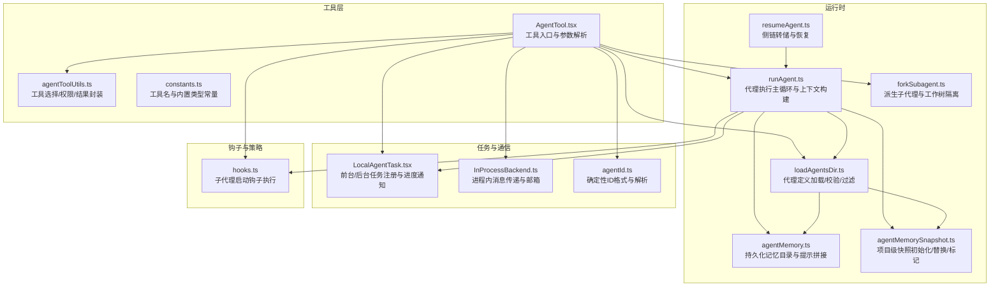

图表来源
- [AgentTool.tsx](file://src/tools/AgentTool/AgentTool.tsx)
- [runAgent.ts](file://src/tools/AgentTool/runAgent.ts)
- [loadAgentsDir.ts](file://src/tools/AgentTool/loadAgentsDir.ts)
- [agentMemory.ts](file://src/tools/AgentTool/agentMemory.ts)
- [agentMemorySnapshot.ts](file://src/tools/AgentTool/agentMemorySnapshot.ts)
- [agentToolUtils.ts](file://src/tools/AgentTool/agentToolUtils.ts)
- [LocalAgentTask.tsx](file://src/tasks/LocalAgentTask/LocalAgentTask.tsx)
- [InProcessBackend.ts](file://src/utils/swarm/backends/InProcessBackend.ts)
- [agentId.ts](file://src/utils/agentId.ts)
- [hooks.ts](file://src/utils/hooks.ts)
- [resumeAgent.ts](file://src/tools/AgentTool/resumeAgent.ts)
- [forkSubagent.ts](file://src/tools/AgentTool/forkSubagent.ts)

章节来源
- [AgentTool.tsx](file://src/tools/AgentTool/AgentTool.tsx)
- [runAgent.ts](file://src/tools/AgentTool/runAgent.ts)
- [loadAgentsDir.ts](file://src/tools/AgentTool/loadAgentsDir.ts)
- [agentMemory.ts](file://src/tools/AgentTool/agentMemory.ts)
- [agentMemorySnapshot.ts](file://src/tools/AgentTool/agentMemorySnapshot.ts)
- [agentToolUtils.ts](file://src/tools/AgentTool/agentToolUtils.ts)
- [LocalAgentTask.tsx](file://src/tasks/LocalAgentTask/LocalAgentTask.tsx)
- [InProcessBackend.ts](file://src/utils/swarm/backends/InProcessBackend.ts)
- [agentId.ts](file://src/utils/agentId.ts)
- [hooks.ts](file://src/utils/hooks.ts)
- [resumeAgent.ts](file://src/tools/AgentTool/resumeAgent.ts)
- [forkSubagent.ts](file://src/tools/AgentTool/forkSubagent.ts)

## 核心组件
- 工具入口与调度：负责参数解析、权限校验、MCP服务器可用性检查、工作树隔离、异步/同步路径分发、任务注册与通知。
- 代理运行器：构建系统提示、用户/系统上下文、工具池、MCP客户端集合；驱动 query 循环；记录侧链转储与元数据；产出最终结果。
- 定义加载与解析：从多源（内置/插件/用户/项目/策略）聚合代理定义；校验 frontmatter；按 MCP 要求过滤；注入记忆与技能；缓存去重。
- 内存与快照：支持 user/project/local 三档持久化记忆；项目级快照初始化/替换/同步标记；安全路径与远程挂载支持。
- 异步生命周期：统一的后台任务生命周期管理，含进度追踪、摘要生成、分类器审阅、工作树清理、通知与错误处理。
- 通信与ID：确定性 agentId 格式；进程内消息通过邮箱；名称路由表；请求ID扩展格式。
- 钩子与策略：子代理启动钩子；自动模式决策；工具权限与禁用列表；一次性内置代理尾部优化。

章节来源
- [AgentTool.tsx](file://src/tools/AgentTool/AgentTool.tsx)
- [runAgent.ts](file://src/tools/AgentTool/runAgent.ts)
- [loadAgentsDir.ts](file://src/tools/AgentTool/loadAgentsDir.ts)
- [agentMemory.ts](file://src/tools/AgentTool/agentMemory.ts)
- [agentMemorySnapshot.ts](file://src/tools/AgentTool/agentMemorySnapshot.ts)
- [agentToolUtils.ts](file://src/tools/AgentTool/agentToolUtils.ts)
- [LocalAgentTask.tsx](file://src/tasks/LocalAgentTask/LocalAgentTask.tsx)
- [InProcessBackend.ts](file://src/utils/swarm/backends/InProcessBackend.ts)
- [agentId.ts](file://src/utils/agentId.ts)
- [hooks.ts](file://src/utils/hooks.ts)
- [constants.ts](file://src/tools/AgentTool/constants.ts)

## 架构总览
下图展示一次典型代理调用从入口到完成的端到端流程，涵盖参数校验、定义解析、MCP准备、上下文构建、执行循环、侧链记录、任务通知与清理。

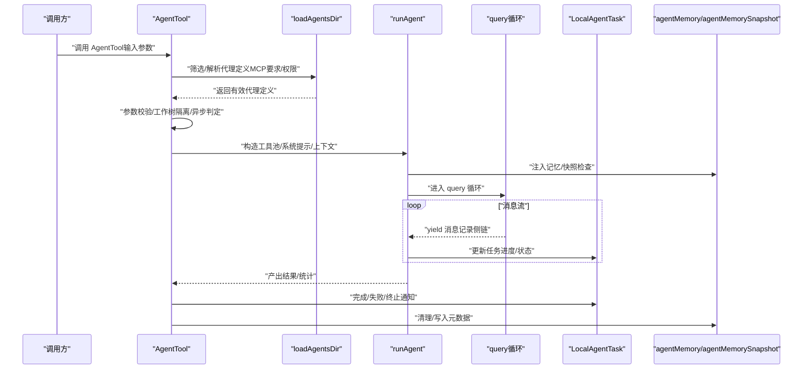

图表来源
- [AgentTool.tsx](file://src/tools/AgentTool/AgentTool.tsx)
- [runAgent.ts](file://src/tools/AgentTool/runAgent.ts)
- [loadAgentsDir.ts](file://src/tools/AgentTool/loadAgentsDir.ts)
- [agentMemory.ts](file://src/tools/AgentTool/agentMemory.ts)
- [agentMemorySnapshot.ts](file://src/tools/AgentTool/agentMemorySnapshot.ts)
- [LocalAgentTask.tsx](file://src/tasks/LocalAgentTask/LocalAgentTask.tsx)

## 详细组件分析

### 组件A：AgentTool 入口与生命周期编排
- 参数与Schema：定义基础输入（描述、提示、子代理类型、模型）与可选扩展（团队名、权限模式、隔离、工作目录），并根据特性开关裁剪字段。
- 权限与MCP：过滤代理以满足所需 MCP 服务器；等待连接/认证完成；校验权限规则与禁止列表。
- 异步/同步路径：根据 run_in_background/background/协作者/强制异步策略决定是否后台执行；后台路径注册任务、发送通知、汇总统计。
- 隔离与工作树：支持 worktree 远端隔离（外部构建禁用）；必要时注入路径转换提示；结束后按变更情况清理或保留。
- 多代理/团队：支持同队列多代理（teammate）与命名路由；对 in-process teammate 限制后台代理。
- 输出与进度：同步路径直接返回结果；异步路径返回任务ID与输出文件路径，支持轮询查看进度。

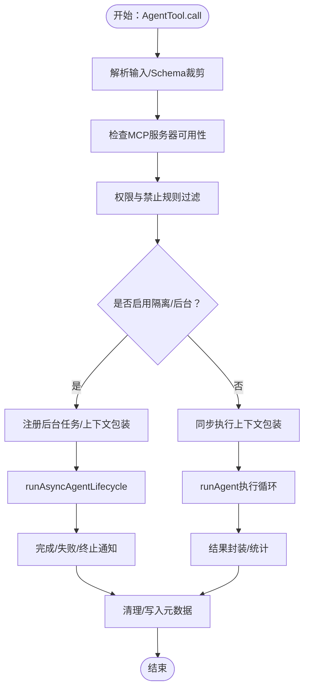

图表来源
- [AgentTool.tsx](file://src/tools/AgentTool/AgentTool.tsx)
- [agentToolUtils.ts](file://src/tools/AgentTool/agentToolUtils.ts)
- [LocalAgentTask.tsx](file://src/tasks/LocalAgentTask/LocalAgentTask.tsx)

章节来源
- [AgentTool.tsx](file://src/tools/AgentTool/AgentTool.tsx)
- [agentToolUtils.ts](file://src/tools/AgentTool/agentToolUtils.ts)
- [LocalAgentTask.tsx](file://src/tasks/LocalAgentTask/LocalAgentTask.tsx)

### 组件B：runAgent 代理执行主循环
- 上下文构建：合并/克隆文件状态缓存；解析用户/系统上下文；按 agent 定义覆盖权限模式/努力级别；注入额外上下文（钩子、技能、MCP工具）。
- 系统提示与工具：动态构建系统提示；根据 fork/exact 工具策略保持 API 前缀一致；记录初始消息与元数据。
- 执行循环：逐条消费 query 流事件；记录侧链转储；转发 TTFT 指标；处理附件消息与最大回合信号；按需保留工具使用结果。
- 清理与收尾：记录最终统计；触发摘要停止；写入元数据；异常时按中止/失败分支处理。

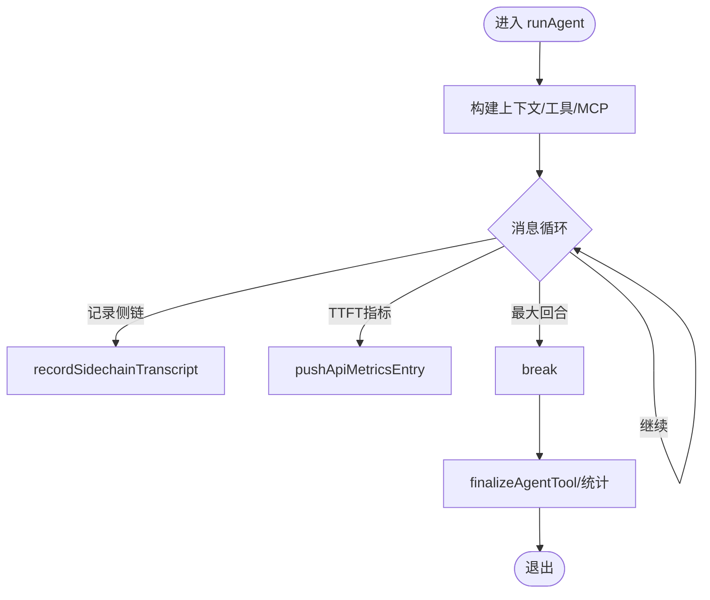

图表来源
- [runAgent.ts](file://src/tools/AgentTool/runAgent.ts)

章节来源
- [runAgent.ts](file://src/tools/AgentTool/runAgent.ts)

### 组件C：代理定义加载与解析（loadAgentsDir）
- 多源聚合：内置、插件、用户设置、项目设置、策略设置、标志设置；去重合并为 activeAgents。
- 校验与过滤：Zod Schema 校验；requiredMcpServers 匹配；颜色预设；记忆/隔离/最大回合/权限模式/effort 等 frontmatter 字段解析。
- 记忆与快照：当启用自动记忆时，自动注入读写工具；项目快照初始化/替换/同步标记；日志提示新快照可用。
- 缓存：基于当前工作目录的 memoize 缓存，避免重复解析。

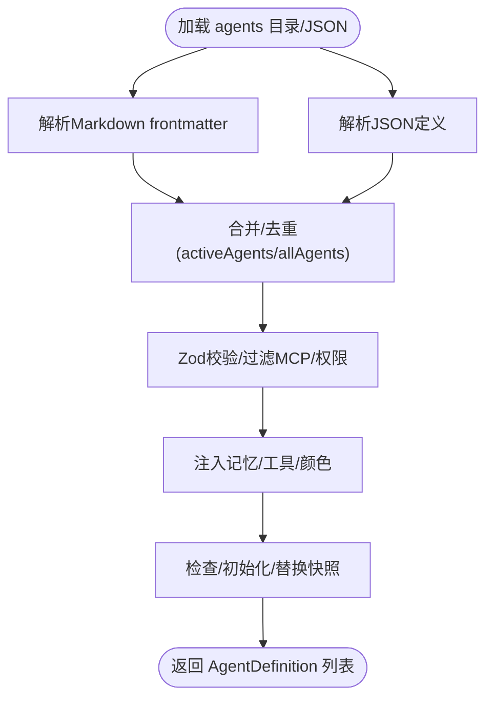

图表来源
- [loadAgentsDir.ts](file://src/tools/AgentTool/loadAgentsDir.ts)

章节来源
- [loadAgentsDir.ts](file://src/tools/AgentTool/loadAgentsDir.ts)

### 组件D：内存与快照（agentMemory / agentMemorySnapshot）
- 内存目录：支持 user/project/local 三种作用域；本地可指向远程挂载；路径规范化与安全检查。
- 提示拼接：按作用域生成记忆提示文本；首次使用自动创建目录。
- 快照机制：项目级快照存在时，首次使用复制到本地；后续比较时间戳决定是否提示更新；支持初始化/替换/仅标记已同步。

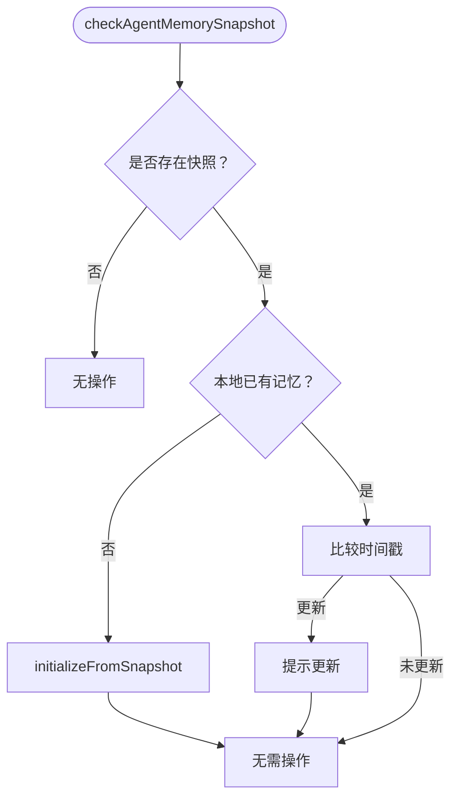

图表来源
- [agentMemory.ts](file://src/tools/AgentTool/agentMemory.ts)
- [agentMemorySnapshot.ts](file://src/tools/AgentTool/agentMemorySnapshot.ts)

章节来源
- [agentMemory.ts](file://src/tools/AgentTool/agentMemory.ts)
- [agentMemorySnapshot.ts](file://src/tools/AgentTool/agentMemorySnapshot.ts)

### 组件E：异步生命周期与任务管理（LocalAgentTask）
- 生命周期：注册/更新进度/完成/失败/终止；支持前台/后台任务切换；与 runAsyncAgentLifecycle 协作。
- 后台任务：独立 AbortController；进度追踪与 SDK 事件发射；工作树清理；通知队列。
- 前台任务：后台化/注销；中断信号解析；清理回调。

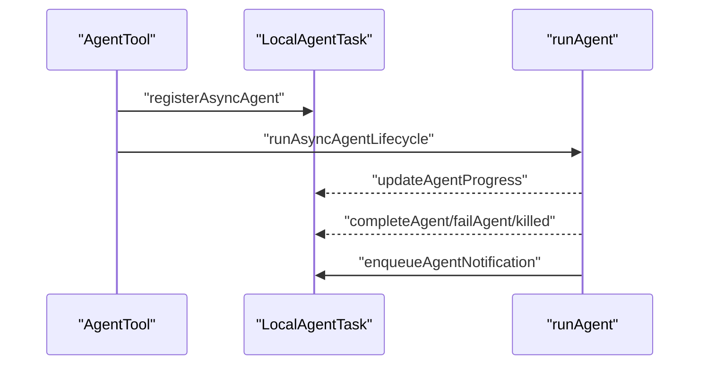

图表来源
- [LocalAgentTask.tsx](file://src/tasks/LocalAgentTask/LocalAgentTask.tsx)
- [agentToolUtils.ts](file://src/tools/AgentTool/agentToolUtils.ts)

章节来源
- [LocalAgentTask.tsx](file://src/tasks/LocalAgentTask/LocalAgentTask.tsx)
- [agentToolUtils.ts](file://src/tools/AgentTool/agentToolUtils.ts)

### 组件F：跨代理通信与ID规范（InProcessBackend / agentId）
- ID 规范：agentId 使用 “agentName@teamName” 格式；请求ID扩展为 “{requestType}-{timestamp}@{agentId}”。
- 进程内通信：通过文件邮箱写入消息；解析 agentId 获取 teamName/agentName；写入后记录调试日志。
- 名称路由：后台任务注册 name → agentId 映射，便于 SendMessage 路由。

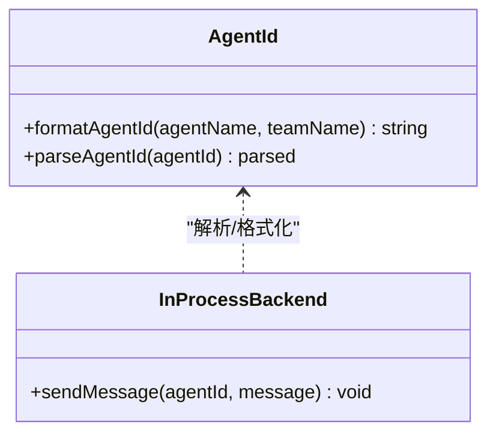

图表来源
- [agentId.ts](file://src/utils/agentId.ts)
- [InProcessBackend.ts](file://src/utils/swarm/backends/InProcessBackend.ts)

章节来源
- [agentId.ts](file://src/utils/agentId.ts)
- [InProcessBackend.ts](file://src/utils/swarm/backends/InProcessBackend.ts)

### 组件G：钩子与策略（hooks / agentToolUtils）
- 子代理启动钩子：在 runAgent 前执行，收集附加上下文；支持超时与取消信号。
- 自动模式决策：在 TRANSCRIPT_CLASSIFIER 开启时，对子代理输出进行安全分类，必要时警告或阻断。
- 工具权限：按内置/自定义/异步/计划模式应用不同禁用集；支持 Agent 工具允许的子代理类型白名单。

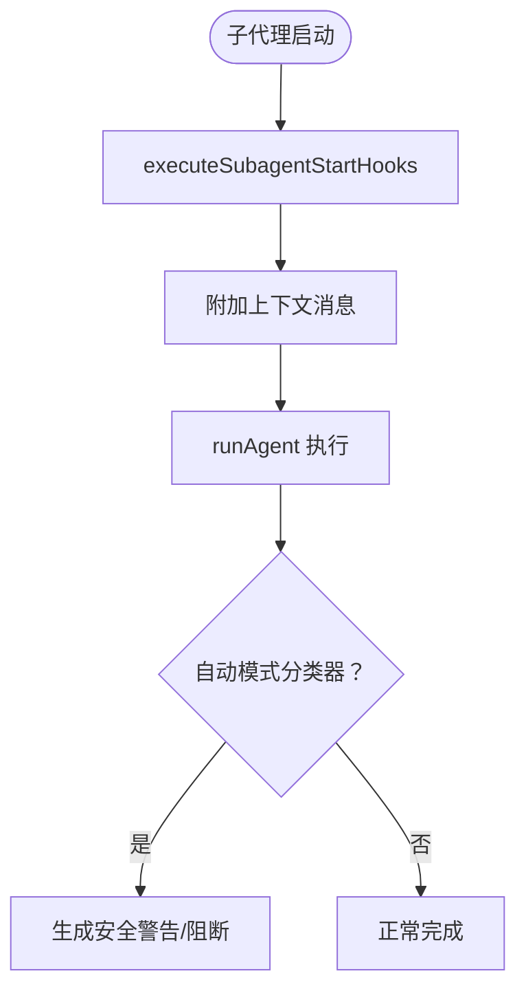

图表来源
- [hooks.ts](file://src/utils/hooks.ts)
- [agentToolUtils.ts](file://src/tools/AgentTool/agentToolUtils.ts)

章节来源
- [hooks.ts](file://src/utils/hooks.ts)
- [agentToolUtils.ts](file://src/tools/AgentTool/agentToolUtils.ts)

### 组件H：派生子代理与工作树隔离（forkSubagent / AgentTool）
- 派生子代理：fork 路径继承父系统提示与工具数组，确保 API 请求前缀一致；支持工作树隔离提示。
- 工作树：创建临时 git worktree；结束后检测变更，按需删除/保留；写入元数据以便恢复。

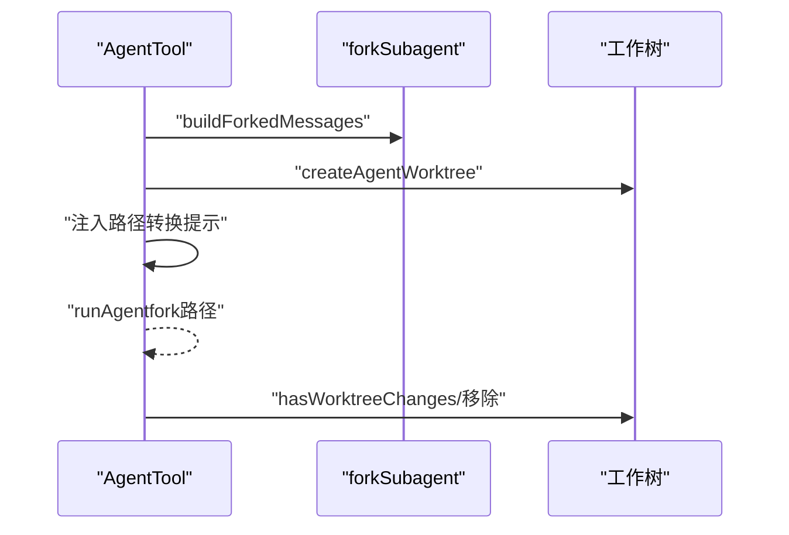

图表来源
- [AgentTool.tsx](file://src/tools/AgentTool/AgentTool.tsx)
- [forkSubagent.ts](file://src/tools/AgentTool/forkSubagent.ts)

章节来源
- [AgentTool.tsx](file://src/tools/AgentTool/AgentTool.tsx)
- [forkSubagent.ts](file://src/tools/AgentTool/forkSubagent.ts)

## 依赖关系分析
- 耦合与内聚：AgentTool 作为编排中心，与 runAgent、loadAgentsDir、LocalAgentTask、agentMemory、InProcessBackend 等模块高内聚低耦合；通过明确的接口（工具池、系统提示、上下文、AbortController）交互。
- 直接依赖：AgentTool 依赖 loadAgentsDir（定义）、agentToolUtils（工具解析/结果封装）、LocalAgentTask（任务生命周期）、InProcessBackend（进程内通信）、agentId（ID规范）、hooks（钩子）、forkSubagent（隔离与派生）。
- 外部依赖：MCP 客户端集合、文件系统（内存/快照）、任务存储（侧链转储/元数据）。

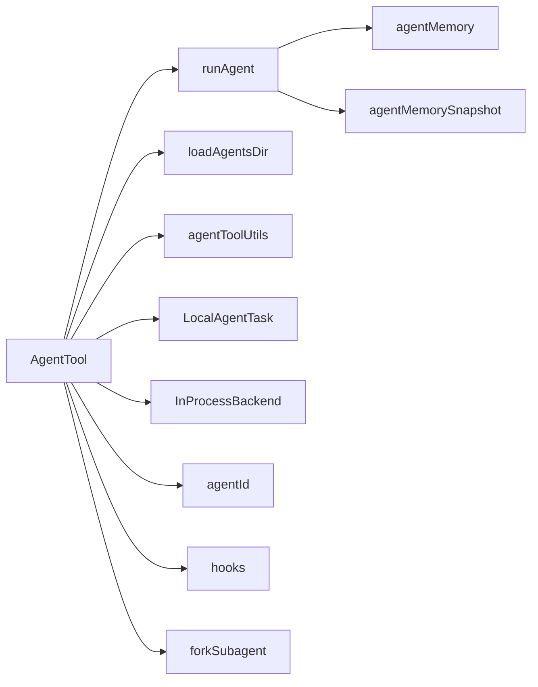

图表来源
- [AgentTool.tsx](file://src/tools/AgentTool/AgentTool.tsx)
- [runAgent.ts](file://src/tools/AgentTool/runAgent.ts)
- [loadAgentsDir.ts](file://src/tools/AgentTool/loadAgentsDir.ts)
- [agentToolUtils.ts](file://src/tools/AgentTool/agentToolUtils.ts)
- [LocalAgentTask.tsx](file://src/tasks/LocalAgentTask/LocalAgentTask.tsx)
- [InProcessBackend.ts](file://src/utils/swarm/backends/InProcessBackend.ts)
- [agentId.ts](file://src/utils/agentId.ts)
- [hooks.ts](file://src/utils/hooks.ts)
- [forkSubagent.ts](file://src/tools/AgentTool/forkSubagent.ts)
- [agentMemory.ts](file://src/tools/AgentTool/agentMemory.ts)
- [agentMemorySnapshot.ts](file://src/tools/AgentTool/agentMemorySnapshot.ts)

章节来源
- [AgentTool.tsx](file://src/tools/AgentTool/AgentTool.tsx)
- [runAgent.ts](file://src/tools/AgentTool/runAgent.ts)
- [loadAgentsDir.ts](file://src/tools/AgentTool/loadAgentsDir.ts)
- [agentToolUtils.ts](file://src/tools/AgentTool/agentToolUtils.ts)
- [LocalAgentTask.tsx](file://src/tasks/LocalAgentTask/LocalAgentTask.tsx)
- [InProcessBackend.ts](file://src/utils/swarm/backends/InProcessBackend.ts)
- [agentId.ts](file://src/utils/agentId.ts)
- [hooks.ts](file://src/utils/hooks.ts)
- [forkSubagent.ts](file://src/tools/AgentTool/forkSubagent.ts)
- [agentMemory.ts](file://src/tools/AgentTool/agentMemory.ts)
- [agentMemorySnapshot.ts](file://src/tools/AgentTool/agentMemorySnapshot.ts)

## 性能考量
- prompt 缓存一致性：fork 子代理使用父系统提示与父工具数组，保证 API 请求前缀一致，提升 prompt cache 命中率。
- 上下文裁剪：针对只读型子代理（如 Explore/Plan）剔除冗余上下文，减少 token 消耗。
- 异步优先：在 fork/协作者/助手模式下强制异步，避免主线程阻塞与输入队列积压。
- 文件状态缓存：克隆/复用文件状态缓存，降低 IO 成本。
- 摘要与分类器：后台摘要与自动模式分类器在后台线程执行，不影响主线程响应。

## 故障排查指南
- MCP 服务器不可用：确认 requiredMcpServers 是否匹配；等待连接/认证完成；若失败则抛出明确错误。
- 权限拒绝：检查 Agent 工具规则与禁止列表；计划模式下允许特定工具；确认 in-process teammate 不支持后台代理。
- 中止/失败：后台代理捕获 AbortError，标记 killed 并发出部分结果；其他异常标记 failed 并附带错误信息。
- 记忆/快照问题：检查快照时间戳与本地同步标记；必要时手动初始化/替换；确认路径安全与远程挂载可用。
- 工作树残留：未检测到变更时自动清理；若检测到变更则保留以便后续恢复。

章节来源
- [AgentTool.tsx](file://src/tools/AgentTool/AgentTool.tsx)
- [agentToolUtils.ts](file://src/tools/AgentTool/agentToolUtils.ts)
- [LocalAgentTask.tsx](file://src/tasks/LocalAgentTask/LocalAgentTask.tsx)
- [agentMemorySnapshot.ts](file://src/tools/AgentTool/agentMemorySnapshot.ts)

## 结论
AgentTool 通过清晰的入口编排、严谨的定义加载与解析、完善的异步生命周期管理、可靠的内存与快照机制以及灵活的跨代理通信，实现了高效、可控、可观测的代理管理体系。遵循本文最佳实践，可在保证安全性的同时最大化吞吐与稳定性。

## 附录

### 代理生命周期流程（创建—启动—暂停—恢复—销毁）
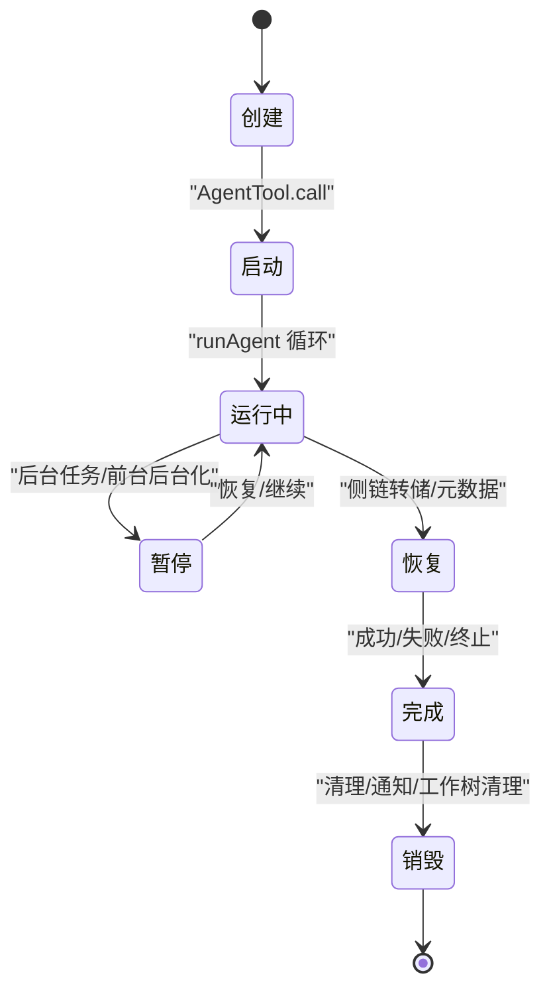

图表来源
- [AgentTool.tsx](file://src/tools/AgentTool/AgentTool.tsx)
- [runAgent.ts](file://src/tools/AgentTool/runAgent.ts)
- [LocalAgentTask.tsx](file://src/tasks/LocalAgentTask/LocalAgentTask.tsx)
- [resumeAgent.ts](file://src/tools/AgentTool/resumeAgent.ts)

### 代理配置选项清单
- 基础
  - 描述：简短任务描述（3–5词）
  - 提示：任务内容
  - 子代理类型：指定专用代理类型
  - 模型：覆盖代理定义中的模型
  - 后台运行：是否后台执行
- 多代理/团队
  - 名称：用于 SendMessage 路由
  - 团队名：当前团队上下文或指定团队
  - 权限模式：如 plan 需要审批
- 隔离
  - 工作树：在独立 git worktree 中执行
  - 远端：在远端 CCR 环境执行（ant 专属）
- 工作目录
  - cwd：覆盖文件系统与 shell 操作的工作目录（与工作树互斥）

章节来源
- [AgentTool.tsx](file://src/tools/AgentTool/AgentTool.tsx)
- [constants.ts](file://src/tools/AgentTool/constants.ts)