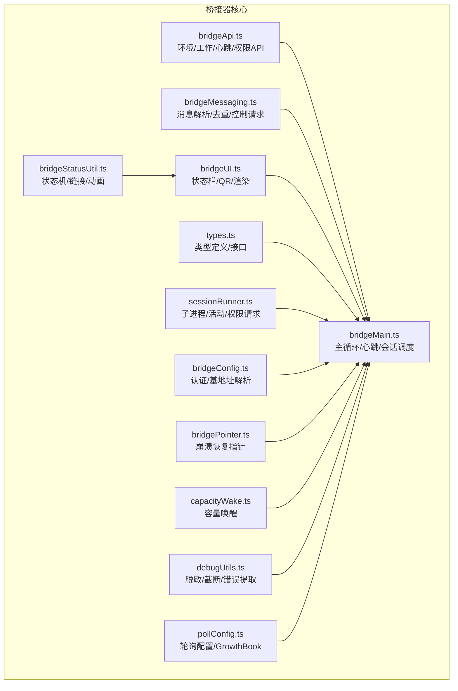
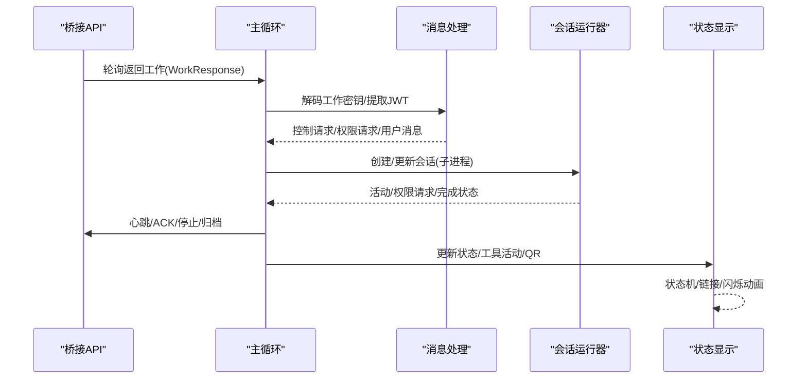
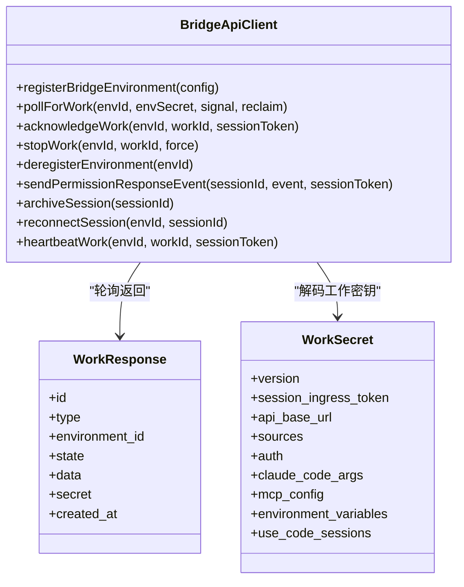
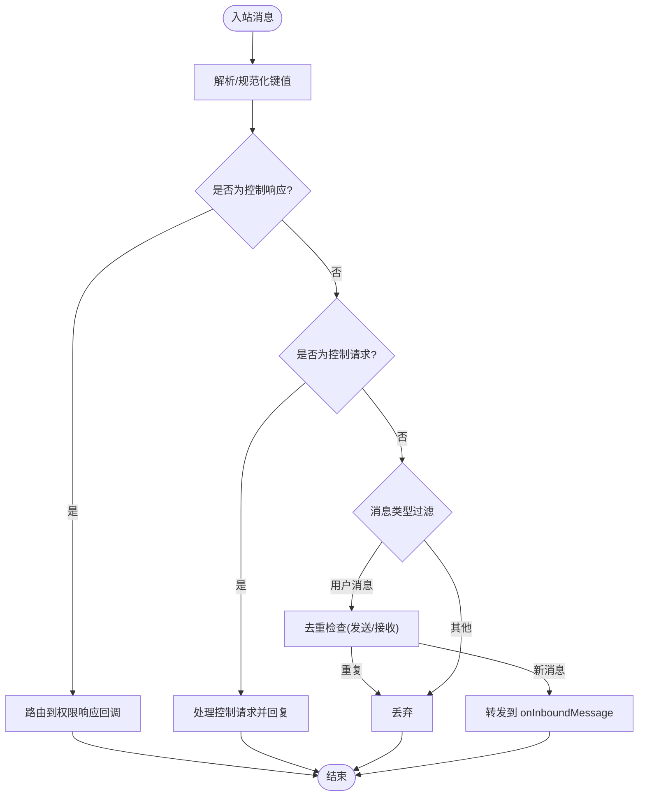
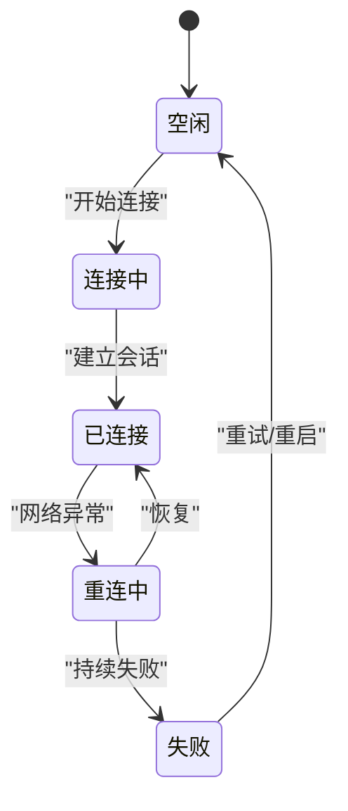
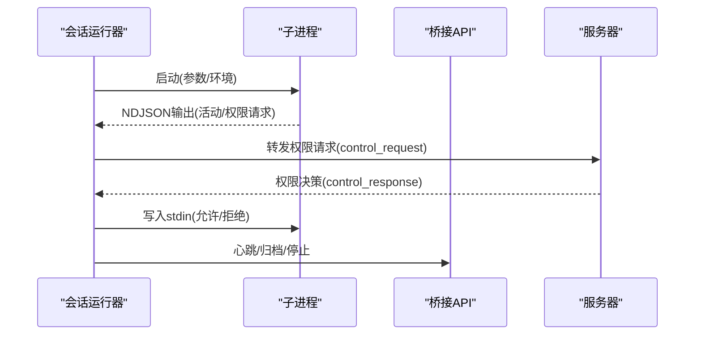
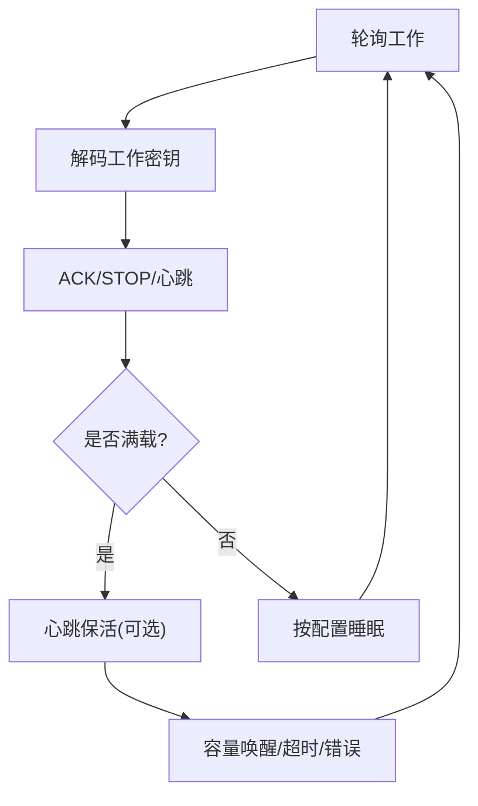
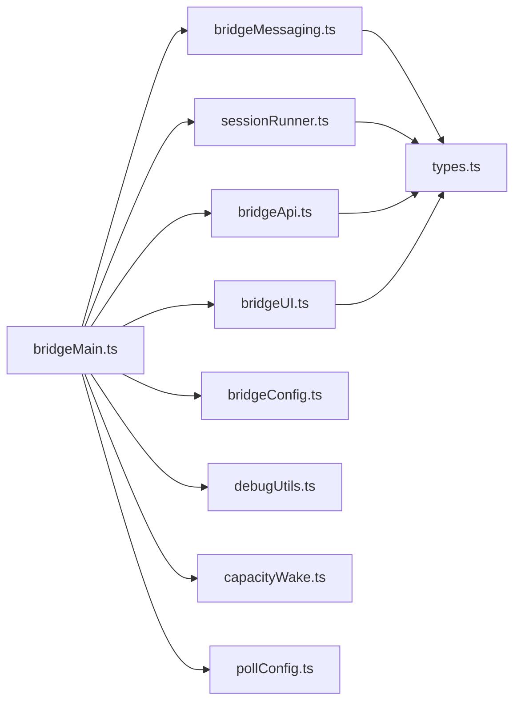

# 代理通信

<cite>
**本文引用的文件**
- [bridgeApi.ts](file://src/bridge/bridgeApi.ts)
- [bridgeMessaging.ts](file://src/bridge/bridgeMessaging.ts)
- [bridgeStatusUtil.ts](file://src/bridge/bridgeStatusUtil.ts)
- [bridgeUI.ts](file://src/bridge/bridgeUI.ts)
- [types.ts](file://src/bridge/types.ts)
- [bridgeMain.ts](file://src/bridge/bridgeMain.ts)
- [bridgeConfig.ts](file://src/bridge/bridgeConfig.ts)
- [bridgePointer.ts](file://src/bridge/bridgePointer.ts)
- [sessionRunner.ts](file://src/bridge/sessionRunner.ts)
- [inboundMessages.ts](file://src/bridge/inboundMessages.ts)
- [capacityWake.ts](file://src/bridge/capacityWake.ts)
- [debugUtils.ts](file://src/bridge/debugUtils.ts)
- [pollConfig.ts](file://src/bridge/pollConfig.ts)
</cite>

## 目录
1. [简介](#简介)
2. [项目结构](#项目结构)
3. [核心组件](#核心组件)
4. [架构总览](#架构总览)
5. [详细组件分析](#详细组件分析)
6. [依赖关系分析](#依赖关系分析)
7. [性能考量](#性能考量)
8. [故障排除指南](#故障排除指南)
9. [结论](#结论)
10. [附录](#附录)

## 简介
本文件面向“代理通信系统”的设计与实现，聚焦于多代理之间的消息传递、状态共享与协作协议；同时覆盖代理内存管理（共享内存池、数据同步与冲突解决）、代理显示系统（颜色编码、状态指示与可视化反馈）、代理工具实用函数与辅助能力，以及通信配置、性能优化与故障排除。文档以代码级细节为基础，辅以图示帮助不同技术背景的读者理解。

## 项目结构
该仓库围绕“桥接器（Bridge）”构建了完整的远程控制与会话编排体系，关键模块包括：
- 桥接 API 层：负责与后端服务交互、环境注册、工作轮询、心跳与权限事件上报等
- 消息处理层：统一解析与路由 SDK 消息、去重、控制请求响应
- 显示与状态层：桥接器状态机、QR 码、闪烁动画、链接生成与终端渲染
- 会话运行层：子进程会话生命周期管理、活动追踪、权限请求转发
- 配置与调试：认证来源、轮询策略、容量唤醒、调试脱敏与错误提取

**图表来源**
- [bridgeApi.ts:68-452](file://src/bridge/bridgeApi.ts#L68-L452)
- [bridgeMessaging.ts:132-391](file://src/bridge/bridgeMessaging.ts#L132-L391)
- [bridgeUI.ts:42-530](file://src/bridge/bridgeUI.ts#L42-L530)
- [bridgeStatusUtil.ts:9-166](file://src/bridge/bridgeStatusUtil.ts#L9-L166)
- [types.ts:16-265](file://src/bridge/types.ts#L16-L265)
- [bridgeMain.ts:141-800](file://src/bridge/bridgeMain.ts#L141-L800)
- [sessionRunner.ts:248-553](file://src/bridge/sessionRunner.ts#L248-L553)
- [bridgeConfig.ts:17-48](file://src/bridge/bridgeConfig.ts#L17-L48)
- [bridgePointer.ts:62-184](file://src/bridge/bridgePointer.ts#L62-L184)
- [capacityWake.ts:28-56](file://src/bridge/capacityWake.ts#L28-L56)
- [debugUtils.ts:26-144](file://src/bridge/debugUtils.ts#L26-L144)
- [pollConfig.ts:102-113](file://src/bridge/pollConfig.ts#L102-L113)

**章节来源**
- [bridgeApi.ts:68-452](file://src/bridge/bridgeApi.ts#L68-L452)
- [bridgeMessaging.ts:132-391](file://src/bridge/bridgeMessaging.ts#L132-L391)
- [bridgeUI.ts:42-530](file://src/bridge/bridgeUI.ts#L42-L530)
- [bridgeStatusUtil.ts:9-166](file://src/bridge/bridgeStatusUtil.ts#L9-L166)
- [types.ts:16-265](file://src/bridge/types.ts#L16-L265)
- [bridgeMain.ts:141-800](file://src/bridge/bridgeMain.ts#L141-L800)
- [sessionRunner.ts:248-553](file://src/bridge/sessionRunner.ts#L248-L553)
- [bridgeConfig.ts:17-48](file://src/bridge/bridgeConfig.ts#L17-L48)
- [bridgePointer.ts:62-184](file://src/bridge/bridgePointer.ts#L62-L184)
- [capacityWake.ts:28-56](file://src/bridge/capacityWake.ts#L28-L56)
- [debugUtils.ts:26-144](file://src/bridge/debugUtils.ts#L26-L144)
- [pollConfig.ts:102-113](file://src/bridge/pollConfig.ts#L102-L113)

## 核心组件
- 桥接 API 客户端：封装环境注册、工作轮询、ACK/STOP/心跳、权限事件上报、会话归档与重连等
- 消息处理工具：统一解析 SDK 消息、过滤 echo 与重复、路由控制请求、构造结果消息
- 状态与显示：状态机（空闲/连接中/已连接/重连/失败）、链接生成、QR 码、闪烁动画、工具活动展示
- 会话运行器：子进程生命周期、NDJSON 流解析、活动记录、权限请求转发、令牌更新
- 主循环：轮询策略、容量唤醒、心跳保活、超时与中断处理、崩溃恢复指针
- 配置与调试：认证来源优先级、基地址解析、轮询配置（GrowthBook）、脱敏与错误描述

**章节来源**
- [bridgeApi.ts:68-452](file://src/bridge/bridgeApi.ts#L68-L452)
- [bridgeMessaging.ts:132-391](file://src/bridge/bridgeMessaging.ts#L132-L391)
- [bridgeStatusUtil.ts:113-166](file://src/bridge/bridgeStatusUtil.ts#L113-L166)
- [bridgeUI.ts:42-530](file://src/bridge/bridgeUI.ts#L42-L530)
- [sessionRunner.ts:248-553](file://src/bridge/sessionRunner.ts#L248-L553)
- [bridgeMain.ts:141-800](file://src/bridge/bridgeMain.ts#L141-L800)
- [bridgeConfig.ts:17-48](file://src/bridge/bridgeConfig.ts#L17-L48)
- [pollConfig.ts:102-113](file://src/bridge/pollConfig.ts#L102-L113)
- [debugUtils.ts:26-144](file://src/bridge/debugUtils.ts#L26-L144)

## 架构总览
下图展示了桥接器如何在“环境—工作—会话—子进程”之间进行消息与状态流转，以及关键的去重、心跳与权限控制路径。

**图表来源**
- [bridgeMain.ts:600-800](file://src/bridge/bridgeMain.ts#L600-L800)
- [bridgeMessaging.ts:132-391](file://src/bridge/bridgeMessaging.ts#L132-L391)
- [sessionRunner.ts:248-553](file://src/bridge/sessionRunner.ts#L248-L553)
- [bridgeApi.ts:141-452](file://src/bridge/bridgeApi.ts#L141-L452)
- [bridgeUI.ts:42-530](file://src/bridge/bridgeUI.ts#L42-L530)

## 详细组件分析

### 组件A：桥接 API 客户端
- 功能要点
  - 环境注册：携带机器名、目录、分支、Git 仓库、最大会话数、元数据（worker 类型）
  - 工作轮询：支持 reclaim_older_than_ms 参数，空响应计数与日志节流
  - ACK/STOP：确认工作、强制停止工作项
  - 权限事件上报：通过会话事件 API 发送 control_response
  - 会话归档与重连：归档已完成会话、对过期会话触发服务器重排队列
  - 心跳：使用会话 ingress 令牌延长租约
  - 认证与重试：401 自动刷新（可选），统一错误分类与致命错误判定
- 关键类型
  - WorkResponse、WorkSecret、SessionActivity、BridgeConfig、BridgeApiClient 接口
- 错误处理
  - 401/403/404/410 区分处理；suppressible 403 可抑制显示；过期错误类型识别

**图表来源**
- [bridgeApi.ts:141-452](file://src/bridge/bridgeApi.ts#L141-L452)
- [types.ts:18-51](file://src/bridge/types.ts#L18-L51)

**章节来源**
- [bridgeApi.ts:68-452](file://src/bridge/bridgeApi.ts#L68-L452)
- [types.ts:18-51](file://src/bridge/types.ts#L18-L51)

### 组件B：消息处理与去重
- 功能要点
  - 入站消息解析：规范化控制消息键值，校验类型
  - 去重机制：基于 recentPostedUUIDs 与 recentInboundUUIDs 的双层去重（回声与重播）
  - 控制请求路由：initialize/set_model/set_max_thinking_tokens/set_permission_mode/interrupt
  - 结果消息：构造最小 result 成功消息用于归档
  - BoundedUUIDSet：环形缓冲去重集合，常数空间复杂度
- 适用场景
  - 多传输层复用同一套入站解析与控制响应逻辑
  - REPL 与无环境核心共享消息处理

**图表来源**
- [bridgeMessaging.ts:132-208](file://src/bridge/bridgeMessaging.ts#L132-L208)
- [bridgeMessaging.ts:243-391](file://src/bridge/bridgeMessaging.ts#L243-L391)
- [bridgeMessaging.ts:429-461](file://src/bridge/bridgeMessaging.ts#L429-L461)

**章节来源**
- [bridgeMessaging.ts:132-391](file://src/bridge/bridgeMessaging.ts#L132-L391)
- [bridgeMessaging.ts:429-461](file://src/bridge/bridgeMessaging.ts#L429-L461)

### 组件C：状态与显示系统
- 状态机
  - 状态：空闲、连接中、已连接、重连中、失败
  - 标签与颜色：根据错误、连接、会话状态映射
- 可视化
  - QR 码生成与切换
  - 闪烁动画（反向扫光）与分段渲染
  - 工具活动展示（过期时间控制）
  - 会话列表（多会话模式）与标题更新
- 链接生成
  - 连接 URL（空闲态）与会话 URL（活跃态）

**图表来源**
- [bridgeStatusUtil.ts:9-166](file://src/bridge/bridgeStatusUtil.ts#L9-L166)
- [bridgeUI.ts:42-530](file://src/bridge/bridgeUI.ts#L42-L530)

**章节来源**
- [bridgeStatusUtil.ts:9-166](file://src/bridge/bridgeStatusUtil.ts#L9-L166)
- [bridgeUI.ts:42-530](file://src/bridge/bridgeUI.ts#L42-L530)

### 组件D：会话运行与权限控制
- 子进程生命周期
  - 参数拼装、环境变量注入（含会话访问令牌、沙箱开关、CCR v2 标记）
  - NDJSON 输出解析、活动记录（最近 N 条）、stderr 缓冲
  - 权限请求转发：当子进程发出 can_use_tool 控制请求时，桥接器转发至服务器
  - 令牌更新：通过 stdin 发送 update_environment_variables，子进程动态刷新
- 活动摘要
  - 工具调用摘要、文本片段、结果/错误标记
- 会话标题
  - 首条真实用户消息派生标题，避免覆盖已设置标题

**图表来源**
- [sessionRunner.ts:248-553](file://src/bridge/sessionRunner.ts#L248-L553)
- [bridgeApi.ts:419-451](file://src/bridge/bridgeApi.ts#L419-L451)

**章节来源**
- [sessionRunner.ts:248-553](file://src/bridge/sessionRunner.ts#L248-L553)

### 组件E：主循环与容量管理
- 主循环职责
  - 轮询工作、解码工作密钥、ACK/STOP/心跳/归档
  - 容量管理：在满载时采用“心跳+可选轮询”策略，配合容量唤醒提前退出
  - 会话超时与中断：超时 watchdog 标记，区分真实失败与中断
  - 崩溃恢复：写入/读取/跨工作树扫描桥接指针，支持 --continue 恢复
- 容量唤醒
  - 合并外层信号与容量释放信号，睡眠时可被提前唤醒
- 轮询配置
  - GrowthBook 驱动的多维度轮询策略（不同容量下的间隔、回收窗口、心跳间隔）

**图表来源**
- [bridgeMain.ts:600-800](file://src/bridge/bridgeMain.ts#L600-L800)
- [capacityWake.ts:28-56](file://src/bridge/capacityWake.ts#L28-L56)
- [pollConfig.ts:102-113](file://src/bridge/pollConfig.ts#L102-L113)

**章节来源**
- [bridgeMain.ts:141-800](file://src/bridge/bridgeMain.ts#L141-L800)
- [capacityWake.ts:28-56](file://src/bridge/capacityWake.ts#L28-L56)
- [pollConfig.ts:102-113](file://src/bridge/pollConfig.ts#L102-L113)
- [bridgePointer.ts:62-184](file://src/bridge/bridgePointer.ts#L62-L184)

### 组件F：认证与配置解析
- 认证来源优先级
  - 开发者覆盖（仅 ant 用户）→ OAuth 存储
- 基地址解析
  - 开发者覆盖 → OAuth 配置
- 轮询配置
  - 从 GrowthBook 获取并校验，提供默认值与边界约束

**章节来源**
- [bridgeConfig.ts:17-48](file://src/bridge/bridgeConfig.ts#L17-L48)
- [pollConfig.ts:102-113](file://src/bridge/pollConfig.ts#L102-L113)

### 组件G：调试与错误提取
- 脱敏与截断
  - 敏感字段正则替换、长度截断
- 错误描述
  - 提取 axios 响应中的详细信息、HTTP 状态码提取
- 分析事件
  - 中央化桥接跳过事件记录

**章节来源**
- [debugUtils.ts:26-144](file://src/bridge/debugUtils.ts#L26-L144)

## 依赖关系分析
- 模块耦合
  - bridgeMain.ts 是中枢，依赖 API、消息、UI、运行器、配置、调试与容量唤醒
  - bridgeMessaging.ts 与 sessionRunner.ts 通过接口解耦，便于 REPL 与无环境核心复用
- 外部依赖
  - HTTP 客户端（axios）、子进程、NDJSON 解析、GrowthBook 配置中心
- 循环依赖
  - 未见直接循环；各模块通过接口与类型文件松耦合

**图表来源**
- [bridgeMain.ts:141-800](file://src/bridge/bridgeMain.ts#L141-L800)
- [bridgeApi.ts:68-452](file://src/bridge/bridgeApi.ts#L68-L452)
- [bridgeMessaging.ts:132-391](file://src/bridge/bridgeMessaging.ts#L132-L391)
- [bridgeUI.ts:42-530](file://src/bridge/bridgeUI.ts#L42-L530)
- [sessionRunner.ts:248-553](file://src/bridge/sessionRunner.ts#L248-L553)
- [bridgeConfig.ts:17-48](file://src/bridge/bridgeConfig.ts#L17-L48)
- [debugUtils.ts:26-144](file://src/bridge/debugUtils.ts#L26-L144)
- [capacityWake.ts:28-56](file://src/bridge/capacityWake.ts#L28-L56)
- [pollConfig.ts:102-113](file://src/bridge/pollConfig.ts#L102-L113)
- [types.ts:16-265](file://src/bridge/types.ts#L16-L265)

**章节来源**
- [bridgeMain.ts:141-800](file://src/bridge/bridgeMain.ts#L141-L800)
- [types.ts:16-265](file://src/bridge/types.ts#L16-L265)

## 性能考量
- 轮询与心跳
  - 使用 GrowthBook 配置动态调整轮询间隔与心跳频率，避免空转与过度轮询
  - 满载时采用“心跳+可选轮询”，结合容量唤醒减少等待
- 去重与日志
  - BoundedUUIDSet 保持常数空间；空轮询日志按阈值节流
- I/O 与解析
  - NDJSON 行式解析，stderr 环形缓冲限制内存占用
- 令牌刷新
  - v1 使用 OAuth 刷新；v2 通过服务器重排队列刷新，避免静默失效

[本节为通用指导，无需特定文件引用]

## 故障排除指南
- 认证失败（401/403）
  - 若存在 onAuth401 回调，尝试刷新令牌并重试一次；否则抛出致命错误
  - 对于 403，若为可抑制错误（如外部轮询权限或环境管理权限缺失），可不提示用户
- 会话过期（404/410）
  - 触发 reconnectSession 将会话重新入队；若环境不存在则终止
- 网络抖动与重连
  - 状态机自动进入“重连中”，成功后记录断开时长并统计
- 日志与脱敏
  - 使用 debugBody/redactSecrets 输出安全日志；必要时开启详细日志定位问题
- 崩溃恢复
  - 通过 bridge-pointer.json 恢复会话；跨工作树扫描以匹配最新指针

**章节来源**
- [bridgeApi.ts:454-541](file://src/bridge/bridgeApi.ts#L454-L541)
- [bridgeMain.ts:202-270](file://src/bridge/bridgeMain.ts#L202-L270)
- [debugUtils.ts:26-144](file://src/bridge/debugUtils.ts#L26-L144)
- [bridgePointer.ts:83-184](file://src/bridge/bridgePointer.ts#L83-L184)

## 结论
该代理通信系统通过“桥接 API + 消息去重 + 状态显示 + 会话运行 + 主循环调度”的分层设计，实现了稳定、可观测且可扩展的多代理协作框架。其关键优势在于：
- 明确的错误分类与致命错误判定，保障稳定性
- 基于 GrowthBook 的动态轮询策略，兼顾吞吐与资源消耗
- 强大的可视化与崩溃恢复能力，提升用户体验
- 严格的去重与脱敏机制，确保安全与可诊断性

[本节为总结，无需特定文件引用]

## 附录

### 附录A：代理内存管理与数据同步
- 共享内存池
  - 通过会话运行器的环形缓冲（activities/stderr）与 BoundedUUIDSet 实现有限内存内的状态与去重
- 数据同步
  - 会话活动通过 NDJSON 流实时同步；令牌更新通过 stdin 注入
- 冲突解决
  - 去重集合与 UUID 去重优先；服务端重播通过最近接收集二次去重

**章节来源**
- [sessionRunner.ts:346-553](file://src/bridge/sessionRunner.ts#L346-L553)
- [bridgeMessaging.ts:429-461](file://src/bridge/bridgeMessaging.ts#L429-L461)

### 附录B：代理显示系统（颜色/状态/可视化）
- 颜色编码
  - 状态标签与颜色映射：失败（红色）、重连（黄色）、活跃（绿色）
- 状态指示
  - 空闲/连接中/已连接/重连中/失败五态；会话计数与模式提示
- 可视化反馈
  - QR 码、闪烁动画（反向扫光）、工具活动摘要、会话列表

**章节来源**
- [bridgeStatusUtil.ts:113-166](file://src/bridge/bridgeStatusUtil.ts#L113-L166)
- [bridgeUI.ts:42-530](file://src/bridge/bridgeUI.ts#L42-L530)

### 附录C：代理工具实用函数与辅助能力
- 图像内容块标准化
  - 修复客户端字段差异（mediaType → media_type），避免后续 API 失败
- 消息字段提取
  - 从入站消息提取内容与 UUID，支持字符串与富内容块
- 调试与诊断
  - 脱敏输出、长度截断、错误详情提取、分析事件记录

**章节来源**
- [inboundMessages.ts:21-83](file://src/bridge/inboundMessages.ts#L21-L83)
- [debugUtils.ts:26-144](file://src/bridge/debugUtils.ts#L26-L144)

### 附录D：配置选项与性能优化
- 认证来源
  - 开发者覆盖 → OAuth 存储；基地址同理
- 轮询配置
  - 不同容量下的轮询间隔、心跳间隔、回收窗口、会话保活间隔
- 性能优化建议
  - 合理设置 at-capacity 策略，避免空转
  - 使用容量唤醒减少等待时间
  - 令牌刷新策略与 v1/v2 差异化处理

**章节来源**
- [bridgeConfig.ts:17-48](file://src/bridge/bridgeConfig.ts#L17-L48)
- [pollConfig.ts:102-113](file://src/bridge/pollConfig.ts#L102-L113)
- [bridgeMain.ts:600-800](file://src/bridge/bridgeMain.ts#L600-L800)

### 附录E：多代理协作案例与最佳实践
- 场景一：多会话并发
  - 使用多会话模式（worktree/same-dir），通过容量唤醒与心跳策略平衡负载
- 场景二：高可用与恢复
  - 启用崩溃恢复指针，跨工作树扫描定位最新会话；重连后自动续传
- 场景三：权限与安全
  - 严格控制 can_use_tool 的权限请求链路；对 403 可抑制错误不干扰用户
- 最佳实践
  - 为每个会话配置独立标题，便于识别与归档
  - 在 verbose 模式下保留调试日志与转录文件，便于问题定位

**章节来源**
- [bridgeMain.ts:553-591](file://src/bridge/bridgeMain.ts#L553-L591)
- [bridgePointer.ts:129-184](file://src/bridge/bridgePointer.ts#L129-L184)
- [sessionRunner.ts:417-444](file://src/bridge/sessionRunner.ts#L417-L444)