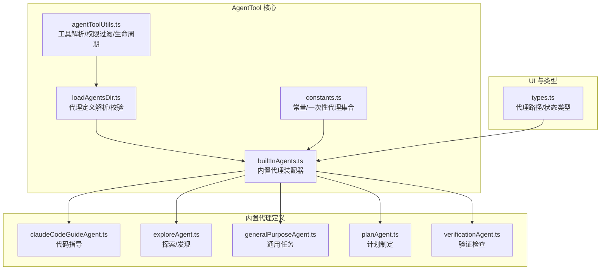
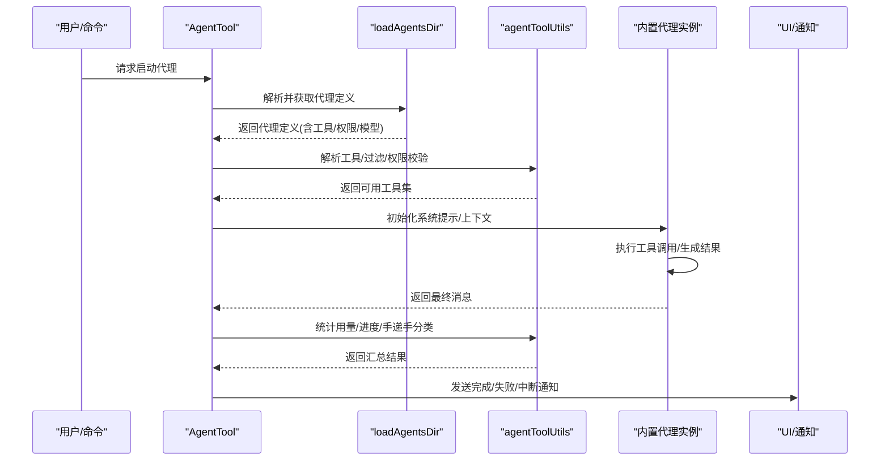
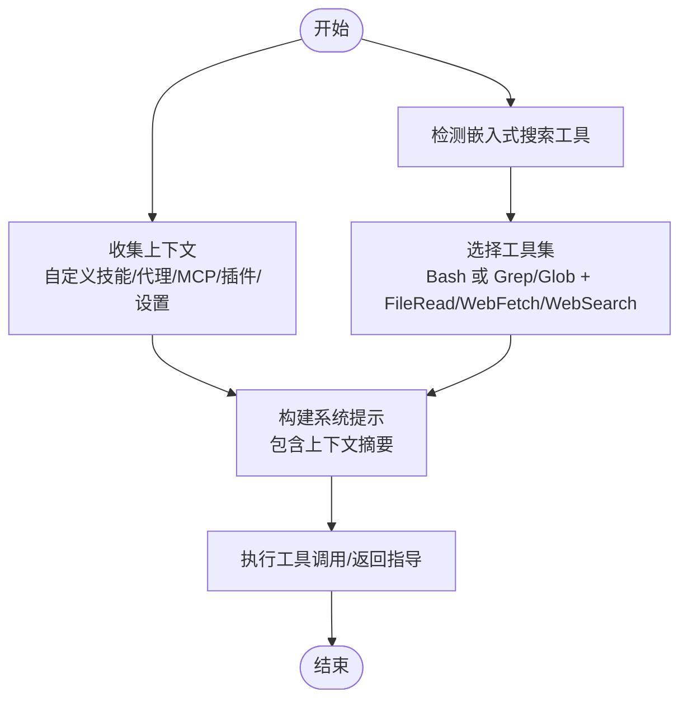
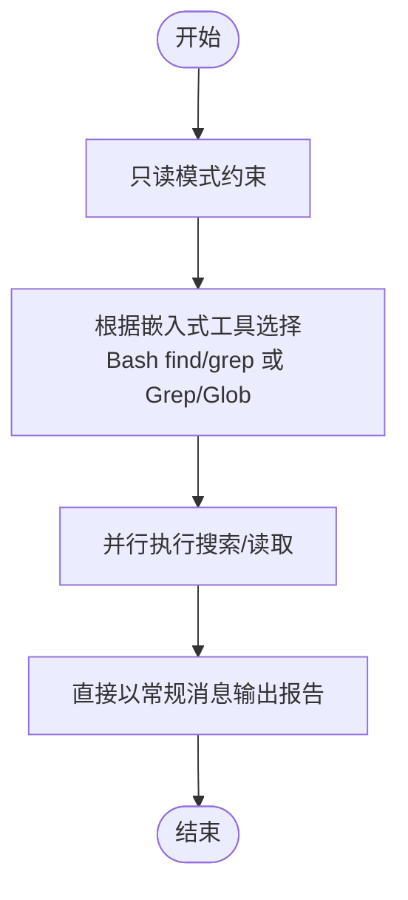
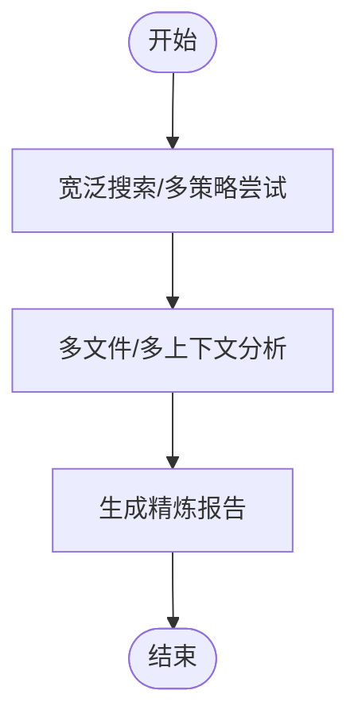
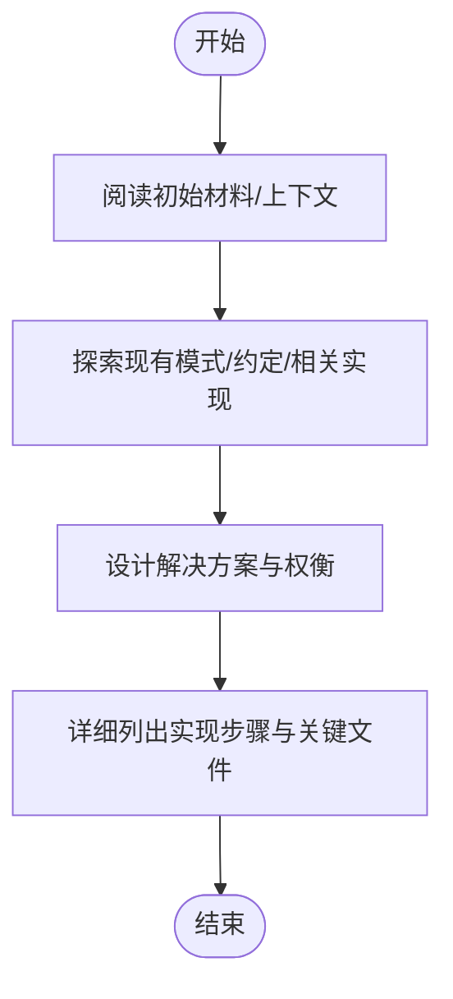
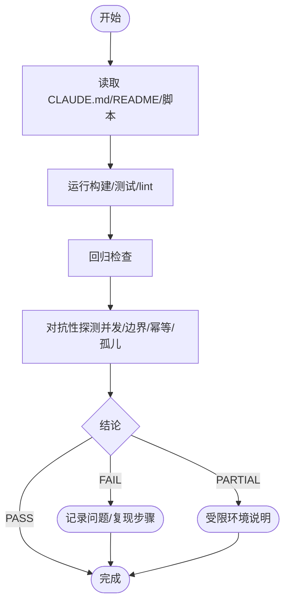
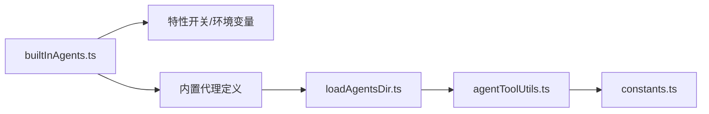

# 内置代理

<cite>
**本文引用的文件**
- [claudeCodeGuideAgent.ts](file://src/tools/AgentTool/built-in/claudeCodeGuideAgent.ts)
- [exploreAgent.ts](file://src/tools/AgentTool/built-in/exploreAgent.ts)
- [generalPurposeAgent.ts](file://src/tools/AgentTool/built-in/generalPurposeAgent.ts)
- [planAgent.ts](file://src/tools/AgentTool/built-in/planAgent.ts)
- [verificationAgent.ts](file://src/tools/AgentTool/built-in/verificationAgent.ts)
- [loadAgentsDir.ts](file://src/tools/AgentTool/loadAgentsDir.ts)
- [agentToolUtils.ts](file://src/tools/AgentTool/agentToolUtils.ts)
- [builtInAgents.ts](file://src/tools/AgentTool/builtInAgents.ts)
- [constants.ts](file://src/tools/AgentTool/constants.ts)
- [types.ts](file://src/components/agents/types.ts)
</cite>

## 目录
1. [简介](#简介)
2. [项目结构](#项目结构)
3. [核心组件](#核心组件)
4. [架构总览](#架构总览)
5. [详细组件分析](#详细组件分析)
6. [依赖关系分析](#依赖关系分析)
7. [性能考量](#性能考量)
8. [故障排查指南](#故障排查指南)
9. [结论](#结论)
10. [附录](#附录)

## 简介
本文件系统化梳理 Claude Code 内置代理体系，覆盖以下五大内置代理：
- Claude Code Guide Agent：面向用户使用与最佳实践的“代码指导”型代理，强调基于官方文档的权威指引与可操作建议。
- Explore Agent：专注“探索与发现”的只读代理，擅长快速文件检索、内容搜索与上下文理解，适合初步探查与问题定位。
- General Purpose Agent：通用任务处理代理，具备多步研究与跨文件分析能力，适合复杂问题的综合调查。
- Plan Agent：面向“计划制定与任务分解”的架构师代理，强调在不修改任何文件的前提下设计实现方案，并输出关键文件清单。
- Verification Agent：面向“代码验证与质量检查”的对抗式验证代理，通过系统化测试策略与边界探测，给出 PASS/FAIL/PARTIAL 结论。

文档将从架构、数据流、处理逻辑、集成点、错误处理与性能特征等维度进行深入解析，并提供各代理的使用场景、配置参数与性能特点，帮助开发者与使用者高效、安全地利用内置代理完成各类任务。

## 项目结构
内置代理定义集中于 AgentTool 的 built-in 子目录，代理加载与类型系统位于 AgentTool 的核心模块中，UI 展示与交互位于 components/agents 相关文件中。

图示来源
- [builtInAgents.ts:22-72](file://src/tools/AgentTool/builtInAgents.ts#L22-L72)
- [loadAgentsDir.ts:105-166](file://src/tools/AgentTool/loadAgentsDir.ts#L105-L166)
- [agentToolUtils.ts:122-225](file://src/tools/AgentTool/agentToolUtils.ts#L122-L225)
- [constants.ts:1-14](file://src/tools/AgentTool/constants.ts#L1-L14)
- [types.ts:4-29](file://src/components/agents/types.ts#L4-L29)

章节来源
- [builtInAgents.ts:22-72](file://src/tools/AgentTool/builtInAgents.ts#L22-L72)
- [loadAgentsDir.ts:105-166](file://src/tools/AgentTool/loadAgentsDir.ts#L105-L166)
- [agentToolUtils.ts:122-225](file://src/tools/AgentTool/agentToolUtils.ts#L122-L225)
- [constants.ts:1-14](file://src/tools/AgentTool/constants.ts#L1-L14)
- [types.ts:4-29](file://src/components/agents/types.ts#L4-L29)

## 核心组件
- 代理定义类型与解析
  - BaseAgentDefinition、BuiltInAgentDefinition、CustomAgentDefinition、PluginAgentDefinition 等类型统一描述代理元数据、工具集、权限模式、记忆与隔离等能力。
  - loadAgentsDir 提供代理定义的解析、校验、缓存与可用性过滤（含 MCP 服务器要求）。
- 工具解析与权限控制
  - agentToolUtils 负责工具集解析、通配符展开、禁用工具过滤、异步/同步子代理限制、权限模式适配与手递手分类器集成。
- 常量与一次性代理
  - constants 定义一次性内置代理集合（如 Explore/Plan），避免重复注入尾部提示与用量统计开销。
- 内置代理装配
  - builtInAgents 按环境与特性开关动态装配内置代理，支持协调者模式、入口点判断与 AB 实验控制。

章节来源
- [loadAgentsDir.ts:105-166](file://src/tools/AgentTool/loadAgentsDir.ts#L105-L166)
- [agentToolUtils.ts:70-116](file://src/tools/AgentTool/agentToolUtils.ts#L70-L116)
- [constants.ts:6-12](file://src/tools/AgentTool/constants.ts#L6-L12)
- [builtInAgents.ts:13-72](file://src/tools/AgentTool/builtInAgents.ts#L13-L72)

## 架构总览
内置代理的运行链路由“装配→解析→筛选→执行→通知”构成。下图展示一次典型调用流程：

图示来源
- [builtInAgents.ts:22-72](file://src/tools/AgentTool/builtInAgents.ts#L22-L72)
- [loadAgentsDir.ts:296-393](file://src/tools/AgentTool/loadAgentsDir.ts#L296-L393)
- [agentToolUtils.ts:508-686](file://src/tools/AgentTool/agentToolUtils.ts#L508-L686)

## 详细组件分析

### Claude Code Guide Agent（代码指导）
- 角色与职责
  - 面向用户使用与最佳实践，提供基于官方文档的权威指引；优先参考 Claude Code 文档、Agent SDK 文档与 Claude API 文档。
  - 在 3P 服务（Bedrock/Vertex/Foundry）环境下，反馈渠道替换为相应问题反馈通道。
- 工具集
  - 根据是否嵌入本地搜索工具，自动选择 Bash（find/grep）或 Grep/Glob + FileRead/WebFetch/WebSearch。
- 上下文注入
  - 动态注入自定义技能、自定义代理、MCP 服务器、插件命令与用户设置，形成“当前配置摘要”，辅助回答与建议。
- 使用场景
  - 用户询问 Claude Code、Agent SDK 或 Claude API 的使用方法、快捷键、钩子、设置与工作流。
- 性能与模型
  - 模型为 haiku，适合快速响应与简洁指导。
- 关键字段
  - agentType、tools、model、permissionMode、getSystemPrompt、omitClaudeMd（按需省略 CLAUDE.md）。

图示来源
- [claudeCodeGuideAgent.ts:23-87](file://src/tools/AgentTool/built-in/claudeCodeGuideAgent.ts#L23-L87)
- [claudeCodeGuideAgent.ts:98-204](file://src/tools/AgentTool/built-in/claudeCodeGuideAgent.ts#L98-L204)

章节来源
- [claudeCodeGuideAgent.ts:17-207](file://src/tools/AgentTool/built-in/claudeCodeGuideAgent.ts#L17-L207)
- [loadAgentsDir.ts:105-166](file://src/tools/AgentTool/loadAgentsDir.ts#L105-L166)

### Explore Agent（探索与发现）
- 角色与职责
  - 专注于“只读探索”，严格禁止任何文件写入与变更；擅长文件模式匹配、内容搜索与上下文分析。
- 工具集与限制
  - disallowedTools 明确禁止 Agent/退出计划/编辑/写入/笔记本编辑等工具，确保只读。
  - 根据嵌入式搜索工具决定使用 Bash 的 find/grep 或独立的 Grep/Glob。
- 模型与上下文
  - 外部用户默认使用 haiku；Ant 用户可继承主代理模型；可省略 CLAUDE.md 上下文以节省令牌。
- 使用场景
  - 快速查找文件、关键词搜索、回答“代码库如何工作”等问题；支持 quick/medium/very thorough 等细致度。
- 性能特点
  - 强调并发与高效搜索，鼓励并行工具调用以缩短响应时间。

图示来源
- [exploreAgent.ts:13-57](file://src/tools/AgentTool/built-in/exploreAgent.ts#L13-L57)
- [exploreAgent.ts:64-83](file://src/tools/AgentTool/built-in/exploreAgent.ts#L64-L83)

章节来源
- [exploreAgent.ts:1-85](file://src/tools/AgentTool/built-in/exploreAgent.ts#L1-L85)
- [constants.ts:6-12](file://src/tools/AgentTool/constants.ts#L6-L12)

### General Purpose Agent（通用任务）
- 角色与职责
  - 通用研究与多步任务代理，适合复杂问题的跨文件调查与综合分析。
- 工具集
  - tools: ['*'] 表示允许所有可用工具（经权限与异步规则过滤后生效）。
- 使用场景
  - 当不确定具体匹配位置时，交由该代理进行广泛搜索与多策略尝试。
- 性能与模型
  - 未显式指定模型，使用默认子代理模型；强调“完整但不冗余”的报告输出。

图示来源
- [generalPurposeAgent.ts:19-33](file://src/tools/AgentTool/built-in/generalPurposeAgent.ts#L19-L33)
- [generalPurposeAgent.ts:25-35](file://src/tools/AgentTool/built-in/generalPurposeAgent.ts#L25-L35)

章节来源
- [generalPurposeAgent.ts:1-36](file://src/tools/AgentTool/built-in/generalPurposeAgent.ts#L1-L36)
- [agentToolUtils.ts:122-225](file://src/tools/AgentTool/agentToolUtils.ts#L122-L225)

### Plan Agent（计划制定与任务分解）
- 角色与职责
  - 软件架构师与规划专家，负责在不修改任何文件的前提下设计实现方案。
- 工具集与限制
  - 与 Explore Agent 共享工具集，但明确禁止 Agent/退出计划/编辑/写入/笔记本编辑等工具。
  - 可直接读取 CLAUDE.md（omitClaudeMd=false），用于理解约定与规范。
- 输出规范
  - 必须包含“实现计划步骤”与“最关键的 3-5 个文件清单”，并强调不可写入。
- 使用场景
  - 需要制定实现策略、识别关键文件、考虑架构权衡与依赖顺序时。

图示来源
- [planAgent.ts:14-71](file://src/tools/AgentTool/built-in/planAgent.ts#L14-L71)
- [planAgent.ts:73-92](file://src/tools/AgentTool/built-in/planAgent.ts#L73-L92)

章节来源
- [planAgent.ts:1-94](file://src/tools/AgentTool/built-in/planAgent.ts#L1-L94)

### Verification Agent（代码验证与质量检查）
- 角色与职责
  - 对实现进行对抗式验证，目标是“发现最后 20% 的问题”，而非仅满足前 80% 的表面正确。
- 禁止行为
  - 严禁在项目目录内创建/修改/删除文件、安装依赖、执行 git 写操作等。
- 验证策略
  - 前端/后端/CLI/基础设施/库/修复/移动端/数据管线/数据库迁移/重构等类型均有针对性策略。
  - 强制执行对抗性探测（并发、边界值、幂等性、孤儿操作等）。
- 报告格式
  - 每项检查必须包含“命令执行”“观察到的输出”“结果（PASS/FAIL）”，并以 VERDICT: 结论收尾。
- 使用场景
  - 在非 trivial 任务完成后（如 3+ 文件修改、后端/API/基础设施变更）进行验证。

图示来源
- [verificationAgent.ts:10-129](file://src/tools/AgentTool/built-in/verificationAgent.ts#L10-L129)
- [verificationAgent.ts:134-153](file://src/tools/AgentTool/built-in/verificationAgent.ts#L134-L153)

章节来源
- [verificationAgent.ts:1-154](file://src/tools/AgentTool/built-in/verificationAgent.ts#L1-L154)

## 依赖关系分析
- 代理装配与特性开关
  - builtInAgents 根据特性开关、环境变量与入口点动态启用 Explore/Plan/Code Guide/Verification 等代理。
- 工具解析与权限过滤
  - agentToolUtils 将可用工具池与代理定义中的 tools/disallowedTools/permissionMode/异步限制等结合，生成最终可用工具集。
- 一次性内置代理
  - constants 中的 ONE_SHOT_BUILTIN_AGENT_TYPES 列表用于跳过一次性内置代理的尾部提示与用量统计，降低令牌消耗。

图示来源
- [builtInAgents.ts:22-72](file://src/tools/AgentTool/builtInAgents.ts#L22-L72)
- [loadAgentsDir.ts:296-393](file://src/tools/AgentTool/loadAgentsDir.ts#L296-L393)
- [agentToolUtils.ts:122-225](file://src/tools/AgentTool/agentToolUtils.ts#L122-L225)
- [constants.ts:6-12](file://src/tools/AgentTool/constants.ts#L6-L12)

章节来源
- [builtInAgents.ts:13-72](file://src/tools/AgentTool/builtInAgents.ts#L13-L72)
- [agentToolUtils.ts:70-116](file://src/tools/AgentTool/agentToolUtils.ts#L70-L116)
- [constants.ts:6-12](file://src/tools/AgentTool/constants.ts#L6-L12)

## 性能考量
- 令牌与上下文优化
  - Explore/Plan 两类一次性内置代理被标记为一次性，避免注入尾部提示与用量统计，显著降低每周数千万次调用的令牌开销。
- 工具解析与权限过滤
  - 在 agentToolUtils 中对工具进行一次性解析与过滤，减少后续执行阶段的重复计算。
- 并发与只读
  - Explore/Plan 强调并行工具调用与只读约束，提升响应速度并避免副作用。
- 模型选择
  - Guide/Explore/Plan 默认使用轻量模型（haiku/inherit），在保证效果的同时降低成本。

章节来源
- [constants.ts:6-12](file://src/tools/AgentTool/constants.ts#L6-L12)
- [agentToolUtils.ts:122-225](file://src/tools/AgentTool/agentToolUtils.ts#L122-L225)
- [exploreAgent.ts:76-82](file://src/tools/AgentTool/built-in/exploreAgent.ts#L76-L82)
- [planAgent.ts:87-91](file://src/tools/AgentTool/built-in/planAgent.ts#L87-L91)

## 故障排查指南
- 代理未出现或不可用
  - 检查 builtInAgents 的特性开关与环境变量（如禁用内置代理的环境变量仅在非交互模式生效）。
  - 确认 MCP 服务器要求是否满足（requiredMcpServers）。
- 工具不可用或被拒绝
  - 核对 agentToolUtils 的工具过滤规则（全局禁用、自定义代理禁用、异步限制、权限模式）。
  - 检查 disallowedTools 是否误禁用了所需工具。
- 结果为空或无文本
  - 检查 agentToolUtils 的 finalizeAgentTool 是否能提取到文本内容（回退到最近的文本块）。
- 验证失败
  - 按 verificationAgent 的检查模板逐项核对命令、输出与结论；确保对抗性探测已执行且有证据。
- 一次性代理提示缺失
  - 确认该代理类型是否在 constants 的一次性列表中，若是则预期不会附加尾部提示。

章节来源
- [builtInAgents.ts:22-72](file://src/tools/AgentTool/builtInAgents.ts#L22-L72)
- [loadAgentsDir.ts:223-255](file://src/tools/AgentTool/loadAgentsDir.ts#L223-L255)
- [agentToolUtils.ts:70-116](file://src/tools/AgentTool/agentToolUtils.ts#L70-L116)
- [agentToolUtils.ts:276-357](file://src/tools/AgentTool/agentToolUtils.ts#L276-L357)
- [verificationAgent.ts:84-129](file://src/tools/AgentTool/built-in/verificationAgent.ts#L84-L129)
- [constants.ts:6-12](file://src/tools/AgentTool/constants.ts#L6-L12)

## 结论
内置代理体系通过清晰的角色分工与严格的工具/权限控制，实现了从“使用指导”“探索发现”“通用研究”“计划制定”到“验证检查”的全链路覆盖。借助特性开关、环境变量与一次性代理优化，系统在保证安全性与效果的同时，显著降低了令牌与成本开销。建议在实际使用中：
- 根据任务类型选择合适代理（探索用 Explore/Plan，复杂问题用 General Purpose，需要实现策略用 Plan，需要权威指导用 Guide，需要验证用 Verification）。
- 合理配置工具集与权限模式，避免不必要的工具暴露。
- 在大规模调用场景下，充分利用一次性代理与只读约束，优化性能与成本。

## 附录
- 代理类型与用途概览
  - Claude Code Guide Agent：使用指导与最佳实践，优先参考官方文档。
  - Explore Agent：只读探索，快速文件/内容检索。
  - General Purpose Agent：通用研究与多步任务。
  - Plan Agent：架构师计划，不写入，输出关键文件清单。
  - Verification Agent：对抗式验证，强制证据与结论。
- 关键配置参数
  - tools/disallowedTools：工具白/黑名单。
  - permissionMode：权限模式（如 plan）。
  - model/omitClaudeMd：模型选择与上下文裁剪。
  - requiredMcpServers：MCP 服务器可用性要求。
- 性能与成本
  - 一次性内置代理减少尾部提示与用量统计；只读代理避免副作用与额外成本。