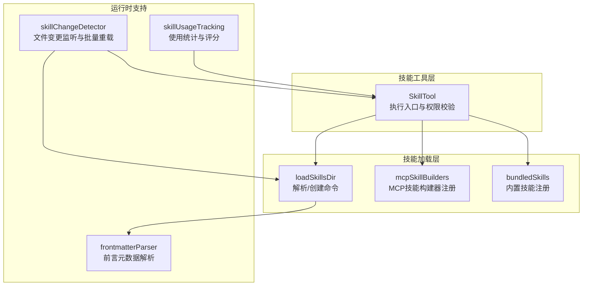
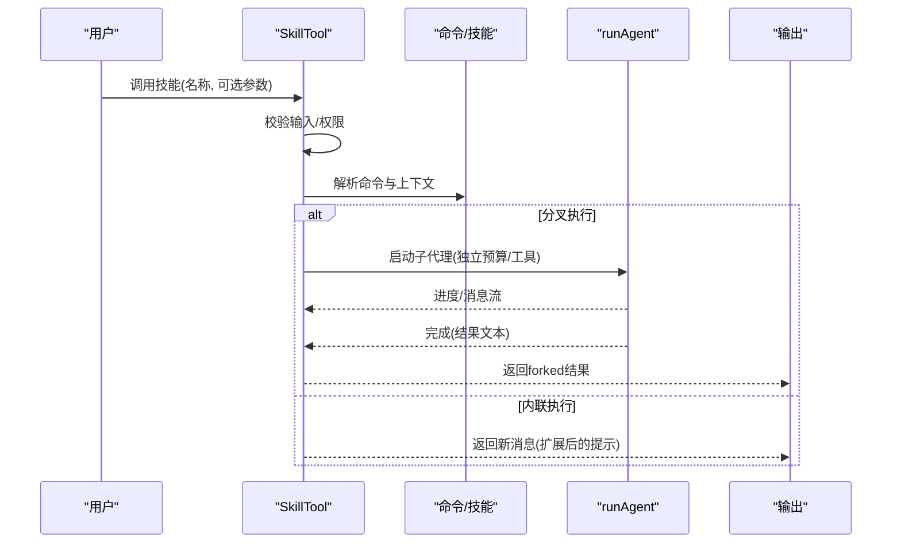
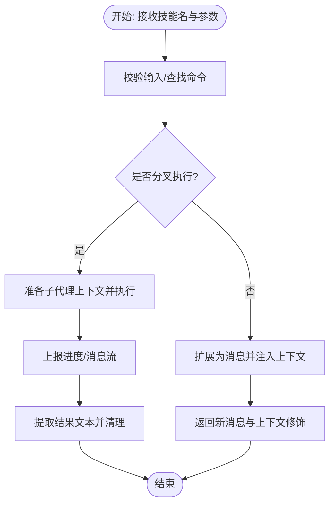
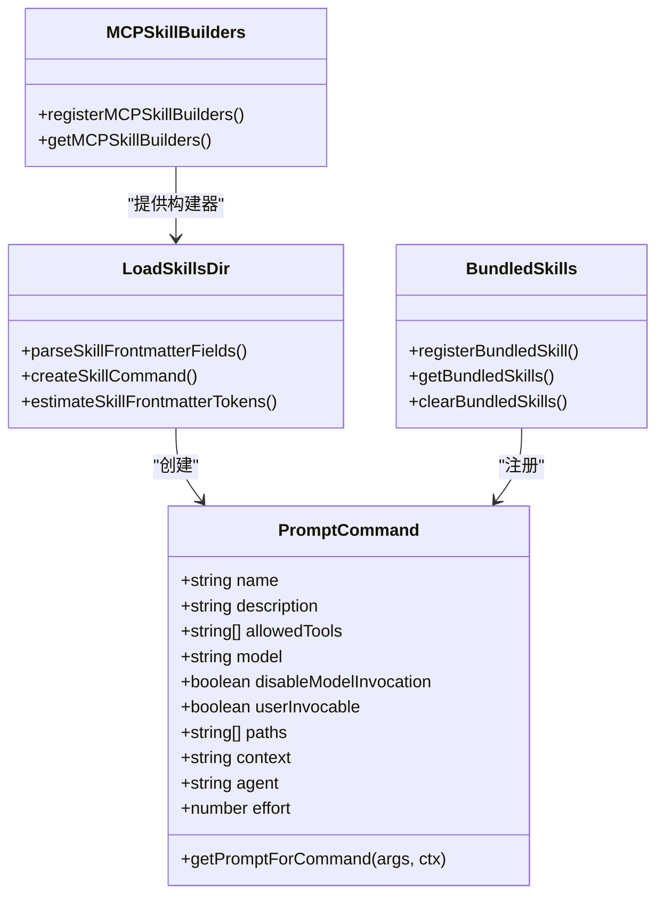
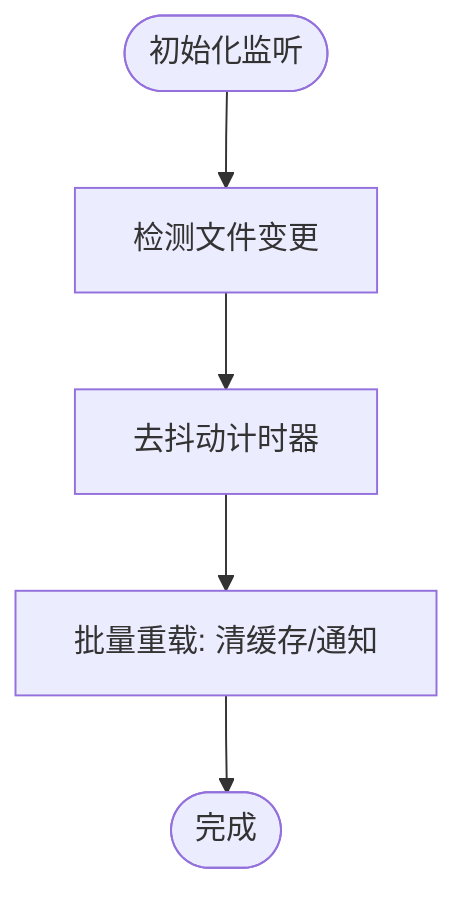
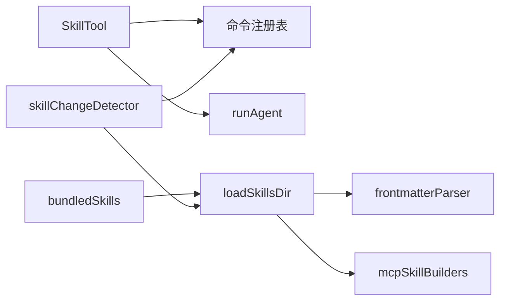

# 技能执行

<cite>
**本文引用的文件**
- [SkillTool.ts](file://src/tools/SkillTool/SkillTool.ts)
- [bundledSkills.ts](file://src/skills/bundledSkills.ts)
- [loadSkillsDir.ts](file://src/skills/loadSkillsDir.ts)
- [mcpSkillBuilders.ts](file://src/skills/mcpSkillBuilders.ts)
- [skillChangeDetector.ts](file://src/utils/skills/skillChangeDetector.ts)
- [skillUsageTracking.ts](file://src/utils/suggestions/skillUsageTracking.ts)
- [subsystems.md](file://docs/subsystems.md)
- [frontmatterParser.ts](file://src/utils/frontmatterParser.ts)
</cite>

## 目录
1. [简介](#简介)
2. [项目结构](#项目结构)
3. [核心组件](#核心组件)
4. [架构总览](#架构总览)
5. [详细组件分析](#详细组件分析)
6. [依赖关系分析](#依赖关系分析)
7. [性能考量](#性能考量)
8. [故障排查指南](#故障排查指南)
9. [结论](#结论)
10. [附录](#附录)

## 简介
本文件围绕 SkillTool 的技能执行引擎进行系统化说明，涵盖以下主题：
- 技能定义格式与参数传递机制
- 技能加载与注册（本地、插件、MCP、内置）
- 执行模式：内联执行与子代理分叉执行
- 结果处理与消息渲染
- 缓存与变更检测、性能优化与资源管理
- 技能组合、链式调用与并行执行能力
- 开发指南：编写规范、测试与调试
- 技能商店、分享与版本管理最佳实践

## 项目结构
与技能执行相关的关键模块如下：
- 技能工具入口与执行逻辑：SkillTool
- 技能加载与解析：loadSkillsDir、mcpSkillBuilders
- 内置技能注册：bundledSkills
- 变更检测与缓存刷新：skillChangeDetector
- 使用统计与排序：skillUsageTracking
- 前言元数据解析：frontmatterParser

**图表来源**
- [SkillTool.ts:1-120](file://src/tools/SkillTool/SkillTool.ts#L1-L120)
- [loadSkillsDir.ts:180-401](file://src/skills/loadSkillsDir.ts#L180-L401)
- [mcpSkillBuilders.ts:25-46](file://src/skills/mcpSkillBuilders.ts#L25-L46)
- [bundledSkills.ts:43-108](file://src/skills/bundledSkills.ts#L43-L108)
- [skillChangeDetector.ts:82-170](file://src/utils/skills/skillChangeDetector.ts#L82-L170)
- [skillUsageTracking.ts:1-57](file://src/utils/suggestions/skillUsageTracking.ts#L1-L57)
- [frontmatterParser.ts:130-175](file://src/utils/frontmatterParser.ts#L130-L175)

**章节来源**
- [subsystems.md:188-226](file://docs/subsystems.md#L188-L226)

## 核心组件
- SkillTool：对外暴露的工具接口，负责输入校验、权限决策、执行模式选择（内联/分叉）、结果映射与消息注入。
- loadSkillsDir：从磁盘或旧版目录加载技能，解析前言元数据，生成命令对象；支持路径过滤、钩子、模型与努力度等配置。
- mcpSkillBuilders：在不形成循环依赖的前提下，向 MCP 技能发现提供构建器注册与获取。
- bundledSkills：内置技能注册表与提取逻辑，支持首次调用时将参考文件解压到安全目录。
- skillChangeDetector：基于 chokidar 的文件变更监听，对频繁变更进行去抖动合并，避免事件风暴导致的死锁。
- skillUsageTracking：记录技能使用频次与最近使用时间，计算带半衰期的使用分数，用于排序与推荐。

**章节来源**
- [SkillTool.ts:331-869](file://src/tools/SkillTool/SkillTool.ts#L331-L869)
- [loadSkillsDir.ts:180-401](file://src/skills/loadSkillsDir.ts#L180-L401)
- [mcpSkillBuilders.ts:25-46](file://src/skills/mcpSkillBuilders.ts#L25-L46)
- [bundledSkills.ts:43-108](file://src/skills/bundledSkills.ts#L43-L108)
- [skillChangeDetector.ts:24-81](file://src/utils/skills/skillChangeDetector.ts#L24-L81)
- [skillUsageTracking.ts:1-57](file://src/utils/suggestions/skillUsageTracking.ts#L1-L57)

## 架构总览
SkillTool 的执行路径分为两条主线：
- 内联执行：直接扩展为一组消息并返回，适合轻量、无副作用的技能。
- 分叉执行：在隔离子代理中运行，适合需要独立预算、工具集或长耗时任务的技能。

**图表来源**
- [SkillTool.ts:580-841](file://src/tools/SkillTool/SkillTool.ts#L580-L841)
- [SkillTool.ts:118-289](file://src/tools/SkillTool/SkillTool.ts#L118-L289)

## 详细组件分析

### 组件一：SkillTool（技能工具）
职责与关键点：
- 输入/输出模式：输入为技能名与可选参数；输出根据执行模式返回内联或分叉结果。
- 权限与规则：支持显式允许/拒绝规则、前缀匹配、自动允许“仅安全属性”的技能。
- 执行模式：
  - 内联：通过 processPromptSlashCommand 将技能扩展为消息，注入工具使用标识与上下文修饰。
  - 分叉：prepareForkedCommandContext 准备子代理上下文，runAgent 在独立代理中执行，进度通过回调上报。
- 结果映射：将内联结果映射为工具结果消息；分叉结果以“已分叉完成”形式呈现。
- 遥测与追踪：记录调用来源、查询深度、父代理ID、是否来自发现等指标。

**图表来源**
- [SkillTool.ts:580-841](file://src/tools/SkillTool/SkillTool.ts#L580-L841)
- [SkillTool.ts:118-289](file://src/tools/SkillTool/SkillTool.ts#L118-L289)

**章节来源**
- [SkillTool.ts:291-329](file://src/tools/SkillTool/SkillTool.ts#L291-L329)
- [SkillTool.ts:354-430](file://src/tools/SkillTool/SkillTool.ts#L354-L430)
- [SkillTool.ts:432-578](file://src/tools/SkillTool/SkillTool.ts#L432-L578)
- [SkillTool.ts:580-841](file://src/tools/SkillTool/SkillTool.ts#L580-L841)
- [SkillTool.ts:843-869](file://src/tools/SkillTool/SkillTool.ts#L843-L869)

### 组件二：技能加载与注册（loadSkillsDir、mcpSkillBuilders、bundledSkills）
职责与关键点：
- loadSkillsDir
  - 支持多源目录：策略设置、用户设置、项目设置、附加目录、旧版 commands。
  - 解析前言元数据：描述、用途、工具白名单、模型、努力度、路径过滤、钩子、执行上下文、代理等。
  - 创建命令对象：统一为 PromptCommand，支持动态替换变量（如会话ID、技能目录）。
  - 去重与条件技能：按真实路径去重；支持 paths 前言触发条件技能延迟激活。
- mcpSkillBuilders
  - 注册/获取构建器，避免模块循环依赖，确保 MCP 发现阶段可用。
- bundledSkills
  - 注册内置技能；首次调用时将参考文件写入安全目录，前置基目录头以便模型按需读取/搜索。

**图表来源**
- [loadSkillsDir.ts:180-401](file://src/skills/loadSkillsDir.ts#L180-L401)
- [mcpSkillBuilders.ts:25-46](file://src/skills/mcpSkillBuilders.ts#L25-L46)
- [bundledSkills.ts:15-108](file://src/skills/bundledSkills.ts#L15-L108)

**章节来源**
- [loadSkillsDir.ts:180-401](file://src/skills/loadSkillsDir.ts#L180-L401)
- [loadSkillsDir.ts:403-401](file://src/skills/loadSkillsDir.ts#L403-L401)
- [mcpSkillBuilders.ts:25-46](file://src/skills/mcpSkillBuilders.ts#L25-L46)
- [bundledSkills.ts:43-108](file://src/skills/bundledSkills.ts#L43-L108)

### 组件三：变更检测与缓存（skillChangeDetector）
职责与关键点：
- 文件监听：对用户/项目/附加目录中的技能与命令目录进行监控。
- 去抖动合并：将短时间内大量变更合并为一次重载，避免事件风暴与死锁。
- 清理与通知：清空缓存、重置已发送技能集合、触发订阅者。

**图表来源**
- [skillChangeDetector.ts:247-279](file://src/utils/skills/skillChangeDetector.ts#L247-L279)

**章节来源**
- [skillChangeDetector.ts:82-170](file://src/utils/skills/skillChangeDetector.ts#L82-L170)
- [skillChangeDetector.ts:247-279](file://src/utils/skills/skillChangeDetector.ts#L247-L279)

### 组件四：使用统计与排序（skillUsageTracking）
职责与关键点：
- 记录使用次数与最近使用时间，带 7 天半衰期的指数衰减评分。
- 写入去抖动：每分钟内多次调用仅写入一次，降低 I/O 压力。

**章节来源**
- [skillUsageTracking.ts:1-57](file://src/utils/suggestions/skillUsageTracking.ts#L1-L57)

## 依赖关系分析
- SkillTool 依赖命令注册表与上下文，支持本地与 MCP 技能合并。
- loadSkillsDir 依赖 frontmatterParser 解析元数据，并通过 mcpSkillBuilders 提供的构建器创建命令。
- bundledSkills 与 loadSkillsDir 共同保证内置技能的可用性与首次调用时的安全文件提取。
- skillChangeDetector 与 commands 缓存协同，保障动态技能的热更新。

**图表来源**
- [SkillTool.ts:81-94](file://src/tools/SkillTool/SkillTool.ts#L81-L94)
- [loadSkillsDir.ts:180-401](file://src/skills/loadSkillsDir.ts#L180-L401)
- [mcpSkillBuilders.ts:25-46](file://src/skills/mcpSkillBuilders.ts#L25-L46)
- [bundledSkills.ts:43-108](file://src/skills/bundledSkills.ts#L43-L108)
- [skillChangeDetector.ts:82-170](file://src/utils/skills/skillChangeDetector.ts#L82-L170)

**章节来源**
- [SkillTool.ts:81-94](file://src/tools/SkillTool/SkillTool.ts#L81-L94)
- [loadSkillsDir.ts:180-401](file://src/skills/loadSkillsDir.ts#L180-L401)

## 性能考量
- 并行加载：技能目录扫描与旧版 commands 加载采用并行策略，减少启动时延。
- 去抖动重载：文件变更合并重载，避免高频事件导致的 CPU 与 I/O 峰值。
- 缓存与去重：按真实路径去重，避免重复加载同一文件；命令与技能缓存按需清理。
- 模型与努力度：技能可覆盖模型与努力度，影响子代理预算与行为。
- 进度上报：分叉执行时逐步上报消息，便于前端及时反馈与内存回收。

[本节为通用性能建议，无需特定文件引用]

## 故障排查指南
常见问题与定位思路：
- 技能未被识别
  - 检查命令是否存在、是否禁用模型调用、是否为 prompt 类型。
  - 确认是否处于 bare 模式或策略限制下导致未发现。
- 权限被拒绝
  - 查看允许/拒绝规则，确认是否命中前缀规则；必要时添加精确或前缀规则。
- 执行异常或卡住
  - 分叉执行时关注进度消息；检查工具使用标识与消息过滤逻辑。
  - 若为远程技能，确认发现状态与加载结果。
- 变更未生效
  - 确认文件监听是否初始化；查看去抖动时间窗；检查配置变更钩子是否阻断重载。
- 性能问题
  - 观察事件风暴（大量文件同时变更）是否触发频繁重载；适当延长去抖动时间。

**章节来源**
- [SkillTool.ts:354-430](file://src/tools/SkillTool/SkillTool.ts#L354-L430)
- [SkillTool.ts:432-578](file://src/tools/SkillTool/SkillTool.ts#L432-L578)
- [SkillTool.ts:580-841](file://src/tools/SkillTool/SkillTool.ts#L580-L841)
- [skillChangeDetector.ts:247-279](file://src/utils/skills/skillChangeDetector.ts#L247-L279)

## 结论
SkillTool 将技能定义、加载、权限与执行整合为统一的工具层，既支持轻量内联执行，也支持高隔离性的分叉执行。通过前言元数据驱动的配置、严格的权限控制、文件变更去抖动与使用统计，系统在易用性、安全性与性能之间取得平衡。结合插件与 MCP 的扩展能力，SkillTool 为技能生态提供了可组合、可演进的执行基础。

[本节为总结性内容，无需特定文件引用]

## 附录

### 技能定义格式与参数传递
- 基本字段
  - 名称、描述、何时使用、工具白名单、模型覆盖、是否禁用模型调用、是否用户可调用、版本、执行上下文、代理、努力度、shell 执行、钩子等。
- 参数传递
  - 技能名作为输入；可选参数在内联执行时由 processPromptSlashCommand 展开。
- 前言元数据解析
  - 使用 frontmatterParser 提取与规范化元数据，支持路径展开、布尔解析、正整数解析等。

**章节来源**
- [loadSkillsDir.ts:180-265](file://src/skills/loadSkillsDir.ts#L180-L265)
- [frontmatterParser.ts:130-175](file://src/utils/frontmatterParser.ts#L130-L175)

### 技能缓存系统与资源管理
- 缓存清理
  - 文件变更触发批量清理：清空技能与命令缓存、重置已发送技能集合。
- 资源安全
  - 内置技能首次调用时将参考文件写入受控目录，防止路径逃逸与越权访问。
- 进度与内存
  - 分叉执行后及时释放消息与内容占用，避免内存累积。

**章节来源**
- [skillChangeDetector.ts:247-279](file://src/utils/skills/skillChangeDetector.ts#L247-L279)
- [bundledSkills.ts:131-220](file://src/skills/bundledSkills.ts#L131-L220)
- [SkillTool.ts:264-289](file://src/tools/SkillTool/SkillTool.ts#L264-L289)

### 技能组合、链式调用与并行执行
- 链式调用
  - 内联执行返回的消息可作为后续提示的一部分；分叉执行的结果可被上层代理进一步编排。
- 并行执行
  - 多个分叉子代理可并行运行，各自拥有独立预算与工具集；注意并发数量与资源上限。
- 依赖与顺序
  - 通过工具白名单与上下文修饰控制工具使用范围，避免跨代理冲突。

[本节为概念性说明，无需特定文件引用]

### 技能开发指南
- 编写规范
  - 使用前言元数据声明用途、工具白名单、模型与努力度；合理使用 paths 限定触发范围。
  - 优先使用安全属性，避免引入需要额外权限的新字段。
- 测试方法
  - 单独验证前言元数据解析与命令创建；在 bare 模式下验证独立加载；使用变更检测验证热更新。
- 调试技巧
  - 关注遥测事件与日志；利用进度回调观察消息流；检查工具使用标识与消息过滤。

**章节来源**
- [loadSkillsDir.ts:180-401](file://src/skills/loadSkillsDir.ts#L180-L401)
- [SkillTool.ts:871-933](file://src/tools/SkillTool/SkillTool.ts#L871-L933)
- [skillChangeDetector.ts:82-170](file://src/utils/skills/skillChangeDetector.ts#L82-L170)

### 技能商店、分享与版本管理最佳实践
- 版本管理
  - 使用 version 字段标注技能版本；结合使用统计与评分进行推荐与回滚。
- 分享机制
  - 插件市场与 MCP 通道可承载技能分发；官方市场与第三方仓库区分展示。
- 最佳实践
  - 明确技能边界与工具白名单；提供清晰的 whenToUse 与 argumentHint；定期清理不再使用的技能。

**章节来源**
- [SkillTool.ts:935-942](file://src/tools/SkillTool/SkillTool.ts#L935-L942)
- [subsystems.md:197-215](file://docs/subsystems.md#L197-L215)