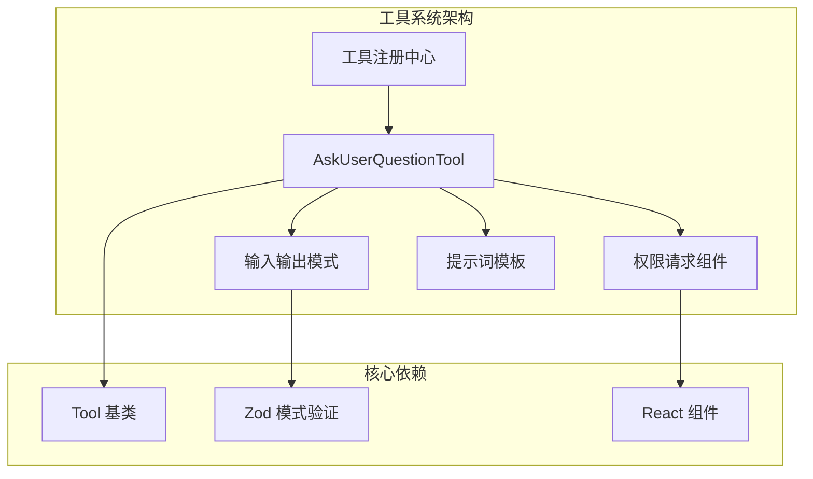
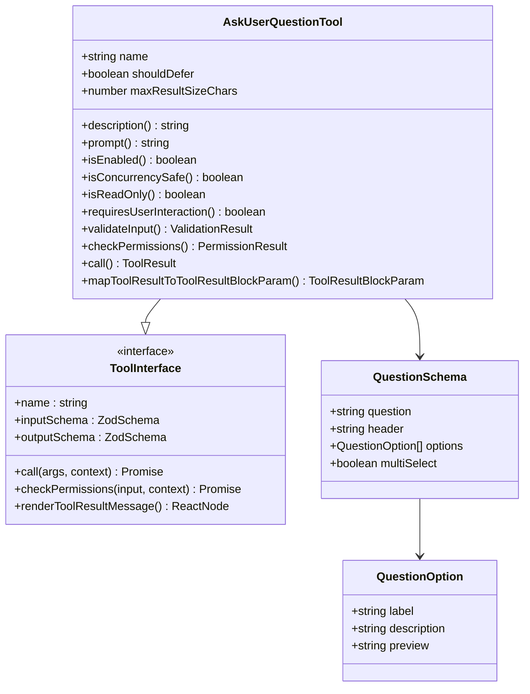
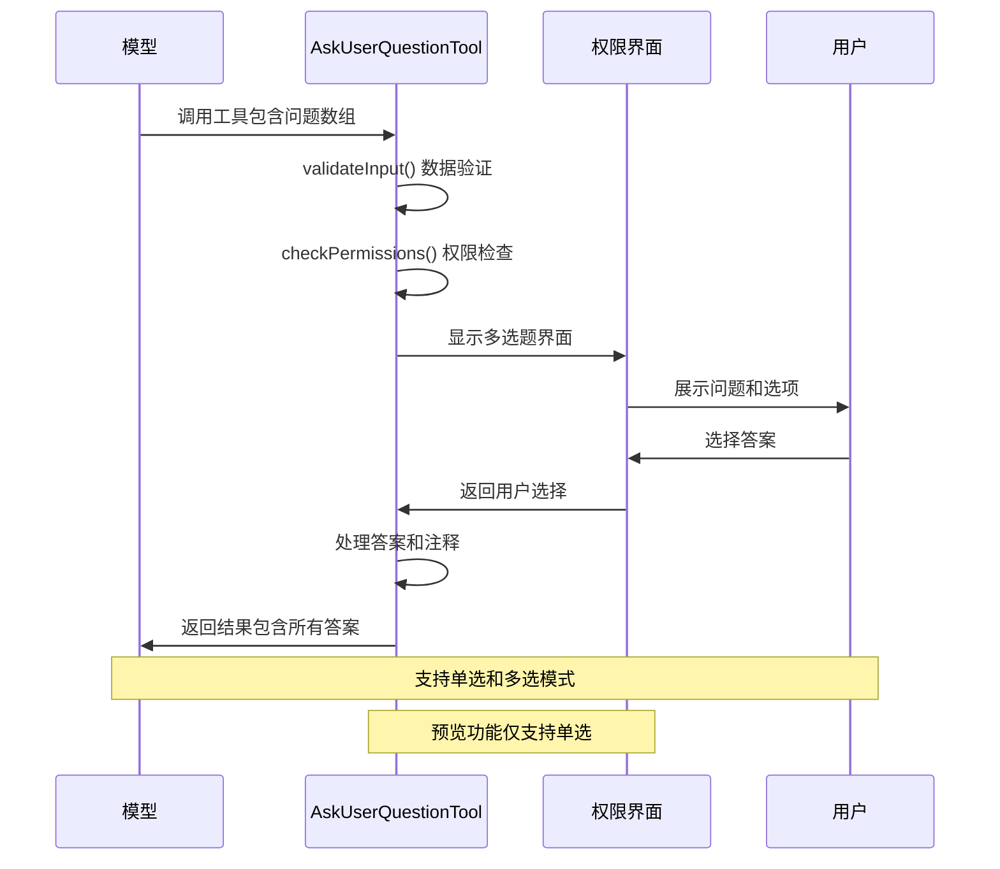
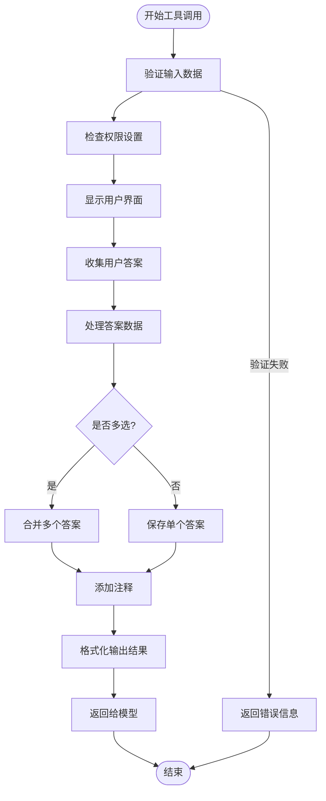
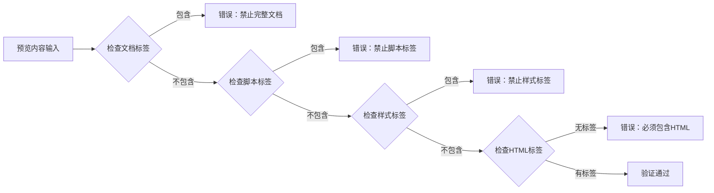
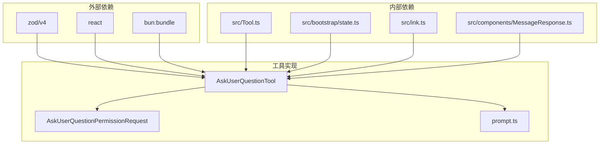
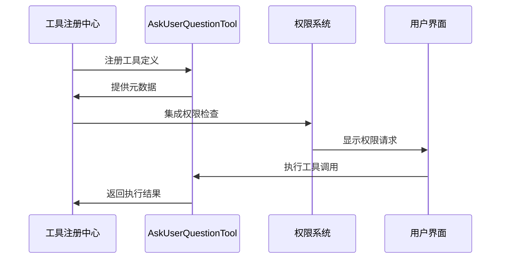

# 提问工具

<cite>
**本文档引用的文件**
- [AskUserQuestionTool.tsx](file://src/tools/AskUserQuestionTool/AskUserQuestionTool.tsx)
- [prompt.ts](file://src/tools/AskUserQuestionTool/prompt.ts)
- [Tool.ts](file://src/Tool.ts)
- [tools.ts](file://src/tools.ts)
- [AskUserQuestionPermissionRequest.tsx](file://src/components/permissions/AskUserQuestionPermissionRequest/AskUserQuestionPermissionRequest.tsx)
</cite>

## 目录
1. [简介](#简介)
2. [项目结构](#项目结构)
3. [核心组件](#核心组件)
4. [架构概览](#架构概览)
5. [详细组件分析](#详细组件分析)
6. [依赖关系分析](#依赖关系分析)
7. [性能考虑](#性能考虑)
8. [故障排除指南](#故障排除指南)
9. [结论](#结论)

## 简介

AskUserQuestionTool 是一个专门设计的交互式问答工具，用于在 Claude 代码助手执行过程中收集用户输入、澄清模糊需求、了解用户偏好并做出决策。该工具通过多选题形式与用户交互，支持预览功能、注释系统和多种配置选项。

该工具的核心价值在于：
- **实时决策支持**：在执行过程中动态收集用户反馈
- **上下文保持**：维护多轮对话中的上下文信息
- **灵活的交互模式**：支持单选和多选两种模式
- **丰富的展示选项**：支持文本和 HTML 预览内容
- **安全的权限控制**：严格的输入验证和权限检查

## 项目结构

AskUserQuestionTool 位于工具系统的特定目录中，采用模块化设计：

**图表来源**
- [AskUserQuestionTool.tsx:109-245](file://src/tools/AskUserQuestionTool/AskUserQuestionTool.tsx#L109-L245)
- [tools.ts:211](file://src/tools.ts#L211)

**章节来源**
- [AskUserQuestionTool.tsx:1-267](file://src/tools/AskUserQuestionTool/AskUserQuestionTool.tsx#L1-L267)
- [prompt.ts:1-46](file://src/tools/AskUserQuestionTool/prompt.ts#L1-L46)

## 核心组件

### 工具定义与配置

AskUserQuestionTool 作为标准工具实现，具有以下关键特性：

**图表来源**
- [AskUserQuestionTool.tsx:109-245](file://src/tools/AskUserQuestionTool/AskUserQuestionTool.tsx#L109-L245)
- [Tool.ts:362-695](file://src/Tool.ts#L362-L695)

### 输入输出模式

工具使用严格的 Zod 模式进行数据验证：

| 模式类型 | 字段定义 | 验证规则 |
|---------|----------|----------|
| **QuestionSchema** | question, header, options, multiSelect | 必填字段，选项数量限制 |
| **QuestionOption** | label, description, preview | 可选预览内容，长度限制 |
| **InputSchema** | questions 数组, answers, annotations | 唯一性验证，格式约束 |
| **OutputSchema** | questions, answers, annotations | 结构化输出 |

**章节来源**
- [AskUserQuestionTool.tsx:14-74](file://src/tools/AskUserQuestionTool/AskUserQuestionTool.tsx#L14-L74)

## 架构概览

### 交互流程架构

**图表来源**
- [AskUserQuestionTool.tsx:158-223](file://src/tools/AskUserQuestionTool/AskUserQuestionTool.tsx#L158-L223)
- [AskUserQuestionPermissionRequest.tsx:75-107](file://src/components/permissions/AskUserQuestionPermissionRequest/AskUserQuestionPermissionRequest.tsx#L75-L107)

### 上下文管理系统

**图表来源**
- [AskUserQuestionTool.tsx:158-244](file://src/tools/AskUserQuestionTool/AskUserQuestionTool.tsx#L158-L244)

## 详细组件分析

### 问题生成算法

问题生成算法基于以下核心原则：

#### 1. 问题唯一性保证
- 每个问题的文本必须唯一
- 同一问题下的选项标签必须唯一
- 使用集合操作确保重复检测

#### 2. 选项质量控制
- 选项数量限制：2-4个选项
- 标签长度控制：建议1-5个单词
- 描述完整性：提供选择的上下文说明

#### 3. 预览内容验证
当启用 HTML 预览时，系统执行严格的内容验证：

**图表来源**
- [AskUserQuestionTool.tsx:250-265](file://src/tools/AskUserQuestionTool/AskUserQuestionTool.tsx#L250-L265)

**章节来源**
- [AskUserQuestionTool.tsx:32-54](file://src/tools/AskUserQuestionTool/AskUserQuestionTool.tsx#L32-L54)
- [AskUserQuestionTool.tsx:250-265](file://src/tools/AskUserQuestionTool/AskUserQuestionTool.tsx#L250-L265)

### 上下文分析机制

#### 1. 自动分类器输入
工具将问题转换为自动分类器可理解的格式：
- 将所有问题文本连接成单一字符串
- 使用分隔符区分不同问题
- 便于安全分类和审计

#### 2. 会话状态维护
- 通过工具调用 ID 追踪每个问答会话
- 维护答案映射表（问题文本 → 用户答案）
- 支持注释和预览内容的关联存储

#### 3. 多轮对话支持
- 单次调用可包含1-4个独立问题
- 每个问题可独立回答
- 支持混合单选和多选场景

**章节来源**
- [AskUserQuestionTool.tsx:152-154](file://src/tools/AskUserQuestionTool/AskUserQuestionTool.tsx#L152-L154)
- [AskUserQuestionTool.tsx:224-244](file://src/tools/AskUserQuestionTool/AskUserQuestionTool.tsx#L224-L244)

### 回答评估机制

#### 1. 实时验证
- 输入格式验证：确保符合 Zod 模式定义
- 内容安全性检查：特别是 HTML 预览内容
- 业务逻辑验证：检查问题和选项的合理性

#### 2. 权限控制
- 所有工具调用都需要用户明确同意
- 支持批量权限决策
- 与全局权限系统集成

#### 3. 错误处理
- 详细的错误消息和错误码
- 优雅的降级处理
- 完整的回滚机制

**章节来源**
- [AskUserQuestionTool.tsx:182-188](file://src/tools/AskUserQuestionTool/AskUserQuestionTool.tsx#L182-L188)
- [AskUserQuestionTool.tsx:158-181](file://src/tools/AskUserQuestionTool/AskUserQuestionTool.tsx#L158-L181)

### 问题分类系统

#### 1. 问题类型识别
工具根据问题内容自动分类：
- 需求收集型：了解用户偏好或要求
- 模糊澄清型：澄清不明确的指令
- 决策支持型：在执行过程中做选择
- 方向引导型：提供不同执行路径

#### 2. 优先级排序
- 紧急程度：影响后续执行的关键性
- 复杂度：需要用户思考的程度
- 影响范围：对最终结果的影响大小

#### 3. 响应策略
- 立即响应：简单问题立即处理
- 延迟响应：复杂问题需要更多时间
- 分批处理：多个相关问题组合处理

**章节来源**
- [prompt.ts:32-44](file://src/tools/AskUserQuestionTool/prompt.ts#L32-L44)

### 配置选项详解

#### 1. 回答格式配置
- **单选模式**：默认行为，用户只能选择一个答案
- **多选模式**：通过 `multiSelect: true` 启用
- **其他选项**：用户可以提供自定义文本输入

#### 2. 截止时间设置
- 工具本身不直接设置截止时间
- 通过上层调用环境控制超时
- 支持异步处理和中断机制

#### 3. 确认机制
- 强制用户确认：所有工具调用都需要明确同意
- 批量确认：支持一次性确认多个问题
- 权限缓存：已确认的问题可避免重复确认

#### 4. 预览功能配置
- **Markdown 预览**：适用于代码片段和文本内容
- **HTML 预览**：适用于完整的 UI 布局和组件
- **预览限制**：仅支持单选问题，不支持多选

**章节来源**
- [AskUserQuestionTool.tsx:117-125](file://src/tools/AskUserQuestionTool/AskUserQuestionTool.tsx#L117-L125)
- [AskUserQuestionTool.tsx:135-145](file://src/tools/AskUserQuestionTool/AskUserQuestionTool.tsx#L135-L145)

## 依赖关系分析

### 核心依赖链

**图表来源**
- [AskUserQuestionTool.tsx:1-13](file://src/tools/AskUserQuestionTool/AskUserQuestionTool.tsx#L1-L13)
- [Tool.ts:1-14](file://src/Tool.ts#L1-L14)

### 工具注册集成

AskUserQuestionTool 通过工具注册系统集成到整个工具生态中：

**图表来源**
- [tools.ts:211](file://src/tools.ts#L211)
- [AskUserQuestionTool.tsx:109-113](file://src/tools/AskUserQuestionTool/AskUserQuestionTool.tsx#L109-L113)

**章节来源**
- [tools.ts:73](file://src/tools.ts#L73)
- [tools.ts:211](file://src/tools.ts#L211)

## 性能考虑

### 1. 内存使用优化
- **结果大小限制**：最大结果字符数限制为 100,000
- **延迟加载**：工具调用按需执行，避免不必要的计算
- **缓存策略**：权限状态和用户偏好进行缓存

### 2. 并发处理
- **并发安全**：工具标记为并发安全，允许多实例同时运行
- **资源隔离**：每个工具调用拥有独立的执行上下文
- **清理机制**：自动清理临时资源和状态

### 3. 网络优化
- **最小化传输**：只传输必要的数据和元信息
- **压缩策略**：对大文本内容进行压缩传输
- **增量更新**：支持部分更新和增量同步

## 故障排除指南

### 常见问题及解决方案

#### 1. 权限相关问题
**问题**：工具无法启用
**原因**：在特定渠道模式下被禁用
**解决方案**：检查渠道配置和权限设置

#### 2. 输入验证失败
**问题**：工具调用返回验证错误
**原因**：输入数据不符合模式定义
**解决方案**：检查数据格式和字段完整性

#### 3. 预览内容错误
**问题**：HTML 预览内容被拒绝
**原因**：包含不允许的标签或格式
**解决方案**：移除不允许的标签，使用内联样式

#### 4. 用户交互问题
**问题**：用户界面无法显示
**原因**：权限请求被拒绝或网络问题
**解决方案**：检查网络连接和权限设置

**章节来源**
- [AskUserQuestionTool.tsx:135-145](file://src/tools/AskUserQuestionTool/AskUserQuestionTool.tsx#L135-L145)
- [AskUserQuestionTool.tsx:158-181](file://src/tools/AskUserQuestionTool/AskUserQuestionTool.tsx#L158-L181)

## 结论

AskUserQuestionTool 作为一个精心设计的交互式问答工具，在以下方面表现出色：

### 技术优势
- **架构清晰**：遵循标准工具接口，易于集成和扩展
- **安全性强**：严格的输入验证和权限控制
- **用户体验佳**：直观的多选界面和丰富的预览功能
- **性能优秀**：内存优化和并发安全设计

### 应用价值
- **决策支持**：在执行过程中提供实时决策点
- **上下文保持**：维护复杂的多轮对话状态
- **灵活性高**：支持多种交互模式和配置选项
- **可扩展性**：模块化设计便于功能增强

### 发展方向
- **智能推荐**：基于历史交互提供智能问题推荐
- **多模态支持**：扩展图像、音频等多媒体内容
- **个性化定制**：根据用户偏好调整问题呈现方式
- **分析能力**：增强对用户反馈的分析和洞察

该工具为 Claude 代码助手提供了强大的用户交互能力，是实现智能决策和个性化服务的重要基础设施。