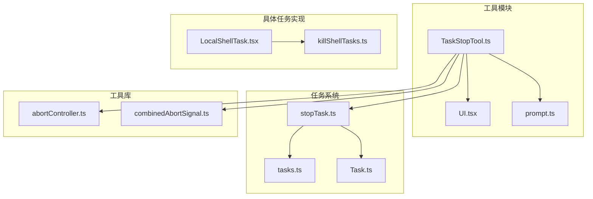
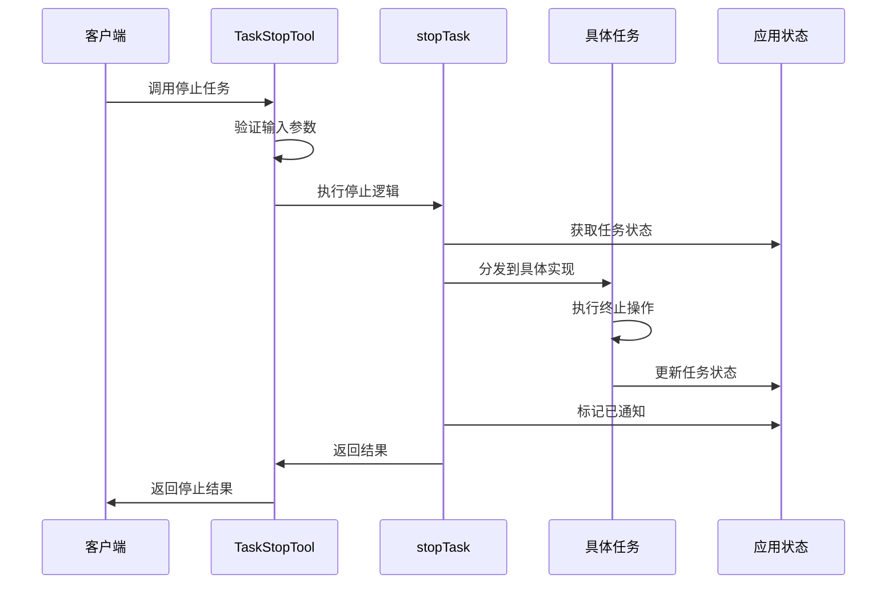
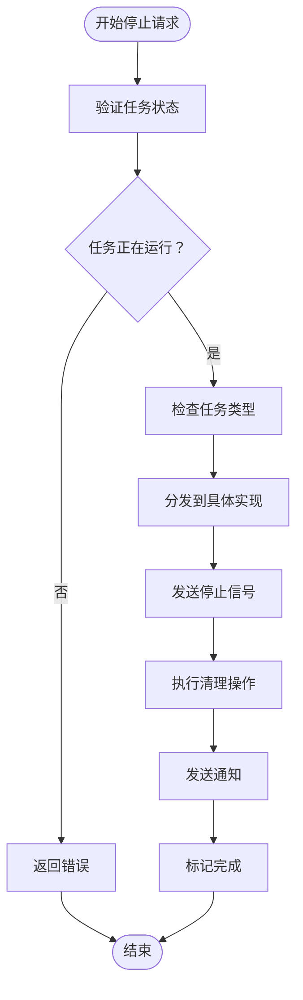
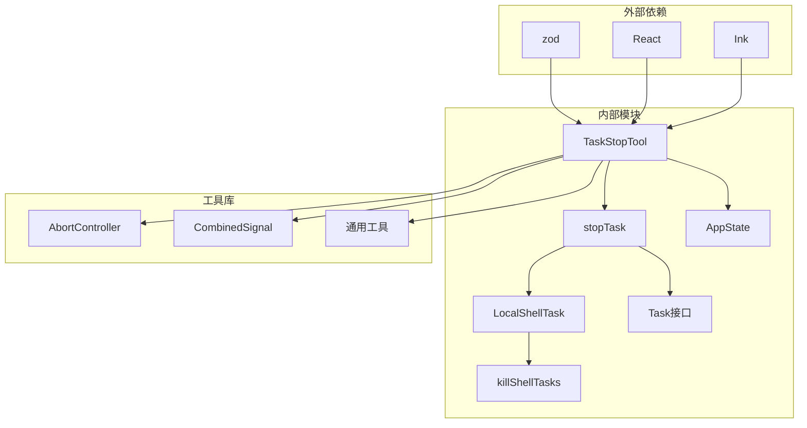

# 任务停止工具

<cite>
**本文档引用的文件**
- [TaskStopTool.ts](file://src/tools/TaskStopTool/TaskStopTool.ts)
- [UI.tsx](file://src/tools/TaskStopTool/UI.tsx)
- [prompt.ts](file://src/tools/TaskStopTool/prompt.ts)
- [stopTask.ts](file://src/tasks/stopTask.ts)
- [tasks.ts](file://src/tasks.ts)
- [Task.ts](file://src/Task.ts)
- [LocalShellTask.tsx](file://src/tasks/LocalShellTask/LocalShellTask.tsx)
- [killShellTasks.ts](file://src/tasks/LocalShellTask/killShellTasks.ts)
- [abortController.ts](file://src/utils/abortController.ts)
- [combinedAbortSignal.ts](file://src/utils/combinedAbortSignal.ts)
</cite>

## 目录
1. [简介](#简介)
2. [项目结构](#项目结构)
3. [核心组件](#核心组件)
4. [架构概览](#架构概览)
5. [详细组件分析](#详细组件分析)
6. [依赖关系分析](#依赖关系分析)
7. [性能考量](#性能考量)
8. [故障排除指南](#故障排除指南)
9. [结论](#结论)
10. [附录](#附录)

## 简介

任务停止工具（TaskStopTool）是 Claude Code 项目中的一个关键组件，负责优雅地终止正在运行的后台任务。该工具提供了统一的任务停止接口，支持多种任务类型，并实现了完善的信号处理、资源清理和状态同步机制。

该工具的核心功能包括：
- 统一的任务停止接口
- 多种任务类型的终止支持
- 优雅关闭与强制停止的区别
- 超时管理和资源回收
- 确认机制和回滚策略
- 异常终止场景的处理方案

## 项目结构

任务停止工具位于项目的工具模块中，采用模块化设计，便于维护和扩展。

**图表来源**
- [TaskStopTool.ts:1-133](file://src/tools/TaskStopTool/TaskStopTool.ts#L1-L133)
- [stopTask.ts:1-100](file://src/tasks/stopTask.ts#L1-L100)
- [LocalShellTask.tsx:1-524](file://src/tasks/LocalShellTask/LocalShellTask.tsx#L1-L524)

**章节来源**
- [TaskStopTool.ts:1-133](file://src/tools/TaskStopTool/TaskStopTool.ts#L1-L133)
- [tasks.ts:1-41](file://src/tasks.ts#L1-L41)

## 核心组件

### TaskStopTool 主类

TaskStopTool 是工具系统的入口点，负责任务停止的完整生命周期管理。

**主要特性：**
- 输入参数验证和类型检查
- 任务状态查询和验证
- 统一的错误处理机制
- 输出结果格式化和渲染

**关键方法：**
- `validateInput()`: 验证输入参数的有效性
- `call()`: 执行任务停止操作
- `renderToolResultMessage()`: 渲染输出结果

### 停止逻辑核心

stopTask 函数实现了跨工具和SDK的共享停止逻辑。

**核心功能：**
- 任务查找和状态验证
- 任务类型分发到具体实现
- 统一的错误处理和状态更新
- SDK事件通知机制

**章节来源**
- [TaskStopTool.ts:39-131](file://src/tools/TaskStopTool/TaskStopTool.ts#L39-L131)
- [stopTask.ts:38-100](file://src/tasks/stopTask.ts#L38-L100)

## 架构概览

任务停止工具采用分层架构设计，确保了良好的可维护性和扩展性。

**图表来源**
- [TaskStopTool.ts:107-130](file://src/tools/TaskStopTool/TaskStopTool.ts#L107-L130)
- [stopTask.ts:38-100](file://src/tasks/stopTask.ts#L38-L100)

## 详细组件分析

### 任务停止机制

#### 优雅关闭 vs 强制停止

任务停止工具实现了两种不同的停止策略：

**优雅关闭（Graceful Shutdown）：**
- 通过 AbortController 触发取消信号
- 允许任务完成当前操作后正常退出
- 保持数据完整性，避免资源泄漏
- 适用于大多数长时间运行的任务

**强制停止（Force Stop）：**
- 直接终止进程或线程
- 不等待当前操作完成
- 可能导致数据不一致
- 适用于紧急情况或死锁场景

#### 信号处理机制

**图表来源**
- [stopTask.ts:38-100](file://src/tasks/stopTask.ts#L38-L100)
- [LocalShellTask.tsx:176-178](file://src/tasks/LocalShellTask/LocalShellTask.tsx#L176-L178)

#### 资源回收流程

任务停止过程中的资源回收包括多个层面：

**内存资源：**
- 清理任务状态对象
- 释放事件监听器
- 移除定时器和回调函数

**文件系统资源：**
- 关闭文件描述符
- 删除临时文件
- 清理输出缓冲区

**进程资源：**
- 终止子进程
- 清理进程树
- 释放系统资源

**章节来源**
- [killShellTasks.ts:16-46](file://src/tasks/LocalShellTask/killShellTasks.ts#L16-L46)
- [LocalShellTask.tsx:515-522](file://src/tasks/LocalShellTask/LocalShellTask.tsx#L515-L522)

### 状态同步机制

#### 确认机制

任务停止工具实现了多层确认机制：

**输入验证确认：**
- 参数类型检查
- 任务存在性验证
- 状态一致性检查

**执行确认：**
- 任务状态更新确认
- 通知发送确认
- 资源清理确认

**结果确认：**
- 输出格式验证
- 结果完整性检查
- 用户界面反馈

#### 回滚策略

当停止操作失败时，系统提供回滚机制：

**自动回滚：**
- 恢复原始任务状态
- 重新注册事件监听器
- 重建资源连接

**手动回滚：**
- 提供状态查询接口
- 支持部分回滚操作
- 记录回滚历史

**章节来源**
- [TaskStopTool.ts:60-91](file://src/tools/TaskStopTool/TaskStopTool.ts#L60-L91)
- [stopTask.ts:10-18](file://src/tasks/stopTask.ts#L10-L18)

### 异常终止处理

#### 异常场景识别

系统能够识别多种异常终止场景：

**超时异常：**
- 任务响应超时
- 网络连接中断
- 资源访问超时

**资源异常：**
- 内存不足
- 文件句柄耗尽
- 系统资源限制

**逻辑异常：**
- 死锁状态
- 无限循环
- 数据竞争

#### 故障恢复策略

针对不同异常场景，系统提供相应的恢复策略：

**自动恢复：**
- 重试机制
- 资源重置
- 连接重建

**半自动恢复：**
- 用户确认提示
- 部分功能降级
- 安全模式启动

**完全恢复：**
- 系统重启
- 数据恢复
- 状态重置

**章节来源**
- [abortController.ts:1-99](file://src/utils/abortController.ts#L1-L99)
- [combinedAbortSignal.ts:15-47](file://src/utils/combinedAbortSignal.ts#L15-L47)

## 依赖关系分析

任务停止工具的依赖关系体现了清晰的分层设计。

**图表来源**
- [TaskStopTool.ts:1-8](file://src/tools/TaskStopTool/TaskStopTool.ts#L1-L8)
- [stopTask.ts:1-8](file://src/tasks/stopTask.ts#L1-L8)

**章节来源**
- [Task.ts:69-76](file://src/Task.ts#L69-L76)
- [tasks.ts:37-39](file://src/tasks.ts#L37-L39)

## 性能考量

### 并发安全性

任务停止工具实现了并发安全机制：

**线程安全：**
- 使用原子操作更新状态
- 避免竞态条件
- 确保数据一致性

**资源竞争：**
- 同步访问共享资源
- 实现互斥锁机制
- 防止死锁发生

### 内存管理

**垃圾回收优化：**
- 及时释放无用对象
- 避免内存泄漏
- 监控内存使用情况

**缓存策略：**
- 合理使用缓存
- 设置缓存过期时间
- 实现缓存清理机制

### 执行效率

**异步处理：**
- 非阻塞操作
- 并行处理多个任务
- 流水线式处理

**资源优化：**
- 最小化系统调用
- 优化网络通信
- 减少磁盘I/O

## 故障排除指南

### 常见问题诊断

**任务无法停止：**
- 检查任务状态是否正确
- 验证权限设置
- 查看系统日志

**停止后资源未释放：**
- 确认清理函数执行
- 检查异常处理
- 验证资源引用

**状态不一致：**
- 检查状态更新顺序
- 验证事务完整性
- 实施补偿操作

### 调试技巧

**日志分析：**
- 启用详细日志
- 分析执行路径
- 跟踪状态变化

**性能监控：**
- 监控CPU使用率
- 跟踪内存占用
- 分析I/O性能

**错误追踪：**
- 捕获异常信息
- 记录堆栈跟踪
- 分析错误模式

**章节来源**
- [TaskStopTool.ts:107-130](file://src/tools/TaskStopTool/TaskStopTool.ts#L107-L130)
- [stopTask.ts:38-100](file://src/tasks/stopTask.ts#L38-L100)

## 结论

任务停止工具作为 Claude Code 项目的重要组成部分，展现了优秀的软件工程实践。其设计充分考虑了可靠性、性能和可维护性，在以下方面表现突出：

**架构优势：**
- 清晰的分层设计
- 良好的模块解耦
- 灵活的扩展机制

**功能特性：**
- 支持多种任务类型
- 完善的错误处理
- 优雅的状态管理

**技术实现：**
- 高效的并发控制
- 优化的资源管理
- 可靠的异常处理

该工具为用户提供了安全、可靠的后台任务管理能力，是现代开发工具链中不可或缺的重要组件。

## 附录

### 实际使用场景

**开发环境：**
- 长时间运行的编译任务
- 数据库迁移操作
- 日志分析任务

**生产环境：**
- 紧急故障处理
- 资源清理操作
- 系统维护任务

### 安全考虑最佳实践

**权限控制：**
- 最小权限原则
- 动态权限验证
- 审计日志记录

**数据保护：**
- 完整性校验
- 加密存储
- 访问控制

**系统安全：**
- 输入验证
- 资源限制
- 安全监控