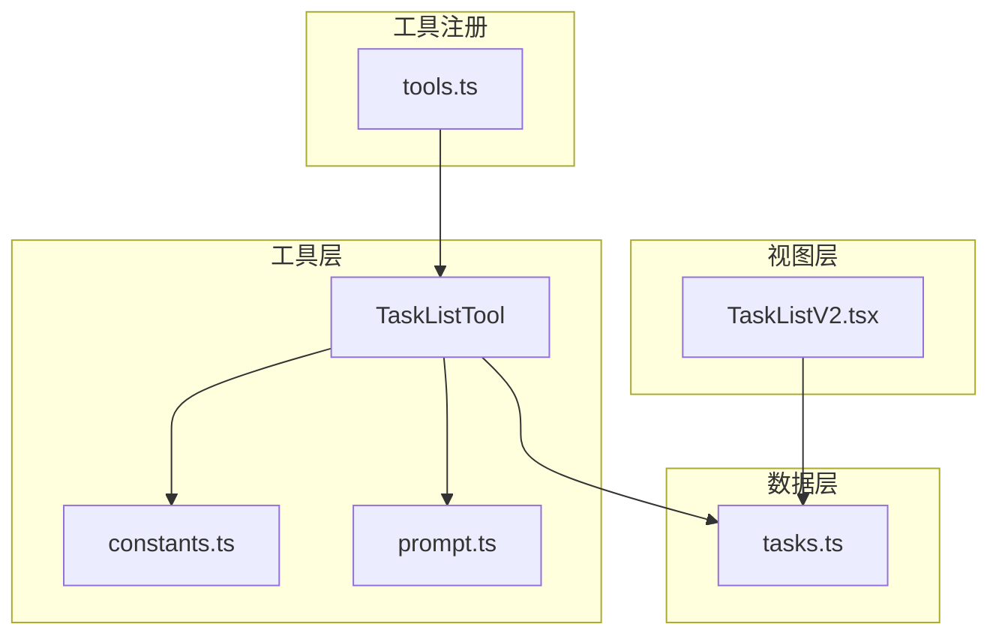
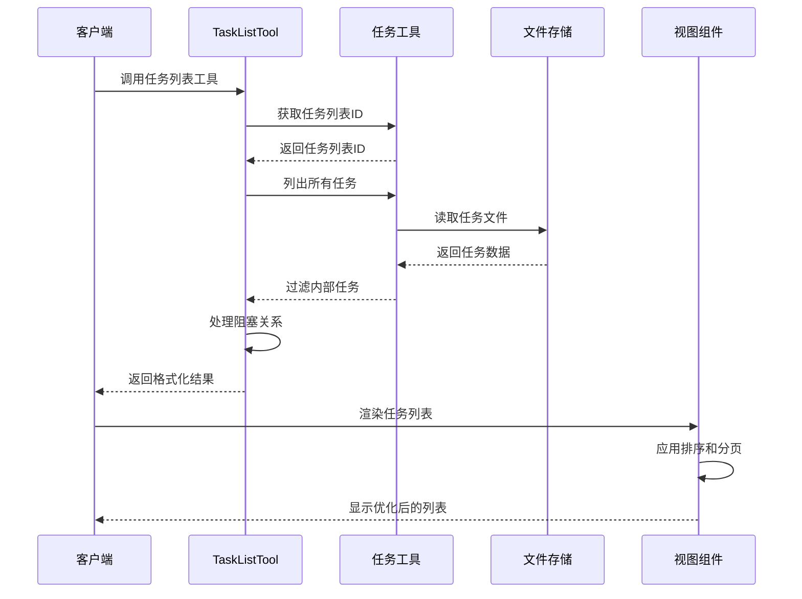
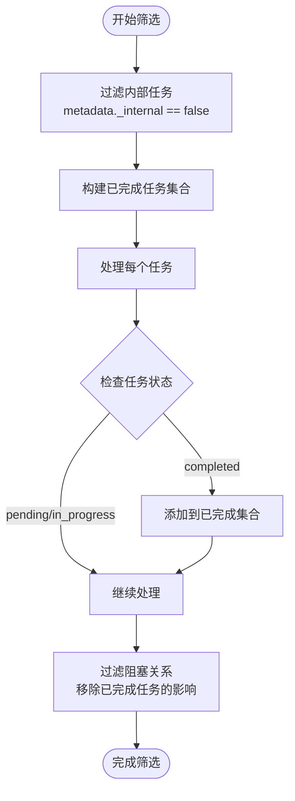
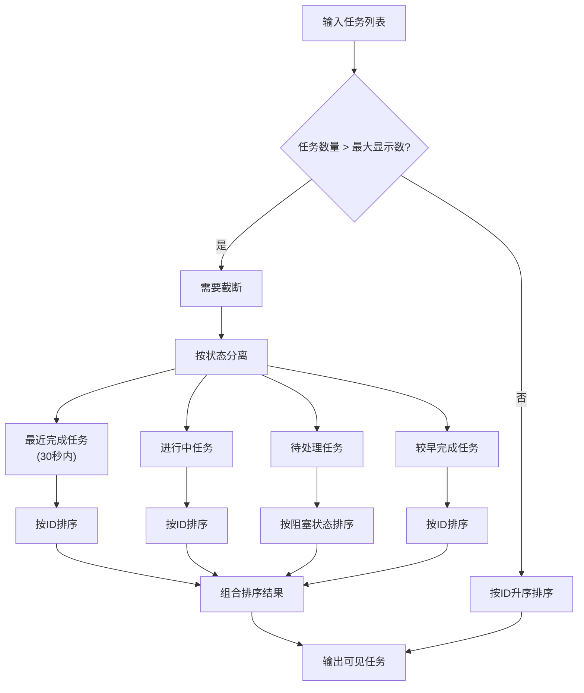
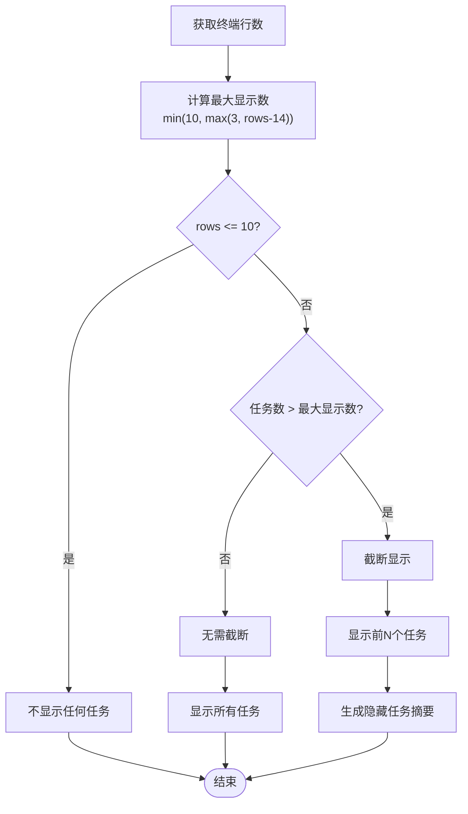
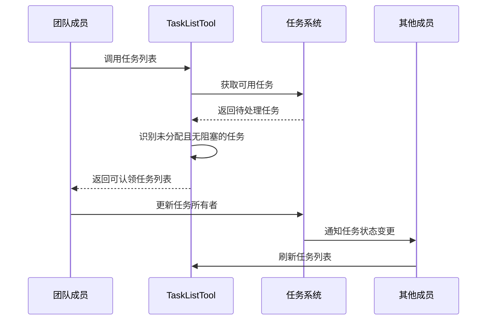
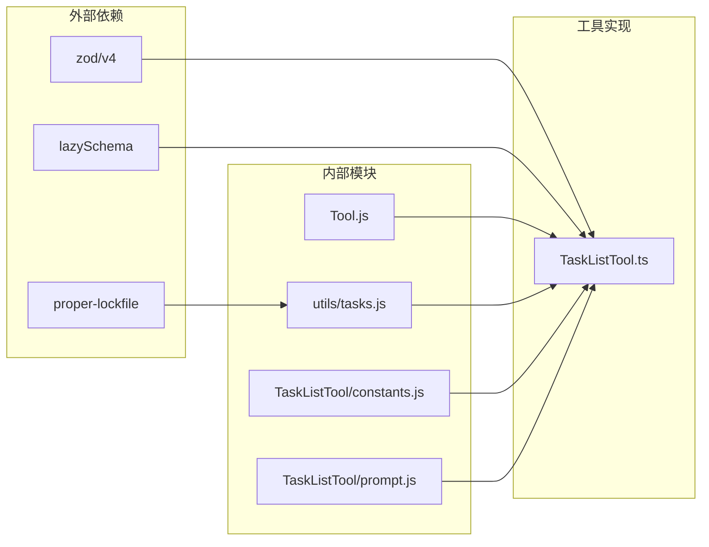

# 任务列表工具

<cite>
**本文档引用的文件**
- [TaskListTool.ts](file://src/tools/TaskListTool/TaskListTool.ts)
- [constants.ts](file://src/tools/TaskListTool/constants.ts)
- [prompt.ts](file://src/tools/TaskListTool/prompt.ts)
- [tasks.ts](file://src/utils/tasks.ts)
- [TaskListV2.tsx](file://src/components/TaskListV2.tsx)
- [tools.ts](file://src/tools.ts)
</cite>

## 目录
1. [简介](#简介)
2. [项目结构](#项目结构)
3. [核心组件](#核心组件)
4. [架构概览](#架构概览)
5. [详细组件分析](#详细组件分析)
6. [依赖关系分析](#依赖关系分析)
7. [性能考虑](#性能考虑)
8. [故障排除指南](#故障排除指南)
9. [结论](#结论)

## 简介

任务列表工具是 Claude Code 项目中的一个核心工具，用于管理和展示任务列表。该工具提供了强大的筛选机制、排序规则和分页处理功能，支持任务状态过滤、时间范围查询和标签筛选。本文档将深入解释 TaskListTool 的工作原理，包括其筛选机制、排序规则和分页处理策略。

## 项目结构

任务列表工具主要由以下几个关键组件组成：

**图表来源**
- [TaskListTool.ts:1-118](file://src/tools/TaskListTool/TaskListTool.ts#L1-L118)
- [tasks.ts:1-864](file://src/utils/tasks.ts#L1-L864)
- [TaskListV2.tsx:1-379](file://src/components/TaskListV2.tsx#L1-L379)

**章节来源**
- [TaskListTool.ts:1-118](file://src/tools/TaskListTool/TaskListTool.ts#L1-L118)
- [tasks.ts:1-864](file://src/utils/tasks.ts#L1-L864)
- [TaskListV2.tsx:1-379](file://src/components/TaskListV2.tsx#L1-L379)

## 核心组件

### TaskListTool 工具类

TaskListTool 是一个基于工具定义框架构建的任务列表工具，具有以下核心特性：

- **只读访问**：工具标记为只读，确保不会修改任务数据
- **并发安全**：支持并发调用，避免竞态条件
- **延迟执行**：采用延迟执行模式，提高响应性
- **智能过滤**：自动过滤内部任务和已完成任务的依赖关系

### 数据模型

任务数据结构包含以下关键字段：

| 字段名 | 类型 | 描述 |
|--------|------|------|
| id | string | 任务唯一标识符 |
| subject | string | 任务主题描述 |
| status | 'pending' \| 'in_progress' \| 'completed' | 任务状态 |
| owner | string | 任务所有者（可选） |
| blockedBy | string[] | 阻塞此任务的其他任务ID列表 |

**章节来源**
- [TaskListTool.ts:16-28](file://src/tools/TaskListTool/TaskListTool.ts#L16-L28)
- [tasks.ts:76-89](file://src/utils/tasks.ts#L76-L89)

## 架构概览

任务列表工具采用分层架构设计，确保了清晰的关注点分离：

**图表来源**
- [TaskListTool.ts:65-90](file://src/tools/TaskListTool/TaskListTool.ts#L65-L90)
- [tasks.ts:443-456](file://src/utils/tasks.ts#L443-L456)
- [TaskListV2.tsx:135-192](file://src/components/TaskListV2.tsx#L135-L192)

## 详细组件分析

### 筛选机制

TaskListTool 实现了多层次的筛选机制：

#### 1. 内部任务过滤
工具自动过滤掉带有 `_internal` 元数据的任务，这些通常是系统内部使用的任务。

#### 2. 阻塞关系处理
工具会自动解析任务之间的阻塞关系，移除已完成任务对当前任务的影响。

**图表来源**
- [TaskListTool.ts:68-83](file://src/tools/TaskListTool/TaskListTool.ts#L68-L83)

**章节来源**
- [TaskListTool.ts:68-83](file://src/tools/TaskListTool/TaskListTool.ts#L68-L83)

### 排序规则

任务列表采用智能排序策略，确保用户能够快速找到需要关注的任务：

#### 优先级排序算法

**图表来源**
- [TaskListV2.tsx:135-169](file://src/components/TaskListV2.tsx#L135-L169)

#### 排序优先级

1. **最近完成任务**（30秒内）- 最高优先级
2. **进行中任务** - 次高优先级  
3. **待处理任务** - 中等优先级
4. **较早完成任务** - 最低优先级

**章节来源**
- [TaskListV2.tsx:135-169](file://src/components/TaskListV2.tsx#L135-L169)

### 分页处理

系统实现了智能的分页和截断机制：

#### 动态显示限制

**图表来源**
- [TaskListV2.tsx:48](file://src/components/TaskListV2.tsx#L48)
- [TaskListV2.tsx:135-192](file://src/components/TaskListV2.tsx#L135-L192)

**章节来源**
- [TaskListV2.tsx:48](file://src/components/TaskListV2.tsx#L48)
- [TaskListV2.tsx:135-192](file://src/components/TaskListV2.tsx#L135-L192)

### 列表视图数据结构

任务列表视图组件提供了丰富的显示选项：

#### 显示属性

| 属性名 | 类型 | 描述 |
|--------|------|------|
| tasks | Task[] | 任务数组 |
| isStandalone | boolean | 是否独立显示模式 |
| columns | number | 终端列数 |
| rows | number | 终端行数 |

#### 自适应布局

视图组件根据终端大小动态调整显示内容：

- **窄屏幕**（<60列）：隐藏任务所有者信息
- **宽屏幕**（≥60列）：显示完整任务信息
- **小窗口**（≤10行）：不显示任何任务
- **标准窗口**（11-24行）：显示3-10个任务
- **大窗口**（>24行）：显示最多10个任务

**章节来源**
- [TaskListV2.tsx:17-20](file://src/components/TaskListV2.tsx#L17-L20)
- [TaskListV2.tsx:268-289](file://src/components/TaskListV2.tsx#L268-L289)

### 复杂查询场景

#### 团队协作场景

在团队协作环境中，TaskListTool 提供了专门的工作流程支持：

**图表来源**
- [prompt.ts:15-26](file://src/tools/TaskListTool/prompt.ts#L15-L26)

**章节来源**
- [prompt.ts:15-26](file://src/tools/TaskListTool/prompt.ts#L15-L26)

## 依赖关系分析

任务列表工具的依赖关系相对简洁，主要依赖于任务工具模块：

**图表来源**
- [TaskListTool.ts:1-12](file://src/tools/TaskListTool/TaskListTool.ts#L1-L12)
- [tasks.ts:102-108](file://src/utils/tasks.ts#L102-L108)

**章节来源**
- [TaskListTool.ts:1-12](file://src/tools/TaskListTool/TaskListTool.ts#L1-L12)
- [tasks.ts:102-108](file://src/utils/tasks.ts#L102-L108)

## 性能考虑

### 文件系统优化

任务数据存储在本地文件系统中，采用了多项优化措施：

#### 锁机制
- 使用 `proper-lockfile` 实现文件锁定
- 支持重试机制，避免竞态条件
- 锁定粒度精确到任务级别

#### 并发处理
- 使用 Promise.all 并行读取多个任务文件
- 文件操作异步化，避免阻塞主线程
- 内存中缓存常用数据结构

### 内存管理策略

#### 智能截断
- 根据终端大小动态调整显示数量
- 自动隐藏不重要的任务信息
- 及时清理过期的完成任务记录

#### 时间感知
- 最近完成任务（30秒内）有特殊显示优先级
- 自动定时器清理过期的时间戳
- 基于时间的重新渲染机制

**章节来源**
- [tasks.ts:102-108](file://src/utils/tasks.ts#L102-L108)
- [TaskListV2.tsx:21](file://src/components/TaskListV2.tsx#L21)
- [TaskListV2.tsx:65-85](file://src/components/TaskListV2.tsx#L65-L85)

## 故障排除指南

### 常见问题及解决方案

#### 任务列表为空
**症状**：调用 TaskListTool 返回空列表
**可能原因**：
- 任务目录不存在或权限不足
- 所有任务都被标记为内部任务
- 任务文件损坏

**解决方法**：
1. 检查任务目录是否存在：`~/.claude/tasks/<task_list_id>`
2. 验证文件权限设置
3. 使用 `TaskGetTool` 检查单个任务状态

#### 排序异常
**症状**：任务显示顺序不符合预期
**可能原因**：
- 任务ID不是纯数字格式
- 系统时间异常
- 缓存数据不一致

**解决方法**：
1. 检查任务ID格式是否正确
2. 验证系统时间同步
3. 强制刷新视图组件

#### 性能问题
**症状**：任务列表加载缓慢
**可能原因**：
- 任务文件过多
- 文件系统性能问题
- 内存不足

**解决方法**：
1. 清理不需要的历史任务
2. 检查磁盘空间和I/O性能
3. 调整终端大小以减少显示任务数量

**章节来源**
- [TaskListTool.ts:68-70](file://src/tools/TaskListTool/TaskListTool.ts#L68-L70)
- [TaskListV2.tsx:135-169](file://src/components/TaskListV2.tsx#L135-L169)

## 结论

任务列表工具通过精心设计的筛选机制、智能排序规则和高效的分页处理，在保证用户体验的同时，实现了高性能的任务管理功能。其架构设计充分考虑了并发安全性、内存管理和扩展性，为复杂的任务管理场景提供了可靠的基础。

工具的主要优势包括：
- **智能筛选**：自动处理任务依赖关系和内部任务过滤
- **灵活排序**：基于任务状态和时间的多维度排序
- **自适应显示**：根据终端环境动态调整显示内容
- **并发安全**：支持多进程并发访问而不产生冲突
- **性能优化**：采用多种技术手段优化加载和渲染性能

这些特性使得任务列表工具能够有效支持从个人开发者到大型团队协作的各种使用场景。