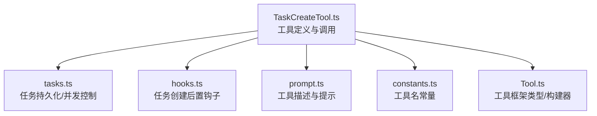
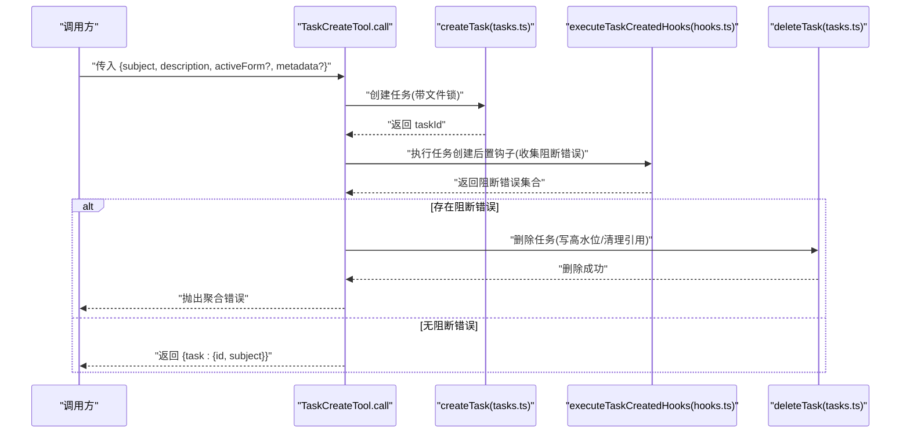
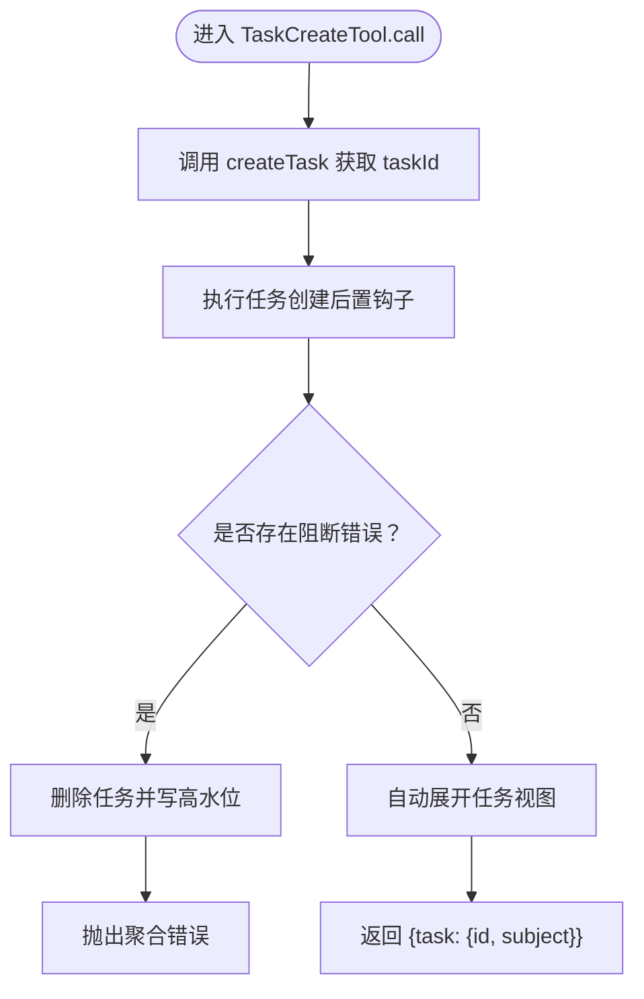
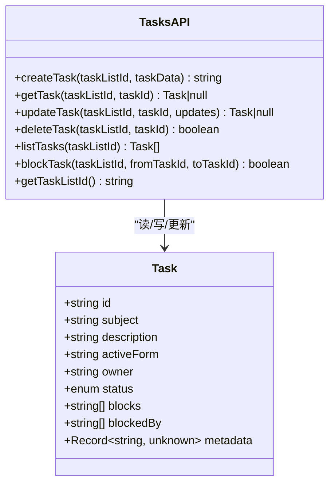
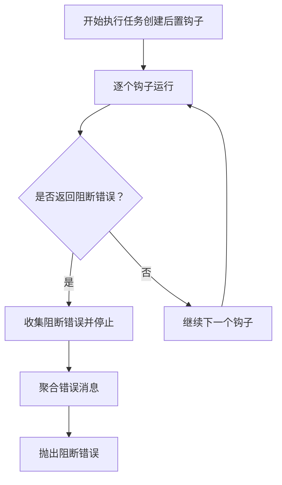
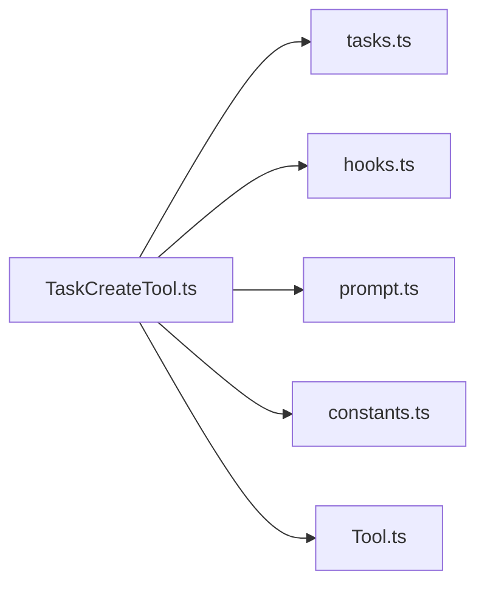

# 任务创建工具

<cite>
**本文引用的文件**
- [TaskCreateTool.ts](file://src/tools/TaskCreateTool/TaskCreateTool.ts)
- [constants.ts](file://src/tools/TaskCreateTool/constants.ts)
- [prompt.ts](file://src/tools/TaskCreateTool/prompt.ts)
- [tasks.ts](file://src/utils/tasks.ts)
- [hooks.ts](file://src/utils/hooks.ts)
- [Tool.ts](file://src/Tool.ts)
</cite>

## 目录
1. [简介](#简介)
2. [项目结构](#项目结构)
3. [核心组件](#核心组件)
4. [架构总览](#架构总览)
5. [详细组件分析](#详细组件分析)
6. [依赖分析](#依赖分析)
7. [性能考虑](#性能考虑)
8. [故障排除指南](#故障排除指南)
9. [结论](#结论)
10. [附录：使用示例与最佳实践](#附录使用示例与最佳实践)

## 简介
本文件系统性地解析“任务创建工具”（TaskCreateTool）的设计与实现，覆盖以下方面：
- 工具的输入参数、约束与校验规则
- 任务元数据管理、优先级与依赖关系的现状与扩展建议
- 创建流程的控制流与错误处理策略
- 与任务持久化、钩子系统、工具框架的集成方式
- 实际使用示例路径与最佳实践、常见错误排查

## 项目结构
TaskCreateTool 位于工具目录下，围绕其核心实现的关键文件如下：
- 工具定义与调用入口：src/tools/TaskCreateTool/TaskCreateTool.ts
- 工具名称常量：src/tools/TaskCreateTool/constants.ts
- 使用提示与行为说明：src/tools/TaskCreateTool/prompt.ts
- 任务持久化与并发控制：src/utils/tasks.ts
- 钩子执行与阻断机制：src/utils/hooks.ts
- 工具框架类型与构建器：src/Tool.ts

图表来源
- [TaskCreateTool.ts:1-140](file://src/tools/TaskCreateTool/TaskCreateTool.ts#L1-L140)
- [tasks.ts:1-864](file://src/utils/tasks.ts#L1-L864)
- [hooks.ts:1-800](file://src/utils/hooks.ts#L1-L800)
- [prompt.ts:1-58](file://src/tools/TaskCreateTool/prompt.ts#L1-L58)
- [constants.ts:1-3](file://src/tools/TaskCreateTool/constants.ts#L1-L3)
- [Tool.ts:1-795](file://src/Tool.ts#L1-L795)

章节来源
- [TaskCreateTool.ts:1-140](file://src/tools/TaskCreateTool/TaskCreateTool.ts#L1-L140)
- [tasks.ts:1-864](file://src/utils/tasks.ts#L1-L864)
- [hooks.ts:1-800](file://src/utils/hooks.ts#L1-L800)
- [prompt.ts:1-58](file://src/tools/TaskCreateTool/prompt.ts#L1-L58)
- [constants.ts:1-3](file://src/tools/TaskCreateTool/constants.ts#L1-L3)
- [Tool.ts:1-795](file://src/Tool.ts#L1-L795)

## 核心组件
- 工具定义与调用
  - 名称与提示：工具名为“TaskCreate”，描述与提示由 prompt.ts 提供；支持搜索提示与用户可见名称。
  - 输入模式：严格对象，包含 subject、description、可选 activeForm、可选 metadata。
  - 输出模式：返回新建任务的 id 与 subject。
  - 启用条件：isTodoV2Enabled() 控制是否启用。
  - 并发安全：标记为并发安全，避免重复创建。
  - 调用流程：创建任务 -> 执行任务创建钩子（可能阻断）-> 若有阻断错误则回滚删除 -> 自动展开任务视图。

- 任务持久化与并发控制
  - 任务列表 ID 解析：支持显式环境变量、进程内队友共享、团队名、或会话 ID 回退。
  - 文件锁：对任务列表与单个任务文件加锁，保证并发安全。
  - 任务模型：包含 id、subject、description、activeForm、owner、status、blocks、blockedBy、metadata。
  - 高水位线：防止删除/重置后的 ID 重复分配。

- 钩子系统
  - 任务创建后置钩子：遍历执行，收集阻断错误；若存在阻断错误则回滚删除任务并抛出异常。
  - 阻断错误：通过生成器迭代器收集，统一拼接消息后抛出。

章节来源
- [TaskCreateTool.ts:48-138](file://src/tools/TaskCreateTool/TaskCreateTool.ts#L48-L138)
- [tasks.ts:69-89](file://src/utils/tasks.ts#L69-L89)
- [tasks.ts:133-139](file://src/utils/tasks.ts#L133-L139)
- [tasks.ts:199-210](file://src/utils/tasks.ts#L199-L210)
- [tasks.ts:284-308](file://src/utils/tasks.ts#L284-L308)
- [hooks.ts:330-376](file://src/utils/hooks.ts#L330-L376)
- [hooks.ts:95-96](file://src/utils/hooks.ts#L95-L96)

## 架构总览
下面以序列图展示 TaskCreateTool 的调用与内部协作：

图表来源
- [TaskCreateTool.ts:80-129](file://src/tools/TaskCreateTool/TaskCreateTool.ts#L80-L129)
- [tasks.ts:284-308](file://src/utils/tasks.ts#L284-L308)
- [hooks.ts:95-96](file://src/utils/hooks.ts#L95-L96)
- [tasks.ts:393-441](file://src/utils/tasks.ts#L393-L441)

章节来源
- [TaskCreateTool.ts:80-129](file://src/tools/TaskCreateTool/TaskCreateTool.ts#L80-L129)
- [tasks.ts:284-308](file://src/utils/tasks.ts#L284-L308)
- [hooks.ts:95-96](file://src/utils/hooks.ts#L95-L96)
- [tasks.ts:393-441](file://src/utils/tasks.ts#L393-L441)

## 详细组件分析

### 组件一：TaskCreateTool 工具定义与调用
- 输入参数与约束
  - subject：字符串，简短标题，建议采用祈使语气。
  - description：字符串，具体要完成的工作内容。
  - activeForm：可选，进行中时在旋转指示器显示的现在进行时描述；未提供时默认使用 subject。
  - metadata：可选，键值对任意元数据，用于附加信息。
- 输出结构
  - 返回 task.id 与 task.subject。
- 启用与并发
  - 启用条件：isTodoV2Enabled()。
  - 并发安全：isConcurrencySafe() 返回 true。
- 调用流程
  - 调用 createTask 获取 taskId。
  - 执行任务创建钩子，收集阻断错误。
  - 若存在阻断错误，删除任务并抛错；否则自动展开任务视图并返回结果。
- 用户体验
  - mapToolResultToToolResultBlockParam 将结果映射为“工具结果块参数”，便于 UI 展示。

图表来源
- [TaskCreateTool.ts:80-129](file://src/tools/TaskCreateTool/TaskCreateTool.ts#L80-L129)
- [tasks.ts:284-308](file://src/utils/tasks.ts#L284-L308)
- [hooks.ts:95-96](file://src/utils/hooks.ts#L95-L96)
- [tasks.ts:393-441](file://src/utils/tasks.ts#L393-L441)

章节来源
- [TaskCreateTool.ts:18-46](file://src/tools/TaskCreateTool/TaskCreateTool.ts#L18-L46)
- [TaskCreateTool.ts:48-138](file://src/tools/TaskCreateTool/TaskCreateTool.ts#L48-L138)

### 组件二：任务持久化与并发控制（tasks.ts）
- 任务模型
  - 字段：id、subject、description、activeForm、owner、status、blocks、blockedBy、metadata。
  - 状态枚举：pending、in_progress、completed。
- 任务列表 ID 解析优先级
  - 显式环境变量 > 进程内队友共享团队名 > 团队名 > 领导者团队名 > 会话 ID。
- 并发与一致性
  - 任务列表级锁与任务文件级锁结合，确保创建、更新、删除原子性。
  - 删除任务前写入高水位线，防止 ID 重复；同时清理其他任务中的引用。
- 辅助能力
  - 列表、查询、更新、删除、阻塞关系维护等。

图表来源
- [tasks.ts:69-89](file://src/utils/tasks.ts#L69-L89)
- [tasks.ts:284-308](file://src/utils/tasks.ts#L284-L308)
- [tasks.ts:310-350](file://src/utils/tasks.ts#L310-L350)
- [tasks.ts:370-391](file://src/utils/tasks.ts#L370-L391)
- [tasks.ts:393-441](file://src/utils/tasks.ts#L393-L441)
- [tasks.ts:458-486](file://src/utils/tasks.ts#L458-L486)
- [tasks.ts:199-210](file://src/utils/tasks.ts#L199-L210)

章节来源
- [tasks.ts:69-89](file://src/utils/tasks.ts#L69-L89)
- [tasks.ts:199-210](file://src/utils/tasks.ts#L199-L210)
- [tasks.ts:284-308](file://src/utils/tasks.ts#L284-L308)
- [tasks.ts:393-441](file://src/utils/tasks.ts#L393-L441)

### 组件三：钩子系统与阻断机制（hooks.ts）
- 任务创建后置钩子
  - 通过生成器迭代执行，收集阻断错误；当任一钩子返回阻断错误时，后续钩子不再继续。
  - 阻断错误会被拼接为统一消息后抛出。
- 错误传播
  - TaskCreateTool 在检测到阻断错误后，立即删除任务并抛出异常，确保状态一致。

图表来源
- [hooks.ts:95-96](file://src/utils/hooks.ts#L95-L96)
- [TaskCreateTool.ts:93-113](file://src/tools/TaskCreateTool/TaskCreateTool.ts#L93-L113)

章节来源
- [hooks.ts:95-96](file://src/utils/hooks.ts#L95-L96)
- [TaskCreateTool.ts:93-113](file://src/tools/TaskCreateTool/TaskCreateTool.ts#L93-L113)

### 组件四：工具框架与类型约束（Tool.ts）
- 工具接口
  - 必需字段：name、inputSchema、outputSchema、call、isEnabled、isConcurrencySafe 等。
  - 可选增强：searchHint、userFacingName、renderToolUseMessage、mapToolResultToToolResultBlockParam 等。
- 构建器
  - buildTool 将部分方法设为可选，并提供默认实现，确保工具一致性与安全性。

章节来源
- [Tool.ts:362-473](file://src/Tool.ts#L362-L473)
- [Tool.ts:783-792](file://src/Tool.ts#L783-L792)

## 依赖分析
- TaskCreateTool 依赖
  - 输入/输出模式：zod 懒加载模式（lazySchema）。
  - 任务持久化：createTask、deleteTask、getTaskListId、isTodoV2Enabled。
  - 钩子系统：executeTaskCreatedHooks、getTaskCreatedHookMessage。
  - UI 上下文：setAppState 用于自动展开任务视图。
- 外部耦合
  - 任务存储基于本地文件系统，受文件锁与高水位线保护。
  - 钩子系统可能触发外部命令或 HTTP 请求，存在阻断风险。

图表来源
- [TaskCreateTool.ts:1-17](file://src/tools/TaskCreateTool/TaskCreateTool.ts#L1-L17)
- [tasks.ts:1-16](file://src/utils/tasks.ts#L1-L16)
- [hooks.ts:1-11](file://src/utils/hooks.ts#L1-L11)
- [prompt.ts:1-3](file://src/tools/TaskCreateTool/prompt.ts#L1-L3)
- [constants.ts:1](file://src/tools/TaskCreateTool/constants.ts#L1)
- [Tool.ts:1-14](file://src/Tool.ts#L1-L14)

章节来源
- [TaskCreateTool.ts:1-17](file://src/tools/TaskCreateTool/TaskCreateTool.ts#L1-L17)
- [tasks.ts:1-16](file://src/utils/tasks.ts#L1-L16)
- [hooks.ts:1-11](file://src/utils/hooks.ts#L1-L11)
- [prompt.ts:1-3](file://src/tools/TaskCreateTool/prompt.ts#L1-L3)
- [constants.ts:1](file://src/tools/TaskCreateTool/constants.ts#L1)
- [Tool.ts:1-14](file://src/Tool.ts#L1-L14)

## 性能考虑
- 并发控制
  - 使用文件锁避免竞态，但锁等待与磁盘 IO 会带来延迟；建议批量操作合并或减少频繁创建。
- I/O 开销
  - 每次创建/更新/删除均涉及文件读写与锁竞争；高并发场景建议引入限流或批处理。
- 钩子执行
  - 钩子可能执行外部命令或网络请求，耗时不可控；阻断错误会触发回滚，应尽量缩短钩子执行时间。

## 故障排除指南
- 常见错误与定位
  - 阻断错误：任务创建后置钩子返回阻断错误时，工具会删除任务并抛出聚合错误。检查钩子日志与输出，确认权限、环境或业务规则。
  - 文件锁失败：并发过高导致锁等待超时，检查磁盘性能与并发策略。
  - 任务不存在：删除后仍尝试访问或更新，确认任务生命周期管理。
- 排查步骤
  - 查看任务文件是否存在与内容是否符合模型定义。
  - 检查钩子输出是否满足 JSON 结构与字段要求。
  - 确认任务列表 ID 解析逻辑（环境变量、团队名、会话 ID）是否符合预期。

章节来源
- [TaskCreateTool.ts:110-113](file://src/tools/TaskCreateTool/TaskCreateTool.ts#L110-L113)
- [hooks.ts:382-451](file://src/utils/hooks.ts#L382-L451)
- [tasks.ts:310-350](file://src/utils/tasks.ts#L310-L350)

## 结论
TaskCreateTool 通过严格的输入校验、文件锁保障的并发安全、以及可阻断的后置钩子机制，实现了可靠的任务创建流程。其设计遵循工具框架约定，具备良好的扩展性与可观测性。在实际使用中，建议关注钩子执行时延、任务列表 ID 的上下文解析与依赖关系的后续维护。

## 附录：使用示例与最佳实践

### 输入格式与约束
- subject：简短、明确、可执行的标题，建议使用祈使语气。
- description：清晰描述要完成的工作，必要时补充背景与边界。
- activeForm：可选，用于进行中状态的可视化描述。
- metadata：可选，键值对形式的任意元数据，便于后续检索或扩展。

章节来源
- [TaskCreateTool.ts:18-46](file://src/tools/TaskCreateTool/TaskCreateTool.ts#L18-L46)
- [prompt.ts:42-55](file://src/tools/TaskCreateTool/prompt.ts#L42-L55)

### 元数据管理
- 支持在 metadata 中附加任意键值对，便于后续查询或扩展功能。
- 建议统一键名规范，避免冲突与歧义。

章节来源
- [TaskCreateTool.ts:28-31](file://src/tools/TaskCreateTool/TaskCreateTool.ts#L28-L31)
- [tasks.ts:86](file://src/utils/tasks.ts#L86)

### 优先级与依赖关系
- 当前实现
  - 任务状态：pending、in_progress、completed。
  - 依赖关系：通过 blocks 与 blockedBy 维护，支持双向同步更新。
- 扩展建议
  - 引入显式优先级字段（如 low/normal/high），并在 UI 与排序中体现。
  - 提供 TaskUpdateTool 的优先级与依赖关系更新能力，形成闭环。

章节来源
- [tasks.ts:69-89](file://src/utils/tasks.ts#L69-L89)
- [tasks.ts:458-486](file://src/utils/tasks.ts#L458-L486)

### 使用示例（示例路径）
- 创建任务
  - 示例路径：[TaskCreateTool.ts:80-129](file://src/tools/TaskCreateTool/TaskCreateTool.ts#L80-L129)
- 查询任务列表
  - 示例路径：[tasks.ts:443-456](file://src/utils/tasks.ts#L443-L456)
- 设置依赖关系
  - 示例路径：[tasks.ts:458-486](file://src/utils/tasks.ts#L458-L486)
- 更新任务状态/所有者
  - 示例路径：[tasks.ts:370-391](file://src/utils/tasks.ts#L370-L391)

### 最佳实践
- 输入校验
  - 在调用前确保 subject 与 description 符合预期长度与字符集。
- 并发控制
  - 避免在同一轮对话中高频创建任务；必要时合并为批次。
- 钩子治理
  - 限制钩子执行时间，确保阻断错误快速返回；记录钩子输出以便排障。
- 依赖管理
  - 创建后尽快使用 TaskUpdateTool 完善 owner、blocks、blockedBy 等关系。
- 视图联动
  - 创建成功后自动展开任务视图，提升用户体验。