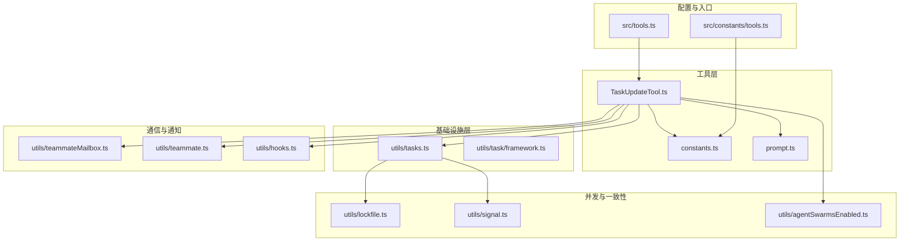
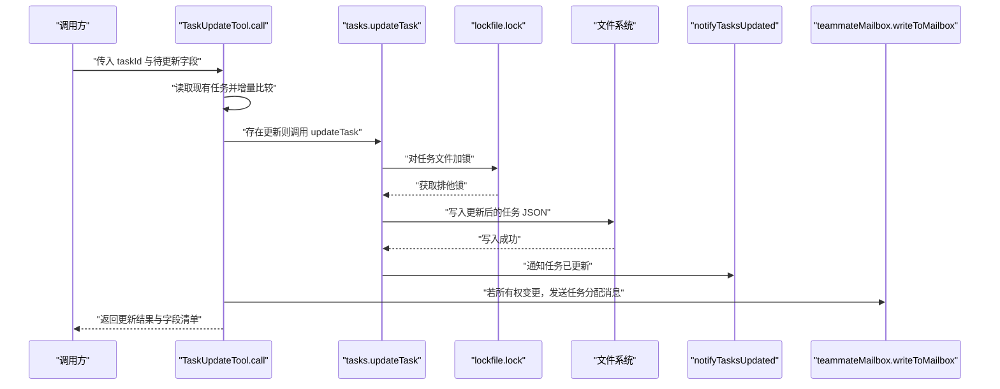
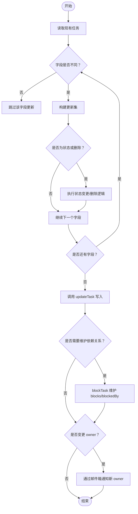
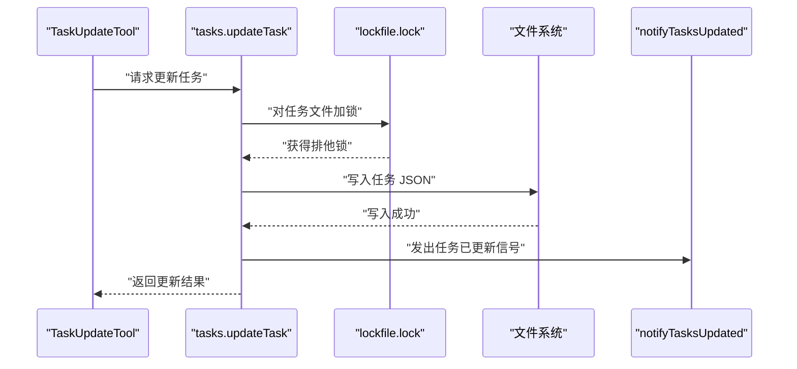
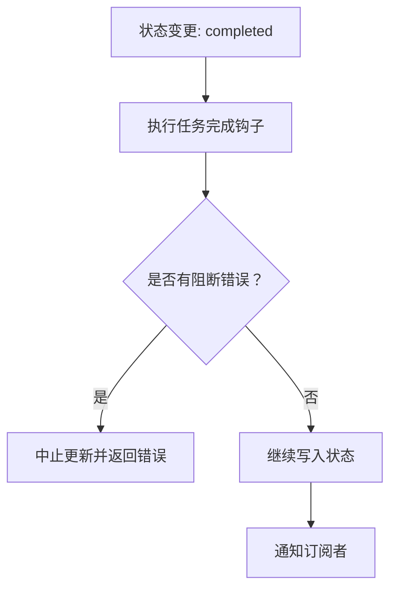
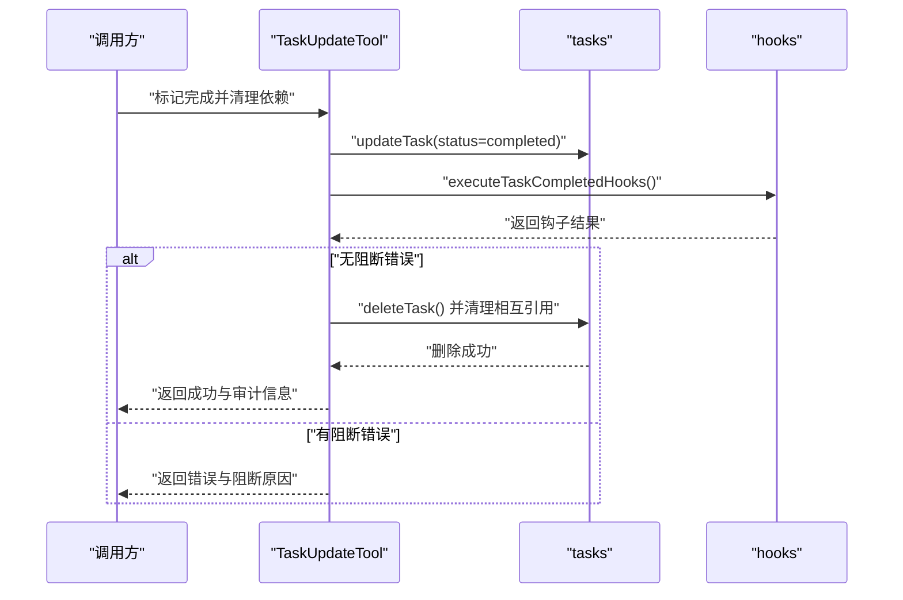
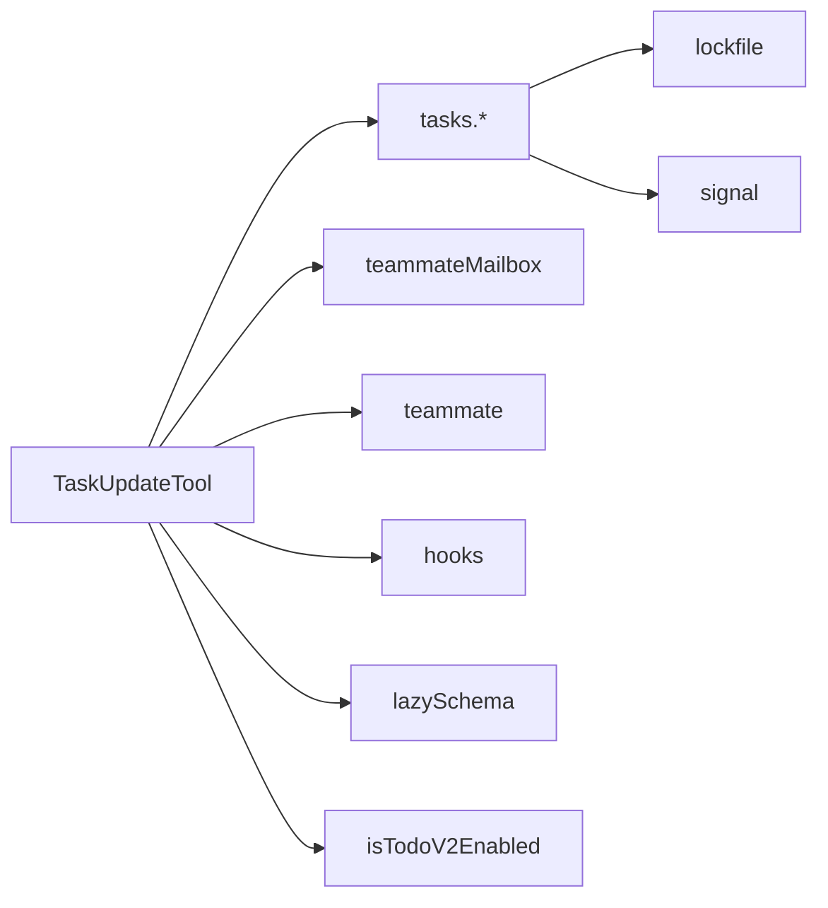

# 任务更新工具

<cite>
**本文引用的文件**
- [src/tools/TaskUpdateTool/TaskUpdateTool.ts](file://src/tools/TaskUpdateTool/TaskUpdateTool.ts)
- [src/tools/TaskUpdateTool/constants.ts](file://src/tools/TaskUpdateTool/constants.ts)
- [src/tools/TaskUpdateTool/prompt.ts](file://src/tools/TaskUpdateTool/prompt.ts)
- [src/utils/tasks.ts](file://src/utils/tasks.ts)
- [src/utils/task/framework.ts](file://src/utils/task/framework.ts)
- [src/utils/teammateMailbox.ts](file://src/utils/teammateMailbox.ts)
- [src/utils/teammate.ts](file://src/utils/teammate.ts)
- [src/utils/hooks.ts](file://src/utils/hooks.ts)
- [src/utils/agentSwarmsEnabled.ts](file://src/utils/agentSwarmsEnabled.ts)
- [src/bootstrap/state.ts](file://src/bootstrap/state.ts)
- [src/utils/errors.ts](file://src/utils/errors.ts)
- [src/utils/log.ts](file://src/utils/log.ts)
- [src/utils/debug.ts](file://src/utils/debug.ts)
- [src/utils/signal.ts](file://src/utils/signal.ts)
- [src/utils/lockfile.ts](file://src/utils/lockfile.ts)
- [src/utils/lazySchema.ts](file://src/utils/lazySchema.ts)
- [src/tools.ts](file://src/tools.ts)
- [src/constants/tools.ts](file://src/constants/tools.ts)
</cite>

## 目录
1. [简介](#简介)
2. [项目结构](#项目结构)
3. [核心组件](#核心组件)
4. [架构总览](#架构总览)
5. [详细组件分析](#详细组件分析)
6. [依赖关系分析](#依赖关系分析)
7. [性能考量](#性能考量)
8. [故障排查指南](#故障排查指南)
9. [结论](#结论)
10. [附录](#附录)

## 简介
本文件面向“任务更新工具”（TaskUpdateTool）的使用者与维护者，系统性阐述其修改机制、增量更新与原子操作保障、可更新字段范围、权限控制与冲突检测、日志记录与审计追踪、并发更新处理策略与数据一致性保证，并提供复杂更新场景的实现思路与性能优化建议。目标是帮助读者在理解工具行为的同时，安全、高效地使用该工具完成任务状态变更、属性更新与依赖关系维护。

## 项目结构
TaskUpdateTool 位于工具层，围绕任务持久化与并发控制的基础设施进行工作。其关键交互如下：
- 工具层：TaskUpdateTool 负责输入校验、字段增量比较、状态变更钩子、所有权通知与依赖关系维护。
- 基础设施层：tasks.ts 提供任务的增删改查、文件锁、高水位标记、列表监听等能力；framework.ts 提供状态机框架（如 updateTaskState）。
- 通信与通知：teammateMailbox.ts 用于跨代理通知；teammate.ts 提供代理信息；hooks.ts 提供任务完成钩子。
- 并发与一致性：lockfile.ts 提供文件级互斥；signal.ts 提供进程内事件通知；agentSwarmsEnabled.ts 控制多代理模式行为。
- 配置与入口：tools.ts 汇聚工具集合；constants/tools.ts 定义工具常量。

**图示来源**
- [src/tools/TaskUpdateTool/TaskUpdateTool.ts:123-363](file://src/tools/TaskUpdateTool/TaskUpdateTool.ts#L123-L363)
- [src/utils/tasks.ts:370-391](file://src/utils/tasks.ts#L370-L391)
- [src/utils/teammateMailbox.ts](file://src/utils/teammateMailbox.ts)
- [src/utils/teammate.ts](file://src/utils/teammate.ts)
- [src/utils/hooks.ts](file://src/utils/hooks.ts)
- [src/utils/agentSwarmsEnabled.ts](file://src/utils/agentSwarmsEnabled.ts)
- [src/utils/lockfile.ts](file://src/utils/lockfile.ts)
- [src/utils/signal.ts](file://src/utils/signal.ts)
- [src/tools.ts:218-218](file://src/tools.ts#L218-L218)
- [src/constants/tools.ts:23-23](file://src/constants/tools.ts#L23-L23)

**章节来源**
- [src/tools/TaskUpdateTool/TaskUpdateTool.ts:1-120](file://src/tools/TaskUpdateTool/TaskUpdateTool.ts#L1-L120)
- [src/utils/tasks.ts:1-139](file://src/utils/tasks.ts#L1-L139)

## 核心组件
- TaskUpdateTool：工具定义与调用流程，负责输入校验、增量比较、状态变更钩子、所有权通知、依赖关系维护与结果映射。
- 任务持久化与并发控制：tasks.ts 提供任务 CRUD、文件锁、高水位标记、列表监听、依赖关系维护等。
- 代理与团队：teammate.ts 提供代理名称与颜色；teammateMailbox.ts 提供跨代理消息通道。
- 钩子与状态机：hooks.ts 提供任务完成钩子；framework.ts 提供状态机框架（如 updateTaskState）。
- 入口与常量：tools.ts 汇聚工具；constants/tools.ts 定义工具名常量。

**章节来源**
- [src/tools/TaskUpdateTool/TaskUpdateTool.ts:88-122](file://src/tools/TaskUpdateTool/TaskUpdateTool.ts#L88-L122)
- [src/utils/tasks.ts:370-486](file://src/utils/tasks.ts#L370-L486)
- [src/utils/teammate.ts](file://src/utils/teammate.ts)
- [src/utils/teammateMailbox.ts](file://src/utils/teammateMailbox.ts)
- [src/utils/hooks.ts](file://src/utils/hooks.ts)
- [src/utils/task/framework.ts:47-47](file://src/utils/task/framework.ts#L47-L47)
- [src/tools.ts:218-218](file://src/tools.ts#L218-L218)
- [src/constants/tools.ts:23-23](file://src/constants/tools.ts#L23-L23)

## 架构总览
TaskUpdateTool 的调用路径从工具层进入，经由任务持久化层完成原子写入与依赖关系维护，同时通过信号与邮件箱进行进程内与跨代理通知。

**图示来源**
- [src/tools/TaskUpdateTool/TaskUpdateTool.ts:123-363](file://src/tools/TaskUpdateTool/TaskUpdateTool.ts#L123-L363)
- [src/utils/tasks.ts:370-391](file://src/utils/tasks.ts#L370-L391)
- [src/utils/lockfile.ts](file://src/utils/lockfile.ts)
- [src/utils/signal.ts](file://src/utils/signal.ts)
- [src/utils/teammateMailbox.ts](file://src/utils/teammateMailbox.ts)

## 详细组件分析

### 可更新字段与修改机制
- 字段范围
  - 基本字段：主题（subject）、描述（description）、进行时形态（activeForm）、所有者（owner）、元数据（metadata）。
  - 状态字段：支持 pending、in_progress、completed 三态推进，以及特殊动作 deleted（永久删除任务）。
  - 依赖关系：addBlocks（新增阻塞任务）、addBlockedBy（新增被阻塞任务）。
- 修改机制
  - 增量更新：仅当新值与当前值不同时才纳入更新集，避免无意义写入。
  - 特殊逻辑：
    - 自动设置 owner：在启用代理集群且将任务置为 in_progress 时，若未显式提供 owner 且当前为空，则自动填充当前代理名。
    - 元数据合并：对 metadata 进行浅合并，键设为 null 表示删除该键。
    - 删除任务：status 设为 deleted 时直接删除文件并清理相互引用。
    - 依赖关系：仅添加不存在的阻塞/被阻塞关系，避免重复写入。
- 输出与结果映射
  - 返回 success、taskId、updatedFields 清单、可选 statusChange 与 verificationNudgeNeeded。
  - 结果映射到工具输出块，包含友好提示与后续建议。

**图示来源**
- [src/tools/TaskUpdateTool/TaskUpdateTool.ts:160-324](file://src/tools/TaskUpdateTool/TaskUpdateTool.ts#L160-L324)

**章节来源**
- [src/tools/TaskUpdateTool/TaskUpdateTool.ts:33-84](file://src/tools/TaskUpdateTool/TaskUpdateTool.ts#L33-L84)
- [src/tools/TaskUpdateTool/TaskUpdateTool.ts:160-324](file://src/tools/TaskUpdateTool/TaskUpdateTool.ts#L160-L324)
- [src/tools/TaskUpdateTool/prompt.ts:30-49](file://src/tools/TaskUpdateTool/prompt.ts#L30-L49)

### 原子操作与并发控制
- 文件级互斥
  - 使用文件锁对任务文件加锁，确保同一时刻只有一个写入者，避免竞态条件。
  - 锁定策略包含重试与退避，以应对多代理并发写入。
- 列表级互斥
  - 任务列表目录维护一个 .lock 文件，用于列表级操作（如 resetTaskList）的互斥。
- 高水位标记
  - 删除任务前更新高水位标记，防止任务 ID 重用导致的数据错配。
- 进程内通知
  - 更新后通过信号通知订阅者刷新 UI 或执行后续逻辑，保证本地一致性。

**图示来源**
- [src/utils/tasks.ts:370-391](file://src/utils/tasks.ts#L370-L391)
- [src/utils/lockfile.ts](file://src/utils/lockfile.ts)
- [src/utils/signal.ts](file://src/utils/signal.ts)

**章节来源**
- [src/utils/tasks.ts:94-108](file://src/utils/tasks.ts#L94-L108)
- [src/utils/tasks.ts:147-188](file://src/utils/tasks.ts#L147-L188)
- [src/utils/tasks.ts:370-391](file://src/utils/tasks.ts#L370-L391)
- [src/utils/tasks.ts:400-441](file://src/utils/tasks.ts#L400-L441)

### 权限控制与冲突检测
- 工具可用性
  - 通过 isTodoV2Enabled 判定工具是否启用，结合非交互会话与环境变量控制。
- 代理集群模式
  - 在启用代理集群时，自动为 in_progress 任务设置 owner，避免列表无法正确匹配活动状态。
- 任务完成钩子
  - 将任务置为 completed 时，执行任务完成钩子；若钩子返回阻断错误，中止本次更新并返回错误信息。
- 依赖冲突检测
  - claimTask 等操作在原子锁下检查代理是否已拥有其他开放任务、是否存在未解决的阻塞者，避免冲突。

**图示来源**
- [src/tools/TaskUpdateTool/TaskUpdateTool.ts:232-265](file://src/tools/TaskUpdateTool/TaskUpdateTool.ts#L232-L265)
- [src/utils/hooks.ts](file://src/utils/hooks.ts)

**章节来源**
- [src/tools/TaskUpdateTool/TaskUpdateTool.ts:108-113](file://src/tools/TaskUpdateTool/TaskUpdateTool.ts#L108-L113)
- [src/utils/agentSwarmsEnabled.ts](file://src/utils/agentSwarmsEnabled.ts)
- [src/utils/tasks.ts:541-612](file://src/utils/tasks.ts#L541-L612)

### 日志记录、版本管理与审计追踪
- 日志记录
  - 读取任务失败时记录调试日志与错误日志，便于定位文件系统异常。
  - 权限更新与规则应用过程有调试日志输出。
- 版本与审计
  - 任务文件为 JSON，每次更新均覆盖写入，保留历史需外部归档策略。
  - 高水位标记用于防止删除任务后 ID 回绕，有助于审计任务生命周期。
- 通知与提醒
  - 成功更新后，工具结果映射包含更新字段清单与状态变化摘要。
  - 完成任务时，给出下一步建议（如调用 TaskList 查找下一个任务）。
  - 在特定条件下触发验证提醒（verificationNudgeNeeded），提示用户进行验证步骤。

**章节来源**
- [src/utils/tasks.ts:333-350](file://src/utils/tasks.ts#L333-L350)
- [src/utils/tasks.ts:400-441](file://src/utils/tasks.ts#L400-L441)
- [src/tools/TaskUpdateTool/TaskUpdateTool.ts:351-363](file://src/tools/TaskUpdateTool/TaskUpdateTool.ts#L351-L363)
- [src/tools/TaskUpdateTool/TaskUpdateTool.ts:384-398](file://src/tools/TaskUpdateTool/TaskUpdateTool.ts#L384-L398)

### 复杂更新场景与实现示例
- 场景一：将任务标记为已完成并自动清理阻塞关系
  - 步骤：将 status 设为 completed，触发钩子；随后删除任务并清理相互引用。
  - 注意：钩子返回阻断错误时应中止更新。
- 场景二：批量建立依赖关系
  - 步骤：多次调用 addBlocks/addBlockedBy，内部仅添加不存在的关系，避免重复写入。
- 场景三：跨代理所有权转移
  - 步骤：更新 owner 字段，触发邮件箱通知新 owner；在代理集群模式下自动设置 owner 更自然。
- 场景四：元数据合并与删除
  - 步骤：通过 metadata 合并键值，将某键设为 null 实现删除。

**图示来源**
- [src/tools/TaskUpdateTool/TaskUpdateTool.ts:212-265](file://src/tools/TaskUpdateTool/TaskUpdateTool.ts#L212-L265)
- [src/utils/tasks.ts:393-441](file://src/utils/tasks.ts#L393-L441)
- [src/utils/hooks.ts](file://src/utils/hooks.ts)

**章节来源**
- [src/tools/TaskUpdateTool/TaskUpdateTool.ts:212-265](file://src/tools/TaskUpdateTool/TaskUpdateTool.ts#L212-L265)
- [src/utils/tasks.ts:458-486](file://src/utils/tasks.ts#L458-L486)

## 依赖关系分析
- 工具层依赖
  - 输入/输出模式：基于 lazySchema 的延迟模式解析，确保运行时按需加载。
  - 任务读写：依赖 tasks.getTask、updateTask、deleteTask、blockTask。
  - 代理与通知：依赖 teammateMailbox 写入消息；依赖 teammate 获取代理信息。
  - 钩子：依赖 hooks.executeTaskCompletedHooks。
- 基础设施层依赖
  - 文件锁：lockfile.lock 提供互斥；LOCK_OPTIONS 控制重试策略。
  - 信号：notifyTasksUpdated 用于进程内刷新。
  - 环境与状态：isTodoV2Enabled 与非交互会话状态影响工具可用性。

**图示来源**
- [src/tools/TaskUpdateTool/TaskUpdateTool.ts:1-31](file://src/tools/TaskUpdateTool/TaskUpdateTool.ts#L1-L31)
- [src/utils/tasks.ts:1-16](file://src/utils/tasks.ts#L1-L16)
- [src/utils/lockfile.ts](file://src/utils/lockfile.ts)
- [src/utils/signal.ts](file://src/utils/signal.ts)
- [src/utils/lazySchema.ts](file://src/utils/lazySchema.ts)
- [src/utils/agentSwarmsEnabled.ts](file://src/utils/agentSwarmsEnabled.ts)

**章节来源**
- [src/tools/TaskUpdateTool/TaskUpdateTool.ts:1-31](file://src/tools/TaskUpdateTool/TaskUpdateTool.ts#L1-L31)
- [src/utils/tasks.ts:1-16](file://src/utils/tasks.ts#L1-L16)

## 性能考量
- 增量更新减少无效写入，降低磁盘 IO 与锁竞争。
- 批量依赖关系仅添加缺失项，避免重复写入。
- 文件锁采用重试与退避策略，平衡吞吐与公平性。
- 列表监听与信号通知避免轮询，提升 UI 刷新效率。
- 建议
  - 对于高频更新场景，尽量合并多次调用为一次调用，减少锁争用。
  - 使用 TaskGet 读取最新状态后再更新，避免不必要的写入。
  - 在代理集群模式下，利用自动 owner 设置减少额外调用。

[本节为通用性能建议，无需具体文件分析]

## 故障排查指南
- 任务不存在
  - 现象：返回错误“任务不存在”。
  - 排查：确认 taskId 是否正确；使用 TaskGet 获取最新状态。
- 写入失败
  - 现象：返回写入失败或空结果。
  - 排查：检查文件系统权限、磁盘空间；查看调试与错误日志。
- 钩子阻断
  - 现象：标记完成时报错并中止。
  - 排查：根据钩子返回的阻断原因处理前置条件（如测试失败、依赖未解）。
- 并发冲突
  - 现象：更新结果不稳定或出现竞态。
  - 排查：确认是否在同一时间有多个写入者；检查锁文件是否存在与权限。

**章节来源**
- [src/tools/TaskUpdateTool/TaskUpdateTool.ts:145-156](file://src/tools/TaskUpdateTool/TaskUpdateTool.ts#L145-L156)
- [src/utils/tasks.ts:341-350](file://src/utils/tasks.ts#L341-L350)
- [src/utils/tasks.ts:232-265](file://src/utils/tasks.ts#L232-L265)
- [src/utils/errors.ts](file://src/utils/errors.ts)
- [src/utils/debug.ts](file://src/utils/debug.ts)
- [src/utils/log.ts](file://src/utils/log.ts)

## 结论
TaskUpdateTool 通过严格的增量比较、文件级互斥与钩子机制，实现了对任务的原子更新与一致状态管理。其设计兼顾了易用性与可靠性：在代理集群模式下提供自动化行为，在完成任务时提供必要的审计与提醒。遵循本文提供的最佳实践与故障排查方法，可在复杂场景中安全、高效地使用该工具。

## 附录
- 工具名称与注册
  - 工具名常量：TASK_UPDATE_TOOL_NAME。
  - 工具注册：在工具集合中加入 TaskUpdateTool。
- 提示与使用指南
  - 使用 prompt 描述中的示例格式组织输入，确保字段清晰明确。

**章节来源**
- [src/tools/TaskUpdateTool/constants.ts:1-2](file://src/tools/TaskUpdateTool/constants.ts#L1-L2)
- [src/tools.ts:218-218](file://src/tools.ts#L218-L218)
- [src/constants/tools.ts:23-23](file://src/constants/tools.ts#L23-L23)
- [src/tools/TaskUpdateTool/prompt.ts:1-79](file://src/tools/TaskUpdateTool/prompt.ts#L1-L79)