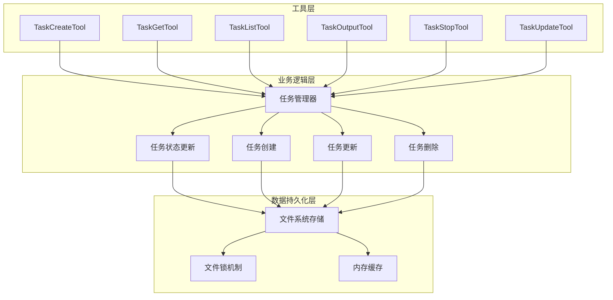
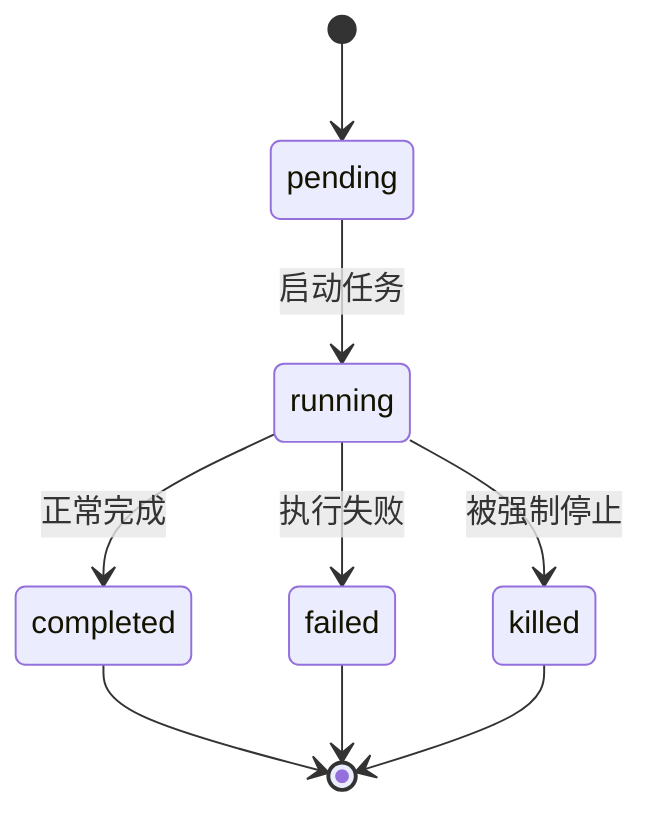
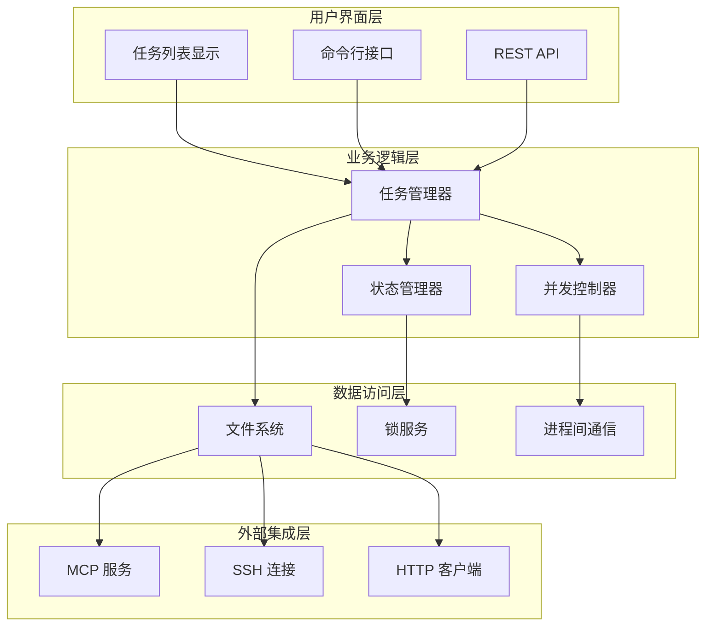
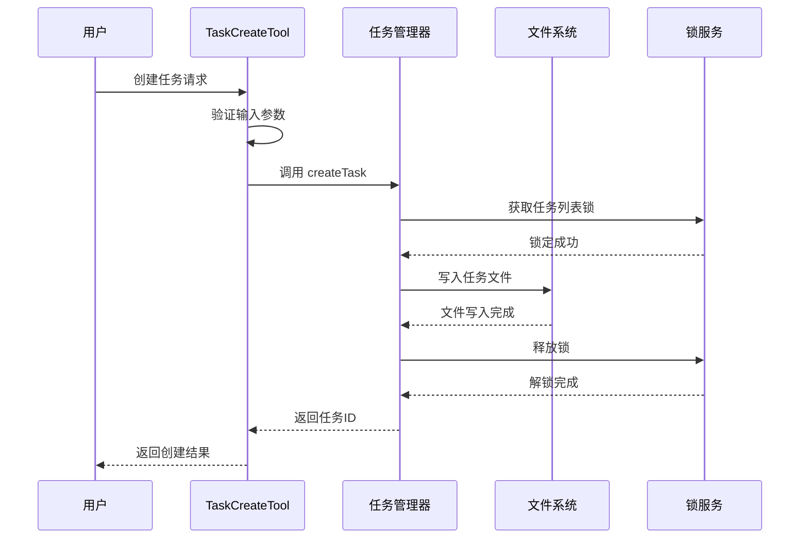
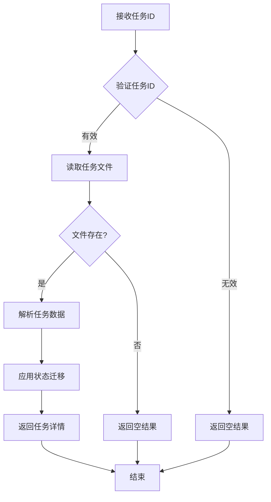
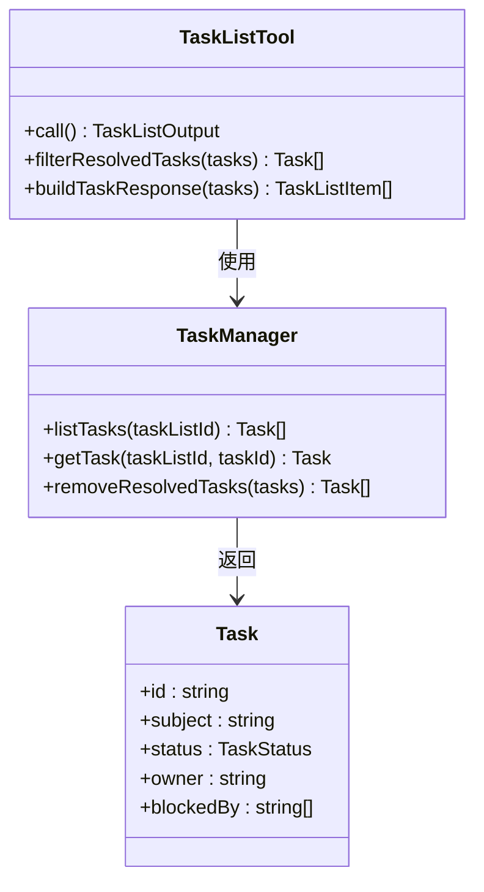
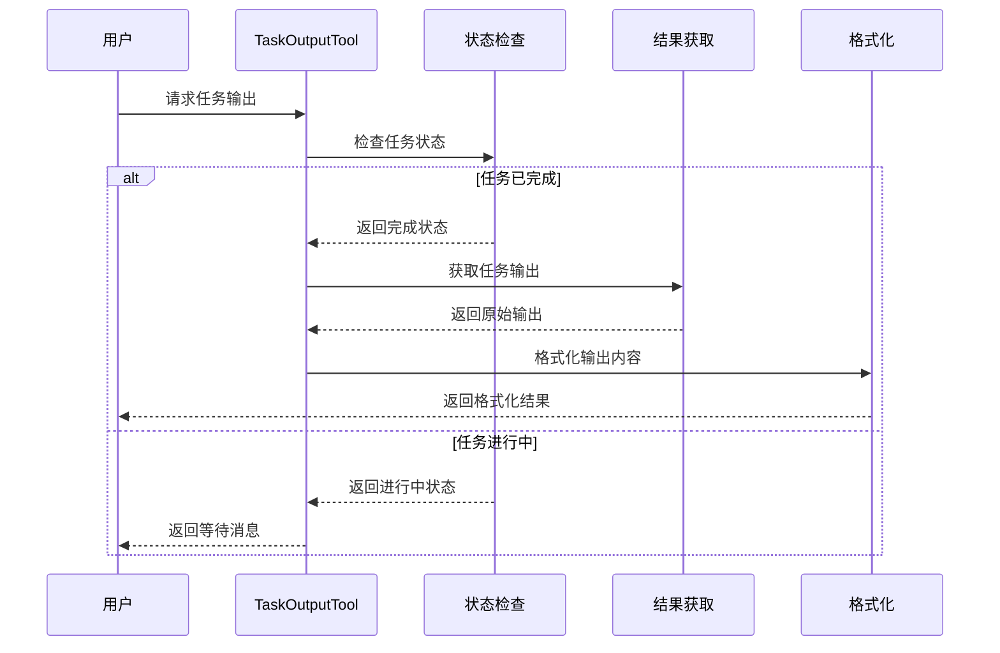
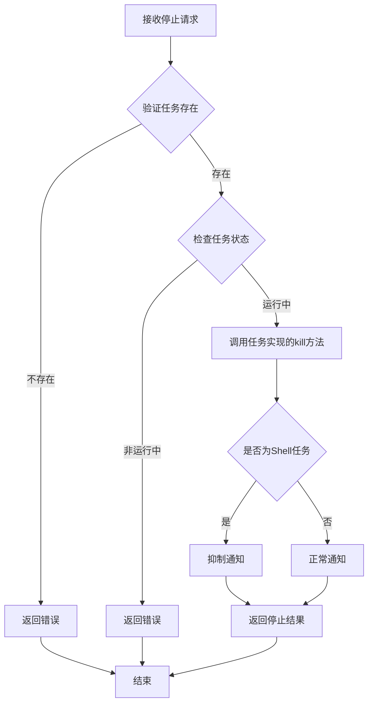
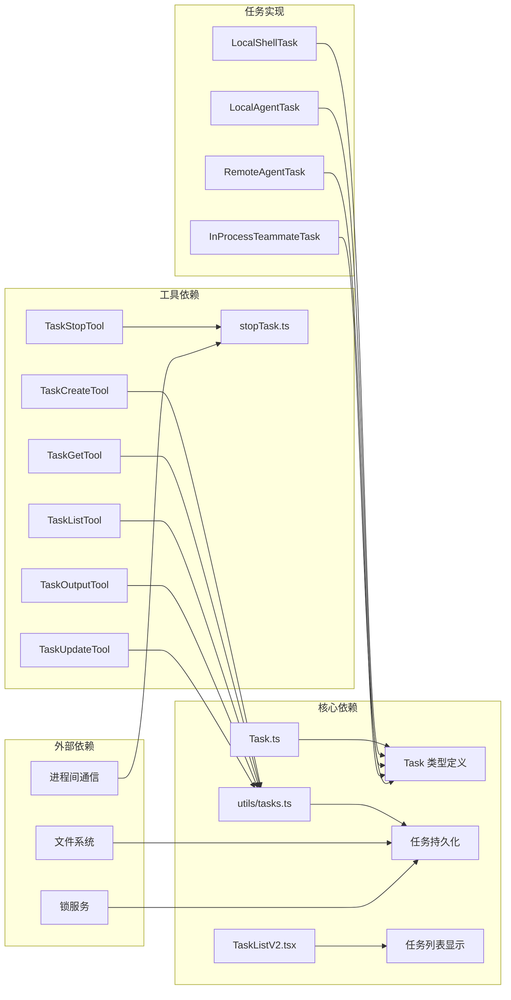

# 任务管理工具

<cite>
**本文档引用的文件**
- [src/tasks/types.ts](file://src/tasks/types.ts)
- [src/tasks.ts](file://src/tasks.ts)
- [src/Task.ts](file://src/Task.ts)
- [src/utils/tasks.ts](file://src/utils/tasks.ts)
- [src/tasks/stopTask.ts](file://src/tasks/stopTask.ts)
- [src/tools/TaskCreateTool/TaskCreateTool.ts](file://src/tools/TaskCreateTool/TaskCreateTool.ts)
- [src/tools/TaskGetTool/TaskGetTool.ts](file://src/tools/TaskGetTool/TaskGetTool.ts)
- [src/tools/TaskListTool/TaskListTool.ts](file://src/tools/TaskListTool/TaskListTool.ts)
- [src/tools/TaskOutputTool/TaskOutputTool.tsx](file://src/tools/TaskOutputTool/TaskOutputTool.tsx)
- [src/tools/TaskStopTool/TaskStopTool.ts](file://src/tools/TaskStopTool/TaskStopTool.ts)
- [src/tools/TaskUpdateTool/TaskUpdateTool.ts](file://src/tools/TaskUpdateTool/TaskUpdateTool.ts)
- [src/tools/TaskUpdateTool/prompt.ts](file://src/tools/TaskUpdateTool/prompt.ts)
- [src/components/TaskListV2.tsx](file://src/components/TaskListV2.tsx)
</cite>

## 目录
1. [简介](#简介)
2. [项目结构](#项目结构)
3. [核心组件](#核心组件)
4. [架构概览](#架构概览)
5. [详细组件分析](#详细组件分析)
6. [依赖关系分析](#依赖关系分析)
7. [性能考虑](#性能考虑)
8. [故障排除指南](#故障排除指南)
9. [结论](#结论)

## 简介

Claude Code 的任务管理工具是一个完整的后台任务管理系统，支持多种任务类型（本地 Shell、本地代理、远程代理、进程内代理等），提供任务创建、查询、列表展示、输出获取、停止和更新等功能。该系统采用文件系统持久化存储，通过原子锁确保并发安全，并提供了丰富的状态跟踪和进度监控机制。

## 项目结构

任务管理系统的整体架构分为三个主要层次：

**图表来源**
- [src/tasks/types.ts:1-48](file://src/tasks/types.ts#L1-L48)
- [src/utils/tasks.ts:1-800](file://src/utils/tasks.ts#L1-L800)

**章节来源**
- [src/tasks/types.ts:1-48](file://src/tasks/types.ts#L1-L48)
- [src/utils/tasks.ts:1-800](file://src/utils/tasks.ts#L1-L800)

## 核心组件

### 任务类型系统

系统支持七种不同的任务类型，每种类型都有其特定的状态和行为：

| 任务类型 | 描述 | 状态流转 |
|---------|------|----------|
| local_bash | 本地 Shell 命令执行 | pending → running → completed/failed/killed |
| local_agent | 本地代理任务 | pending → running → completed/failed/killed |
| remote_agent | 远程代理任务 | pending → running → completed/failed/killed |
| in_process_teammate | 进程内代理伙伴 | pending → running → completed/failed/killed |
| local_workflow | 本地工作流任务 | pending → running → completed/failed/killed |
| monitor_mcp | MCP 监控任务 | pending → running → completed/failed/killed |
| dream | 梦境任务 | pending → running → completed/failed/killed |

### 任务状态管理

任务状态采用统一的枚举定义，确保跨不同任务类型的兼容性：

**图表来源**
- [src/Task.ts:15-29](file://src/Task.ts#L15-L29)

**章节来源**
- [src/Task.ts:1-128](file://src/Task.ts#L1-L128)

## 架构概览

任务管理系统的整体架构采用分层设计，确保了模块间的松耦合和高内聚：

**图表来源**
- [src/utils/tasks.ts:1-800](file://src/utils/tasks.ts#L1-L800)
- [src/tasks/stopTask.ts:1-102](file://src/tasks/stopTask.ts#L1-L102)

## 详细组件分析

### 任务创建工具 (TaskCreateTool)

任务创建工具提供了创建新任务的能力，支持基本的任务信息配置：

**图表来源**
- [src/tools/TaskCreateTool/TaskCreateTool.ts:80-129](file://src/tools/TaskCreateTool/TaskCreateTool.ts#L80-L129)
- [src/utils/tasks.ts:284-308](file://src/utils/tasks.ts#L284-L308)

**章节来源**
- [src/tools/TaskCreateTool/TaskCreateTool.ts:1-140](file://src/tools/TaskCreateTool/TaskCreateTool.ts#L1-L140)
- [src/utils/tasks.ts:284-308](file://src/utils/tasks.ts#L284-L308)

### 任务查询工具 (TaskGetTool)

任务查询工具允许用户根据任务ID获取任务的详细信息：

**图表来源**
- [src/tools/TaskGetTool/TaskGetTool.ts:73-98](file://src/tools/TaskGetTool/TaskGetTool.ts#L73-L98)
- [src/utils/tasks.ts:310-350](file://src/utils/tasks.ts#L310-L350)

**章节来源**
- [src/tools/TaskGetTool/TaskGetTool.ts:1-130](file://src/tools/TaskGetTool/TaskGetTool.ts#L1-L130)
- [src/utils/tasks.ts:310-350](file://src/utils/tasks.ts#L310-L350)

### 任务列表工具 (TaskListTool)

任务列表工具提供任务的批量查询和过滤功能：

**图表来源**
- [src/tools/TaskListTool/TaskListTool.ts:65-90](file://src/tools/TaskListTool/TaskListTool.ts#L65-L90)
- [src/utils/tasks.ts:443-456](file://src/utils/tasks.ts#L443-L456)

**章节来源**
- [src/tools/TaskListTool/TaskListTool.ts:1-118](file://src/tools/TaskListTool/TaskListTool.ts#L1-L118)
- [src/utils/tasks.ts:443-456](file://src/utils/tasks.ts#L443-L456)

### 任务输出工具 (TaskOutputTool)

任务输出工具提供了任务执行结果的获取和格式化功能：

**图表来源**
- [src/tools/TaskOutputTool/TaskOutputTool.tsx:208-282](file://src/tools/TaskOutputTool/TaskOutputTool.tsx#L208-L282)
- [src/tools/TaskOutputTool/TaskOutputTool.tsx:117-143](file://src/tools/TaskOutputTool/TaskOutputTool.tsx#L117-L143)

**章节来源**
- [src/tools/TaskOutputTool/TaskOutputTool.tsx:1-585](file://src/tools/TaskOutputTool/TaskOutputTool.tsx#L1-L585)

### 任务停止工具 (TaskStopTool)

任务停止工具提供了强制终止运行中任务的能力：

**图表来源**
- [src/tools/TaskStopTool/TaskStopTool.ts:107-130](file://src/tools/TaskStopTool/TaskStopTool.ts#L107-L130)
- [src/tasks/stopTask.ts:38-100](file://src/tasks/stopTask.ts#L38-L100)

**章节来源**
- [src/tools/TaskStopTool/TaskStopTool.ts:1-133](file://src/tools/TaskStopTool/TaskStopTool.ts#L1-L133)
- [src/tasks/stopTask.ts:1-102](file://src/tasks/stopTask.ts#L1-L102)

### 任务更新工具 (TaskUpdateTool)

任务更新工具提供了对现有任务的修改能力，支持多种更新字段：

**章节来源**
- [src/tools/TaskUpdateTool/TaskUpdateTool.ts:37-86](file://src/tools/TaskUpdateTool/TaskUpdateTool.ts#L37-L86)
- [src/tools/TaskUpdateTool/prompt.ts:26-77](file://src/tools/TaskUpdateTool/prompt.ts#L26-L77)

## 依赖关系分析

任务管理系统的依赖关系呈现清晰的层次结构：

**图表来源**
- [src/tasks.ts:1-41](file://src/tasks.ts#L1-L41)
- [src/utils/tasks.ts:1-800](file://src/utils/tasks.ts#L1-L800)

**章节来源**
- [src/tasks.ts:1-41](file://src/tasks.ts#L1-L41)
- [src/utils/tasks.ts:1-800](file://src/utils/tasks.ts#L1-L800)

## 性能考虑

### 并发控制机制

系统采用了多层并发控制机制来确保数据一致性和操作原子性：

1. **文件级锁**：每个任务文件都有独立的锁文件，防止并发修改
2. **任务列表锁**：在批量操作时使用任务列表级别的锁
3. **进程间锁**：通过文件系统锁实现跨进程同步

### 缓存策略

系统实现了多层次的缓存机制：

- **内存缓存**：最近访问的任务状态缓存
- **文件系统缓存**：任务文件的读取缓存
- **UI缓存**：界面渲染结果的缓存

### 性能优化建议

1. **批量操作**：对于大量任务操作，使用批量处理减少锁竞争
2. **异步处理**：长时间运行的任务应使用异步模式
3. **资源清理**：定期清理已完成任务的临时文件
4. **监控指标**：建立任务执行时间、成功率等关键指标监控

## 故障排除指南

### 常见问题及解决方案

#### 任务状态异常
- **问题**：任务状态显示不正确
- **原因**：文件系统损坏或锁文件异常
- **解决**：重启应用，检查磁盘空间，清理锁文件

#### 任务无法停止
- **问题**：调用停止命令后任务仍在运行
- **原因**：任务实现未正确处理中断信号
- **解决**：检查任务实现的 kill 方法，确认进程树清理

#### 数据不一致
- **问题**：任务列表显示与实际状态不符
- **原因**：并发操作导致的数据竞争
- **解决**：检查锁机制，避免直接修改文件系统

### 调试技巧

1. **启用调试日志**：设置环境变量查看详细的执行日志
2. **检查文件权限**：确保应用程序有正确的文件系统访问权限
3. **监控资源使用**：观察 CPU、内存、磁盘 I/O 使用情况
4. **验证锁状态**：检查锁文件是否存在，是否被正确释放

**章节来源**
- [src/utils/tasks.ts:1-800](file://src/utils/tasks.ts#L1-L800)
- [src/tasks/stopTask.ts:1-102](file://src/tasks/stopTask.ts#L1-L102)

## 结论

Claude Code 的任务管理工具提供了一个完整、可靠且高性能的任务管理系统。通过合理的架构设计、完善的并发控制机制和丰富的功能特性，该系统能够满足各种复杂场景下的任务管理需求。

系统的主要优势包括：
- **模块化设计**：清晰的层次结构便于维护和扩展
- **强一致性**：通过文件锁确保数据完整性
- **灵活的调度**：支持多种任务类型和执行模式
- **完善的监控**：提供详细的状态跟踪和进度监控
- **良好的性能**：优化的缓存策略和并发控制机制

未来可以考虑的改进方向：
- 增加任务优先级和队列管理
- 实现更细粒度的权限控制
- 提供更丰富的任务模板和预设
- 增强任务依赖图的可视化展示
- 优化大规模任务场景的性能表现