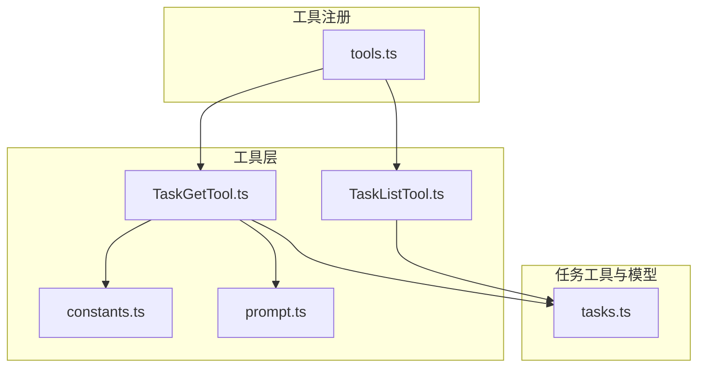
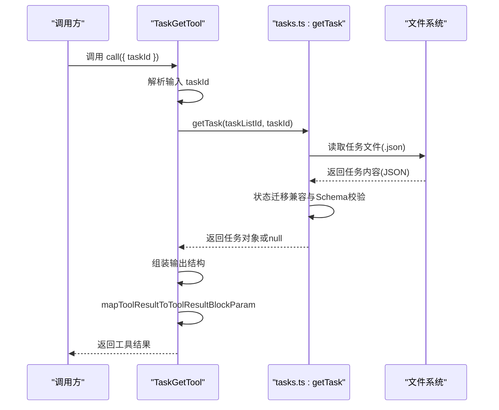
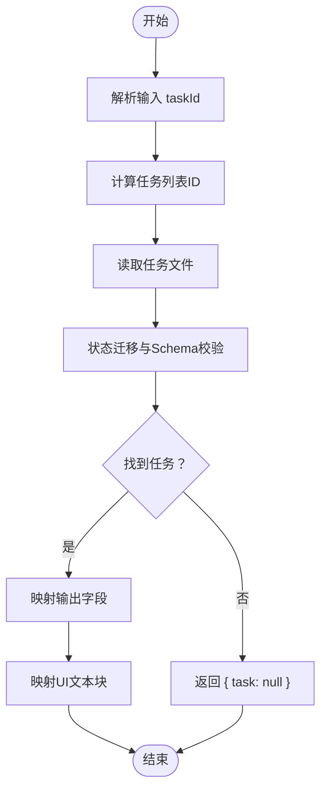
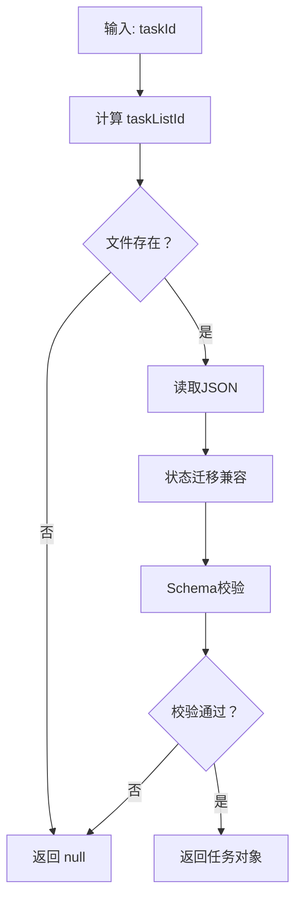
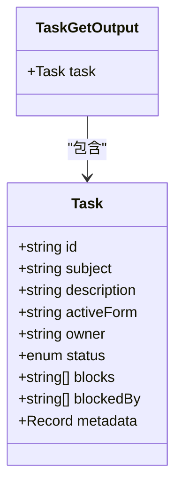
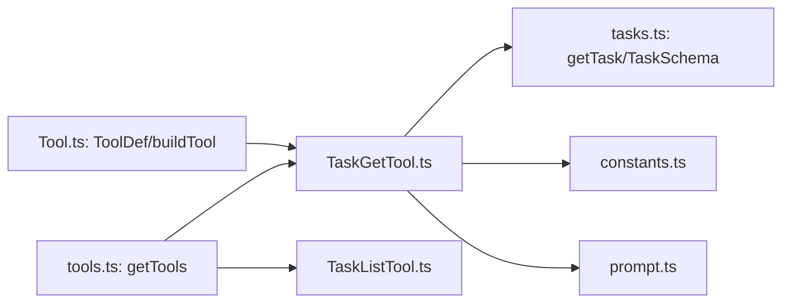

# 任务获取工具

<cite>
**本文档引用的文件**
- [TaskGetTool.ts](file://src/tools/TaskGetTool/TaskGetTool.ts)
- [constants.ts](file://src/tools/TaskGetTool/constants.ts)
- [prompt.ts](file://src/tools/TaskGetTool/prompt.ts)
- [tasks.ts](file://src/utils/tasks.ts)
- [TaskListTool.ts](file://src/tools/TaskListTool/TaskListTool.ts)
- [Tool.ts](file://src/Tool.ts)
- [tools.ts](file://src/tools.ts)
- [tools.md](file://docs/tools.md)
- [subsystems.md](file://docs/subsystems.md)
</cite>

## 目录
1. [简介](#简介)
2. [项目结构](#项目结构)
3. [核心组件](#核心组件)
4. [架构总览](#架构总览)
5. [详细组件分析](#详细组件分析)
6. [依赖关系分析](#依赖关系分析)
7. [性能考量](#性能考量)
8. [故障排除指南](#故障排除指南)
9. [结论](#结论)
10. [附录](#附录)

## 简介
本文件面向使用者与开发者，系统性地说明任务获取工具（TaskGetTool）的设计与实现，重点覆盖以下方面：
- 查询机制：如何通过任务标识符定位并读取任务详情
- 数据检索：任务列表定位、文件系统读取、状态迁移兼容与校验
- 结果格式化：输出结构、UI 展示映射与空值处理
- 标识符与条件：任务 ID 的来源、合法性与边界
- 字段结构：任务主体字段、状态枚举、阻塞关系与元数据
- 性能优化：并发安全、锁机制、批量策略建议
- 使用示例与错误处理：典型场景、失败路径与恢复建议

## 项目结构
TaskGetTool 所在模块位于工具层，其核心实现与任务系统工具集紧密耦合，主要文件如下：
- 工具实现：src/tools/TaskGetTool/TaskGetTool.ts
- 常量与提示：src/tools/TaskGetTool/constants.ts、src/tools/TaskGetTool/prompt.ts
- 任务工具与模型：src/utils/tasks.ts
- 对比工具：src/tools/TaskListTool/TaskListTool.ts
- 工具注册与可用性：src/tools.ts
- 工具文档：docs/tools.md、docs/subsystems.md

**图表来源**
- [TaskGetTool.ts:1-130](file://src/tools/TaskGetTool/TaskGetTool.ts#L1-L130)
- [TaskListTool.ts:1-118](file://src/tools/TaskListTool/TaskListTool.ts#L1-L118)
- [tasks.ts:1-864](file://src/utils/tasks.ts#L1-L864)
- [tools.ts:210-251](file://src/tools.ts#L210-L251)

**章节来源**
- [TaskGetTool.ts:1-130](file://src/tools/TaskGetTool/TaskGetTool.ts#L1-L130)
- [TaskListTool.ts:1-118](file://src/tools/TaskListTool/TaskListTool.ts#L1-L118)
- [tasks.ts:1-864](file://src/utils/tasks.ts#L1-L864)
- [tools.ts:210-251](file://src/tools.ts#L210-L251)

## 核心组件
- TaskGetTool：按任务 ID 获取单个任务的完整详情，支持阻塞关系与状态信息展示，并将结果映射为人类可读文本。
- 任务模型与工具集：tasks.ts 提供任务数据模型、状态枚举、文件存储路径、锁机制、任务列表读取与阻塞关系维护等能力；TaskListTool 提供批量任务摘要视图，便于筛选与去噪。
- 工具注册与可用性：tools.ts 在满足条件时将 TaskGetTool 等任务工具纳入可用工具集合。

关键要点
- 输入参数：仅 taskId（字符串）
- 输出结构：包含 task 对象（含 id、subject、description、status、blocks、blockedBy），若未找到则返回 null
- UI 映射：将任务信息格式化为多行文本，包含任务号、标题、状态、描述及阻塞关系
- 并发安全：标记为并发安全，且内部读取采用文件级锁避免竞态

**章节来源**
- [TaskGetTool.ts:13-17](file://src/tools/TaskGetTool/TaskGetTool.ts#L13-L17)
- [TaskGetTool.ts:20-34](file://src/tools/TaskGetTool/TaskGetTool.ts#L20-L34)
- [TaskGetTool.ts:73-98](file://src/tools/TaskGetTool/TaskGetTool.ts#L73-L98)
- [TaskGetTool.ts:99-127](file://src/tools/TaskGetTool/TaskGetTool.ts#L99-L127)
- [tasks.ts:76-89](file://src/utils/tasks.ts#L76-L89)
- [tasks.ts:310-350](file://src/utils/tasks.ts#L310-L350)

## 架构总览
下图展示了 TaskGetTool 的调用链路与依赖关系：

**图表来源**
- [TaskGetTool.ts:73-98](file://src/tools/TaskGetTool/TaskGetTool.ts#L73-L98)
- [tasks.ts:310-350](file://src/utils/tasks.ts#L310-L350)

**章节来源**
- [TaskGetTool.ts:38-127](file://src/tools/TaskGetTool/TaskGetTool.ts#L38-L127)
- [tasks.ts:199-210](file://src/utils/tasks.ts#L199-L210)
- [tasks.ts:310-350](file://src/utils/tasks.ts#L310-L350)

## 详细组件分析

### TaskGetTool 实现与流程
- 输入与输出模式：使用延迟模式的 Zod Schema 定义输入与输出，确保运行时解析与校验。
- 启用条件：依赖 isTodoV2Enabled 判断是否启用任务系统。
- 并发与只读：标记为并发安全与只读，适合在多线程或多代理环境中使用。
- 调用流程：
  1) 解析输入 taskId
  2) 计算任务列表 ID（优先环境变量、团队上下文、会话 ID）
  3) 读取任务文件并进行状态兼容与 Schema 校验
  4) 将任务字段映射为输出结构
  5) 将结果映射为 UI 友好的文本块

**图表来源**
- [TaskGetTool.ts:73-98](file://src/tools/TaskGetTool/TaskGetTool.ts#L73-L98)
- [tasks.ts:310-350](file://src/utils/tasks.ts#L310-L350)

**章节来源**
- [TaskGetTool.ts:13-17](file://src/tools/TaskGetTool/TaskGetTool.ts#L13-L17)
- [TaskGetTool.ts:20-34](file://src/tools/TaskGetTool/TaskGetTool.ts#L20-L34)
- [TaskGetTool.ts:58-66](file://src/tools/TaskGetTool/TaskGetTool.ts#L58-L66)
- [TaskGetTool.ts:73-98](file://src/tools/TaskGetTool/TaskGetTool.ts#L73-L98)
- [TaskGetTool.ts:99-127](file://src/tools/TaskGetTool/TaskGetTool.ts#L99-L127)

### 任务标识符与查询条件
- 任务 ID：字符串，作为唯一标识符传入 taskId
- 任务列表 ID：通过 getTaskListId 决策优先级（环境变量 > 团队上下文 > 团队名/领导团队名 > 会话 ID）
- 查询条件：当前实现不支持过滤器；仅按 ID 精确匹配
- 边界与容错：当任务不存在或读取异常时返回 null；内部对旧状态名称进行迁移兼容

**图表来源**
- [tasks.ts:199-210](file://src/utils/tasks.ts#L199-L210)
- [tasks.ts:310-350](file://src/utils/tasks.ts#L310-L350)

**章节来源**
- [TaskGetTool.ts:15](file://src/tools/TaskGetTool/TaskGetTool.ts#L15)
- [tasks.ts:199-210](file://src/utils/tasks.ts#L199-L210)
- [tasks.ts:310-350](file://src/utils/tasks.ts#L310-L350)

### 任务详情字段结构与状态信息
- 字段结构（输出 task 对象）：
  - id：任务标识符
  - subject：任务主题/标题
  - description：任务描述/要求
  - status：状态枚举（pending、in_progress、completed）
  - blocks：该任务阻塞的其他任务 ID 列表
  - blockedBy：使该任务无法开始的前置任务 ID 列表
- 元数据：任务模型支持 metadata（任意键值对），但 TaskGetTool 当前输出不包含该字段
- 状态迁移：对历史状态（如 open/resolved/planning/implementing/reviewing/verifying）进行兼容转换

**图表来源**
- [tasks.ts:76-89](file://src/utils/tasks.ts#L76-L89)
- [TaskGetTool.ts:22-31](file://src/tools/TaskGetTool/TaskGetTool.ts#L22-L31)

**章节来源**
- [tasks.ts:69-74](file://src/utils/tasks.ts#L69-L74)
- [tasks.ts:76-89](file://src/utils/tasks.ts#L76-L89)
- [TaskGetTool.ts:22-31](file://src/tools/TaskGetTool/TaskGetTool.ts#L22-L31)

### 结果格式化与 UI 展示
- 输出结构：包含 task 对象或 null
- UI 文本映射：当 task 存在时，生成包含任务号、标题、状态、描述以及阻塞关系的多行文本；当 task 为 null 时，返回“任务未找到”的提示文本
- 适用场景：在对话式界面中以简洁文本形式呈现任务详情，便于快速审阅与决策

**章节来源**
- [TaskGetTool.ts:20-34](file://src/tools/TaskGetTool/TaskGetTool.ts#L20-L34)
- [TaskGetTool.ts:99-127](file://src/tools/TaskGetTool/TaskGetTool.ts#L99-L127)

### 与 TaskListTool 的对比与协作
- TaskListTool 提供批量任务摘要视图，包含任务 ID、主题、状态、所有者与阻塞关系（已过滤已完成任务）
- TaskGetTool 用于获取单个任务的完整详情，适合在确认任务后进一步审阅
- 协作流程：先用 TaskListTool 概览，再用 TaskGetTool 获取具体任务的完整信息

**章节来源**
- [TaskListTool.ts:16-31](file://src/tools/TaskListTool/TaskListTool.ts#L16-L31)
- [TaskListTool.ts:65-90](file://src/tools/TaskListTool/TaskListTool.ts#L65-L90)
- [TaskListTool.ts:91-115](file://src/tools/TaskListTool/TaskListTool.ts#L91-L115)

## 依赖关系分析
- TaskGetTool 依赖 tasks.ts 中的任务模型、状态枚举、文件路径与读取逻辑
- 工具注册：tools.ts 在满足 isTodoV2Enabled 条件时将 TaskGetTool 注册到可用工具集中
- 工具基类：Tool.ts 定义了工具的标准接口与生命周期钩子，TaskGetTool 通过 buildTool 构建并继承默认行为

**图表来源**
- [Tool.ts:783-792](file://src/Tool.ts#L783-L792)
- [TaskGetTool.ts:38-127](file://src/tools/TaskGetTool/TaskGetTool.ts#L38-L127)
- [tasks.ts:76-89](file://src/utils/tasks.ts#L76-L89)
- [tasks.ts:310-350](file://src/utils/tasks.ts#L310-L350)
- [tools.ts:218-220](file://src/tools.ts#L218-L220)

**章节来源**
- [Tool.ts:362-481](file://src/Tool.ts#L362-L481)
- [TaskGetTool.ts:38-127](file://src/tools/TaskGetTool/TaskGetTool.ts#L38-L127)
- [tasks.ts:76-89](file://src/utils/tasks.ts#L76-L89)
- [tools.ts:218-220](file://src/tools.ts#L218-L220)

## 性能考量
- 并发安全：TaskGetTool 标记为并发安全，适合在多代理/多线程环境下并行调用
- 文件锁与重试：底层读取采用文件锁与带退避的重试策略，避免并发写入导致的竞态
- I/O 成本：每次查询涉及一次文件系统读取与 JSON 解析；对于高并发场景，建议：
  - 合理缓存最近访问的任务详情
  - 避免短时间内的重复查询同一任务
  - 使用 TaskListTool 进行批量预览，减少不必要的单任务查询
- 结果大小限制：工具设置了最大结果字符数上限，避免过大的任务详情造成传输与渲染压力

**章节来源**
- [TaskGetTool.ts:57-66](file://src/tools/TaskGetTool/TaskGetTool.ts#L57-L66)
- [tasks.ts:92-108](file://src/utils/tasks.ts#L92-L108)
- [TaskGetTool.ts:41](file://src/tools/TaskGetTool/TaskGetTool.ts#L41)

## 故障排除指南
常见问题与处理建议
- 任务未找到
  - 现象：返回 { task: null } 或 UI 文本显示“任务未找到”
  - 原因：任务 ID 不存在、文件被删除、权限不足或路径不正确
  - 处理：确认 taskId 是否正确；检查任务列表 ID 分配；使用 TaskListTool 校验任务是否存在
- 状态不一致或历史状态
  - 现象：状态值与预期不符
  - 原因：历史状态名称（如 open/resolved/planning 等）会被自动迁移
  - 处理：无需手动干预，系统已在读取时完成迁移
- 文件读取异常
  - 现象：日志记录错误并返回 null
  - 原因：磁盘错误、权限问题或文件损坏
  - 处理：检查配置目录权限与磁盘空间；必要时重建任务文件

排查步骤
1) 确认工具可用性：isTodoV2Enabled 是否为真
2) 校验输入：taskId 是否为有效字符串
3) 校验任务列表 ID：getTaskListId 的返回是否符合预期
4) 查看日志：关注调试日志中的错误信息与 errno 码

**章节来源**
- [TaskGetTool.ts:78-84](file://src/tools/TaskGetTool/TaskGetTool.ts#L78-L84)
- [tasks.ts:310-350](file://src/utils/tasks.ts#L310-L350)
- [tasks.ts:341-349](file://src/utils/tasks.ts#L341-L349)

## 结论
TaskGetTool 提供了稳定、并发安全的任务详情查询能力，结合任务模型与文件系统持久化，能够满足大多数任务审阅与决策场景。通过与 TaskListTool 的配合，用户可以先概览后精读，提升整体效率。在高并发与大数据量场景下，建议结合缓存与批量策略，以获得更佳的性能表现。

## 附录

### 实际使用示例（基于工作流）
- 场景一：审阅任务详情
  - 步骤：先用 TaskListTool 获取任务摘要，再用 TaskGetTool 获取目标任务的完整详情
  - 关注点：确认 blockedBy 是否为空，避免在未完成前置任务时开始工作
- 场景二：验证任务状态
  - 步骤：通过 TaskGetTool 获取任务状态，判断是否为 in_progress 或 completed
  - 关注点：注意历史状态迁移后的值

**章节来源**
- [TaskListTool.ts:65-90](file://src/tools/TaskListTool/TaskListTool.ts#L65-L90)
- [TaskGetTool.ts:73-98](file://src/tools/TaskGetTool/TaskGetTool.ts#L73-L98)

### 工具可用性与文档索引
- 工具文档：docs/tools.md、docs/subsystems.md
- 工具注册：tools.ts 中根据 isTodoV2Enabled 动态注入 TaskGetTool

**章节来源**
- [tools.md:93](file://docs/tools.md#L93)
- [subsystems.md:244](file://docs/subsystems.md#L244)
- [tools.ts:218-220](file://src/tools.ts#L218-L220)