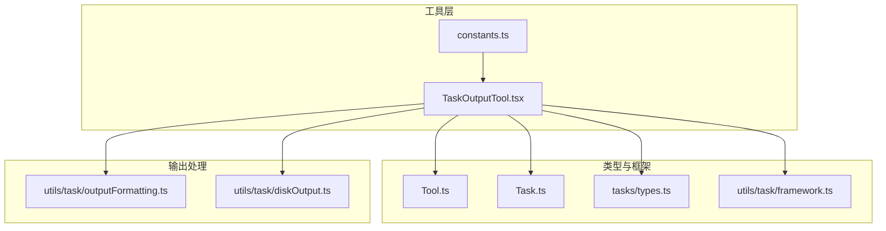
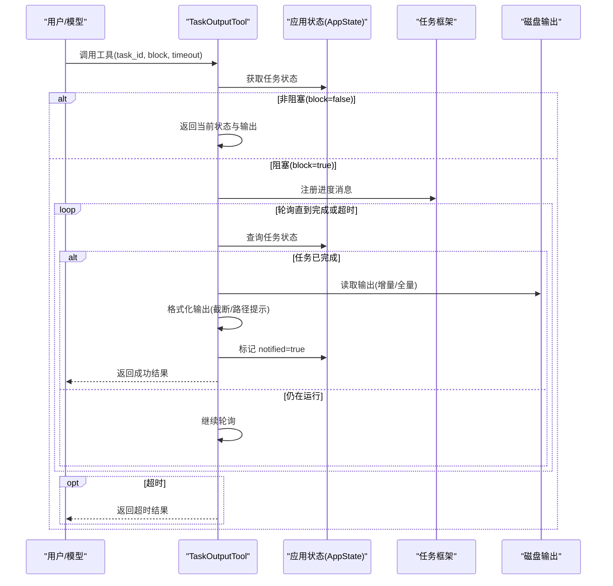
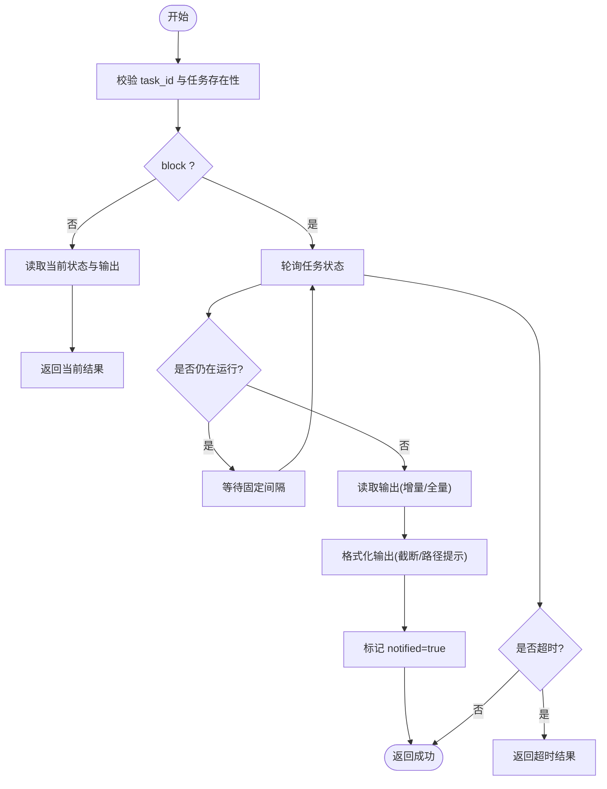
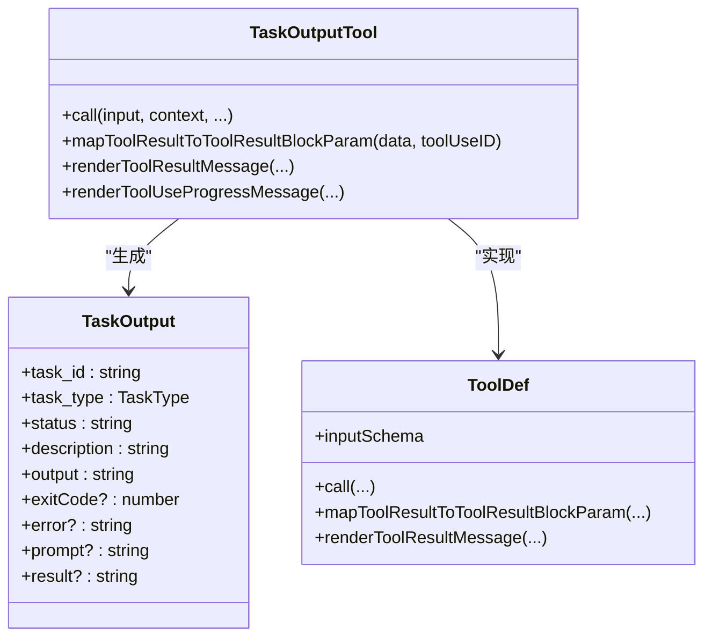
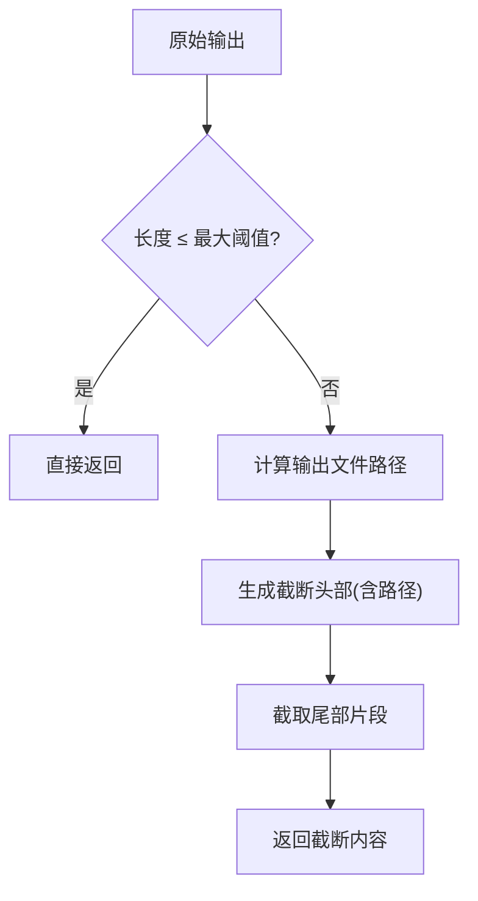
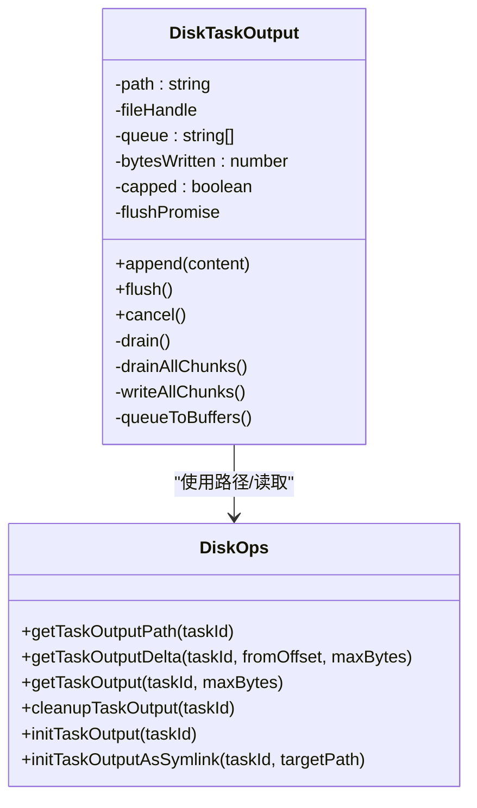
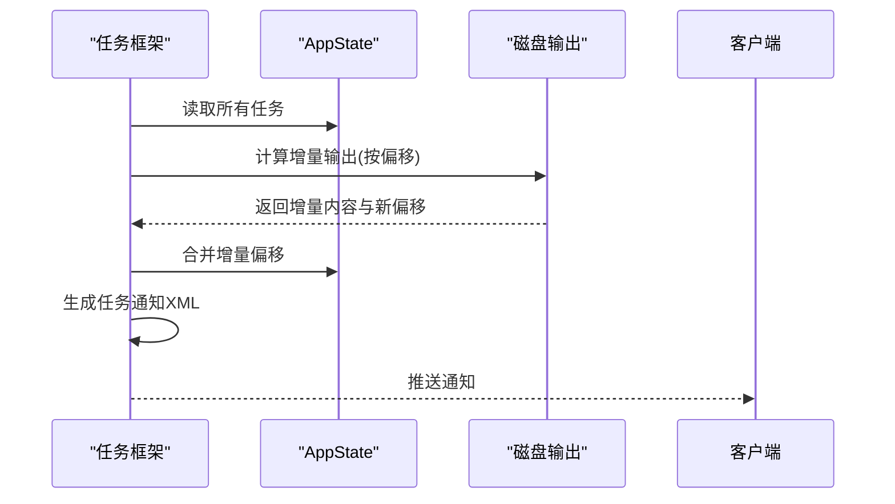
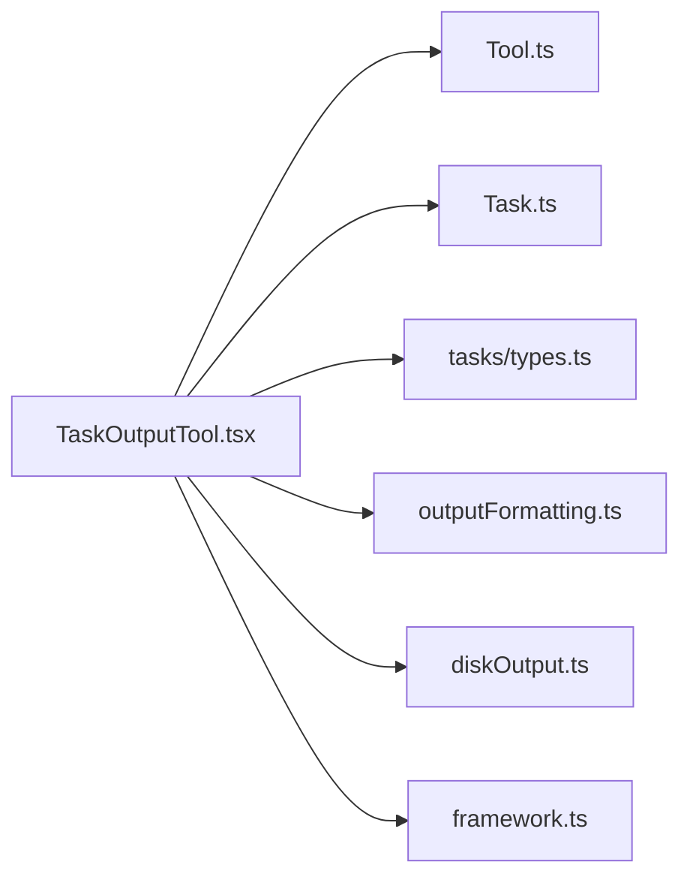

# 任务输出工具

<cite>
**本文引用的文件**
- [TaskOutputTool.tsx](file://src/tools/TaskOutputTool/TaskOutputTool.tsx)
- [constants.ts](file://src/tools/TaskOutputTool/constants.ts)
- [Tool.ts](file://src/Tool.ts)
- [Task.ts](file://src/Task.ts)
- [outputFormatting.ts](file://src/utils/task/outputFormatting.ts)
- [diskOutput.ts](file://src/utils/task/diskOutput.ts)
- [framework.ts](file://src/utils/task/framework.ts)
- [types.ts](file://src/tasks/types.ts)
</cite>

## 目录
1. [简介](#简介)
2. [项目结构](#项目结构)
3. [核心组件](#核心组件)
4. [架构总览](#架构总览)
5. [详细组件分析](#详细组件分析)
6. [依赖关系分析](#依赖关系分析)
7. [性能考量](#性能考量)
8. [故障排查指南](#故障排查指南)
9. [结论](#结论)
10. [附录](#附录)

## 简介
本文件面向“任务输出工具（TaskOutputTool）”的使用者与维护者，系统性阐述其结果收集、格式化与展示机制，覆盖以下关键主题：
- 输出数据的类型转换与序列化处理
- 错误恢复与超时控制
- 输出流的管理、缓冲策略与实时更新
- 复杂输出场景（多任务类型、大输出截断、增量读取）的处理
- 导出、分享与持久化方案
- 性能优化建议与最佳实践

## 项目结构
TaskOutputTool 位于工具目录下，围绕任务状态、磁盘输出与 UI 展示形成闭环：
- 工具定义与调用：TaskOutputTool.tsx
- 常量定义：constants.ts
- 工具框架类型：Tool.ts
- 任务类型与状态：Task.ts、tasks/types.ts
- 输出格式化与截断：utils/task/outputFormatting.ts
- 磁盘输出写入与读取：utils/task/diskOutput.ts
- 任务框架与通知：utils/task/framework.ts

**图表来源**
- [TaskOutputTool.tsx:144-352](file://src/tools/TaskOutputTool/TaskOutputTool.tsx#L144-L352)
- [constants.ts:1-3](file://src/tools/TaskOutputTool/constants.ts#L1-L3)
- [Tool.ts:362-695](file://src/Tool.ts#L362-L695)
- [Task.ts:6-57](file://src/Task.ts#L6-L57)
- [types.ts:12-29](file://src/tasks/types.ts#L12-L29)
- [outputFormatting.ts:17-38](file://src/utils/task/outputFormatting.ts#L17-L38)
- [diskOutput.ts:97-231](file://src/utils/task/diskOutput.ts#L97-L231)
- [framework.ts:158-206](file://src/utils/task/framework.ts#L158-L206)

**章节来源**
- [TaskOutputTool.tsx:144-352](file://src/tools/TaskOutputTool/TaskOutputTool.tsx#L144-L352)
- [constants.ts:1-3](file://src/tools/TaskOutputTool/constants.ts#L1-L3)
- [Tool.ts:362-695](file://src/Tool.ts#L362-L695)
- [Task.ts:6-57](file://src/Task.ts#L6-L57)
- [types.ts:12-29](file://src/tasks/types.ts#L12-L29)
- [outputFormatting.ts:17-38](file://src/utils/task/outputFormatting.ts#L17-L38)
- [diskOutput.ts:97-231](file://src/utils/task/diskOutput.ts#L97-L231)
- [framework.ts:158-206](file://src/utils/task/framework.ts#L158-L206)

## 核心组件
- 工具定义与调用流程：TaskOutputTool 实现了工具接口，负责参数校验、阻塞/非阻塞等待、轮询任务状态、聚合输出并映射为工具结果块。
- 输出格式化：对超长输出进行截断与路径提示，避免传输过大内容。
- 磁盘输出管理：统一的任务输出文件路径、增量读取、安全打开与容量限制。
- 任务框架：生成附件、增量偏移应用、完成通知与回收。

**章节来源**
- [TaskOutputTool.tsx:208-282](file://src/tools/TaskOutputTool/TaskOutputTool.tsx#L208-L282)
- [outputFormatting.ts:17-38](file://src/utils/task/outputFormatting.ts#L17-L38)
- [diskOutput.ts:304-357](file://src/utils/task/diskOutput.ts#L304-L357)
- [framework.ts:158-206](file://src/utils/task/framework.ts#L158-L206)

## 架构总览
TaskOutputTool 的执行路径从“调用输入”到“UI 展示”，贯穿状态查询、输出聚合、格式化与渲染：

**图表来源**
- [TaskOutputTool.tsx:208-282](file://src/tools/TaskOutputTool/TaskOutputTool.tsx#L208-L282)
- [framework.ts:255-269](file://src/utils/task/framework.ts#L255-L269)
- [diskOutput.ts:304-357](file://src/utils/task/diskOutput.ts#L304-L357)

## 详细组件分析

### 结果收集与聚合
- 输入参数校验：确保 task_id 存在且对应任务存在。
- 任务状态轮询：阻塞模式下以固定间隔轮询，直至任务结束或超时。
- 输出聚合：
  - Bash 任务：优先从任务对象获取 stdout/stderr，否则回退到磁盘输出。
  - Agent 任务：优先使用内存中的最终结果文本，其次回退到磁盘输出；同时保留错误信息。
  - 远程 Agent 任务：使用命令作为输出描述。
- 标记已通知：任务完成后设置 notified，避免重复消费。

**图表来源**
- [TaskOutputTool.tsx:183-282](file://src/tools/TaskOutputTool/TaskOutputTool.tsx#L183-L282)
- [diskOutput.ts:304-357](file://src/utils/task/diskOutput.ts#L304-L357)

**章节来源**
- [TaskOutputTool.tsx:183-282](file://src/tools/TaskOutputTool/TaskOutputTool.tsx#L183-L282)
- [Task.ts:44-57](file://src/Task.ts#L44-L57)
- [types.ts:12-29](file://src/tasks/types.ts#L12-L29)

### 类型转换与序列化
- 输入类型：基于 Zod 的严格对象模式，包含 task_id、block（语义布尔）、timeout。
- 输出类型：统一的 TaskOutput 结构，包含任务标识、类型、状态、描述、输出文本、可选退出码与错误信息；按任务类型附加特定字段（如 Agent 的 prompt/result/error）。
- 工具结果序列化：mapToolResultToToolResultBlockParam 将结构化数据序列化为工具结果块，包含检索状态、任务信息与格式化后的输出内容。

**图表来源**
- [TaskOutputTool.tsx:30-54](file://src/tools/TaskOutputTool/TaskOutputTool.tsx#L30-L54)
- [Tool.ts:362-695](file://src/Tool.ts#L362-L695)

**章节来源**
- [TaskOutputTool.tsx:30-54](file://src/tools/TaskOutputTool/TaskOutputTool.tsx#L30-L54)
- [Tool.ts:362-695](file://src/Tool.ts#L362-L695)

### 输出格式化与截断
- 截断阈值：通过环境变量配置最大输出长度，默认值与上限均受控。
- 截断策略：当输出超过阈值时，返回包含完整文件路径的头部与尾部片段，避免传输过大数据。
- UI 提示：在截断场景中明确告知用户完整输出位置，便于进一步查看。

**图表来源**
- [outputFormatting.ts:17-38](file://src/utils/task/outputFormatting.ts#L17-L38)

**章节来源**
- [outputFormatting.ts:7-15](file://src/utils/task/outputFormatting.ts#L7-L15)
- [outputFormatting.ts:22-38](file://src/utils/task/outputFormatting.ts#L22-L38)

### 磁盘输出管理与缓冲策略
- 文件路径：每个任务拥有独立的输出文件，路径包含会话标识，避免并发会话冲突。
- 写入队列：DiskTaskOutput 使用数组队列与单线程 drain 循环，逐块写入并及时释放内存。
- 安全打开：Unix 平台使用 O_NOFOLLOW 防止符号链接攻击；Windows 使用安全标志组合。
- 增量读取：支持从指定偏移读取新内容，避免加载整文件；超出容量限制时自动省略早期内容。
- 容量限制：磁盘上限与内存上限双重保护，防止资源耗尽。

**图表来源**
- [diskOutput.ts:97-231](file://src/utils/task/diskOutput.ts#L97-L231)
- [diskOutput.ts:304-357](file://src/utils/task/diskOutput.ts#L304-L357)

**章节来源**
- [diskOutput.ts:30-31](file://src/utils/task/diskOutput.ts#L30-L31)
- [diskOutput.ts:97-231](file://src/utils/task/diskOutput.ts#L97-L231)
- [diskOutput.ts:304-357](file://src/utils/task/diskOutput.ts#L304-L357)

### 实时更新与通知
- 框架轮询：定期生成附件，携带新增输出与任务状态摘要，并通过消息队列推送。
- 偏移应用：在生成附件后，将增量偏移合并至最新状态，避免竞态导致的状态覆盖。
- 通知格式：包含任务 ID、类型、输出文件路径、状态与摘要，便于后续直接读取。

**图表来源**
- [framework.ts:158-206](file://src/utils/task/framework.ts#L158-L206)
- [framework.ts:255-269](file://src/utils/task/framework.ts#L255-L269)
- [framework.ts:274-290](file://src/utils/task/framework.ts#L274-L290)

**章节来源**
- [framework.ts:158-206](file://src/utils/task/framework.ts#L158-L206)
- [framework.ts:255-269](file://src/utils/task/framework.ts#L255-L269)
- [framework.ts:274-290](file://src/utils/task/framework.ts#L274-L290)

### 错误恢复与超时控制
- 超时策略：阻塞模式下根据 timeout 参数轮询，超时则返回“超时”状态与当前输出。
- 中断处理：若工具被中断（AbortController），抛出 AbortError，上层可据此清理。
- 读取容错：磁盘读取失败时捕获错误码，对 ENOENT 返回空内容，其他错误记录日志并返回空内容，保证稳定性。
- 截断兜底：即使出现异常，仍通过截断与路径提示保障可用性。

**章节来源**
- [TaskOutputTool.tsx:118-143](file://src/tools/TaskOutputTool/TaskOutputTool.tsx#L118-L143)
- [TaskOutputTool.tsx:253-261](file://src/tools/TaskOutputTool/TaskOutputTool.tsx#L253-L261)
- [diskOutput.ts:322-329](file://src/utils/task/diskOutput.ts#L322-L329)

### 导出、分享与持久化
- 导出路径：工具结果中包含输出文件路径，可直接使用“读取”工具对该路径进行读取。
- 分享机制：完成通知中包含输出文件路径与任务摘要，便于复制与分享。
- 持久化策略：输出文件长期驻留于会话目录，支持后续增量读取与重放；任务结束后可回收。

**章节来源**
- [TaskOutputTool.tsx:283-308](file://src/tools/TaskOutputTool/TaskOutputTool.tsx#L283-L308)
- [framework.ts:274-290](file://src/utils/task/framework.ts#L274-L290)
- [diskOutput.ts:49-55](file://src/utils/task/diskOutput.ts#L49-L55)

## 依赖关系分析
- TaskOutputTool 依赖工具框架类型（ToolDef、ToolResult 等）以实现一致的调用与渲染协议。
- 任务类型与状态由 Task.ts 与 tasks/types.ts 定义，支撑不同任务类型的差异化输出聚合。
- 输出格式化与磁盘操作分别由 outputFormatting.ts 与 diskOutput.ts 提供，前者负责截断与提示，后者负责写入、读取与安全策略。
- 任务框架（framework.ts）负责轮询、增量偏移与通知推送，贯穿实时更新链路。

**图表来源**
- [TaskOutputTool.tsx:1-29](file://src/tools/TaskOutputTool/TaskOutputTool.tsx#L1-L29)
- [Tool.ts:362-695](file://src/Tool.ts#L362-L695)
- [Task.ts:6-57](file://src/Task.ts#L6-L57)
- [types.ts:12-29](file://src/tasks/types.ts#L12-L29)
- [outputFormatting.ts:17-38](file://src/utils/task/outputFormatting.ts#L17-L38)
- [diskOutput.ts:97-231](file://src/utils/task/diskOutput.ts#L97-L231)
- [framework.ts:158-206](file://src/utils/task/framework.ts#L158-L206)

**章节来源**
- [TaskOutputTool.tsx:1-29](file://src/tools/TaskOutputTool/TaskOutputTool.tsx#L1-L29)
- [Tool.ts:362-695](file://src/Tool.ts#L362-L695)
- [Task.ts:6-57](file://src/Task.ts#L6-L57)
- [types.ts:12-29](file://src/tasks/types.ts#L12-L29)
- [outputFormatting.ts:17-38](file://src/utils/task/outputFormatting.ts#L17-L38)
- [diskOutput.ts:97-231](file://src/utils/task/diskOutput.ts#L97-L231)
- [framework.ts:158-206](file://src/utils/task/framework.ts#L158-L206)

## 性能考量
- 增量读取：仅读取自上次偏移以来的新内容，避免全量扫描，降低 IO 压力。
- 写入缓冲：DiskTaskOutput 使用队列与单线程 drain，减少内存占用与 GC 压力。
- 截断策略：对超长输出进行截断与路径提示，避免网络与 UI 渲染开销。
- 轮询间隔：框架采用固定轮询间隔，平衡实时性与 CPU 占用。
- 环境变量限流：通过环境变量控制最大输出长度，避免突发大输出影响系统稳定性。

[本节为通用指导，不涉及具体文件分析]

## 故障排查指南
- 无任务输出：确认 task_id 是否正确，任务是否存在；检查 notified 标志是否为 true。
- 超时未完成：调整 timeout 参数；检查任务是否卡住或被中断。
- 读取为空：磁盘文件可能不存在（ENOENT）或读取失败，检查权限与路径。
- 截断显示：确认是否触发了截断逻辑，使用输出文件路径进行完整查看。
- UI 不更新：确认框架轮询是否正常，增量偏移是否被正确合并。

**章节来源**
- [TaskOutputTool.tsx:183-207](file://src/tools/TaskOutputTool/TaskOutputTool.tsx#L183-L207)
- [TaskOutputTool.tsx:253-261](file://src/tools/TaskOutputTool/TaskOutputTool.tsx#L253-L261)
- [diskOutput.ts:322-329](file://src/utils/task/diskOutput.ts#L322-L329)
- [framework.ts:213-249](file://src/utils/task/framework.ts#L213-L249)

## 结论
TaskOutputTool 通过统一的工具接口、严谨的输出格式化与磁盘管理、以及完善的实时更新机制，实现了跨任务类型的稳定输出采集与展示。其设计兼顾性能与安全性，支持超长输出的截断与路径提示，并提供清晰的导出与分享能力。遵循本文的优化建议与最佳实践，可在复杂场景下保持高可靠与高性能。

## 附录
- 常量与名称：工具名称常量集中定义，便于统一管理与兼容旧别名。
- 工具接口：遵循 ToolDef 规范，提供输入校验、权限检查、渲染与进度回调等扩展点。

**章节来源**
- [constants.ts:1-3](file://src/tools/TaskOutputTool/constants.ts#L1-L3)
- [Tool.ts:362-695](file://src/Tool.ts#L362-L695)