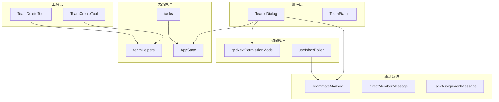
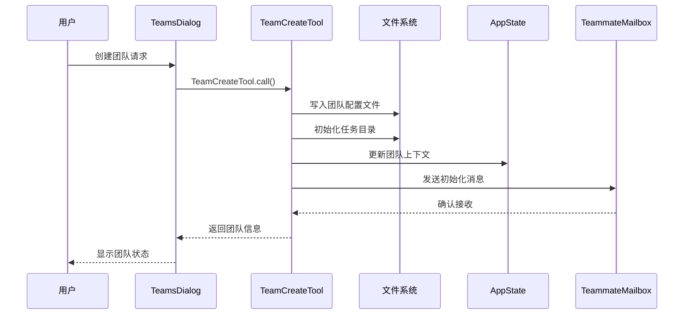
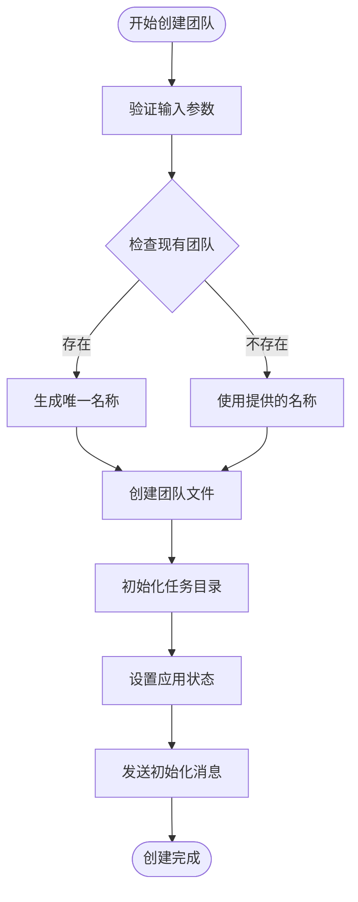
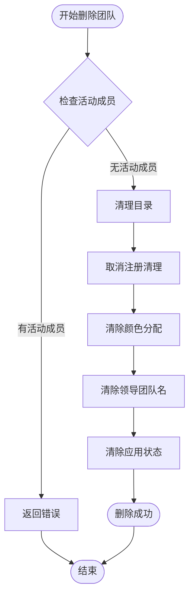
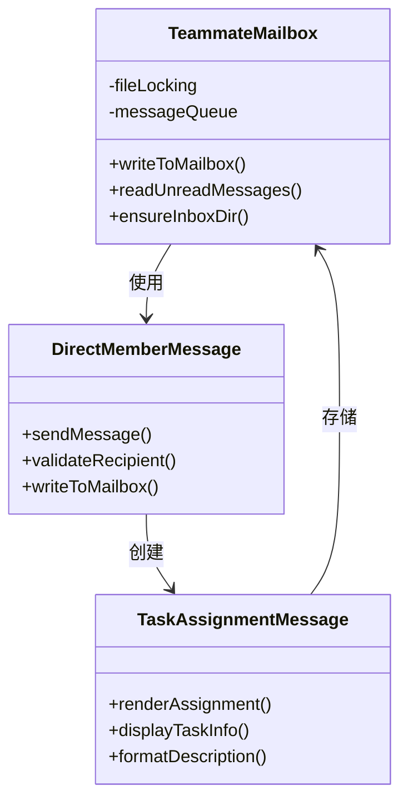
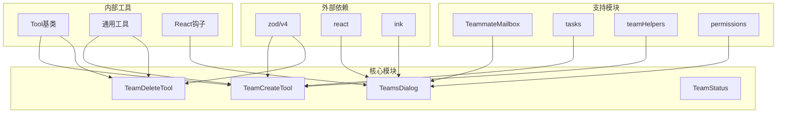

# 团队管理工具

<cite>
**本文档引用的文件**
- [TeamCreateTool.ts](file://src/tools/TeamCreateTool/TeamCreateTool.ts)
- [TeamDeleteTool.ts](file://src/tools/TeamDeleteTool/TeamDeleteTool.ts)
- [TeamsDialog.tsx](file://src/components/teams/TeamsDialog.tsx)
- [TeamStatus.tsx](file://src/components/teams/TeamStatus.tsx)
- [TaskAssignmentMessage.tsx](file://src/components/messages/TaskAssignmentMessage.tsx)
- [teammateMailbox.ts](file://src/utils/teammateMailbox.ts)
- [directMemberMessage.ts](file://src/utils/directMemberMessage.ts)
- [getNextPermissionMode.ts](file://src/utils/permissions/getNextPermissionMode.ts)
- [useInboxPoller.ts](file://src/hooks/useInboxPoller.ts)
- [teamHelpers.ts](file://src/utils/swarm/teamHelpers.ts)
- [tasks.ts](file://src/utils/tasks.ts)
- [AppState.tsx](file://src/state/AppState.tsx)
- [constants.ts](file://src/tools/TeamCreateTool/constants.ts)
- [constants.ts](file://src/tools/TeamDeleteTool/constants.ts)
- [prompt.ts](file://src/tools/TeamCreateTool/prompt.ts)
- [prompt.ts](file://src/tools/TeamDeleteTool/prompt.ts)
</cite>

## 目录
1. [简介](#简介)
2. [项目结构](#项目结构)
3. [核心组件](#核心组件)
4. [架构概览](#架构概览)
5. [详细组件分析](#详细组件分析)
6. [依赖关系分析](#依赖关系分析)
7. [性能考虑](#性能考虑)
8. [故障排除指南](#故障排除指南)
9. [结论](#结论)
10. [附录](#附录)

## 简介

Claude Code 的团队管理工具是一个完整的多代理协作系统，允许用户创建和管理智能代理团队来执行复杂的开发任务。该系统提供了从团队创建、成员管理到任务分配和消息传递的完整解决方案。

该工具的核心特性包括：
- **团队生命周期管理**：支持团队创建、删除和状态监控
- **智能任务分配**：自动化的任务分发和进度跟踪
- **实时消息传递**：基于邮箱系统的异步通信机制
- **权限管理**：灵活的权限模式切换和安全控制
- **协作模式**：支持多种团队协作场景和工作流程

## 项目结构

团队管理工具主要分布在以下模块中：



**图表来源**
- [TeamCreateTool.ts:1-242](file://src/tools/TeamCreateTool/TeamCreateTool.ts#L1-L242)
- [TeamsDialog.tsx:1-716](file://src/components/teams/TeamsDialog.tsx#L1-L716)

**章节来源**
- [TeamCreateTool.ts:1-242](file://src/tools/TeamCreateTool/TeamCreateTool.ts#L1-L242)
- [TeamDeleteTool.ts:1-141](file://src/tools/TeamDeleteTool/TeamDeleteTool.ts#L1-L141)
- [TeamsDialog.tsx:1-716](file://src/components/teams/TeamsDialog.tsx#L1-L716)

## 核心组件

### 团队创建工具 (TeamCreateTool)

团队创建工具负责初始化新的代理团队，建立团队配置文件并设置初始状态。

**关键功能**：
- 验证团队名称唯一性
- 生成团队文件结构
- 初始化任务列表目录
- 设置团队上下文状态

**章节来源**
- [TeamCreateTool.ts:128-237](file://src/tools/TeamCreateTool/TeamCreateTool.ts#L128-L237)

### 团队删除工具 (TeamDeleteTool)

团队删除工具提供安全的团队清理机制，确保所有成员正确终止后再进行资源清理。

**关键功能**：
- 检查活动成员状态
- 清理团队目录和工作树
- 重置颜色分配
- 更新应用状态

**章节来源**
- [TeamDeleteTool.ts:71-135](file://src/tools/TeamDeleteTool/TeamDeleteTool.ts#L71-L135)

### 团队对话框 (TeamsDialog)

团队对话框提供可视化的团队管理界面，支持成员状态查看、权限模式切换和操作控制。

**关键功能**：
- 实时团队成员状态显示
- 权限模式批量切换
- 成员生命周期管理
- 输出面板导航

**章节来源**
- [TeamsDialog.tsx:48-236](file://src/components/teams/TeamsDialog.tsx#L48-L236)

## 架构概览

团队管理系统采用分层架构设计，确保各组件职责清晰且松耦合：



**图表来源**
- [TeamsDialog.tsx:547-604](file://src/components/teams/TeamsDialog.tsx#L547-L604)
- [TeamCreateTool.ts:128-237](file://src/tools/TeamCreateTool/TeamCreateTool.ts#L128-L237)

## 详细组件分析

### 团队创建流程

团队创建过程涉及多个协调步骤，确保系统状态的一致性和完整性：



**图表来源**
- [TeamCreateTool.ts:128-237](file://src/tools/TeamCreateTool/TeamCreateTool.ts#L128-L237)

**章节来源**
- [TeamCreateTool.ts:64-186](file://src/tools/TeamCreateTool/TeamCreateTool.ts#L64-L186)

### 团队删除流程

团队删除采用安全的清理策略，防止数据丢失和资源泄漏：



**图表来源**
- [TeamDeleteTool.ts:71-135](file://src/tools/TeamDeleteTool/TeamDeleteTool.ts#L71-L135)

**章节来源**
- [TeamDeleteTool.ts:76-124](file://src/tools/TeamDeleteTool/TeamDeleteTool.ts#L76-L124)

### 消息传递机制

系统采用基于邮箱的消息传递机制，支持异步通信和消息持久化：



**图表来源**
- [teammateMailbox.ts:134-146](file://src/utils/teammateMailbox.ts#L134-L146)
- [directMemberMessage.ts:49-69](file://src/utils/directMemberMessage.ts#L49-L69)
- [TaskAssignmentMessage.tsx:12-53](file://src/components/messages/TaskAssignmentMessage.tsx#L12-L53)

**章节来源**
- [teammateMailbox.ts:115-146](file://src/utils/teammateMailbox.ts#L115-L146)
- [directMemberMessage.ts:49-69](file://src/utils/directMemberMessage.ts#L49-L69)

### 权限管理模式

权限管理支持动态模式切换，确保团队协作的安全性和灵活性：

```mermaid
stateDiagram-v2
[*] --> Default
Default --> Auto : 自动模式
Default --> Interactive : 交互模式
Default --> Bypass : 绕过模式
Auto --> Default : 默认模式
Auto --> Interactive : 交互模式
Interactive --> Default : 默认模式
Interactive --> Auto : 自动模式
Bypass --> Default : 默认模式
Bypass --> Auto : 自动模式
```

**图表来源**
- [getNextPermissionMode.ts:88-101](file://src/utils/permissions/getNextPermissionMode.ts#L88-L101)

**章节来源**
- [getNextPermissionMode.ts:88-101](file://src/utils/permissions/getNextPermissionMode.ts#L88-L101)
- [TeamsDialog.tsx:665-714](file://src/components/teams/TeamsDialog.tsx#L665-L714)

## 依赖关系分析

团队管理工具的依赖关系呈现清晰的层次结构：



**图表来源**
- [TeamCreateTool.ts:1-35](file://src/tools/TeamCreateTool/TeamCreateTool.ts#L1-L35)
- [TeamsDialog.tsx:1-31](file://src/components/teams/TeamsDialog.tsx#L1-L31)

**章节来源**
- [TeamCreateTool.ts:1-35](file://src/tools/TeamCreateTool/TeamCreateTool.ts#L1-L35)
- [TeamsDialog.tsx:1-31](file://src/components/teams/TeamsDialog.tsx#L1-L31)

## 性能考虑

团队管理工具在设计时充分考虑了性能优化：

### 异步操作优化
- 使用 `async/await` 处理文件系统操作
- 实现文件锁定机制避免并发冲突
- 采用延迟加载减少内存占用

### 缓存策略
- 团队状态缓存避免频繁文件读取
- 颜色分配缓存提升渲染性能
- 任务列表缓存优化查询速度

### 资源管理
- 自动清理临时文件和目录
- 进程间通信优化
- 内存使用监控

## 故障排除指南

### 常见问题及解决方案

**团队创建失败**
- 检查团队名称是否已存在
- 验证磁盘空间和权限
- 确认会话ID有效性

**消息传递异常**
- 检查邮箱目录权限
- 验证文件锁定机制
- 确认网络连接状态

**权限模式切换失败**
- 检查当前权限级别
- 验证模式转换逻辑
- 确认团队成员状态

**章节来源**
- [TeamCreateTool.ts:96-105](file://src/tools/TeamCreateTool/TeamCreateTool.ts#L96-L105)
- [teammateMailbox.ts:134-146](file://src/utils/teammateMailbox.ts#L134-L146)

## 结论

Claude Code 的团队管理工具提供了一个功能完整、设计精良的多代理协作平台。通过模块化的架构设计、完善的错误处理机制和优化的性能考虑，该系统能够有效支持各种团队协作场景。

关键优势包括：
- **易用性**：直观的命令行界面和可视化对话框
- **可靠性**：完善的错误处理和恢复机制
- **可扩展性**：模块化设计支持功能扩展
- **安全性**：细粒度的权限控制和消息隔离

## 附录

### 最佳实践建议

**团队创建工作流程**
1. 使用有意义的团队名称
2. 明确团队目标和范围
3. 选择合适的代理类型
4. 配置适当的权限模式

**任务管理最佳实践**
- 将复杂任务分解为小的可执行单元
- 明确任务的所有者和截止日期
- 定期检查任务进度
- 及时更新任务状态

**团队协作规范**
- 建立明确的沟通协议
- 定期进行团队状态同步
- 分享知识和经验
- 处理冲突和分歧

### 冲突解决策略

**技术冲突**
- 代码审查和测试
- 版本控制和分支管理
- 文档和注释维护
- 回滚和恢复机制

**团队冲突**
- 开诚布公的沟通
- 寻求共同点和妥协
- 建立决策机制
- 必要时寻求外部帮助