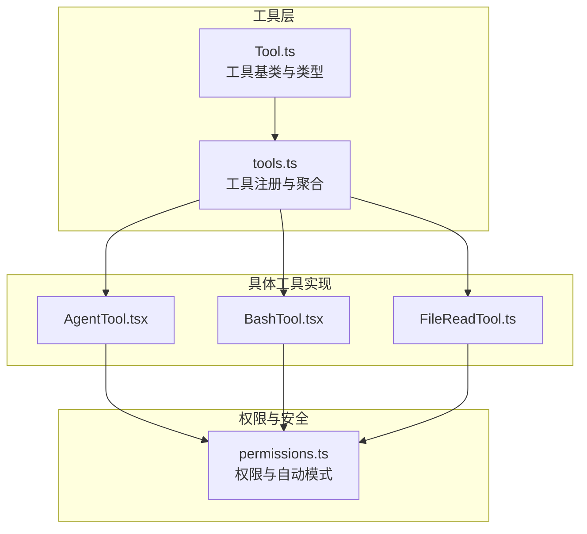
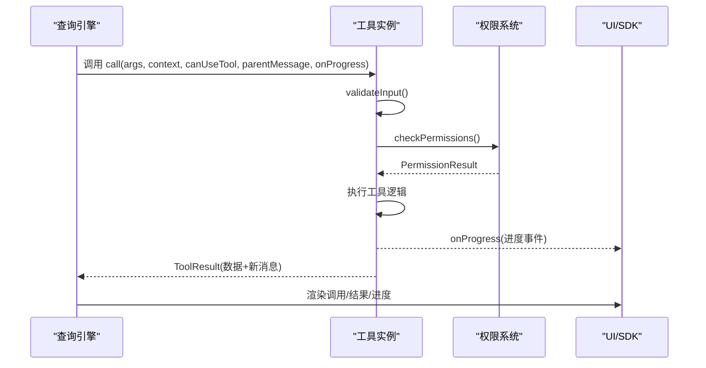
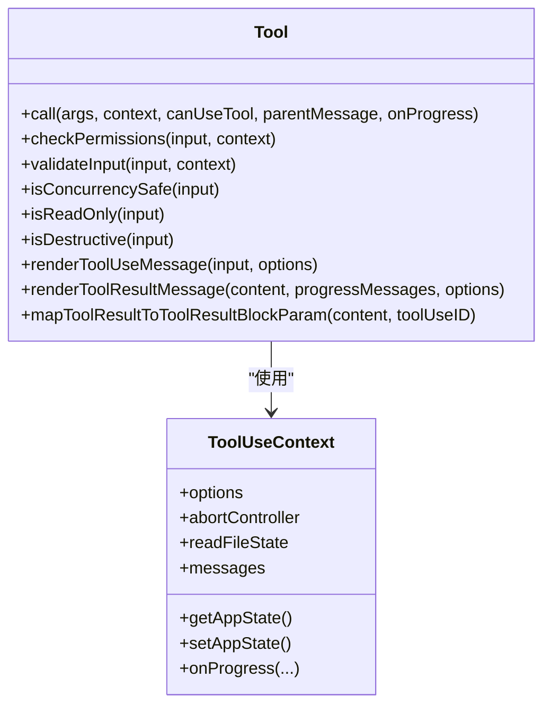
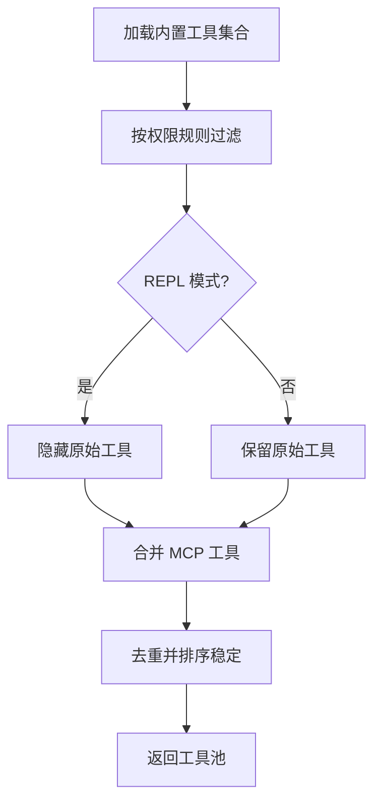
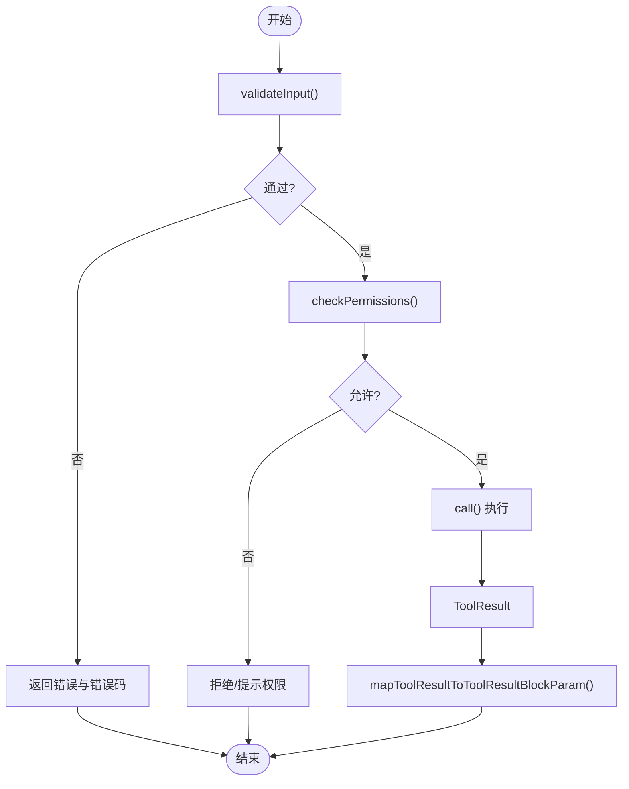
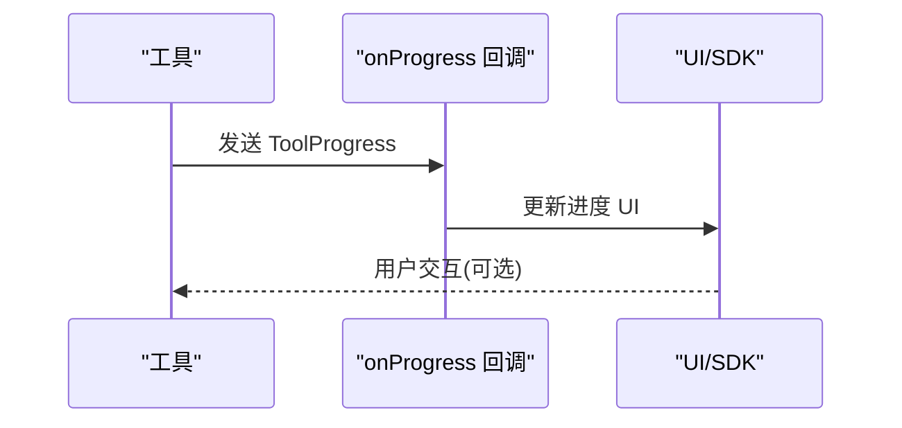
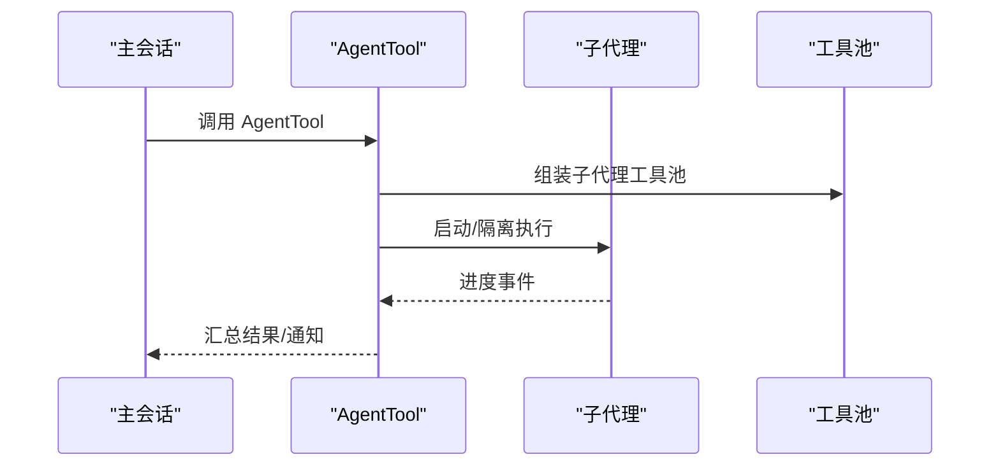
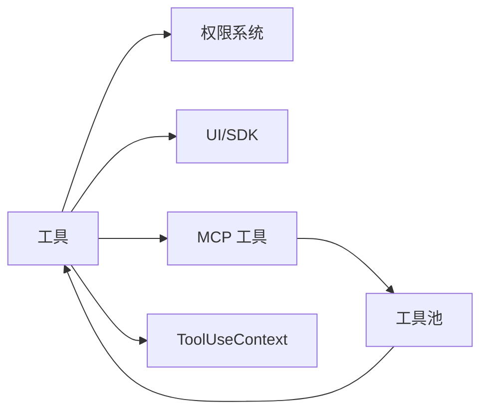

# 工具架构设计

<cite>
**本文引用的文件**
- [Tool.ts](file://src/Tool.ts)
- [tools.ts](file://src/tools.ts)
- [tools.md](file://docs/tools.md)
- [FileReadTool.ts](file://src/tools/FileReadTool/FileReadTool.ts)
- [BashTool.tsx](file://src/tools/BashTool/BashTool.tsx)
- [AgentTool.tsx](file://src/tools/AgentTool/AgentTool.tsx)
- [permissions.ts](file://src/utils/permissions/permissions.ts)
</cite>

## 目录
1. [简介](#简介)
2. [项目结构](#项目结构)
3. [核心组件](#核心组件)
4. [架构总览](#架构总览)
5. [详细组件分析](#详细组件分析)
6. [依赖分析](#依赖分析)
7. [性能考量](#性能考量)
8. [故障排查指南](#故障排查指南)
9. [结论](#结论)
10. [附录](#附录)

## 简介
本文件系统性阐述 Claude Code 的工具（Tool）架构设计，围绕 Tool 基类的设计理念、核心接口与生命周期、工具注册机制、类型系统与继承关系展开；并深入解析工具的输入输出模式、错误处理策略、进度跟踪机制，以及工具与命令系统的区别与联系，最后给出工具在多代理协作中的角色、最佳实践与性能优化建议。

## 项目结构
- 工具基类与类型定义集中在 [Tool.ts](file://src/Tool.ts)，提供统一的工具接口、上下文模型、权限与进度类型。
- 工具注册与聚合逻辑集中在 [tools.ts](file://src/tools.ts)，负责按环境与权限过滤、合并内置与 MCP 工具，并提供工具池装配能力。
- 官方参考文档 [tools.md](file://docs/tools.md) 提供工具目录、权限模型与预设等高层说明。
- 典型工具实现：
  - 文件读取：[FileReadTool.ts](file://src/tools/FileReadTool/FileReadTool.ts)
  - Shell 执行：[BashTool.tsx](file://src/tools/BashTool/BashTool.tsx)
  - 子代理编排：[AgentTool.tsx](file://src/tools/AgentTool/AgentTool.tsx)
- 权限系统与自动模式决策集中在 [permissions.ts](file://src/utils/permissions/permissions.ts)。

**图示来源**
- [Tool.ts](file://src/Tool.ts)
- [tools.ts](file://src/tools.ts)
- [FileReadTool.ts](file://src/tools/FileReadTool/FileReadTool.ts)
- [BashTool.tsx](file://src/tools/BashTool/BashTool.tsx)
- [AgentTool.tsx](file://src/tools/AgentTool/AgentTool.tsx)
- [permissions.ts](file://src/utils/permissions/permissions.ts)

**章节来源**
- [Tool.ts](file://src/Tool.ts)
- [tools.ts](file://src/tools.ts)
- [tools.md](file://docs/tools.md)

## 核心组件
- 工具基类与接口
  - 工具类型签名与默认实现：见 [Tool.ts](file://src/Tool.ts) 中对 Tool、ToolDef、Tools 的定义与 buildTool 默认值。
  - 关键方法族：call、checkPermissions、validateInput、isConcurrencySafe、isReadOnly、isDestructive、renderToolUseMessage、renderToolResultMessage、mapToolResultToToolResultBlockParam 等。
  - 上下文模型：ToolUseContext 汇集命令、权限、MCP、文件状态缓存、消息与回调等运行期资源。
  - 进度与结果：ToolProgress、ToolResult、Progress 等类型支撑 UI 与 SDK 的进度与结果渲染。
- 工具注册与聚合
  - 工具集合来源：getAllBaseTools、getTools、assembleToolPool、getMergedTools 等函数按权限与特性门控组装工具集。
  - 工具过滤：filterToolsByDenyRules、filterDeniedAgents 等基于规则与权限上下文进行黑名单过滤。
- 类型系统与继承
  - 通过 buildTool 将 ToolDef 与默认实现合并，确保工具实现最小化样板代码。
  - 输入/输出使用 Zod 严格校验，支持 JSON Schema 外部声明（inputJSONSchema）。

**章节来源**
- [Tool.ts](file://src/Tool.ts)
- [tools.ts](file://src/tools.ts)

## 架构总览
工具系统以 Tool 基类为核心，围绕以下维度构建：
- 统一接口：所有工具遵循一致的调用契约，便于查询引擎在 LLM 工具调用循环中调度。
- 权限与安全：工具在执行前经 validateInput 与 checkPermissions 双重校验，支持自动模式分类器与拒绝追踪。
- 进度与 UI：onProgress 回调与多种渲染函数（调用、结果、进度、拒绝/错误）统一由工具实现。
- 注册与聚合：按环境特性与权限上下文动态装配工具池，内置与 MCP 工具去重合并。
- 多代理协作：AgentTool 负责子代理的启动、隔离、异步/同步执行与工作树管理。

**图示来源**
- [Tool.ts](file://src/Tool.ts)
- [permissions.ts](file://src/utils/permissions/permissions.ts)
- [BashTool.tsx](file://src/tools/BashTool/BashTool.tsx)

## 详细组件分析

### Tool 基类与生命周期
- 设计理念
  - 明确分离“输入/输出”、“权限/安全”、“UI/渲染”、“并发/只读/破坏性”等职责，通过可选钩子与默认实现降低实现成本。
  - 通过 ToolUseContext 注入运行期资源，使工具可在不同会话/代理/任务中复用。
- 生命周期阶段
  - 参数校验：validateInput（可选），用于提前拒绝非法参数或潜在风险。
  - 权限检查：checkPermissions（可选），结合规则与自动模式决策。
  - 执行阶段：call 返回 ToolResult，可能携带新消息与上下文修改器。
  - 结果映射：mapToolResultToToolResultBlockParam 将工具输出映射为 SDK/消息块。
  - UI 渲染：renderToolUseMessage、renderToolResultMessage、renderToolUseProgressMessage 等。
- 并发与只读
  - isConcurrencySafe 控制是否允许并行执行。
  - isReadOnly/isDestructive 用于 UI 与权限提示。
- 进度与摘要
  - onProgress 回调用于 UI 与 SDK 的实时反馈。
  - getToolUseSummary/getActivityDescription 用于紧凑视图与转轮描述。

**图示来源**
- [Tool.ts](file://src/Tool.ts)

**章节来源**
- [Tool.ts](file://src/Tool.ts)

### 工具注册机制与类型系统
- 工具注册
  - getAllBaseTools：按特性门控与平台能力收集内置工具。
  - getTools：按权限上下文过滤内置工具，隐藏 REPL 专用工具，应用简单模式。
  - assembleToolPool：合并内置与 MCP 工具，去重并保持排序稳定。
  - getMergedTools：返回包含 MCP 工具的完整列表（用于统计/阈值计算）。
- 类型系统
  - ToolDef 与 buildTool：通过部分实现与默认值合并，保证工具实现一致性。
  - 输入/输出：Zod schema 驱动的强类型校验；支持 inputJSONSchema 以兼容外部 JSON Schema。
  - 工具匹配：toolMatchesName/findToolByName 支持别名查找。

**图示来源**
- [tools.ts](file://src/tools.ts)

**章节来源**
- [tools.ts](file://src/tools.ts)
- [tools.md](file://docs/tools.md)

### 输入输出模式与错误处理
- 输入模式
  - Zod schema 校验，支持语义化描述与可选字段；部分工具通过 lazySchema 延迟解析。
  - inputJSONSchema 用于 MCP 工具直接声明 JSON Schema。
- 输出模式
  - ToolResult.data 为工具实际结果；可选 newMessages 注入消息；contextModifier 修改上下文。
  - mapToolResultToToolResultBlockParam 将结果映射为 SDK/消息块，支持图像、笔记本、PDF 等多形态。
- 错误处理
  - validateInput 提前失败，返回明确错误码与消息。
  - 工具内部抛出异常时，UI 层通过 renderToolUseErrorMessage 渲染用户可读错误。
  - BashTool 对中断、沙箱违规、大输出持久化等场景有专门处理与 UI 提示。

**图示来源**
- [Tool.ts](file://src/Tool.ts)
- [BashTool.tsx](file://src/tools/BashTool/BashTool.tsx)

**章节来源**
- [Tool.ts](file://src/Tool.ts)
- [BashTool.tsx](file://src/tools/BashTool/BashTool.tsx)

### 进度跟踪机制
- 进度事件
  - onProgress 回调接收 ToolProgress，工具在执行过程中周期性上报。
  - 不同工具类型定义专用进度数据结构（如 BashProgress、AgentToolProgress 等）。
- UI 展示
  - renderToolUseProgressMessage 用于在非 verbose 模式下显示进度摘要。
  - BashTool 使用异步生成器驱动的流式输出，持续发送进度事件。
- 透明包装器
  - isTransparentWrapper 标记工具不直接渲染自身，而是委托其内部工具的进度事件。

**图示来源**
- [Tool.ts](file://src/Tool.ts)
- [BashTool.tsx](file://src/tools/BashTool/BashTool.tsx)

**章节来源**
- [Tool.ts](file://src/Tool.ts)
- [BashTool.tsx](file://src/tools/BashTool/BashTool.tsx)

### 工具与命令系统的区别与联系
- 区别
  - 工具（Tool）：面向 LLM 的可调用能力，强调输入输出、权限、并发与 UI 渲染；由查询引擎在工具调用循环中调度。
  - 命令（Command）：面向 CLI 或 REPL 的一次性操作，通常不参与 LLM 工具调用循环。
- 联系
  - 两者共享权限模型与上下文（如 ToolUseContext），并在某些场景（如 BashTool）中存在参数/行为上的协同。
  - 工具池与命令池在注册与过滤上采用相似的门控与权限策略。

**章节来源**
- [Tool.ts](file://src/Tool.ts)
- [tools.ts](file://src/tools.ts)

### 工具在多代理协作中的作用
- 子代理编排
  - AgentTool 负责选择/验证代理、准备系统提示、隔离工作区（工作树/远程）、异步/同步执行与进度汇总。
  - 支持团队（Teammate）模式与远程代理，具备跨进程生命周期管理。
- 工具池隔离
  - 子代理拥有独立的工具池与权限模式，避免父级限制影响子任务执行。
- 进度与通知
  - 通过 createProgressTracker、enqueueAgentNotification 等机制向 UI/SDK 汇报进度与完成状态。

**图示来源**
- [AgentTool.tsx](file://src/tools/AgentTool/AgentTool.tsx)
- [tools.ts](file://src/tools.ts)

**章节来源**
- [AgentTool.tsx](file://src/tools/AgentTool/AgentTool.tsx)
- [tools.ts](file://src/tools.ts)

## 依赖分析
- 工具到权限
  - 工具通过 checkPermissions 与权限系统交互，权限系统支持规则匹配、自动模式分类器、拒绝追踪与钩子扩展。
- 工具到 UI/SDK
  - 通过 render* 系列函数与 mapToolResultToToolResultBlockParam 与 UI/SDK 对接。
- 工具到 MCP
  - 工具池装配时合并 MCP 工具，工具可通过 mcpInfo 标识来源服务器与工具名。
- 工具到上下文
  - ToolUseContext 提供命令、MCP、文件状态缓存、消息与回调等，贯穿工具生命周期。

**图示来源**
- [Tool.ts](file://src/Tool.ts)
- [permissions.ts](file://src/utils/permissions/permissions.ts)
- [tools.ts](file://src/tools.ts)

**章节来源**
- [Tool.ts](file://src/Tool.ts)
- [permissions.ts](file://src/utils/permissions/permissions.ts)
- [tools.ts](file://src/tools.ts)

## 性能考量
- 输入/输出体积控制
  - 工具可设置 maxResultSizeChars，超过阈值时将结果持久化至磁盘并通过预览展示，避免大文本直接回传。
  - FileReadTool 对超大文件进行令牌数估算与上限控制，防止缓存膨胀。
- 并发与只读
  - isConcurrencySafe 与 isReadOnly 指导 UI 与调度策略，减少不必要的串行与写操作。
- 进度与 UI
  - 流式进度与延迟阈值（如 BashTool 的 PROGRESS_THRESHOLD_MS）平衡用户体验与渲染开销。
- 工具池稳定性
  - 工具池排序与去重策略确保提示缓存命中率，避免频繁变更导致的缓存失效。

**章节来源**
- [Tool.ts](file://src/Tool.ts)
- [FileReadTool.ts](file://src/tools/FileReadTool/FileReadTool.ts)
- [BashTool.tsx](file://src/tools/BashTool/BashTool.tsx)

## 故障排查指南
- 权限相关
  - 若工具被拒绝，检查 deny 规则与 ask 规则；确认自动模式下的分类器是否可用；查看拒绝追踪状态。
- 输入校验
  - validateInput 返回的错误码与消息可用于快速定位问题（如路径、二进制文件、设备文件等）。
- 进度与中断
  - BashTool 在长时间运行时会自动后台化并提供通知；若被中断，错误消息中会包含中断标记。
- UI 渲染
  - 使用 renderToolUseErrorMessage/renderToolUseRejectedMessage 自定义错误/拒绝 UI，提升可读性。

**章节来源**
- [permissions.ts](file://src/utils/permissions/permissions.ts)
- [FileReadTool.ts](file://src/tools/FileReadTool/FileReadTool.ts)
- [BashTool.tsx](file://src/tools/BashTool/BashTool.tsx)

## 结论
Claude Code 的工具架构以 Tool 基类为中心，通过严格的类型系统、统一的生命周期与上下文模型、完善的权限与自动模式机制，实现了高内聚、低耦合且易于扩展的工具体系。工具注册与聚合在多维门控下保证了安全性与灵活性；在多代理协作场景中，AgentTool 提供了强大的子代理编排能力。遵循本文的最佳实践与性能建议，可帮助开发者高效、安全地扩展与优化工具链。

## 附录
- 工具开发最佳实践
  - 使用 buildTool 与 ToolDef，最小化实现样板；必要时覆盖 validateInput、checkPermissions、render* 与 mapToolResultToToolResultBlockParam。
  - 明确并发安全与只读/破坏性属性，合理设置 maxResultSizeChars。
  - 提供清晰的 userFacingName、getToolUseSummary、getActivityDescription，提升 UI 体验。
  - 为长耗时工具提供 onProgress 与 renderToolUseProgressMessage。
- 权限与自动模式
  - 利用规则匹配与自动模式分类器减少交互成本；在 headless 场景下通过钩子提供决策。
- MCP 工具集成
  - 通过 assembleToolPool 合并 MCP 工具，注意去重与排序稳定性，确保提示缓存命中。