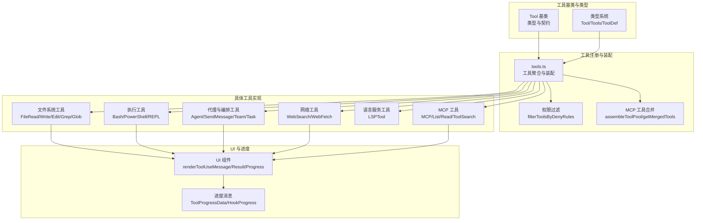
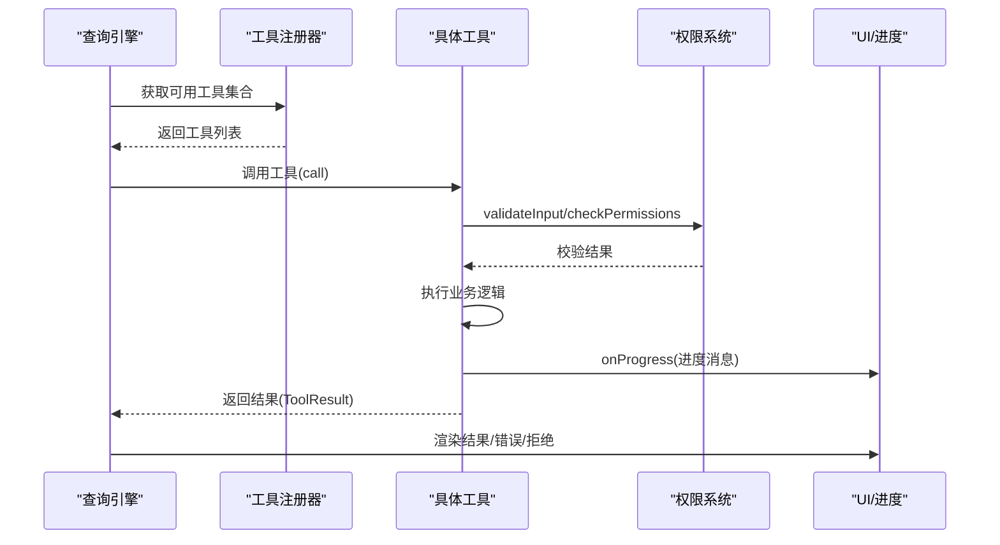
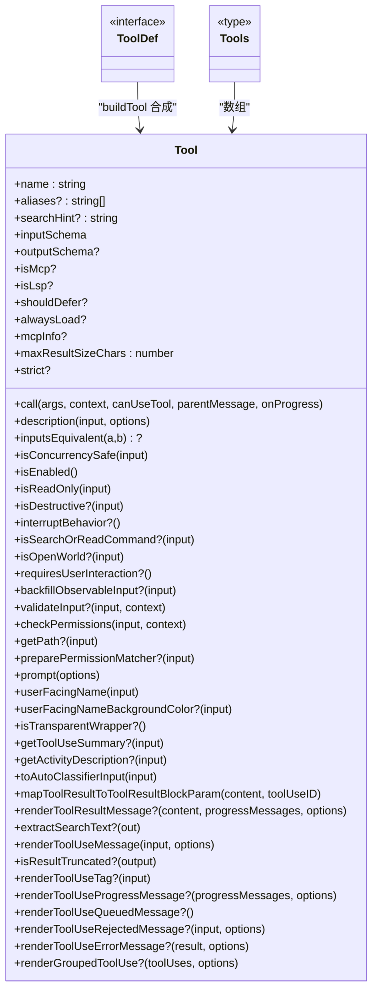
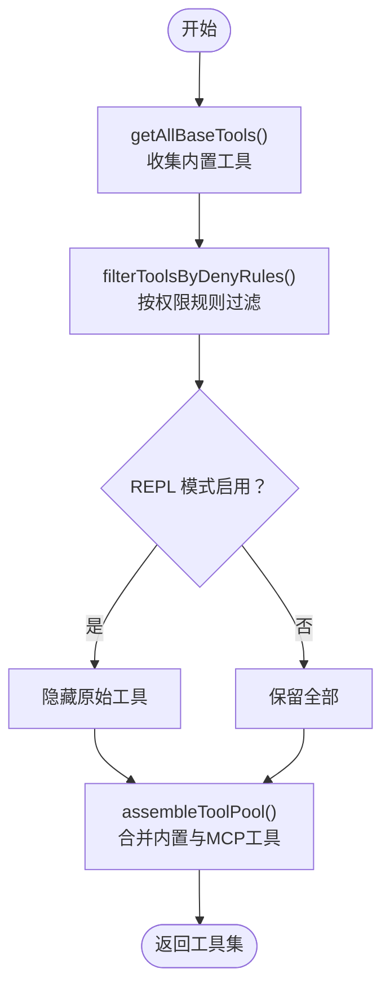
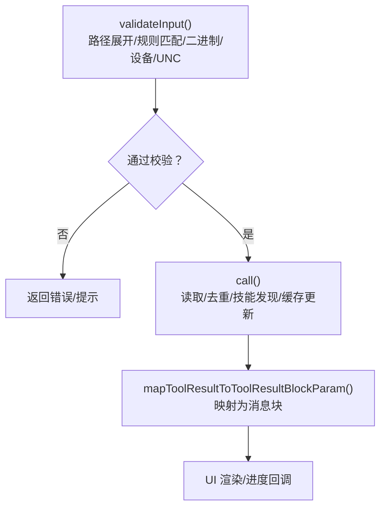
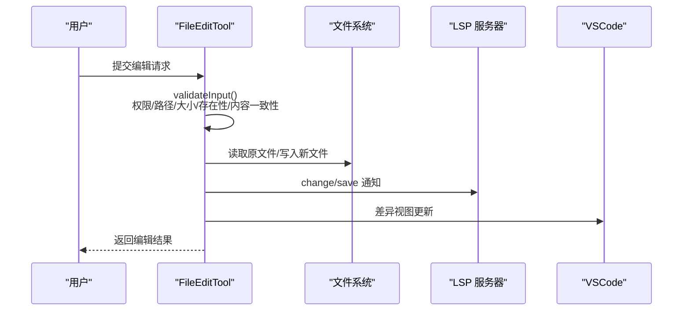
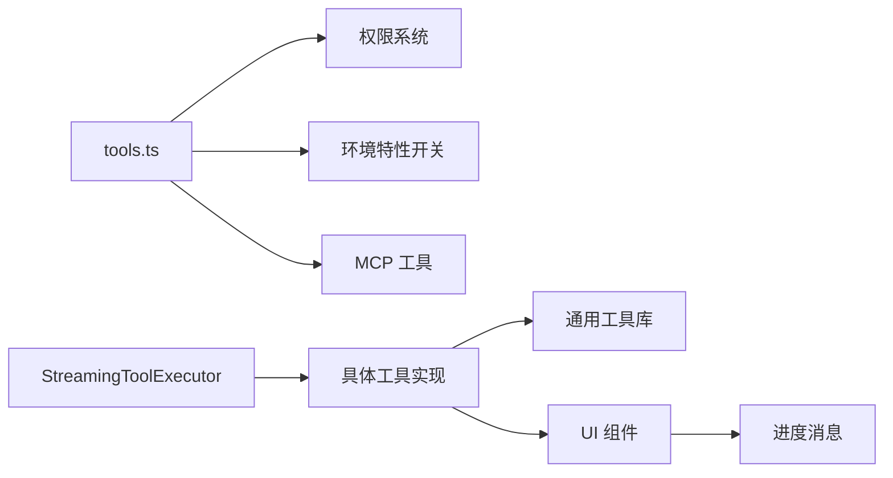

# 工具系统

<cite>
**本文档引用的文件**
- [Tool.ts](file://src/Tool.ts)
- [tools.ts](file://src/tools.ts)
- [tools.md](file://docs/tools.md)
- [FileReadTool.ts](file://src/tools/FileReadTool/FileReadTool.ts)
- [FileEditTool.ts](file://src/tools/FileEditTool/FileEditTool.ts)
- [GrepTool.ts](file://src/tools/GrepTool/GrepTool.ts)
- [WebSearchTool.ts](file://src/tools/WebSearchTool/WebSearchTool.ts)
- [BashTool/UI.tsx](file://src/tools/BashTool/UI.tsx)
- [AgentTool/UI.tsx](file://src/tools/AgentTool/UI.tsx)
- [FileReadTool/UI.tsx](file://src/tools/FileReadTool/UI.tsx)
- [StreamingToolExecutor.ts](file://src/services/tools/StreamingToolExecutor.ts)
</cite>

## 目录
1. [简介](#简介)
2. [项目结构](#项目结构)
3. [核心组件](#核心组件)
4. [架构总览](#架构总览)
5. [详细组件分析](#详细组件分析)
6. [依赖关系分析](#依赖关系分析)
7. [性能考量](#性能考量)
8. [故障排查指南](#故障排查指南)
9. [结论](#结论)
10. [附录](#附录)

## 简介
本文件系统性梳理 Claude Code 的工具系统，覆盖架构设计、基类与类型体系、内置工具分类与行为、生命周期与并发控制、权限与安全、UI 渲染与进度跟踪、以及开发自定义工具的最佳实践。目标是帮助开发者快速理解工具系统的运行机制，并在此基础上进行扩展与优化。

## 项目结构
工具系统由“工具基类与类型”、“工具注册与装配”、“具体工具实现”、“UI 渲染与进度”四大部分组成。核心入口位于工具注册模块，按权限上下文与 MCP 工具动态装配最终可用工具集；每个工具实现遵循统一的接口契约，具备输入校验、权限检查、并发安全声明、结果渲染等能力。

**图表来源**
- [tools.ts:193-391](file://src/tools.ts#L193-L391)
- [Tool.ts:362-695](file://src/Tool.ts#L362-L695)
- [tools.md:1-174](file://docs/tools.md#L1-L174)

**章节来源**
- [tools.ts:193-391](file://src/tools.ts#L193-L391)
- [Tool.ts:362-695](file://src/Tool.ts#L362-L695)
- [tools.md:1-174](file://docs/tools.md#L1-L174)

## 核心组件
- 工具基类与类型：定义工具的统一接口、生命周期钩子、并发安全、权限检查、输入输出模式、UI 渲染与进度回调等契约。
- 工具注册与装配：集中管理工具集合，按权限规则过滤，合并内置与 MCP 工具，保证提示词缓存稳定性。
- 具体工具实现：覆盖文件系统、执行、代理、任务、网络、MCP 等领域，每个工具独立实现输入校验、权限检查、调用逻辑与 UI 渲染。
- UI 与进度：提供工具使用、结果、错误、拒绝等 UI 渲染，支持进度消息与分组渲染。

**章节来源**
- [Tool.ts:362-695](file://src/Tool.ts#L362-L695)
- [tools.ts:193-391](file://src/tools.ts#L193-L391)

## 架构总览
工具系统采用“基类契约 + 注册装配 + 动态合并”的架构。查询引擎在每次工具调用循环中，基于当前上下文选择可用工具，执行前进行输入校验与权限检查，运行时通过进度回调更新 UI，结束后映射为消息块返回给模型。

**图表来源**
- [tools.ts:271-327](file://src/tools.ts#L271-L327)
- [Tool.ts:379-385](file://src/Tool.ts#L379-L385)
- [StreamingToolExecutor.ts:129-151](file://src/services/tools/StreamingToolExecutor.ts#L129-L151)

**章节来源**
- [tools.ts:271-327](file://src/tools.ts#L271-L327)
- [Tool.ts:379-385](file://src/Tool.ts#L379-L385)
- [StreamingToolExecutor.ts:129-151](file://src/services/tools/StreamingToolExecutor.ts#L129-L151)

## 详细组件分析

### 工具基类与类型系统
- 工具契约：统一的 Tool 接口包含 call/description/inputSchema/outputSchema/isConcurrencySafe/isReadOnly/isDestructive/checkPermissions 等方法；支持输入等价性比较、路径提取、权限匹配器、UI 渲染钩子、结果映射等。
- 工具构建器：buildTool 提供默认实现（如 isEnabled 默认启用、权限默认放行等），确保工具最小实现即可工作。
- 上下文与进度：ToolUseContext 提供读写状态、文件读取缓存、通知、消息追加、权限上下文、工具决策记录、查询链追踪等；ToolProgressData 定义进度数据结构。
- 类型别名与导出：重新导出常用类型（如各类进度类型）以避免循环导入。

**图表来源**
- [Tool.ts:362-695](file://src/Tool.ts#L362-L695)

**章节来源**
- [Tool.ts:362-695](file://src/Tool.ts#L362-L695)

### 工具注册与装配
- 工具聚合：getAllBaseTools 汇总所有内置工具，按环境特性与功能开关动态加入或剔除工具。
- 权限过滤：filterToolsByDenyRules 基于权限上下文屏蔽被拒绝的工具，支持 MCP 服务器前缀规则。
- REPL 隐藏：当 REPL 模式启用时，隐藏原始工具，仅允许包装工具直接调用。
- 合并策略：assembleToolPool 保持内置工具顺序稳定，避免缓存键被打乱；getMergedTools 返回完整工具集用于统计与搜索阈值判断。

**图表来源**
- [tools.ts:193-391](file://src/tools.ts#L193-L391)

**章节来源**
- [tools.ts:193-391](file://src/tools.ts#L193-L391)

### 文件系统工具

#### FileReadTool（文件读取）
- 输入输出：支持文本、图片、PDF、笔记本、部分页面提取等多种类型；限制最大令牌数与大小，避免大文件读取导致内存压力。
- 并发安全：标记为只读且并发安全；支持范围读取与页码范围读取。
- 权限与安全：严格路径展开、二进制扩展名检测、设备文件阻断、UNC 路径安全提示、会话文件类型识别与风险提醒。
- 性能优化：内容去重（fileReadState 缓存）、自动内存文件新鲜度提示、PDF 页面上限控制。
- UI 与进度：提供简洁摘要、标签显示、错误友好提示、结果映射到 API 消息块。

**图表来源**
- [FileReadTool.ts:418-651](file://src/tools/FileReadTool/FileReadTool.ts#L418-L651)

**章节来源**
- [FileReadTool.ts:337-718](file://src/tools/FileReadTool/FileReadTool.ts#L337-L718)

#### FileEditTool（文件编辑）
- 输入输出：字符串替换、批量替换、引号风格保持、行尾风格维护；输出包含结构化补丁与差异信息。
- 并发安全：非并发安全；读取后时间戳校验防止并发修改覆盖。
- 权限与安全：团队内存密钥检测、路径拒绝规则、大文件保护、空文件创建约束、笔记本文件专用工具提示。
- 进程与诊断：编辑前后 LSP 通知、VSCode 差异视图、文件历史备份、Git Diff 计算（可选）。
- UI 与进度：编辑摘要、错误友好提示、拒绝 UI、结果映射。

**图表来源**
- [FileEditTool.ts:387-574](file://src/tools/FileEditTool/FileEditTool.ts#L387-L574)

**章节来源**
- [FileEditTool.ts:86-595](file://src/tools/FileEditTool/FileEditTool.ts#L86-L595)

#### GrepTool（内容搜索）
- 输入输出：支持正则、上下文、大小写不敏感、类型过滤、head_limit/offset 分页、计数模式、文件列表模式。
- 并发安全：并发安全；默认限制结果数量，避免上下文溢出。
- 权限与安全：路径存在性校验、忽略模式应用、VCS 目录排除、WSL 性能注意。
- 结果处理：相对路径转换、排序（时间+名称）、分页截断、多模式输出映射。

**章节来源**
- [GrepTool.ts:160-579](file://src/tools/GrepTool/GrepTool.ts#L160-L579)

### 执行工具
- BashTool：Shell 命令执行，支持后台任务、超时、进度流式输出、队列与并发控制。
- PowerShellTool：Windows PowerShell 执行（条件启用）。
- REPLTool：交互式代码执行（条件启用）。

**章节来源**
- [BashTool/UI.tsx:85-186](file://src/tools/BashTool/UI.tsx#L85-L186)

### 代理与编排工具
- AgentTool：子代理编排、进度消息汇总、搜索/读取/REPL 操作折叠显示。
- SendMessageTool/TeamCreate/DeleteTool/Task*Tool：跨代理通信、团队编排、任务生命周期管理。
- Enter/ExitPlanModeTool/Enter/ExitWorktreeTool：模式切换与隔离工作区。

**章节来源**
- [AgentTool/UI.tsx:100-180](file://src/tools/AgentTool/UI.tsx#L100-L180)

### 网络工具
- WebSearchTool：基于模型能力的网页搜索，支持域名白/黑名单、最大使用次数限制、结果与评论混合输出。
- WebFetchTool：网页内容抓取（未在本文档展开，详见源码）。

**章节来源**
- [WebSearchTool.ts:152-200](file://src/tools/WebSearchTool/WebSearchTool.ts#L152-L200)

### MCP 工具
- MCPTool：调用 MCP 服务器上的工具。
- ListMcpResourcesTool/ReadMcpResourceTool：资源枚举与读取。
- ToolSearchTool：动态发现延迟加载工具。

**章节来源**
- [tools.md:106-115](file://docs/tools.md#L106-L115)

### UI 与进度
- 统一 UI 钩子：renderToolUseMessage/renderToolResultMessage/renderToolUseErrorMessage/renderToolUseProgressMessage 等。
- BashTool：后台任务提示、进度消息、结果消息、错误回退 UI。
- AgentTool：进度消息分组与折叠、搜索/读取/REPL 操作统计。
- FileReadTool：文件路径链接、标签显示、不同类型结果的简洁摘要。

**章节来源**
- [BashTool/UI.tsx:85-186](file://src/tools/BashTool/UI.tsx#L85-L186)
- [AgentTool/UI.tsx:100-180](file://src/tools/AgentTool/UI.tsx#L100-L180)
- [FileReadTool/UI.tsx:30-186](file://src/tools/FileReadTool/UI.tsx#L30-L186)

## 依赖关系分析
- 工具注册器依赖权限系统与环境特性开关，动态决定工具集合。
- 工具实现依赖通用工具库（路径、文件、权限、消息、模型、UI 等）。
- UI 组件依赖工具结果与进度消息，负责终端渲染与交互。
- 流式执行器负责工具队列与并发控制，保障非并发工具的串行执行。

**图表来源**
- [tools.ts:193-391](file://src/tools.ts#L193-L391)
- [StreamingToolExecutor.ts:129-151](file://src/services/tools/StreamingToolExecutor.ts#L129-L151)

**章节来源**
- [tools.ts:193-391](file://src/tools.ts#L193-L391)
- [StreamingToolExecutor.ts:129-151](file://src/services/tools/StreamingToolExecutor.ts#L129-L151)

## 性能考量
- 工具并发控制：非并发安全工具需串行执行，避免竞态；并发安全工具可并行提升吞吐。
- 结果大小限制：通过 maxResultSizeChars 控制工具输出大小，必要时落盘并返回预览。
- 令牌与大小限制：文件读取令牌与大小限制在上下文中配置，避免超出模型上下文。
- 搜索分页与截断：GrepTool 默认 head_limit 与 offset/limit 控制输出规模，减少上下文膨胀。
- 缓存与去重：FileReadTool 使用 readFileState 去重，避免重复发送相同内容。
- 进程与 I/O：避免在 validateInput 中进行昂贵 I/O，尽量推迟到执行阶段。

[本节为通用指导，无需特定文件引用]

## 故障排查指南
- 输入校验失败：检查 validateInput 返回的错误码与消息，确认路径、参数格式与范围是否符合要求。
- 权限拒绝：查看 checkPermissions 的行为与提示，核对权限规则与匹配器；UNC 路径需特别处理。
- 并发冲突：非并发安全工具报错或结果异常，检查并发队列与串行执行策略。
- UI 不显示或显示异常：确认 renderToolUseMessage/renderToolResultMessage 是否正确实现，进度消息是否正确传递。
- 大文件/超长输出：调整 head_limit/offset 或使用范围读取，避免超过令牌/字符限制。

**章节来源**
- [FileReadTool.ts:418-495](file://src/tools/FileReadTool/FileReadTool.ts#L418-L495)
- [FileEditTool.ts:137-362](file://src/tools/FileEditTool/FileEditTool.ts#L137-L362)
- [GrepTool.ts:201-232](file://src/tools/GrepTool/GrepTool.ts#L201-L232)
- [StreamingToolExecutor.ts:129-151](file://src/services/tools/StreamingToolExecutor.ts#L129-L151)

## 结论
Claude Code 的工具系统以统一的基类契约为核心，结合严格的权限与安全策略、完善的 UI 与进度反馈、以及灵活的注册与装配机制，实现了从文件系统、执行、代理到网络与 MCP 的全栈工具能力。通过并发控制与性能优化策略，系统在保证安全性的同时兼顾了效率与可扩展性。开发者可基于 buildTool 快速实现新工具，并遵循统一的输入校验、权限检查与 UI 渲染规范，确保与现有生态无缝集成。

[本节为总结，无需特定文件引用]

## 附录

### 开发自定义工具指南
- 使用 buildTool 创建工具，至少实现 name、description、inputSchema、call、checkPermissions、isConcurrencySafe、isReadOnly 等。
- 在 validateInput 中完成参数与路径合法性检查，避免昂贵 I/O。
- 在 checkPermissions 中实现工具级权限逻辑，必要时使用 preparePermissionMatcher。
- 实现 UI 渲染钩子：renderToolUseMessage、renderToolResultMessage、renderToolUseErrorMessage、renderToolUseProgressMessage。
- 如涉及文件路径，实现 getPath；如需要输入等价性比较，实现 inputsEquivalent。
- 如为搜索/读取命令，实现 isSearchOrReadCommand；如为不可逆操作，设置 isDestructive。
- 如需延迟加载，设置 shouldDefer；如为 MCP 工具，设置 isMcp 与 mcpInfo。

**章节来源**
- [Tool.ts:783-792](file://src/Tool.ts#L783-L792)
- [tools.md:19-50](file://docs/tools.md#L19-L50)

### 工具与命令的关系
- 命令通常由用户触发，工具在模型工具调用循环中被选择与执行；工具可作为命令的底层实现。
- 工具通过 renderToolUseMessage 提供命令的简洁描述，通过 UI 层面增强用户体验。

**章节来源**
- [tools.md:19-50](file://docs/tools.md#L19-L50)

### 多代理协作中的工具作用
- AgentTool 负责子代理编排与进度汇总，支持搜索/读取/REPL 操作的折叠显示与统计。
- SendMessageTool/TeamTool 支持跨代理通信与团队协作。
- Task*Tool 管理任务生命周期，便于在多代理场景中协调执行。

**章节来源**
- [AgentTool/UI.tsx:100-180](file://src/tools/AgentTool/UI.tsx#L100-L180)
- [tools.md:73-98](file://docs/tools.md#L73-L98)