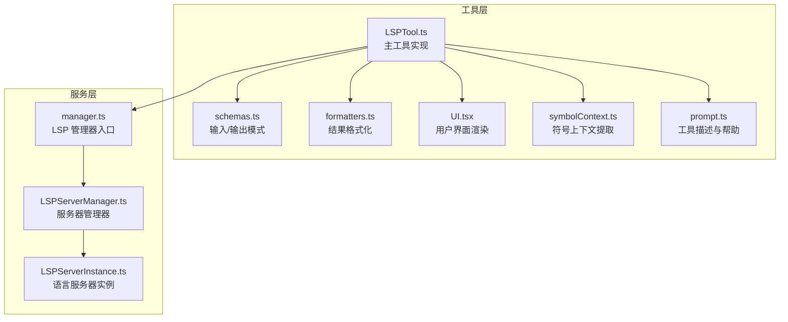
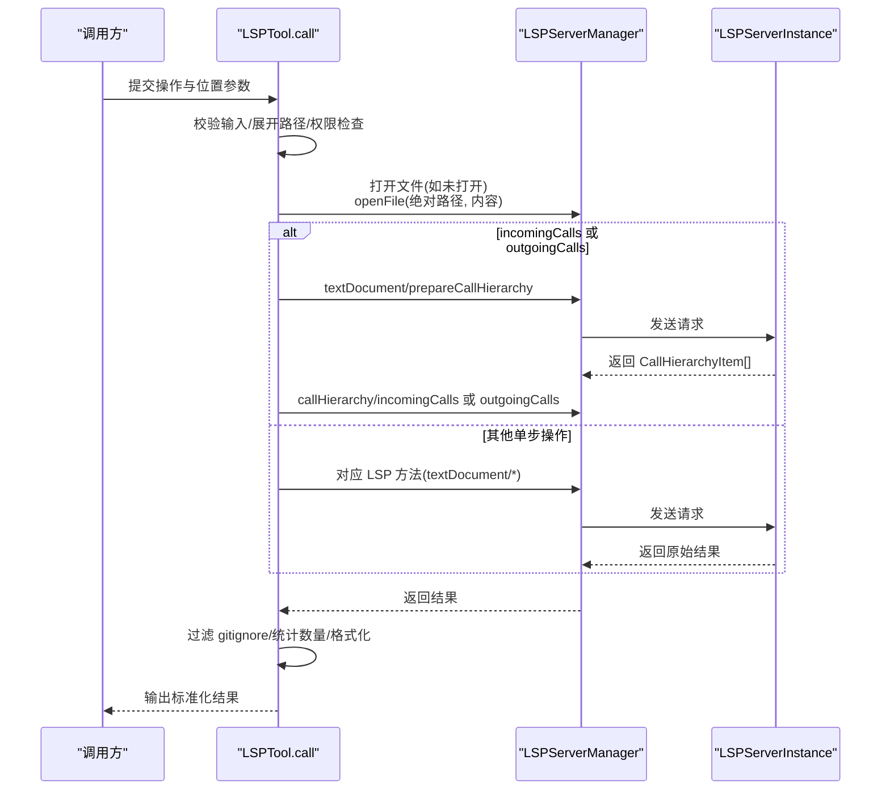
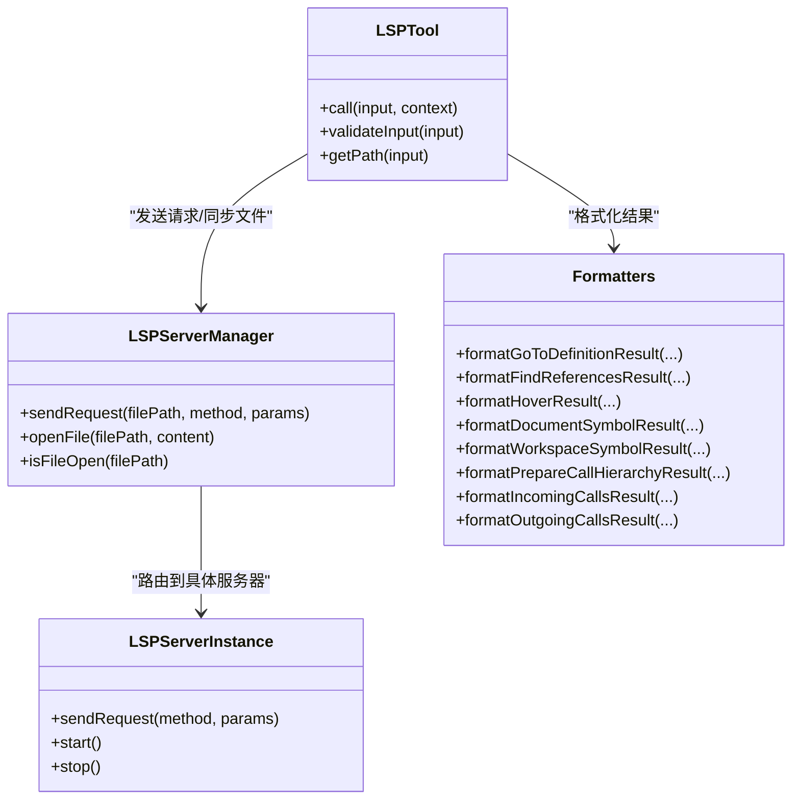

# LSP 操作实现

<cite>
**本文档引用的文件**
- [LSPTool.ts](file://src/tools/LSPTool/LSPTool.ts)
- [formatters.ts](file://src/tools/LSPTool/formatters.ts)
- [schemas.ts](file://src/tools/LSPTool/schemas.ts)
- [prompt.ts](file://src/tools/LSPTool/prompt.ts)
- [UI.tsx](file://src/tools/LSPTool/UI.tsx)
- [symbolContext.ts](file://src/tools/LSPTool/symbolContext.ts)
- [manager.ts](file://src/services/lsp/manager.ts)
- [LSPServerManager.ts](file://src/services/lsp/LSPServerManager.ts)
- [LSPServerInstance.ts](file://src/services/lsp/LSPServerInstance.ts)
</cite>

## 目录
1. [简介](#简介)
2. [项目结构](#项目结构)
3. [核心组件](#核心组件)
4. [架构总览](#架构总览)
5. [详细组件分析](#详细组件分析)
6. [依赖关系分析](#依赖关系分析)
7. [性能考量](#性能考量)
8. [故障排除指南](#故障排除指南)
9. [结论](#结论)
10. [附录](#附录)

## 简介
本文件系统性梳理 LSPTool 的各类 LSP 操作实现，覆盖 goToDefinition、findReferences、hover、documentSymbol、workspaceSymbol、goToImplementation、prepareCallHierarchy、incomingCalls、outgoingCalls 等方法。重点说明：
- LSP 方法映射与参数转换（1-based 到 0-based 坐标系）
- 位置信息处理与结果格式化
- 双步骤操作（incomingCalls/outgoingCalls）的特殊流程（prepareCallHierarchy 预处理）
- 输入输出模式、错误处理策略与性能优化建议
- 实际使用示例与调试技巧

## 项目结构
LSPTool 的实现位于 src/tools/LSPTool 目录，配套的 LSP 服务管理位于 src/services/lsp。

**图表来源**
- [LSPTool.ts:1-862](file://src/tools/LSPTool/LSPTool.ts#L1-L862)
- [manager.ts:1-291](file://src/services/lsp/manager.ts#L1-L291)
- [LSPServerManager.ts:1-422](file://src/services/lsp/LSPServerManager.ts#L1-L422)

**章节来源**
- [LSPTool.ts:1-862](file://src/tools/LSPTool/LSPTool.ts#L1-L862)
- [manager.ts:1-291](file://src/services/lsp/manager.ts#L1-L291)
- [LSPServerManager.ts:1-422](file://src/services/lsp/LSPServerManager.ts#L1-L422)

## 核心组件
- LSPTool 主体：负责输入校验、坐标转换、请求分发、结果过滤与格式化、错误处理与 UI 渲染。
- 结果格式化器：将 LSP 原始结果转换为人类可读文本，含位置、文件统计等。
- LSP 服务管理：统一初始化、启动、路由请求到具体语言服务器，并同步文件状态。

关键职责与边界：
- 输入/输出模式由 schemas.ts 定义，确保类型安全与一致的错误消息。
- 坐标转换在 getMethodAndParams 中完成，从 1-based 用户输入转为 0-based LSP 协议。
- 双步骤调用（incomingCalls/outgoingCalls）通过 prepareCallHierarchy 获取 CallHierarchyItem 后再请求具体调用列表。
- 过滤与去重：对 Location/URI 结果进行 gitignore 过滤与唯一文件计数。

**章节来源**
- [LSPTool.ts:127-422](file://src/tools/LSPTool/LSPTool.ts#L127-L422)
- [formatters.ts:1-594](file://src/tools/LSPTool/formatters.ts#L1-L594)
- [schemas.ts:1-215](file://src/tools/LSPTool/schemas.ts#L1-L215)
- [manager.ts:63-133](file://src/services/lsp/manager.ts#L63-L133)
- [LSPServerManager.ts:16-43](file://src/services/lsp/LSPServerManager.ts#L16-L43)

## 架构总览
LSPTool 调用链路如下：

**图表来源**
- [LSPTool.ts:224-414](file://src/tools/LSPTool/LSPTool.ts#L224-L414)
- [LSPServerManager.ts:244-263](file://src/services/lsp/LSPServerManager.ts#L244-L263)
- [LSPServerManager.ts:270-310](file://src/services/lsp/LSPServerManager.ts#L270-L310)

## 详细组件分析

### goToDefinition（跳转定义）
- LSP 方法映射：textDocument/definition
- 参数转换：将 1-based 行列转为 0-based position
- 结果处理：支持 Location 与 LocationLink；统一转换后格式化；统计有效位置与文件数
- 错误处理：空结果返回“未找到定义”；URI 缺失记录日志并过滤
- 性能：仅在必要时读取文件内容并 openFile；避免重复 didOpen

**章节来源**
- [LSPTool.ts:438-446](file://src/tools/LSPTool/LSPTool.ts#L438-L446)
- [LSPTool.ts:642-678](file://src/tools/LSPTool/LSPTool.ts#L642-L678)
- [formatters.ts:127-169](file://src/tools/LSPTool/formatters.ts#L127-L169)

### findReferences（查找引用）
- LSP 方法映射：textDocument/references
- 参数转换：同上
- 结果处理：Location[]；按文件分组展示；统计总数与文件数
- 过滤策略：gitignore 过滤；URI 缺失过滤
- 错误处理：空结果提示“无引用”；日志记录无效位置

**章节来源**
- [LSPTool.ts:447-455](file://src/tools/LSPTool/LSPTool.ts#L447-L455)
- [LSPTool.ts:679-699](file://src/tools/LSPTool/LSPTool.ts#L679-L699)
- [formatters.ts:174-218](file://src/tools/LSPTool/formatters.ts#L174-L218)

### hover（悬停信息）
- LSP 方法映射：textDocument/hover
- 参数转换：同上
- 结果处理：提取 MarkupContent/MarkedString 文本；若带范围则显示位置
- 错误处理：空结果提示“无悬停信息”

**章节来源**
- [LSPTool.ts:456-463](file://src/tools/LSPTool/LSPTool.ts#L456-L463)
- [LSPTool.ts:700-706](file://src/tools/LSPTool/LSPTool.ts#L700-L706)
- [formatters.ts:253-267](file://src/tools/LSPTool/formatters.ts#L253-L267)

### documentSymbol（文档符号）
- LSP 方法映射：textDocument/documentSymbol
- 结果处理：支持 DocumentSymbol[]（层级）与 SymbolInformation[]（平面）两种格式；递归格式化层级；统计符号总数
- 错误处理：空结果提示“文档中无符号”

**章节来源**
- [LSPTool.ts:464-470](file://src/tools/LSPTool/LSPTool.ts#L464-L470)
- [LSPTool.ts:707-725](file://src/tools/LSPTool/LSPTool.ts#L707-L725)
- [formatters.ts:340-366](file://src/tools/LSPTool/formatters.ts#L340-L366)

### workspaceSymbol（工作区符号）
- LSP 方法映射：workspace/symbol
- 结果处理：SymbolInformation[]；按文件分组；显示符号名、类型、容器名与行号
- 过滤策略：gitignore 过滤；URI 缺失过滤
- 错误处理：空结果提示“工作区中无符号”

**章节来源**
- [LSPTool.ts:471-477](file://src/tools/LSPTool/LSPTool.ts#L471-L477)
- [LSPTool.ts:726-754](file://src/tools/LSPTool/LSPTool.ts#L726-L754)
- [formatters.ts:371-422](file://src/tools/LSPTool/formatters.ts#L371-L422)

### goToImplementation（跳转实现）
- LSP 方法映射：textDocument/implementation
- 结果处理：与 goToDefinition 相同的 Location/LocationLink 统一格式化
- 错误处理：空结果提示“未找到实现”

**章节来源**
- [LSPTool.ts:478-485](file://src/tools/LSPTool/LSPTool.ts#L478-L485)
- [LSPTool.ts:755-792](file://src/tools/LSPTool/LSPTool.ts#L755-L792)
- [formatters.ts:127-169](file://src/tools/LSPTool/formatters.ts#L127-L169)

### prepareCallHierarchy（准备调用层次）
- LSP 方法映射：textDocument/prepareCallHierarchy
- 结果处理：CallHierarchyItem[]；格式化项名称、类型、位置与详情
- 错误处理：空结果提示“该位置无调用层次项”
- 双步骤前置：incomingCalls/outgoingCalls 的第一步

**章节来源**
- [LSPTool.ts:486-493](file://src/tools/LSPTool/LSPTool.ts#L486-L493)
- [LSPTool.ts:793-803](file://src/tools/LSPTool/LSPTool.ts#L793-L803)
- [formatters.ts:455-472](file://src/tools/LSPTool/formatters.ts#L455-L472)

### incomingCalls（进入调用）
- LSP 方法映射：textDocument/prepareCallHierarchy → callHierarchy/incomingCalls
- 双步骤流程：
  1) prepareCallHierarchy 获取 CallHierarchyItem
  2) 使用 item 调用 incomingCalls 获取调用者列表
- 结果处理：CallHierarchyIncomingCall[]；按文件分组；显示调用者名称、类型、调用点位置
- 错误处理：空结果提示“无调用此函数的方法”

**章节来源**
- [LSPTool.ts:494-503](file://src/tools/LSPTool/LSPTool.ts#L494-L503)
- [LSPTool.ts:299-334](file://src/tools/LSPTool/LSPTool.ts#L299-L334)
- [LSPTool.ts:804-815](file://src/tools/LSPTool/LSPTool.ts#L804-L815)
- [formatters.ts:478-532](file://src/tools/LSPTool/formatters.ts#L478-L532)

### outgoingCalls（传出调用）
- LSP 方法映射：textDocument/prepareCallHierarchy → callHierarchy/outgoingCalls
- 双步骤流程：同上
- 结果处理：CallHierarchyOutgoingCall[]；按文件分组；显示被调用函数名称、类型、调用点位置
- 错误处理：空结果提示“此函数不调用其他函数”

**章节来源**
- [LSPTool.ts:504-511](file://src/tools/LSPTool/LSPTool.ts#L504-L511)
- [LSPTool.ts:299-334](file://src/tools/LSPTool/LSPTool.ts#L299-L334)
- [LSPTool.ts:816-827](file://src/tools/LSPTool/LSPTool.ts#L816-L827)
- [formatters.ts:538-592](file://src/tools/LSPTool/formatters.ts#L538-L592)

### 坐标转换与位置信息处理
- 1-based 用户输入 → 0-based LSP position：在 getMethodAndParams 中统一转换
- 位置显示：格式化器将 0-based LSP 范围转换为 1-based 行列用于展示
- URI 处理：统一 file:// URI 解析与相对路径显示，Windows 驱动器盘符兼容

**章节来源**
- [LSPTool.ts:427-513](file://src/tools/LSPTool/LSPTool.ts#L427-L513)
- [formatters.ts:99-104](file://src/tools/LSPTool/formatters.ts#L99-L104)
- [formatters.ts:223-248](file://src/tools/LSPTool/formatters.ts#L223-L248)

### 结果格式化与统计
- 统一格式化器：针对不同操作输出人类可读文本，含文件分组与行号
- 计数统计：
  - 符号总数：DocumentSymbol 层级递归统计；SymbolInformation 平面统计
  - 唯一文件数：基于 URI 去重
- gitignore 过滤：批量执行 git check-ignore，过滤被忽略的文件位置

**章节来源**
- [LSPTool.ts:636-829](file://src/tools/LSPTool/LSPTool.ts#L636-L829)
- [LSPTool.ts:556-611](file://src/tools/LSPTool/LSPTool.ts#L556-L611)
- [formatters.ts:78-94](file://src/tools/LSPTool/formatters.ts#L78-L94)

## 依赖关系分析

**图表来源**
- [LSPTool.ts:224-414](file://src/tools/LSPTool/LSPTool.ts#L224-L414)
- [LSPServerManager.ts:244-263](file://src/services/lsp/LSPServerManager.ts#L244-L263)
- [LSPServerManager.ts:270-310](file://src/services/lsp/LSPServerManager.ts#L270-L310)
- [formatters.ts:127-592](file://src/tools/LSPTool/formatters.ts#L127-L592)

**章节来源**
- [LSPTool.ts:1-862](file://src/tools/LSPTool/LSPTool.ts#L1-L862)
- [LSPServerManager.ts:1-422](file://src/services/lsp/LSPServerManager.ts#L1-L422)

## 性能考量
- 文件大小限制：超过 10MB 的文件直接拒绝 LSP 分析，避免内存压力
- 懒加载与延迟初始化：LSP 管理器异步初始化，调用前等待完成
- 仅在需要时打开文件：若已 open 则跳过重复 didOpen
- 批量 gitignore 过滤：每次最多 50 个路径，减少子进程调用次数
- 结果去重与统计：基于 Set 去重，O(n) 时间复杂度
- 双步骤调用复用：prepareCallHierarchy 结果复用，避免重复解析

**章节来源**
- [LSPTool.ts:53-53](file://src/tools/LSPTool/LSPTool.ts#L53-L53)
- [LSPTool.ts:230-233](file://src/tools/LSPTool/LSPTool.ts#L230-L233)
- [LSPTool.ts:261-278](file://src/tools/LSPTool/LSPTool.ts#L261-L278)
- [LSPTool.ts:580-601](file://src/tools/LSPTool/LSPTool.ts#L580-L601)

## 故障排除指南
常见问题与排查要点：
- “无 LSP 服务器可用”：检查文件类型是否配置了对应语言服务器；确认服务器已启动且健康
- “未找到定义/引用/符号”：确认光标位置确为符号；某些外部库可能未索引
- “调用层次为空”：目标位置不是函数/方法；或 LSP 不支持调用层次
- “gitignore 导致结果缺失”：确认相关文件未被忽略；可临时排除过滤验证
- “坐标错位”：确保传入 1-based 行列；内部会自动转换为 0-based
- “超大文件失败”：超过 10MB 的文件会被拒绝分析

调试技巧：
- 查看工具输出中的 resultCount 与 fileCount，辅助定位结果数量异常
- 使用 UI 的“展开/折叠”视图查看详细列表
- 在 verbose 模式下查看完整路径与位置信息
- 关注日志中的 URI 解码警告与无效位置记录

**章节来源**
- [LSPTool.ts:289-297](file://src/tools/LSPTool/LSPTool.ts#L289-L297)
- [LSPTool.ts:336-374](file://src/tools/LSPTool/LSPTool.ts#L336-L374)
- [formatters.ts:29-55](file://src/tools/LSPTool/formatters.ts#L29-L55)
- [UI.tsx:163-199](file://src/tools/LSPTool/UI.tsx#L163-L199)

## 结论
LSPTool 将多种 LSP 操作封装为统一工具接口，通过严格的输入校验、坐标转换、结果过滤与格式化，提供了稳定可靠的代码智能体验。双步骤调用（incomingCalls/outgoingCalls）通过 prepareCallHierarchy 实现，既符合 LSP 规范又保持了良好的用户体验。配合性能优化与完善的错误处理，适合在大型项目中广泛使用。

## 附录

### 输入输出模式速查
- 输入字段：operation（枚举）、filePath（字符串）、line（正整数，1 基）、character（正整数，1 基）
- 输出字段：operation（同输入）、result（字符串，格式化结果）、filePath（字符串）、resultCount（可选）、fileCount（可选）

**章节来源**
- [schemas.ts:59-121](file://src/tools/LSPTool/schemas.ts#L59-L121)
- [LSPTool.ts:89-122](file://src/tools/LSPTool/LSPTool.ts#L89-L122)

### 实际使用示例（步骤说明）
- 准备：确保目标文件已配置对应语言服务器
- 示例 1：goToDefinition
  - 输入：operation='goToDefinition'，filePath=某文件，line=某行，character=某列
  - 步骤：LSPTool 转换坐标 → openFile（如需）→ 请求 textDocument/definition → 格式化输出
- 示例 2：incomingCalls
  - 步骤：prepareCallHierarchy 获取 Item → 调用 callHierarchy/incomingCalls → 格式化输出
- 示例 3：workspaceSymbol
  - 步骤：请求 workspace/symbol → 过滤 gitignore → 按文件分组格式化

**章节来源**
- [LSPTool.ts:224-414](file://src/tools/LSPTool/LSPTool.ts#L224-L414)
- [LSPTool.ts:486-511](file://src/tools/LSPTool/LSPTool.ts#L486-L511)