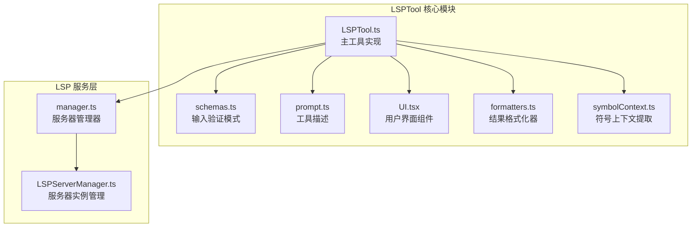
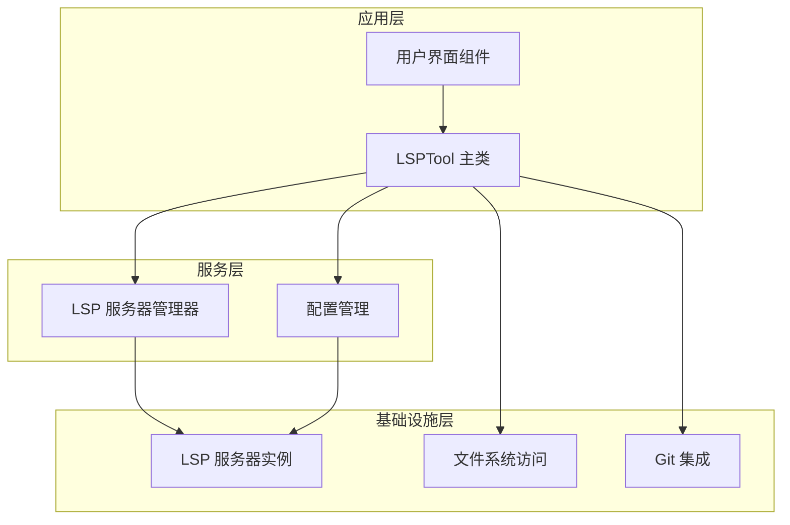
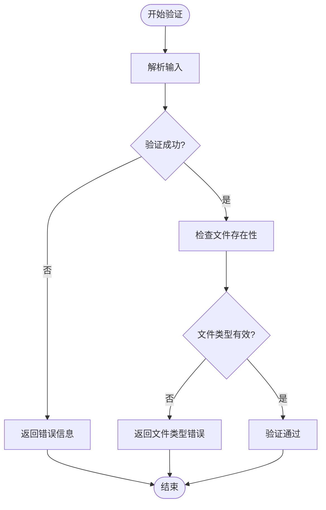
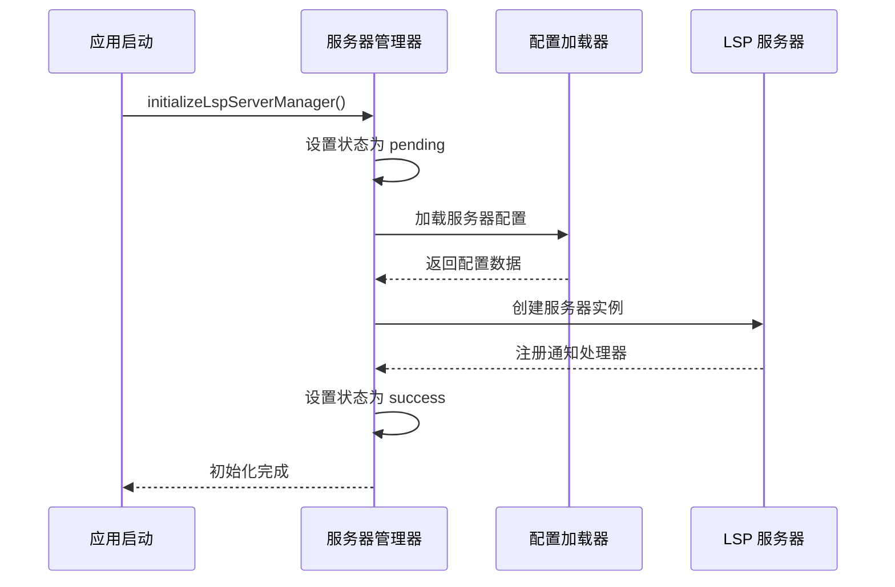
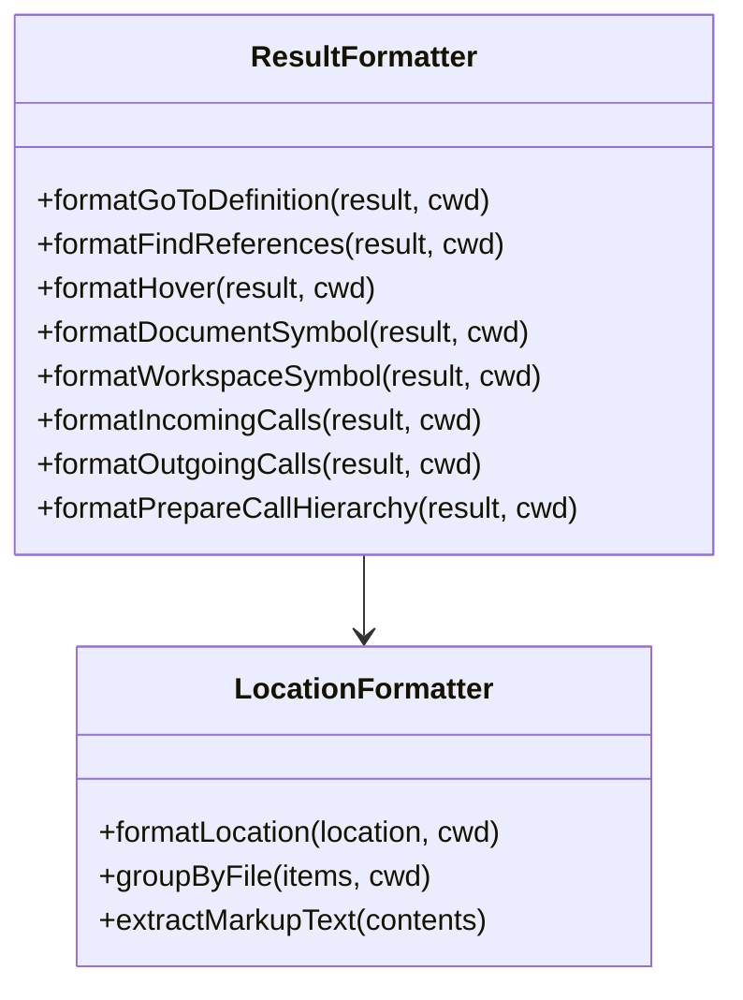
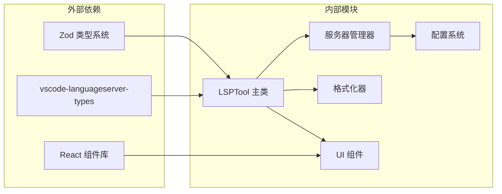

# LSP 语言服务器工具

<cite>
**本文档引用的文件**
- [LSPTool.ts](file://src/tools/LSPTool/LSPTool.ts)
- [UI.tsx](file://src/tools/LSPTool/UI.tsx)
- [formatters.ts](file://src/tools/LSPTool/formatters.ts)
- [prompt.ts](file://src/tools/LSPTool/prompt.ts)
- [schemas.ts](file://src/tools/LSPTool/schemas.ts)
- [symbolContext.ts](file://src/tools/LSPTool/symbolContext.ts)
- [manager.ts](file://src/services/lsp/manager.ts)
- [LSPServerManager.ts](file://src/services/lsp/LSPServerManager.ts)
</cite>

## 目录
1. [简介](#简介)
2. [项目结构](#项目结构)
3. [核心组件](#核心组件)
4. [架构概览](#架构概览)
5. [详细组件分析](#详细组件分析)
6. [依赖关系分析](#依赖关系分析)
7. [性能考虑](#性能考虑)
8. [故障排除指南](#故障排除指南)
9. [结论](#结论)
10. [附录](#附录)

## 简介

LSPTool 是 Claude Code 中的一个强大代码智能工具，它通过 Language Server Protocol (LSP) 集成提供了全面的代码导航和分析功能。该工具支持多种 LSP 操作，包括定义跳转、引用查找、悬停信息、文档符号、工作区符号、实现跳转、调用层次结构等。

LSPTool 的设计目标是为开发者提供类似 IDE 的代码智能体验，同时保持轻量级和高效的特性。它通过智能的文件监听机制、权限检查和错误处理策略，确保在各种开发环境中都能稳定运行。

## 项目结构

LSPTool 位于 `src/tools/LSPTool/` 目录下，包含以下关键文件：

**图表来源**
- [LSPTool.ts:1-862](file://src/tools/LSPTool/LSPTool.ts#L1-L862)
- [manager.ts:1-291](file://src/services/lsp/manager.ts#L1-L291)
- [LSPServerManager.ts:1-422](file://src/services/lsp/LSPServerManager.ts#L1-L422)

**章节来源**
- [LSPTool.ts:1-862](file://src/tools/LSPTool/LSPTool.ts#L1-L862)
- [schemas.ts:1-217](file://src/tools/LSPTool/schemas.ts#L1-L217)
- [manager.ts:1-291](file://src/services/lsp/manager.ts#L1-L291)

## 核心组件

### LSPTool 主类

LSPTool 是一个完整的工具实现，具有以下核心特性：

- **类型安全**: 使用 Zod 模式进行严格的输入验证
- **并发安全**: 支持并行执行多个 LSP 请求
- **只读操作**: 所有操作都是只读的，不会修改文件
- **智能缓存**: 避免重复打开已打开的文件

### LSP 服务器管理器

服务器管理器负责协调多个 LSP 服务器实例，提供统一的接口来处理不同类型的文件请求。

### 结果格式化器

专门的格式化器将 LSP 原始响应转换为人类可读的文本格式，支持多种输出样式。

**章节来源**
- [LSPTool.ts:127-422](file://src/tools/LSPTool/LSPTool.ts#L127-L422)
- [manager.ts:145-208](file://src/services/lsp/manager.ts#L145-L208)

## 架构概览

LSPTool 采用分层架构设计，从上到下分为工具层、服务层和基础设施层：

**图表来源**
- [LSPTool.ts:224-414](file://src/tools/LSPTool/LSPTool.ts#L224-L414)
- [manager.ts:63-69](file://src/services/lsp/manager.ts#L63-L69)
- [LSPServerManager.ts:59-420](file://src/services/lsp/LSPServerManager.ts#L59-L420)

## 详细组件分析

### LSPTool 主实现

#### 输入验证系统

LSPTool 使用双重验证机制确保输入的安全性和正确性：

**图表来源**
- [LSPTool.ts:155-209](file://src/tools/LSPTool/LSPTool.ts#L155-L209)

#### 权限检查机制

LSPTool 实现了多层次的权限检查：

1. **UNC 路径保护**: 防止 NTLM 凭据泄露
2. **文件系统权限**: 验证对目标文件的读取权限
3. **安全路径检查**: 防止目录遍历攻击

#### 文件大小限制

LSPTool 对处理的文件大小设置了严格的限制（10MB）：

- **10MB 上限**: 防止大型文件导致内存溢出
- **延迟加载**: 只在需要时读取文件内容
- **自动过滤**: 超过限制的文件会被拒绝处理

**章节来源**
- [LSPTool.ts:53-54](file://src/tools/LSPTool/LSPTool.ts#L53-L54)
- [LSPTool.ts:261-278](file://src/tools/LSPTool/LSPTool.ts#L261-L278)

### LSP 服务器管理器

#### 初始化流程

**图表来源**
- [manager.ts:145-208](file://src/services/lsp/manager.ts#L145-L208)
- [LSPServerManager.ts:71-148](file://src/services/lsp/LSPServerManager.ts#L71-L148)

#### 服务器生命周期管理

服务器管理器负责管理 LSP 服务器的完整生命周期：

- **懒加载**: 仅在需要时启动服务器
- **状态监控**: 跟踪服务器健康状态
- **资源清理**: 正确关闭和清理服务器资源

**章节来源**
- [manager.ts:226-253](file://src/services/lsp/manager.ts#L226-L253)
- [LSPServerManager.ts:157-185](file://src/services/lsp/LSPServerManager.ts#L157-L185)

### 结果格式化系统

#### 统一格式化接口

LSPTool 提供了统一的结果格式化接口，支持所有 LSP 操作：

**图表来源**
- [formatters.ts:127-594](file://src/tools/LSPTool/formatters.ts#L127-L594)

#### 符号上下文提取

LSPTool 能够从源代码中提取符号上下文，提供更丰富的用户体验：

- **智能符号识别**: 支持多种编程语言的标识符
- **位置感知**: 准确识别光标下的符号
- **长度限制**: 防止过长符号影响显示效果

**章节来源**
- [symbolContext.ts:21-92](file://src/tools/LSPTool/symbolContext.ts#L21-L92)

## 依赖关系分析

### 核心依赖图

**图表来源**
- [LSPTool.ts:1-52](file://src/tools/LSPTool/LSPTool.ts#L1-L52)
- [formatters.ts:1-18](file://src/tools/LSPTool/formatters.ts#L1-L18)

### 错误处理依赖

LSPTool 实现了完善的错误处理机制：

- **输入验证**: 使用 Zod 进行严格的数据验证
- **文件系统错误**: 统一处理文件访问异常
- **网络通信错误**: 处理 LSP 服务器连接问题
- **格式化错误**: 容错处理 LSP 响应格式问题

**章节来源**
- [LSPTool.ts:394-413](file://src/tools/LSPTool/LSPTool.ts#L394-L413)
- [formatters.ts:29-55](file://src/tools/LSPTool/formatters.ts#L29-L55)

## 性能考虑

### 内存优化策略

1. **文件大小限制**: 10MB 上限防止内存溢出
2. **延迟加载**: 仅在需要时读取文件内容
3. **对象复用**: 复用格式化器和工具实例
4. **垃圾回收**: 及时清理不再使用的资源

### 并发处理

LSPTool 支持并发执行多个 LSP 请求：

- **异步操作**: 所有文件系统和网络操作都是异步的
- **Promise 链**: 使用 Promise 链避免回调地狱
- **错误隔离**: 单个请求失败不影响其他请求

### 缓存机制

- **文件打开状态**: 跟踪已打开的文件避免重复操作
- **服务器映射**: 缓存文件扩展名到服务器的映射
- **格式化结果**: 缓存格式化后的结果以提高性能

## 故障排除指南

### 常见问题诊断

#### LSP 服务器不可用

当 LSP 服务器不可用时，LSPTool 会返回明确的错误信息：

1. **检查服务器配置**: 确认 LSP 服务器正确安装和配置
2. **验证文件类型**: 确认目标文件类型受支持
3. **查看日志**: 检查服务器启动日志和错误信息

#### 权限问题

LSPTool 实现了多层权限检查：

- **UNC 路径保护**: 自动跳过可能不安全的网络路径
- **文件系统权限**: 验证对目标文件的读取权限
- **安全路径检查**: 防止目录遍历攻击

#### 文件大小限制

如果遇到文件过大问题：

1. **检查文件大小**: 确认文件是否超过 10MB 限制
2. **使用外部工具**: 对大文件使用专门的分析工具
3. **分段处理**: 将大文件分割为较小的部分

**章节来源**
- [LSPTool.ts:170-209](file://src/tools/LSPTool/LSPTool.ts#L170-L209)
- [LSPTool.ts:265-272](file://src/tools/LSPTool/LSPTool.ts#L265-L272)

### 调试方法

#### 启用调试模式

LSPTool 提供了多种调试工具：

1. **日志记录**: 使用 `logForDebugging` 和 `logError` 记录详细信息
2. **状态查询**: 使用 `getInitializationStatus()` 检查服务器状态
3. **错误追踪**: 分析错误堆栈和上下文信息

#### 性能监控

- **执行时间**: 监控 LSP 请求的响应时间
- **内存使用**: 跟踪内存分配和垃圾回收
- **并发度**: 分析并发请求的处理效率

## 结论

LSPTool 是一个设计精良的代码智能工具，它通过以下关键特性提供了卓越的用户体验：

1. **全面的功能覆盖**: 支持所有主要的 LSP 操作
2. **强大的安全性**: 实现了多层次的安全检查和防护
3. **优秀的性能**: 通过缓存和优化策略确保快速响应
4. **良好的可维护性**: 清晰的架构和模块化设计

LSPTool 不仅满足了当前的需求，还为未来的扩展和改进奠定了坚实的基础。其模块化的架构使得添加新的 LSP 操作或改进现有功能变得相对简单。

## 附录

### 支持的操作列表

LSPTool 当前支持以下 LSP 操作：

- **goToDefinition**: 查找符号定义位置
- **findReferences**: 查找符号的所有引用
- **hover**: 获取符号的悬停信息
- **documentSymbol**: 获取文档中的所有符号
- **workspaceSymbol**: 在整个工作区中搜索符号
- **goToImplementation**: 查找接口或抽象方法的实现
- **prepareCallHierarchy**: 获取指定位置的调用层次结构项
- **incomingCalls**: 查找调用当前函数的所有函数
- **outgoingCalls**: 查找当前函数调用的所有函数

### 配置选项

- **最大结果大小**: 100,000 字符
- **文件大小限制**: 10MB
- **并发安全**: 支持并行执行
- **只读操作**: 所有操作都是只读的

### 使用示例

LSPTool 可以通过以下方式使用：

1. **命令行界面**: 直接调用 LSPTool 进行代码分析
2. **IDE 集成**: 作为 IDE 插件提供代码智能功能
3. **自动化脚本**: 在 CI/CD 流程中进行代码质量检查
4. **开发工具**: 作为开发环境的一部分提供实时代码建议