# UI 渲染组件

<cite>
**本文档引用的文件**
- [UI.tsx](file://src/tools/LSPTool/UI.tsx)
- [LSPTool.ts](file://src/tools/LSPTool/LSPTool.ts)
- [symbolContext.ts](file://src/tools/LSPTool/symbolContext.ts)
- [CtrlOToExpand.tsx](file://src/components/CtrlOToExpand.tsx)
- [FallbackToolUseErrorMessage.tsx](file://src/components/FallbackToolUseErrorMessage.tsx)
- [MessageResponse.tsx](file://src/components/MessageResponse.tsx)
- [file.ts](file.ts)
- [messages.ts](file://src/utils/messages.ts)
- [formatters.ts](file://src/tools/LSPTool/formatters.ts)
- [prompt.ts](file://src/tools/LSPTool/prompt.ts)
- [schemas.ts](file://src/tools/LSPTool/schemas.ts)
</cite>

## 目录
1. [简介](#简介)
2. [项目结构](#项目结构)
3. [核心组件](#核心组件)
4. [架构概览](#架构概览)
5. [详细组件分析](#详细组件分析)
6. [依赖关系分析](#依赖关系分析)
7. [性能考虑](#性能考虑)
8. [故障排除指南](#故障排除指南)
9. [结论](#结论)

## 简介

LSPTool 的 UI 渲染组件是 Claude Code 中用于处理语言服务器协议（LSP）工具调用的核心渲染系统。该组件负责将 LSP 操作的结果以用户友好的方式呈现，包括工具使用消息、工具结果消息和工具错误消息的渲染。

该渲染系统提供了以下关键功能：
- 用户友好的名称生成（显示为 "LSP"）
- 工具调用的可视化展示
- 结果的富文本格式化
- 错误信息的用户友好提示
- 与 LSPTool 的深度集成
- 标准化的消息格式
- 用户体验优化

## 项目结构

LSPTool UI 渲染组件位于 `src/tools/LSPTool/` 目录下，主要包含以下文件：

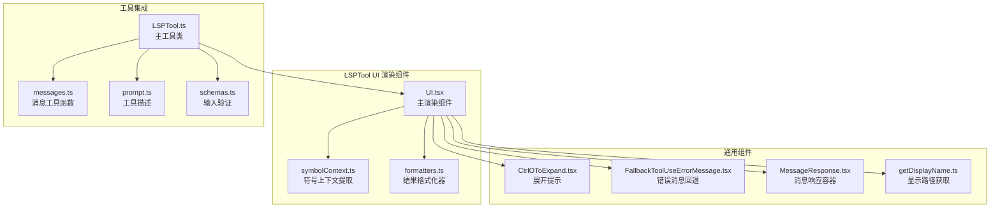

**图表来源**
- [UI.tsx:1-229](file://src/tools/LSPTool/UI.tsx#L1-229)
- [LSPTool.ts:1-862](file://src/tools/LSPTool/LSPTool.ts#L1-862)

**章节来源**
- [UI.tsx:1-229](file://src/tools/LSPTool/UI.tsx#L1-229)
- [LSPTool.ts:1-862](file://src/tools/LSPTool/LSPTool.ts#L1-862)

## 核心组件

### 主渲染组件 (UI.tsx)

主渲染组件包含了三个核心渲染函数：

1. **userFacingName()** - 返回用户友好的工具名称
2. **renderToolUseMessage()** - 渲染工具使用消息
3. **renderToolResultMessage()** - 渲染工具结果消息
4. **renderToolUseErrorMessage()** - 渲染工具错误消息

### LSPResultSummary 组件

这是一个可复用的结果摘要组件，支持折叠/展开视图：

- 显示操作类型和结果数量
- 支持跨文件统计
- 提供详细的展开视图
- 集成键盘快捷键提示

### 符号上下文提取 (symbolContext.ts)

提供符号提取功能，增强工具使用消息的上下文信息：

- 从文件中提取指定位置的符号
- 支持多种编程语言的符号识别
- 实现智能截断和错误处理
- 使用 64KB 读取窗口优化性能

**章节来源**
- [UI.tsx:160-227](file://src/tools/LSPTool/UI.tsx#L160-227)
- [symbolContext.ts:21-92](file://src/tools/LSPTool/symbolContext.ts#L21-92)

## 架构概览

LSPTool UI 渲染系统采用模块化设计，通过清晰的职责分离实现了高度的可维护性和扩展性：

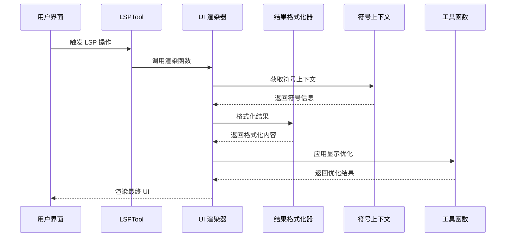

**图表来源**
- [LSPTool.ts:224-422](file://src/tools/LSPTool/LSPTool.ts#L224-422)
- [UI.tsx:163-227](file://src/tools/LSPTool/UI.tsx#L163-227)

## 详细组件分析

### 用户友好名称生成

用户友好名称生成是通过 `userFacingName()` 函数实现的，简单而直接：

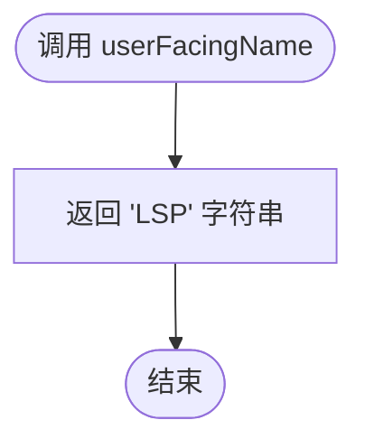

**图表来源**
- [UI.tsx:160-162](file://src/tools/LSPTool/UI.tsx#L160-162)

### 工具使用消息渲染

工具使用消息渲染根据不同的 LSP 操作类型提供相应的用户界面：

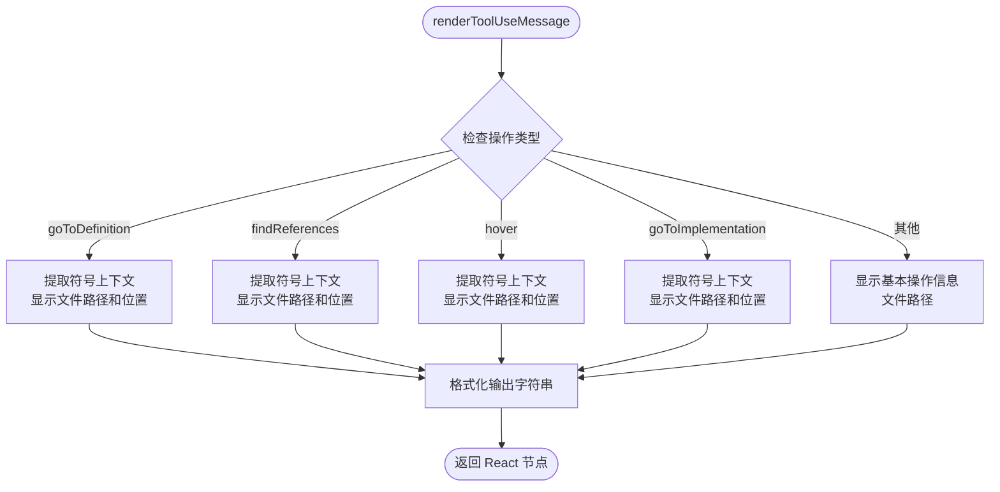

**图表来源**
- [UI.tsx:163-199](file://src/tools/LSPTool/UI.tsx#L163-199)

#### 符号提取算法

符号提取使用正则表达式模式匹配不同编程语言的符号：

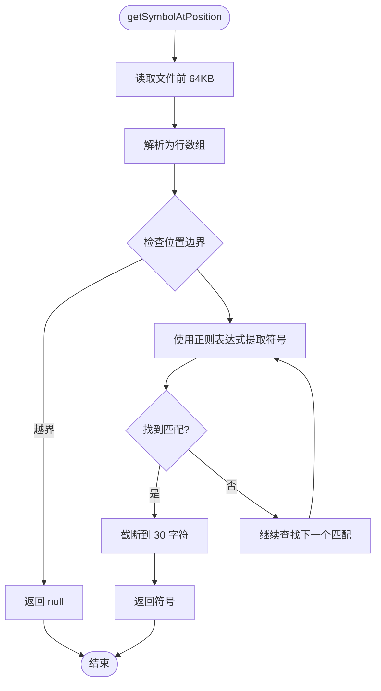

**图表来源**
- [symbolContext.ts:21-92](file://src/tools/LSPTool/symbolContext.ts#L21-92)

### 工具结果消息渲染

工具结果消息渲染提供了两种模式：详细模式和简洁模式：

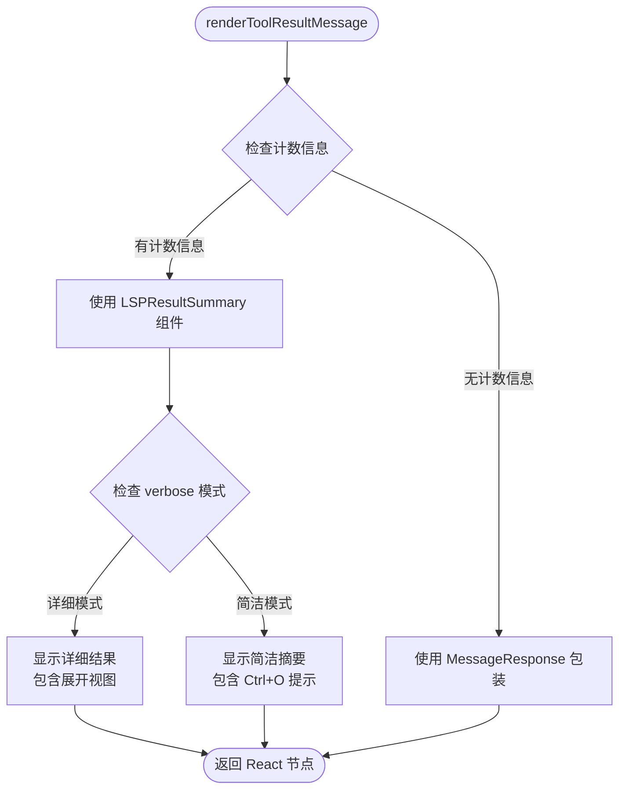

**图表来源**
- [UI.tsx:212-227](file://src/tools/LSPTool/UI.tsx#L212-227)

#### LSPResultSummary 组件分析

LSPResultSummary 是一个高性能的可复用组件：

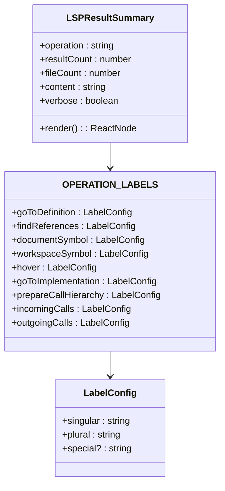

**图表来源**
- [UI.tsx:13-56](file://src/tools/LSPTool/UI.tsx#L13-56)
- [UI.tsx:61-159](file://src/tools/LSPTool/UI.tsx#L61-159)

### 工具错误消息渲染

工具错误消息渲染提供了两层保护机制：

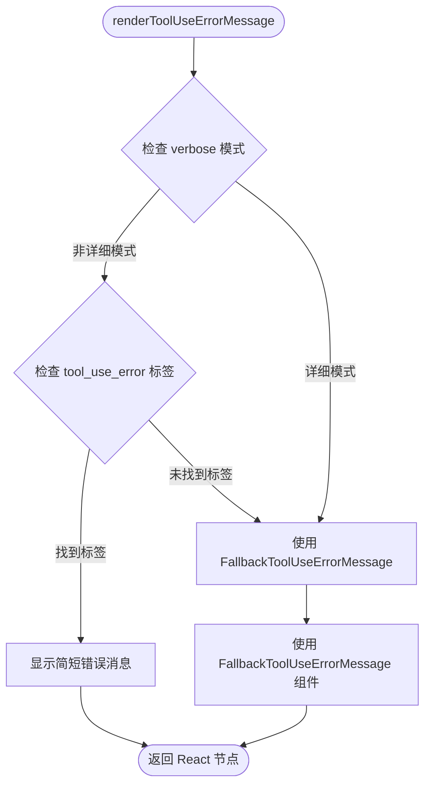

**图表来源**
- [UI.tsx:200-211](file://src/tools/LSPTool/UI.tsx#L200-211)

#### FallbackToolUseErrorMessage 组件

回退错误消息组件提供了丰富的错误处理能力：

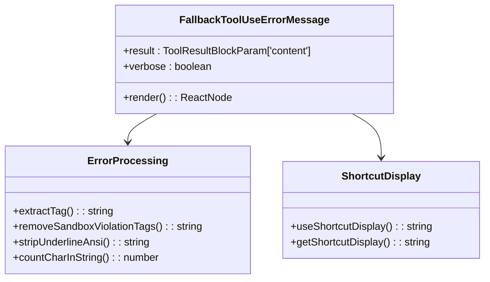

**图表来源**
- [FallbackToolUseErrorMessage.tsx:16-115](file://src/components/FallbackToolUseErrorMessage.tsx#L16-115)

### 通用 UI 组件

#### CtrlOToExpand 组件

提供键盘快捷键提示功能：

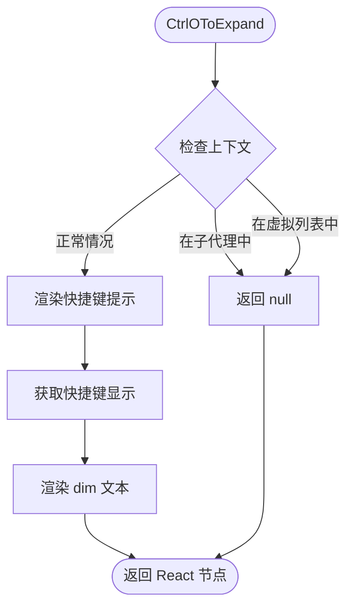

**图表来源**
- [CtrlOToExpand.tsx:29-50](file://src/components/CtrlOToExpand.tsx#L29-50)

#### MessageResponse 组件

消息响应容器组件：

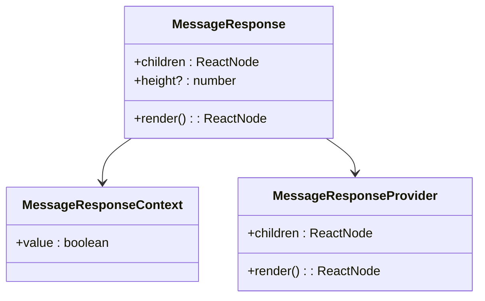

**图表来源**
- [MessageResponse.tsx:10-77](file://src/components/MessageResponse.tsx#L10-77)

**章节来源**
- [UI.tsx:1-229](file://src/tools/LSPTool/UI.tsx#L1-229)
- [CtrlOToExpand.tsx:1-53](file://src/components/CtrlOToExpand.tsx#L1-53)
- [FallbackToolUseErrorMessage.tsx:1-117](file://src/components/FallbackToolUseErrorMessage.tsx#L1-117)
- [MessageResponse.tsx:1-79](file://src/components/MessageResponse.tsx#L1-79)

## 依赖关系分析

LSPTool UI 渲染组件的依赖关系展现了清晰的层次结构：

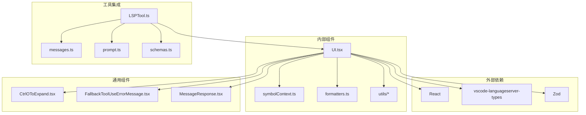

**图表来源**
- [UI.tsx:1-12](file://src/tools/LSPTool/UI.tsx#L1-12)
- [LSPTool.ts:1-46](file://src/tools/LSPTool/LSPTool.ts#L1-46)

### 关键依赖说明

1. **React 运行时** - 提供组件渲染和状态管理
2. **vscode-languageserver-types** - 定义 LSP 协议的数据结构
3. **Zod** - 提供运行时类型验证
4. **自定义工具函数** - 提供文件路径处理、消息格式化等功能

**章节来源**
- [UI.tsx:1-12](file://src/tools/LSPTool/UI.tsx#L1-12)
- [LSPTool.ts:1-46](file://src/tools/LSPTool/LSPTool.ts#L1-46)

## 性能考虑

LSPTool UI 渲染组件在设计时充分考虑了性能优化：

### 缓存策略
- 使用 React 内置的 memoization 机制
- 缓存符号提取结果
- 避免不必要的重新渲染

### I/O 优化
- 限制符号提取的文件读取大小（64KB）
- 使用同步文件 I/O 在渲染函数中进行快速符号提取
- 实现智能的文件路径显示优化

### 渲染优化
- 条件渲染展开提示
- 按需渲染详细内容
- 合理的组件拆分和组合

## 故障排除指南

### 常见问题及解决方案

#### 符号提取失败
**问题**: 符号提取返回 null
**原因**: 
- 文件位置超出读取范围
- 文件编码问题
- 权限不足

**解决方案**:
- 检查文件路径和位置参数
- 验证文件权限
- 查看日志中的调试信息

#### LSP 服务器不可用
**问题**: LSP 服务器初始化失败
**解决方案**:
- 检查 LSP 服务器配置
- 验证文件类型支持
- 查看系统日志

#### 错误消息显示不正确
**问题**: 错误消息格式异常
**解决方案**:
- 检查 `tool_use_error` 标签
- 验证消息格式化逻辑
- 查看回退机制是否正常工作

**章节来源**
- [symbolContext.ts:78-90](file://src/tools/LSPTool/symbolContext.ts#L78-90)
- [LSPTool.ts:238-252](file://src/tools/LSPTool/LSPTool.ts#L238-252)
- [messages.ts:633-687](file://src/utils/messages.ts#L633-687)

## 结论

LSPTool 的 UI 渲染组件展现了优秀的软件工程实践：

1. **模块化设计**: 清晰的职责分离和组件划分
2. **性能优化**: 多层次的缓存和优化策略
3. **用户体验**: 用户友好的界面和交互设计
4. **错误处理**: 完善的错误处理和回退机制
5. **可扩展性**: 灵活的架构支持未来功能扩展

该组件系统为 LSP 操作提供了直观、高效且用户友好的界面，是 Claude Code 代码智能功能的重要组成部分。通过合理的架构设计和实现细节，确保了在各种使用场景下的稳定性和可靠性。