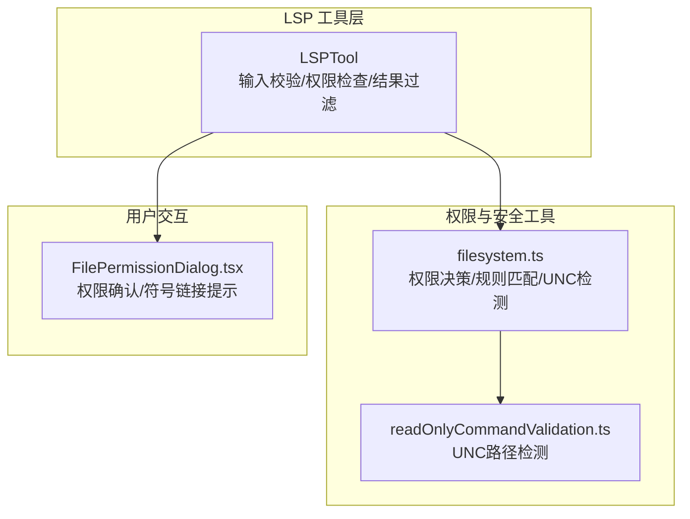
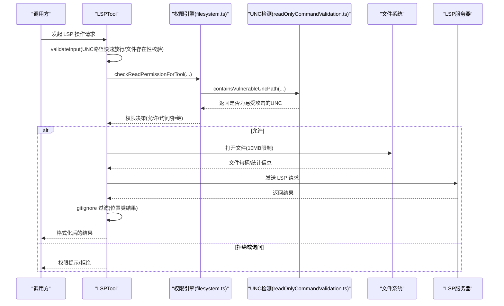
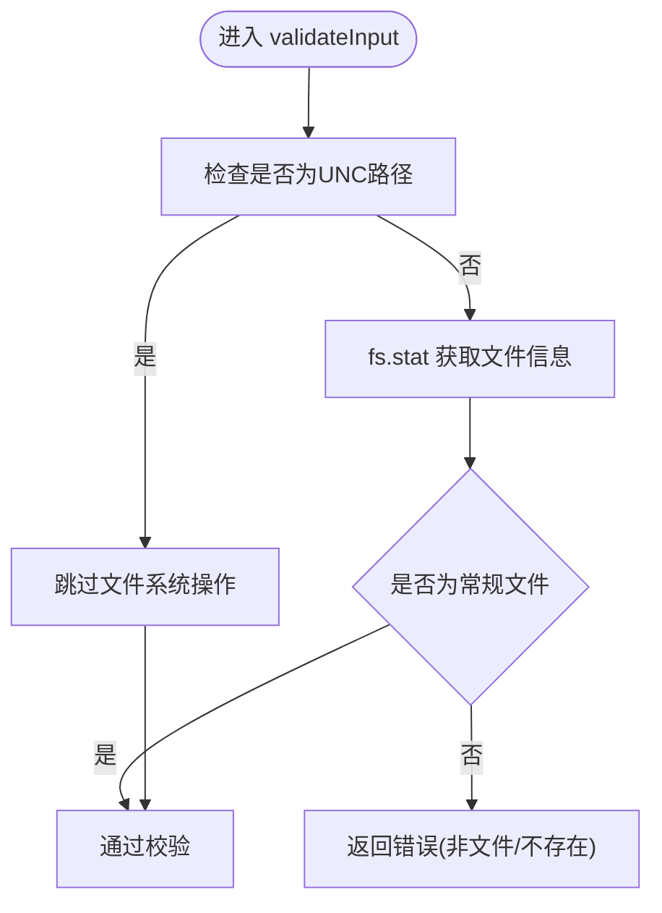
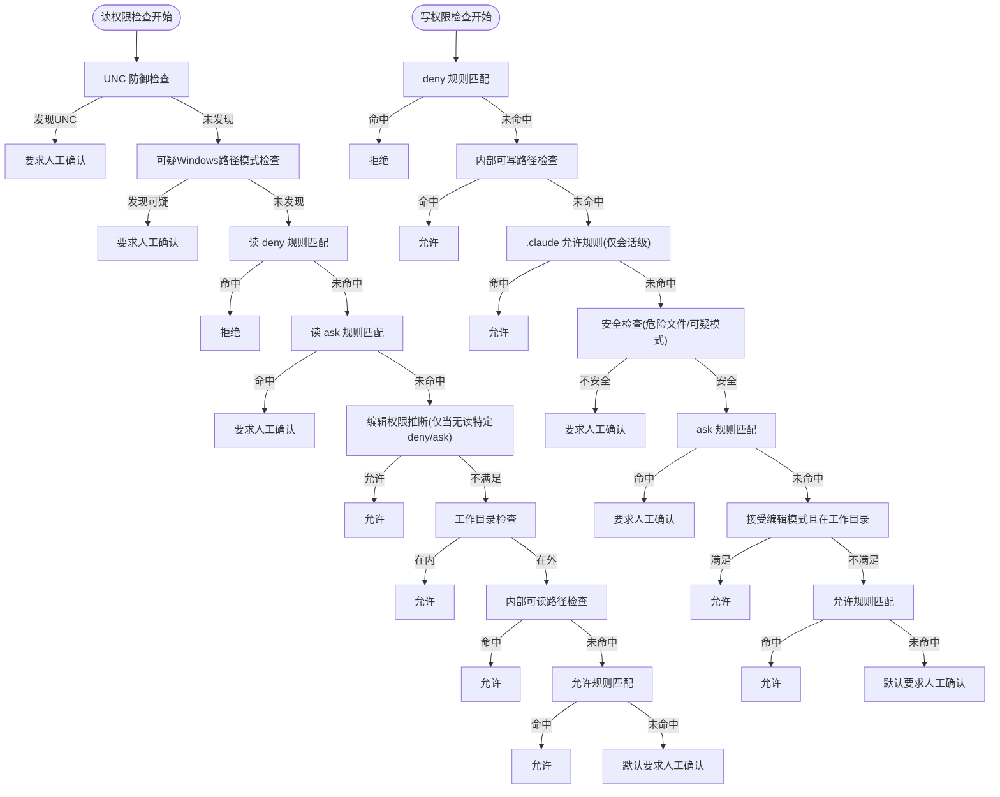
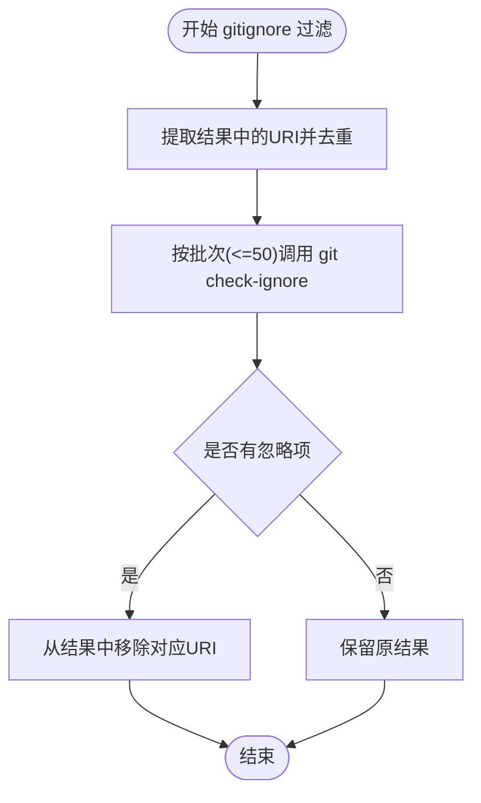
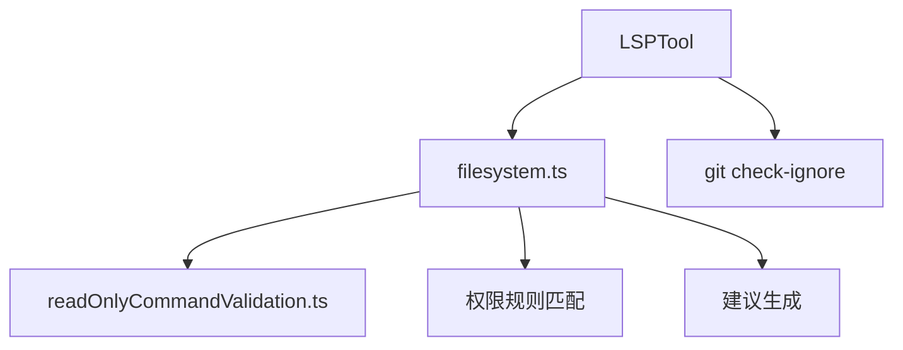

# 安全与权限控制

<cite>
**本文档引用的文件**
- [LSPTool.ts](file://src/tools/LSPTool/LSPTool.ts)
- [filesystem.ts](file://src/utils/permissions/filesystem.ts)
- [readOnlyCommandValidation.ts](file://src/utils/shell/readOnlyCommandValidation.ts)
- [FilePermissionDialog.tsx](file://src/components/permissions/FilePermissionDialog/FilePermissionDialog.tsx)
- [LSPTool.ts（第800-862行）:800-862](file://src/tools/LSPTool/LSPTool.ts#L800-L862)
</cite>

## 目录
1. [简介](#简介)
2. [项目结构](#项目结构)
3. [核心组件](#核心组件)
4. [架构总览](#架构总览)
5. [详细组件分析](#详细组件分析)
6. [依赖关系分析](#依赖关系分析)
7. [性能考量](#性能考量)
8. [故障排查指南](#故障排查指南)
9. [结论](#结论)
10. [附录](#附录)

## 简介
本文件聚焦于 LSPTool 的安全与权限控制机制，系统性阐述以下主题：
- 文件系统权限检查流程与决策逻辑
- UNC 路径的安全防护与 NTLM 凭据泄露预防
- 文件大小限制（10MB）的实现原理与边界处理
- gitignore 过滤机制在 LSP 结果中的应用
- 权限规则体系（允许/拒绝/询问）与工作目录约束
- 权限检查与 LSP 操作的关系、安全最佳实践与潜在风险
- 权限配置示例与安全审计方法

## 项目结构
围绕 LSPTool 的安全与权限控制，涉及的关键模块包括：
- LSPTool：负责 LSP 操作的输入校验、权限检查、结果过滤与输出格式化
- 权限工具集：统一的文件系统权限检查、规则匹配、UNC 检测与路径安全校验
- 用户交互：文件权限对话框，支持符号链接目标提示与 IDE Diff 集成
- Shell 命令安全：UNC 路径检测与 NTLM/WebDAV 防护

图表来源
- [LSPTool.ts:127-226](file://src/tools/LSPTool/LSPTool.ts#L127-L226)
- [filesystem.ts:1030-1194](file://src/utils/permissions/filesystem.ts#L1030-L1194)
- [readOnlyCommandValidation.ts:1562-1638](file://src/utils/shell/readOnlyCommandValidation.ts#L1562-L1638)
- [FilePermissionDialog.tsx:48-99](file://src/components/permissions/FilePermissionDialog/FilePermissionDialog.tsx#L48-L99)

章节来源
- [LSPTool.ts:127-226](file://src/tools/LSPTool/LSPTool.ts#L127-L226)
- [filesystem.ts:1030-1194](file://src/utils/permissions/filesystem.ts#L1030-L1194)
- [FilePermissionDialog.tsx:48-99](file://src/components/permissions/FilePermissionDialog/FilePermissionDialog.tsx#L48-L99)

## 核心组件
- LSPTool 输入校验与权限检查
  - 在 validateInput 中对文件存在性与类型进行基础校验，并对 UNC 路径跳过文件系统操作以避免 NTLM 泄漏
  - 在 checkPermissions 中委托统一的文件系统权限检查函数
- 统一权限决策引擎
  - 读权限检查顺序：UNC 防御、可疑 Windows 路径模式、读规则（deny/ask）、编辑权限推断、工作目录、内部可读路径、允许规则、默认询问
  - 写权限检查顺序：deny 规则、内部可写路径、会话级 .claude 允许规则、安全检查（含危险文件/配置/ADS/短名等）、ask 规则、接受编辑模式、允许规则、默认询问
- UNC 路径与 NTLM 防护
  - 专门的 UNC 检测函数覆盖基本 UNC、WebDAV、IP/IPv6 地址、混合分隔符等模式
  - LSPTool 对 UNC 路径直接跳过文件系统 stat，避免触发网络请求与凭据泄漏
- gitignore 过滤
  - LSPTool 在返回位置类结果时，使用 git check-ignore 批量过滤被忽略的文件，提升结果质量并减少敏感信息暴露
- 文件大小限制（10MB）
  - LSPTool 在打开文件前检查文件大小，超过阈值直接返回错误提示，防止大文件带来的内存与性能问题

章节来源
- [LSPTool.ts:155-209](file://src/tools/LSPTool/LSPTool.ts#L155-L209)
- [filesystem.ts:1050-1194](file://src/utils/permissions/filesystem.ts#L1050-L1194)
- [readOnlyCommandValidation.ts:1562-1638](file://src/utils/shell/readOnlyCommandValidation.ts#L1562-L1638)
- [LSPTool.ts（第800-862行）:800-862](file://src/tools/LSPTool/LSPTool.ts#L800-L862)

## 架构总览
下图展示 LSPTool 的权限检查与安全控制在整体调用链中的位置与交互。

图表来源
- [LSPTool.ts:155-226](file://src/tools/LSPTool/LSPTool.ts#L155-L226)
- [filesystem.ts:1030-1194](file://src/utils/permissions/filesystem.ts#L1030-L1194)
- [readOnlyCommandValidation.ts:1562-1638](file://src/utils/shell/readOnlyCommandValidation.ts#L1562-L1638)

## 详细组件分析

### LSPTool 输入校验与权限检查
- 输入校验
  - 使用严格 Schema 校验操作类型、文件路径、行列坐标
  - 对 UNC 路径（以 \\ 或 // 开头）直接放行，跳过文件系统 stat，避免触发网络请求与凭据泄露
  - 其他路径执行文件存在性与类型检查，非文件或不存在返回错误码
- 权限检查
  - 委托统一的读权限检查函数，遵循“deny 优先、ask 次之、允许再次之”的规则
  - 若路径不在工作目录且无显式规则，则建议生成“添加目录到会话规则”等建议

图表来源
- [LSPTool.ts:155-209](file://src/tools/LSPTool/LSPTool.ts#L155-L209)

章节来源
- [LSPTool.ts:155-209](file://src/tools/LSPTool/LSPTool.ts#L155-L209)

### 统一权限决策引擎（读/写）
- 读权限检查流程
  - UNC 防御：若路径为 UNC，直接要求人工确认
  - 可疑 Windows 路径模式：包含 ADS、短名、长路径前缀、三斜杠、UNC 等模式均需人工确认
  - 读规则：deny 优先，ask 次之；编辑权限不可用于绕过读 deny/ask
  - 工作目录：在允许的工作目录内默认允许
  - 内部可读路径：会话记忆、计划文件等内部路径可读
  - 允许规则：匹配到允许规则即放行
  - 默认：超出工作目录且无允许规则时，要求人工确认并提供建议
- 写权限检查流程
  - deny 规则优先
  - 内部可写路径：会话草稿、计划文件等
  - .claude 允许规则：仅限会话级规则，且必须限定在 .claude/** 下
  - 安全检查：禁止编辑危险文件/目录（.git/.vscode/.idea 等），以及可疑 Windows 路径模式
  - ask 规则、接受编辑模式、允许规则、默认询问

图表来源
- [filesystem.ts:1050-1194](file://src/utils/permissions/filesystem.ts#L1050-L1194)
- [filesystem.ts:1196-1412](file://src/utils/permissions/filesystem.ts#L1196-L1412)

章节来源
- [filesystem.ts:1030-1194](file://src/utils/permissions/filesystem.ts#L1030-L1194)
- [filesystem.ts:1196-1412](file://src/utils/permissions/filesystem.ts#L1196-L1412)

### UNC 路径安全防护与 NTLM 凭据泄露预防
- UNC 检测范围
  - 基本 UNC：\\server\share、\\foo.com\file、//server/share
  - WebDAV：包含 @SSL@、@port@SSL、DavWWWRoot 等特征
  - IP/IPv6：针对 IPv4 与方括号包裹的 IPv6 地址
  - 混合分隔符：反斜杠+正斜杠组合
- LSPTool 的处理策略
  - 在 validateInput 阶段对 UNC 路径直接放行，跳过文件系统 stat，避免触发网络请求与凭据泄露
  - 权限引擎在读权限检查中对 UNC 路径直接要求人工确认，确保用户知情
- Shell 命令安全补充
  - Bash/PowerShell 工具同样对包含易受攻击 UNC 的命令要求人工确认，防止凭据泄露与 WebDAV 攻击

章节来源
- [LSPTool.ts:170-172](file://src/tools/LSPTool/LSPTool.ts#L170-L172)
- [filesystem.ts:1050-1064](file://src/utils/permissions/filesystem.ts#L1050-L1064)
- [readOnlyCommandValidation.ts:1562-1638](file://src/utils/shell/readOnlyCommandValidation.ts#L1562-L1638)

### 文件大小限制（10MB）实现原理
- LSPTool 在打开文件前检查文件大小，超过 10MB 直接返回错误提示，避免大文件导致的内存占用与性能问题
- 该限制适用于所有 LSP 操作，确保系统稳定性与响应性

章节来源
- [LSPTool.ts:264-272](file://src/tools/LSPTool/LSPTool.ts#L264-L272)

### gitignore 过滤机制
- LSPTool 在返回位置类结果（定义跳转、引用、实现、工作区符号）时，提取所有结果中的文件 URI 并转换为本地路径
- 使用 git check-ignore 对唯一路径进行批量过滤，移除被忽略的文件，从而减少噪声与潜在敏感信息暴露
- 过滤采用批处理方式（每次最多 50 个路径），并在超时时间内完成

图表来源
- [LSPTool.ts:556-611](file://src/tools/LSPTool/LSPTool.ts#L556-L611)

章节来源
- [LSPTool.ts:336-374](file://src/tools/LSPTool/LSPTool.ts#L336-L374)
- [LSPTool.ts:556-611](file://src/tools/LSPTool/LSPTool.ts#L556-L611)

### 权限检查与 LSP 操作的关系
- LSPTool 是只读工具，其权限检查基于读权限规则
- 在执行 LSP 请求前，会确保文件已打开（若尚未打开），并受 10MB 大小限制
- 位置类结果会进一步应用 gitignore 过滤，保证返回内容符合用户仓库忽略规则

章节来源
- [LSPTool.ts:149-151](file://src/tools/LSPTool/LSPTool.ts#L149-L151)
- [LSPTool.ts:257-297](file://src/tools/LSPTool/LSPTool.ts#L257-L297)
- [LSPTool.ts:336-374](file://src/tools/LSPTool/LSPTool.ts#L336-L374)

### 用户交互与符号链接提示
- FilePermissionDialog 提供权限确认界面，支持：
  - 符号链接目标解析与外部工作目录提示
  - IDE Diff 集成，便于审阅修改内容
  - 选项选择与反馈收集，记录权限事件

章节来源
- [FilePermissionDialog.tsx:48-99](file://src/components/permissions/FilePermissionDialog/FilePermissionDialog.tsx#L48-L99)
- [FilePermissionDialog.tsx:159-167](file://src/components/permissions/FilePermissionDialog/FilePermissionDialog.tsx#L159-L167)

## 依赖关系分析
- LSPTool 依赖
  - 统一权限检查：filesystem.ts 的读权限检查函数
  - UNC 检测：readOnlyCommandValidation.ts 的 containsVulnerableUncPath
  - 文件系统操作：fs/promises 与工具库提供的安全路径展开与解析
- 权限规则与建议
  - 规则来源：会话、用户设置、项目设置、策略设置等
  - 建议生成：根据路径是否在工作目录、操作类型（读/写/创建）生成相应建议（添加目录、设置模式、添加规则）

图表来源
- [LSPTool.ts:127-226](file://src/tools/LSPTool/LSPTool.ts#L127-L226)
- [filesystem.ts:955-1025](file://src/utils/permissions/filesystem.ts#L955-L1025)
- [readOnlyCommandValidation.ts:1562-1638](file://src/utils/shell/readOnlyCommandValidation.ts#L1562-L1638)

章节来源
- [filesystem.ts:919-1025](file://src/utils/permissions/filesystem.ts#L919-L1025)

## 性能考量
- 批量 gitignore 过滤
  - 采用分批（每批 ≤50）调用 git check-ignore，平衡准确性与性能
  - 仅对位置类结果进行过滤，避免对非位置结果的额外开销
- 文件大小限制
  - 10MB 阈值有效控制内存占用与 I/O 时间，避免大文件拖慢 LSP 响应
- 缓存与复用
  - 权限检查中对工作目录与路径解析结果进行缓存，减少重复系统调用

章节来源
- [LSPTool.ts:580-601](file://src/tools/LSPTool/LSPTool.ts#L580-L601)
- [LSPTool.ts:264-272](file://src/tools/LSPTool/LSPTool.ts#L264-L272)
- [filesystem.ts:676-681](file://src/utils/permissions/filesystem.ts#L676-L681)

## 故障排查指南
- 常见错误与定位
  - 文件不存在/非文件：validateInput 返回相应错误码，检查输入路径与 UNC 前缀
  - 无法访问文件：文件系统错误日志可用于追踪，检查权限与路径解析
  - LSP 服务器不可用：日志记录帮助定位服务器初始化状态
  - 结果为空：可能由于 gitignore 过滤导致，检查 .gitignore 规则
- UNC 路径相关
  - 若路径为 UNC，系统会要求人工确认；请确认目标资源可达且安全
- 权限建议
  - 当路径不在工作目录时，系统会提供“添加目录到会话规则”等建议；按需采纳以减少后续确认

章节来源
- [LSPTool.ts:178-198](file://src/tools/LSPTool/LSPTool.ts#L178-L198)
- [LSPTool.ts:283-297](file://src/tools/LSPTool/LSPTool.ts#L283-L297)
- [filesystem.ts:1178-1193](file://src/utils/permissions/filesystem.ts#L1178-L1193)

## 结论
LSPTool 的安全与权限控制通过“防御纵深 + 明确规则 + 人机协作”的方式实现：
- UNC 路径与可疑 Windows 路径模式在早期阶段即被拦截或要求人工确认
- 统一的权限决策引擎确保 deny/ask/allow 的优先级与一致性
- gitignore 过滤与 10MB 大小限制提升结果质量与系统稳定性
- 用户交互组件提供清晰的权限确认与符号链接提示，降低误操作风险

## 附录

### 权限配置示例（概念性说明）
- 读权限
  - 在会话中添加“允许读取某目录”，或在用户设置中添加“允许读取某路径”
  - 对于 .claude/** 的编辑权限，可在会话中授予以绕过安全检查（仅限会话级）
- 写权限
  - 添加“允许写入某目录”或“设置模式为接受编辑（仅限工作目录）”
  - 对危险文件/目录（如 .git/.vscode/.idea）建议通过 ask 规则明确授权

[本节为概念性说明，不直接分析具体文件]

### 安全审计方法
- 审计点
  - 权限决策日志：记录行为（允许/询问/拒绝）、原因类型（规则/工作目录/安全检查）、建议
  - UNC 检测覆盖率：验证易受攻击的 UNC 模式是否被正确识别
  - gitignore 过滤效果：对比过滤前后结果数量，评估忽略规则有效性
  - 文件大小限制：监控超过 10MB 的请求次数与占比
- 工具与指标
  - 日志分析：权限事件、错误日志、调试日志
  - 规则覆盖率：统计 deny/ask/allow 规则命中率与误报率
  - 性能指标：git check-ignore 批处理耗时、平均 LSP 响应时间

[本节为通用指导，不直接分析具体文件]