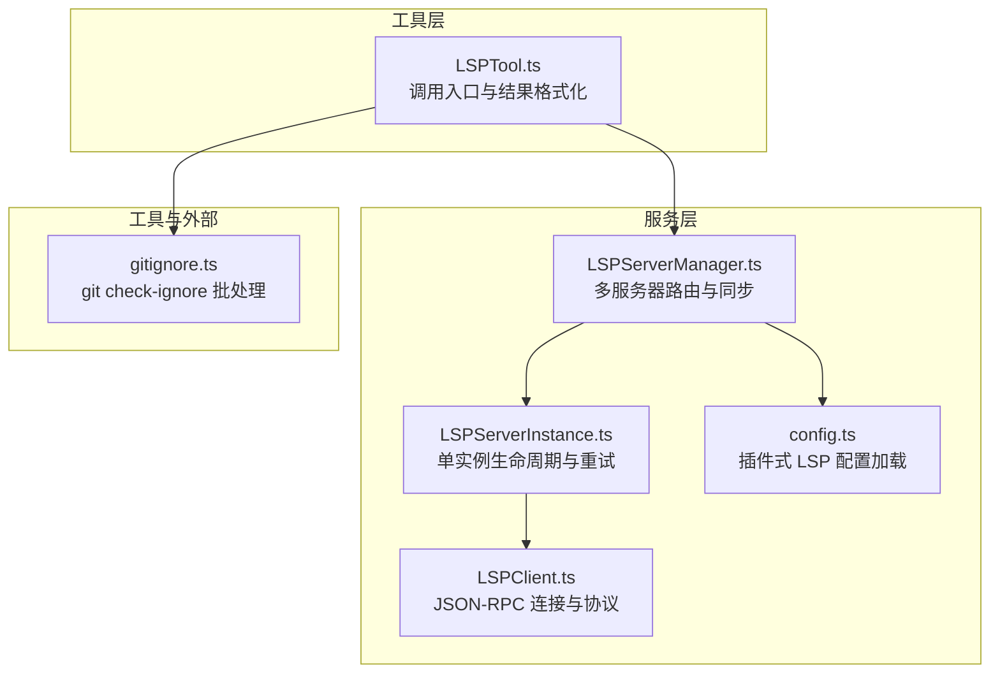
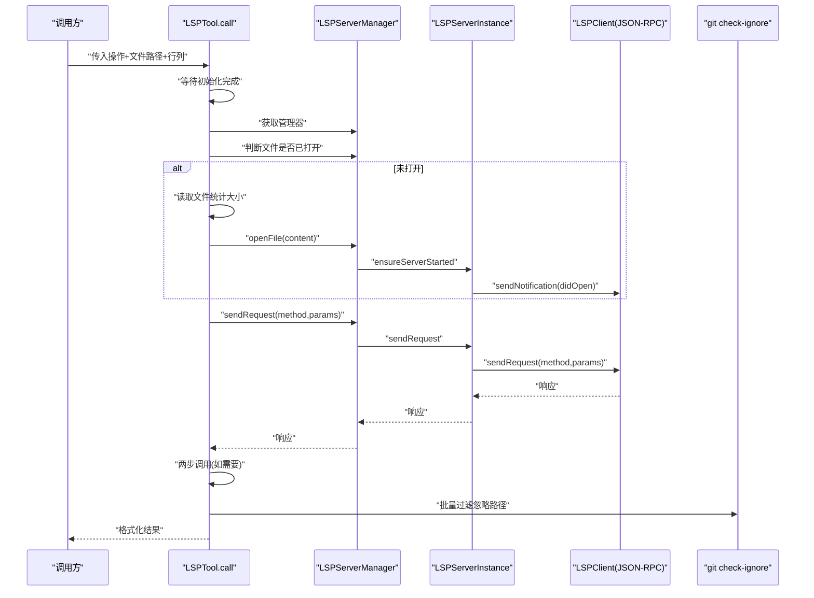
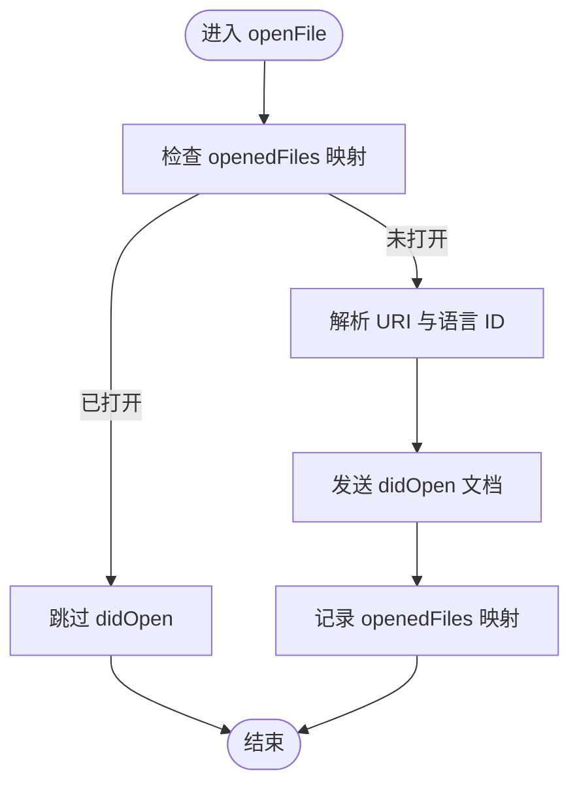
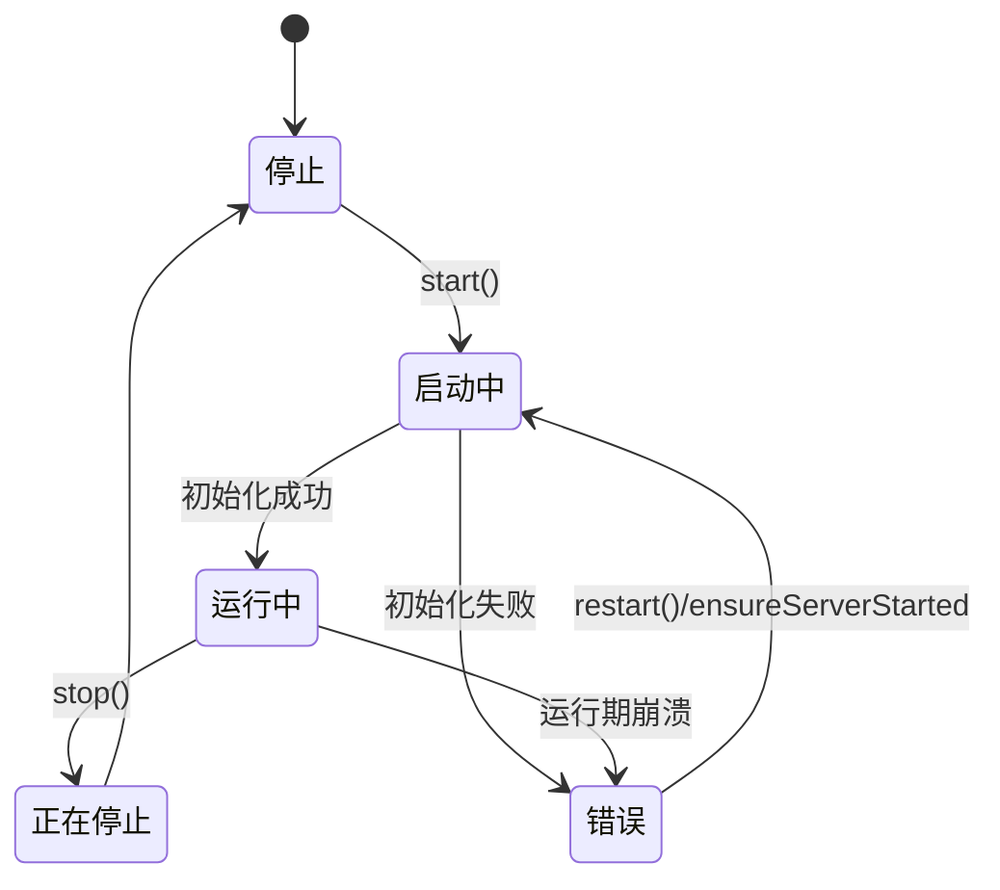
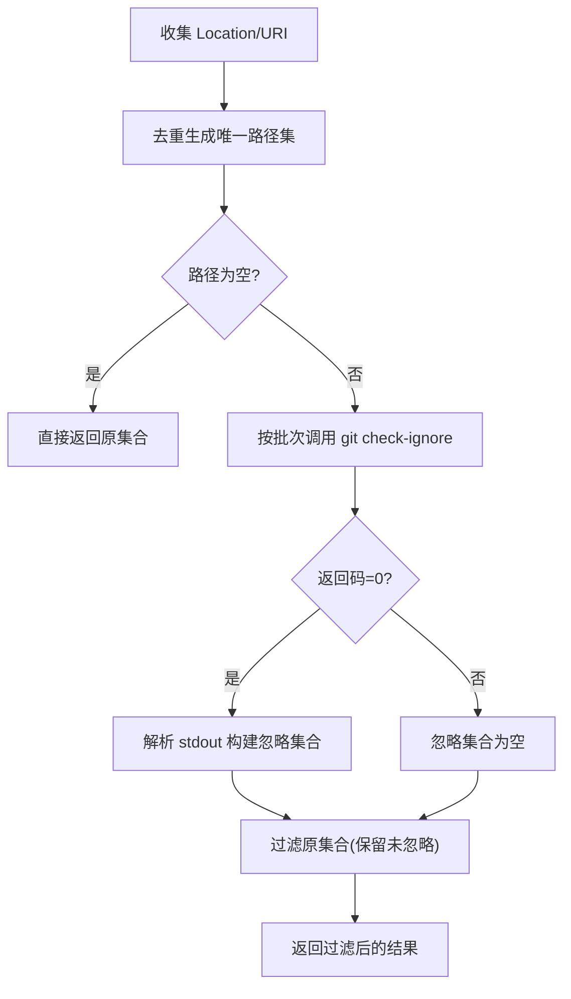
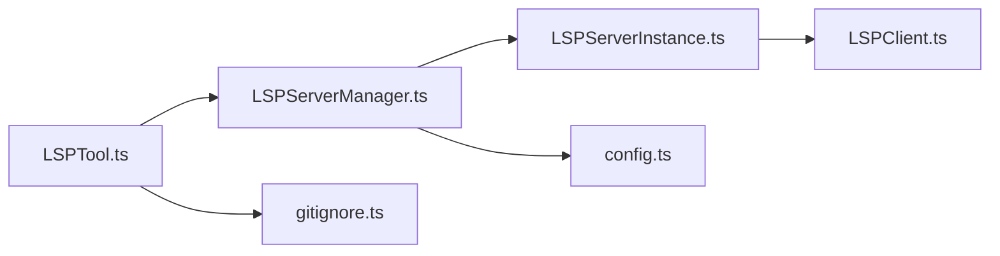

# 性能优化与资源管理

<cite>
**本文引用的文件**
- [LSPTool.ts](file://src/tools/LSPTool/LSPTool.ts)
- [LSPServerManager.ts](file://src/services/lsp/LSPServerManager.ts)
- [LSPServerInstance.ts](file://src/services/lsp/LSPServerInstance.ts)
- [LSPClient.ts](file://src/services/lsp/LSPClient.ts)
- [config.ts](file://src/services/lsp/config.ts)
- [gitignore.ts](file://src/utils/git/gitignore.ts)
</cite>

## 目录
1. [简介](#简介)
2. [项目结构](#项目结构)
3. [核心组件](#核心组件)
4. [架构总览](#架构总览)
5. [详细组件分析](#详细组件分析)
6. [依赖关系分析](#依赖关系分析)
7. [性能考量](#性能考量)
8. [故障排查指南](#故障排查指南)
9. [结论](#结论)
10. [附录](#附录)

## 简介
本文件聚焦于 LSPTool 的性能优化与资源管理，围绕以下主题展开：
- 文件打开与关闭的优化策略：避免重复 I/O、按需打开、及时关闭
- LSP 服务器连接管理：进程生命周期、健康状态、超时与重试
- 批量 git check-ignore 检查：批处理与缓存策略，降低外部命令开销
- 内存使用优化：对象复用、延迟加载、错误处理与资源释放
- 文件大小限制检查时机：在打开前进行快速判定，避免无谓读取
- 不必要 I/O 操作规避：基于已打开文件映射减少重复读取
- LSP 初始化等待机制与并发请求处理：初始化状态机与并发安全
- 性能监控指标、资源清理策略与故障恢复机制
- 调优建议、监控方法与问题诊断技巧

## 项目结构
LSPTool 位于工具层，通过 LSPServerManager 统一调度多个 LSPServerInstance，后者封装 LSPClient 与进程通信细节；gitignore 工具提供批量忽略路径检测能力。

**图表来源**
- [LSPTool.ts:224-414](file://src/tools/LSPTool/LSPTool.ts#L224-L414)
- [LSPServerManager.ts:59-420](file://src/services/lsp/LSPServerManager.ts#L59-L420)
- [LSPServerInstance.ts:90-493](file://src/services/lsp/LSPServerInstance.ts#L90-L493)
- [LSPClient.ts:51-447](file://src/services/lsp/LSPClient.ts#L51-L447)
- [config.ts:15-79](file://src/services/lsp/config.ts#L15-L79)
- [gitignore.ts:23-37](file://src/utils/git/gitignore.ts#L23-L37)

**章节来源**
- [LSPTool.ts:1-862](file://src/tools/LSPTool/LSPTool.ts#L1-L862)
- [LSPServerManager.ts:1-422](file://src/services/lsp/LSPServerManager.ts#L1-L422)
- [LSPServerInstance.ts:1-513](file://src/services/lsp/LSPServerInstance.ts#L1-L513)
- [LSPClient.ts:1-449](file://src/services/lsp/LSPClient.ts#L1-L449)
- [config.ts:1-81](file://src/services/lsp/config.ts#L1-L81)
- [gitignore.ts:1-45](file://src/utils/git/gitignore.ts#L1-L45)

## 核心组件
- LSPTool：面向用户的 LSP 智能体工具，负责输入校验、文件打开策略、请求分发、结果格式化与过滤（含 gitignore）
- LSPServerManager：多服务器管理器，负责根据文件扩展名选择服务器、确保服务器启动、文件同步（open/change/save/close）、查询可用性
- LSPServerInstance：单个 LSP 服务器实例，封装进程生命周期、健康检查、请求重试（针对“内容被修改”等瞬态错误）、通知与反向请求处理
- LSPClient：基于 JSON-RPC 的客户端，负责子进程启动、stdio 流、连接生命周期、协议跟踪与错误处理
- config：从插件加载 LSP 服务器配置，支持并行加载与合并
- gitignore：提供批量 git check-ignore 能力，用于过滤位置结果中的忽略路径

**章节来源**
- [LSPTool.ts:127-422](file://src/tools/LSPTool/LSPTool.ts#L127-L422)
- [LSPServerManager.ts:16-43](file://src/services/lsp/LSPServerManager.ts#L16-L43)
- [LSPServerInstance.ts:33-65](file://src/services/lsp/LSPServerInstance.ts#L33-L65)
- [LSPClient.ts:21-41](file://src/services/lsp/LSPClient.ts#L21-L41)
- [config.ts:15-79](file://src/services/lsp/config.ts#L15-L79)
- [gitignore.ts:23-37](file://src/utils/git/gitignore.ts#L23-L37)

## 架构总览
LSPTool 在调用时先等待初始化完成，再根据文件类型选择合适的 LSP 服务器。若目标文件未在服务器中打开，则按需读取并发送 didOpen 同步，随后发起请求。对于调用层级（如 incomingCalls/outgoingCalls），会先请求 prepareCallHierarchy 获取项后再请求具体调用。结果返回后，对位置类结果执行 gitignore 过滤，最后格式化输出。

**图表来源**
- [LSPTool.ts:224-414](file://src/tools/LSPTool/LSPTool.ts#L224-L414)
- [LSPServerManager.ts:244-263](file://src/services/lsp/LSPServerManager.ts#L244-L263)
- [LSPServerInstance.ts:355-410](file://src/services/lsp/LSPServerInstance.ts#L355-L410)
- [LSPClient.ts:289-314](file://src/services/lsp/LSPClient.ts#L289-L314)
- [gitignore.ts:23-37](file://src/utils/git/gitignore.ts#L23-L37)

## 详细组件分析

### 文件打开与关闭优化策略
- 按需打开：仅当文件未在目标服务器打开时才读取并发送 didOpen，避免重复 I/O
- 大小限制：在打开前读取 stat 并与阈值比较，超过限制直接返回提示，不进行文件读取
- 及时关闭：closeFile 发送 didClose 并从追踪表移除，便于后续重新打开
- 文件变更：changeFile 会在未打开时回退到 openFile，保证 LSP 顺序一致性

**图表来源**
- [LSPServerManager.ts:270-310](file://src/services/lsp/LSPServerManager.ts#L270-L310)

**章节来源**
- [LSPTool.ts:261-278](file://src/tools/LSPTool/LSPTool.ts#L261-L278)
- [LSPServerManager.ts:270-310](file://src/services/lsp/LSPServerManager.ts#L270-L310)
- [LSPServerManager.ts:377-400](file://src/services/lsp/LSPServerManager.ts#L377-L400)

### LSP 服务器连接管理
- 生命周期：stopped → starting → running → stopping → stopped；错误态可触发重启
- 健康检查：运行且已初始化才允许发送请求
- 初始化参数：兼容新旧字段，声明客户端能力，避免不必要能力协商
- 超时控制：可配置启动超时，超时则清理并标记错误
- 请求重试：对“内容被修改”瞬态错误进行指数退避重试，最多固定次数
- 通知与反向请求：支持注册服务器侧通知与请求处理器，提升交互灵活性

**图表来源**
- [LSPServerInstance.ts:74-89](file://src/services/lsp/LSPServerInstance.ts#L74-L89)
- [LSPServerInstance.ts:135-264](file://src/services/lsp/LSPServerInstance.ts#L135-L264)
- [LSPServerInstance.ts:355-410](file://src/services/lsp/LSPServerInstance.ts#L355-L410)

**章节来源**
- [LSPServerInstance.ts:33-65](file://src/services/lsp/LSPServerInstance.ts#L33-L65)
- [LSPServerInstance.ts:135-264](file://src/services/lsp/LSPServerInstance.ts#L135-L264)
- [LSPServerInstance.ts:355-410](file://src/services/lsp/LSPServerInstance.ts#L355-L410)
- [LSPClient.ts:51-447](file://src/services/lsp/LSPClient.ts#L51-L447)

### 批量 git check-ignore 实现与内存优化
- 批处理策略：以固定批次大小遍历唯一路径，减少外部进程调用次数
- 退出码语义：0 表示至少一个被忽略，1 表示全部未忽略，128 表示非仓库
- 内存优化：使用 Map 去重 URI→路径，Set 存储忽略路径，过滤时 O(1) 查找
- 超时控制：为每次外部命令设置超时，避免阻塞

**图表来源**
- [LSPTool.ts:556-611](file://src/tools/LSPTool/LSPTool.ts#L556-L611)
- [gitignore.ts:23-37](file://src/utils/git/gitignore.ts#L23-L37)

**章节来源**
- [LSPTool.ts:556-611](file://src/tools/LSPTool/LSPTool.ts#L556-L611)
- [gitignore.ts:23-37](file://src/utils/git/gitignore.ts#L23-L37)

### 文件大小限制检查时机
- 时机：在 openFile 之前读取文件 stat，若超过阈值（默认 10MB）直接返回提示
- 目的：避免对大文件进行昂贵的文本读取与 LSP 同步，降低资源占用

**章节来源**
- [LSPTool.ts:53-53](file://src/tools/LSPTool/LSPTool.ts#L53-L53)
- [LSPTool.ts:264-272](file://src/tools/LSPTool/LSPTool.ts#L264-L272)

### 不必要 I/O 操作避免
- 已打开文件映射：通过 openedFiles 记录 URI→服务器映射，避免重复 didOpen
- 未打开即开：changeFile 若未打开则回退 openFile，确保 LSP 顺序要求
- 结果过滤：对位置类结果统一做 gitignore 过滤，减少无效展示与后续处理

**章节来源**
- [LSPServerManager.ts:64-64](file://src/services/lsp/LSPServerManager.ts#L64-L64)
- [LSPServerManager.ts:312-343](file://src/services/lsp/LSPServerManager.ts#L312-L343)
- [LSPTool.ts:336-374](file://src/tools/LSPTool/LSPTool.ts#L336-L374)

### LSP 初始化等待机制与并发请求处理
- 初始化等待：调用前等待初始化状态完成，避免“无可用服务器”的误判
- 并发安全：工具声明 isConcurrencySafe，允许多请求并发；但 LSP 层仍受服务器健康状态与请求重试约束
- 错误传播：任何阶段失败都会记录日志并返回用户可读错误

**章节来源**
- [LSPTool.ts:228-233](file://src/tools/LSPTool/LSPTool.ts#L228-L233)
- [LSPTool.ts:146-148](file://src/tools/LSPTool/LSPTool.ts#L146-L148)
- [LSPServerInstance.ts:355-410](file://src/services/lsp/LSPServerInstance.ts#L355-L410)

## 依赖关系分析
- LSPTool 依赖 LSPServerManager 提供的 open/sendRequest 能力，并在必要时调用 gitignore 工具
- LSPServerManager 依赖 LSPServerInstance 管理单实例生命周期与请求转发
- LSPServerInstance 依赖 LSPClient 进行 JSON-RPC 通信
- 配置由 config 加载插件提供的 LSP 服务器清单，支持并行加载

**图表来源**
- [LSPTool.ts:1-862](file://src/tools/LSPTool/LSPTool.ts#L1-L862)
- [LSPServerManager.ts:1-422](file://src/services/lsp/LSPServerManager.ts#L1-L422)
- [LSPServerInstance.ts:1-513](file://src/services/lsp/LSPServerInstance.ts#L1-L513)
- [LSPClient.ts:1-449](file://src/services/lsp/LSPClient.ts#L1-L449)
- [config.ts:1-81](file://src/services/lsp/config.ts#L1-L81)
- [gitignore.ts:1-45](file://src/utils/git/gitignore.ts#L1-L45)

**章节来源**
- [LSPTool.ts:1-862](file://src/tools/LSPTool/LSPTool.ts#L1-L862)
- [LSPServerManager.ts:1-422](file://src/services/lsp/LSPServerManager.ts#L1-L422)
- [LSPServerInstance.ts:1-513](file://src/services/lsp/LSPServerInstance.ts#L1-L513)
- [LSPClient.ts:1-449](file://src/services/lsp/LSPClient.ts#L1-L449)
- [config.ts:1-81](file://src/services/lsp/config.ts#L1-L81)
- [gitignore.ts:1-45](file://src/utils/git/gitignore.ts#L1-L45)

## 性能考量
- I/O 与网络
  - 小文件优先：通过文件大小阈值快速拒绝大文件，避免昂贵的读取与同步
  - 批量外部命令：git check-ignore 采用固定批次大小，降低进程启动成本
  - 延迟加载：LSPClient 按需引入，减少静态加载体积
- CPU 与内存
  - 去重与哈希：使用 Map/Set 进行 URI→路径与忽略路径的 O(1) 查询
  - 对象复用：openedFiles 映射避免重复 didOpen；结果计数在格式化阶段一次性计算
- 连接与超时
  - 启动超时：防止长时间卡死在初始化阶段
  - 请求重试：对瞬态错误进行指数退避，提高成功率
- 并发与线程
  - 工具层并发安全；LSP 层按服务器隔离，避免跨实例干扰

[本节为通用性能讨论，无需列出具体文件来源]

## 故障排查指南
- 常见症状与定位
  - “无可用服务器”：确认初始化状态已完成，检查配置加载是否成功
  - “内容被修改”错误：属于瞬态错误，系统会自动重试；若频繁出现，可能服务器仍在索引或资源紧张
  - “文件过大”：超过 10MB 限制，建议拆分或排除该文件
  - “git check-ignore 无响应”：检查工作目录是否为 Git 仓库，或外部命令超时
- 日志与监控
  - 使用调试日志查看 LSP 协议与进程事件
  - 关注错误日志中的初始化失败、连接错误、进程退出码
- 清理与恢复
  - 服务器崩溃：状态切换至错误，下次使用时自动尝试重启
  - 资源清理：停止时释放连接与进程监听，避免内存泄漏
- 快速修复
  - 重启服务器实例（手动）
  - 调整启动超时与最大重启次数
  - 减少同时打开的大文件数量

**章节来源**
- [LSPTool.ts:394-413](file://src/tools/LSPTool/LSPTool.ts#L394-L413)
- [LSPServerInstance.ts:142-150](file://src/services/lsp/LSPServerInstance.ts#L142-L150)
- [LSPServerInstance.ts:355-410](file://src/services/lsp/LSPServerInstance.ts#L355-L410)
- [LSPClient.ts:156-167](file://src/services/lsp/LSPClient.ts#L156-L167)
- [LSPServerManager.ts:157-185](file://src/services/lsp/LSPServerManager.ts#L157-L185)

## 结论
LSPTool 在性能与资源管理方面采取了多项务实策略：按需打开、大小限制、批量外部命令、指数退避重试与健康状态检查，有效降低了 I/O 与 CPU 开销，提升了稳定性与用户体验。通过清晰的初始化等待与并发安全设计，系统在高负载场景下仍能保持可控的资源占用与响应时间。

[本节为总结性内容，无需列出具体文件来源]

## 附录

### 性能监控指标建议
- LSP 服务器
  - 启动耗时（毫秒）
  - 初始化耗时（毫秒）
  - 请求耗时（P50/P95/P99）
  - 重试次数与成功率
  - 崩溃次数与恢复次数
- 文件与 I/O
  - 打开文件数量（按服务器维度）
  - 大于阈值的请求比例
  - git check-ignore 调用次数与平均耗时
- 并发与队列
  - 并发请求数
  - 队列等待时间（如有）

[本节为通用建议，无需列出具体文件来源]

### 调优建议
- 合理设置启动超时与最大重启次数，平衡可用性与资源消耗
- 控制同时打开的文件数量，避免服务器索引压力
- 对频繁调用的操作（如 hover/definition）启用缓存策略（如结果缓存）
- 在 CI 或大型仓库中，优先排除大文件与二进制文件，减少 LSP 负担

[本节为通用建议，无需列出具体文件来源]