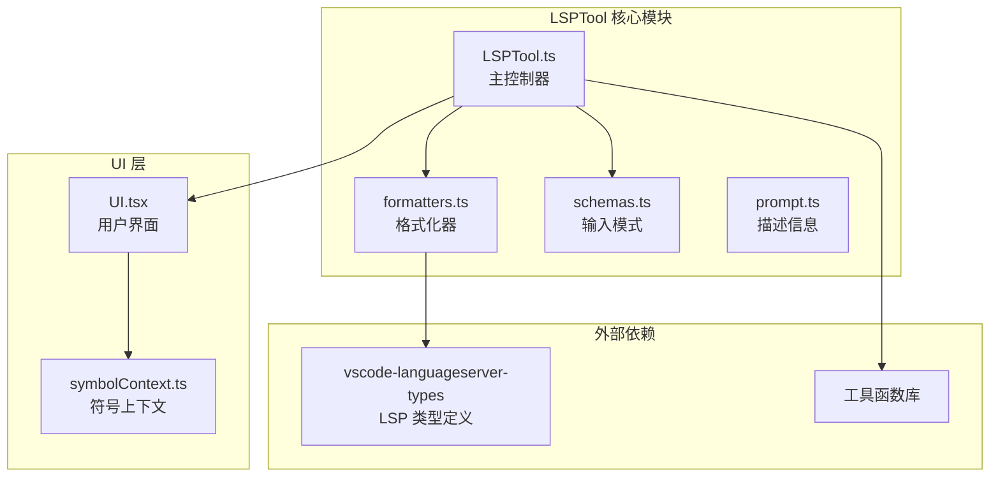
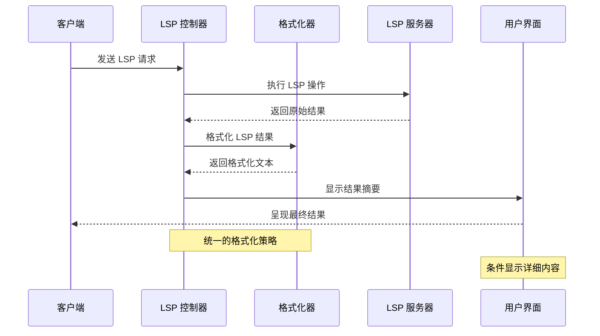
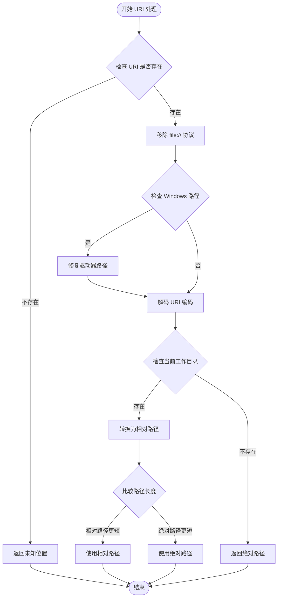
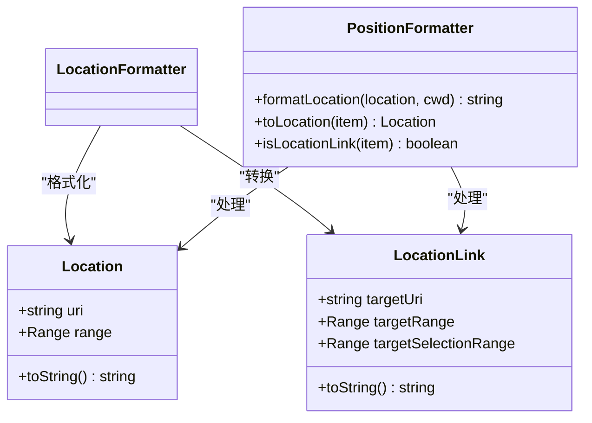
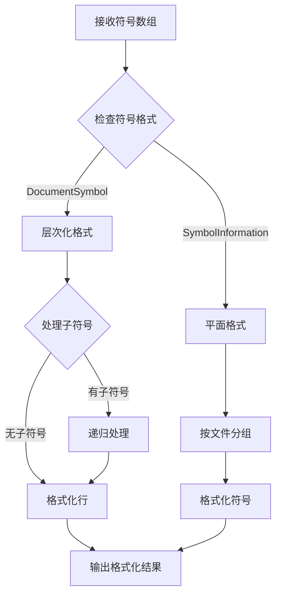
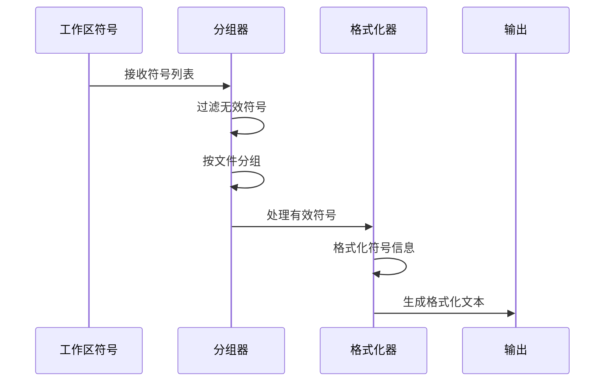
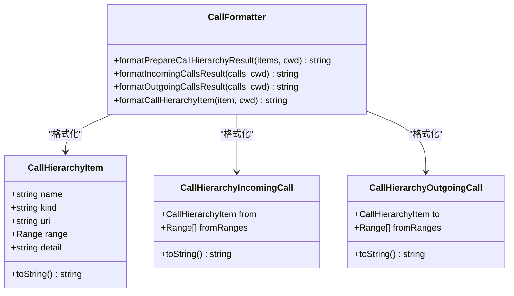
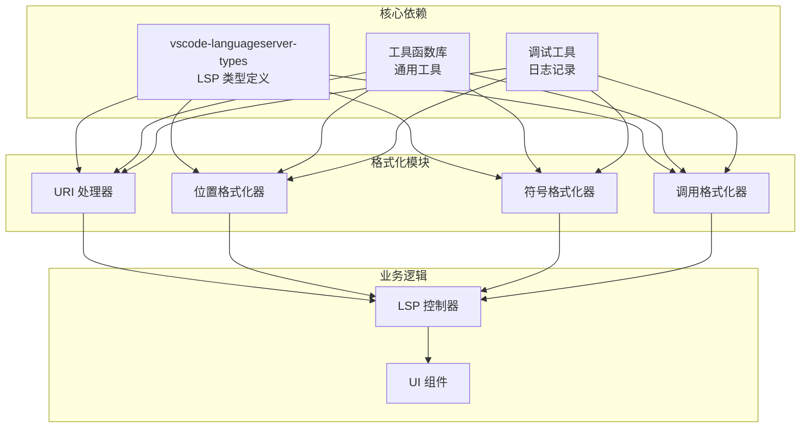

# 结果格式化处理

<cite>
**本文档引用的文件**
- [LSPTool.ts](file://src/tools/LSPTool/LSPTool.ts)
- [formatters.ts](file://src/tools/LSPTool/formatters.ts)
- [schemas.ts](file://src/tools/LSPTool/schemas.ts)
- [prompt.ts](file://src/tools/LSPTool/prompt.ts)
- [UI.tsx](file://src/tools/LSPTool/UI.tsx)
- [symbolContext.ts](file://src/tools/LSPTool/symbolContext.ts)
</cite>

## 目录
1. [简介](#简介)
2. [项目结构](#项目结构)
3. [核心组件](#核心组件)
4. [架构概览](#架构概览)
5. [详细组件分析](#详细组件分析)
6. [依赖关系分析](#依赖关系分析)
7. [性能考虑](#性能考虑)
8. [故障排除指南](#故障排除指南)
9. [结论](#结论)

## 简介

LSPTool 是 Claude Code 中的一个关键工具，专门用于与语言服务器协议（LSP）进行交互，提供代码智能功能。本文档深入分析了 LSPTool 的结果格式化处理机制，涵盖了各种 LSP 操作结果的格式化策略，包括 goToDefinition、findReferences、hover、documentSymbol、workspaceSymbol、goToImplementation、prepareCallHierarchy 等操作。

该系统的核心目标是将来自 LSP 服务器的各种复杂数据结构转换为用户友好的文本格式，同时保持信息的完整性和准确性。通过统一的格式化策略，确保不同类型的 LSP 结果能够以一致的方式呈现给用户。

## 项目结构

LSPTool 的结果格式化处理主要分布在以下文件中：

**图表来源**
- [LSPTool.ts:1-50](file://src/tools/LSPTool/LSPTool.ts#L1-L50)
- [formatters.ts:1-20](file://src/tools/LSPTool/formatters.ts#L1-L20)
- [UI.tsx:1-20](file://src/tools/LSPTool/UI.tsx#L1-L20)

**章节来源**
- [LSPTool.ts:1-100](file://src/tools/LSPTool/LSPTool.ts#L1-L100)
- [formatters.ts:1-50](file://src/tools/LSPTool/formatters.ts#L1-L50)
- [schemas.ts:1-50](file://src/tools/LSPTool/schemas.ts#L1-L50)

## 核心组件

### 主控制器 (LSPTool.ts)

主控制器负责协调整个 LSP 操作流程，包括请求发送、结果处理和格式化。其核心职责包括：

1. **操作路由**: 将不同的 LSP 操作映射到相应的 LSP 方法
2. **结果格式化**: 调用格式化器将原始 LSP 结果转换为用户友好的文本
3. **错误处理**: 处理 LSP 服务器不可用、文件过大等异常情况
4. **计数统计**: 计算结果数量和涉及的文件数量

### 格式化器 (formatters.ts)

格式化器模块提供了针对不同类型 LSP 结果的专业化格式化函数：

1. **URI 处理**: 统一处理文件路径和位置信息
2. **位置格式化**: 将 LSP 位置信息转换为人类可读的格式
3. **结果分组**: 按文件对结果进行分组和排序
4. **类型转换**: 处理 Location 和 LocationLink 等不同位置表示形式

### 输入模式 (schemas.ts)

输入模式定义了 LSPTool 支持的所有操作类型及其参数要求：

1. **操作枚举**: 定义所有支持的 LSP 操作
2. **参数验证**: 确保输入参数符合预期格式
3. **类型安全**: 提供完整的 TypeScript 类型定义

**章节来源**
- [LSPTool.ts:120-250](file://src/tools/LSPTool/LSPTool.ts#L120-L250)
- [formatters.ts:120-200](file://src/tools/LSPTool/formatters.ts#L120-L200)
- [schemas.ts:8-50](file://src/tools/LSPTool/schemas.ts#L8-L50)

## 架构概览

LSPTool 的结果格式化架构采用分层设计，确保了高度的模块化和可维护性：

**图表来源**
- [LSPTool.ts:224-422](file://src/tools/LSPTool/LSPTool.ts#L224-L422)
- [formatters.ts:127-169](file://src/tools/LSPTool/formatters.ts#L127-L169)

### 统一处理策略

系统采用统一的处理策略来处理不同类型的 LSP 结果：

1. **类型检测**: 自动识别 LSP 结果的数据类型
2. **格式转换**: 将复杂的数据结构转换为简单文本
3. **错误恢复**: 处理不完整或损坏的数据
4. **性能优化**: 避免不必要的计算和内存分配

**章节来源**
- [LSPTool.ts:636-829](file://src/tools/LSPTool/LSPTool.ts#L636-L829)
- [formatters.ts:78-94](file://src/tools/LSPTool/formatters.ts#L78-L94)

## 详细组件分析

### URI 处理机制

URI 处理是 LSPTool 格式化系统的基础，负责将 LSP 服务器返回的文件路径转换为用户友好的格式：

**图表来源**
- [formatters.ts:24-72](file://src/tools/LSPTool/formatters.ts#L24-L72)

URI 处理的关键特性包括：
- **错误处理**: 对于无效或缺失的 URI，系统会记录警告并返回占位符
- **平台兼容**: 正确处理 Windows 驱动器路径格式
- **编码处理**: 解码百分号编码的文件名
- **路径优化**: 优先使用较短的相对路径

**章节来源**
- [formatters.ts:24-72](file://src/tools/LSPTool/formatters.ts#L24-L72)

### 位置格式化系统

位置格式化系统负责将 LSP 的位置信息转换为人类可读的格式：

**图表来源**
- [formatters.ts:99-121](file://src/tools/LSPTool/formatters.ts#L99-L121)
- [LSPTool.ts:623-631](file://src/tools/LSPTool/LSPTool.ts#L623-L631)

位置格式化的主要功能：
- **坐标转换**: 将 0 基位置转换为 1 基显示格式
- **格式标准化**: 统一输出格式为 "文件:行:列"
- **类型兼容**: 处理 Location 和 LocationLink 两种位置表示

**章节来源**
- [formatters.ts:99-121](file://src/tools/LSPTool/formatters.ts#L99-L121)
- [LSPTool.ts:623-631](file://src/tools/LSPTool/LSPTool.ts#L623-L631)

### 文档符号格式化

文档符号格式化处理 `textDocument/documentSymbol` 操作的结果，支持两种不同的 LSP 格式：

**图表来源**
- [formatters.ts:340-366](file://src/tools/LSPTool/formatters.ts#L340-L366)

文档符号格式化的特殊处理：
- **格式检测**: 自动识别 DocumentSymbol 和 SymbolInformation 格式
- **层次处理**: 递归处理嵌套的文档符号
- **文件分组**: 将符号按文件组织以便阅读

**章节来源**
- [formatters.ts:340-366](file://src/tools/LSPTool/formatters.ts#L340-L366)

### 工作区符号格式化

工作区符号格式化处理 `workspace/symbol` 操作的结果，提供全局符号搜索功能：

**图表来源**
- [formatters.ts:371-422](file://src/tools/LSPTool/formatters.ts#L371-L422)

工作区符号格式化的特点：
- **批量处理**: 高效处理大量符号结果
- **文件组织**: 按文件分类显示符号
- **元数据提取**: 包含符号类型、容器名称等信息

**章节来源**
- [formatters.ts:371-422](file://src/tools/LSPTool/formatters.ts#L371-L422)

### 调用层次格式化

调用层次格式化处理函数调用关系，支持三种操作：准备、入站调用和出站调用：

**图表来源**
- [formatters.ts:455-592](file://src/tools/LSPTool/formatters.ts#L455-L592)

调用层次格式化的功能：
- **项目格式化**: 格式化调用层次项目信息
- **关系展示**: 清晰显示函数间的调用关系
- **位置标注**: 标注调用点在源代码中的位置

**章节来源**
- [formatters.ts:455-592](file://src/tools/LSPTool/formatters.ts#L455-L592)

## 依赖关系分析

LSPTool 的结果格式化系统具有清晰的依赖关系，确保了模块间的松耦合：

**图表来源**
- [LSPTool.ts:1-30](file://src/tools/LSPTool/LSPTool.ts#L1-L30)
- [formatters.ts:1-20](file://src/tools/LSPTool/formatters.ts#L1-L20)

### 关键依赖关系

1. **类型安全**: 依赖 vscode-languageserver-types 确保类型正确性
2. **工具复用**: 通用工具函数被多个格式化器共享使用
3. **错误处理**: 调试工具在整个格式化过程中提供错误监控
4. **UI 集成**: 格式化结果直接传递给 UI 组件进行展示

**章节来源**
- [LSPTool.ts:1-50](file://src/tools/LSPTool/LSPTool.ts#L1-L50)
- [formatters.ts:1-20](file://src/tools/LSPTool/formatters.ts#L1-L20)

## 性能考虑

LSPTool 的结果格式化系统在设计时充分考虑了性能优化：

### 内存管理
- **惰性处理**: 只在需要时才进行复杂的格式化操作
- **对象复用**: 在可能的情况下重用已创建的对象
- **批量处理**: 对大量数据进行批处理以提高效率

### 计算优化
- **早期过滤**: 在格式化前先过滤掉无效数据
- **缓存策略**: 对重复计算的结果进行缓存
- **算法选择**: 选择最适合场景的时间复杂度算法

### I/O 优化
- **最小化文件访问**: 只在必要时读取文件内容
- **路径缓存**: 缓存常用的路径转换结果
- **批量操作**: 减少系统调用次数

## 故障排除指南

### 常见问题及解决方案

1. **URI 格式错误**
   - **症状**: 显示 "未知位置" 或路径解析失败
   - **原因**: LSP 服务器返回的 URI 格式不符合预期
   - **解决**: 系统会自动记录警告并使用回退方案

2. **符号信息缺失**
   - **症状**: 格式化结果为空或不完整
   - **原因**: LSP 服务器未提供完整的符号信息
   - **解决**: 系统会过滤掉无效符号并继续处理其他结果

3. **文件权限问题**
   - **症状**: 无法读取某些文件的符号信息
   - **原因**: 文件权限不足或文件被忽略
   - **解决**: 使用 git check-ignore 过滤被忽略的文件

### 调试技巧

1. **启用详细日志**: 查看格式化过程中的调试信息
2. **检查输入数据**: 验证 LSP 服务器返回的数据格式
3. **测试边界条件**: 验证空结果、单个结果等特殊情况

**章节来源**
- [LSPTool.ts:394-413](file://src/tools/LSPTool/LSPTool.ts#L394-L413)
- [formatters.ts:29-33](file://src/tools/LSPTool/formatters.ts#L29-L33)

## 结论

LSPTool 的结果格式化处理系统展现了优秀的软件工程实践，通过模块化设计、统一的处理策略和完善的错误处理机制，成功地将复杂的 LSP 数据转换为用户友好的格式。

该系统的几个关键优势包括：

1. **一致性**: 所有 LSP 操作都遵循相同的格式化原则
2. **健壮性**: 能够优雅地处理各种异常情况和边界条件
3. **可扩展性**: 新增 LSP 操作类型时易于添加对应的格式化器
4. **性能**: 通过多种优化技术确保快速响应

未来可以考虑的改进方向包括：
- 添加更多自定义格式化选项
- 实现更高级的符号高亮功能
- 优化大文件的处理性能
- 增强错误诊断和用户反馈