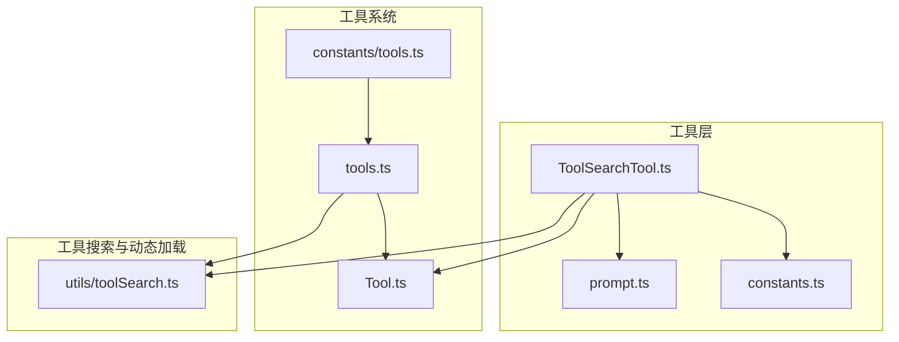
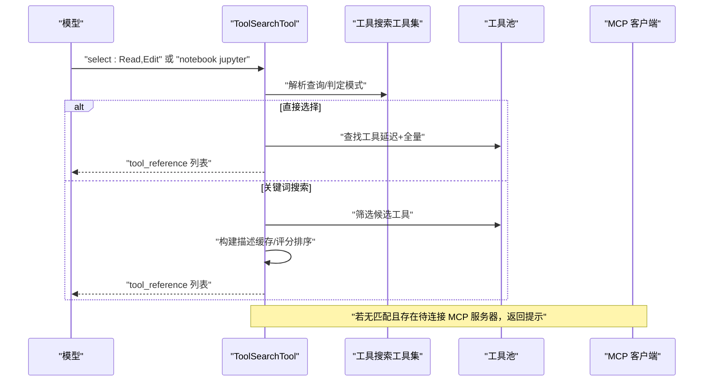
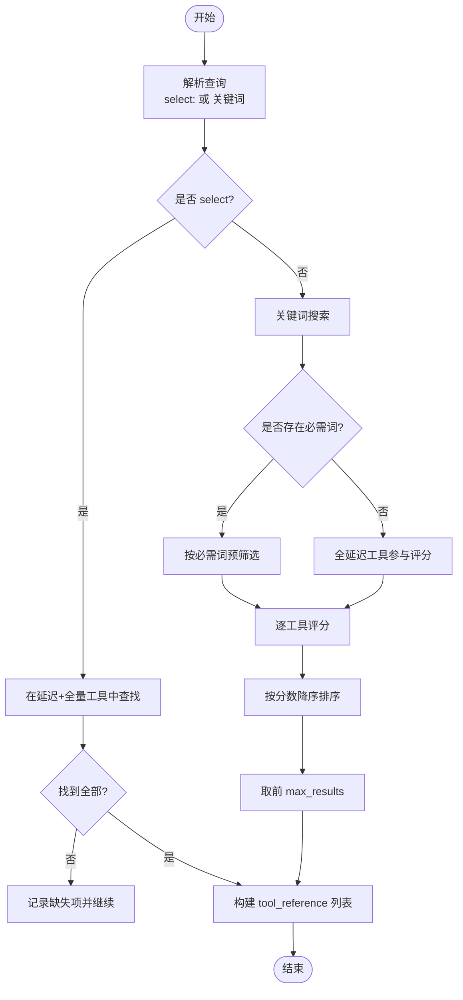
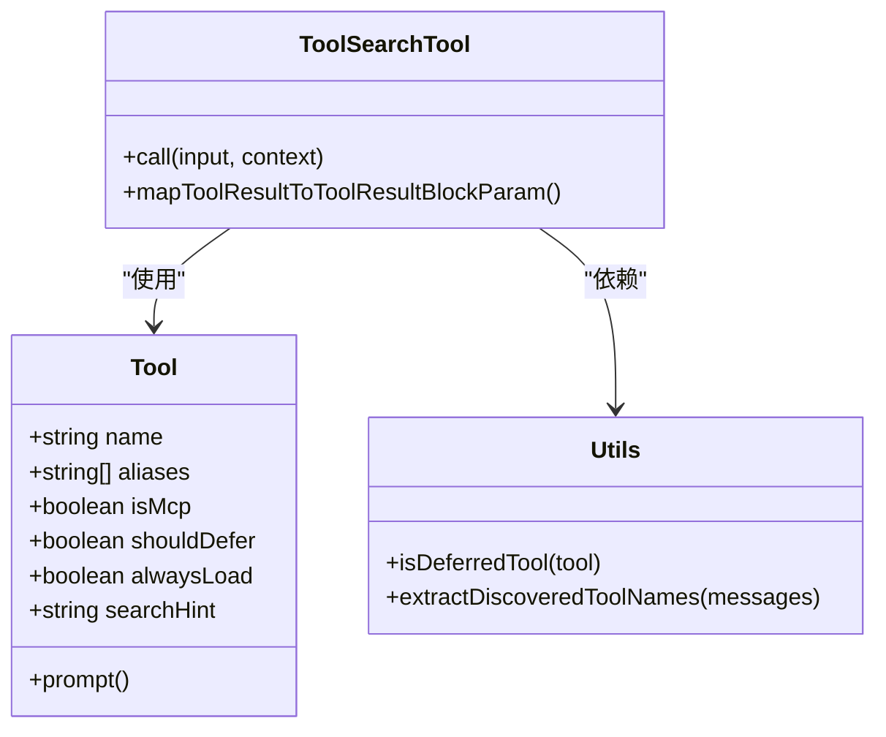
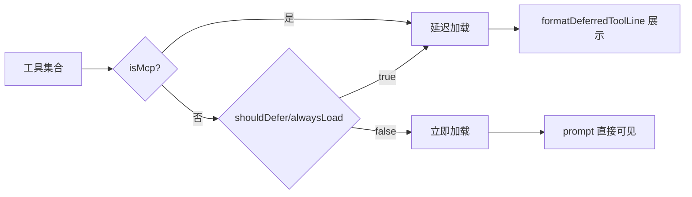
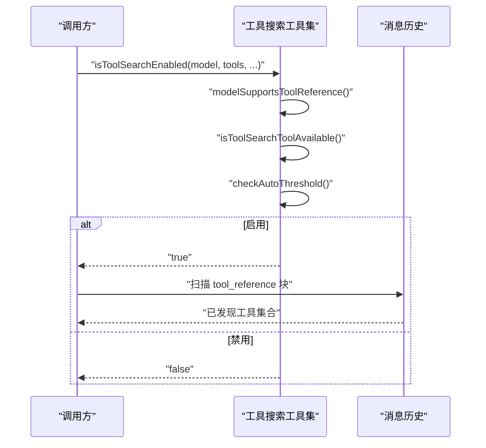
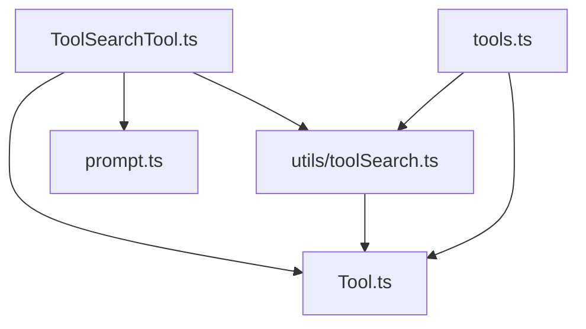

# 工具搜索工具

<cite>
**本文引用的文件**
- [src/tools/ToolSearchTool/ToolSearchTool.ts](file://src/tools/ToolSearchTool/ToolSearchTool.ts)
- [src/tools/ToolSearchTool/prompt.ts](file://src/tools/ToolSearchTool/prompt.ts)
- [src/tools/ToolSearchTool/constants.ts](file://src/tools/ToolSearchTool/constants.ts)
- [src/utils/toolSearch.ts](file://src/utils/toolSearch.ts)
- [src/Tool.ts](file://src/Tool.ts)
- [src/tools.ts](file://src/tools.ts)
- [src/constants/tools.ts](file://src/constants/tools.ts)
</cite>

## 目录
1. [简介](#简介)
2. [项目结构](#项目结构)
3. [核心组件](#核心组件)
4. [架构总览](#架构总览)
5. [详细组件分析](#详细组件分析)
6. [依赖关系分析](#依赖关系分析)
7. [性能考量](#性能考量)
8. [故障排查指南](#故障排查指南)
9. [结论](#结论)
10. [附录](#附录)

## 简介
本文件为 ToolSearchTool 的权威技术文档，面向开发者与高级用户，系统性阐述工具搜索与推荐算法的设计与实现，涵盖工具元数据索引、关键词匹配与评分、排序机制、分类与标签管理、搜索过滤、使用统计与热门度、性能优化（缓存与增量更新）、配置选项与扩展接口，以及最佳实践。

ToolSearchTool 的职责是：在“延迟加载”模式下，根据模型查询动态检索并返回可调用的工具定义；它支持两种查询方式：
- 直接选择：select:工具名[,工具名…]
- 关键词搜索：基于工具名称、描述、提示短语进行匹配与打分

同时，ToolSearchTool 还负责将 MCP 工具池的变化以增量附件形式通知给模型，并在需要时通过 tool_reference 块将工具定义注入到上下文中，从而实现“按需加载”。

## 项目结构
ToolSearchTool 所在模块位于 src/tools/ToolSearchTool，核心文件如下：
- ToolSearchTool.ts：工具实现、输入输出模式、搜索与选择逻辑、结果映射
- prompt.ts：工具提示文本、延迟加载判定、可用工具行格式化
- constants.ts：工具名称常量

此外，相关支撑能力分布在以下文件：
- utils/toolSearch.ts：工具搜索模式、阈值判断、模型兼容性、动态工具加载、增量工具池扫描等
- Tool.ts：工具类型定义、工具元数据字段（如 searchHint、shouldDefer、alwaysLoad、isMcp 等）
- tools.ts：工具装配与合并、权限过滤、是否包含 ToolSearchTool 的乐观判断
- constants/tools.ts：工具白名单/黑名单集合（含 ToolSearch）

**图表来源**
- [src/tools/ToolSearchTool/ToolSearchTool.ts:1-473](file://src/tools/ToolSearchTool/ToolSearchTool.ts#L1-L473)
- [src/tools/ToolSearchTool/prompt.ts:1-123](file://src/tools/ToolSearchTool/prompt.ts#L1-L123)
- [src/tools/ToolSearchTool/constants.ts:1-3](file://src/tools/ToolSearchTool/constants.ts#L1-L3)
- [src/utils/toolSearch.ts:1-758](file://src/utils/toolSearch.ts#L1-L758)
- [src/Tool.ts:362-795](file://src/Tool.ts#L362-L795)
- [src/tools.ts:190-391](file://src/tools.ts#L190-L391)
- [src/constants/tools.ts:25-71](file://src/constants/tools.ts#L25-L71)

**章节来源**
- [src/tools/ToolSearchTool/ToolSearchTool.ts:1-473](file://src/tools/ToolSearchTool/ToolSearchTool.ts#L1-L473)
- [src/tools/ToolSearchTool/prompt.ts:1-123](file://src/tools/ToolSearchTool/prompt.ts#L1-L123)
- [src/tools/ToolSearchTool/constants.ts:1-3](file://src/tools/ToolSearchTool/constants.ts#L1-L3)
- [src/utils/toolSearch.ts:1-758](file://src/utils/toolSearch.ts#L1-L758)
- [src/Tool.ts:362-795](file://src/Tool.ts#L362-L795)
- [src/tools.ts:190-391](file://src/tools.ts#L190-L391)
- [src/constants/tools.ts:25-71](file://src/constants/tools.ts#L25-L71)

## 核心组件
- 工具定义与元数据
  - Tool 接口定义了工具的核心属性：名称、别名、是否并发安全、是否只读、是否破坏性、是否 MCP、是否延迟加载、搜索提示、输入/输出模式、权限检查、渲染与结果映射等。
  - ToolSearchTool 使用工具的 prompt 文本作为关键词匹配的描述源，并利用 searchHint 提升匹配信号。

- ToolSearchTool 实现
  - 输入模式：query（查询字符串）、max_results（最大返回数量）
  - 输出模式：matches（匹配到的工具名数组）、query、total_deferred_tools、pending_mcp_servers（可选）
  - 支持两种查询：
    - select: 直接选择工具名（逗号分隔），若工具不在延迟集合但已加载，则视为“无操作”
    - 关键词搜索：解析查询词，区分必需词与可选词，预筛选+评分排序
  - 结果映射：当 matches 非空时，返回 tool_reference 块；否则返回人类可读文本或包含待连接 MCP 服务器列表的提示

- 延迟加载与动态工具加载
  - isDeferredTool 判定：MCP 工具总是延迟；也可由 shouldDefer 或 alwaysLoad 控制
  - 动态工具加载：从消息历史中提取 tool_reference 块，恢复已发现的工具集合
  - 模型兼容性：仅在支持 tool_reference 的模型上启用；可通过特征开关与环境变量控制

**章节来源**
- [src/Tool.ts:362-795](file://src/Tool.ts#L362-L795)
- [src/tools/ToolSearchTool/ToolSearchTool.ts:21-473](file://src/tools/ToolSearchTool/ToolSearchTool.ts#L21-L473)
- [src/tools/ToolSearchTool/prompt.ts:52-123](file://src/tools/ToolSearchTool/prompt.ts#L52-L123)
- [src/utils/toolSearch.ts:154-473](file://src/utils/toolSearch.ts#L154-L473)

## 架构总览
ToolSearchTool 在整体系统中的位置与交互如下：

**图表来源**
- [src/tools/ToolSearchTool/ToolSearchTool.ts:328-434](file://src/tools/ToolSearchTool/ToolSearchTool.ts#L328-L434)
- [src/utils/toolSearch.ts:385-473](file://src/utils/toolSearch.ts#L385-L473)

**章节来源**
- [src/tools/ToolSearchTool/ToolSearchTool.ts:304-471](file://src/tools/ToolSearchTool/ToolSearchTool.ts#L304-L471)
- [src/utils/toolSearch.ts:385-473](file://src/utils/toolSearch.ts#L385-L473)

## 详细组件分析

### 组件一：工具搜索与选择流程
- 查询解析
  - select: 前缀直接解析为工具名列表；支持逗号分隔多选
  - 关键词搜索：拆分为必需词（+前缀）与可选词；若存在必需词则先做“必须包含”的预筛选
- 名称解析与分词
  - MCP 工具名（mcp__server__action）：去除前缀后按双下划线与单下划线拆分，转小写，便于边界匹配
  - 普通工具名（驼峰/下划线）：按大小写边界与下划线拆分，统一小写
- 描述缓存与增量失效
  - 以工具名为键缓存工具 prompt 文本，避免重复生成
  - 当延迟工具集合变化时清空缓存，确保描述一致性
- 评分与排序
  - 必须词命中优先级最高
  - 名称精确匹配权重高于部分匹配
  - searchHint 命中权重高于描述命中
  - 名称全名包含命中作为兜底
  - 最终按分数降序取前 max_results
- 结果映射
  - matches 非空：返回 tool_reference 块
  - 无匹配：返回人类可读文本；若存在待连接 MCP 服务器，附加提示信息

**图表来源**
- [src/tools/ToolSearchTool/ToolSearchTool.ts:186-302](file://src/tools/ToolSearchTool/ToolSearchTool.ts#L186-L302)

**章节来源**
- [src/tools/ToolSearchTool/ToolSearchTool.ts:186-434](file://src/tools/ToolSearchTool/ToolSearchTool.ts#L186-L434)

### 组件二：工具元数据索引与相似度计算
- 元数据来源
  - 工具名称与别名：用于名称匹配
  - prompt 文本：作为关键词匹配的描述源
  - searchHint：工具搜索提示短语，提升相关性
  - isMcp：MCP 工具具有更高权重
- 分词与正则
  - 将查询词预编译为单词边界正则，避免子串误匹配
  - 对名称与描述均执行单词边界匹配
- 评分权重
  - 名称精确匹配（MCP: 12，普通: 10）
  - 名称部分匹配（MCP: 6，普通: 5）
  - 名称全包含兜底（+3）
  - searchHint 命中（+4）
  - 描述命中（+2）

**图表来源**
- [src/Tool.ts:362-795](file://src/Tool.ts#L362-L795)
- [src/tools/ToolSearchTool/ToolSearchTool.ts:304-471](file://src/tools/ToolSearchTool/ToolSearchTool.ts#L304-L471)
- [src/utils/toolSearch.ts:62-108](file://src/utils/toolSearch.ts#L62-L108)

**章节来源**
- [src/Tool.ts:362-795](file://src/Tool.ts#L362-L795)
- [src/tools/ToolSearchTool/ToolSearchTool.ts:66-105](file://src/tools/ToolSearchTool/ToolSearchTool.ts#L66-L105)
- [src/utils/toolSearch.ts:62-108](file://src/utils/toolSearch.ts#L62-L108)

### 组件三：工具分类系统与标签管理
- 分类依据
  - isMcp：MCP 工具默认延迟
  - shouldDefer/alwaysLoad：显式控制延迟策略
  - 特征开关与 REPL 状态：某些工具在特定场景下强制不延迟
- 标签与提示
  - searchHint：用于关键词搜索的高置信度短语
  - formatDeferredToolLine：在系统提醒中展示可用工具名
- 增量工具池
  - deferred_tools_delta：扫描消息附件，计算新增/移除工具集合，仅对变化部分进行提示

**图表来源**
- [src/tools/ToolSearchTool/prompt.ts:62-117](file://src/tools/ToolSearchTool/prompt.ts#L62-L117)
- [src/utils/toolSearch.ts:646-706](file://src/utils/toolSearch.ts#L646-L706)

**章节来源**
- [src/tools/ToolSearchTool/prompt.ts:62-117](file://src/tools/ToolSearchTool/prompt.ts#L62-L117)
- [src/utils/toolSearch.ts:646-706](file://src/utils/toolSearch.ts#L646-L706)

### 组件四：搜索过滤与动态加载
- 过滤条件
  - 模型兼容性：仅在支持 tool_reference 的模型上启用
  - ToolSearchTool 可用性：必须在工具列表中（尊重禁用规则）
  - 自动阈值：当延迟工具描述超过上下文百分比阈值时启用
- 动态加载
  - 从消息历史中提取 tool_reference 块，恢复已发现工具集合
  - 在压缩/边界消息中携带 preCompactDiscoveredTools，保证跨回合一致性

**图表来源**
- [src/utils/toolSearch.ts:385-592](file://src/utils/toolSearch.ts#L385-L592)

**章节来源**
- [src/utils/toolSearch.ts:200-473](file://src/utils/toolSearch.ts#L200-L473)
- [src/utils/toolSearch.ts:545-592](file://src/utils/toolSearch.ts#L545-L592)

### 组件五：使用统计与热门度
- 统计维度
  - 搜索结果事件：记录查询类型、匹配数量、总延迟工具数、最大返回数、是否有匹配
  - 工具池变化事件：记录新增/移除工具数量、先前公告数量、消息长度、附件统计
- 热门度
  - 代码未实现独立的“使用次数”统计与热门度排序；当前主要依赖关键词匹配与 searchHint 提升相关性

**章节来源**
- [src/tools/ToolSearchTool/ToolSearchTool.ts:342-356](file://src/tools/ToolSearchTool/ToolSearchTool.ts#L342-L356)
- [src/utils/toolSearch.ts:685-699](file://src/utils/toolSearch.ts#L685-L699)

### 组件六：性能优化策略
- 缓存机制
  - 描述缓存：以工具名为键缓存工具 prompt 文本，避免重复生成
  - 增量失效：当延迟工具集合发生变化时清空缓存
  - 令牌计数缓存：对延迟工具定义总令牌数进行缓存，按工具名集合键失效
- 增量更新
  - deferred_tools_delta：仅对变化的工具集合进行提示
  - 乐观包含 ToolSearchTool：在工具装配阶段即包含，减少运行时决策开销
- 计算优化
  - 预编译查询词正则，避免重复构造
  - 必需词预筛选，缩小评分范围
  - 单次遍历构建候选集，Promise.all 并行评分

**章节来源**
- [src/tools/ToolSearchTool/ToolSearchTool.ts:66-105](file://src/tools/ToolSearchTool/ToolSearchTool.ts#L66-L105)
- [src/utils/toolSearch.ts:124-152](file://src/utils/toolSearch.ts#L124-L152)
- [src/utils/toolSearch.ts:646-706](file://src/utils/toolSearch.ts#L646-L706)
- [src/tools.ts:247-249](file://src/tools.ts#L247-L249)

### 组件七：配置选项、自定义规则与扩展接口
- 环境变量与特征开关
  - ENABLE_TOOL_SEARCH：auto/auto:N（百分比）、true/false、unset（默认）
  - CLAUDE_CODE_DISABLE_EXPERIMENTAL_BETAS：强制标准模式（禁用 beta 形态）
  - GrowthBook 特征：tengu_tool_search_unsupported_models（模型不支持 tool_reference 的模式列表）
  - 用户类型与特性：KAIROS/KAIROS_BRIEF/REPL 等影响工具延迟策略
- 自定义规则
  - alwaysLoad：通过工具元数据 _meta['anthropic/alwaysLoad'] 强制立即加载
  - shouldDefer：工具自身声明延迟
  - searchHint：提升关键词匹配权重
- 扩展接口
  - Tool 接口：可扩展工具行为（权限、渲染、结果映射等）
  - 工具装配：assembleToolPool/getMergedTools 提供统一合并入口
  - 动态工具加载：extractDiscoveredToolNames 从消息中恢复工具集合

**章节来源**
- [src/utils/toolSearch.ts:55-93](file://src/utils/toolSearch.ts#L55-L93)
- [src/utils/toolSearch.ts:172-198](file://src/utils/toolSearch.ts#L172-L198)
- [src/utils/toolSearch.ts:210-252](file://src/utils/toolSearch.ts#L210-L252)
- [src/Tool.ts:440-449](file://src/Tool.ts#L440-L449)
- [src/tools.ts:345-391](file://src/tools.ts#L345-L391)
- [src/utils/toolSearch.ts:545-592](file://src/utils/toolSearch.ts#L545-L592)

## 依赖关系分析
- 内部依赖
  - ToolSearchTool 依赖 Tool 类型与工具装配函数（tools.ts），依赖工具搜索工具集（utils/toolSearch.ts）
  - prompt.ts 负责延迟加载判定与提示文本拼装
- 外部依赖
  - 模型兼容性：通过特征开关与环境变量判断是否支持 tool_reference
  - MCP 客户端状态：检测待连接服务器，辅助搜索失败时的用户体验

**图表来源**
- [src/tools/ToolSearchTool/ToolSearchTool.ts:1-20](file://src/tools/ToolSearchTool/ToolSearchTool.ts#L1-L20)
- [src/utils/toolSearch.ts:1-42](file://src/utils/toolSearch.ts#L1-L42)
- [src/tools.ts:1-100](file://src/tools.ts#L1-L100)

**章节来源**
- [src/tools/ToolSearchTool/ToolSearchTool.ts:1-20](file://src/tools/ToolSearchTool/ToolSearchTool.ts#L1-L20)
- [src/utils/toolSearch.ts:1-42](file://src/utils/toolSearch.ts#L1-L42)
- [src/tools.ts:1-100](file://src/tools.ts#L1-L100)

## 性能考量
- 时间复杂度
  - 关键词搜索：O(C×(T+logT))，其中 C 为查询词数，T 为候选工具数；评分与排序为线性，最终排序为 O(T log T)
  - 必需词预筛选：将评分规模限制在更小的候选集上
- 空间复杂度
  - 描述缓存按工具名存储，空间与延迟工具数量线性相关
  - 令牌计数缓存按工具名集合键缓存，避免重复计算
- I/O 与网络
  - 令牌计数 API：不可用时回退字符估算，降低性能波动
  - tool_reference 注入：仅在模型支持时启用，避免无效往返

[本节为通用指导，无需具体文件分析]

## 故障排查指南
- 搜索无结果
  - 检查模型是否支持 tool_reference；可通过 GrowthBook 配置不受支持的模型模式
  - 若存在待连接 MCP 服务器，ToolSearchTool 会在无匹配时返回提示
- ToolSearchTool 不可用
  - 确认工具列表中包含 ToolSearch；被 disallowedTools 禁止时会自动禁用
- 延迟工具未出现
  - 检查 ENABLE_TOOL_SEARCH 设置与上下文阈值；必要时设置 auto:0 强制启用
  - 确认 isMcp 或 shouldDefer 规则生效
- 性能问题
  - 关注描述缓存是否被频繁清空（延迟工具集合变化）
  - 检查查询词是否过多或包含大量必需词导致预筛选严格

**章节来源**
- [src/utils/toolSearch.ts:210-252](file://src/utils/toolSearch.ts#L210-L252)
- [src/utils/toolSearch.ts:428-435](file://src/utils/toolSearch.ts#L428-L435)
- [src/tools/ToolSearchTool/ToolSearchTool.ts:335-434](file://src/tools/ToolSearchTool/ToolSearchTool.ts#L335-L434)

## 结论
ToolSearchTool 通过“名称+描述+提示短语”的多维匹配与评分体系，在延迟加载与动态工具加载之间取得平衡。其关键优势在于：
- 明确的延迟加载策略与增量提示
- 高效的描述缓存与令牌计数缓存
- 严格的模型兼容性与可配置阈值
- 清晰的扩展点与工具装配接口

建议在生产环境中结合阈值与特征开关，配合 searchHint 与工具命名规范，获得更稳定与高效的工具发现体验。

[本节为总结，无需具体文件分析]

## 附录

### A. 工具搜索工具 API 定义
- 输入
  - query: string（支持 select: 前缀或关键词）
  - max_results: number（默认 5）
- 输出
  - matches: string[]（匹配到的工具名）
  - query: string
  - total_deferred_tools: number
  - pending_mcp_servers: string[]（可选）

**章节来源**
- [src/tools/ToolSearchTool/ToolSearchTool.ts:21-47](file://src/tools/ToolSearchTool/ToolSearchTool.ts#L21-L47)

### B. 工具延迟加载判定规则
- alwaysLoad 为真：不延迟（优先级最高）
- isMcp 为真：延迟
- ToolSearch 自身：不延迟
- 特性开关与 REPL 状态：在特定场景下强制不延迟
- shouldDefer 为真：延迟

**章节来源**
- [src/tools/ToolSearchTool/prompt.ts:62-108](file://src/tools/ToolSearchTool/prompt.ts#L62-L108)

### C. 工具搜索模式与阈值
- 模式
  - tst：始终启用 ToolSearch
  - tst-auto：自动阈值启用
  - standard：禁用 ToolSearch
- 阈值
  - 默认占上下文窗口的 10%
  - 可通过 ENABLE_TOOL_SEARCH=auto:N 调整
  - 令牌计数 API 不可用时回退字符估算

**章节来源**
- [src/utils/toolSearch.ts:172-198](file://src/utils/toolSearch.ts#L172-L198)
- [src/utils/toolSearch.ts:104-117](file://src/utils/toolSearch.ts#L104-L117)
- [src/utils/toolSearch.ts:712-756](file://src/utils/toolSearch.ts#L712-L756)