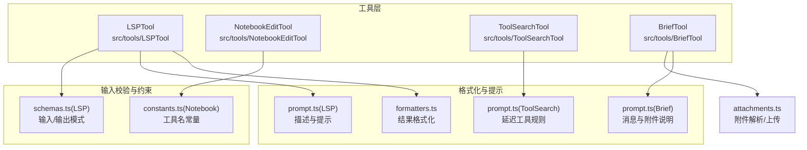
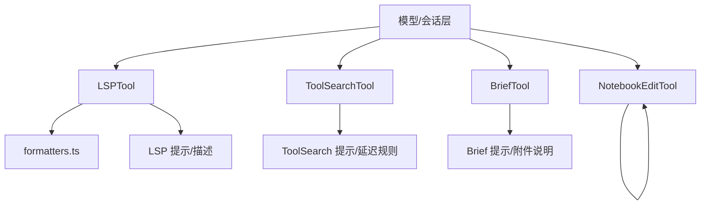
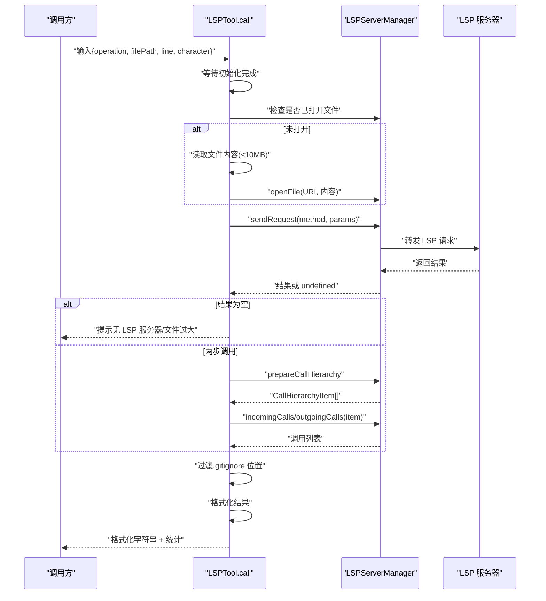
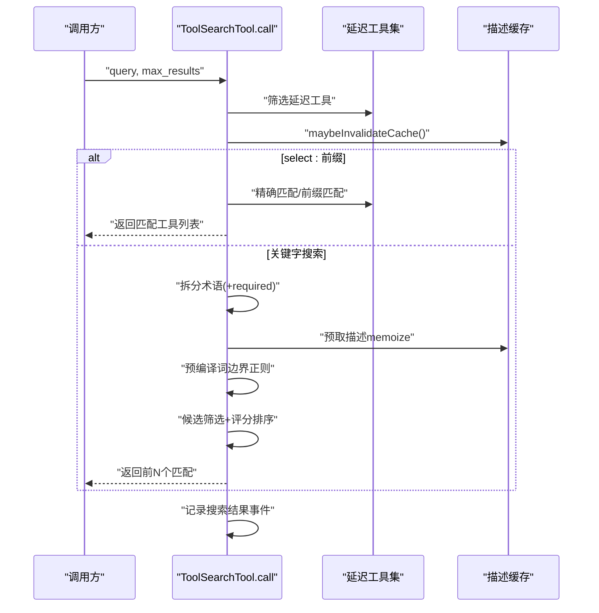
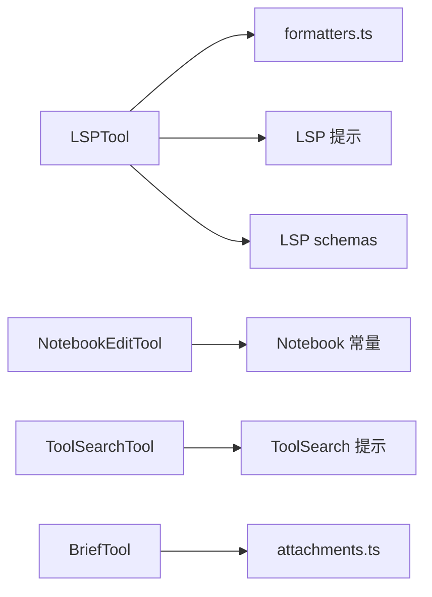

# 开发工具

<cite>
**本文引用的文件**
- [LSPTool.ts](file://src/tools/LSPTool/LSPTool.ts)
- [formatters.ts](file://src/tools/LSPTool/formatters.ts)
- [prompt.ts](file://src/tools/LSPTool/prompt.ts)
- [schemas.ts](file://src/tools/LSPTool/schemas.ts)
- [NotebookEditTool.ts](file://src/tools/NotebookEditTool/NotebookEditTool.ts)
- [constants.ts](file://src/tools/NotebookEditTool/constants.ts)
- [ToolSearchTool.ts](file://src/tools/ToolSearchTool/ToolSearchTool.ts)
- [prompt.ts](file://src/tools/ToolSearchTool/prompt.ts)
- [BriefTool.ts](file://src/tools/BriefTool/BriefTool.ts)
- [prompt.ts](file://src/tools/BriefTool/prompt.ts)
- [attachments.ts](file://src/tools/BriefTool/attachments.ts)
</cite>

## 目录
1. [简介](#简介)
2. [项目结构](#项目结构)
3. [核心组件](#核心组件)
4. [架构总览](#架构总览)
5. [详细组件分析](#详细组件分析)
6. [依赖关系分析](#依赖关系分析)
7. [性能考量](#性能考量)
8. [故障排查指南](#故障排查指南)
9. [结论](#结论)
10. [附录](#附录)

## 简介
本文件面向 Claude Code 的开发工具体系，聚焦以下四大工具的能力与使用方式：
- LSPTool：语言服务器协议（LSP）集成与代码智能辅助（跳转定义、引用、悬停信息、符号浏览、调用层级等）
- NotebookEditTool：Jupyter Notebook 编辑与内容管理（替换/插入/删除单元格、类型变更、执行状态清理）
- ToolSearchTool：工具搜索与推荐机制（关键字匹配、前缀匹配、选择直返、延迟工具加载）
- BriefTool：摘要与消息发送（面向用户的可见输出通道，支持附件）

同时提供开发工作流优化建议（代码导航、自动完成、错误检测），并给出可复用的最佳实践与案例。

## 项目结构
本节概览与开发工具直接相关的目录与文件组织，便于定位实现与扩展点。



图示来源
- [LSPTool.ts:1-862](file://src/tools/LSPTool/LSPTool.ts#L1-L862)
- [formatters.ts:1-594](file://src/tools/LSPTool/formatters.ts#L1-L594)
- [prompt.ts:1-23](file://src/tools/LSPTool/prompt.ts#L1-L23)
- [schemas.ts:161-215](file://src/tools/LSPTool/schemas.ts#L161-L215)
- [NotebookEditTool.ts:1-492](file://src/tools/NotebookEditTool/NotebookEditTool.ts#L1-L492)
- [constants.ts:1-2](file://src/tools/NotebookEditTool/constants.ts#L1-L2)
- [ToolSearchTool.ts:1-473](file://src/tools/ToolSearchTool/ToolSearchTool.ts#L1-L473)
- [prompt.ts:1-123](file://src/tools/ToolSearchTool/prompt.ts#L1-L123)
- [BriefTool.ts:1-206](file://src/tools/BriefTool/BriefTool.ts#L1-L206)
- [prompt.ts:1-24](file://src/tools/BriefTool/prompt.ts#L1-L24)
- [attachments.ts:1-112](file://src/tools/BriefTool/attachments.ts#L1-L112)

章节来源
- [LSPTool.ts:1-862](file://src/tools/LSPTool/LSPTool.ts#L1-L862)
- [NotebookEditTool.ts:1-492](file://src/tools/NotebookEditTool/NotebookEditTool.ts#L1-L492)
- [ToolSearchTool.ts:1-473](file://src/tools/ToolSearchTool/ToolSearchTool.ts#L1-L473)
- [BriefTool.ts:1-206](file://src/tools/BriefTool/BriefTool.ts#L1-L206)

## 核心组件
- LSPTool：通过 LSP 服务器执行“跳转到定义/引用/悬停/文档/工作区符号/实现/调用层级”等操作，并对结果进行统一格式化与过滤（忽略被 .gitignore 屏蔽的路径）。支持并发安全与只读特性，适合作为首选的代码导航与理解入口。
- NotebookEditTool：对 .ipynb 文件进行读取、解析、修改与写回，支持替换、插入、删除三种模式；在修改代码单元时会重置执行计数与输出，确保一致性；具备严格的读取前置校验，避免外部变更导致的数据不一致。
- ToolSearchTool：延迟加载工具的发现与选择器。支持“select:”精确选择与关键字搜索，内置缓存与正则预编译以提升性能；当无匹配时可提示仍在连接中的 MCP 服务器，帮助用户理解可用性。
- BriefTool：面向用户的可见输出通道，负责发送消息与附件（图片/日志/差异等），并记录事件指标；支持“主动”和“正常”两类状态，便于下游路由与展示。

章节来源
- [LSPTool.ts:127-422](file://src/tools/LSPTool/LSPTool.ts#L127-L422)
- [NotebookEditTool.ts:90-490](file://src/tools/NotebookEditTool/NotebookEditTool.ts#L90-L490)
- [ToolSearchTool.ts:304-471](file://src/tools/ToolSearchTool/ToolSearchTool.ts#L304-L471)
- [BriefTool.ts:136-204](file://src/tools/BriefTool/BriefTool.ts#L136-L204)

## 架构总览
下图展示四大工具在系统中的职责与交互关系，以及与格式化层、提示层、输入校验层的协作。



图示来源
- [LSPTool.ts:1-862](file://src/tools/LSPTool/LSPTool.ts#L1-L862)
- [formatters.ts:1-594](file://src/tools/LSPTool/formatters.ts#L1-L594)
- [prompt.ts:1-23](file://src/tools/LSPTool/prompt.ts#L1-L23)
- [ToolSearchTool.ts:1-473](file://src/tools/ToolSearchTool/ToolSearchTool.ts#L1-L473)
- [prompt.ts:1-123](file://src/tools/ToolSearchTool/prompt.ts#L1-L123)
- [BriefTool.ts:1-206](file://src/tools/BriefTool/BriefTool.ts#L1-L206)
- [prompt.ts:1-24](file://src/tools/BriefTool/prompt.ts#L1-L24)

## 详细组件分析

### LSPTool 组件分析
- 能力范围
  - 支持的操作：goToDefinition、findReferences、hover、documentSymbol、workspaceSymbol、goToImplementation、prepareCallHierarchy、incomingCalls、outgoingCalls
  - 输入参数：filePath、line（1 基）、character（1 基）
  - 输出：格式化后的文本、结果数量、文件数量
- 关键流程
  - 初始化等待：若 LSP 初始化中，先等待完成再发起请求
  - 打开文件：若目标文件未在 LSP 中打开，按大小阈值读取并 openFile
  - 请求转发：将操作映射为 LSP 方法并发送请求
  - 两步调用：incomingCalls/outgoingCalls 先 prepareCallHierarchy 再请求具体调用
  - 过滤与统计：对位置型结果按 .gitignore 过滤，统计唯一文件数与结果数
  - 格式化：根据操作类型调用 formatters.ts 的对应格式化函数
- 错误处理
  - 未初始化：返回明确提示
  - 无 LSP 服务器：返回文件类型不可用
  - 文件过大：限制最大 10MB
  - 权限/ENOENT：返回可诊断的错误信息
- 并发与只读
  - 并发安全：isConcurrencySafe 返回 true
  - 只读：isReadOnly 返回 true



图示来源
- [LSPTool.ts:224-414](file://src/tools/LSPTool/LSPTool.ts#L224-L414)
- [formatters.ts:127-592](file://src/tools/LSPTool/formatters.ts#L127-L592)

章节来源
- [LSPTool.ts:127-422](file://src/tools/LSPTool/LSPTool.ts#L127-L422)
- [formatters.ts:127-592](file://src/tools/LSPTool/formatters.ts#L127-L592)
- [prompt.ts:1-23](file://src/tools/LSPTool/prompt.ts#L1-L23)
- [schemas.ts:161-215](file://src/tools/LSPTool/schemas.ts#L161-L215)

### NotebookEditTool 组件分析
- 能力范围
  - 对 .ipynb 文件进行读取、解析、修改与写回
  - 模式：replace（替换）、insert（插入）、delete（删除）
  - 类型：code/markdown
  - 读取前置：必须先读取文件，且修改时间不得晚于读取时间，避免外部变更覆盖
- 关键流程
  - 路径与类型校验：绝对路径、扩展名为 .ipynb、edit_mode 合法
  - 单元格定位：优先按 cell_id 精确查找，否则尝试解析 cell-N 形式的索引
  - 插入逻辑：insert 模式下可指定 cell_type；默认插入到目标单元之后
  - 替换逻辑：若索引越界则自动降级为 insert
  - 代码单元：替换后清空 execution_count 与 outputs
  - 写回策略：保持原编码与行尾风格，更新 readFileState 时间戳
- 错误处理
  - 非法路径/权限：返回可诊断错误码
  - 非 JSON：返回错误并保留原始/更新内容占位
  - 未知异常：兜底错误消息

```mermaid
flowchart TD
Start(["开始"]) --> Path["解析绝对路径/校验扩展名(.ipynb)"]
Path --> Mode{"edit_mode"}
Mode --> |insert| Insert["定位插入位置/校验cell_type"]
Mode --> |replace| Replace["定位目标单元/越界降级为insert"]
Mode --> |delete| Delete["定位并删除单元"]
Insert --> Parse["读取并解析JSON"]
Replace --> Parse
Delete --> Parse
Parse --> Apply["应用修改(插入/替换/删除)"]
Apply --> Write["写回文件(保持编码/行尾)"]
Write --> Update["更新读取状态时间戳"]
Update --> End(["结束"])
Parse --> |失败(JSON)| Err["返回错误+占位数据"] --> End
```

图示来源
- [NotebookEditTool.ts:176-489](file://src/tools/NotebookEditTool/NotebookEditTool.ts#L176-L489)
- [constants.ts:1-2](file://src/tools/NotebookEditTool/constants.ts#L1-L2)

章节来源
- [NotebookEditTool.ts:90-490](file://src/tools/NotebookEditTool/NotebookEditTool.ts#L90-L490)
- [constants.ts:1-2](file://src/tools/NotebookEditTool/constants.ts#L1-L2)

### ToolSearchTool 组件分析
- 能力范围
  - 延迟工具发现与选择：支持 select: 精确选择与关键字搜索
  - 关键字评分：基于工具名拆分、描述与 searchHint 的词边界匹配
  - 缓存与预编译：描述缓存按延迟工具集合键失效；正则按术语预编译
  - MCP 服务器提示：当无匹配时报告仍在连接中的 MCP 服务器名称
- 关键流程
  - exactMatch 快速路径：查询与工具名完全一致时直接返回
  - mcp__ 前缀：按前缀匹配 MCP 工具
  - requiredTerms：必须满足的关键词（+前缀）
  - 评分与排序：名称部分匹配、searchHint 匹配、描述匹配加权
  - select: 多选：逗号分隔，缺失项仅记录日志
- 性能优化
  - 描述 memoize：按工具名缓存
  - 正则预编译：避免重复构造
  - 并发：描述与候选筛选并行



图示来源
- [ToolSearchTool.ts:328-434](file://src/tools/ToolSearchTool/ToolSearchTool.ts#L328-L434)
- [prompt.ts:52-108](file://src/tools/ToolSearchTool/prompt.ts#L52-L108)

章节来源
- [ToolSearchTool.ts:304-471](file://src/tools/ToolSearchTool/ToolSearchTool.ts#L304-L471)
- [prompt.ts:1-123](file://src/tools/ToolSearchTool/prompt.ts#L1-L123)

### BriefTool 组件分析
- 能力范围
  - 发送消息给用户，支持 markdown 文本与附件
  - 两种状态：normal（对用户提问的回复）、proactive（主动告知/阻塞/状态更新）
  - 附件解析：校验文件存在/可访问，计算大小与是否图片
  - 可选上传：在桥接模式下可上传附件并返回文件 UUID
- 关键流程
  - 权限门控：基于构建特征与运行时门控决定是否允许使用
  - 附件验证：逐个校验文件存在与可读
  - 附件解析：stat 获取大小与类型，必要时上传
  - 事件记录：记录发送事件与附件数量
- UI 映射
  - 将工具输出映射为 UI 可见的消息块，包含附件数量提示


图示来源
- [BriefTool.ts:186-203](file://src/tools/BriefTool/BriefTool.ts#L186-L203)
- [attachments.ts:63-110](file://src/tools/BriefTool/attachments.ts#L63-L110)
- [prompt.ts:1-24](file://src/tools/BriefTool/prompt.ts#L1-L24)

章节来源
- [BriefTool.ts:136-204](file://src/tools/BriefTool/BriefTool.ts#L136-L204)
- [prompt.ts:1-24](file://src/tools/BriefTool/prompt.ts#L1-L24)
- [attachments.ts:1-112](file://src/tools/BriefTool/attachments.ts#L1-L112)

## 依赖关系分析
- LSPTool
  - 依赖 LSPServerManager（服务端管理器）与 vscode-languageserver-types 类型
  - 依赖 formatters.ts 进行结果格式化
  - 依赖 prompt.ts 与 schemas.ts 提供描述与输入/输出模式
- NotebookEditTool
  - 依赖 notebook 类型与工具链（读取、解析、写回）
  - 依赖 permissions 工具进行写权限检查
  - 依赖 fileHistory 追踪编辑历史
- ToolSearchTool
  - 依赖工具注册表与延迟工具集合
  - 依赖 analytics 记录搜索结果事件
  - 依赖 memoize 与正则预编译优化性能
- BriefTool
  - 依赖附件解析与上传模块
  - 依赖 analytics 记录发送事件



图示来源
- [LSPTool.ts:1-862](file://src/tools/LSPTool/LSPTool.ts#L1-L862)
- [formatters.ts:1-594](file://src/tools/LSPTool/formatters.ts#L1-L594)
- [prompt.ts:1-23](file://src/tools/LSPTool/prompt.ts#L1-L23)
- [schemas.ts:161-215](file://src/tools/LSPTool/schemas.ts#L161-L215)
- [NotebookEditTool.ts:1-492](file://src/tools/NotebookEditTool/NotebookEditTool.ts#L1-L492)
- [constants.ts:1-2](file://src/tools/NotebookEditTool/constants.ts#L1-L2)
- [ToolSearchTool.ts:1-473](file://src/tools/ToolSearchTool/ToolSearchTool.ts#L1-L473)
- [prompt.ts:1-123](file://src/tools/ToolSearchTool/prompt.ts#L1-L123)
- [BriefTool.ts:1-206](file://src/tools/BriefTool/BriefTool.ts#L1-L206)
- [attachments.ts:1-112](file://src/tools/BriefTool/attachments.ts#L1-L112)

章节来源
- [LSPTool.ts:1-862](file://src/tools/LSPTool/LSPTool.ts#L1-L862)
- [NotebookEditTool.ts:1-492](file://src/tools/NotebookEditTool/NotebookEditTool.ts#L1-L492)
- [ToolSearchTool.ts:1-473](file://src/tools/ToolSearchTool/ToolSearchTool.ts#L1-L473)
- [BriefTool.ts:1-206](file://src/tools/BriefTool/BriefTool.ts#L1-L206)

## 性能考量
- LSPTool
  - 文件大小限制：超过 10MB 的文件直接拒绝，避免 LSP 服务器压力
  - 仅在未打开时读取文件，减少不必要的 I/O
  - 两步调用（incoming/outgoing calls）先 prepare 再请求，避免重复准备
  - 过滤 .gitignore 文件，减少无关结果
- NotebookEditTool
  - 使用一次性读取元数据（编码/行尾）避免多次 stat/read
  - 修改后更新 readFileState 时间戳，保证后续读取一致性
- ToolSearchTool
  - 描述 memoize + 缓存键失效控制，避免重复解析
  - 词边界正则预编译，降低搜索成本
  - exactMatch 与前缀匹配快速路径，减少全量扫描
- BriefTool
  - 附件 stat 串行保证顺序确定性，上传并行提高吞吐
  - 动态导入上传模块，非桥接模式下完全树摇

## 故障排查指南
- LSPTool
  - “无 LSP 服务器可用”：确认文件类型是否受支持；查看初始化状态；检查文件大小是否超过阈值
  - “未初始化”：等待初始化完成后再调用；关注系统级初始化错误日志
  - “位置/URI 异常”：格式化层会记录警告，检查 LSP 服务器响应是否规范
- NotebookEditTool
  - “文件未读取/已修改”：先调用 FileReadTool 或等价读取流程，确保 readFileState 时间戳最新
  - “单元格不存在”：核对 cell_id 或 cell-N 索引格式；insert 模式需提供 cell_type
  - “JSON 解析失败”：检查 .ipynb 是否损坏；工具会返回错误并保留原始/更新内容占位
- ToolSearchTool
  - “无匹配结果”：检查查询关键词；留意仍在连接中的 MCP 服务器提示
  - “select 失败”：确认工具名是否存在；缺失项会被记录但不会中断流程
- BriefTool
  - “附件不可访问”：检查路径是否存在、权限是否足够；图片类型由扩展名判断
  - “上传失败”：在桥接模式下可上传；非桥接模式仅保留本地元数据

章节来源
- [LSPTool.ts:224-414](file://src/tools/LSPTool/LSPTool.ts#L224-L414)
- [NotebookEditTool.ts:176-294](file://src/tools/NotebookEditTool/NotebookEditTool.ts#L176-L294)
- [ToolSearchTool.ts:358-434](file://src/tools/ToolSearchTool/ToolSearchTool.ts#L358-L434)
- [BriefTool.ts:186-203](file://src/tools/BriefTool/BriefTool.ts#L186-L203)

## 结论
四大工具围绕“代码智能”“笔记本编辑”“工具发现”“用户可见输出”四个维度协同工作：
- LSPTool 提供强一致的代码导航与理解能力
- NotebookEditTool 在 .ipynb 上提供安全可控的编辑体验
- ToolSearchTool 以高性能与可解释的方式完成延迟工具加载
- BriefTool 将关键信息可靠地送达用户

配合合理的开发工作流与最佳实践，可显著提升开发效率与稳定性。

## 附录
- 开发工作流优化建议
  - 代码导航：优先使用 LSPTool 的 goToDefinition 与 hover，结合 documentSymbol/ workspaceSymbol 快速建立上下文
  - 自动完成：在 IDE 中启用 LSP 自动补全，LSPTool 作为补充与跨文件定位
  - 错误检测：利用 findReferences 与 hover 定位问题；对调用链使用 incomingCalls/outgoingCalls
  - 笔记本编辑：遵循“先读取、后写入”的原则；修改代码单元后自动清理执行状态
  - 工具选择：使用 ToolSearchTool 的 select: 快速加载所需工具；关键字搜索用于探索性发现
  - 用户沟通：通过 BriefTool 发送“主动”状态更新与“正常”回复，确保信息可见性
- 实际案例
  - 场景一：定位复杂调用链
    - 步骤：prepareCallHierarchy → incomingCalls/outgoingCalls
    - 价值：快速识别上游/下游依赖，辅助重构与回归分析
  - 场景二：批量修复 .ipynb 单元格
    - 步骤：FileReadTool 读取 → NotebookEditTool 插入/替换 → FileReadTool 校验
    - 价值：避免外部变更覆盖，保持一致性
  - 场景三：延迟工具加载
    - 步骤：ToolSearchTool 查询 → select: 加载 → 调用工具
    - 价值：降低初始负载，提升启动速度与资源利用率
  - 场景四：向用户同步进度
    - 步骤：BriefTool 发送 normal/proactive 消息 + 附件
    - 价值：确保关键信息被用户看到，减少误解与重复沟通