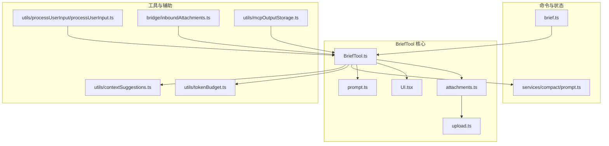
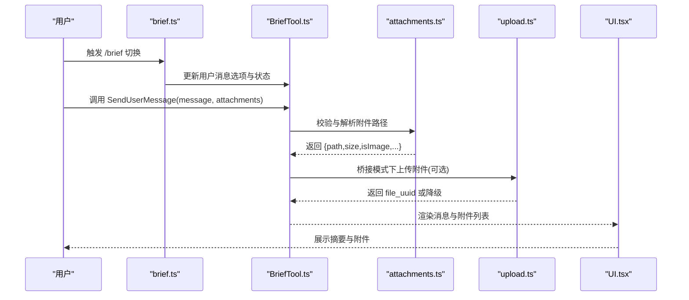
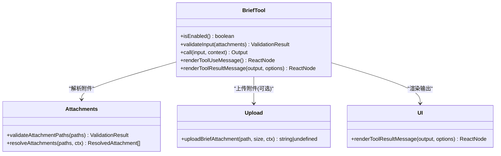
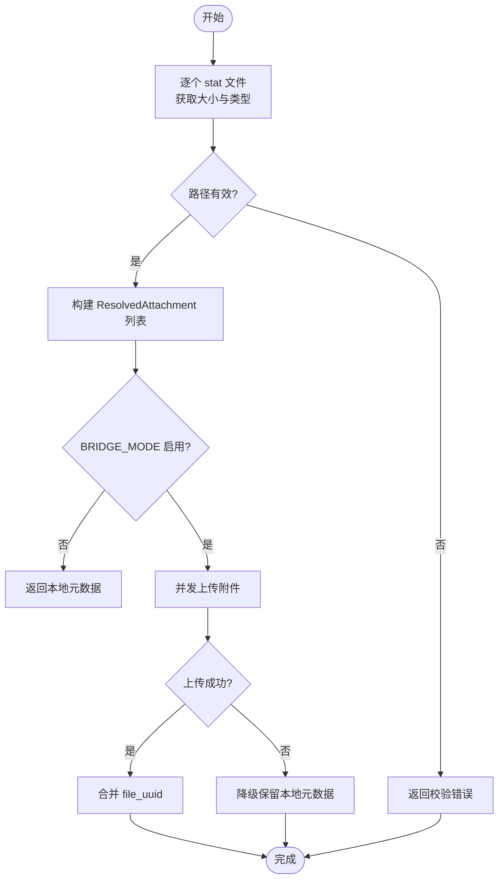
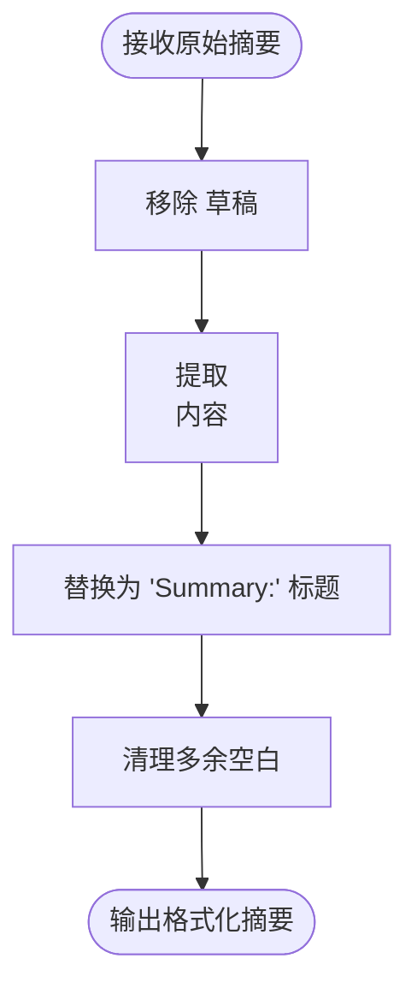
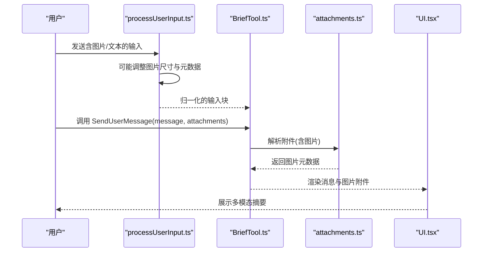
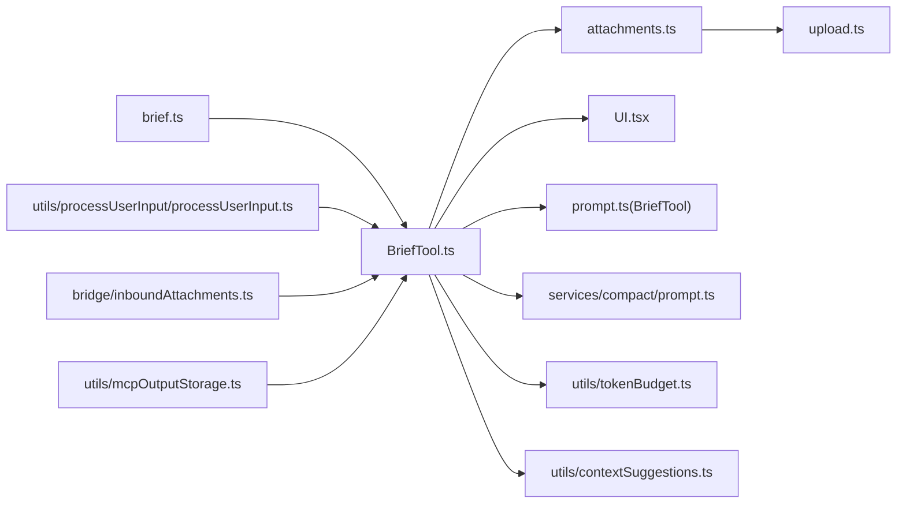

# 摘要生成工具

<cite>
**本文档引用的文件**
- [BriefTool.ts](file://src/tools/BriefTool/BriefTool.ts)
- [prompt.ts](file://src/tools/BriefTool/prompt.ts)
- [attachments.ts](file://src/tools/BriefTool/attachments.ts)
- [upload.ts](file://src/tools/BriefTool/upload.ts)
- [UI.tsx](file://src/tools/BriefTool/UI.tsx)
- [brief.ts](file://src/commands/brief.ts)
- [prompt.ts](file://src/services/compact/prompt.ts)
- [tokenBudget.ts](file://src/utils/tokenBudget.ts)
- [contextSuggestions.ts](file://src/utils/contextSuggestions.ts)
- [processUserInput.ts](file://src/utils/processUserInput/processUserInput.ts)
- [inboundAttachments.ts](file://src/bridge/inboundAttachments.ts)
- [mcpOutputStorage.ts](file://src/utils/mcpOutputStorage.ts)
</cite>

## 目录
1. [简介](#简介)
2. [项目结构](#项目结构)
3. [核心组件](#核心组件)
4. [架构总览](#架构总览)
5. [详细组件分析](#详细组件分析)
6. [依赖关系分析](#依赖关系分析)
7. [性能考虑](#性能考虑)
8. [故障排除指南](#故障排除指南)
9. [结论](#结论)
10. [附录](#附录)

## 简介
本文件面向 BriefTool 的摘要生成能力，系统性梳理其在多模态内容（文本、图片、代码片段）上的摘要策略、附件上传与内容关联机制、摘要质量评估与长度控制方法，并给出不同场景（技术文档、代码审查、会议记录）的配置建议与性能优化方案。文档同时提供关键流程的可视化图示，帮助读者快速理解从输入到输出的全链路。

## 项目结构
BriefTool 所在模块围绕“用户消息发送”这一核心职责构建，配合附件解析、上传与渲染展示，形成闭环。其主要文件分布如下：
- 工具定义与启用逻辑：BriefTool.ts
- 提示词与系统提示：prompt.ts
- 附件解析与上传：attachments.ts、upload.ts
- 前端渲染：UI.tsx
- 切换命令：brief.ts
- 通用摘要模板与格式化：services/compact/prompt.ts
- 上下文预算与提示：utils/tokenBudget.ts、utils/contextSuggestions.ts
- 用户输入预处理（图像等）：utils/processUserInput/processUserInput.ts
- 入站附件桥接：bridge/inboundAttachments.ts
- 输出存储与截断提醒：utils/mcpOutputStorage.ts

图表来源
- [BriefTool.ts:136-204](file://src/tools/BriefTool/BriefTool.ts#L136-L204)
- [prompt.ts:1-24](file://src/tools/BriefTool/prompt.ts#L1-L24)
- [attachments.ts:63-112](file://src/tools/BriefTool/attachments.ts#L63-L112)
- [upload.ts:92-176](file://src/tools/BriefTool/upload.ts#L92-L176)
- [UI.tsx:12-68](file://src/tools/BriefTool/UI.tsx#L12-L68)
- [brief.ts:47-128](file://src/commands/brief.ts#L47-L128)
- [prompt.ts:26-303](file://src/services/compact/prompt.ts#L26-L303)

章节来源
- [BriefTool.ts:1-206](file://src/tools/BriefTool/BriefTool.ts#L1-L206)
- [brief.ts:1-133](file://src/commands/brief.ts#L1-L133)

## 核心组件
- 工具定义与启用控制：BriefTool.ts 定义了 SendUserMessage 工具的输入输出模式、验证规则、启用条件与调用流程；通过 isBriefEnabled/isBriefEntitled 控制功能可用性与会话内激活。
- 提示词与系统提示：prompt.ts 提供工具描述、系统提示段落与交互规范，确保输出聚焦于用户可见区域。
- 附件解析与上传：attachments.ts 负责路径校验、统计文件大小与类型；upload.ts 在桥接模式下将文件上传至后端并返回 file_uuid，用于 Web 预览。
- 渲染与展示：UI.tsx 根据视图模式（转录/简报/默认）渲染消息与附件列表。
- 命令入口：brief.ts 提供 /brief 切换命令，动态更新用户消息选项与应用状态。
- 摘要模板与格式化：services/compact/prompt.ts 提供“无工具”摘要模板与分析/总结块格式化，支持会话压缩与上下文保留。
- 上下文预算与提示：utils/tokenBudget.ts 识别预算标记位置，生成续写提示；utils/contextSuggestions.ts 对高消耗工具给出节省建议。
- 输入预处理：utils/processUserInput/processUserInput.ts 处理图像等多模态输入，调整尺寸与元数据。
- 入站附件桥接：bridge/inboundAttachments.ts 解析入站消息中的附件并落地到本地。
- 输出存储与截断提醒：utils/mcpOutputStorage.ts 为外部进程输出提供读取指导与截断警告。

章节来源
- [BriefTool.ts:136-204](file://src/tools/BriefTool/BriefTool.ts#L136-L204)
- [prompt.ts:1-24](file://src/tools/BriefTool/prompt.ts#L1-L24)
- [attachments.ts:19-112](file://src/tools/BriefTool/attachments.ts#L19-L112)
- [upload.ts:92-176](file://src/tools/BriefTool/upload.ts#L92-L176)
- [UI.tsx:12-68](file://src/tools/BriefTool/UI.tsx#L12-L68)
- [brief.ts:47-128](file://src/commands/brief.ts#L47-L128)
- [prompt.ts:26-303](file://src/services/compact/prompt.ts#L26-L303)
- [tokenBudget.ts:31-73](file://src/utils/tokenBudget.ts#L31-L73)
- [contextSuggestions.ts:134-149](file://src/utils/contextSuggestions.ts#L134-L149)
- [processUserInput.ts:314-349](file://src/utils/processUserInput/processUserInput.ts#L314-L349)
- [inboundAttachments.ts:42-73](file://src/bridge/inboundAttachments.ts#L42-L73)
- [mcpOutputStorage.ts:52-59](file://src/utils/mcpOutputStorage.ts#L52-L59)

## 架构总览
BriefTool 的摘要生成与内容呈现遵循“输入校验—附件解析—可选上传—摘要模板—结果渲染”的主干流程。系统通过“无工具”摘要模板强制模型产出纯文本摘要，结合分析草稿与总结块，最终去除草稿仅保留结构化摘要。

图表来源
- [brief.ts:60-126](file://src/commands/brief.ts#L60-L126)
- [BriefTool.ts:186-203](file://src/tools/BriefTool/BriefTool.ts#L186-L203)
- [attachments.ts:63-112](file://src/tools/BriefTool/attachments.ts#L63-L112)
- [upload.ts:92-176](file://src/tools/BriefTool/upload.ts#L92-L176)
- [UI.tsx:12-68](file://src/tools/BriefTool/UI.tsx#L12-L68)

## 详细组件分析

### 组件一：BriefTool 工具定义与启用控制
- 启用条件：isBriefEnabled 结合 Kairos 状态与用户消息选项，确保仅在明确启用且具备资格时激活。
- 输入输出：严格约束 message（支持 Markdown）、attachments（可选）、status（normal/proactive），输出包含 message、附件元数据与发送时间戳。
- 调用流程：校验附件路径后解析文件信息；若处于桥接模式则尝试上传并回填 file_uuid；最终渲染 UI 并记录事件。

图表来源
- [BriefTool.ts:136-204](file://src/tools/BriefTool/BriefTool.ts#L136-L204)
- [attachments.ts:26-112](file://src/tools/BriefTool/attachments.ts#L26-L112)
- [upload.ts:92-176](file://src/tools/BriefTool/upload.ts#L92-L176)
- [UI.tsx:12-68](file://src/tools/BriefTool/UI.tsx#L12-L68)

章节来源
- [BriefTool.ts:126-204](file://src/tools/BriefTool/BriefTool.ts#L126-L204)

### 组件二：附件解析与上传机制
- 路径校验：逐个 stat 文件，区分不存在、权限不足等错误，保证 TOCTOU 风险可控。
- 类型识别：基于扩展名正则判断是否为图片，便于后续上传策略选择。
- 上传策略：仅在 BRIDGE_MODE 下进行网络上传；对超限或失败场景进行优雅降级，保留本地路径与大小信息。
- MIME 映射：限定支持的光栅格式，避免不兼容导致的 400 错误。

图表来源
- [attachments.ts:63-112](file://src/tools/BriefTool/attachments.ts#L63-L112)
- [upload.ts:92-176](file://src/tools/BriefTool/upload.ts#L92-L176)

章节来源
- [attachments.ts:26-112](file://src/tools/BriefTool/attachments.ts#L26-L112)
- [upload.ts:31-176](file://src/tools/BriefTool/upload.ts#L31-L176)

### 组件三：摘要模板与质量控制
- 无工具摘要：通过严格的 no-tools 前言与尾注，强制模型以纯文本形式输出，先分析后总结。
- 结构化输出：要求包含请求意图、技术概念、文件与代码片段、错误与修复、问题解决、用户消息、待办任务、当前工作与下一步等九个部分。
- 格式化：移除分析草稿，替换总结标签为可读标题，清理多余空白，提升可读性。
- 会话压缩：支持“从某处起”和“最近片段”两种摘要方向，配合“近期消息保留”策略，平衡上下文完整性与长度。

图表来源
- [prompt.ts:305-335](file://src/services/compact/prompt.ts#L305-L335)

章节来源
- [prompt.ts:26-303](file://src/services/compact/prompt.ts#L26-L303)
- [prompt.ts:305-376](file://src/services/compact/prompt.ts#L305-L376)

### 组件四：多模态内容处理策略
- 文本：作为 Markdown 支持的消息主体，直接渲染。
- 图片：在用户输入阶段进行尺寸与下采样处理，必要时附加维度元数据；BriefTool 侧根据扩展名识别图片类型，上传后由 Web 端预览。
- 代码片段：在摘要模板中鼓励包含关键代码片段与文件名，确保上下文可追溯。

图表来源
- [processUserInput.ts:314-349](file://src/utils/processUserInput/processUserInput.ts#L314-L349)
- [attachments.ts:70-82](file://src/tools/BriefTool/attachments.ts#L70-L82)
- [UI.tsx:69-100](file://src/tools/BriefTool/UI.tsx#L69-L100)

章节来源
- [processUserInput.ts:314-349](file://src/utils/processUserInput/processUserInput.ts#L314-L349)
- [attachments.ts:70-82](file://src/tools/BriefTool/attachments.ts#L70-L82)
- [UI.tsx:69-100](file://src/tools/BriefTool/UI.tsx#L69-L100)

### 组件五：摘要质量评估与长度控制
- 上下文预算：通过 tokenBudget.findTokenBudgetPositions 识别输入中的预算标记，结合 getBudgetContinuationMessage 生成续写提示，避免过早总结。
- 工具消耗提示：contextSuggestions 对高消耗工具给出节省建议，帮助控制上下文占用。
- 截断与完整性：mcpOutputStorage 提示在读取外部输出时注意截断警告，强调需读取完整内容再进行摘要。

章节来源
- [tokenBudget.ts:31-73](file://src/utils/tokenBudget.ts#L31-L73)
- [contextSuggestions.ts:134-149](file://src/utils/contextSuggestions.ts#L134-L149)
- [mcpOutputStorage.ts:52-59](file://src/utils/mcpOutputStorage.ts#L52-L59)

### 组件六：不同场景下的摘要策略配置
- 技术文档：使用“从某处起”的摘要方向，强调工作完成情况与继续工作的上下文，确保新读者能快速上手。
- 代码审查：聚焦“最近片段”，突出变更文件、关键代码片段与修复过程，便于审阅者把握最新进展。
- 会议记录：采用“无工具”摘要模板，严格结构化输出，包含请求意图、问题解决与下一步，确保会议要点可检索。

章节来源
- [prompt.ts:206-267](file://src/services/compact/prompt.ts#L206-L267)
- [prompt.ts:145-204](file://src/services/compact/prompt.ts#L145-L204)

## 依赖关系分析
BriefTool 的依赖关系清晰，核心围绕工具定义、附件处理与渲染展示展开，同时与命令入口、摘要服务、上下文预算工具形成松耦合协作。

图表来源
- [brief.ts:47-128](file://src/commands/brief.ts#L47-L128)
- [BriefTool.ts:136-204](file://src/tools/BriefTool/BriefTool.ts#L136-L204)
- [attachments.ts:63-112](file://src/tools/BriefTool/attachments.ts#L63-L112)
- [upload.ts:92-176](file://src/tools/BriefTool/upload.ts#L92-L176)
- [UI.tsx:12-68](file://src/tools/BriefTool/UI.tsx#L12-L68)
- [prompt.ts:26-303](file://src/services/compact/prompt.ts#L26-L303)
- [tokenBudget.ts:31-73](file://src/utils/tokenBudget.ts#L31-L73)
- [contextSuggestions.ts:134-149](file://src/utils/contextSuggestions.ts#L134-L149)
- [processUserInput.ts:314-349](file://src/utils/processUserInput/processUserInput.ts#L314-L349)
- [inboundAttachments.ts:42-73](file://src/bridge/inboundAttachments.ts#L42-L73)
- [mcpOutputStorage.ts:52-59](file://src/utils/mcpOutputStorage.ts#L52-L59)

章节来源
- [brief.ts:47-128](file://src/commands/brief.ts#L47-L128)
- [BriefTool.ts:136-204](file://src/tools/BriefTool/BriefTool.ts#L136-L204)

## 性能考虑
- 附件上传的并发与降级：解析阶段串行 stat 保持顺序确定性，上传阶段并行以降低延迟；失败时保留本地元数据，避免阻塞主流程。
- 死码消除与按需加载：BRIDGE_MODE 特性门控内联上传模块，未启用时完全剔除网络依赖，减少包体与运行时开销。
- 图像处理：在用户输入阶段统一进行尺寸调整与元数据提取，减少后续传输与渲染成本。
- 上下文预算：通过预算标记与续写提示，避免模型在早期阶段过早总结，提高摘要质量与稳定性。

章节来源
- [attachments.ts:63-112](file://src/tools/BriefTool/attachments.ts#L63-L112)
- [upload.ts:92-176](file://src/tools/BriefTool/upload.ts#L92-L176)
- [processUserInput.ts:314-349](file://src/utils/processUserInput/processUserInput.ts#L314-L349)
- [tokenBudget.ts:31-73](file://src/utils/tokenBudget.ts#L31-L73)

## 故障排除指南
- 附件不可访问：检查路径是否存在、权限是否足够；若为远程环境，确认桥接令牌与上传开关状态。
- 上传失败：关注日志中的状态码与响应体，确认目标主机与 OAuth 令牌匹配；必要时降低单文件大小或关闭上传以降级为本地渲染。
- 摘要质量不佳：确认是否使用了“无工具”摘要模板；检查是否提供了足够的上下文与具体文件/代码片段；适当增加“最近片段”摘要范围。
- 截断警告：在读取外部输出时遵循提示，逐步增大分块大小直至完整读取，再进行摘要生成。

章节来源
- [upload.ts:107-171](file://src/tools/BriefTool/upload.ts#L107-L171)
- [inboundAttachments.ts:68-73](file://src/bridge/inboundAttachments.ts#L68-L73)
- [mcpOutputStorage.ts:52-59](file://src/utils/mcpOutputStorage.ts#L52-L59)
- [prompt.ts:26-303](file://src/services/compact/prompt.ts#L26-L303)

## 结论
BriefTool 将“用户消息发送”与“摘要生成”紧密结合，通过严格的启用控制、稳健的附件处理与上传、以及结构化的摘要模板，实现了高质量、可追溯的多模态摘要体验。配合上下文预算与提示策略，能够在不同场景下灵活调整摘要粒度与重点，满足技术文档、代码审查与会议记录等多样化需求。

## 附录
- 快速参考
  - 工具名称：SendUserMessage
  - 启用条件：isBriefEnabled 与 isBriefEntitled
  - 附件上传：BRIDGE_MODE 下并发上传，失败降级
  - 摘要模板：无工具前言 + 分析草稿 + 结构化总结
  - 多模态：文本(Markdown)、图片(尺寸调整)、代码片段(关键片段)