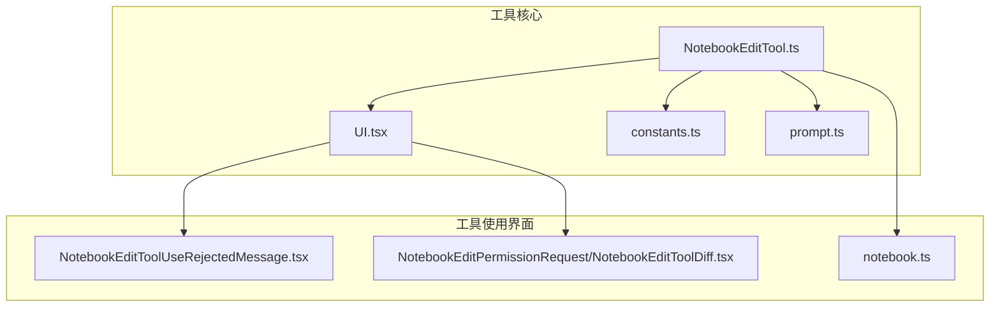
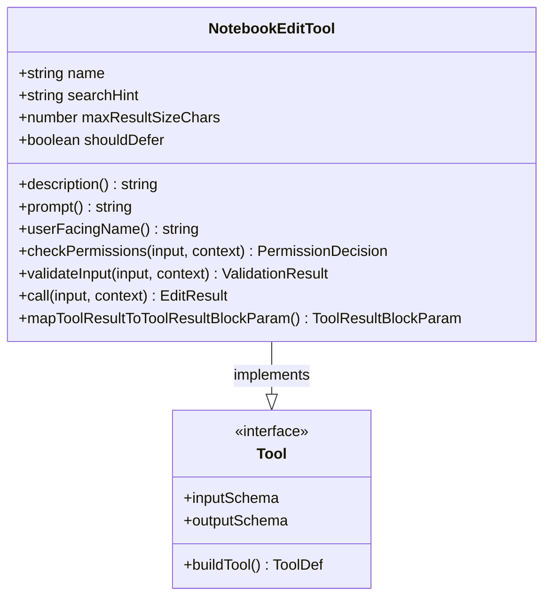
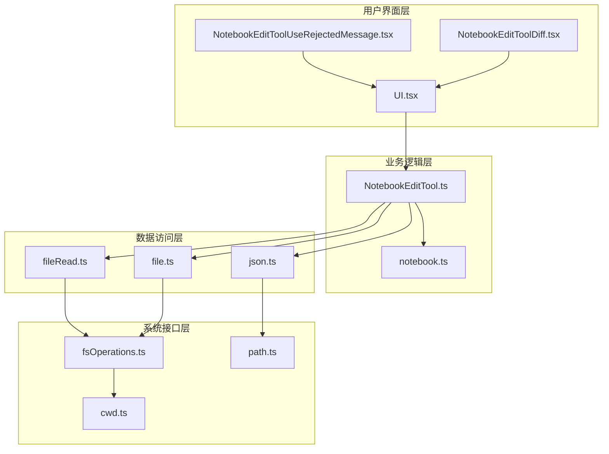
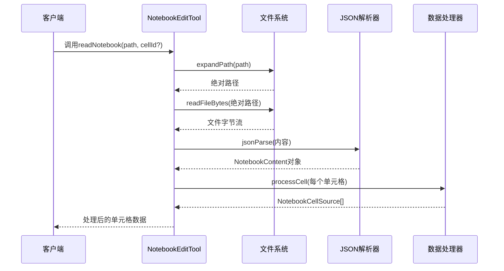
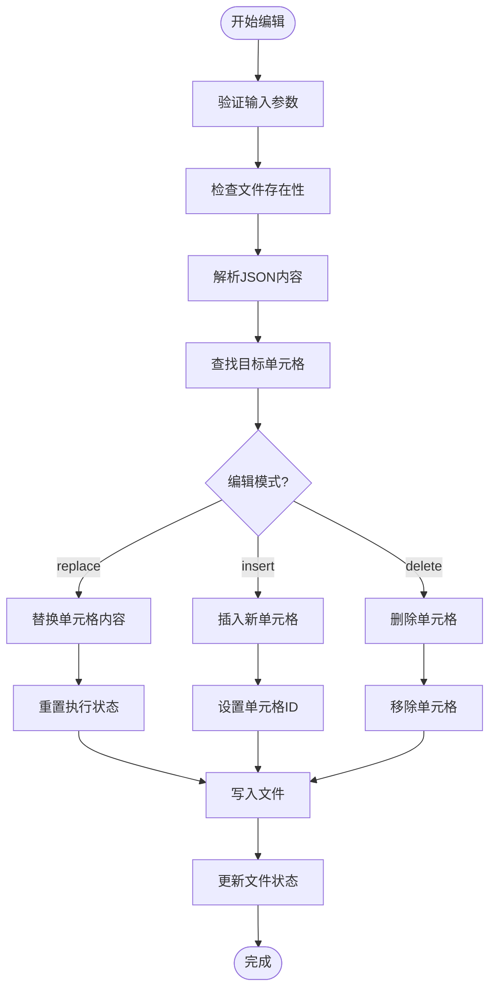
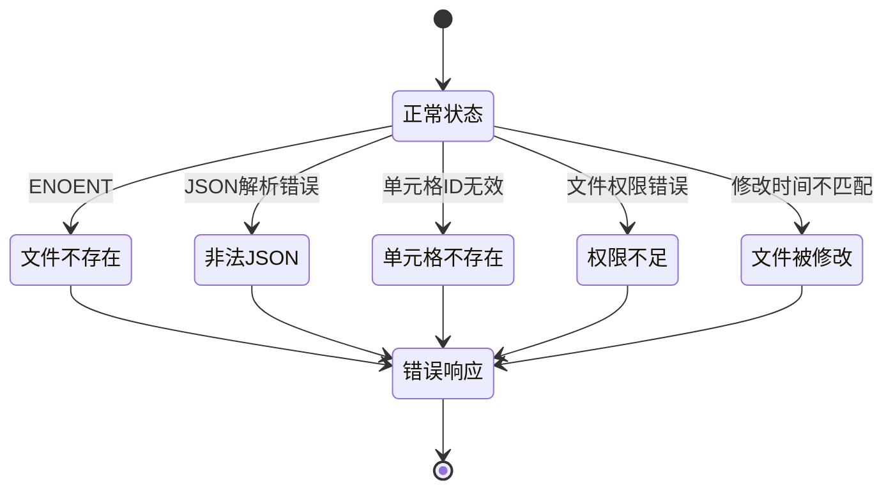
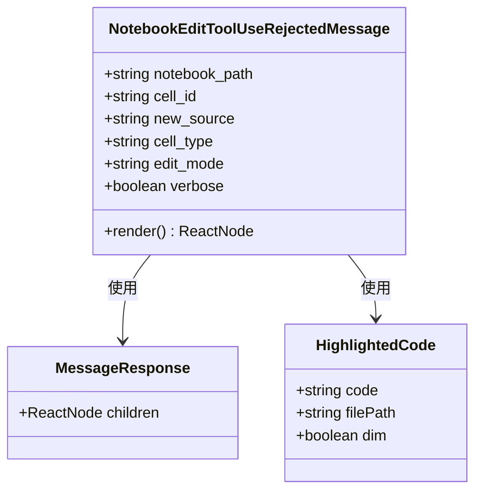
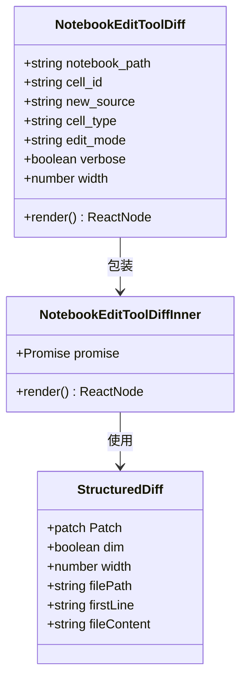

# 笔记本编辑工具

<cite>
**本文档引用的文件**
- [NotebookEditTool.ts](file://src/tools/NotebookEditTool/NotebookEditTool.ts)
- [notebook.ts](file://src/utils/notebook.ts)
- [NotebookEditToolUseRejectedMessage.tsx](file://src/components/NotebookEditToolUseRejectedMessage.tsx)
- [NotebookEditToolDiff.tsx](file://src/components/permissions/NotebookEditPermissionRequest/NotebookEditToolDiff.tsx)
- [constants.ts](file://src/tools/NotebookEditTool/constants.ts)
- [prompt.ts](file://src/tools/NotebookEditTool/prompt.ts)
- [UI.tsx](file://src/tools/NotebookEditTool/UI.tsx)
</cite>

## 目录
1. [简介](#简介)
2. [项目结构](#项目结构)
3. [核心组件](#核心组件)
4. [架构概览](#架构概览)
5. [详细组件分析](#详细组件分析)
6. [依赖关系分析](#依赖关系分析)
7. [性能考虑](#性能考虑)
8. [故障排除指南](#故障排除指南)
9. [结论](#结论)
10. [附录](#附录)

## 简介

NotebookEditTool 是一个专门用于编辑 Jupyter 笔记本文件的开发工具。该工具提供了对 .ipynb 文件的完整读取、编辑和写入功能，支持代码单元格和 Markdown 单元格的增删改查操作。工具实现了严格的权限控制、安全检查和错误恢复机制，并提供了版本控制和变更追踪功能。

该工具的核心特性包括：
- Jupyter 笔记本格式的解析和序列化
- 单元格级别的增删改查操作
- 代码单元格和 Markdown 单元格的差异化处理
- 版本控制和变更追踪
- 权限控制和安全检查
- 错误恢复和数据保护

## 项目结构

NotebookEditTool 的项目结构遵循模块化设计原则，主要由以下几个核心部分组成：



**图表来源**
- [NotebookEditTool.ts:1-492](file://src/tools/NotebookEditTool/NotebookEditTool.ts#L1-L492)
- [UI.tsx:1-94](file://src/tools/NotebookEditTool/UI.tsx#L1-L94)

**章节来源**
- [NotebookEditTool.ts:1-492](file://src/tools/NotebookEditTool/NotebookEditTool.ts#L1-L492)
- [UI.tsx:1-94](file://src/tools/NotebookEditTool/UI.tsx#L1-L94)

## 核心组件

### 主要工具类

NotebookEditTool 是整个系统的核心，它继承自通用的 Tool 类，实现了特定的笔记本编辑功能：



**图表来源**
- [NotebookEditTool.ts:90-490](file://src/tools/NotebookEditTool/NotebookEditTool.ts#L90-L490)

### 输入输出模式

工具定义了严格的输入输出模式，确保操作的安全性和一致性：

| 模式 | 描述 | 必需参数 |
|------|------|----------|
| replace | 替换单元格内容 | notebook_path, cell_id, new_source |
| insert | 插入新单元格 | notebook_path, cell_type, new_source, [cell_id] |
| delete | 删除单元格 | notebook_path, cell_id |

**章节来源**
- [NotebookEditTool.ts:30-86](file://src/tools/NotebookEditTool/NotebookEditTool.ts#L30-L86)

## 架构概览

NotebookEditTool 采用分层架构设计，从底层的文件系统操作到上层的用户界面展示，形成了完整的工具链：



**图表来源**
- [NotebookEditTool.ts:1-492](file://src/tools/NotebookEditTool/NotebookEditTool.ts#L1-L492)
- [notebook.ts:1-226](file://src/utils/notebook.ts#L1-L226)

## 详细组件分析

### 笔记本文件读取和解析

工具通过 `readNotebook` 函数实现 Jupyter 笔记本文件的读取和解析：



**图表来源**
- [notebook.ts:164-183](file://src/utils/notebook.ts#L164-L183)

### 单元格编辑流程

编辑操作是工具的核心功能，支持三种主要模式：



**图表来源**
- [NotebookEditTool.ts:295-489](file://src/tools/NotebookEditTool/NotebookEditTool.ts#L295-L489)

### 权限控制系统

工具实现了多层次的权限控制机制：


**图表来源**
- [NotebookEditTool.ts:125-294](file://src/tools/NotebookEditTool/NotebookEditTool.ts#L125-L294)

**章节来源**
- [NotebookEditTool.ts:125-294](file://src/tools/NotebookEditTool/NotebookEditTool.ts#L125-L294)

### 错误处理和恢复机制

工具提供了完善的错误处理和恢复机制：



**图表来源**
- [NotebookEditTool.ts:242-251](file://src/tools/NotebookEditTool/NotebookEditTool.ts#L242-L251)

**章节来源**
- [NotebookEditTool.ts:242-251](file://src/tools/NotebookEditTool/NotebookEditTool.ts#L242-L251)

### 用户界面组件

工具提供了丰富的用户界面组件来增强用户体验：

#### 拒绝操作消息组件



**图表来源**
- [NotebookEditToolUseRejectedMessage.tsx:1-93](file://src/components/NotebookEditToolUseRejectedMessage.tsx#L1-L93)

#### 差异显示组件



**图表来源**
- [NotebookEditToolDiff.tsx:1-236](file://src/components/permissions/NotebookEditPermissionRequest/NotebookEditToolDiff.tsx#L1-L236)

**章节来源**
- [NotebookEditToolUseRejectedMessage.tsx:1-93](file://src/components/NotebookEditToolUseRejectedMessage.tsx#L1-L93)
- [NotebookEditToolDiff.tsx:1-236](file://src/components/permissions/NotebookEditPermissionRequest/NotebookEditToolDiff.tsx#L1-L236)

## 依赖关系分析

NotebookEditTool 的依赖关系体现了清晰的分层架构：

```mermaid
graph TB
subgraph "外部依赖"
A[@anthropic-ai/sdk]
B[bun:bundle]
C[zod/v4]
D[react]
end
subgraph "内部工具"
E[Tool.js]
F[permissions/filesystem.js]
G[utils/json.js]
H[utils/file.js]
I[utils/errors.js]
end
subgraph "核心工具"
J[NotebookEditTool.ts]
K[notebook.ts]
L[UI.tsx]
end
subgraph "组件"
M[NotebookEditToolUseRejectedMessage.tsx]
N[NotebookEditToolDiff.tsx]
end
A --> J
B --> J
C --> J
D --> M
D --> N
J --> E
J --> F
J --> G
J --> H
J --> I
J --> K
J --> L
L --> M
L --> N
```

**图表来源**
- [NotebookEditTool.ts:1-28](file://src/tools/NotebookEditTool/NotebookEditTool.ts#L1-L28)
- [UI.tsx:1-15](file://src/tools/NotebookEditTool/UI.tsx#L1-L15)

**章节来源**
- [NotebookEditTool.ts:1-28](file://src/tools/NotebookEditTool/NotebookEditTool.ts#L1-L28)
- [UI.tsx:1-15](file://src/tools/NotebookEditTool/UI.tsx#L1-L15)

## 性能考虑

NotebookEditTool 在设计时充分考虑了性能优化：

### 内存管理
- 使用流式文件读取避免大文件内存占用
- 缓存机制优化重复操作性能
- 及时释放不再使用的资源

### 并发处理
- 异步文件操作避免阻塞主线程
- Promise 链式调用提高响应速度
- 批量操作合并减少 I/O 次数

### 编码优化
- 延迟加载非关键功能
- 智能缓存策略
- 最小化 DOM 操作

## 故障排除指南

### 常见问题及解决方案

#### 文件权限问题
**症状**: 操作失败，提示权限不足
**解决方案**: 
1. 检查文件是否具有写权限
2. 确认当前用户有目录访问权限
3. 验证文件未被其他进程锁定

#### JSON 解析错误
**症状**: 提示笔记本文件不是有效的 JSON
**解决方案**:
1. 检查文件完整性
2. 验证文件编码格式
3. 使用文本编辑器修复语法错误

#### 单元格 ID 不存在
**症状**: 查找单元格失败
**解决方案**:
1. 确认单元格 ID 格式正确
2. 检查笔记本文件中的实际单元格 ID
3. 使用单元格索引代替 ID

#### 文件被修改
**症状**: 操作被拒绝，提示文件已被修改
**解决方案**:
1. 重新读取文件获取最新版本
2. 同步外部更改
3. 重新执行编辑操作

**章节来源**
- [NotebookEditTool.ts:242-251](file://src/tools/NotebookEditTool/NotebookEditTool.ts#L242-L251)

## 结论

NotebookEditTool 是一个功能完整、安全性高、用户体验良好的笔记本编辑工具。它通过精心设计的架构和严格的实现规范，为开发者提供了可靠的 Jupyter 笔记本文件编辑能力。

该工具的主要优势包括：
- **安全性**: 多层次权限控制和安全检查
- **可靠性**: 完善的错误处理和恢复机制  
- **易用性**: 直观的用户界面和详细的反馈信息
- **扩展性**: 模块化设计便于功能扩展

未来可以考虑的功能改进方向：
- 支持更多的笔记本格式
- 增强版本控制功能
- 提供更丰富的可视化编辑选项
- 优化大文件处理性能

## 附录

### API 参考

#### 输入参数
| 参数名 | 类型 | 必需 | 描述 |
|--------|------|------|------|
| notebook_path | string | 是 | 笔记本文件的绝对路径 |
| cell_id | string | 可选 | 目标单元格的 ID |
| new_source | string | 是 | 新的单元格内容 |
| cell_type | 'code' \| 'markdown' | 可选 | 单元格类型（仅 insert 模式必需） |
| edit_mode | 'replace' \| 'insert' \| 'delete' | 可选 | 编辑模式，默认 replace |

#### 输出参数
| 参数名 | 类型 | 描述 |
|--------|------|------|
| new_source | string | 实际写入的单元格内容 |
| cell_id | string | 编辑的单元格 ID |
| cell_type | 'code' \| 'markdown' | 单元格类型 |
| language | string | 笔记本语言信息 |
| edit_mode | string | 实际使用的编辑模式 |
| error | string | 错误信息（如有） |
| notebook_path | string | 笔记本文件路径 |
| original_file | string | 修改前的内容 |
| updated_file | string | 修改后的文件内容 |

### 最佳实践

1. **先读取后编辑**: 始终在编辑前读取文件，确保操作的原子性
2. **验证输入**: 使用工具提供的验证机制确保参数正确性
3. **处理错误**: 实现适当的错误处理逻辑
4. **备份重要文件**: 对重要的笔记本文件进行备份
5. **监控性能**: 注意大文件的处理时间和内存使用