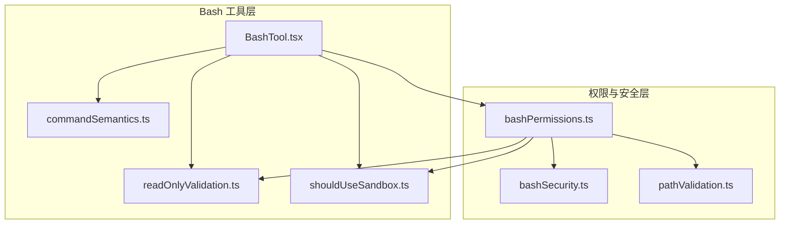
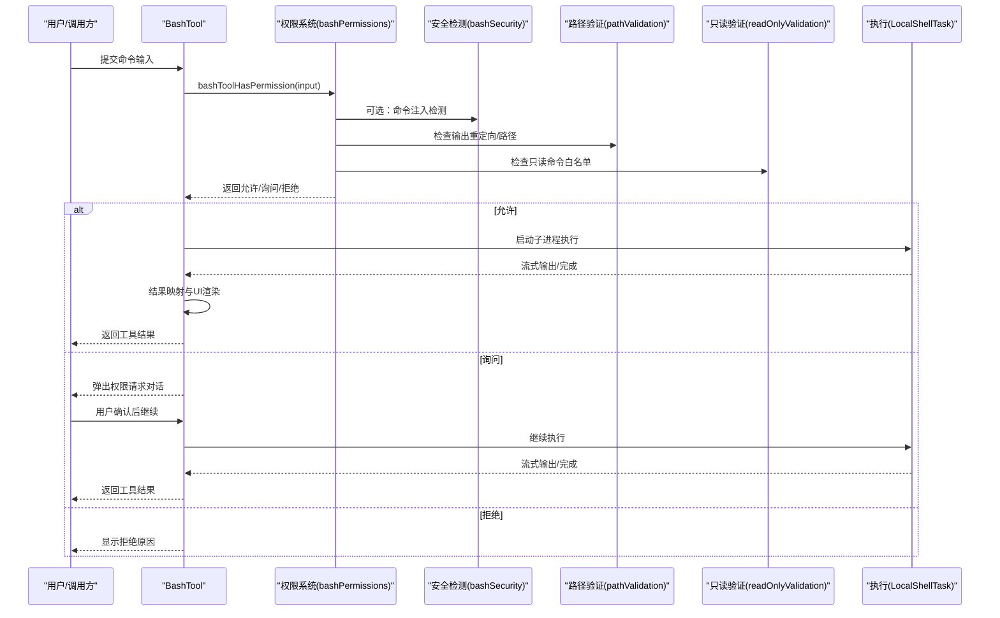
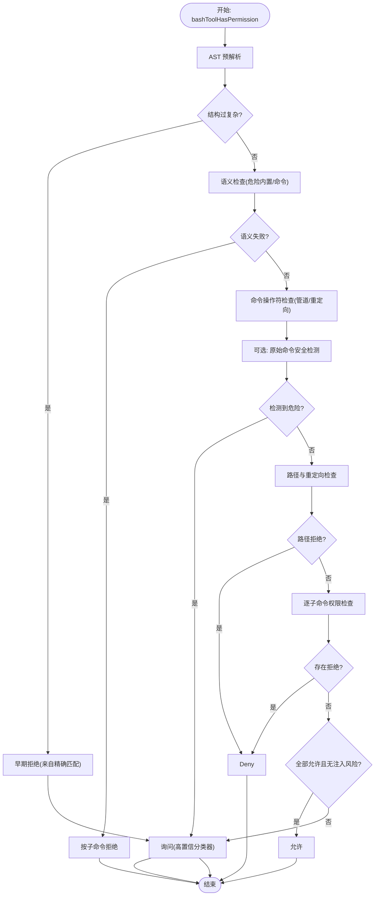
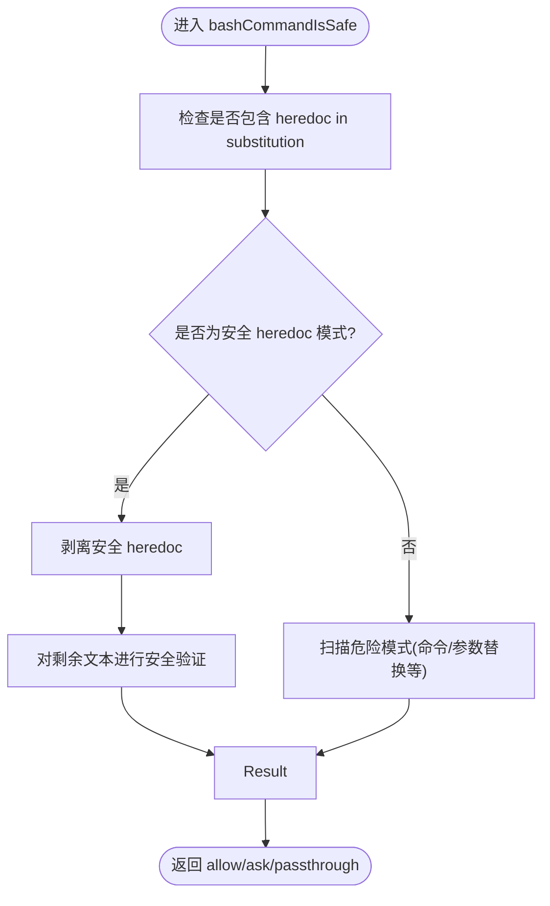
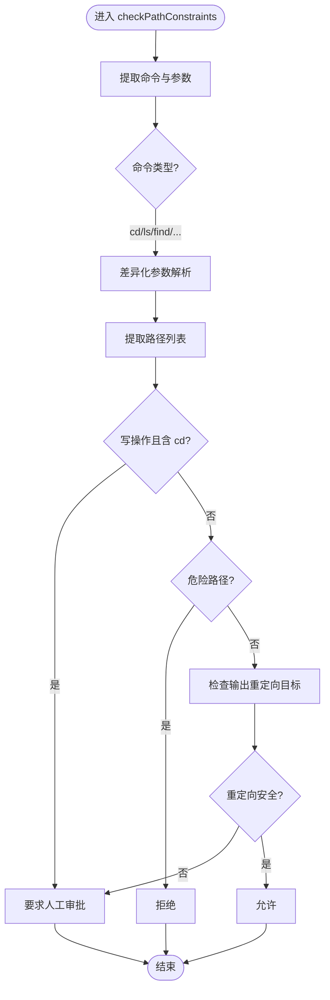
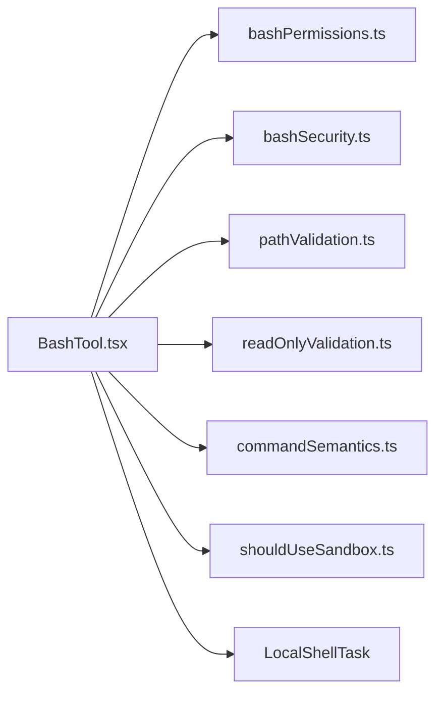

# Bash 执行工具

<cite>
**本文档引用的文件**
- [BashTool.tsx](file://src/tools/BashTool/BashTool.tsx)
- [bashPermissions.ts](file://src/tools/BashTool/bashPermissions.ts)
- [commandSemantics.ts](file://src/tools/BashTool/commandSemantics.ts)
- [bashSecurity.ts](file://src/tools/BashTool/bashSecurity.ts)
- [pathValidation.ts](file://src/tools/BashTool/pathValidation.ts)
- [readOnlyValidation.ts](file://src/tools/BashTool/readOnlyValidation.ts)
- [shouldUseSandbox.ts](file://src/tools/BashTool/shouldUseSandbox.ts)
</cite>

## 目录
1. [简介](#简介)
2. [项目结构](#项目结构)
3. [核心组件](#核心组件)
4. [架构总览](#架构总览)
5. [详细组件分析](#详细组件分析)
6. [依赖关系分析](#依赖关系分析)
7. [性能考虑](#性能考虑)
8. [故障排除指南](#故障排除指南)
9. [结论](#结论)
10. [附录](#附录)

## 简介
本文件为 Claude Code 的 Bash 执行工具（BashTool）提供系统化技术文档。重点覆盖以下方面：
- 命令执行机制：从输入解析、权限校验到执行与结果回传的完整流程
- 权限控制系统：规则匹配、提示词驱动分类器、沙箱模式与只读约束
- 安全防护措施：AST 解析、命令注入检测、危险模式识别、路径与重定向验证
- 输出处理：流式进度、大输出持久化、图像输出压缩、错误语义解释
- 跨平台兼容性：Windows/Posix 路径转换、平台差异处理
- 实际使用案例、安全最佳实践与故障排除

## 项目结构
BashTool 的实现位于 `src/tools/BashTool/` 目录下，核心文件职责如下：
- BashTool.tsx：工具定义、输入/输出模式、UI 渲染、执行主流程
- bashPermissions.ts：权限决策主入口，规则匹配、提示词分类器、早期拒绝/询问
- bashSecurity.ts：命令注入与危险模式检测，heredoc 安全替换等
- pathValidation.ts：路径提取与验证，重定向目标安全检查
- readOnlyValidation.ts：只读命令白名单与参数校验
- commandSemantics.ts：基于命令语义的退出码解释（如 grep/rg 的“无匹配”非错误）
- shouldUseSandbox.ts：沙箱启用策略与排除规则

**图表来源**
- [BashTool.tsx](file://src/tools/BashTool/BashTool.tsx)
- [bashPermissions.ts](file://src/tools/BashTool/bashPermissions.ts)
- [bashSecurity.ts](file://src/tools/BashTool/bashSecurity.ts)
- [pathValidation.ts](file://src/tools/BashTool/pathValidation.ts)
- [readOnlyValidation.ts](file://src/tools/BashTool/readOnlyValidation.ts)
- [shouldUseSandbox.ts](file://src/tools/BashTool/shouldUseSandbox.ts)
- [commandSemantics.ts](file://src/tools/BashTool/commandSemantics.ts)

**章节来源**
- [BashTool.tsx](file://src/tools/BashTool/BashTool.tsx)
- [bashPermissions.ts](file://src/tools/BashTool/bashPermissions.ts)

## 核心组件
- BashTool 主类：定义输入/输出模式、并发安全、只读判定、UI 渲染、执行主循环与结果映射
- bashToolHasPermission：权限决策主函数，支持 AST 预解析、提示词分类器、前缀/通配规则匹配、路径与重定向安全检查
- bashCommandIsSafeAsync：命令注入与危险模式检测（正则电池），支持 heredoc 安全替换
- checkPathConstraints：路径提取与验证，重定向目标安全检查
- checkReadOnlyConstraints：只读命令白名单与参数校验
- interpretCommandResult：基于命令语义解释退出码（如 grep/rg 的“无匹配”非错误）

**章节来源**
- [BashTool.tsx](file://src/tools/BashTool/BashTool.tsx)
- [bashPermissions.ts](file://src/tools/BashTool/bashPermissions.ts)
- [bashSecurity.ts](file://src/tools/BashTool/bashSecurity.ts)
- [pathValidation.ts](file://src/tools/BashTool/pathValidation.ts)
- [readOnlyValidation.ts](file://src/tools/BashTool/readOnlyValidation.ts)
- [commandSemantics.ts](file://src/tools/BashTool/commandSemantics.ts)

## 架构总览
BashTool 的执行链路分为“权限决策”和“执行与输出”两大阶段：

**图表来源**
- [BashTool.tsx](file://src/tools/BashTool/BashTool.tsx)
- [bashPermissions.ts](file://src/tools/BashTool/bashPermissions.ts)
- [bashSecurity.ts](file://src/tools/BashTool/bashSecurity.ts)
- [pathValidation.ts](file://src/tools/BashTool/pathValidation.ts)
- [readOnlyValidation.ts](file://src/tools/BashTool/readOnlyValidation.ts)

## 详细组件分析

### 权限控制系统（bashPermissions）
- 规则匹配顺序：精确匹配（deny/ask/allow）→ 前缀/通配 deny/ask → 路径约束 → 允许规则 → sed 约束 → 模式特定处理 → 只读判定 → 通用“需要审批”
- AST 预解析：优先使用 tree-sitter 进行结构解析，避免 splitCommand 的误判；对“过复杂”或“语义失败”的命令触发“询问”策略
- 提示词分类器：并行评估 deny/ask 描述，高置信度时直接返回 deny/ask
- 命令注入检测：在 AST 不可用或未禁用时，对原始命令运行安全检测，必要时剥离安全 heredoc 模式后二次验证
- 多子命令处理：限制最大子命令数量以避免性能退化；复合命令中 cd+git 组合直接拒绝；输出重定向在原始命令上单独验证

**图表来源**
- [bashPermissions.ts](file://src/tools/BashTool/bashPermissions.ts)

**章节来源**
- [bashPermissions.ts](file://src/tools/BashTool/bashPermissions.ts)

### 命令注入与安全检测（bashSecurity）
- 危险模式识别：命令替换、参数替换、Zsh 扩展、等号展开、反引号/命令替换、进程替换、IFS 注入、Git 提交消息中的命令替换等
- heredoc 安全替换：仅当满足严格边界条件（限定分隔符、闭合行、无多余元字符）才视为安全，并对剩余文本再次进行安全验证
- Git 提交消息安全：严格校验 -m 参数，禁止包含命令替换；对余量进行转义/引号剥离后的重定向符号检测
- 早期放行与回退：安全 heredoc 模式可绕过后续验证，但必须确保剩余文本通过安全检测

**图表来源**
- [bashSecurity.ts](file://src/tools/BashTool/bashSecurity.ts)

**章节来源**
- [bashSecurity.ts](file://src/tools/BashTool/bashSecurity.ts)

### 路径与重定向验证（pathValidation）
- 路径提取：针对不同命令（cd/ls/find/mkdir/touch/rm/rmdir/mv/cp/cat/head/tail/sort/uniq/wc/cut/paste/column/tr/file/stat/diff/awk/strings/hexdump/od/base64/nl/grep/rg/sed/git/jq/sha256sum/sha1sum/md5sum）采用差异化参数解析策略
- POSIX `--` 支持：正确处理选项终止符，避免将路径误判为选项
- 写操作限制：复合命令中若包含 cd 且涉及写操作，需人工审批
- 危险路径拦截：对 rm/rmdir 的危险路径（如根目录、系统关键目录）直接拒绝
- 重定向安全：对输出重定向目标进行安全检查，避免将敏感文件作为输出目标

**图表来源**
- [pathValidation.ts](file://src/tools/BashTool/pathValidation.ts)

**章节来源**
- [pathValidation.ts](file://src/tools/BashTool/pathValidation.ts)

### 只读命令与参数校验（readOnlyValidation）
- 白名单命令：对常见只读命令（如 git、grep、ripgrep、tree、sort、file、base64、ps、man、netstat、date、hostname 等）建立安全标志位配置
- 参数安全：严格校验每个命令的安全标志，阻止可能引发代码执行或写入的参数组合
- 特殊处理：如 sed 仅允许白名单表达式；date/hostname 等位置参数严格限制格式与行为

**章节来源**
- [readOnlyValidation.ts](file://src/tools/BashTool/readOnlyValidation.ts)

### 命令语义解释（commandSemantics）
- 默认语义：仅 0 表示成功，其他退出码视为错误
- 特定命令语义：
  - grep/rg：1 表示“无匹配”，不视为错误
  - find：1 表示部分目录不可访问，非致命
  - diff：1 表示文件不同，不视为错误
  - test/[：1 表示条件为假，不视为错误
- 语义提取：从命令行中提取基础命令（考虑管道场景），选择对应语义解释

**章节来源**
- [commandSemantics.ts](file://src/tools/BashTool/commandSemantics.ts)

### 沙箱模式与排除（shouldUseSandbox）
- 启用策略：当沙箱开启且未显式禁用时启用；若用户配置了排除命令（前缀/精确/通配），则不启用沙箱
- 排除规则：支持动态配置与用户设置，对环境变量前缀与包装器命令进行剥离后匹配，防止绕过

**章节来源**
- [shouldUseSandbox.ts](file://src/tools/BashTool/shouldUseSandbox.ts)

## 依赖关系分析
- BashTool.tsx 依赖：
  - bashPermissions.ts：权限决策入口
  - bashSecurity.ts：命令注入检测
  - pathValidation.ts：路径与重定向安全
  - readOnlyValidation.ts：只读命令白名单
  - commandSemantics.ts：退出码语义解释
  - shouldUseSandbox.ts：沙箱启用策略
  - LocalShellTask：子进程执行与流式输出
  - UI 组件：工具使用消息、进度、排队消息、结果消息

**图表来源**
- [BashTool.tsx](file://src/tools/BashTool/BashTool.tsx)
- [bashPermissions.ts](file://src/tools/BashTool/bashPermissions.ts)
- [bashSecurity.ts](file://src/tools/BashTool/bashSecurity.ts)
- [pathValidation.ts](file://src/tools/BashTool/pathValidation.ts)
- [readOnlyValidation.ts](file://src/tools/BashTool/readOnlyValidation.ts)
- [commandSemantics.ts](file://src/tools/BashTool/commandSemantics.ts)
- [shouldUseSandbox.ts](file://src/tools/BashTool/shouldUseSandbox.ts)

**章节来源**
- [BashTool.tsx](file://src/tools/BashTool/BashTool.tsx)

## 性能考虑
- AST 预解析：优先使用 tree-sitter，避免 splitCommand 的误判与性能抖动
- 子命令上限：限制最大子命令数量，防止指数级验证开销
- 并行分类器：提示词分类器并行评估 deny/ask，减少等待时间
- 流式输出：本地任务流式输出，避免一次性缓冲大量数据
- 大输出持久化：超过阈值时落盘并生成预览，避免内存压力

[本节为通用指导，无需具体文件引用]

## 故障排除指南
- “命令被拒绝”排查
  - 检查是否存在明确 deny 规则（精确/前缀/通配）
  - 查看提示词分类器是否命中 deny/ask 描述
  - 确认命令是否包含危险模式（命令替换、heredoc 不安全、Git 提交消息中的命令替换等）
- “需要人工审批”排查
  - 路径不在允许工作目录范围内
  - 写操作与 cd 复合导致的安全限制
  - 输出重定向目标为敏感路径
  - 多个子命令分别触发 ask，UI 会合并建议
- “沙箱模式未生效”
  - 是否显式禁用沙箱
  - 是否命中用户/动态配置的排除规则
- “超时/卡顿”
  - 检查子命令数量是否超过上限
  - 关注提示词分类器异步检查是否阻塞 UI

**章节来源**
- [bashPermissions.ts](file://src/tools/BashTool/bashPermissions.ts)
- [pathValidation.ts](file://src/tools/BashTool/pathValidation.ts)
- [shouldUseSandbox.ts](file://src/tools/BashTool/shouldUseSandbox.ts)

## 结论
BashTool 通过“AST 预解析 + 规则匹配 + 分类器 + 多层安全检测”的组合，在保证易用性的同时实现了强安全边界。其设计强调：
- 可观测性：丰富的日志与事件，便于审计与问题定位
- 可扩展性：模块化组件（权限、安全、路径、只读、沙箱）便于增量增强
- 可靠性：对危险模式与路径边界进行严格控制，避免常见攻击面

[本节为总结，无需具体文件引用]

## 附录

### 实际使用案例
- 只读搜索：`grep -r "pattern" .` → 自动允许（只读命令白名单 + 安全标志）
- 写操作审批：`rm -rf /tmp/*` → 要求人工审批（危险路径）
- 复合命令：`cd /tmp && echo "payload" > settings.json` → 要求人工审批（cd+写操作）
- 输出重定向：`find . -name "*.log" > /etc/passwd` → 拒绝（重定向目标为敏感路径）
- heredoc 安全：`cat <<'EOF'` 且满足安全条件 → 允许（剥离后剩余文本安全）

[本节为概念性示例，无需具体文件引用]

### 安全使用指南
- 命令注入防护
  - 避免在参数中嵌入命令替换（$()、反引号、Zsh 扩展）
  - 使用安全 heredoc 模式时，确保分隔符与闭合行符合规范
- 沙箱模式
  - 在需要隔离的环境中启用沙箱；对已知安全的命令可通过排除规则放宽
- 资源管理
  - 控制子命令数量，避免过长的管道链
  - 对大输出启用持久化，避免内存占用过高
- 性能优化
  - 使用只读命令替代可能产生副作用的命令
  - 合理使用提示词描述，提升分类器命中率，减少交互成本

[本节为通用指导，无需具体文件引用]