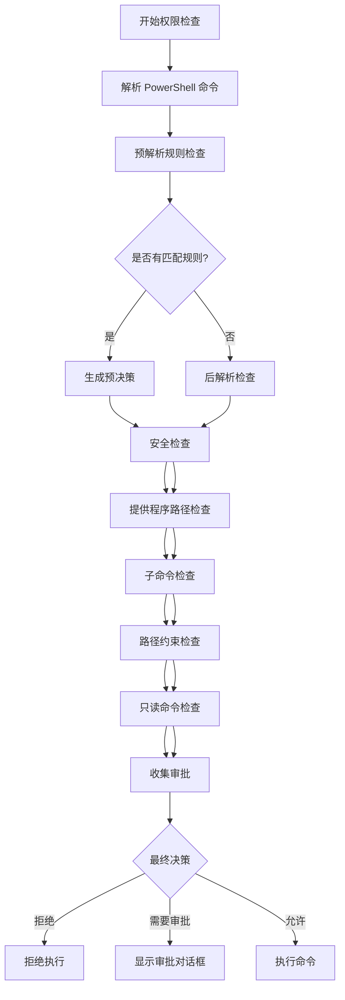
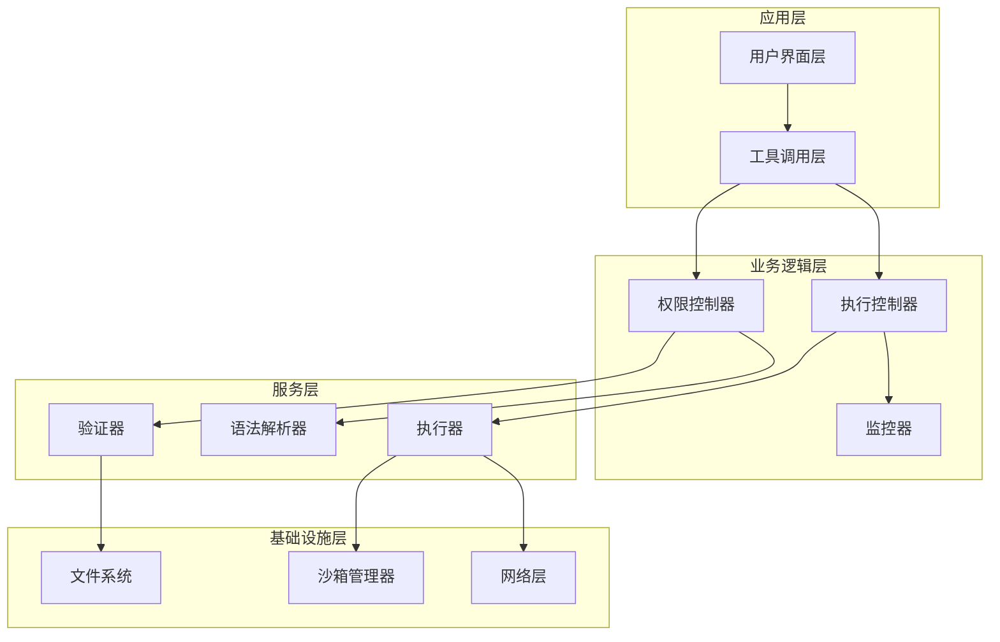
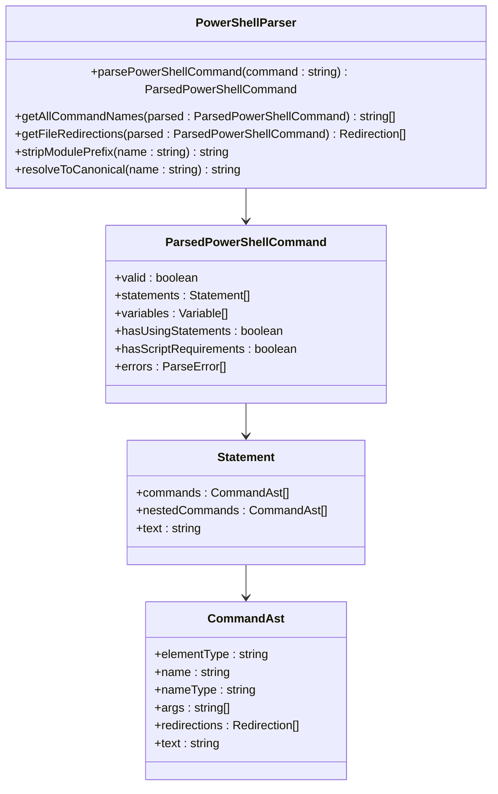
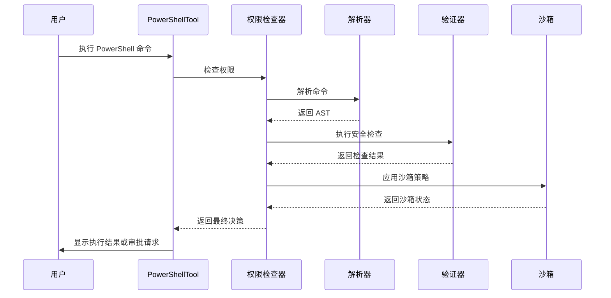
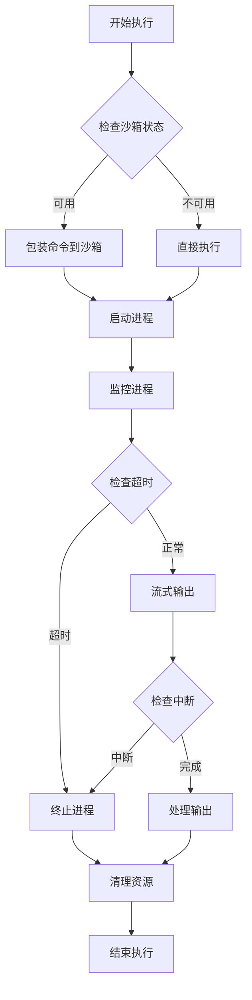
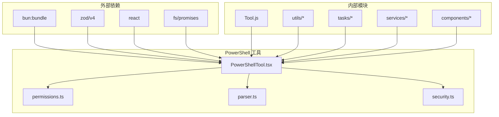

# PowerShell 执行工具

<cite>
**本文档引用的文件**
- [PowerShellTool.tsx](file://src/tools/PowerShellTool/PowerShellTool.tsx)
- [powershellPermissions.ts](file://src/tools/PowerShellTool/powershellPermissions.ts)
- [toolName.ts](file://src/tools/PowerShellTool/toolName.ts)
- [prompt.ts](file://src/tools/PowerShellTool/prompt.ts)
- [readOnlyValidation.ts](file://src/tools/PowerShellTool/readOnlyValidation.ts)
- [pathValidation.ts](file://src/tools/PowerShellTool/pathValidation.ts)
- [modeValidation.ts](file://src/tools/PowerShellTool/modeValidation.ts)
- [gitSafety.ts](file://src/tools/PowerShellTool/gitSafety.ts)
- [powershellSecurity.ts](file://src/tools/PowerShellTool/powershellSecurity.ts)
- [parser.ts](file://src/utils/powershell/parser.ts)
- [shellRuleMatching.ts](file://src/utils/permissions/shellRuleMatching.ts)
- [permissions.ts](file://src/utils/permissions/permissions.ts)
- [LocalShellTask.ts](file://src/tasks/LocalShellTask/LocalShellTask.ts)
- [Shell.ts](file://src/utils/Shell.ts)
- [platform.ts](file://src/utils/platform.ts)
- [sandbox-adapter.ts](file://src/utils/sandbox/sandbox-adapter.ts)
- [powerShellTool.tsx](file://src/components/permissions/PowerShellPermissionRequest/PowerShellPermissionRequest.tsx)
</cite>

## 目录
1. [简介](#简介)
2. [项目结构](#项目结构)
3. [核心组件](#核心组件)
4. [架构概览](#架构概览)
5. [详细组件分析](#详细组件分析)
6. [依赖关系分析](#依赖关系分析)
7. [性能考虑](#性能考虑)
8. [故障排除指南](#故障排除指南)
9. [结论](#结论)

## 简介

PowerShell 执行工具是 Claude Code 中用于安全执行 PowerShell 命令的核心组件。该工具提供了完整的权限控制系统、语法分析、管道处理和对象序列化功能，支持 Windows PowerShell 和 PowerShell Core 的兼容性处理。

该工具的主要目标是在确保安全性的前提下，为用户提供强大的 PowerShell 命令执行能力，包括：
- 安全的权限检查机制
- PowerShell 特有的语法分析和管道处理
- 跨平台兼容性（Windows、macOS、Linux）
- 高级安全防护措施
- 用户友好的交互体验

## 项目结构

PowerShell 执行工具位于 `src/tools/PowerShellTool/` 目录下，采用模块化设计：

```mermaid
graph TB
subgraph "PowerShell 工具模块"
PSTool[PowerShellTool.tsx]
Perm[powershellPermissions.ts]
ToolName[toolName.ts]
Prompt[prompt.ts]
ReadOnly[readOnlyValidation.ts]
PathVal[pathValidation.ts]
ModeVal[modeValidation.ts]
GitSafe[gitSafety.ts]
SecCheck[powershellSecurity.ts]
end
subgraph "工具组件"
UI[UI.js]
CommandSemantics[commandSemantics.js]
TaskOutput[TaskOutput.js]
end
subgraph "权限系统"
ShellRule[shellRuleMatching.ts]
Permissions[permissions.ts]
PermRequest[PowerShellPermissionRequest.tsx]
end
subgraph "底层支持"
Parser[parser.ts]
LocalShell[LocalShellTask.ts]
ShellExec[Shell.ts]
Platform[platform.ts]
Sandbox[sandbox-adapter.ts]
end
PSTool --> Perm
Perm --> ReadOnly
Perm --> PathVal
Perm --> ModeVal
Perm --> GitSafe
Perm --> SecCheck
Perm --> ShellRule
Perm --> Permissions
Perm --> Parser
PSTool --> UI
PSTool --> CommandSemantics
PSTool --> TaskOutput
PSTool --> LocalShell
PSTool --> ShellExec
PSTool --> Platform
PSTool --> Sandbox
```

**图表来源**
- [PowerShellTool.tsx:1-100](file://src/tools/PowerShellTool/PowerShellTool.tsx#L1-100)
- [powershellPermissions.ts:1-50](file://src/tools/PowerShellTool/powershellPermissions.ts#L1-50)

**章节来源**
- [PowerShellTool.tsx:1-100](file://src/tools/PowerShellTool/PowerShellTool.tsx#L1-100)
- [powershellPermissions.ts:1-50](file://src/tools/PowerShellTool/powershellPermissions.ts#L1-50)

## 核心组件

### PowerShellTool 主控制器

PowerShellTool 是整个工具的核心控制器，负责协调所有子组件的工作。它实现了完整的工具生命周期管理，包括输入验证、权限检查、命令执行和结果处理。

**关键特性：**
- 支持同步和异步命令执行
- 内置进度监控和超时处理
- 自动后台任务管理和恢复
- 大输出文件的持久化存储
- 图像数据的特殊处理

### 权限检查系统

权限检查系统是 PowerShell 工具安全性的核心保障，采用了多层防御策略：

**图表来源**
- [powershellPermissions.ts:639-757](file://src/tools/PowerShellTool/powershellPermissions.ts#L639-757)

**章节来源**
- [powershellPermissions.ts:639-757](file://src/tools/PowerShellTool/powershellPermissions.ts#L639-757)

## 架构概览

PowerShell 执行工具采用分层架构设计，确保了高内聚低耦合的代码组织：

**图表来源**
- [PowerShellTool.tsx:272-436](file://src/tools/PowerShellTool/PowerShellTool.tsx#L272-436)
- [powershellPermissions.ts:639-642](file://src/tools/PowerShellTool/powershellPermissions.ts#L639-642)

## 详细组件分析

### 语法解析器组件

语法解析器是 PowerShell 工具的核心技术组件，负责将原始 PowerShell 命令转换为可操作的抽象语法树（AST）：

**图表来源**
- [parser.ts:1-200](file://src/utils/powershell/parser.ts#L1-200)

**章节来源**
- [parser.ts:1-200](file://src/utils/powershell/parser.ts#L1-200)

### 权限检查流程

权限检查流程采用了先进的"先收集后决策"（Collect-Then-Reduce）模式，确保了决策的正确性和安全性：

**图表来源**
- [powershellPermissions.ts:897-900](file://src/tools/PowerShellTool/powershellPermissions.ts#L897-900)

**章节来源**
- [powershellPermissions.ts:897-900](file://src/tools/PowerShellTool/powershellPermissions.ts#L897-900)

### 命令执行引擎

命令执行引擎负责实际的 PowerShell 命令执行，包括进程管理、输出处理和错误恢复：

**图表来源**
- [PowerShellTool.tsx:663-1000](file://src/tools/PowerShellTool/PowerShellTool.tsx#L663-1000)

**章节来源**
- [PowerShellTool.tsx:663-1000](file://src/tools/PowerShellTool/PowerShellTool.tsx#L663-1000)

### 跨平台兼容性处理

工具通过智能的平台检测和适配机制，确保在不同操作系统上的稳定运行：

| 平台 | PowerShell 可用性 | 沙箱支持 | 特殊处理 |
|------|-------------------|----------|----------|
| Windows | 原生 PowerShell + PowerShell Core | 不支持 | Windows 特定安全策略 |
| macOS | PowerShell Core | 支持 | Homebrew 包管理器 |
| Linux | PowerShell Core | 支持 | 包管理系统 |

**章节来源**
- [PowerShellTool.tsx:219-222](file://src/tools/PowerShellTool/PowerShellTool.tsx#L219-222)
- [platform.ts:1-50](file://src/utils/platform.ts#L1-50)

## 依赖关系分析

PowerShell 执行工具的依赖关系体现了清晰的分层架构：

**图表来源**
- [PowerShellTool.tsx:1-40](file://src/tools/PowerShellTool/PowerShellTool.tsx#L1-40)

**章节来源**
- [PowerShellTool.tsx:1-40](file://src/tools/PowerShellTool/PowerShellTool.tsx#L1-40)

## 性能考虑

### 输出处理优化

工具实现了智能的输出处理机制，避免了大文件传输的性能问题：

- **流式输出**：实时处理命令输出，避免内存溢出
- **文件持久化**：超过阈值的输出自动保存到磁盘
- **图像压缩**：对图像数据进行压缩处理
- **进度监控**：提供详细的执行进度信息

### 缓存机制

工具采用了多层次的缓存策略来提升性能：

- **PowerShell 路径缓存**：避免重复的 PowerShell 检测
- **解析结果缓存**：缓存已解析的命令结构
- **权限检查缓存**：缓存权限检查结果

## 故障排除指南

### 常见问题及解决方案

| 问题类型 | 症状 | 解决方案 |
|----------|------|----------|
| PowerShell 不可用 | "PowerShell 不可用"错误 | 检查 PowerShell 是否正确安装 |
| 权限被拒绝 | "权限被拒绝"消息 | 检查权限规则配置 |
| 命令超时 | 命令执行超时 | 增加超时时间或优化命令 |
| 沙箱限制 | 沙箱相关错误 | 检查企业策略设置 |

### 调试技巧

1. **启用详细日志**：使用 `logEvent` 函数记录执行过程
2. **检查解析结果**：验证命令解析是否正确
3. **监控资源使用**：跟踪内存和 CPU 使用情况
4. **测试权限规则**：验证权限检查逻辑

**章节来源**
- [PowerShellTool.tsx:576-585](file://src/tools/PowerShellTool/PowerShellTool.tsx#L576-585)

## 结论

PowerShell 执行工具是一个功能完整、安全可靠的命令执行解决方案。它通过以下关键特性确保了高质量的用户体验：

- **全面的安全防护**：多层权限检查和沙箱隔离
- **智能的语法分析**：准确的 PowerShell 语法解析和理解
- **优秀的跨平台支持**：统一的接口和平台特定优化
- **高效的性能表现**：流式处理和智能缓存机制
- **用户友好的设计**：直观的界面和详细的反馈信息

该工具为 Claude Code 提供了强大而安全的 PowerShell 命令执行能力，是现代开发工作流中不可或缺的重要组件。