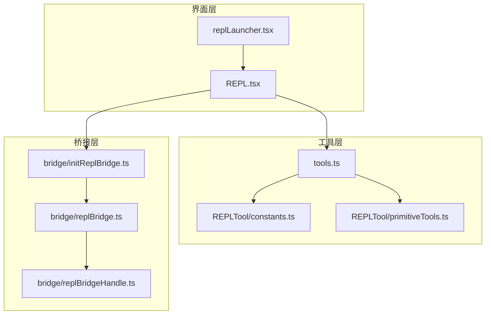
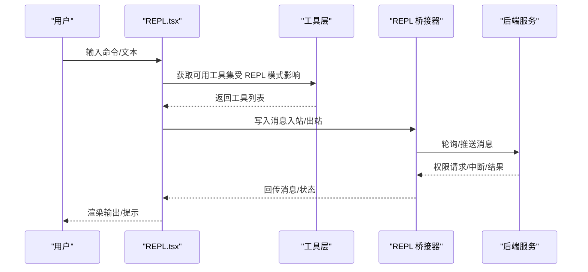
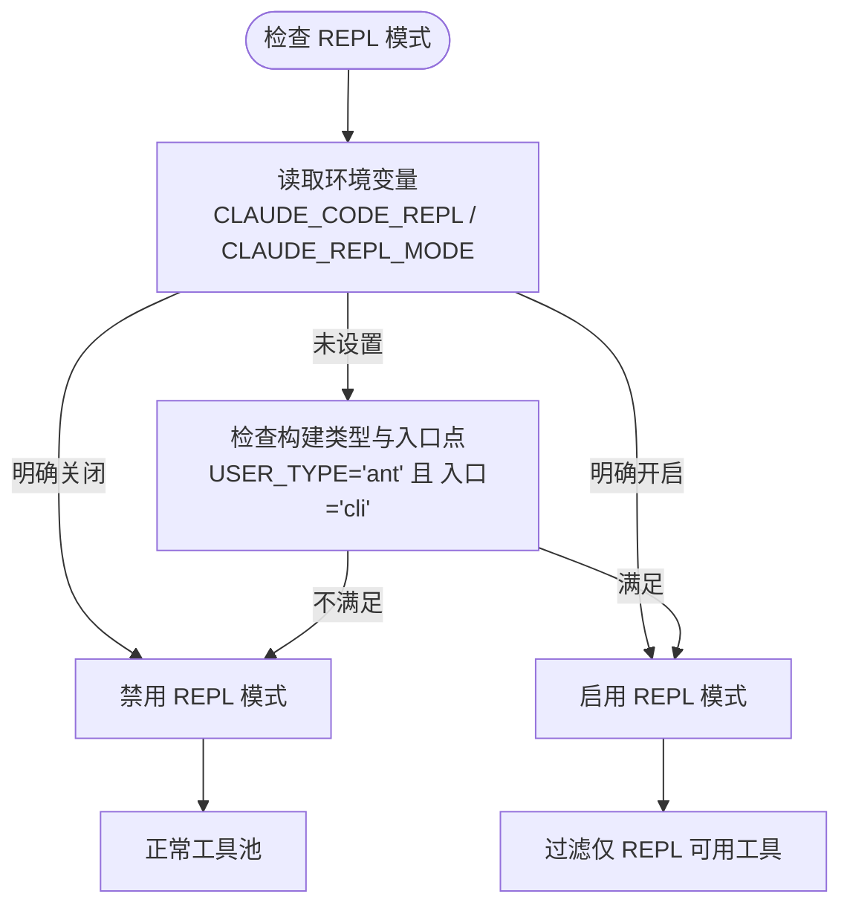
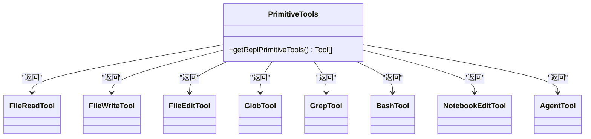
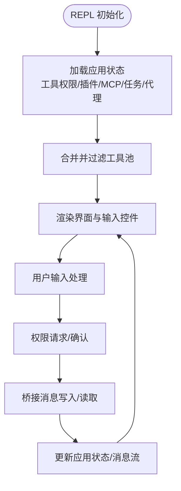
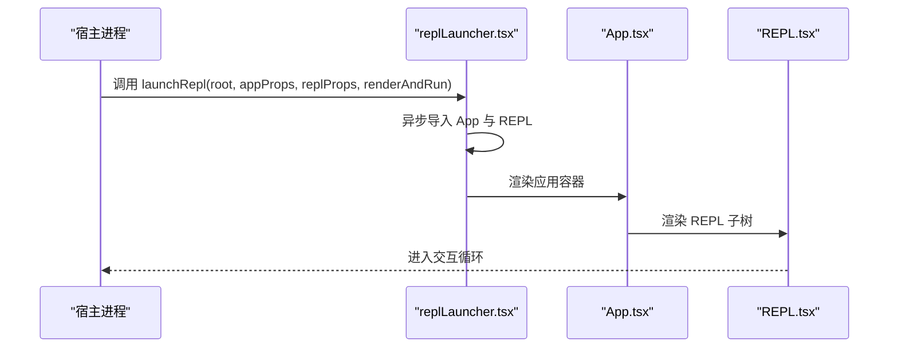
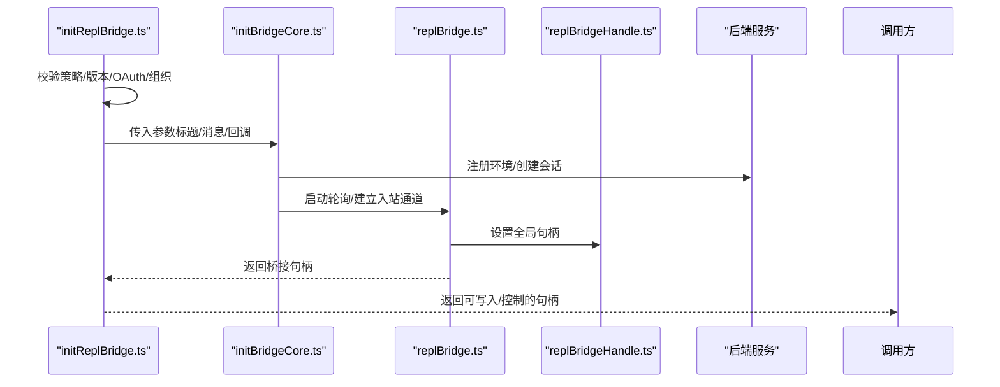
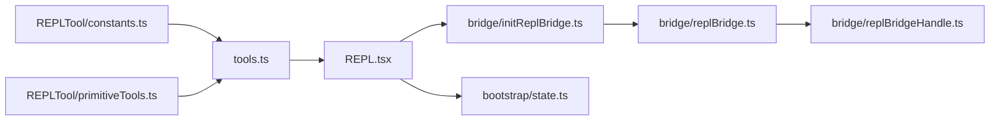

# REPL 交互工具

<cite>
**本文引用的文件**
- [src/tools/REPLTool/constants.ts](file://src/tools/REPLTool/constants.ts)
- [src/tools/REPLTool/primitiveTools.ts](file://src/tools/REPLTool/primitiveTools.ts)
- [src/screens/REPL.tsx](file://src/screens/REPL.tsx)
- [src/replLauncher.tsx](file://src/replLauncher.tsx)
- [src/bridge/replBridge.ts](file://src/bridge/replBridge.ts)
- [src/bridge/initReplBridge.ts](file://src/bridge/initReplBridge.ts)
- [src/bridge/replBridgeHandle.ts](file://src/bridge/replBridgeHandle.ts)
- [src/tools.ts](file://src/tools.ts)
- [src/bootstrap/state.ts](file://src/bootstrap/state.ts)
</cite>

## 目录
1. [简介](#简介)
2. [项目结构](#项目结构)
3. [核心组件](#核心组件)
4. [架构总览](#架构总览)
5. [详细组件分析](#详细组件分析)
6. [依赖关系分析](#依赖关系分析)
7. [性能考量](#性能考量)
8. [故障排查指南](#故障排查指南)
9. [结论](#结论)
10. [附录：交互式编程指南与最佳实践](#附录交互式编程指南与最佳实践)

## 简介
本文件系统性梳理 Claude Code 的 REPL 交互工具，聚焦 REPLTool 的交互式编程能力，涵盖多语言支持、会话管理与状态保持、基础工具集（primitiveTools）、配置常量（constants）以及桥接层（bridge）如何在本地终端中驱动远程控制与工具调用。文档同时提供调试技巧、性能优化建议与常见问题排查方法，并给出多语言 REPL 的实践范式。

## 项目结构
REPL 交互工具由“界面层”“工具层”“桥接层”三部分协同构成：
- 界面层：REPL 屏幕组件负责渲染、输入处理、消息流与权限请求等。
- 工具层：REPLTool 常量与基础工具集合，定义 REPL 模式开关、仅 REPL 可用工具集与虚拟机上下文可用的原语工具。
- 桥接层：REPL 桥接器负责注册环境、创建会话、轮询工作项、建立入站通道与出站消息写入，支持 v1/v2 两种传输路径。

**图表来源**
- [src/screens/REPL.tsx](file://src/screens/REPL.tsx)
- [src/replLauncher.tsx](file://src/replLauncher.tsx)
- [src/tools/REPLTool/constants.ts](file://src/tools/REPLTool/constants.ts)
- [src/tools/REPLTool/primitiveTools.ts](file://src/tools/REPLTool/primitiveTools.ts)
- [src/tools.ts](file://src/tools.ts)
- [src/bridge/initReplBridge.ts](file://src/bridge/initReplBridge.ts)
- [src/bridge/replBridge.ts](file://src/bridge/replBridge.ts)
- [src/bridge/replBridgeHandle.ts](file://src/bridge/replBridgeHandle.ts)

**章节来源**
- [src/screens/REPL.tsx](file://src/screens/REPL.tsx)
- [src/replLauncher.tsx](file://src/replLauncher.tsx)
- [src/tools/REPLTool/constants.ts](file://src/tools/REPLTool/constants.ts)
- [src/tools/REPLTool/primitiveTools.ts](file://src/tools/REPLTool/primitiveTools.ts)
- [src/tools.ts](file://src/tools.ts)
- [src/bridge/initReplBridge.ts](file://src/bridge/initReplBridge.ts)
- [src/bridge/replBridge.ts](file://src/bridge/replBridge.ts)
- [src/bridge/replBridgeHandle.ts](file://src/bridge/replBridgeHandle.ts)

## 核心组件
- REPLTool 常量与模式开关：定义 REPL 模式的启用条件、仅 REPL 可用工具集合，以及 REPL 名称标识。
- REPL 基础工具集：在 REPL 模式下仍可访问的原语工具列表，用于虚拟机上下文内的文件读写、搜索、脚本执行与代理任务等。
- REPL 屏幕组件：负责渲染输入、输出、消息历史、权限弹窗、转录模式、命令与快捷键处理等。
- REPL 启动器：将 REPL 组件挂载到根节点，完成应用初始化与渲染。
- 桥接器：封装环境注册、会话创建、轮询与入站通道、消息去重与回放保护、权限与中断回调、崩溃恢复与断线重连等。

**章节来源**
- [src/tools/REPLTool/constants.ts](file://src/tools/REPLTool/constants.ts)
- [src/tools/REPLTool/primitiveTools.ts](file://src/tools/REPLTool/primitiveTools.ts)
- [src/screens/REPL.tsx](file://src/screens/REPL.tsx)
- [src/replLauncher.tsx](file://src/replLauncher.tsx)
- [src/bridge/replBridge.ts](file://src/bridge/replBridge.ts)
- [src/bridge/initReplBridge.ts](file://src/bridge/initReplBridge.ts)
- [src/bridge/replBridgeHandle.ts](file://src/bridge/replBridgeHandle.ts)

## 架构总览
REPL 的运行时由“界面层-工具层-桥接层”三层协作完成。界面层通过工具层获取可用工具集；工具层受 REPL 模式开关影响，过滤或暴露特定工具；桥接层负责与后端服务建立长连接，转发消息并处理权限与中断。

**图表来源**
- [src/screens/REPL.tsx](file://src/screens/REPL.tsx)
- [src/tools.ts](file://src/tools.ts)
- [src/bridge/replBridge.ts](file://src/bridge/replBridge.ts)

## 详细组件分析

### REPLTool 常量与模式开关
- REPL 模式启用逻辑：综合环境变量与构建类型，决定是否默认开启 REPL 模式。
- 仅 REPL 可用工具集合：当 REPL 模式开启时，这些工具对模型不可见，需通过 REPL 执行。
- REPL 名称标识：统一的工具名常量，便于在工具池中识别与过滤。

**图表来源**
- [src/tools/REPLTool/constants.ts](file://src/tools/REPLTool/constants.ts)

**章节来源**
- [src/tools/REPLTool/constants.ts](file://src/tools/REPLTool/constants.ts)

### REPL 基础工具集（primitiveTools）
- 作用：在 REPL 模式下隐藏给模型直接使用的工具，但在 REPL 虚拟机上下文中仍可访问，以便内部渲染与分类显示。
- 实现要点：延迟初始化以避免循环导入；直接引用而非通用工具池，确保 Glob/Grep 在特定条件下不被排除。
- 工具清单：文件读取、写入、编辑、全局匹配、内容搜索、脚本执行、笔记本编辑、代理任务等。

**图表来源**
- [src/tools/REPLTool/primitiveTools.ts](file://src/tools/REPLTool/primitiveTools.ts)

**章节来源**
- [src/tools/REPLTool/primitiveTools.ts](file://src/tools/REPLTool/primitiveTools.ts)

### REPL 屏幕组件（REPL.tsx）
- 功能概览：渲染输入框、消息列表、转录模式、搜索栏、权限弹窗、任务视图、IDE 集成、远程/直连/SSH 会话支持、思考配置、插件与 MCP 客户端集成等。
- 关键流程：工具池合并与过滤、消息序列化映射、权限更新与持久化、钩子消息注入、转录索引预热与高亮、虚拟滚动与滚动定位、标题动画与终端标题同步、成本统计与性能指标采集等。
- 会话与状态：通过应用状态存储（AppStateStore）维护工具权限上下文、MCP 客户端、插件、任务、代理定义、文件历史快照等；支持会话背景化、任务列表监听与自动处理。

**图表来源**
- [src/screens/REPL.tsx](file://src/screens/REPL.tsx)

**章节来源**
- [src/screens/REPL.tsx](file://src/screens/REPL.tsx)

### REPL 启动器（replLauncher.tsx）
- 作用：动态导入应用与 REPL 组件，将 REPL 挂载到指定根节点，完成初始状态注入与渲染。
- 流程：异步加载 App 与 REPL，传递初始状态与 REPL 参数，执行渲染并进入交互循环。

**图表来源**
- [src/replLauncher.tsx](file://src/replLauncher.tsx)

**章节来源**
- [src/replLauncher.tsx](file://src/replLauncher.tsx)

### 桥接器（bridge/replBridge.ts 与 bridge/initReplBridge.ts）
- initReplBridge：读取引导状态（工作目录、会话 ID、Git 上下文、OAuth、标题推导），校验策略与版本，选择环境型（v1）或无环境型（v2）路径，委托 initBridgeCore 创建会话并启动轮询。
- initBridgeCore：注册环境、创建会话、维护最近发送/接收消息的去重集合、处理断线重连与环境重建、管理传输切换与 SSE 序列号、处理权限与中断回调、持久化崩溃恢复指针等。
- replBridgeHandle：全局持有当前 REPL 桥接句柄，供工具与命令在 React 外部调用（如订阅 PR）。

**图表来源**
- [src/bridge/initReplBridge.ts](file://src/bridge/initReplBridge.ts)
- [src/bridge/replBridge.ts](file://src/bridge/replBridge.ts)
- [src/bridge/replBridgeHandle.ts](file://src/bridge/replBridgeHandle.ts)

**章节来源**
- [src/bridge/initReplBridge.ts](file://src/bridge/initReplBridge.ts)
- [src/bridge/replBridge.ts](file://src/bridge/replBridge.ts)
- [src/bridge/replBridgeHandle.ts](file://src/bridge/replBridgeHandle.ts)

### 会话管理与状态保持
- 会话标识与再生：通过引导状态模块维护会话 ID、父会话 ID、计划缩略名缓存等；支持在清理上下文时再生会话 ID 并重置项目目录。
- 持久化与恢复：桥接器写入崩溃恢复指针，支持“永续模式”在干净退出后保留环境与会话；断线重连时尝试在同一环境中重新排队旧会话。
- 去重与回放保护：维护最近已发送/已接收消息的 UUID 集合，防止重复与回放导致的异常；在传输切换时携带 SSE 序列号，避免全量历史重放。

**章节来源**
- [src/bootstrap/state.ts](file://src/bootstrap/state.ts)
- [src/bridge/replBridge.ts](file://src/bridge/replBridge.ts)
- [src/bridge/initReplBridge.ts](file://src/bridge/initReplBridge.ts)

## 依赖关系分析
- 工具层依赖：REPL 模式开关与仅 REPL 工具集合来自 REPLTool 常量；工具池合并与过滤在 REPL 屏幕组件中完成。
- 桥接层依赖：REPL 初始化依赖引导状态与配置模块；桥接核心依赖消息映射、权限与策略模块；全局句柄为工具与命令提供跨 React 树的调用入口。
- 界面层依赖：REPL 屏幕组件依赖应用状态、MCP 客户端、插件管理、任务系统、IDE 集成、转录与搜索、通知与诊断等。

**图表来源**
- [src/tools/REPLTool/constants.ts](file://src/tools/REPLTool/constants.ts)
- [src/tools/REPLTool/primitiveTools.ts](file://src/tools/REPLTool/primitiveTools.ts)
- [src/tools.ts](file://src/tools.ts)
- [src/screens/REPL.tsx](file://src/screens/REPL.tsx)
- [src/bridge/initReplBridge.ts](file://src/bridge/initReplBridge.ts)
- [src/bridge/replBridge.ts](file://src/bridge/replBridge.ts)
- [src/bridge/replBridgeHandle.ts](file://src/bridge/replBridgeHandle.ts)
- [src/bootstrap/state.ts](file://src/bootstrap/state.ts)

**章节来源**
- [src/tools/REPLTool/constants.ts](file://src/tools/REPLTool/constants.ts)
- [src/tools/REPLTool/primitiveTools.ts](file://src/tools/REPLTool/primitiveTools.ts)
- [src/tools.ts](file://src/tools.ts)
- [src/screens/REPL.tsx](file://src/screens/REPL.tsx)
- [src/bridge/initReplBridge.ts](file://src/bridge/initReplBridge.ts)
- [src/bridge/replBridge.ts](file://src/bridge/replBridge.ts)
- [src/bridge/replBridgeHandle.ts](file://src/bridge/replBridgeHandle.ts)
- [src/bootstrap/state.ts](file://src/bootstrap/state.ts)

## 性能考量
- 虚拟滚动与渲染优化：REPL 支持虚拟滚动与增量搜索索引预热，减少大消息列表的渲染开销；转录模式下采用稳定索引与高亮，避免全屏扫描。
- 消息去重与回放保护：通过最近已发送/接收消息的 UUID 集合降低重复与回放风险，减少不必要的重绘与网络往返。
- 传输与轮询：桥接器在 v1/v2 间按服务器指示选择最优传输；在断线时快速轮询并携带 SSE 序列号，避免历史重放带来的抖动。
- 资源限制与缓存：文件状态缓存与 LRU 限制防止内存膨胀；工具池合并与懒加载减少首屏负担。

[本节为通用指导，无需列出具体文件来源]

## 故障排查指南
- OAuth 令牌过期：初始化阶段会主动刷新令牌；若刷新失败且令牌已过期，将触发失败状态并提示登录；跨进程死令牌检测会进行退避。
- 策略限制与权限：组织策略可能禁止远程控制；桥接器在启动前等待策略加载并检查允许范围；权限请求与响应通过桥接器回调处理。
- 断线与重连：桥接器在环境丢失时尝试在同一环境中重连；若失败则归档旧会话并创建新会话；传输切换时携带序列号避免历史重放。
- 会话崩溃恢复：桥接器写入崩溃恢复指针，支持“永续模式”在重启后恢复会话；断电或强制退出后可通过同一目录继续。

**章节来源**
- [src/bridge/initReplBridge.ts](file://src/bridge/initReplBridge.ts)
- [src/bridge/replBridge.ts](file://src/bridge/replBridge.ts)
- [src/bridge/replBridgeHandle.ts](file://src/bridge/replBridgeHandle.ts)

## 结论
REPL 交互工具通过清晰的分层设计实现了“界面-工具-桥接”的解耦：REPL 屏幕组件提供丰富的交互体验与多会话支持；REPLTool 常量与基础工具集保障了在 REPL 模式下的可控工具暴露与虚拟机内可用性；桥接器则提供了稳健的远程控制通道与会话恢复能力。结合本文提供的调试、性能与最佳实践建议，用户可在多语言与多场景下高效地进行交互式编程与批量任务执行。

[本节为总结性内容，无需列出具体文件来源]

## 附录：交互式编程指南与最佳实践

### 多语言支持与交互式环境
- Python/Node.js/Ruby 等语言的交互式环境通常由底层工具链或沙箱提供；REPL 通过 BashTool/GlobTool/GrepTool 等原语工具实现文件级交互与批量处理，再由模型驱动具体命令。
- 建议：在 REPL 中优先使用 BashTool 执行脚本，配合 FileReadTool/FileWriteTool 进行上下文读写，利用 GlobTool/GrepTool 快速检索与修改代码片段。

### 会话管理与状态保持
- 使用会话再生与计划缩略名缓存，在清理上下文后仍可延续任务进度。
- 利用崩溃恢复指针与“永续模式”，在长时间任务中避免频繁重建环境与会话。

### 变量持久化与历史记录
- 通过桥接器的去重与回放保护机制，确保消息不会因重连或回放而重复注入。
- 转录模式支持增量索引与高亮，便于在长对话中快速定位与导航。

### 权限与安全
- 权限请求与响应通过桥接器回调处理，REPL 屏幕组件负责展示与确认；工具调用前应确保权限已授予。
- 对于远程/直连/SSH 等模式，注意网络与主机策略差异，必要时调整 MCP 客户端与直连配置。

### 调试技巧
- 使用转录模式与搜索栏快速定位问题；启用虚拟滚动与索引预热提升大消息列表的交互流畅度。
- 观察桥接器状态变化与日志输出，结合崩溃恢复指针判断是否需要重启或重连。

### 性能优化
- 合理使用虚拟滚动与增量搜索，避免一次性渲染过多消息。
- 控制工具调用频率，批量处理文件与命令，减少不必要的网络往返。
- 在断线重连时利用传输序列号，避免历史重放带来的抖动。

[本节为通用指导，无需列出具体文件来源]