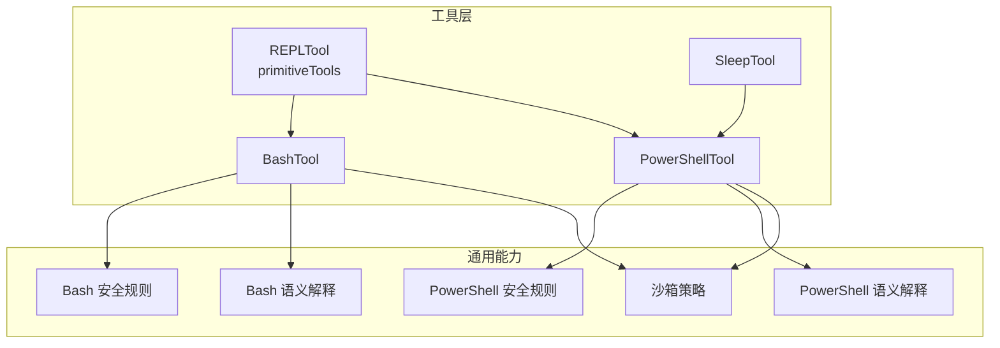
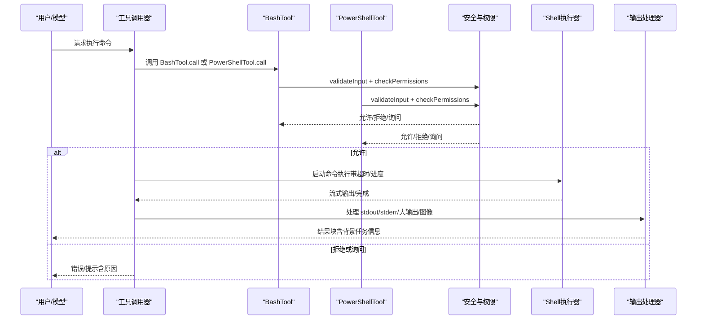
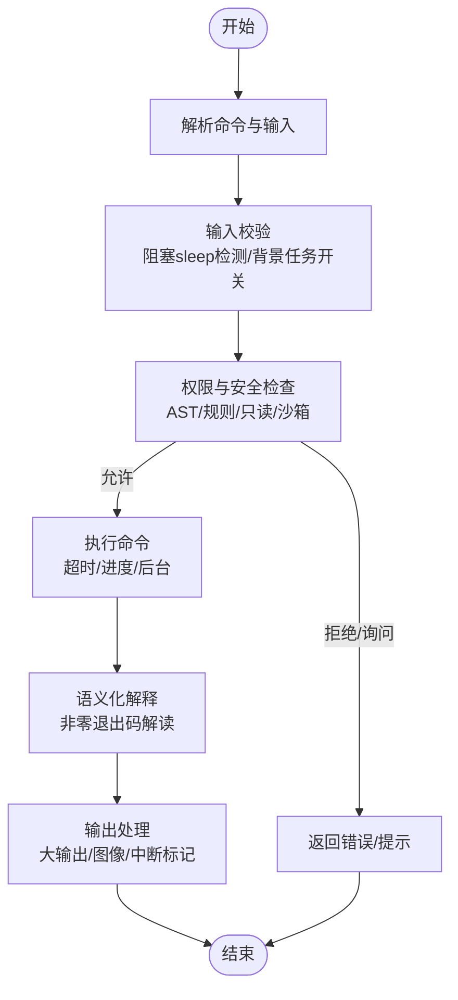
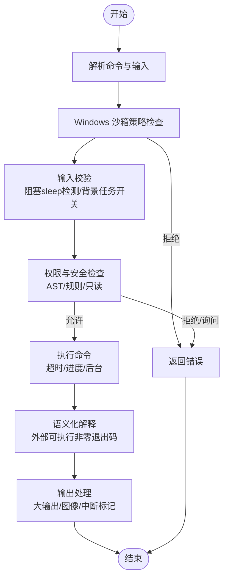
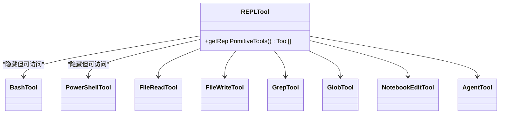
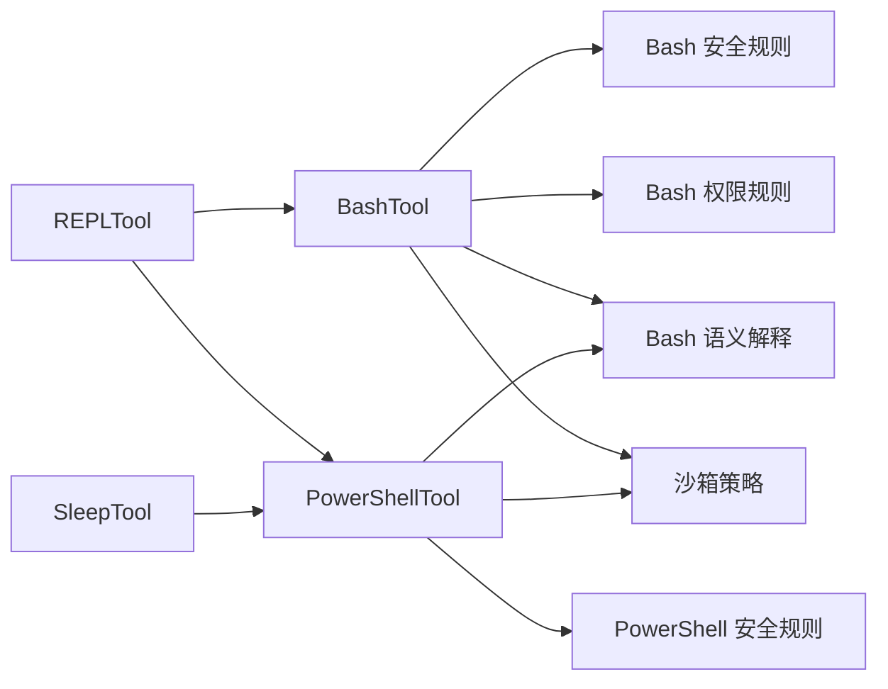

# 执行工具

<cite>
**本文引用的文件**
- [BashTool.tsx](file://src/tools/BashTool/BashTool.tsx)
- [PowerShellTool.tsx](file://src/tools/PowerShellTool/PowerShellTool.tsx)
- [primitiveTools.ts](file://src/tools/REPLTool/primitiveTools.ts)
- [prompt.ts（Sleep）](file://src/tools/SleepTool/prompt.ts)
- [bashSecurity.ts](file://src/tools/BashTool/bashSecurity.ts)
- [bashPermissions.ts](file://src/tools/BashTool/bashPermissions.ts)
- [powershellSecurity.ts](file://src/tools/PowerShellTool/powershellSecurity.ts)
- [commandSemantics.ts（Bash）](file://src/tools/BashTool/commandSemantics.ts)
- [commandSemantics.ts（PowerShell）](file://src/tools/PowerShellTool/commandSemantics.ts)
- [shouldUseSandbox.ts](file://src/tools/BashTool/shouldUseSandbox.ts)
</cite>

## 目录
1. [简介](#简介)
2. [项目结构](#项目结构)
3. [核心组件](#核心组件)
4. [架构总览](#架构总览)
5. [详细组件分析](#详细组件分析)
6. [依赖关系分析](#依赖关系分析)
7. [性能考量](#性能考量)
8. [故障排除指南](#故障排除指南)
9. [结论](#结论)
10. [附录：使用与安全实践](#附录使用与安全实践)

## 简介
本文件系统化梳理 Claude Code 的执行工具体系，重点覆盖 BashTool、PowerShellTool、REPLTool 与 SleepTool 的设计与实现，涵盖命令解析、跨平台兼容、输出处理、权限与安全防护、会话与后台任务管理等。文档旨在帮助开发者与使用者在理解工具能力的同时，安全、高效地使用这些工具。

## 项目结构
- BashTool 与 PowerShellTool 均基于统一的工具框架构建，提供输入/输出模式、权限校验、进度回调、大输出落盘与图像输出压缩、语义化退出码解释、沙箱策略与 Windows 平台策略等能力。
- REPLTool 通过隐藏基础工具集合，为 REPL 会话提供受限但可用的执行环境；SleepTool 提供轻量级延时控制，避免占用 shell 进程。

图示来源
- [BashTool.tsx](file://src/tools/BashTool/BashTool.tsx)
- [PowerShellTool.tsx](file://src/tools/PowerShellTool/PowerShellTool.tsx)
- [primitiveTools.ts](file://src/tools/REPLTool/primitiveTools.ts)
- [bashSecurity.ts](file://src/tools/BashTool/bashSecurity.ts)
- [powershellSecurity.ts](file://src/tools/PowerShellTool/powershellSecurity.ts)
- [commandSemantics.ts（Bash）](file://src/tools/BashTool/commandSemantics.ts)
- [commandSemantics.ts（PowerShell）](file://src/tools/PowerShellTool/commandSemantics.ts)
- [shouldUseSandbox.ts](file://src/tools/BashTool/shouldUseSandbox.ts)

章节来源
- [BashTool.tsx](file://src/tools/BashTool/BashTool.tsx)
- [PowerShellTool.tsx](file://src/tools/PowerShellTool/PowerShellTool.tsx)
- [primitiveTools.ts](file://src/tools/REPLTool/primitiveTools.ts)
- [prompt.ts（Sleep）](file://src/tools/SleepTool/prompt.ts)

## 核心组件
- BashTool：面向类 Unix 环境的 Shell 工具，支持命令拆分、只读判定、UI 可折叠展示、大输出持久化、图像输出压缩、沙箱策略与 Windows 沙箱策略豁免、阻塞 sleep 检测与后台自动挂起、语义化退出码解释、权限与安全规则链路。
- PowerShellTool：面向 Windows PowerShell 的工具，支持命令拆分、只读判定、UI 可折叠展示、大输出持久化、图像输出压缩、Windows 平台沙箱策略、阻塞 sleep 检测与后台自动挂起、语义化退出码解释、权限与安全规则链路。
- REPLTool：在 REPL 会话中隐藏部分基础工具，仅暴露受控集合，确保会话内可执行能力可控。
- SleepTool：提供轻量级延时控制，避免占用 shell 进程，适合轮询、节流与空闲等待场景。

章节来源
- [BashTool.tsx](file://src/tools/BashTool/BashTool.tsx)
- [PowerShellTool.tsx](file://src/tools/PowerShellTool/PowerShellTool.tsx)
- [primitiveTools.ts](file://src/tools/REPLTool/primitiveTools.ts)
- [prompt.ts（Sleep）](file://src/tools/SleepTool/prompt.ts)

## 架构总览
下图展示了 BashTool 与 PowerShellTool 的调用流程与关键模块协作关系：

图示来源
- [BashTool.tsx](file://src/tools/BashTool/BashTool.tsx)
- [PowerShellTool.tsx](file://src/tools/PowerShellTool/PowerShellTool.tsx)
- [bashSecurity.ts](file://src/tools/BashTool/bashSecurity.ts)
- [powershellSecurity.ts](file://src/tools/PowerShellTool/powershellSecurity.ts)
- [bashPermissions.ts](file://src/tools/BashTool/bashPermissions.ts)

## 详细组件分析

### BashTool 组件分析
- 功能特性
  - 命令解析与 UI 折叠：根据命令类型（搜索/读取/列表/静默）决定 UI 展示方式，提升可读性。
  - 输出处理：支持大输出落盘与预览、图像输出压缩、错误与中断标记、背景任务信息拼接。
  - 语义化解释：对 grep/rg/find/diff/test 等命令的非零退出码进行语义化解释，避免误报。
  - 权限与安全：多阶段安全检查（早期启发式、AST 解析、权限规则匹配、只读约束、沙箱策略），支持阻塞 sleep 检测与后台自动挂起。
  - 跨平台：在 Windows 上遵循平台策略（如沙箱不可用时的拒绝），在 Linux/macOS/WSL2 上默认启用沙箱。
- 关键流程
  - 输入校验：阻塞 sleep 检测、背景任务开关、schema 动态裁剪。
  - 权限校验：前缀提取、包装器剥离、环境变量剥离、规则匹配、分类器辅助。
  - 执行与进度：异步生成器驱动，支持超时、进度回调、后台任务注册。
  - 结果映射：结构化内容优先、图像块、大输出预览、背景任务提示、中断标记。
- 安全要点
  - 命令替换与注入检测：heredoc 安全模式、$()/${}/反引号、Zsh 扩展、EQUALS 展开、IFS 注入、注释/引号不同步等。
  - Git 提交消息安全：禁止命令替换与未转义重定向符，阻断危险标志。
  - jq 安全：禁用 system() 与危险文件参数。
  - 环境变量与包装器：严格剥离安全前缀，防止绕过规则匹配。
  - 沙箱策略：动态排除用户配置与策略禁用项，必要时允许显式豁免。

图示来源
- [BashTool.tsx](file://src/tools/BashTool/BashTool.tsx)
- [bashSecurity.ts](file://src/tools/BashTool/bashSecurity.ts)
- [bashPermissions.ts](file://src/tools/BashTool/bashPermissions.ts)
- [commandSemantics.ts（Bash）](file://src/tools/BashTool/commandSemantics.ts)
- [shouldUseSandbox.ts](file://src/tools/BashTool/shouldUseSandbox.ts)

章节来源
- [BashTool.tsx](file://src/tools/BashTool/BashTool.tsx)
- [bashSecurity.ts](file://src/tools/BashTool/bashSecurity.ts)
- [bashPermissions.ts](file://src/tools/BashTool/bashPermissions.ts)
- [commandSemantics.ts（Bash）](file://src/tools/BashTool/commandSemantics.ts)
- [shouldUseSandbox.ts](file://src/tools/BashTool/shouldUseSandbox.ts)

### PowerShellTool 组件分析
- 功能特性
  - 命令解析与 UI 折叠：按 cmdlet 类型（搜索/读取/静默）决定 UI 展示。
  - 输出处理：大输出落盘与预览、图像输出压缩、错误与中断标记、背景任务信息拼接。
  - 语义化解释：针对外部可执行（grep/rg/findstr/robocopy）的非零退出码进行语义化解释。
  - 权限与安全：AST 驱动的安全检查（Invoke-Expression、动态命令名、下载链、COM 对象、脚本块注入、成员调用、类型限制等），Windows 沙箱策略强制拒绝。
  - 跨平台：Windows 原生不支持沙箱，若企业策略要求沙箱则直接拒绝执行。
- 关键流程
  - 输入校验：Windows 沙箱策略检查、阻塞 sleep 检测、背景任务开关。
  - 权限校验：同步安全启发式（正则/关键字）与异步 AST 分析结合。
  - 执行与进度：异步生成器驱动，支持超时、进度回调、后台任务注册。
  - 结果映射：结构化内容优先、图像块、大输出预览、背景任务提示、中断标记。
- 安全要点
  - 下载链：IWR/IRM/New-Object/Start-BitsTransfer 等组合触发高危提示。
  - 动态执行：Invoke-Expression、动态命令名、子表达式、可展开字符串、Splatting、停止解析令牌等均触发高危提示。
  - 脚本块注入：除安全过滤/输出 cmdlet 外，其他危险 cmdlet 触发高危提示。
  - COM 对象与成员调用：实例化 COM 对象或成员调用触发高危提示。
  - 类型限制：不在 ConstrainedLanguage 允许清单中的 .NET 类型触发高危提示。

图示来源
- [PowerShellTool.tsx](file://src/tools/PowerShellTool/PowerShellTool.tsx)
- [powershellSecurity.ts](file://src/tools/PowerShellTool/powershellSecurity.ts)
- [commandSemantics.ts（PowerShell）](file://src/tools/PowerShellTool/commandSemantics.ts)

章节来源
- [PowerShellTool.tsx](file://src/tools/PowerShellTool/PowerShellTool.tsx)
- [powershellSecurity.ts](file://src/tools/PowerShellTool/powershellSecurity.ts)
- [commandSemantics.ts（PowerShell）](file://src/tools/PowerShellTool/commandSemantics.ts)

### REPLTool 组件分析
- 功能特性
  - 在 REPL 会话中隐藏部分基础工具，仅暴露受控集合（文件读写、搜索、Bash、笔记本编辑、代理工具等），确保会话内可执行能力可控。
  - 通过延迟初始化避免循环依赖，保证渲染侧能识别虚拟消息类型。
- 使用场景
  - 交互式编程与探索，限制潜在风险命令的直接调用，同时保留必要的开发工具。

图示来源
- [primitiveTools.ts](file://src/tools/REPLTool/primitiveTools.ts)

章节来源
- [primitiveTools.ts](file://src/tools/REPLTool/primitiveTools.ts)

### SleepTool 组件分析
- 功能特性
  - 轻量级延时控制，避免占用 shell 进程，适合轮询、节流与空闲等待。
  - 支持用户中断，API 调用成本低，提示缓存过期后仍可平衡使用。
- 使用建议
  - 优先使用 SleepTool 替代 Bash(sleep ...)，减少进程占用与资源消耗。

章节来源
- [prompt.ts（Sleep）](file://src/tools/SleepTool/prompt.ts)

## 依赖关系分析
- BashTool 与 PowerShellTool 共享通用能力：
  - 输入/输出模式、进度回调、大输出持久化、图像压缩、语义化解释、权限与安全规则链路。
  - 沙箱策略与平台策略（Windows 沙箱不可用时的拒绝）。
- REPLTool 依赖基础工具集合，通过延迟初始化避免循环依赖。
- SleepTool 作为独立工具，提供轻量延时控制。

图示来源
- [BashTool.tsx](file://src/tools/BashTool/BashTool.tsx)
- [PowerShellTool.tsx](file://src/tools/PowerShellTool/PowerShellTool.tsx)
- [bashSecurity.ts](file://src/tools/BashTool/bashSecurity.ts)
- [bashPermissions.ts](file://src/tools/BashTool/bashPermissions.ts)
- [powershellSecurity.ts](file://src/tools/PowerShellTool/powershellSecurity.ts)
- [commandSemantics.ts（Bash）](file://src/tools/BashTool/commandSemantics.ts)
- [commandSemantics.ts（PowerShell）](file://src/tools/PowerShellTool/commandSemantics.ts)
- [shouldUseSandbox.ts](file://src/tools/BashTool/shouldUseSandbox.ts)
- [primitiveTools.ts](file://src/tools/REPLTool/primitiveTools.ts)
- [prompt.ts（Sleep）](file://src/tools/SleepTool/prompt.ts)

章节来源
- [BashTool.tsx](file://src/tools/BashTool/BashTool.tsx)
- [PowerShellTool.tsx](file://src/tools/PowerShellTool/PowerShellTool.tsx)
- [bashSecurity.ts](file://src/tools/BashTool/bashSecurity.ts)
- [bashPermissions.ts](file://src/tools/BashTool/bashPermissions.ts)
- [powershellSecurity.ts](file://src/tools/PowerShellTool/powershellSecurity.ts)
- [commandSemantics.ts（Bash）](file://src/tools/BashTool/commandSemantics.ts)
- [commandSemantics.ts（PowerShell）](file://src/tools/PowerShellTool/commandSemantics.ts)
- [shouldUseSandbox.ts](file://src/tools/BashTool/shouldUseSandbox.ts)
- [primitiveTools.ts](file://src/tools/REPLTool/primitiveTools.ts)
- [prompt.ts（Sleep）](file://src/tools/SleepTool/prompt.ts)

## 性能考量
- 异步生成器与进度回调：BashTool 与 PowerShellTool 均采用异步生成器驱动执行，支持超时与进度回调，避免长时间阻塞事件循环。
- 大输出落盘与预览：超过阈值的输出自动落盘并生成预览，降低内存压力与传输成本。
- 图像输出压缩：对终端图像输出进行尺寸与分辨率压缩，减少带宽与渲染开销。
- 背景任务与自动挂起：长耗时命令在助手模式下自动转入后台，保持对话响应性。
- 命令解析与安全检查：复杂复合命令的解析与安全检查存在上限（如 BashTool 的子命令数量上限），避免 ReDoS 与事件循环饥饿。

## 故障排除指南
- 命令被拒绝或需要确认
  - 检查是否命中阻塞 sleep 检测（BashTool/PowerShellTool 均会拦截长时间 sleep 的首条语句）。
  - 查看权限规则匹配结果，必要时添加精确/前缀/通配规则以允许。
  - 若为 Windows 原生 PowerShell，检查企业策略是否要求沙箱且当前平台不支持沙箱。
- 输出过大导致内存不足
  - 确认大输出已落盘并生成预览；必要时通过文件读取工具进一步处理。
- 退出码误判
  - BashTool：确认命令是否属于语义化解释范围（如 grep/rg/find/diff/test）。
  - PowerShellTool：确认外部可执行的退出码语义（如 robocopy 的位掩码）。
- 中断与超时
  - 用户主动中断会标记 interrupted；超时会触发异常；两者均会在结果中标记。
- 图像输出异常
  - 确认图像尺寸与大小是否超过限制；必要时调整输出或使用预览。

章节来源
- [BashTool.tsx](file://src/tools/BashTool/BashTool.tsx)
- [PowerShellTool.tsx](file://src/tools/PowerShellTool/PowerShellTool.tsx)
- [commandSemantics.ts（Bash）](file://src/tools/BashTool/commandSemantics.ts)
- [commandSemantics.ts（PowerShell）](file://src/tools/PowerShellTool/commandSemantics.ts)

## 结论
BashTool 与 PowerShellTool 在统一的工具框架下实现了强大的命令执行能力，配合严格的权限与安全规则、跨平台策略、语义化解释与后台任务管理，既保证了易用性，也强化了安全性。REPLTool 与 SleepTool 则分别提供了会话控制与轻量延时能力，形成完整的执行工具生态。

## 附录：使用与安全实践
- 命令注入防护
  - 避免在用户输入中直接拼接命令；使用工具提供的输入模式与权限规则。
  - 注意 heredoc 安全模式、命令替换与注释/引号不同步等风险点。
- 权限限制
  - 通过权限规则（精确/前缀/通配）精细化控制命令执行；避免使用裸 shell 前缀与危险包装器。
  - Windows 原生 PowerShell 若企业策略要求沙箱且平台不支持，则需调整执行策略或使用替代方案。
- 资源管理
  - 合理设置超时与后台任务；对大输出启用落盘与预览；避免长时间阻塞。
  - 使用 SleepTool 替代 Bash(sleep ...)，减少资源占用。
- 实际使用案例
  - 搜索与查看：使用 BashTool 的搜索/读取命令自动折叠 UI，快速定位信息。
  - 文件操作：通过 FileRead/Write/Grep 等工具在 REPL 会话中安全地探索与修改文件。
  - 跨平台脚本：PowerShellTool 在 Windows 上执行脚本，注意下载链与动态执行风险。