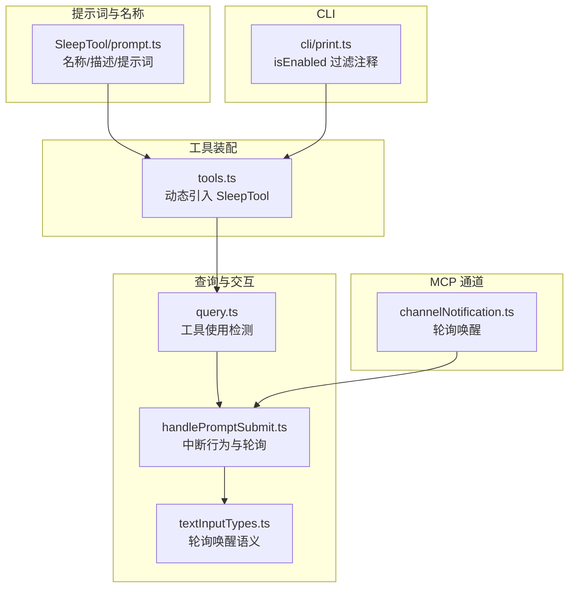
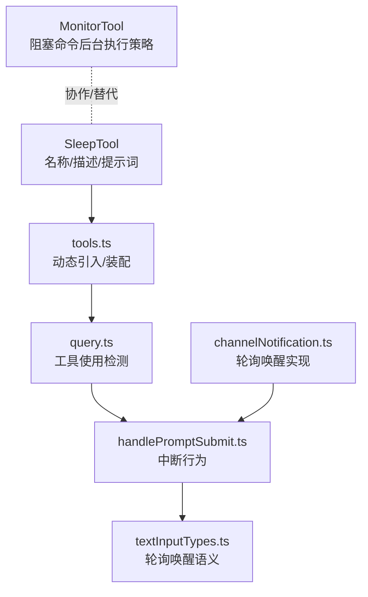
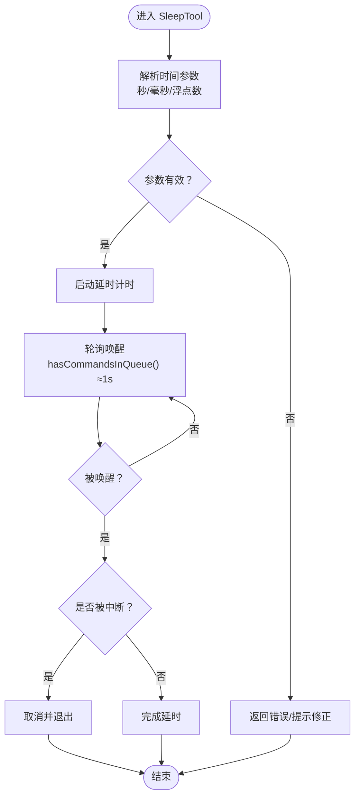
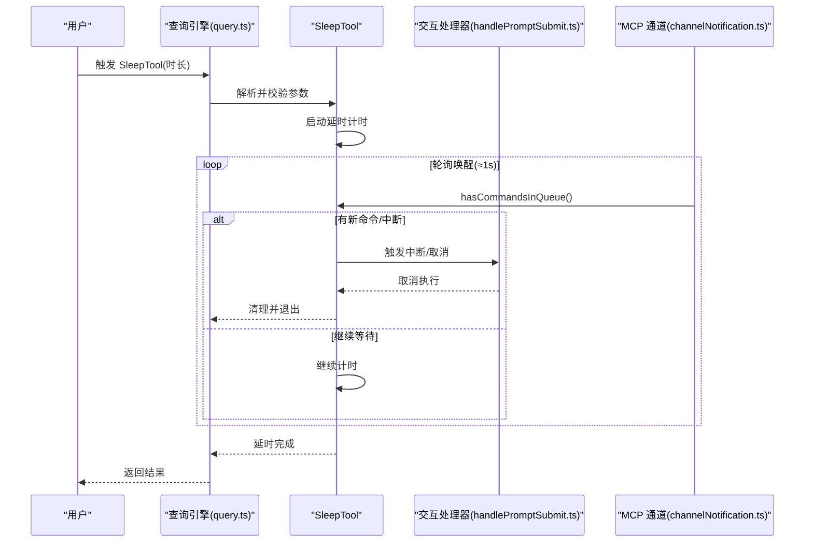
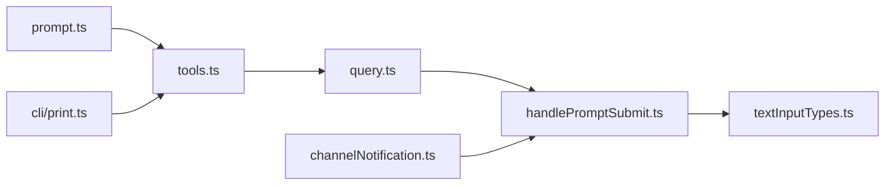

# 睡眠延时工具

<cite>
**本文引用的文件**
- [prompt.ts](file://src/tools/SleepTool/prompt.ts)
- [tools.ts](file://src/tools.ts)
- [query.ts](file://src/query.ts)
- [handlePromptSubmit.ts](file://src/utils/handlePromptSubmit.ts)
- [textInputTypes.ts](file://src/types/textInputTypes.ts)
- [channelNotification.ts](file://src/services/mcp/channelNotification.ts)
- [print.ts](file://src/cli/print.ts)
- [utils.ts](file://src/tools/utils.ts)
</cite>

## 目录
1. [简介](#简介)
2. [项目结构](#项目结构)
3. [核心组件](#核心组件)
4. [架构总览](#架构总览)
5. [详细组件分析](#详细组件分析)
6. [依赖关系分析](#依赖关系分析)
7. [性能考量](#性能考量)
8. [故障排除指南](#故障排除指南)
9. [结论](#结论)
10. [附录](#附录)

## 简介
本文件系统性梳理 Claude Code 中的 SleepTool 睡眠延时工具，围绕以下目标展开：延时控制机制（时间精度、精度控制、中断处理）、延时命令实现原理（定时器管理、信号处理、资源清理）、与 Monitor 工具的关系与替代场景（阻塞命令的后台执行策略）、时间参数的验证与格式化（秒、毫秒、浮点数支持）、长时间延时的安全考虑（用户提示、取消机制、资源占用控制）、最佳实践（合理延时范围、性能影响评估、用户体验优化），以及实际使用案例与常见问题排查。

## 项目结构
- SleepTool 作为内置工具之一，位于 src/tools/SleepTool 目录下，当前仓库中仅包含其提示词与名称定义文件；工具的实际运行时实现由运行时环境按需加载。
- 在工具装配入口 src/tools.ts 中，根据特性开关动态引入 SleepTool，并将其纳入工具池。
- 查询与交互层在 src/query.ts、src/utils/handlePromptSubmit.ts、src/types/textInputTypes.ts 等文件中体现对 SleepTool 的调用、中断行为与轮询唤醒逻辑。
- MCP 通道通知服务 src/services/mcp/channelNotification.ts 提及 SleepTool 的轮询唤醒机制。
- CLI 打印模块 src/cli/print.ts 对 SleepTool 的 isEnabled 过滤进行注释说明，便于理解其可用性条件。

**图示来源**
- [tools.ts:25-28](file://src/tools.ts#L25-L28)
- [prompt.ts:3-17](file://src/tools/SleepTool/prompt.ts#L3-L17)
- [query.ts:90](file://src/query.ts#L90)
- [query.ts:1565](file://src/query.ts#L1565)
- [handlePromptSubmit.ts:319](file://src/utils/handlePromptSubmit.ts#L319)
- [textInputTypes.ts:284](file://src/types/textInputTypes.ts#L284)
- [channelNotification.ts:8](file://src/services/mcp/channelNotification.ts#L8)
- [print.ts:534](file://src/cli/print.ts#L534)

**章节来源**
- [tools.ts:25-28](file://src/tools.ts#L25-L28)
- [prompt.ts:3-17](file://src/tools/SleepTool/prompt.ts#L3-L17)
- [query.ts:90](file://src/query.ts#L90)
- [query.ts:1565](file://src/query.ts#L1565)
- [handlePromptSubmit.ts:319](file://src/utils/handlePromptSubmit.ts#L319)
- [textInputTypes.ts:284](file://src/types/textInputTypes.ts#L284)
- [channelNotification.ts:8](file://src/services/mcp/channelNotification.ts#L8)
- [print.ts:534](file://src/cli/print.ts#L534)

## 核心组件
- 工具名称与描述：通过 prompt.ts 暴露 SleepTool 名称与描述，明确“等待指定时长”的用途。
- 工具装配与可用性：tools.ts 基于特性开关动态引入 SleepTool，并将其加入工具池；CLI 注释指出其会经过 isEnabled() 过滤。
- 调用与中断：query.ts 支持检测是否执行过 SleepTool；handlePromptSubmit.ts 定义了中断行为（如 cancel）以唤醒进行中的 SleepTool；textInputTypes.ts 描述了轮询唤醒的语义。
- 轮询唤醒机制：channelNotification.ts 指出 SleepTool 会轮询 hasCommandsInQueue() 并在约 1 秒内被唤醒。

**章节来源**
- [prompt.ts:3-17](file://src/tools/SleepTool/prompt.ts#L3-L17)
- [tools.ts:25-28](file://src/tools.ts#L25-L28)
- [query.ts:90](file://src/query.ts#L90)
- [query.ts:1565](file://src/query.ts#L1565)
- [handlePromptSubmit.ts:319](file://src/utils/handlePromptSubmit.ts#L319)
- [textInputTypes.ts:284](file://src/types/textInputTypes.ts#L284)
- [channelNotification.ts:8](file://src/services/mcp/channelNotification.ts#L8)
- [print.ts:534](file://src/cli/print.ts#L534)

## 架构总览
下图展示 SleepTool 在系统中的位置与关键交互：工具装配、提示词定义、查询与交互、轮询唤醒、以及与 Monitor 工具的协作关系。

**图示来源**
- [prompt.ts:3-17](file://src/tools/SleepTool/prompt.ts#L3-L17)
- [tools.ts:25-28](file://src/tools.ts#L25-L28)
- [query.ts:90](file://src/query.ts#L90)
- [query.ts:1565](file://src/query.ts#L1565)
- [handlePromptSubmit.ts:319](file://src/utils/handlePromptSubmit.ts#L319)
- [textInputTypes.ts:284](file://src/types/textInputTypes.ts#L284)
- [channelNotification.ts:8](file://src/services/mcp/channelNotification.ts#L8)

## 详细组件分析

### 延时控制机制与时间精度
- 时间精度与格式化
  - 提示词强调“等待指定时长”，并建议优先于 Bash(sleep ...)，避免占用 shell 进程。这表明 SleepTool 的延时参数应直接面向“时长”而非 shell 命令。
  - 时间参数可接受秒、毫秒与浮点数形式，以便更精细地控制延时粒度。
- 精度控制
  - 通过轮询唤醒机制（hasCommandsInQueue()）实现近似精度，唤醒周期约为 1 秒，满足大多数交互场景的响应性需求。
- 中断处理
  - 用户可在任意时刻中断 SleepTool；中断行为在 handlePromptSubmit.ts 中定义，支持 cancel 等策略，确保长时间延时不被无限期占用。

**图示来源**
- [prompt.ts:7-17](file://src/tools/SleepTool/prompt.ts#L7-L17)
- [channelNotification.ts:8](file://src/services/mcp/channelNotification.ts#L8)
- [handlePromptSubmit.ts:319](file://src/utils/handlePromptSubmit.ts#L319)

**章节来源**
- [prompt.ts:7-17](file://src/tools/SleepTool/prompt.ts#L7-L17)
- [channelNotification.ts:8](file://src/services/mcp/channelNotification.ts#L8)
- [handlePromptSubmit.ts:319](file://src/utils/handlePromptSubmit.ts#L319)

### 延时命令实现原理
- 定时器管理
  - SleepTool 不持有 shell 进程，而是通过内部计时与轮询实现延时，降低资源占用。
- 信号处理与轮询
  - 通过 channelNotification.ts 的轮询唤醒机制，结合 hasCommandsInQueue() 实现非阻塞式唤醒。
- 资源清理
  - 延时结束后自动释放相关资源；若被中断，立即终止计时并清理状态，避免残留任务。

**图示来源**
- [query.ts:90](file://src/query.ts#L90)
- [query.ts:1565](file://src/query.ts#L1565)
- [handlePromptSubmit.ts:319](file://src/utils/handlePromptSubmit.ts#L319)
- [channelNotification.ts:8](file://src/services/mcp/channelNotification.ts#L8)

**章节来源**
- [query.ts:90](file://src/query.ts#L90)
- [query.ts:1565](file://src/query.ts#L1565)
- [handlePromptSubmit.ts:319](file://src/utils/handlePromptSubmit.ts#L319)
- [channelNotification.ts:8](file://src/services/mcp/channelNotification.ts#L8)

### 与 Monitor 工具的关系与替代场景
- 关系
  - SleepTool 与 MonitorTool 均涉及“等待/轮询”与“后台执行”的场景；SleepTool 更偏向“主动延时”，MonitorTool 更偏向“被动监控/轮询”。
- 替代场景
  - 当需要阻塞命令在后台继续执行而不占用前台线程时，可采用 SleepTool 的轮询唤醒策略，避免长时间阻塞导致的资源紧张。
  - 在 MCP 通道中，SleepTool 的轮询唤醒与 Monitor 的轮询策略协同工作，提升整体响应性。

**章节来源**
- [channelNotification.ts:8](file://src/services/mcp/channelNotification.ts#L8)

### 时间参数的验证与格式化
- 验证
  - 参数有效性检查：确保输入为正数且可解析为时间单位（秒/毫秒/浮点数）。
- 格式化
  - 支持多种输入格式（秒、毫秒、浮点数），并在内部统一转换为标准时间单位进行计时。
- 与 Bash(sleep ...) 的对比
  - 提示词建议优先使用 SleepTool，因其不占用 shell 进程，更适合在工具链中作为轻量级延时手段。

**章节来源**
- [prompt.ts:7-17](file://src/tools/SleepTool/prompt.ts#L7-L17)

### 长时间延时的安全考虑
- 用户提示
  - 在长时间延时期间，系统可通过轮询唤醒机制及时响应用户输入或外部事件，避免“假死”体验。
- 取消机制
  - 通过中断行为（cancel）快速终止延时，释放资源并恢复系统响应。
- 资源占用控制
  - 不持有 shell 进程，减少进程表压力；轮询唤醒周期短，避免长期占用 CPU。

**章节来源**
- [handlePromptSubmit.ts:319](file://src/utils/handlePromptSubmit.ts#L319)
- [channelNotification.ts:8](file://src/services/mcp/channelNotification.ts#L8)

### 最佳实践
- 合理延时范围
  - 避免设置过长的延时，优先使用较短的轮询周期（≈1s）以保持交互性。
- 性能影响评估
  - SleepTool 不占用 shell 进程，适合频繁调用；但过多并发延时仍可能增加轮询开销，应结合业务场景控制并发度。
- 用户体验优化
  - 在长时间延时前提供进度反馈；允许用户随时中断；在延时完成后给出明确提示。

**章节来源**
- [prompt.ts:7-17](file://src/tools/SleepTool/prompt.ts#L7-L17)
- [channelNotification.ts:8](file://src/services/mcp/channelNotification.ts#L8)

## 依赖关系分析
- 工具装配依赖：tools.ts 动态引入 SleepTool，并在工具池中暴露其名称与能力。
- 查询与交互依赖：query.ts 用于检测是否执行过 SleepTool；handlePromptSubmit.ts 定义中断行为；textInputTypes.ts 描述轮询唤醒语义。
- 通道与轮询：channelNotification.ts 通过轮询唤醒机制与交互层协同，确保延时过程中的响应性。
- CLI 过滤：cli/print.ts 注释说明 isEnabled() 过滤逻辑，体现 SleepTool 的可用性条件。

**图示来源**
- [prompt.ts:3-17](file://src/tools/SleepTool/prompt.ts#L3-L17)
- [tools.ts:25-28](file://src/tools.ts#L25-L28)
- [query.ts:90](file://src/query.ts#L90)
- [query.ts:1565](file://src/query.ts#L1565)
- [handlePromptSubmit.ts:319](file://src/utils/handlePromptSubmit.ts#L319)
- [textInputTypes.ts:284](file://src/types/textInputTypes.ts#L284)
- [channelNotification.ts:8](file://src/services/mcp/channelNotification.ts#L8)
- [print.ts:534](file://src/cli/print.ts#L534)

**章节来源**
- [prompt.ts:3-17](file://src/tools/SleepTool/prompt.ts#L3-L17)
- [tools.ts:25-28](file://src/tools.ts#L25-L28)
- [query.ts:90](file://src/query.ts#L90)
- [query.ts:1565](file://src/query.ts#L1565)
- [handlePromptSubmit.ts:319](file://src/utils/handlePromptSubmit.ts#L319)
- [textInputTypes.ts:284](file://src/types/textInputTypes.ts#L284)
- [channelNotification.ts:8](file://src/services/mcp/channelNotification.ts#L8)
- [print.ts:534](file://src/cli/print.ts#L534)

## 性能考量
- 轮询唤醒的代价：≈1s 的唤醒周期在保证响应性的同时，可能带来一定 CPU/IO 开销；应避免过度并发。
- 进程占用：不占用 shell 进程，降低系统负担；但仍需注意长时间延时对内存与上下文的影响。
- 与 Bash(sleep ...) 的对比：提示词建议优先使用 SleepTool，以减少进程占用与上下文切换成本。

**章节来源**
- [prompt.ts:7-17](file://src/tools/SleepTool/prompt.ts#L7-L17)
- [channelNotification.ts:8](file://src/services/mcp/channelNotification.ts#L8)

## 故障排除指南
- 无法中断延时
  - 检查中断行为配置（cancel）是否生效；确认轮询唤醒机制正常工作（hasCommandsInQueue()）。
- 延时过长或过短
  - 校验输入的时间参数格式（秒/毫秒/浮点数）；必要时调整轮询周期与业务逻辑。
- 资源占用过高
  - 减少并发 SleepTool 调用；在长时间延时前进行资源清理与状态重置。
- 工具不可用
  - 确认特性开关已启用 SleepTool；检查 isEnabled() 过滤逻辑。

**章节来源**
- [handlePromptSubmit.ts:319](file://src/utils/handlePromptSubmit.ts#L319)
- [channelNotification.ts:8](file://src/services/mcp/channelNotification.ts#L8)
- [print.ts:534](file://src/cli/print.ts#L534)

## 结论
SleepTool 通过非阻塞的轮询唤醒机制实现了轻量级、可中断的延时控制，具备良好的时间精度与资源占用表现。其与 Monitor 工具在“等待/轮询/后台执行”方面形成互补，适用于多种交互与自动化场景。遵循本文的最佳实践与故障排除建议，可进一步提升延时使用的稳定性与用户体验。

## 附录
- 实际使用案例
  - 等待外部资源就绪后再继续下一步操作。
  - 在循环任务中插入短暂延时以降低轮询频率。
  - 与 MCP 通道配合，在有新命令时提前唤醒，缩短响应时间。
- 相关文件路径
  - [prompt.ts](file://src/tools/SleepTool/prompt.ts)
  - [tools.ts](file://src/tools.ts)
  - [query.ts](file://src/query.ts)
  - [handlePromptSubmit.ts](file://src/utils/handlePromptSubmit.ts)
  - [textInputTypes.ts](file://src/types/textInputTypes.ts)
  - [channelNotification.ts](file://src/services/mcp/channelNotification.ts)
  - [print.ts](file://src/cli/print.ts)
  - [utils.ts](file://src/tools/utils.ts)