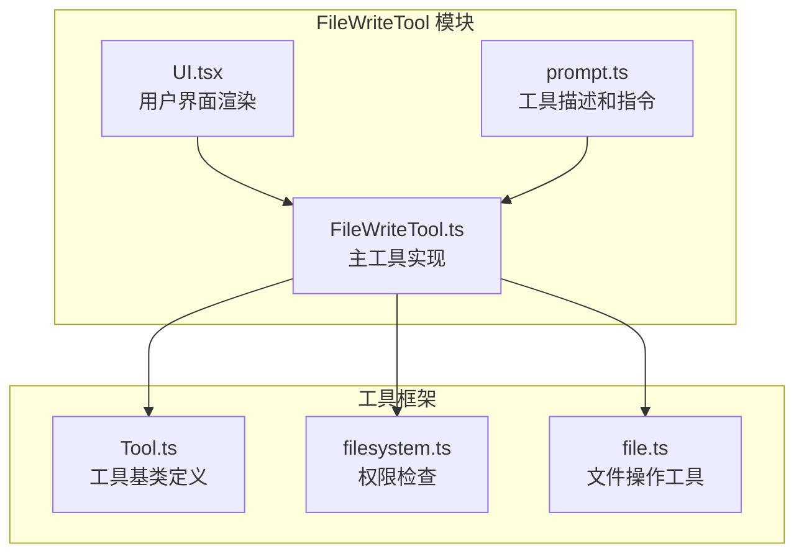
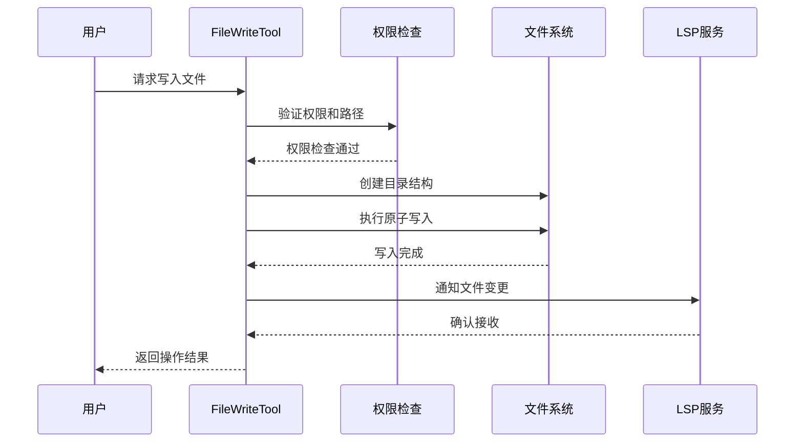
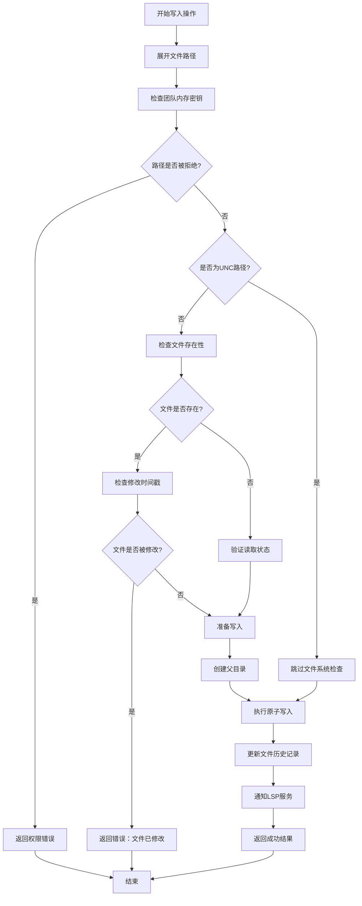
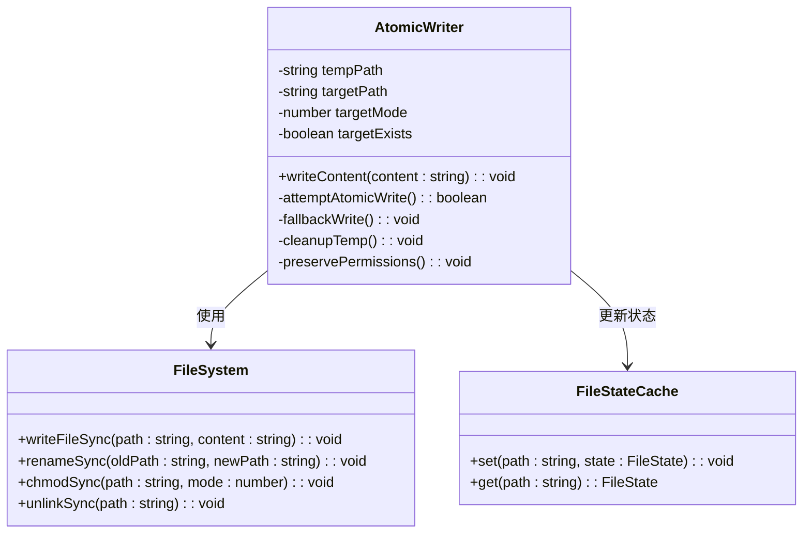
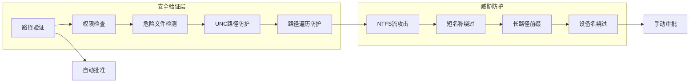
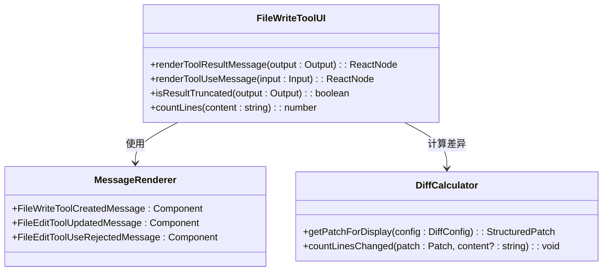
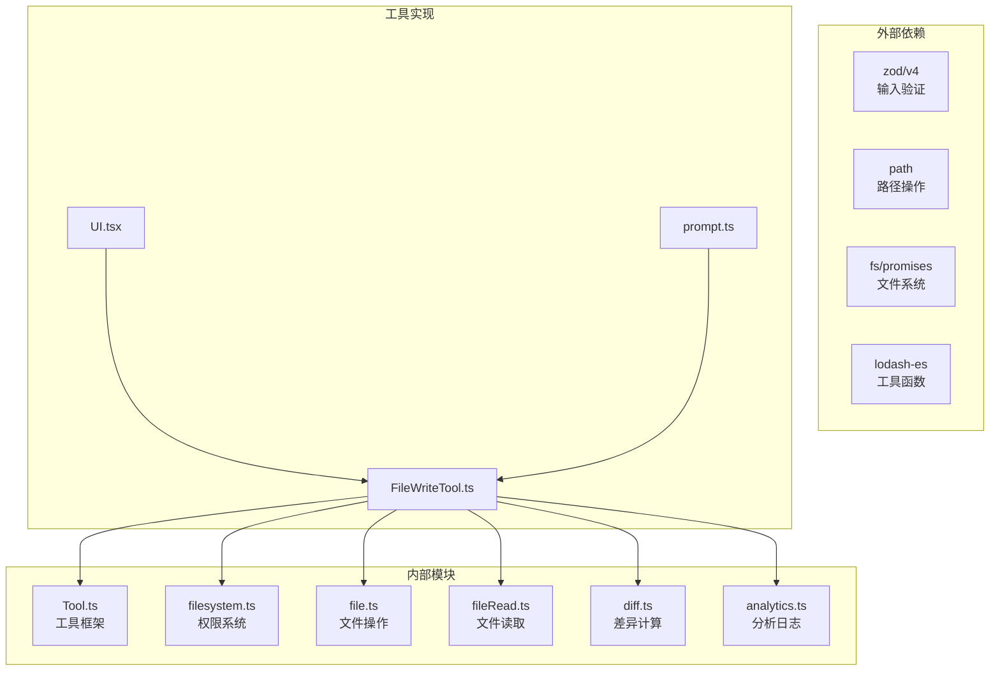

# 文件写入工具 (FileWriteTool)

<cite>
**本文档引用的文件**
- [FileWriteTool.ts](file://src/tools/FileWriteTool/FileWriteTool.ts)
- [UI.tsx](file://src/tools/FileWriteTool/UI.tsx)
- [prompt.ts](file://src/tools/FileWriteTool/prompt.ts)
- [Tool.ts](file://src/Tool.ts)
- [filesystem.ts](file://src/utils/permissions/filesystem.ts)
- [file.ts](file://src/utils/file.ts)
</cite>

## 目录
1. [简介](#简介)
2. [项目结构](#项目结构)
3. [核心组件](#核心组件)
4. [架构概览](#架构概览)
5. [详细组件分析](#详细组件分析)
6. [依赖关系分析](#依赖关系分析)
7. [性能考虑](#性能考虑)
8. [故障排除指南](#故障排除指南)
9. [结论](#结论)

## 简介

FileWriteTool 是 Claude Code 中的一个核心工具，用于在本地文件系统中执行安全的文件写入操作。该工具提供了完整的文件写入功能，包括新文件创建、现有文件覆盖和追加写入模式，并实现了严格的安全措施和原子写入机制。

该工具的主要特性包括：
- 支持新文件创建和现有文件覆盖
- 实现原子写入以防止数据损坏
- 提供文件权限检查和路径验证
- 支持文件内容验证和编码转换
- 实现行尾符处理和安全过滤
- 提供详细的错误处理和诊断信息

## 项目结构

FileWriteTool 位于工具模块的专用目录中，采用清晰的分层架构：

**图表来源**
- [FileWriteTool.ts:1-436](file://src/tools/FileWriteTool/FileWriteTool.ts#L1-L436)
- [UI.tsx:1-406](file://src/tools/FileWriteTool/UI.tsx#L1-L406)
- [prompt.ts:1-20](file://src/tools/FileWriteTool/prompt.ts#L1-L20)

**章节来源**
- [FileWriteTool.ts:1-50](file://src/tools/FileWriteTool/FileWriteTool.ts#L1-L50)
- [UI.tsx:1-30](file://src/tools/FileWriteTool/UI.tsx#L1-L30)

## 核心组件

### 主要功能模块

FileWriteTool 由三个核心组件构成：

1. **FileWriteTool.ts**: 主要的工具实现，包含完整的文件写入逻辑
2. **UI.tsx**: 用户界面渲染组件，负责结果展示和交互
3. **prompt.ts**: 工具描述和使用指令

### 工具配置参数

工具支持以下输入参数：
- `file_path`: 目标文件的绝对路径
- `content`: 要写入的文件内容

输出结果包含：
- `type`: 操作类型（创建或更新）
- `filePath`: 文件路径
- `content`: 写入的内容
- `structuredPatch`: 结构化差异补丁
- `originalFile`: 原始文件内容
- `gitDiff`: Git 差异信息（可选）

**章节来源**
- [FileWriteTool.ts:56-89](file://src/tools/FileWriteTool/FileWriteTool.ts#L56-L89)
- [UI.tsx:350-404](file://src/tools/FileWriteTool/UI.tsx#L350-L404)

## 架构概览

FileWriteTool 采用分层架构设计，确保了安全性、可靠性和可维护性：

**图表来源**
- [FileWriteTool.ts:223-417](file://src/tools/FileWriteTool/FileWriteTool.ts#L223-L417)
- [filesystem.ts:620-665](file://src/utils/permissions/filesystem.ts#L620-L665)

## 详细组件分析

### 文件写入核心流程

FileWriteTool 的写入流程经过精心设计，确保了数据完整性和安全性：

**图表来源**
- [FileWriteTool.ts:153-222](file://src/tools/FileWriteTool/FileWriteTool.ts#L153-L222)
- [FileWriteTool.ts:229-337](file://src/tools/FileWriteTool/FileWriteTool.ts#L229-L337)

### 原子写入机制

FileWriteTool 实现了可靠的原子写入机制，防止部分写入导致的数据损坏：

**图表来源**
- [file.ts:362-478](file://src/utils/file.ts#L362-L478)

### 安全验证机制

工具实施了多层次的安全验证，确保操作的安全性：

**图表来源**
- [filesystem.ts:435-488](file://src/utils/permissions/filesystem.ts#L435-L488)
- [filesystem.ts:537-602](file://src/utils/permissions/filesystem.ts#L537-L602)

**章节来源**
- [FileWriteTool.ts:153-222](file://src/tools/FileWriteTool/FileWriteTool.ts#L153-L222)
- [file.ts:362-478](file://src/utils/file.ts#L362-L478)

### 用户界面渲染

UI 组件提供了直观的结果展示和交互体验：

**图表来源**
- [UI.tsx:39-127](file://src/tools/FileWriteTool/UI.tsx#L39-L127)
- [UI.tsx:362-404](file://src/tools/FileWriteTool/UI.tsx#L362-L404)

**章节来源**
- [UI.tsx:310-349](file://src/tools/FileWriteTool/UI.tsx#L310-L349)
- [UI.tsx:350-404](file://src/tools/FileWriteTool/UI.tsx#L350-L404)

## 依赖关系分析

FileWriteTool 依赖于多个核心模块，形成了完整的工具生态系统：

**图表来源**
- [FileWriteTool.ts:1-55](file://src/tools/FileWriteTool/FileWriteTool.ts#L1-L55)

**章节来源**
- [Tool.ts:1-795](file://src/Tool.ts#L1-L795)
- [filesystem.ts:1-800](file://src/utils/permissions/filesystem.ts#L1-L800)

## 性能考虑

FileWriteTool 在设计时充分考虑了性能优化：

### 异步操作优化
- 使用异步文件系统调用避免阻塞主线程
- 实现文件状态缓存减少重复 I/O 操作
- 采用非阻塞的原子写入机制

### 内存管理
- 实现文件大小限制防止内存溢出
- 使用流式处理大文件内容
- 及时清理临时文件和缓存

### 缓存策略
- 文件读取状态缓存
- 路径解析结果缓存
- LSP 服务器连接缓存

**章节来源**
- [FileWriteTool.ts:254-264](file://src/tools/FileWriteTool/FileWriteTool.ts#L254-L264)
- [file.ts:48-49](file://src/utils/file.ts#L48-L49)

## 故障排除指南

### 常见错误及解决方案

| 错误类型 | 错误码 | 描述 | 解决方案 |
|---------|--------|------|----------|
| 权限拒绝 | 1 | 文件在被拒绝的目录中 | 检查权限设置，添加允许规则 |
| 未读取文件 | 2 | 文件尚未读取就尝试写入 | 先使用 FileReadTool 读取文件 |
| 文件修改冲突 | 3 | 文件自上次读取后已被修改 | 重新读取文件后重试 |
| UNC路径风险 | 0 | UNC路径可能泄露凭据 | 使用本地路径或手动审批 |

### 调试技巧

1. **启用调试模式**: 设置环境变量查看详细日志
2. **检查文件状态**: 使用 `getFileModificationTime` 验证文件时间戳
3. **验证路径**: 使用 `expandPath` 确保路径正确解析
4. **监控原子写入**: 查看 `tengu_atomic_write_error` 事件

**章节来源**
- [FileWriteTool.ts:170-221](file://src/tools/FileWriteTool/FileWriteTool.ts#L170-L221)
- [file.ts:440-477](file://src/utils/file.ts#L440-L477)

## 结论

FileWriteTool 是一个设计精良的文件写入工具，具有以下突出特点：

### 安全性优势
- 多层次安全验证机制
- 原子写入防止数据损坏
- 严格的权限控制和路径验证
- 防护各种已知的路径攻击

### 功能完整性
- 支持新文件创建和现有文件覆盖
- 提供详细的差异显示和统计
- 实现智能的编码和行尾符处理
- 集成 LSP 和 VSCode 支持

### 性能优化
- 异步操作避免阻塞
- 智能缓存策略
- 流式处理大文件
- 最小化磁盘 I/O 操作

### 开发友好性
- 清晰的错误消息和诊断信息
- 完善的文档和使用示例
- 灵活的配置选项
- 与 Claude Code 生态系统的无缝集成

FileWriteTool 代表了现代开发工具在安全性、可靠性和用户体验方面的最佳实践，为开发者提供了安全可靠的文件写入能力。