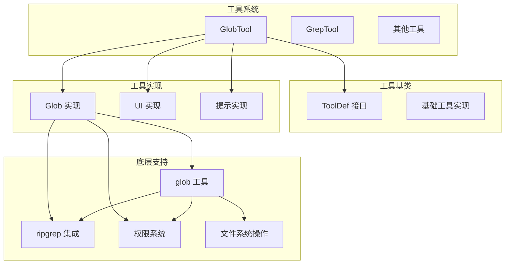
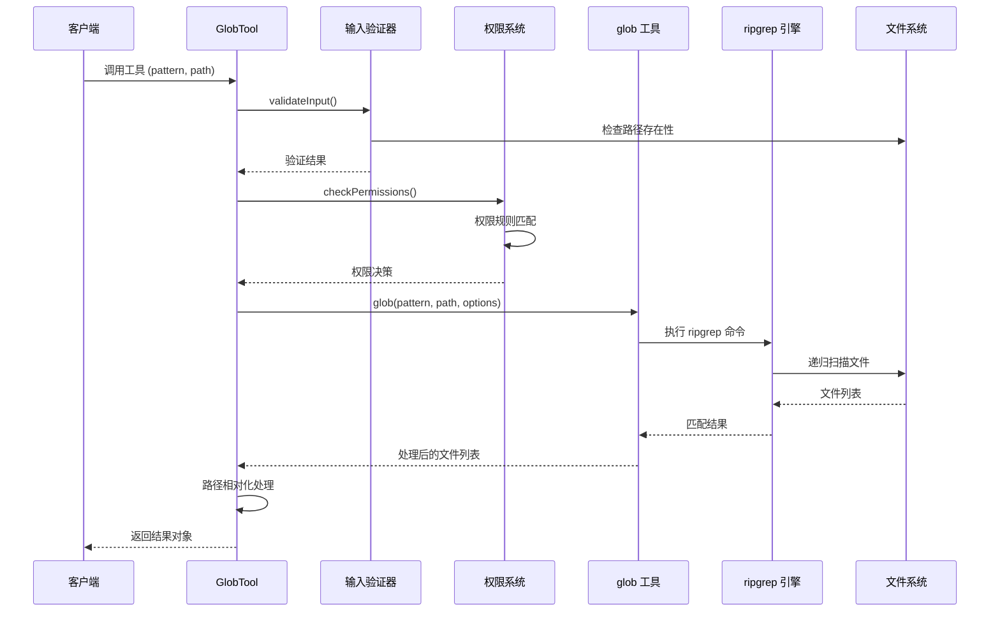
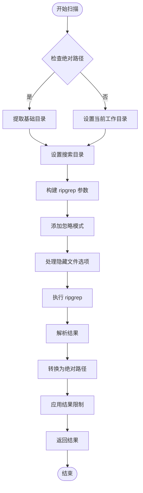
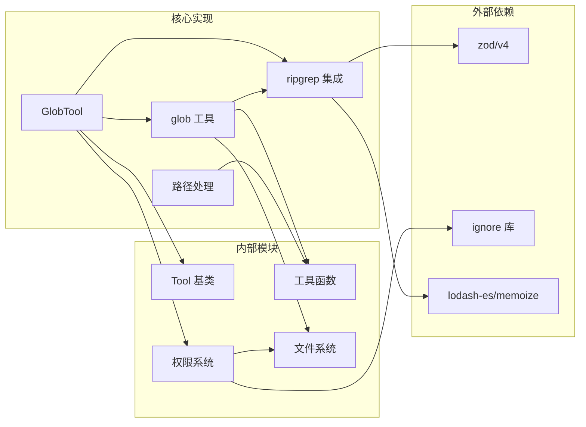

# 文件匹配工具 (GlobTool)

<cite>
**本文档引用的文件**
- [GlobTool.ts](file://src/tools/GlobTool/GlobTool.ts)
- [UI.tsx](file://src/tools/GlobTool/UI.tsx)
- [prompt.ts](file://src/tools/GlobTool/prompt.ts)
- [Tool.ts](file://src/Tool.ts)
- [glob.ts](file://src/utils/glob.ts)
- [ripgrep.ts](file://src/utils/ripgrep.ts)
- [filesystem.ts](file://src/utils/permissions/filesystem.ts)
- [fsOperations.ts](file://src/utils/fsOperations.ts)
- [path.ts](file://src/utils/path.ts)
- [GrepTool.ts](file://src/tools/GrepTool/GrepTool.ts)
- [toolLimits.ts](file://src/constants/toolLimits.ts)
</cite>

## 目录
1. [简介](#简介)
2. [项目结构](#项目结构)
3. [核心组件](#核心组件)
4. [架构概览](#架构概览)
5. [详细组件分析](#详细组件分析)
6. [依赖关系分析](#依赖关系分析)
7. [性能考量](#性能考量)
8. [故障排除指南](#故障排除指南)
9. [结论](#结论)
10. [附录](#附录)

## 简介

GlobTool 是一个高性能的文件匹配工具，专为大型代码库设计。它提供了强大的通配符文件匹配功能，支持复杂的模式语法、递归目录扫描和智能文件过滤。该工具基于 ripgrep 引擎构建，能够高效处理数万甚至数十万文件的大规模代码库。

GlobTool 的主要特性包括：
- 支持标准通配符模式（如 `**/*.js`、`src/**/*.ts`）
- 基于 ripgrep 的高性能文件扫描
- 智能权限控制和安全防护
- 可配置的结果限制和分页
- 与现有工具生态系统的无缝集成

## 项目结构

GlobTool 位于工具系统的核心位置，采用模块化设计：



**图表来源**
- [GlobTool.ts:57-198](file://src/tools/GlobTool/GlobTool.ts#L57-L198)
- [Tool.ts:362-795](file://src/Tool.ts#L362-L795)

**章节来源**
- [GlobTool.ts:1-200](file://src/tools/GlobTool/GlobTool.ts#L1-L200)
- [Tool.ts:1-795](file://src/Tool.ts#L1-L795)

## 核心组件

### GlobTool 主要接口

GlobTool 实现了完整的工具接口，提供了以下核心功能：

**输入参数定义：**
- `pattern`: 必需的通配符模式字符串
- `path`: 可选的目标目录路径，默认使用当前工作目录

**输出结果结构：**
- `durationMs`: 执行时间（毫秒）
- `numFiles`: 匹配文件总数
- `filenames`: 匹配的文件路径数组
- `truncated`: 结果是否被截断

**工具属性：**
- 并发安全：`isConcurrencySafe()` 返回 `true`
- 只读操作：`isReadOnly()` 返回 `true`
- 最大结果大小：50,000 字符

**章节来源**
- [GlobTool.ts:26-56](file://src/tools/GlobTool/GlobTool.ts#L26-L56)
- [GlobTool.ts:76-87](file://src/tools/GlobTool/GlobTool.ts#L76-L87)

### 权限控制系统

GlobTool 集成了完整的权限控制系统，确保安全的文件访问：

**权限检查流程：**
1. 路径验证和规范化
2. UNC 路径安全检查
3. Windows 特殊路径模式检测
4. 读取权限规则匹配
5. 工作目录范围检查
6. 内部路径访问控制

**安全防护措施：**
- 防止路径遍历攻击
- 阻止网络路径访问
- 检测可疑 Windows 路径模式
- 符号链接路径解析保护

**章节来源**
- [GlobTool.ts:135-142](file://src/tools/GlobTool/GlobTool.ts#L135-L142)
- [filesystem.ts:1030-1194](file://src/utils/permissions/filesystem.ts#L1030-L1194)

## 架构概览

GlobTool 采用分层架构设计，各层职责清晰分离：



**图表来源**
- [GlobTool.ts:154-176](file://src/tools/GlobTool/GlobTool.ts#L154-L176)
- [glob.ts:66-130](file://src/utils/glob.ts#L66-L130)
- [ripgrep.ts:345-463](file://src/utils/ripgrep.ts#L345-L463)

## 详细组件分析

### 模式匹配引擎

GlobTool 使用 ripgrep 作为底层文件扫描引擎，提供了高性能的文件匹配能力：

**模式语法支持：**
- 标准通配符：`*`、`?`、`[]`
- 递归匹配：`**`
- POSIX 字符类：`[a-z]`、`[^aeiou]`
- 转义字符：`\*`、`\?`

**匹配算法特点：**
- 基于状态机的高效匹配
- 支持大小写敏感/不敏感模式
- 内置 .gitignore 支持
- 隐藏文件可选包含

**章节来源**
- [glob.ts:66-130](file://src/utils/glob.ts#L66-L130)
- [ripgrep.ts:345-463](file://src/utils/ripgrep.ts#L345-L463)

### 递归目录扫描

GlobTool 的目录扫描功能经过精心优化，能够高效处理大型代码库：



**图表来源**
- [glob.ts:66-130](file://src/utils/glob.ts#L66-L130)

**章节来源**
- [glob.ts:17-64](file://src/utils/glob.ts#L17-L64)
- [glob.ts:66-130](file://src/utils/glob.ts#L66-L130)

### 文件类型筛选机制

GlobTool 支持灵活的文件类型筛选，通过 ripgrep 的内置类型系统实现：

**内置文件类型：**
- `js` - JavaScript 文件
- `py` - Python 文件  
- `ts` - TypeScript 文件
- `java` - Java 文件
- `go` - Go 文件
- `rust` - Rust 文件

**自定义类型过滤：**
- 基于扩展名的过滤
- 基于内容类型的智能识别
- 正则表达式的灵活匹配

**章节来源**
- [GrepTool.ts:74-82](file://src/tools/GrepTool/GrepTool.ts#L74-L82)

### 性能优化策略

GlobTool 实现了多项性能优化技术：

**内存管理：**
- 流式处理大量文件列表
- 20MB 缓冲区限制防止内存溢出
- 按需加载和处理文件路径

**并发处理：**
- 单线程模式自动重试（EAGAIN 错误）
- 可配置的超时机制
- 中断信号支持

**缓存机制：**
- ripgrep 配置缓存
- 工作目录路径解析缓存
- 文件计数结果缓存

**章节来源**
- [ripgrep.ts:80-92](file://src/utils/ripgrep.ts#L80-L92)
- [ripgrep.ts:345-463](file://src/utils/ripgrep.ts#L345-L463)

### 安全考虑

GlobTool 实施了多层次的安全防护：

**路径遍历防护：**
- 绝对路径检测和清理
- UNC 路径阻止（防止 NTLM 凭据泄露）
- Windows 特殊路径模式检测

**权限检查：**
- 基于规则的权限匹配
- 符号链接路径解析
- 工作目录范围限制

**输入验证：**
- 空字节检测
- 路径规范化
- 目录遍历模式检测

**章节来源**
- [GlobTool.ts:100-131](file://src/tools/GlobTool/GlobTool.ts#L100-L131)
- [filesystem.ts:435-488](file://src/utils/permissions/filesystem.ts#L435-L488)

## 依赖关系分析

GlobTool 的依赖关系清晰明确，遵循单一职责原则：



**图表来源**
- [GlobTool.ts:1-17](file://src/tools/GlobTool/GlobTool.ts#L1-L17)
- [glob.ts:1-10](file://src/utils/glob.ts#L1-L10)

**章节来源**
- [GlobTool.ts:1-25](file://src/tools/GlobTool/GlobTool.ts#L1-L25)
- [Tool.ts:1-14](file://src/Tool.ts#L1-L14)

## 性能考量

### 时间复杂度分析

GlobTool 的时间复杂度主要取决于文件数量和模式复杂度：

- **文件扫描**: O(F) - F 为匹配文件数量
- **模式匹配**: O(P) - P 为模式复杂度
- **排序操作**: O(F log F) - 基于修改时间排序

### 内存使用优化

**流式处理：**
- ripgrep 输出流式传输
- 20MB 缓冲区限制
- 分块处理避免内存峰值

**缓存策略：**
- 工作目录路径解析缓存
- ripgrep 配置缓存
- 文件计数结果缓存

### 平台特定优化

**Windows 平台：**
- POSIX 路径到 Windows 路径转换
- UNC 路径特殊处理
- 长路径前缀检测

**macOS/Linux 平台：**
- 符号链接安全检查
- 权限继承处理
- 文件系统差异适配

## 故障排除指南

### 常见问题及解决方案

**问题：搜索结果为空**
- 检查模式语法是否正确
- 验证目标目录是否存在
- 确认隐藏文件选项设置

**问题：性能缓慢**
- 使用更具体的目标路径
- 减少模式复杂度
- 检查 .gitignore 规则

**问题：权限被拒绝**
- 检查工作目录权限
- 验证路径安全性
- 查看权限规则配置

**问题：内存使用过高**
- 设置结果限制
- 使用分页查询
- 检查系统资源

**章节来源**
- [GlobTool.ts:94-134](file://src/tools/GlobTool/GlobTool.ts#L94-L134)
- [ripgrep.ts:87-106](file://src/utils/ripgrep.ts#L87-L106)

### 调试技巧

**启用详细日志：**
- 设置调试环境变量
- 监控 ripgrep 进程
- 分析错误码含义

**性能分析：**
- 使用性能监控工具
- 分析内存使用情况
- 优化查询模式

## 结论

GlobTool 是一个设计精良的文件匹配工具，具有以下优势：

**技术优势：**
- 基于 ripgrep 的高性能实现
- 完善的权限控制系统
- 智能的缓存和优化机制
- 跨平台兼容性

**使用场景：**
- 大型代码库导航
- 文件查找和定位
- 批量文件操作
- 开发辅助工具

**最佳实践：**
- 使用具体的目标路径
- 合理设置结果限制
- 利用权限系统进行安全控制
- 结合其他工具形成完整工作流

GlobTool 为开发者提供了强大而易用的文件搜索能力，在保证安全性的前提下实现了卓越的性能表现。

## 附录

### 实际使用示例

**基本文件查找：**
```
# 查找所有 JavaScript 文件
pattern: "*.js"

# 递归查找 TypeScript 文件
pattern: "src/**/*.ts"

# 查找特定目录下的文件
pattern: "test/**/*.spec.js"
path: "projects/my-app"
```

**高级模式示例：**
```
# 复杂通配符模式
pattern: "{src,lib}/**/*.{js,ts,jsx,tsx}"

# POSIX 字符类
pattern: "src/[A-Z]*/*.py"

# 递归深度限制
pattern: "**/models/**/*.js"
```

### 模式匹配最佳实践

**性能优化建议：**
- 尽可能提供具体的目标路径
- 使用前缀匹配减少扫描范围
- 避免过于复杂的嵌套模式
- 合理使用 `**` 递归匹配

**安全使用建议：**
- 验证用户输入的模式
- 限制结果数量防止滥用
- 使用权限系统控制访问范围
- 定期审查权限规则

**常见问题解决：**
- 模式不生效：检查路径分隔符
- 性能问题：优化模式复杂度
- 权限问题：检查工作目录设置
- 结果过多：设置适当的限制