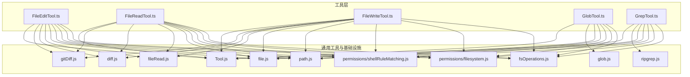
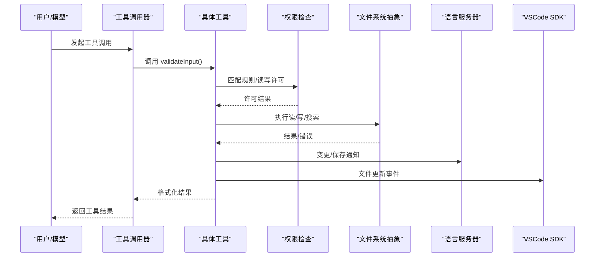
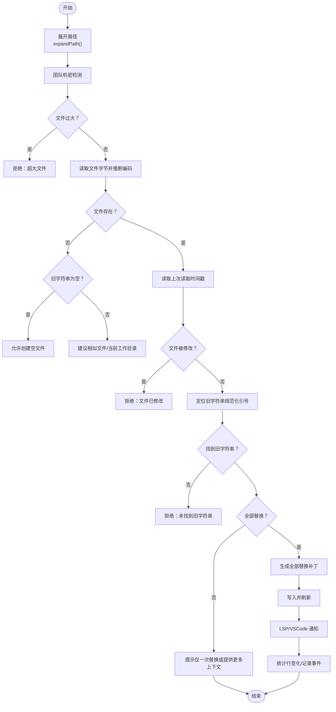
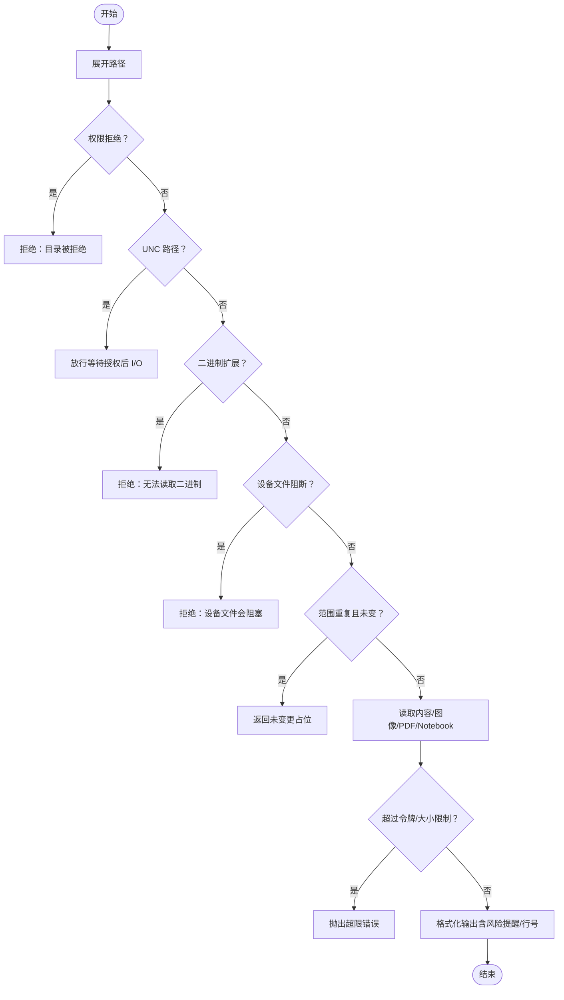
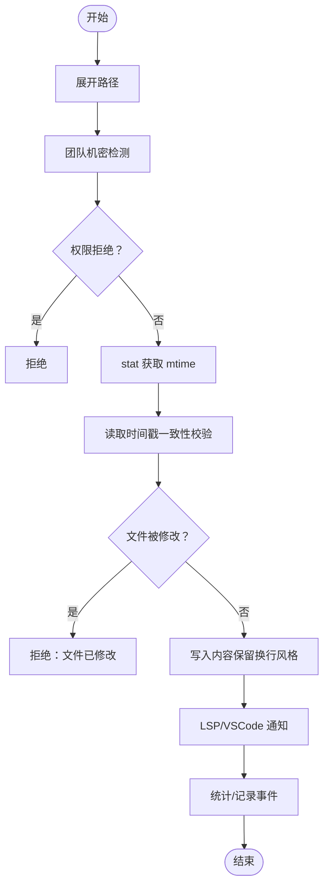
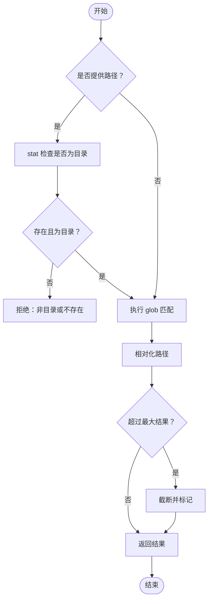
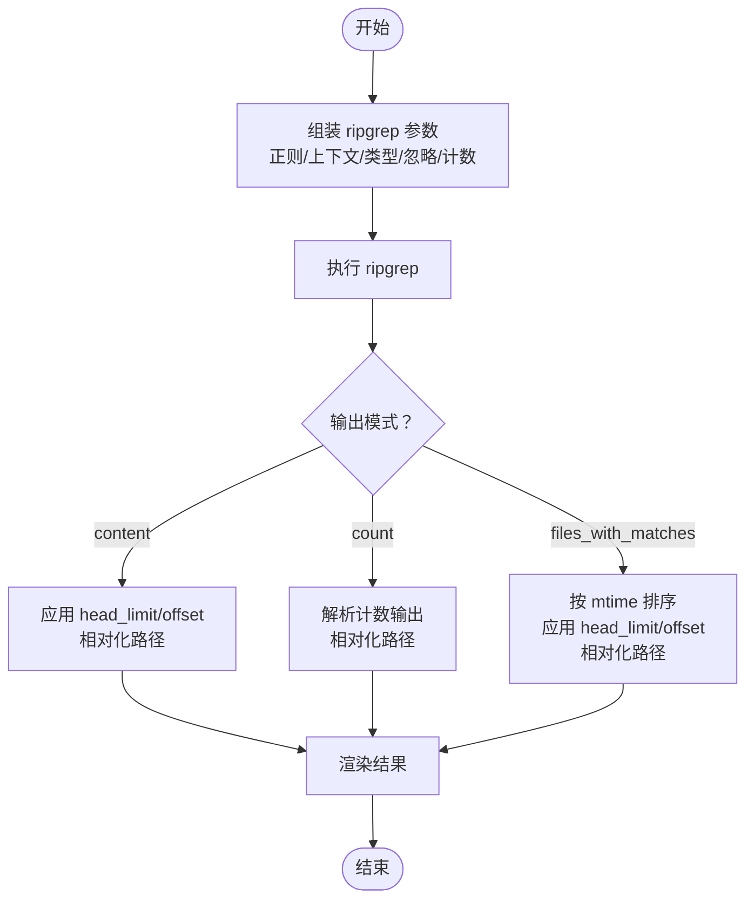
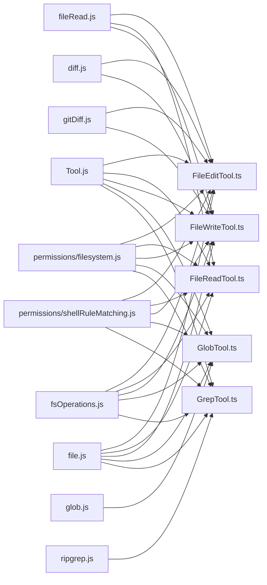

# 文件操作工具

<cite>
**本文引用的文件**
- [FileEditTool.ts](file://src/tools/FileEditTool/FileEditTool.ts)
- [FileReadTool.ts](file://src/tools/FileReadTool/FileReadTool.ts)
- [FileWriteTool.ts](file://src/tools/FileWriteTool/FileWriteTool.ts)
- [GlobTool.ts](file://src/tools/GlobTool/GlobTool.ts)
- [GrepTool.ts](file://src/tools/GrepTool/GrepTool.ts)
- [filesystem 权限检查](file://src/utils/permissions/filesystem.js)
- [shell 规则匹配](file://src/utils/permissions/shellRuleMatching.js)
- [文件系统抽象](file://src/utils/fsOperations.js)
- [文件读取与元数据](file://src/utils/fileRead.js)
- [文件工具通用工具](file://src/utils/file.js)
- [路径与展开](file://src/utils/path.js)
- [ripgrep 封装](file://src/utils/ripgrep.js)
- [全局匹配](file://src/utils/glob.js)
- [文件历史记录](file://src/utils/fileHistory.js)
- [差异计算与统计](file://src/utils/diff.js)
- [Git 差异获取](file://src/utils/gitDiff.js)
- [工具基类与构建器](file://src/Tool.js)
- [工具常量与提示](file://src/tools/FileEditTool/constants.js)
- [工具常量与提示](file://src/tools/FileEditTool/prompt.js)
- [工具常量与提示](file://src/tools/FileReadTool/prompt.js)
- [工具常量与提示](file://src/tools/FileWriteTool/prompt.js)
- [工具常量与提示](file://src/tools/GlobTool/prompt.js)
- [工具常量与提示](file://src/tools/GrepTool/prompt.js)
</cite>

## 目录
1. [简介](#简介)
2. [项目结构](#项目结构)
3. [核心组件](#核心组件)
4. [架构总览](#架构总览)
5. [详细组件分析](#详细组件分析)
6. [依赖关系分析](#依赖关系分析)
7. [性能考量](#性能考量)
8. [故障排查指南](#故障排查指南)
9. [结论](#结论)
10. [附录](#附录)

## 简介
本文件面向 Claude Code 的文件操作工具集，系统性梳理以下工具的功能、用法、安全与权限控制、错误处理、搜索与匹配模式，并提供批量操作、代码搜索与内容替换的实际使用案例与最佳实践。重点工具包括：
- FileEditTool：就地编辑文件（字符串替换），支持全量或全部替换、变更前后对比、LSP 通知与 VSCode Diff 同步。
- FileReadTool：读取文本、图片、PDF、Jupyter Notebook，支持偏移/限制范围读取、分页与令牌上限控制、设备文件阻断与去重。
- FileWriteTool：覆盖写入文件，确保原子性与一致性，支持变更统计与 Git Diff 汇报。
- GlobTool：基于通配符的文件名匹配与检索。
- GrepTool：基于 ripgrep 的正则内容搜索，支持上下文、大小写不敏感、类型过滤、计数模式与分页。

## 项目结构
文件操作工具均位于 src/tools 下，每个工具自成目录，包含：
- 工具主文件（如 FileEditTool.ts）
- UI 渲染与用户提示（UI.tsx）
- 常量与描述（constants.js、prompt.js）
- 类型定义与输入输出校验（types.ts、prompt.ts 中的 schema）

**图表来源**
- [FileEditTool.ts:1-627](file://src/tools/FileEditTool/FileEditTool.ts#L1-627)
- [FileReadTool.ts:1-800](file://src/tools/FileReadTool/FileReadTool.ts#L1-800)
- [FileWriteTool.ts:1-436](file://src/tools/FileWriteTool/FileWriteTool.ts#L1-436)
- [GlobTool.ts:1-200](file://src/tools/GlobTool/GlobTool.ts#L1-200)
- [GrepTool.ts:1-579](file://src/tools/GrepTool/GrepTool.ts#L1-579)
- [文件系统抽象](file://src/utils/fsOperations.js)
- [filesystem 权限检查](file://src/utils/permissions/filesystem.js)
- [shell 规则匹配](file://src/utils/permissions/shellRuleMatching.js)
- [ripgrep 封装](file://src/utils/ripgrep.js)
- [全局匹配](file://src/utils/glob.js)
- [差异计算与统计](file://src/utils/diff.js)
- [Git 差异获取](file://src/utils/gitDiff.js)
- [工具基类与构建器](file://src/Tool.js)

**章节来源**
- [FileEditTool.ts:1-627](file://src/tools/FileEditTool/FileEditTool.ts#L1-627)
- [FileReadTool.ts:1-800](file://src/tools/FileReadTool/FileReadTool.ts#L1-800)
- [FileWriteTool.ts:1-436](file://src/tools/FileWriteTool/FileWriteTool.ts#L1-436)
- [GlobTool.ts:1-200](file://src/tools/GlobTool/GlobTool.ts#L1-200)
- [GrepTool.ts:1-579](file://src/tools/GrepTool/GrepTool.ts#L1-579)

## 核心组件
- FileEditTool：就地修改文件，严格校验旧字符串存在、避免并发修改、支持团队机密检测、变更统计与 Git Diff 报告。
- FileReadTool：多格式读取与安全限制（设备文件阻断、二进制扩展白名单）、范围读取与令牌上限、自动记忆文件新鲜度提示、读取去重。
- FileWriteTool：覆盖写入，确保父目录存在与原子写入窗口、LSP 通知、VSCode Diff、变更统计与 Git Diff。
- GlobTool：通配符匹配，支持相对路径归一化、结果截断提示。
- GrepTool：正则搜索，上下文、大小写不敏感、类型过滤、计数模式、分页与默认上限、忽略模式与 VCS 排除。

**章节来源**
- [FileEditTool.ts:86-595](file://src/tools/FileEditTool/FileEditTool.ts#L86-595)
- [FileReadTool.ts:337-718](file://src/tools/FileReadTool/FileReadTool.ts#L337-718)
- [FileWriteTool.ts:94-434](file://src/tools/FileWriteTool/FileWriteTool.ts#L94-434)
- [GlobTool.ts:57-198](file://src/tools/GlobTool/GlobTool.ts#L57-198)
- [GrepTool.ts:160-577](file://src/tools/GrepTool/GrepTool.ts#L160-577)

## 架构总览
各工具通过统一的工具基类构建，共享权限检查、路径展开、文件系统抽象与 UI 渲染框架；搜索工具依赖 ripgrep 或 glob 实现高效检索；读写工具在关键路径上保持原子性与一致性，并与 LSP/VSCode 进行状态同步。

**图表来源**
- [FileEditTool.ts:137-362](file://src/tools/FileEditTool/FileEditTool.ts#L137-362)
- [FileReadTool.ts:418-495](file://src/tools/FileReadTool/FileReadTool.ts#L418-495)
- [FileWriteTool.ts:223-222](file://src/tools/FileWriteTool/FileWriteTool.ts#L223-222)
- [GlobTool.ts:154-176](file://src/tools/GlobTool/GlobTool.ts#L154-176)
- [GrepTool.ts:310-326](file://src/tools/GrepTool/GrepTool.ts#L310-326)
- [filesystem 权限检查](file://src/utils/permissions/filesystem.js)
- [文件系统抽象](file://src/utils/fsOperations.js)

## 详细组件分析

### FileEditTool（文件就地编辑）
- 功能要点
  - 字符串替换：支持单次替换与“全部替换”，自动规范化引号风格，避免误判。
  - 并发保护：读取后的时间戳与内容一致性校验，防止并发修改导致的数据不一致。
  - 安全与合规：拒绝 UNC 路径直接 I/O、禁止编辑 Jupyter Notebook（需使用专用工具）、团队机密检测。
  - 输出与追踪：生成结构化补丁、统计行变化、可选 Git Diff、日志事件与分析埋点。
  - LSP/VSCode 集成：变更与保存事件通知，触发诊断与 Diff 展示。
- 输入输出与校验
  - 输入包含文件路径、旧字符串、新字符串、是否全部替换等；输出包含变更前内容、结构化补丁、是否全部替换等。
  - 校验阶段执行：路径展开、权限匹配、大小限制、文件存在性与内容一致性、旧字符串存在性、设置文件合法性验证。
- 关键流程图

**图表来源**
- [FileEditTool.ts:137-362](file://src/tools/FileEditTool/FileEditTool.ts#L137-362)
- [FileEditTool.ts:387-595](file://src/tools/FileEditTool/FileEditTool.ts#L387-595)
- [文件系统抽象](file://src/utils/fsOperations.js)
- [文件工具通用工具](file://src/utils/file.js)
- [文件读取与元数据](file://src/utils/fileRead.js)
- [差异计算与统计](file://src/utils/diff.js)
- [Git 差异获取](file://src/utils/gitDiff.js)

**章节来源**
- [FileEditTool.ts:86-595](file://src/tools/FileEditTool/FileEditTool.ts#L86-595)
- [工具常量与提示](file://src/tools/FileEditTool/constants.js)
- [工具常量与提示](file://src/tools/FileEditTool/prompt.js)

### FileReadTool（文件读取）
- 功能要点
  - 多格式支持：文本、图片、PDF、Notebook；对二进制扩展进行白名单控制；阻断无限输出/阻塞输入的设备文件。
  - 范围读取：offset/limit 控制行数；pages 参数用于 PDF 分页提取。
  - 令牌与大小限制：估算令牌数并按阈值拒绝；默认读取限制可被覆盖并记录事件。
  - 去重与新鲜度：同范围重复读取且文件未变时返回“未变更”占位，减少冗余传输；自动记忆文件新鲜度提示。
  - 安全与兼容：macOS 截图路径兼容（常规空格与窄空格）；路径展开与 UNC 检查。
- 关键流程图

**图表来源**
- [FileReadTool.ts:418-495](file://src/tools/FileReadTool/FileReadTool.ts#L418-495)
- [FileReadTool.ts:496-718](file://src/tools/FileReadTool/FileReadTool.ts#L496-718)
- [文件系统抽象](file://src/utils/fsOperations.js)
- [文件工具通用工具](file://src/utils/file.js)
- [文件读取与元数据](file://src/utils/fileRead.js)

**章节来源**
- [FileReadTool.ts:337-718](file://src/tools/FileReadTool/FileReadTool.ts#L337-718)
- [工具常量与提示](file://src/tools/FileReadTool/prompt.js)

### FileWriteTool（文件覆盖写入）
- 功能要点
  - 全量覆盖：显式内容即最终内容，保留换行风格；确保父目录存在与原子写入窗口。
  - 并发保护：与 FileReadTool 相同的读取时间戳一致性校验。
  - LSP/VSCode：变更与保存通知；更新读取时间戳。
  - 统计与报告：新增/更新区分、结构化补丁、行变化统计、可选 Git Diff。
- 关键流程图

**图表来源**
- [FileWriteTool.ts:223-434](file://src/tools/FileWriteTool/FileWriteTool.ts#L223-434)
- [文件系统抽象](file://src/utils/fsOperations.js)
- [文件工具通用工具](file://src/utils/file.js)
- [文件读取与元数据](file://src/utils/fileRead.js)
- [差异计算与统计](file://src/utils/diff.js)
- [Git 差异获取](file://src/utils/gitDiff.js)

**章节来源**
- [FileWriteTool.ts:94-434](file://src/tools/FileWriteTool/FileWriteTool.ts#L94-434)
- [工具常量与提示](file://src/tools/FileWriteTool/prompt.js)

### GlobTool（通配符搜索）
- 功能要点
  - 基于通配符的文件名匹配，支持指定根目录或默认当前工作目录。
  - 结果相对化（相对于 CWD）以节省令牌；超过最大结果数时截断并提示。
  - 权限匹配：基于规则模式匹配。
- 关键流程图

**图表来源**
- [GlobTool.ts:154-198](file://src/tools/GlobTool/GlobTool.ts#L154-198)
- [全局匹配](file://src/utils/glob.js)
- [路径与展开](file://src/utils/path.js)

**章节来源**
- [GlobTool.ts:57-198](file://src/tools/GlobTool/GlobTool.ts#L57-198)
- [工具常量与提示](file://src/tools/GlobTool/prompt.js)

### GrepTool（正则内容搜索）
- 功能要点
  - 使用 ripgrep 执行正则搜索，支持上下文（-B/-A/-C/-n）、大小写不敏感、类型过滤、计数模式、分页与默认上限。
  - 忽略模式与 VCS 目录排除，避免噪声；WSL 性能注意由 ripgrep 自身超时处理。
  - 输出模式：显示匹配行、仅文件列表、计数汇总；相对化路径节省令牌。
- 关键流程图

**图表来源**
- [GrepTool.ts:310-577](file://src/tools/GrepTool/GrepTool.ts#L310-577)
- [ripgrep 封装](file://src/utils/ripgrep.js)
- [路径与展开](file://src/utils/path.js)

**章节来源**
- [GrepTool.ts:160-577](file://src/tools/GrepTool/GrepTool.ts#L160-577)
- [工具常量与提示](file://src/tools/GrepTool/prompt.js)

## 依赖关系分析
- 工具基类与构建器：所有工具通过统一的 buildTool 与 ToolDef 接口注册，共享权限、路径、UI、摘要等能力。
- 权限系统：filesystem.js 提供读/写权限检查与规则匹配；shellRuleMatching.js 支持通配符规则匹配。
- 文件系统抽象：fsOperations.js 提供跨平台文件系统操作封装，屏蔽底层差异。
- 搜索引擎：ripgrep.js 封装 ripgrep，GlobTool 使用 glob.js；两者均支持取消信号与超时控制。
- LSP/VSCode 集成：编辑/写入工具在成功后通知语言服务器与 VSCode，确保 IDE 侧状态一致。
- 历史与统计：fileHistory.js 记录编辑历史；diff.js 统计行变化；gitDiff.js 可选生成 Git Diff。

**图表来源**
- [工具基类与构建器](file://src/Tool.js)
- [filesystem 权限检查](file://src/utils/permissions/filesystem.js)
- [shell 规则匹配](file://src/utils/permissions/shellRuleMatching.js)
- [文件系统抽象](file://src/utils/fsOperations.js)
- [ripgrep 封装](file://src/utils/ripgrep.js)
- [全局匹配](file://src/utils/glob.js)
- [文件读取与元数据](file://src/utils/fileRead.js)
- [文件工具通用工具](file://src/utils/file.js)
- [差异计算与统计](file://src/utils/diff.js)
- [Git 差异获取](file://src/utils/gitDiff.js)

**章节来源**
- [FileEditTool.ts:1-627](file://src/tools/FileEditTool/FileEditTool.ts#L1-627)
- [FileReadTool.ts:1-800](file://src/tools/FileReadTool/FileReadTool.ts#L1-800)
- [FileWriteTool.ts:1-436](file://src/tools/FileWriteTool/FileWriteTool.ts#L1-436)
- [GlobTool.ts:1-200](file://src/tools/GlobTool/GlobTool.ts#L1-200)
- [GrepTool.ts:1-579](file://src/tools/GrepTool/GrepTool.ts#L1-579)

## 性能考量
- 读取与搜索
  - FileReadTool 对大文件与超长令牌进行限制，避免上下文溢出；GlobTool/GrepTool 默认限制结果数量并支持分页。
  - GrepTool 在 content 模式下优先应用 head_limit 再做相对化，减少无效处理。
  - WSL 环境下 ripgrep 自身超时控制，避免长时间阻塞。
- 并发与原子性
  - FileEditTool/FileWriteTool 在写入前确保父目录存在，并在严格的时间戳与内容一致性窗口内完成写入，降低并发冲突概率。
- 缓存与去重
  - FileReadTool 的“文件未变更”占位减少重复传输，提高交互效率。
- 最佳实践
  - 优先使用 GrepTool 的类型过滤与忽略模式，缩小搜索范围。
  - 使用 FileReadTool 的 offset/limit 或 GrepTool 的 head_limit/offset 进行分页，避免一次性返回大量内容。
  - 对大文件使用 FileReadTool 的范围读取，而非整文件读取。

[本节为通用指导，无需特定文件引用]

## 故障排查指南
- 文件不存在/路径错误
  - FileReadTool/GlobTool/GrepTool 在路径不存在时提供“相似文件建议/当前工作目录提示”，必要时尝试替代 macOS 截图路径。
- 权限被拒绝
  - 所有工具在 validateInput 中进行权限匹配，若命中拒绝规则将明确提示。
- 文件被修改
  - 若文件在读取后被外部修改（含云同步/杀软），工具会拒绝写入以避免覆盖。
- UNC 路径
  - UNC 路径在权限检查阶段放行，I/O 操作需等待授权，以避免 NTLM 凭据泄露。
- 设备文件阻断
  - 对 /dev/zero、/dev/random 等阻断，避免进程挂起或无限输出。
- 超大文件/超限
  - FileEditTool 对文件大小设限；FileReadTool 对令牌与大小进行估算与限制。
- 搜索无结果
  - GrepTool 默认限制结果数量，可通过 head_limit=0（谨慎使用）或缩小范围/模式解决。

**章节来源**
- [FileEditTool.ts:176-362](file://src/tools/FileEditTool/FileEditTool.ts#L176-362)
- [FileReadTool.ts:418-651](file://src/tools/FileReadTool/FileReadTool.ts#L418-651)
- [GlobTool.ts:94-134](file://src/tools/GlobTool/GlobTool.ts#L94-134)
- [GrepTool.ts:201-232](file://src/tools/GrepTool/GrepTool.ts#L201-232)

## 结论
上述文件操作工具围绕“安全、一致、可观测”的设计目标构建：严格的权限与路径校验、并发一致性保障、丰富的 UI 与分析埋点、以及与 IDE 生态的深度集成。结合 GrepTool 的高效搜索与 FileReadTool 的范围读取，可实现从探索到落地的一体化工作流。

[本节为总结，无需特定文件引用]

## 附录

### 使用案例与最佳实践
- 批量文件操作
  - 使用 GlobTool 获取匹配文件列表，再对每个文件调用 FileWriteTool 进行覆盖写入，或使用 FileEditTool 进行字符串替换。
  - 注意：先读取再写入，确保时间戳一致性；对大文件使用 FileReadTool 的 offset/limit 或 FileWriteTool 的原子写入窗口。
- 代码搜索与内容替换
  - 使用 GrepTool 的正则搜索定位目标，结合 head_limit/offset 进行分页浏览；确认唯一匹配后再调用 FileEditTool 执行替换。
  - 对于多处匹配但只替换一处的情况，提供更具体的上下文或设置 replace_all=true。
- 安全与合规
  - 避免对 UNC 路径直接 I/O；对二进制文件使用专用工具；对包含机密信息的文件进行团队机密检测。
- 性能优化
  - 优先使用类型过滤与忽略模式；合理设置 head_limit/offset；对大文件采用范围读取；利用“文件未变更”占位减少重复传输。

[本节为概念性指导，无需特定文件引用]