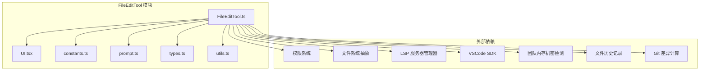
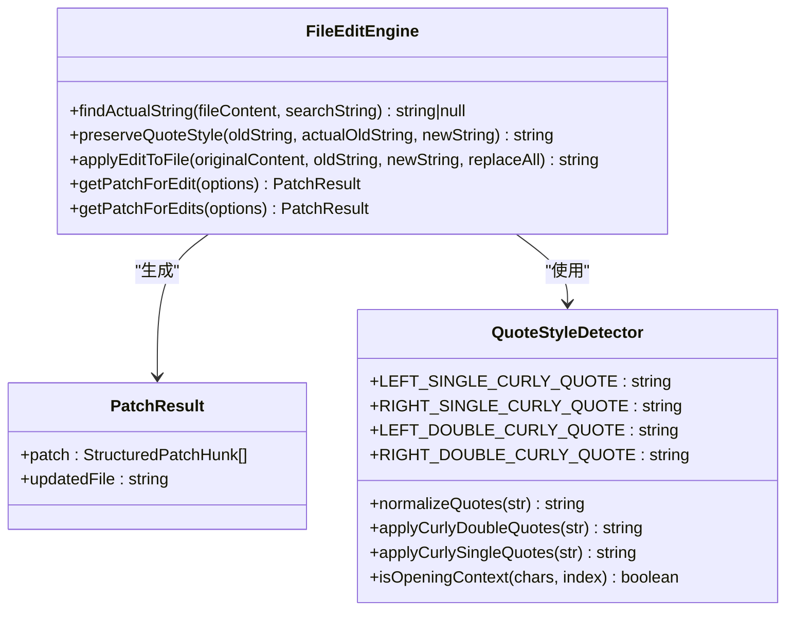
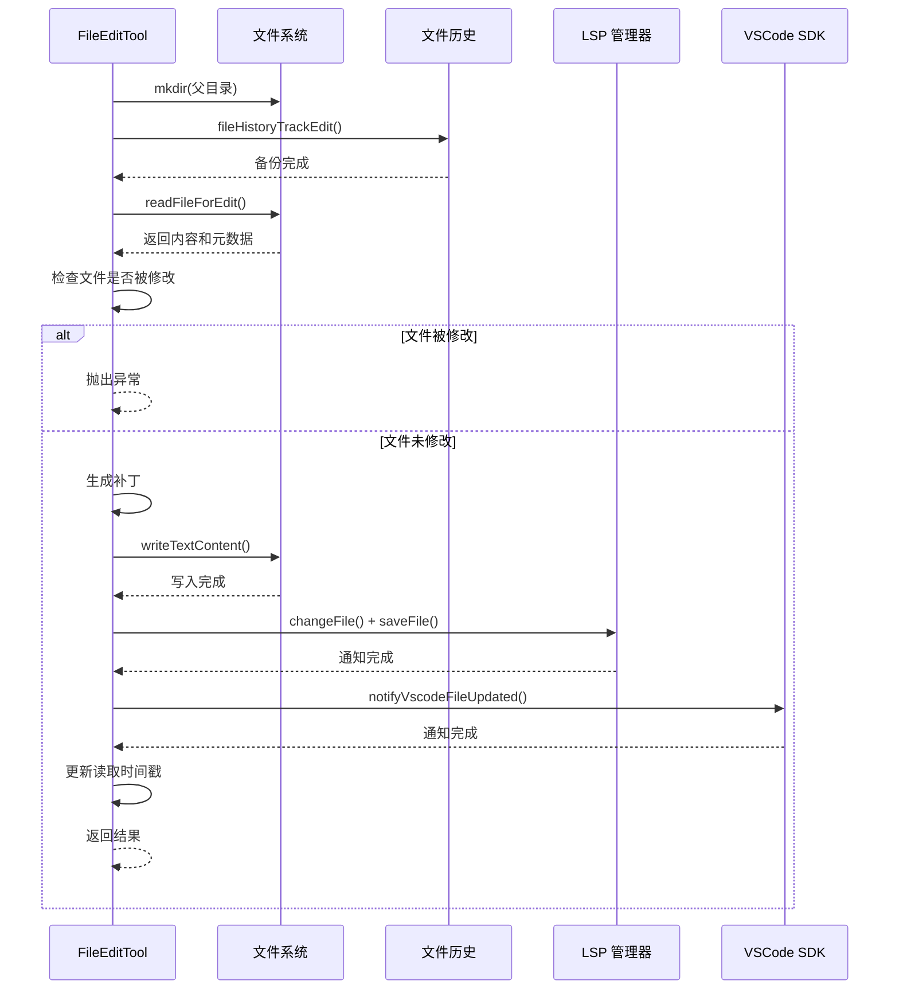

# 文件编辑工具 (FileEditTool)

<cite>
**本文档引用的文件**
- [FileEditTool.ts](file://src/tools/FileEditTool/FileEditTool.ts)
- [UI.tsx](file://src/tools/FileEditTool/UI.tsx)
- [constants.ts](file://src/tools/FileEditTool/constants.ts)
- [prompt.ts](file://src/tools/FileEditTool/prompt.ts)
- [types.ts](file://src/tools/FileEditTool/types.ts)
- [utils.ts](file://src/tools/FileEditTool/utils.ts)
</cite>

## 目录
1. [简介](#简介)
2. [项目结构](#项目结构)
3. [核心组件](#核心组件)
4. [架构总览](#架构总览)
5. [详细组件分析](#详细组件分析)
6. [依赖关系分析](#依赖关系分析)
7. [性能考虑](#性能考虑)
8. [故障排除指南](#故障排除指南)
9. [结论](#结论)
10. [附录：使用示例与最佳实践](#附录使用示例与最佳实践)

## 简介
FileEditTool 是一个用于精确字符串替换、批量编辑和原子写入的文件编辑工具。它支持：
- 字符串替换：在文件中精确查找并替换指定文本
- 批量编辑：通过 replace_all 参数一次性替换所有匹配项
- 原子写入：确保文件修改过程中的数据一致性，避免部分写入导致的数据损坏
- 输入验证：严格的文件存在性检查、内容完整性验证和权限控制
- 安全机制：文件大小限制、UNC 路径防护、团队内存机密检测
- 编码处理：自动识别 UTF-16/UTF-8 编码，统一行尾符（CRLF/LF）
- 差异计算：生成结构化补丁，支持 IDE 差异视图和 Git 差异

## 项目结构
FileEditTool 的核心实现位于 src/tools/FileEditTool 目录下，包含以下关键文件：
- FileEditTool.ts：工具主实现，包含输入验证、调用逻辑和输出渲染
- UI.tsx：用户界面渲染，负责工具使用消息、结果消息和拒绝消息的显示
- constants.ts：工具常量定义，如工具名称、权限模式等
- prompt.ts：工具描述和使用提示
- types.ts：输入输出类型定义，使用 Zod 进行严格校验
- utils.ts：通用工具函数，包括字符串处理、差异计算、引号风格保持等



**图表来源**
- [FileEditTool.ts:1-627](file://src/tools/FileEditTool/FileEditTool.ts#L1-L627)
- [UI.tsx:1-290](file://src/tools/FileEditTool/UI.tsx#L1-L290)
- [constants.ts:1-13](file://src/tools/FileEditTool/constants.ts#L1-L13)
- [prompt.ts:1-30](file://src/tools/FileEditTool/prompt.ts#L1-L30)
- [types.ts:1-87](file://src/tools/FileEditTool/types.ts#L1-L87)
- [utils.ts:1-777](file://src/tools/FileEditTool/utils.ts#L1-L777)

**章节来源**
- [FileEditTool.ts:1-627](file://src/tools/FileEditTool/FileEditTool.ts#L1-L627)
- [UI.tsx:1-290](file://src/tools/FileEditTool/UI.tsx#L1-L290)
- [constants.ts:1-13](file://src/tools/FileEditTool/constants.ts#L1-L13)
- [prompt.ts:1-30](file://src/tools/FileEditTool/prompt.ts#L1-L30)
- [types.ts:1-87](file://src/tools/FileEditTool/types.ts#L1-L87)
- [utils.ts:1-777](file://src/tools/FileEditTool/utils.ts#L1-L777)

## 核心组件
FileEditTool 的核心组件包括：

### 1. 输入验证系统
- 路径规范化：使用 expandPath 统一路径格式，避免 Windows 下 "/" 和 "\" 导致的查找不一致
- 权限检查：基于工具权限上下文进行写权限验证
- 团队内存机密检测：防止在团队内存文件中引入敏感信息
- 文件大小限制：最大 1GiB，防止内存溢出
- UNC 路径防护：Windows UNC 路径触发 SMB 认证，直接跳过文件系统操作
- 文件存在性检查：支持新文件创建（空 old_string）和现有文件编辑
- 内容完整性验证：检查文件是否被其他进程修改
- 引用规范化：处理文件中的弯曲引号与模型输出直引号的差异

### 2. 编辑引擎
- 字符串替换：支持精确匹配和批量替换
- 引号风格保持：根据文件中的引号风格自动调整新字符串的引号
- 编码处理：自动检测 UTF-16/UTF-8 编码，统一转换为 LF 行尾
- 差异计算：生成结构化补丁，支持 IDE 差异视图

### 3. 原子写入机制
- 目录预创建：确保父目录存在
- 文件备份：使用文件历史记录进行备份
- 读取状态检查：验证文件自上次读取以来未被修改
- 写入操作：使用 writeTextContent 进行原子写入
- LSP 通知：更新 LSP 服务器和 VSCode 差异视图

**章节来源**
- [FileEditTool.ts:137-362](file://src/tools/FileEditTool/FileEditTool.ts#L137-L362)
- [FileEditTool.ts:387-595](file://src/tools/FileEditTool/FileEditTool.ts#L387-L595)
- [utils.ts:73-93](file://src/tools/FileEditTool/utils.ts#L73-L93)
- [utils.ts:104-136](file://src/tools/FileEditTool/utils.ts#L104-L136)

## 架构总览
FileEditTool 采用模块化设计，将验证、编辑、写入、通知等功能分离到不同的模块中，确保职责单一且易于维护。


**图表来源**
- [FileEditTool.ts:137-362](file://src/tools/FileEditTool/FileEditTool.ts#L137-L362)
- [FileEditTool.ts:387-595](file://src/tools/FileEditTool/FileEditTool.ts#L387-L595)
- [UI.tsx:57-91](file://src/tools/FileEditTool/UI.tsx#L57-L91)

## 详细组件分析

### 输入验证流程
输入验证是 FileEditTool 的第一道安全防线，确保编辑操作的安全性和正确性。


**图表来源**
- [FileEditTool.ts:137-362](file://src/tools/FileEditTool/FileEditTool.ts#L137-L362)
- [utils.ts:73-93](file://src/tools/FileEditTool/utils.ts#L73-L93)

**章节来源**
- [FileEditTool.ts:137-362](file://src/tools/FileEditTool/FileEditTool.ts#L137-L362)
- [utils.ts:73-93](file://src/tools/FileEditTool/utils.ts#L73-L93)

### 编辑引擎
编辑引擎负责执行具体的字符串替换操作，并保持文件的编码和格式一致性。



**图表来源**
- [utils.ts:73-93](file://src/tools/FileEditTool/utils.ts#L73-L93)
- [utils.ts:104-136](file://src/tools/FileEditTool/utils.ts#L104-L136)
- [utils.ts:206-228](file://src/tools/FileEditTool/utils.ts#L206-L228)
- [utils.ts:234-350](file://src/tools/FileEditTool/utils.ts#L234-L350)

**章节来源**
- [utils.ts:73-93](file://src/tools/FileEditTool/utils.ts#L73-L93)
- [utils.ts:104-136](file://src/tools/FileEditTool/utils.ts#L104-L136)
- [utils.ts:206-228](file://src/tools/FileEditTool/utils.ts#L206-L228)
- [utils.ts:234-350](file://src/tools/FileEditTool/utils.ts#L234-L350)

### 原子写入机制
原子写入确保文件修改的完整性和一致性，防止并发修改导致的数据竞争。



**图表来源**
- [FileEditTool.ts:387-595](file://src/tools/FileEditTool/FileEditTool.ts#L387-L595)
- [FileEditTool.ts:599-625](file://src/tools/FileEditTool/FileEditTool.ts#L599-L625)

**章节来源**
- [FileEditTool.ts:387-595](file://src/tools/FileEditTool/FileEditTool.ts#L387-L595)
- [FileEditTool.ts:599-625](file://src/tools/FileEditTool/FileEditTool.ts#L599-L625)

### UI 渲染系统
UI 渲染系统负责将工具的使用消息、结果消息和拒绝消息以用户友好的方式呈现。

```mermaid
classDiagram
class UIComponents {
+userFacingName(input) string
+getToolUseSummary(input) string|null
+renderToolUseMessage(props, options) ReactNode
+renderToolResultMessage(output, progress, options) ReactNode
+renderToolUseRejectedMessage(input, options) ReactNode
+renderToolUseErrorMessage(content, options) ReactNode
}
class FileEditToolUpdatedMessage {
+props : {filePath, structuredPatch, firstLine, fileContent, style, verbose}
}
class FileEditToolUseRejectedMessage {
+props : {file_path, operation, patch?, content?, firstLine, verbose}
}
UIComponents --> FileEditToolUpdatedMessage : "渲染结果"
UIComponents --> FileEditToolUseRejectedMessage : "渲染拒绝"
```

**图表来源**
- [UI.tsx:24-56](file://src/tools/FileEditTool/UI.tsx#L24-L56)
- [UI.tsx:57-91](file://src/tools/FileEditTool/UI.tsx#L57-L91)
- [UI.tsx:92-127](file://src/tools/FileEditTool/UI.tsx#L92-L127)
- [UI.tsx:128-154](file://src/tools/FileEditTool/UI.tsx#L128-L154)

**章节来源**
- [UI.tsx:24-56](file://src/tools/FileEditTool/UI.tsx#L24-L56)
- [UI.tsx:57-91](file://src/tools/FileEditTool/UI.tsx#L57-L91)
- [UI.tsx:92-127](file://src/tools/FileEditTool/UI.tsx#L92-L127)
- [UI.tsx:128-154](file://src/tools/FileEditTool/UI.tsx#L128-L154)

## 依赖关系分析
FileEditTool 依赖于多个内部模块和外部库，形成了完整的文件编辑生态系统。


**图表来源**
- [FileEditTool.ts:1-77](file://src/tools/FileEditTool/FileEditTool.ts#L1-L77)
- [types.ts:1-87](file://src/tools/FileEditTool/types.ts#L1-L87)
- [utils.ts:1-16](file://src/tools/FileEditTool/utils.ts#L1-L16)

**章节来源**
- [FileEditTool.ts:1-77](file://src/tools/FileEditTool/FileEditTool.ts#L1-L77)
- [types.ts:1-87](file://src/tools/FileEditTool/types.ts#L1-L87)
- [utils.ts:1-16](file://src/tools/FileEditTool/utils.ts#L1-L16)

## 性能考虑
FileEditTool 在设计时充分考虑了性能优化：

### 1. 文件大小限制
- 最大文件大小限制为 1GiB，防止内存溢出和长时间操作
- 对于超大文件，系统会提示用户进行分批编辑

### 2. 缓存机制
- 使用 readFileSyncCached 进行文件内容缓存
- 使用 readEditContext 进行上下文读取，避免全文件读取

### 3. 异步操作优化
- 技能发现和加载采用 fire-and-forget 模式
- 文件历史记录备份在时间戳检查之前进行

### 4. 差异计算优化
- 对于大量文件，使用 getPatchFromContents 直接计算差异，避免重复转换
- 限制差异片段的最大字节数（8KB），平衡显示效果和性能

### 5. 并发控制
- 原子写入过程中避免异步操作，确保一致性
- 使用文件修改时间戳和内容比较双重验证

## 故障排除指南
常见问题及解决方案：

### 1. 文件未找到错误
**症状**：提示文件不存在
**原因**：文件路径错误或文件已被删除
**解决**：检查文件路径，使用 `findSimilarFile` 和 `suggestPathUnderCwd` 获取建议

### 2. 权限不足错误
**症状**：提示文件在被拒绝的目录中
**原因**：权限规则配置不允许编辑该文件
**解决**：检查工具权限配置，添加相应的允许规则

### 3. 文件被修改错误
**症状**：提示文件在读取后被修改
**原因**：文件被其他进程或用户修改
**解决**：重新读取文件后再进行编辑

### 4. 字符串未找到错误
**症状**：提示字符串未找到
**原因**：old_string 与文件内容不匹配
**解决**：提供更多的上下文或检查引号风格

### 5. UNC 路径错误
**症状**：Windows UNC 路径导致权限检查失败
**原因**：UNC 路径触发 SMB 认证
**解决**：使用本地路径或正确的网络凭据

**章节来源**
- [FileEditTool.ts:176-181](file://src/tools/FileEditTool/FileEditTool.ts#L176-L181)
- [FileEditTool.ts:224-246](file://src/tools/FileEditTool/FileEditTool.ts#L224-L246)
- [FileEditTool.ts:289-311](file://src/tools/FileEditTool/FileEditTool.ts#L289-L311)
- [FileEditTool.ts:317-327](file://src/tools/FileEditTool/FileEditTool.ts#L317-L327)

## 结论
FileEditTool 是一个功能强大且安全的文件编辑工具，具有以下特点：

1. **安全性优先**：多重验证机制确保编辑操作的安全性
2. **精确控制**：支持精确字符串替换和批量替换
3. **原子写入**：保证文件修改的一致性和完整性
4. **智能编码处理**：自动识别和处理不同编码格式
5. **用户友好**：提供清晰的错误信息和差异显示
6. **性能优化**：针对大文件和复杂场景进行了专门优化

通过合理使用 FileEditTool，用户可以安全、高效地进行文件内容编辑，同时避免常见的错误和安全风险。

## 附录：使用示例与最佳实践

### 实际使用示例

#### 精确字符串替换
1. 首先使用 FileReadTool 读取目标文件
2. 准备精确的 old_string（包含足够的上下文）
3. 设置 new_string 为目标替换内容
4. 执行编辑操作

#### 批量修改
1. 设置 replace_all 为 true
2. 提供要替换的字符串
3. 系统将替换文件中所有匹配项

#### 新文件创建
1. 将 old_string 设为空字符串
2. 在 new_string 中提供文件内容
3. 系统将在指定路径创建新文件

### 最佳实践指南

#### 1. 输入验证最佳实践
- 始终先读取文件再进行编辑
- 提供足够的上下文确保 old_string 的唯一性
- 使用 replace_all 时要谨慎，确认不会误删重要内容

#### 2. 安全最佳实践
- 定期检查权限配置，确保只允许编辑必要的文件
- 避免编辑团队内存文件，防止敏感信息泄露
- 注意文件大小限制，对大文件进行分批处理

#### 3. 性能最佳实践
- 对于大文件，使用上下文读取而非全文件读取
- 合理使用 replace_all，避免不必要的全文件扫描
- 利用缓存机制减少重复的文件读取操作

#### 4. 错误处理最佳实践
- 建立完善的错误处理流程
- 对于不可恢复的错误，及时回滚并通知用户
- 记录详细的日志便于问题排查