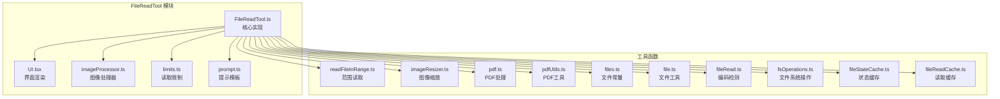
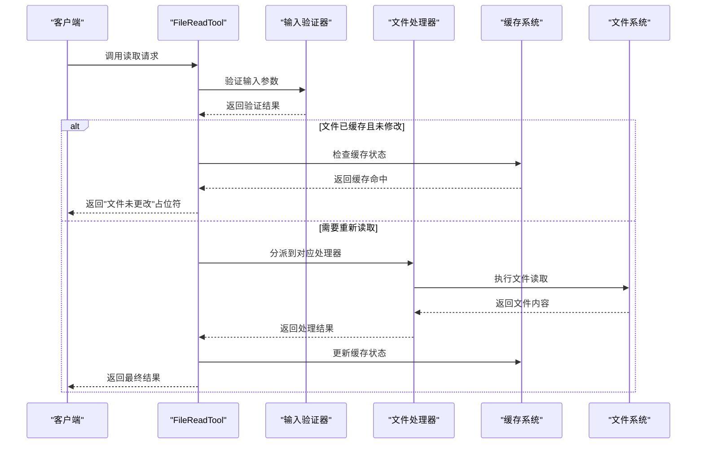
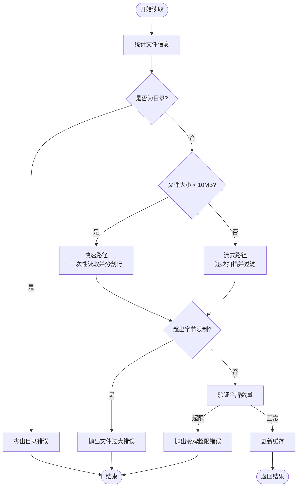
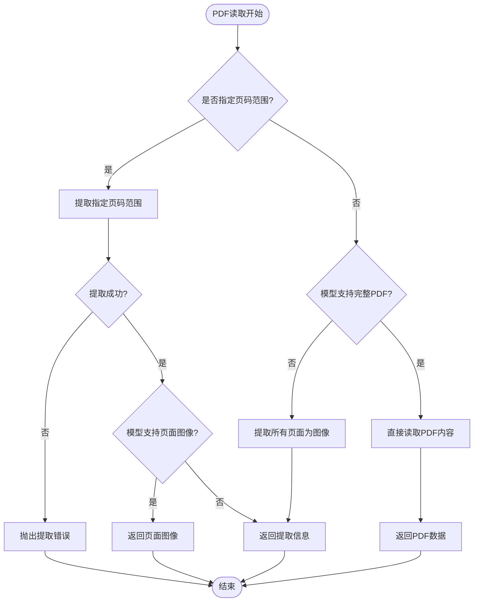
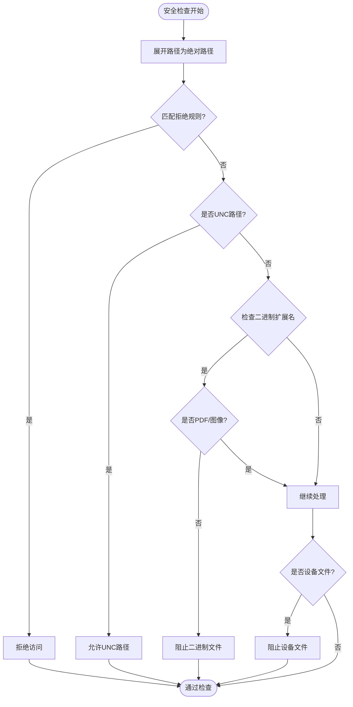
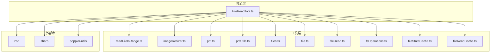

# 文件读取工具 (FileReadTool)

<cite>
**本文档引用的文件**
- [FileReadTool.ts](file://src/tools/FileReadTool/FileReadTool.ts)
- [UI.tsx](file://src/tools/FileReadTool/UI.tsx)
- [imageProcessor.ts](file://src/tools/FileReadTool/imageProcessor.ts)
- [limits.ts](file://src/tools/FileReadTool/limits.ts)
- [prompt.ts](file://src/tools/FileReadTool/prompt.ts)
- [readFileInRange.ts](file://src/utils/readFileInRange.ts)
- [imageResizer.ts](file://src/utils/imageResizer.ts)
- [pdf.ts](file://src/utils/pdf.ts)
- [pdfUtils.ts](file://src/utils/pdfUtils.ts)
- [files.ts](file://src/constants/files.ts)
- [file.ts](file://src/utils/file.ts)
- [fileRead.ts](file://src/utils/fileRead.ts)
- [fsOperations.ts](file://src/utils/fsOperations.ts)
- [fileStateCache.ts](file://src/utils/fileStateCache.ts)
- [fileReadCache.ts](file://src/utils/fileReadCache.ts)
</cite>

## 目录
1. [简介](#简介)
2. [项目结构](#项目结构)
3. [核心组件](#核心组件)
4. [架构概览](#架构概览)
5. [详细组件分析](#详细组件分析)
6. [依赖关系分析](#依赖关系分析)
7. [性能考量](#性能考量)
8. [故障排除指南](#故障排除指南)
9. [结论](#结论)
10. [附录](#附录)

## 简介
FileReadTool 是一个功能强大的文件读取工具，支持多种文件类型（文本、图像、PDF、Jupyter Notebook），具备智能大小限制、令牌计数验证、设备文件防护、路径建议与相似文件匹配等特性。该工具通过两层限制保障系统稳定性和安全性：总文件大小上限（maxSizeBytes）在读取前进行检查，避免内存溢出；输出令牌上限（maxTokens）在读取后通过精确令牌计数验证，防止超限内容返回。

## 项目结构
FileReadTool 模块位于 `src/tools/FileReadTool/` 目录下，主要包含以下文件：
- FileReadTool.ts：核心实现，包含输入输出模式、权限校验、调用流程、错误处理等
- UI.tsx：用户界面渲染逻辑，负责工具使用消息、结果消息和错误消息的显示
- imageProcessor.ts：图像处理器抽象，支持原生模块和 fallback sharp 实现
- limits.ts：默认读取限制配置，支持环境变量覆盖和实验性开关
- prompt.ts：工具提示模板，定义使用说明和行为约束



**图表来源**
- [FileReadTool.ts:1-1185](file://src/tools/FileReadTool/FileReadTool.ts#L1-L1185)
- [UI.tsx:1-186](file://src/tools/FileReadTool/UI.tsx#L1-L186)
- [imageProcessor.ts:1-96](file://src/tools/FileReadTool/imageProcessor.ts#L1-L96)
- [limits.ts:1-94](file://src/tools/FileReadTool/limits.ts#L1-L94)
- [prompt.ts:1-51](file://src/tools/FileReadTool/prompt.ts#L1-L51)

**章节来源**
- [FileReadTool.ts:1-1185](file://src/tools/FileReadTool/FileReadTool.ts#L1-L1185)
- [UI.tsx:1-186](file://src/tools/FileReadTool/UI.tsx#L1-L186)
- [imageProcessor.ts:1-96](file://src/tools/FileReadTool/imageProcessor.ts#L1-L96)
- [limits.ts:1-94](file://src/tools/FileReadTool/limits.ts#L1-L94)
- [prompt.ts:1-51](file://src/tools/FileReadTool/prompt.ts#L1-L51)

## 核心组件
FileReadTool 的核心由以下组件构成：

### 输入输出模式
工具支持五种输出类型：
- 文本文件：返回带行号的文本内容
- 图像文件：返回 base64 编码的图像数据
- Jupyter Notebook：返回所有单元格及其输出
- PDF 文件：返回 base64 编码的 PDF 数据
- 页面提取：返回从 PDF 中提取的页面图像信息

### 权限与安全控制
- 路径展开：将波浪号和相对路径转换为绝对路径
- 拒绝规则：基于通配符模式匹配的权限检查
- 设备文件防护：阻止读取无限输出或阻塞输入的设备文件
- UNC 路径检查：Windows 网络路径的安全处理

### 内容缓存与去重
- 读取状态缓存：记录已读取文件的内容、时间戳和偏移量
- 去重机制：当同一范围且文件未修改时，返回"文件未更改"占位符
- 内存文件新鲜度：为自动记忆文件添加时间戳前缀

**章节来源**
- [FileReadTool.ts:227-335](file://src/tools/FileReadTool/FileReadTool.ts#L227-L335)
- [FileReadTool.ts:398-495](file://src/tools/FileReadTool/FileReadTool.ts#L398-L495)
- [FileReadTool.ts:523-573](file://src/tools/FileReadTool/FileReadTool.ts#L523-L573)

## 架构概览
FileReadTool 采用分层架构设计，确保不同文件类型的处理逻辑清晰分离：



**图表来源**
- [FileReadTool.ts:496-651](file://src/tools/FileReadTool/FileReadTool.ts#L496-L651)
- [FileReadTool.ts:804-1086](file://src/tools/FileReadTool/FileReadTool.ts#L804-L1086)

## 详细组件分析

### 文本文件处理流程
文本文件处理采用双路径策略以平衡性能和内存使用：



**图表来源**
- [readFileInRange.ts:73-122](file://src/utils/readFileInRange.ts#L73-L122)
- [FileReadTool.ts:1019-1086](file://src/tools/FileReadTool/FileReadTool.ts#L1019-L1086)

**章节来源**
- [readFileInRange.ts:1-383](file://src/utils/readFileInRange.ts#L1-L383)
- [FileReadTool.ts:1019-1086](file://src/tools/FileReadTool/FileReadTool.ts#L1019-L1086)

### 图像文件处理机制
图像文件处理包含格式检测、尺寸调整和压缩优化：

```mermaid
classDiagram
class ImageProcessor {
+detectImageFormatFromBuffer(buffer) string
+maybeResizeAndDownsampleImageBuffer(buffer, size, format) ResizeResult
+compressImageBufferWithTokenLimit(buffer, maxTokens, mediaType) CompressResult
}
class ImageResult {
+type : "image"
+file : {
+base64 : string
+type : string
+originalSize : number
+dimensions? : ImageDimensions
}
}
class ImageDimensions {
+originalWidth? : number
+originalHeight? : number
+displayWidth? : number
+displayHeight? : number
}
ImageProcessor --> ImageResult : "生成"
ImageResult --> ImageDimensions : "可选包含"
```

**图表来源**
- [imageResizer.ts:769-812](file://src/utils/imageResizer.ts#L769-L812)
- [FileReadTool.ts:1097-1183](file://src/tools/FileReadTool/FileReadTool.ts#L1097-L1183)

**章节来源**
- [imageProcessor.ts:1-96](file://src/tools/FileReadTool/imageProcessor.ts#L1-L96)
- [imageResizer.ts:757-812](file://src/utils/imageResizer.ts#L757-L812)
- [FileReadTool.ts:1097-1183](file://src/tools/FileReadTool/FileReadTool.ts#L1097-L1183)

### PDF 文件处理流程
PDF 处理根据模型能力和文件大小选择不同的策略：



**图表来源**
- [FileReadTool.ts:894-1017](file://src/tools/FileReadTool/FileReadTool.ts#L894-L1017)
- [pdf.ts:34-234](file://src/utils/pdf.ts#L34-L234)

**章节来源**
- [FileReadTool.ts:894-1017](file://src/tools/FileReadTool/FileReadTool.ts#L894-L1017)
- [pdf.ts:1-234](file://src/utils/pdf.ts#L1-L234)
- [pdfUtils.ts:1-50](file://src/utils/pdfUtils.ts#L1-L50)

### Notebook 文件处理
Jupyter Notebook 文件读取包含 JSON 序列化和大小验证：

**章节来源**
- [FileReadTool.ts:821-863](file://src/tools/FileReadTool/FileReadTool.ts#L821-L863)

### 权限与安全控制
工具实现了多层次的安全防护：



**图表来源**
- [FileReadTool.ts:418-495](file://src/tools/FileReadTool/FileReadTool.ts#L418-L495)
- [fsOperations.ts:288-308](file://src/utils/fsOperations.ts#L288-L308)

**章节来源**
- [FileReadTool.ts:418-495](file://src/tools/FileReadTool/FileReadTool.ts#L418-L495)
- [fsOperations.ts:272-308](file://src/utils/fsOperations.ts#L272-L308)
- [files.ts:114-156](file://src/constants/files.ts#L114-L156)

## 依赖关系分析
FileReadTool 的依赖关系呈现清晰的分层结构：



**图表来源**
- [FileReadTool.ts:1-60](file://src/tools/FileReadTool/FileReadTool.ts#L1-L60)
- [readFileInRange.ts:1-43](file://src/utils/readFileInRange.ts#L1-L43)
- [imageResizer.ts:1-20](file://src/utils/imageResizer.ts#L1-L20)
- [pdf.ts:1-13](file://src/utils/pdf.ts#L1-L13)

**章节来源**
- [FileReadTool.ts:1-60](file://src/tools/FileReadTool/FileReadTool.ts#L1-L60)

## 性能考量
FileReadTool 在多个层面进行了性能优化：

### 内存优化策略
- 流式读取：对于大于 10MB 的文件，使用流式读取避免内存峰值
- 双路径算法：小文件使用一次性读取，大文件使用流式处理
- 缓存机制：LRU 缓存减少重复读取开销
- 去重优化：相同范围且未修改的文件直接返回占位符

### 令牌计数优化
- 预估计数：使用启发式方法快速判断是否可能超限
- 精确计数：超过阈值时使用 API 进行精确令牌计算
- 动态调整：根据文件类型选择合适的计数策略

### 并发控制
- 读写分离：文件读取不阻塞其他操作
- 超时控制：支持 AbortSignal 中断长时间操作
- 资源清理：自动释放流式读取的资源

## 故障排除指南

### 常见错误类型
1. **文件不存在**：提供相似文件建议和当前工作目录提示
2. **文件过大**：建议使用 offset 和 limit 参数分段读取
3. **令牌超限**：提供具体的令牌数量和限制信息
4. **权限拒绝**：检查配置文件中的允许/拒绝规则
5. **设备文件**：避免读取 /dev/zero、/dev/random 等特殊文件

### 调试技巧
- 启用详细日志：查看文件操作事件和分析指标
- 检查缓存状态：确认文件是否被正确缓存
- 验证路径解析：确保路径展开符合预期
- 监控内存使用：观察流式读取的内存占用

**章节来源**
- [FileReadTool.ts:608-650](file://src/tools/FileReadTool/FileReadTool.ts#L608-L650)
- [FileReadTool.ts:175-185](file://src/tools/FileReadTool/FileReadTool.ts#L175-L185)

## 结论
FileReadTool 提供了全面而高效的文件读取能力，通过精心设计的架构和多重优化策略，在保证安全性的同时实现了高性能的文件处理。其模块化的组件设计使得不同文件类型的处理逻辑清晰分离，便于维护和扩展。建议在生产环境中合理配置读取限制，并充分利用缓存机制以获得最佳性能表现。

## 附录

### 使用示例
以下是一些典型的使用场景和最佳实践：

#### 读取大型文本文件
```javascript
// 使用 offset 和 limit 分段读取
await Read({
  file_path: "/var/log/system.log",
  offset: 1,
  limit: 1000  // 每次读取 1000 行
})
```

#### 读取特定 PDF 页面
```javascript
// 仅读取指定页面范围
await Read({
  file_path: "report.pdf",
  pages: "1-5"  // 读取第 1-5 页
})
```

#### 处理图像文件
```javascript
// 自动检测图像格式并应用压缩
await Read({
  file_path: "screenshot.png"
})
```

### 最佳实践
1. **合理设置限制**：根据文件大小和模型能力调整 maxTokens 和 maxSizeBytes
2. **使用分段读取**：对于大文件优先使用 offset 和 limit 参数
3. **启用缓存**：利用内置缓存减少重复读取开销
4. **监控性能**：关注内存使用和响应时间指标
5. **安全第一**：严格配置权限规则，避免敏感文件访问