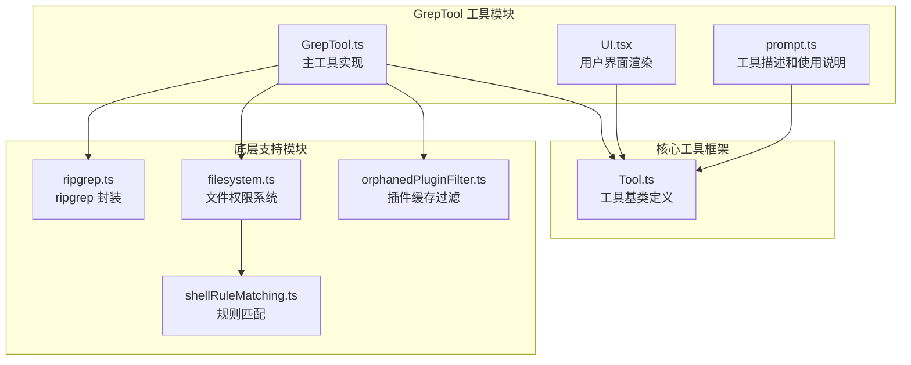
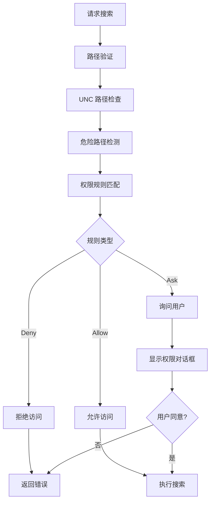
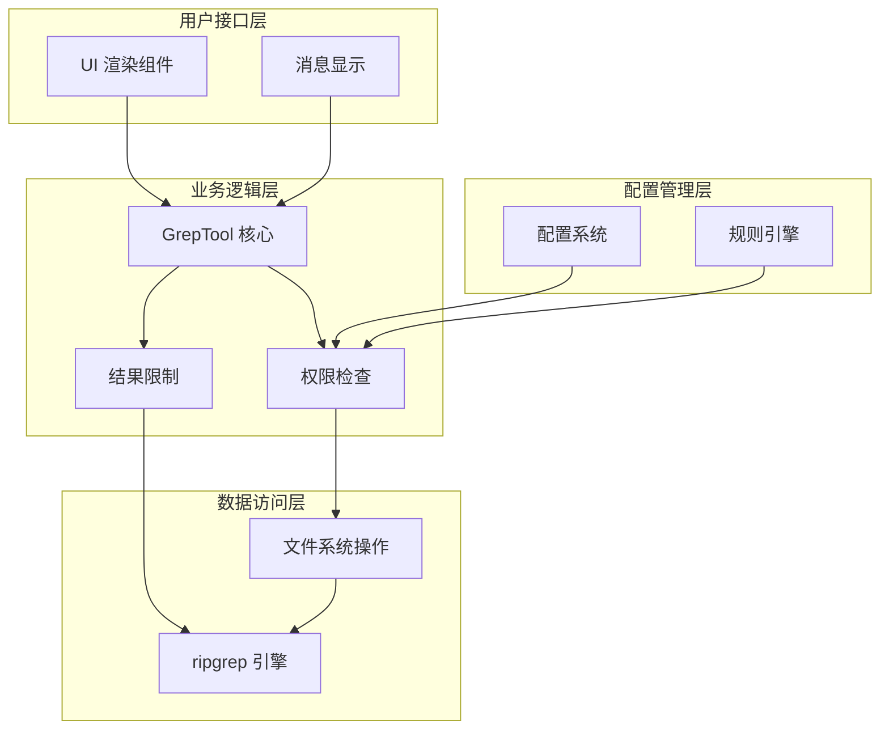
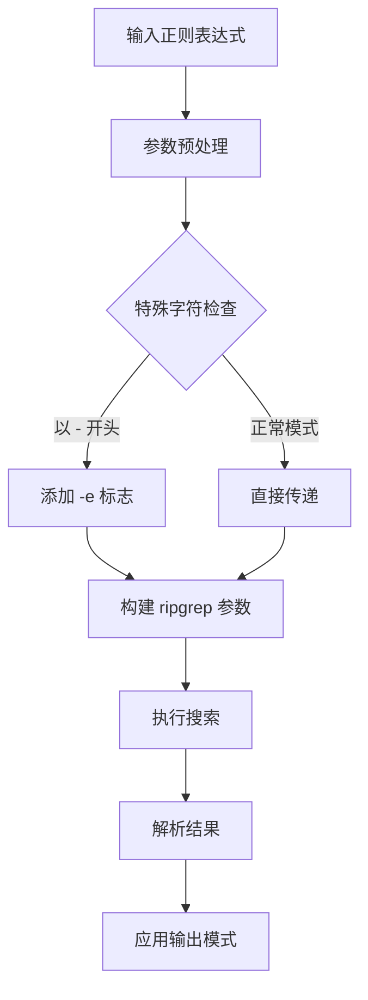
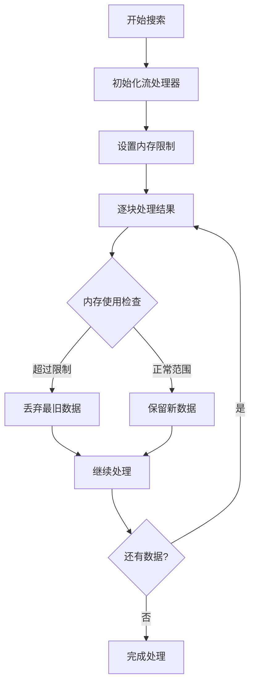
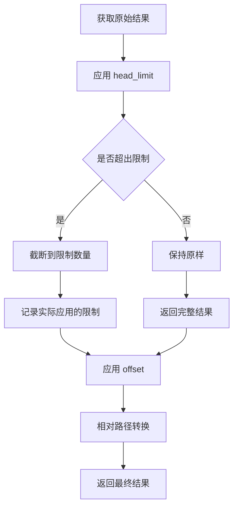
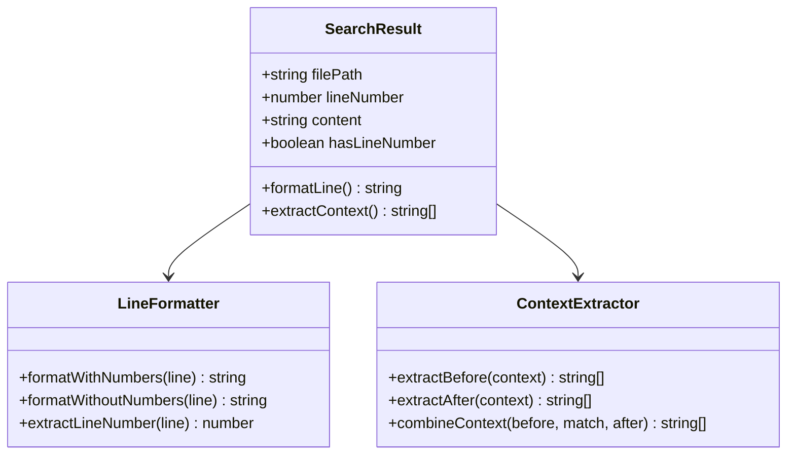
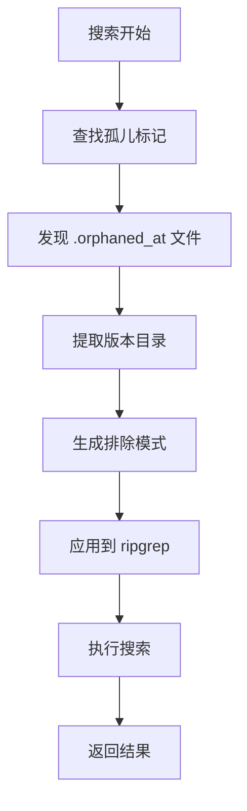
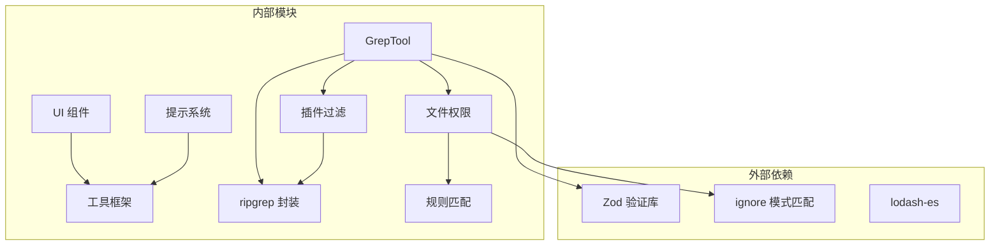
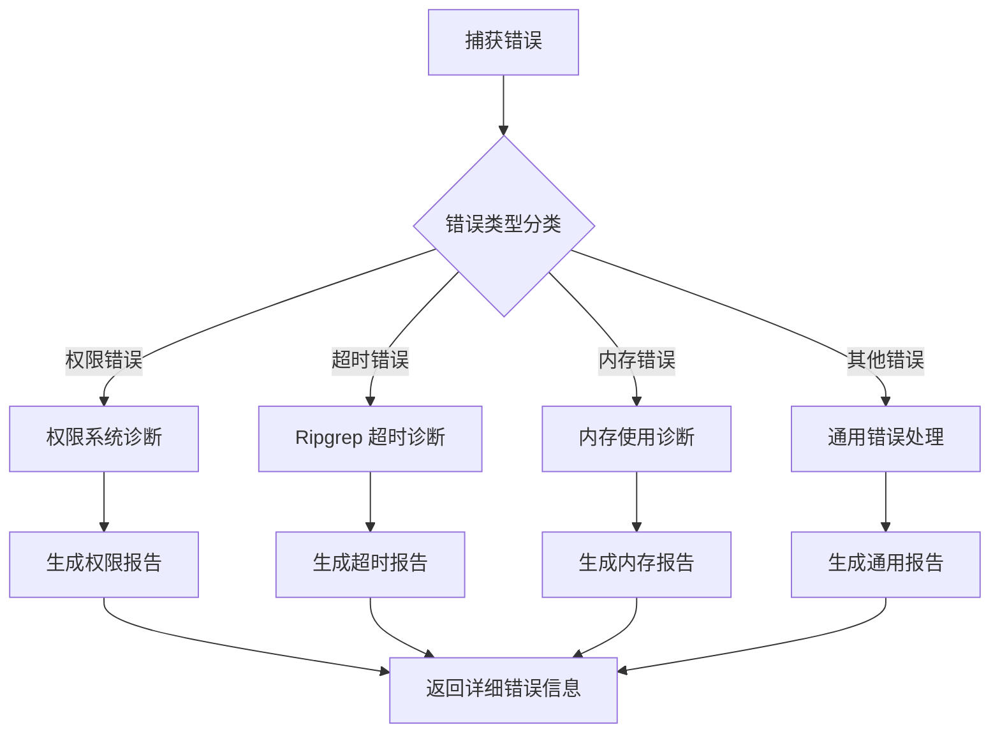

# 文本搜索工具 (GrepTool)

<cite>
**本文档引用的文件**
- [GrepTool.ts](file://src/tools/GrepTool/GrepTool.ts)
- [UI.tsx](file://src/tools/GrepTool/UI.tsx)
- [prompt.ts](file://src/tools/GrepTool/prompt.ts)
- [Tool.ts](file://src/Tool.ts)
- [ripgrep.ts](file://src/utils/ripgrep.ts)
- [filesystem.ts](file://src/utils/permissions/filesystem.ts)
- [shellRuleMatching.ts](file://src/utils/permissions/shellRuleMatching.ts)
- [orphanedPluginFilter.ts](file://src/utils/plugins/orphanedPluginFilter.ts)
</cite>

## 目录
1. [简介](#简介)
2. [项目结构](#项目结构)
3. [核心组件](#核心组件)
4. [架构概览](#架构概览)
5. [详细组件分析](#详细组件分析)
6. [依赖关系分析](#依赖关系分析)
7. [性能考虑](#性能考虑)
8. [故障排除指南](#故障排除指南)
9. [结论](#结论)
10. [附录](#附录)

## 简介

GrepTool 是一个基于 ripgrep 的强大文本搜索工具，专为 Claude Code 平台设计。该工具提供了完整的正则表达式支持、多文件搜索、上下文匹配和智能结果处理功能。

### 主要特性

- **正则表达式支持**: 完整的 ripgrep 正则表达式语法支持
- **多文件搜索**: 支持在单个或多个文件中进行搜索
- **上下文匹配**: 提供前缀、后缀和前后文的上下文显示
- **智能权限控制**: 基于规则的文件访问权限管理
- **内存优化**: 针对大型文件和大量结果的内存管理策略
- **结果高亮**: 搜索结果的智能高亮显示
- **统计信息**: 匹配数量和文件统计信息

## 项目结构

GrepTool 位于工具模块的专门目录中，采用清晰的分层架构：



**图表来源**
- [GrepTool.ts:1-579](file://src/tools/GrepTool/GrepTool.ts#L1-L579)
- [UI.tsx:1-202](file://src/tools/GrepTool/UI.tsx#L1-L202)
- [Tool.ts:1-795](file://src/Tool.ts#L1-L795)

**章节来源**
- [GrepTool.ts:1-50](file://src/tools/GrepTool/GrepTool.ts#L1-L50)
- [UI.tsx:1-20](file://src/tools/GrepTool/UI.tsx#L1-L20)

## 核心组件

### GrepTool 主实现

GrepTool 的核心实现提供了完整的搜索功能，包括输入验证、参数处理和结果格式化。

#### 输入参数架构

| 参数 | 类型 | 描述 | 默认值 |
|------|------|------|--------|
| `pattern` | string | 正则表达式模式 | 必需 |
| `path` | string | 搜索路径 | 当前工作目录 |
| `glob` | string | 文件过滤模式 | 无 |
| `output_mode` | enum | 输出模式 | files_with_matches |
| `-B` | number | 前缀上下文行数 | 0 |
| `-A` | number | 后缀上下文行数 | 0 |
| `-C` | number | 上下文行数（别名） | 0 |
| `-n` | boolean | 显示行号 | true |
| `-i` | boolean | 不区分大小写 | false |
| `type` | string | 文件类型过滤 | 无 |
| `head_limit` | number | 结果限制 | 250 |
| `offset` | number | 跳过前 N 个结果 | 0 |
| `multiline` | boolean | 多行模式 | false |

#### 输出模式

GrepTool 支持三种输出模式：

1. **content**: 显示匹配的完整内容
2. **files_with_matches**: 仅显示文件路径
3. **count**: 显示匹配计数

**章节来源**
- [GrepTool.ts:33-91](file://src/tools/GrepTool/GrepTool.ts#L33-L91)
- [GrepTool.ts:144-156](file://src/tools/GrepTool/GrepTool.ts#L144-L156)

### 权限控制系统

GrepTool 实现了多层次的权限控制机制：



**图表来源**
- [filesystem.ts:1030-1194](file://src/utils/permissions/filesystem.ts#L1030-L1194)

**章节来源**
- [GrepTool.ts:233-240](file://src/tools/GrepTool/GrepTool.ts#L233-L240)
- [filesystem.ts:1030-1194](file://src/utils/permissions/filesystem.ts#L1030-L1194)

## 架构概览

GrepTool 采用模块化的架构设计，各个组件职责明确：



**图表来源**
- [GrepTool.ts:160-577](file://src/tools/GrepTool/GrepTool.ts#L160-L577)
- [Tool.ts:362-695](file://src/Tool.ts#L362-L695)

### 数据流处理

GrepTool 的数据流遵循严格的处理顺序：


**图表来源**
- [GrepTool.ts:310-576](file://src/tools/GrepTool/GrepTool.ts#L310-L576)

**章节来源**
- [GrepTool.ts:310-576](file://src/tools/GrepTool/GrepTool.ts#L310-L576)

## 详细组件分析

### 搜索算法实现

GrepTool 使用 ripgrep 作为底层搜索引擎，实现了高效的文本搜索算法：

#### 正则表达式处理



**图表来源**
- [GrepTool.ts:378-384](file://src/tools/GrepTool/GrepTool.ts#L378-L384)

#### 上下文匹配算法

GrepTool 支持多种上下文匹配模式：

| 模式 | 参数 | 行为 | 使用场景 |
|------|------|------|----------|
| 前缀上下文 | `-B` | 显示匹配行之前的 N 行 | 错误上下文分析 |
| 后缀上下文 | `-A` | 显示匹配行之后的 N 行 | 代码修改建议 |
| 对称上下文 | `-C` 或 `context` | 显示匹配行前后各 N 行 | 完整代码片段查看 |
| 组合上下文 | `-B` + `-A` | 自定义前后文组合 | 详细代码分析 |

**章节来源**
- [GrepTool.ts:362-376](file://src/tools/GrepTool/GrepTool.ts#L362-L376)

### 内存管理策略

针对大型文件和大量搜索结果，GrepTool 实现了多重内存管理策略：

#### 流式处理



**图表来源**
- [ripgrep.ts:80-82](file://src/utils/ripgrep.ts#L80-L82)

#### 结果限制机制

GrepTool 实现了智能的结果限制机制：



**图表来源**
- [GrepTool.ts:110-128](file://src/tools/GrepTool/GrepTool.ts#L110-L128)

**章节来源**
- [GrepTool.ts:110-128](file://src/tools/GrepTool/GrepTool.ts#L110-L128)
- [ripgrep.ts:345-463](file://src/utils/ripgrep.ts#L345-L463)

### 结果高亮和格式化

GrepTool 提供了丰富的结果展示功能：

#### 行号标记



**图表来源**
- [GrepTool.ts:443-476](file://src/tools/GrepTool/GrepTool.ts#L443-L476)

#### 统计信息生成

GrepTool 自动生成详细的统计信息：

| 统计指标 | 计算方式 | 显示位置 |
|----------|----------|----------|
| 匹配总数 | 对所有文件的匹配数求和 | count 模式 |
| 文件数量 | 唯一文件计数 | 所有模式 |
| 平均匹配数 | 总匹配数 / 文件数 | count 模式 |
| 处理时间 | 搜索执行时间 | 结果摘要 |

**章节来源**
- [GrepTool.ts:478-524](file://src/tools/GrepTool/GrepTool.ts#L478-L524)

### 搜索范围控制

GrepTool 提供了灵活的搜索范围控制机制：

#### 版本控制系统目录排除

自动排除常见的版本控制系统目录：

```javascript
const VCS_DIRECTORIES_TO_EXCLUDE = [
    '.git', '.svn', '.hg', '.bzr', '.jj', '.sl'
];
```

这些目录通常包含元数据文件，会干扰搜索结果的准确性。

#### 插件缓存过滤

针对孤儿插件版本的智能过滤：



**图表来源**
- [orphanedPluginFilter.ts:52-82](file://src/utils/plugins/orphanedPluginFilter.ts#L52-L82)

**章节来源**
- [GrepTool.ts:94-102](file://src/tools/GrepTool/GrepTool.ts#L94-L102)
- [orphanedPluginFilter.ts:38-88](file://src/utils/plugins/orphanedPluginFilter.ts#L38-L88)

## 依赖关系分析

GrepTool 的依赖关系体现了清晰的分层架构：



**图表来源**
- [GrepTool.ts:1-31](file://src/tools/GrepTool/GrepTool.ts#L1-L31)
- [Tool.ts:1-14](file://src/Tool.ts#L1-L14)

### 关键依赖关系

1. **ripgrep 集成**: 通过 ripgrep.ts 提供高性能的文本搜索能力
2. **权限系统**: 通过 filesystem.ts 和 shellRuleMatching.ts 实现细粒度的访问控制
3. **工具框架**: 基于 Tool.ts 提供的标准工具接口和生命周期管理
4. **UI 渲染**: 通过 UI.tsx 提供用户友好的结果展示

**章节来源**
- [GrepTool.ts:1-31](file://src/tools/GrepTool/GrepTool.ts#L1-L31)
- [Tool.ts:362-695](file://src/Tool.ts#L362-L695)

## 性能考虑

### 搜索性能优化

GrepTool 在多个层面实现了性能优化：

#### ripgrep 配置优化

- **线程池管理**: 自动调整线程数量以适应系统资源
- **超时控制**: 针对不同平台设置合理的超时时间
- **缓冲区管理**: 限制最大缓冲区大小防止内存溢出

#### 内存使用优化

- **流式处理**: 避免将整个搜索结果加载到内存
- **结果限制**: 动态限制结果数量以控制内存使用
- **路径转换**: 只在必要时进行绝对路径到相对路径的转换

### 大文件处理策略

针对大型文件和大量文件的处理策略：


**图表来源**
- [ripgrep.ts:80-82](file://src/utils/ripgrep.ts#L80-L82)

**章节来源**
- [ripgrep.ts:80-82](file://src/utils/ripgrep.ts#L80-L82)
- [ripgrep.ts:345-463](file://src/utils/ripgrep.ts#L345-L463)

## 故障排除指南

### 常见问题和解决方案

#### 权限相关问题

| 问题症状 | 可能原因 | 解决方案 |
|----------|----------|----------|
| "文件未找到" | 路径不存在或权限不足 | 检查路径有效性，确认工作目录权限 |
| "UNC 路径被阻止" | 网络路径访问被阻止 | 使用本地路径替代网络路径 |
| "权限被拒绝" | 规则匹配导致拒绝 | 添加适当的权限规则或联系管理员 |

#### 性能相关问题

| 问题症状 | 可能原因 | 解决方案 |
|----------|----------|----------|
| 搜索超时 | 大型仓库或网络延迟 | 缩小搜索范围，增加超时时间 |
| 内存使用过高 | 结果集过大 | 设置 head_limit，使用更精确的搜索模式 |
| 响应缓慢 | 磁盘 I/O 限制 | 优化文件系统，减少不必要的文件扫描 |

#### 正则表达式问题

| 问题症状 | 可能原因 | 解决方案 |
|----------|----------|----------|
| 模式不匹配 | 正则表达式语法错误 | 使用在线正则表达式测试工具验证 |
| 性能问题 | 复杂模式导致回溯 | 简化正则表达式，使用更具体的选择器 |
| 特殊字符问题 | 需要转义的特殊字符 | 正确转义特殊字符或使用原始字符串 |

**章节来源**
- [GrepTool.ts:201-232](file://src/tools/GrepTool/GrepTool.ts#L201-L232)
- [ripgrep.ts:98-106](file://src/utils/ripgrep.ts#L98-L106)

### 调试和诊断

GrepTool 提供了完善的调试和诊断功能：

#### 错误报告机制



**图表来源**
- [ripgrep.ts:444-456](file://src/utils/ripgrep.ts#L444-L456)

**章节来源**
- [ripgrep.ts:444-456](file://src/utils/ripgrep.ts#L444-L456)

## 结论

GrepTool 是一个功能全面、性能优异的文本搜索工具，具有以下突出特点：

### 技术优势

1. **强大的搜索能力**: 基于 ripgrep 的高性能搜索引擎
2. **智能权限控制**: 多层次的安全检查和权限管理
3. **内存优化**: 针对大型文件和大量结果的优化策略
4. **灵活的输出格式**: 支持多种输出模式和自定义格式
5. **用户友好**: 直观的界面和详细的反馈信息

### 应用场景

- **代码分析**: 查找特定的代码模式和函数调用
- **日志分析**: 搜索应用程序日志中的错误和警告
- **配置文件管理**: 查找和验证配置文件中的设置
- **文档检索**: 在大型文档集合中快速定位相关信息

### 最佳实践建议

1. **合理设置搜索范围**: 使用 glob 模式和路径限制缩小搜索范围
2. **优化正则表达式**: 使用简单高效的正则表达式避免性能问题
3. **监控内存使用**: 对于大型搜索任务设置合适的 head_limit
4. **利用上下文**: 使用上下文参数获取更完整的代码片段
5. **定期更新规则**: 保持权限规则的最新状态以确保安全性

## 附录

### 实际使用示例

#### 基本文本搜索

```bash
# 在当前目录搜索包含 "TODO" 的所有文件
Grep pattern: TODO

# 在指定目录搜索 JavaScript 文件
Grep pattern: console\.log
path: src/
glob: "*.js"

# 不区分大小写的搜索
Grep pattern: error
-i: true
```

#### 高级搜索技巧

```bash
# 使用正则表达式搜索函数定义
Grep pattern: "function\s+\w+"
output_mode: content

# 搜索并显示上下文
Grep pattern: "import.*react"
-C: 3

# 搜索特定类型的文件
Grep pattern: "useState"
type: js
```

#### 性能优化技巧

```bash
# 限制结果数量
Grep pattern: "debug"
head_limit: 100

# 使用更精确的搜索范围
Grep pattern: "ERROR"
path: src/components/

# 启用多行模式搜索跨行内容
Grep pattern: "struct\\s*\\{[^}]*?field"
multiline: true
```

### 配置选项参考

| 选项 | 类型 | 描述 | 示例 |
|------|------|------|------|
| `pattern` | string | 搜索模式 | `"function\\s+\\w+"` |
| `path` | string | 搜索路径 | `"src/components"` |
| `glob` | string | 文件过滤模式 | `"*.ts,*.tsx"` |
| `output_mode` | enum | 输出模式 | `"content"` |
| `head_limit` | number | 结果限制 | `50` |
| `multiline` | boolean | 多行模式 | `true` |
| `case_insensitive` | boolean | 不区分大小写 | `true` |