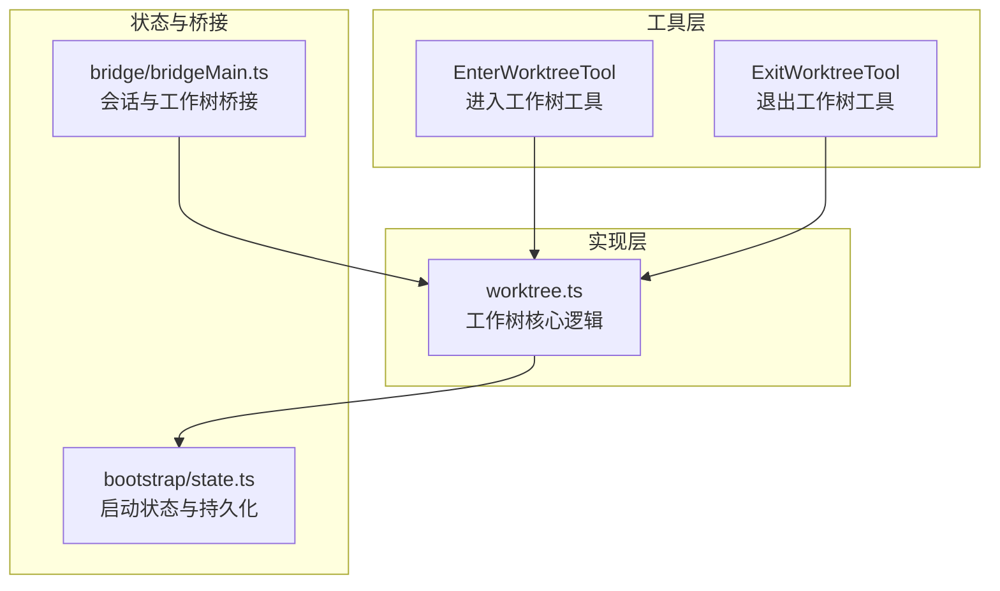
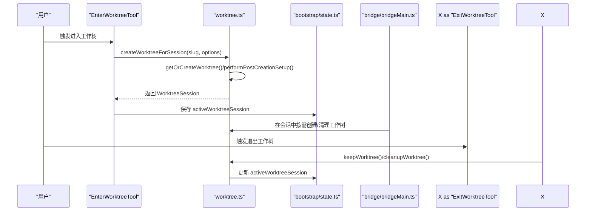
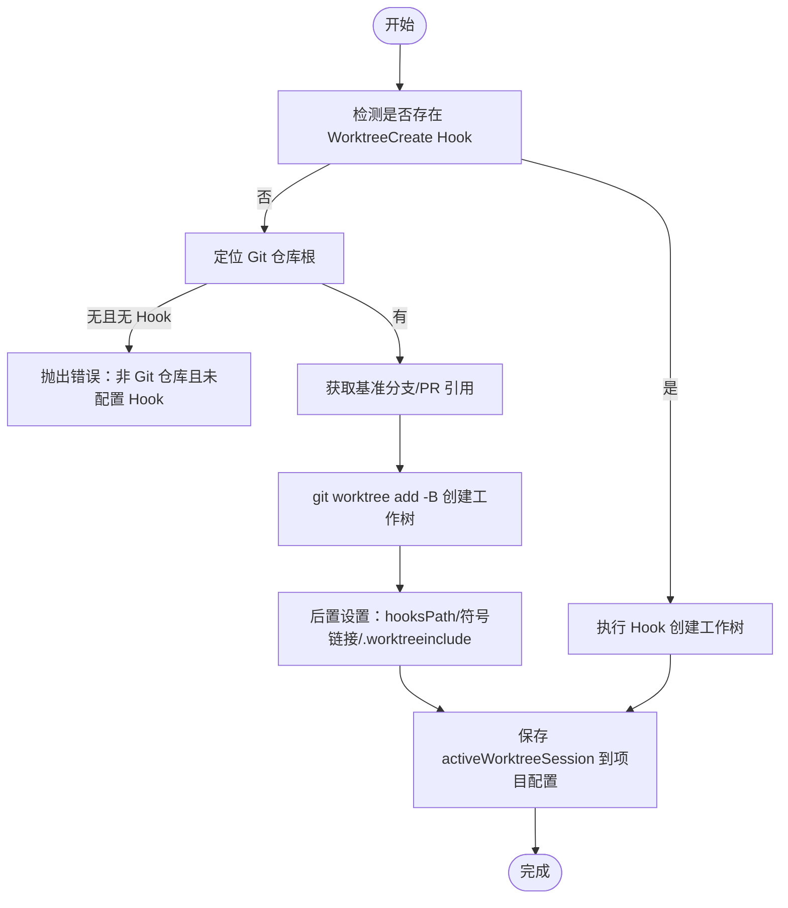
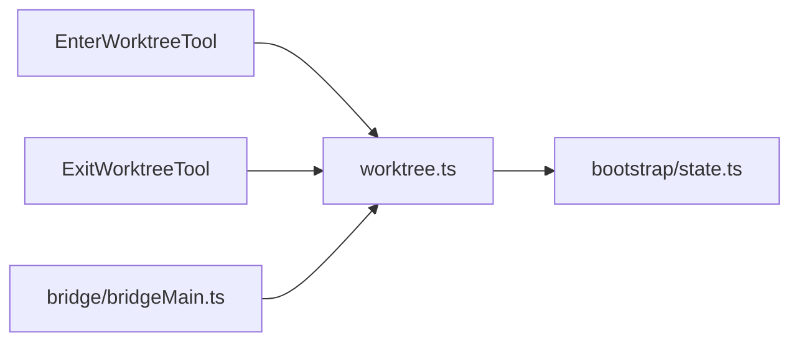

# 工作树管理工具

<cite>
**本文引用的文件**
- [src/utils/worktree.ts](file://src/utils/worktree.ts)
- [src/utils/worktreeModeEnabled.ts](file://src/utils/worktreeModeEnabled.ts)
- [src/tools/EnterWorktreeTool/prompt.ts](file://src/tools/EnterWorktreeTool/prompt.ts)
- [src/tools/ExitWorktreeTool/prompt.ts](file://src/tools/ExitWorktreeTool/prompt.ts)
- [src/tools/EnterWorktreeTool/constants.ts](file://src/tools/EnterWorktreeTool/constants.ts)
- [src/tools/ExitWorktreeTool/constants.ts](file://src/tools/ExitWorktreeTool/constants.ts)
- [src/bootstrap/state.ts](file://src/bootstrap/state.ts)
- [src/bridge/bridgeMain.ts](file://src/bridge/bridgeMain.ts)
</cite>

## 目录
1. [简介](#简介)
2. [项目结构](#项目结构)
3. [核心组件](#核心组件)
4. [架构总览](#架构总览)
5. [详细组件分析](#详细组件分析)
6. [依赖关系分析](#依赖关系分析)
7. [性能考量](#性能考量)
8. [故障排查指南](#故障排查指南)
9. [结论](#结论)
10. [附录](#附录)

## 简介
本文件系统性阐述 Claude Code 的“工作树（worktree）”管理能力：包括工作树概念、在 Claude Code 中的应用场景、路径解析与环境准备、切换时的状态保存与恢复、退出时的清理与资源释放、配置管理与路径映射、权限与安全控制、以及多工作树并行管理的最佳实践与冲突处理策略。文档面向不同技术背景的读者，既提供高层概览，也给出代码级的可视化图示与来源标注。

## 项目结构
工作树功能主要由以下模块协同实现：
- 工具层：EnterWorktreeTool 与 ExitWorktreeTool，负责用户意图识别与交互提示
- 工具实现层：src/utils/worktree.ts 提供工作树创建、挂载、清理、持久化等核心逻辑
- 启动与状态层：src/bootstrap/state.ts 负责会话与工作树状态的初始化与持久化
- 桥接层：src/bridge/bridgeMain.ts 在会话生命周期中触发工作树创建与清理
- 配置与模式开关：src/utils/worktreeModeEnabled.ts 统一启用工作树模式

图表来源
- [src/tools/EnterWorktreeTool/prompt.ts:1-32](file://src/tools/EnterWorktreeTool/prompt.ts#L1-L32)
- [src/tools/ExitWorktreeTool/prompt.ts:1-32](file://src/tools/ExitWorktreeTool/prompt.ts#L1-L32)
- [src/utils/worktree.ts:1-1521](file://src/utils/worktree.ts#L1-L1521)
- [src/bootstrap/state.ts:46-519](file://src/bootstrap/state.ts#L46-L519)
- [src/bridge/bridgeMain.ts:21-1071](file://src/bridge/bridgeMain.ts#L21-L1071)

章节来源
- [src/utils/worktree.ts:1-1521](file://src/utils/worktree.ts#L1-L1521)
- [src/tools/EnterWorktreeTool/prompt.ts:1-32](file://src/tools/EnterWorktreeTool/prompt.ts#L1-L32)
- [src/tools/ExitWorktreeTool/prompt.ts:1-32](file://src/tools/ExitWorktreeTool/prompt.ts#L1-L32)
- [src/bootstrap/state.ts:46-519](file://src/bootstrap/state.ts#L46-L519)
- [src/bridge/bridgeMain.ts:21-1071](file://src/bridge/bridgeMain.ts#L21-L1071)

## 核心组件
- 工作树会话模型与状态
  - 当前工作树会话对象包含原始工作目录、工作树路径、分支信息、会话标识、tmux 会话名等字段，并支持持久化到项目配置
- 创建与挂载
  - 支持 Hook 基础与 Git 基础两种创建路径；优先执行 Hook 创建，失败回退到 Git worktree
  - 新建工作树时执行后置设置：复制本地配置、设置 hooksPath、可选符号链接大目录、拷贝 .worktreeinclude 列表中的忽略文件
- 清理与退出
  - 保留工作树或删除工作树两种策略；Git 工作树通过 git worktree remove 删除，临时分支在需要时删除
  - tmux 会话在保留时保持运行，在删除时被终止
- 模式开关与入口
  - 工作树模式已全局启用；CLI 快速路径支持 --worktree 与 --tmux 组合，直接在工作树内启动 tmux 并运行 Claude

章节来源
- [src/utils/worktree.ts:140-178](file://src/utils/worktree.ts#L140-L178)
- [src/utils/worktree.ts:702-778](file://src/utils/worktree.ts#L702-L778)
- [src/utils/worktree.ts:813-894](file://src/utils/worktree.ts#L813-L894)
- [src/utils/worktreeModeEnabled.ts:1-13](file://src/utils/worktreeModeEnabled.ts#L1-L13)

## 架构总览
工作树在 Claude Code 中贯穿“工具调用—实现—状态—桥接”的完整链路。EnterWorktreeTool 与 ExitWorktreeTool 作为用户交互入口，调用 worktree.ts 的核心方法；worktree.ts 与 bootstrap/state.ts 协作完成状态持久化；bridge/bridgeMain.ts 在会话生命周期中触发工作树创建与清理。

图表来源
- [src/tools/EnterWorktreeTool/prompt.ts:1-32](file://src/tools/EnterWorktreeTool/prompt.ts#L1-L32)
- [src/utils/worktree.ts:702-778](file://src/utils/worktree.ts#L702-L778)
- [src/utils/worktree.ts:780-811](file://src/utils/worktree.ts#L780-L811)
- [src/utils/worktree.ts:813-894](file://src/utils/worktree.ts#L813-L894)
- [src/bootstrap/state.ts:46-519](file://src/bootstrap/state.ts#L46-L519)
- [src/bridge/bridgeMain.ts:962-1071](file://src/bridge/bridgeMain.ts#L962-L1071)

## 详细组件分析

### 工具层：进入/退出工作树
- 进入工作树工具
  - 仅在用户明确要求时使用；要求当前处于 Git 仓库或已配置 WorktreeCreate/WorktreeRemove Hook；不可与普通分支切换混淆
  - 行为：在 Git 仓库中创建 .claude/worktrees/<slug> 对应的隔离工作树并切换会话目录；若无仓库则委托 Hook
- 退出工作树工具
  - 仅作用于本次会话由 EnterWorktree 创建的工作树；支持“保留（保留目录与分支）”和“移除（删除目录与分支）”两种动作
  - 若未处于 EnterWorktree 会话中，则为无操作（no-op）

章节来源
- [src/tools/EnterWorktreeTool/prompt.ts:1-32](file://src/tools/EnterWorktreeTool/prompt.ts#L1-L32)
- [src/tools/ExitWorktreeTool/prompt.ts:1-32](file://src/tools/ExitWorktreeTool/prompt.ts#L1-L32)
- [src/tools/EnterWorktreeTool/constants.ts:1-3](file://src/tools/EnterWorktreeTool/constants.ts#L1-L3)
- [src/tools/ExitWorktreeTool/constants.ts:1-1](file://src/tools/ExitWorktreeTool/constants.ts#L1-L1)

### 实现层：工作树核心逻辑
- 会话模型与持久化
  - 当前会话对象包含 originalCwd、worktreePath、worktreeName、worktreeBranch、originalBranch、originalHeadCommit、sessionId、tmuxSessionName 等
  - 通过 saveCurrentProjectConfig 将 activeWorktreeSession 写入项目配置，确保重启后可恢复
- 路径解析与命名规范
  - 工作树目录位于 .claude/worktrees/<扁平化slug>；slug 支持嵌套分隔符（如 user/feature），但最终以 + 替换为安全路径
  - 分支名以 worktree- 前缀 + 扁平化 slug 组成，避免与现有分支冲突
- 创建与挂载
  - Hook 优先：若存在 WorktreeCreate Hook，则调用 Hook 创建工作树路径
  - Git 回退：否则在 Git 仓库根下创建工作树，必要时先 fetch 基准分支或 PR 引用，再执行 git worktree add -B
  - 后置设置：复制 settings.local.json、设置 hooksPath、可选符号链接大目录、拷贝 .worktreeinclude 中的忽略文件
- 清理与退出
  - 保留：仅切换回原目录并清空当前会话，不删除工作树
  - 移除：根据是否 Hook 或 Git 路径分别处理；Git 路径下还删除临时分支；更新项目配置 activeWorktreeSession
- tmux 集成
  - 可生成 tmux 会话名并创建/附加 tmux 会话；在 iTerm2 下支持控制模式以获得更好的终端集成体验
- 安全与权限
  - slug 校验防止路径穿越与非法字符；对符号链接失败进行容错处理（ENOENT/EEXIST 视为正常）
  - Git 操作使用非交互环境变量避免阻塞；稀疏检出失败时自动回滚并报错

图表来源
- [src/utils/worktree.ts:702-778](file://src/utils/worktree.ts#L702-L778)
- [src/utils/worktree.ts:235-375](file://src/utils/worktree.ts#L235-L375)
- [src/utils/worktree.ts:510-624](file://src/utils/worktree.ts#L510-L624)
- [src/bootstrap/state.ts:46-519](file://src/bootstrap/state.ts#L46-L519)

章节来源
- [src/utils/worktree.ts:140-178](file://src/utils/worktree.ts#L140-L178)
- [src/utils/worktree.ts:204-227](file://src/utils/worktree.ts#L204-L227)
- [src/utils/worktree.ts:235-375](file://src/utils/worktree.ts#L235-L375)
- [src/utils/worktree.ts:510-624](file://src/utils/worktree.ts#L510-L624)
- [src/utils/worktree.ts:702-778](file://src/utils/worktree.ts#L702-L778)
- [src/utils/worktree.ts:813-894](file://src/utils/worktree.ts#L813-L894)
- [src/bootstrap/state.ts:46-519](file://src/bootstrap/state.ts#L46-L519)

### 桥接层：会话生命周期中的工作树
- 在桥接层中，当决定以工作树模式创建会话时，会记录工作树路径与分支，并在会话结束或异常时清理工作树
- 该层还负责在工作树模式下对分析与统计行为进行一致性处理（例如避免同一会话在不同目录产生矛盾指标）

章节来源
- [src/bridge/bridgeMain.ts:962-1071](file://src/bridge/bridgeMain.ts#L962-L1071)

### 配置管理、路径映射与权限控制
- 配置管理
  - settings.worktree.sparsePaths：用于稀疏检出，减少工作树体积
  - settings.worktree.symlinkDirectories：指定需要符号链接的大目录（如 node_modules），避免重复占用磁盘
  - settings.local.json：在工作树创建后复制到工作树的 .claude 目录，保证本地配置一致
- 路径映射
  - 工作树目录映射到 .claude/worktrees/<扁平化slug>；分支映射到 worktree-<扁平化slug>
  - hooksPath 统一指向主仓库的 hooks 目录，解决 .husky 等相对路径问题
- 权限控制
  - slug 校验严格限制字符集与长度，禁止路径穿越
  - 符号链接失败（ENOENT/EEXIST）视为正常，其他错误仅记录告警
  - Git 操作禁用交互式凭据提示，避免阻塞

章节来源
- [src/utils/worktree.ts:48-87](file://src/utils/worktree.ts#L48-L87)
- [src/utils/worktree.ts:580-589](file://src/utils/worktree.ts#L580-L589)
- [src/utils/worktree.ts:536-578](file://src/utils/worktree.ts#L536-L578)
- [src/utils/worktree.ts:195-202](file://src/utils/worktree.ts#L195-L202)

### 多工作树并行管理与冲突处理
- 模式开关
  - 工作树模式已全局启用，无需额外开关
- 冲突处理
  - 不同工作树之间通过唯一 slug 与分支隔离，避免文件与分支冲突
  - tmux 会话名基于仓库名与分支生成，避免重名冲突
- 清理策略
  - 提供清理过期/临时工作树的扫描与删除逻辑，仅针对特定模式的临时 slug，跳过当前会话与有变更的工作树
  - 对未推送提交或存在跟踪文件的工作树采取保守策略（跳过）

章节来源
- [src/utils/worktreeModeEnabled.ts:1-13](file://src/utils/worktreeModeEnabled.ts#L1-L13)
- [src/utils/worktree.ts:1022-1136](file://src/utils/worktree.ts#L1022-L1136)

### 使用示例与最佳实践
- 示例：进入工作树
  - 用户明确表达“使用工作树”，工具创建隔离工作树并切换会话目录；后续可通过 ExitWorktree 选择保留或移除
- 示例：PR 场景
  - 支持传入 PR 参考（URL 或 #N），自动生成对应工作树名称与分支
- 最佳实践
  - 仅在需要隔离实验或临时开发时使用工作树；避免滥用导致磁盘占用
  - 对大型仓库开启 settings.worktree.symlinkDirectories 与 settings.worktree.sparsePaths 以优化性能
  - 使用 tmux 时注意与 Claude 快捷键前缀冲突，必要时调整 tmux 前缀

章节来源
- [src/tools/EnterWorktreeTool/prompt.ts:1-32](file://src/tools/EnterWorktreeTool/prompt.ts#L1-L32)
- [src/utils/worktree.ts:1175-1521](file://src/utils/worktree.ts#L1175-L1521)

## 依赖关系分析
- 工具层依赖实现层：EnterWorktreeTool/ExitWorktreeTool 通过调用 worktree.ts 的公共 API 完成工作树的创建、保留与清理
- 实现层依赖状态层：工作树会话持久化依赖 bootstrap/state.ts 的项目配置写入
- 桥接层依赖实现层：bridgeMain.ts 在会话生命周期中触发工作树创建与清理，确保会话一致性

图表来源
- [src/tools/EnterWorktreeTool/prompt.ts:1-32](file://src/tools/EnterWorktreeTool/prompt.ts#L1-L32)
- [src/tools/ExitWorktreeTool/prompt.ts:1-32](file://src/tools/ExitWorktreeTool/prompt.ts#L1-L32)
- [src/utils/worktree.ts:1-1521](file://src/utils/worktree.ts#L1-L1521)
- [src/bootstrap/state.ts:46-519](file://src/bootstrap/state.ts#L46-L519)
- [src/bridge/bridgeMain.ts:21-1071](file://src/bridge/bridgeMain.ts#L21-L1071)

章节来源
- [src/tools/EnterWorktreeTool/prompt.ts:1-32](file://src/tools/EnterWorktreeTool/prompt.ts#L1-L32)
- [src/tools/ExitWorktreeTool/prompt.ts:1-32](file://src/tools/ExitWorktreeTool/prompt.ts#L1-L32)
- [src/utils/worktree.ts:1-1521](file://src/utils/worktree.ts#L1-L1521)
- [src/bootstrap/state.ts:46-519](file://src/bootstrap/state.ts#L46-L519)
- [src/bridge/bridgeMain.ts:21-1071](file://src/bridge/bridgeMain.ts#L21-L1071)

## 性能考量
- 快速恢复：在工作树已存在时，直接读取 HEAD 指针，避免重复 fetch 与创建开销
- 稀疏检出：通过 settings.worktree.sparsePaths 减少工作树体积与检出时间
- 符号链接：对 node_modules 等大目录采用符号链接，避免重复复制
- I/O 优化：.worktreeinclude 使用 git ls-files 的 collapsed 目录模式，大幅降低遍历成本

章节来源
- [src/utils/worktree.ts:247-255](file://src/utils/worktree.ts#L247-L255)
- [src/utils/worktree.ts:321-366](file://src/utils/worktree.ts#L321-L366)
- [src/utils/worktree.ts:580-589](file://src/utils/worktree.ts#L580-L589)
- [src/utils/worktree.ts:410-480](file://src/utils/worktree.ts#L410-L480)

## 故障排查指南
- 无法创建工作树
  - 若不在 Git 仓库且未配置 Hook，将抛出错误；请确认仓库根或配置 WorktreeCreate/WorktreeRemove Hook
- tmux 相关问题
  - Windows 不支持 --tmux；tmux 未安装时会提示安装方式；检查 tmux 前缀是否与 Claude 快捷键冲突
- 权限与符号链接失败
  - 对于 ENOENT/EEXIST 的符号链接失败视为正常；其他错误仅记录告警
- 清理失败
  - 移除工作树或分支失败时会记录错误；可手动检查工作树状态并重试

章节来源
- [src/utils/worktree.ts:731-737](file://src/utils/worktree.ts#L731-L737)
- [src/utils/worktree.ts:1184-1203](file://src/utils/worktree.ts#L1184-L1203)
- [src/utils/worktree.ts:1246-1253](file://src/utils/worktree.ts#L1246-L1253)
- [src/utils/worktree.ts:1274-1281](file://src/utils/worktree.ts#L1274-L1281)
- [src/utils/worktree.ts:1299-1305](file://src/utils/worktree.ts#L1299-L1305)
- [src/utils/worktree.ts:124-137](file://src/utils/worktree.ts#L124-L137)
- [src/utils/worktree.ts:847-852](file://src/utils/worktree.ts#L847-L852)
- [src/utils/worktree.ts:877-883](file://src/utils/worktree.ts#L877-L883)

## 结论
Claude Code 的工作树管理工具通过“工具层—实现层—状态层—桥接层”的清晰分层，提供了安全、高效、可配置的工作树隔离能力。其核心特性包括：严格的 slug 校验与路径映射、Hook/Git 双路径创建、tmux 集成、稀疏检出与符号链接优化、以及会话级别的持久化与清理策略。结合本文提供的最佳实践与故障排查建议，可在复杂项目中稳定地使用工作树进行隔离开发与实验。

## 附录
- 关键术语
  - 工作树：Git 提供的隔离工作目录，便于在同一仓库下并行开发不同分支或实验
  - Hook：用户自定义的 VCS 后端，允许在非 Git 环境中使用工作树隔离
  - tmux：终端复用器，可在工作树中创建独立会话并进行多面板开发
- 相关文件索引
  - 工具提示与常量：EnterWorktreeTool/prompt.ts、ExitWorktreeTool/prompt.ts、EnterWorktreeTool/constants.ts、ExitWorktreeTool/constants.ts
  - 核心实现：src/utils/worktree.ts
  - 模式开关：src/utils/worktreeModeEnabled.ts
  - 启动与状态：src/bootstrap/state.ts
  - 桥接与生命周期：src/bridge/bridgeMain.ts