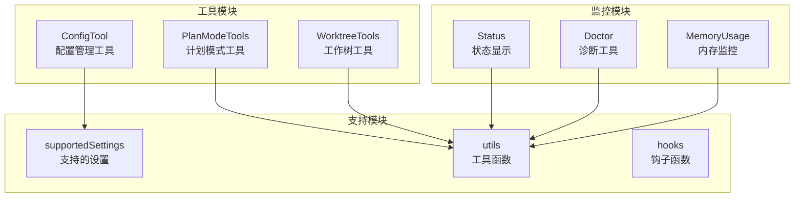
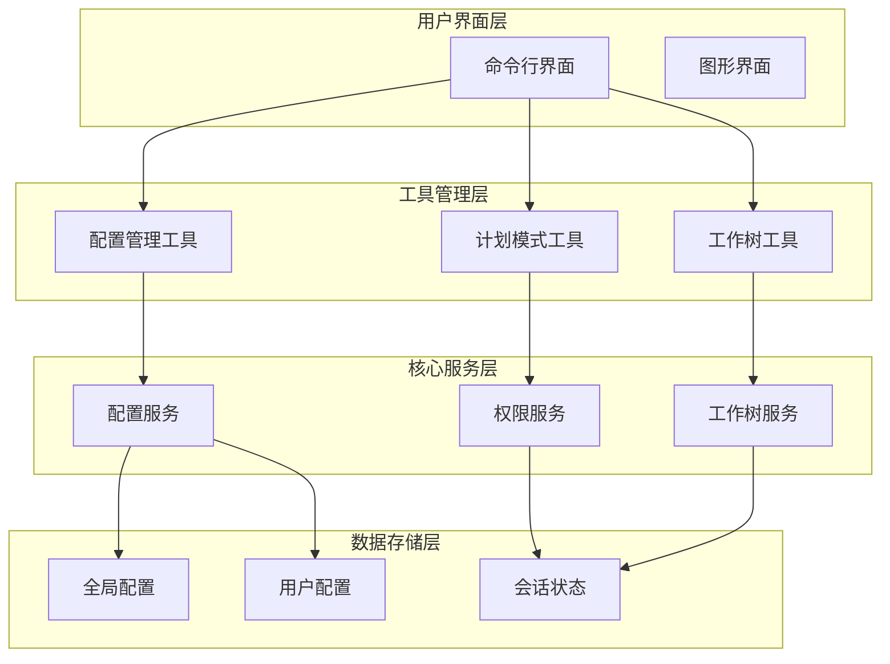
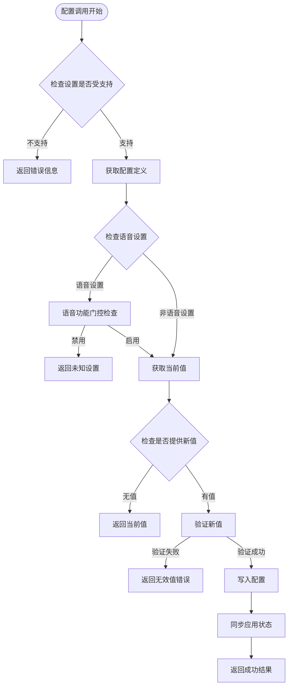
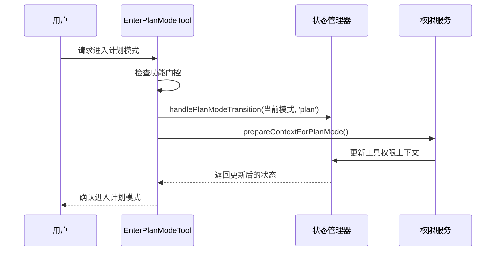
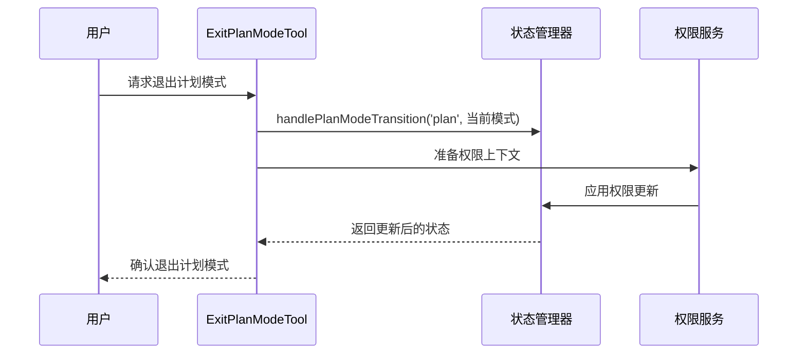
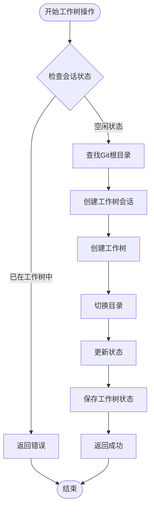
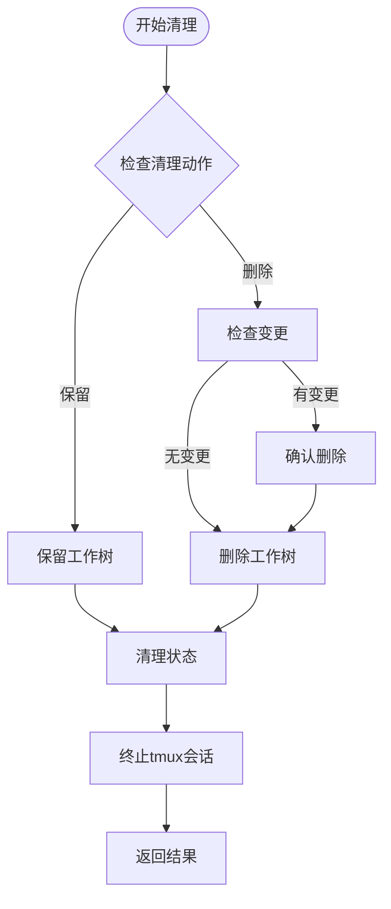
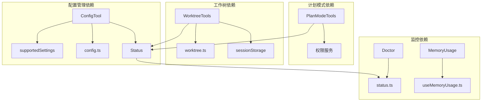
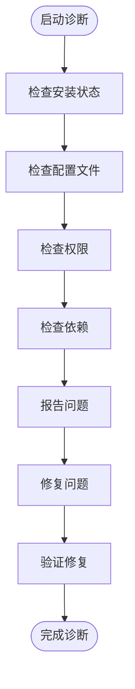

# 系统管理工具

<cite>
**本文档引用的文件**
- [ConfigTool.ts](file://src/tools/ConfigTool/ConfigTool.ts)
- [supportedSettings.ts](file://src/tools/ConfigTool/supportedSettings.ts)
- [EnterPlanModeTool.ts](file://src/tools/EnterPlanModeTool/EnterPlanModeTool.ts)
- [ExitPlanModeTool.ts](file://src/tools/ExitPlanModeTool/ExitPlanModeV2Tool.ts)
- [EnterWorktreeTool.ts](file://src/tools/EnterWorktreeTool/EnterWorktreeTool.ts)
- [ExitWorktreeTool.ts](file://src/tools/ExitWorktreeTool/ExitWorktreeTool.ts)
- [worktree.ts](file://src/utils/worktree.ts)
- [state.ts](file://src/bootstrap/state.ts)
- [useMemoryUsage.ts](file://src/hooks/useMemoryUsage.ts)
- [Status.tsx](file://src/components/Settings/Status.tsx)
- [Doctor.tsx](file://src/screens/Doctor.tsx)
- [config.ts](file://src/utils/config.ts)
- [fileHistory.ts](file://src/utils/fileHistory.ts)
</cite>

## 目录
1. [简介](#简介)
2. [项目结构](#项目结构)
3. [核心组件](#核心组件)
4. [架构概览](#架构概览)
5. [详细组件分析](#详细组件分析)
6. [依赖关系分析](#依赖关系分析)
7. [性能考虑](#性能考虑)
8. [故障排除指南](#故障排除指南)
9. [结论](#结论)

## 简介

Claude Code 的系统管理工具是一套完整的配置管理系统，提供了配置管理、计划模式控制、工作树管理、系统状态监控和性能优化等功能。该系统通过工具化的接口为用户提供了一站式的系统管理解决方案。

系统管理工具的核心目标是：
- 提供统一的配置管理界面和操作接口
- 支持计划模式的进入和退出机制
- 实现工作树的创建、切换和清理管理
- 监控系统状态和性能指标
- 提供配置文件的备份、恢复和版本控制

## 项目结构

系统管理工具主要分布在以下目录结构中：

**图表来源**
- [ConfigTool.ts:1-469](file://src/tools/ConfigTool/ConfigTool.ts#L1-L469)
- [EnterPlanModeTool.ts:1-128](file://src/tools/EnterPlanModeTool/EnterPlanModeTool.ts#L1-L128)
- [EnterWorktreeTool.ts:1-129](file://src/tools/EnterWorktreeTool/EnterWorktreeTool.ts#L1-L129)

**章节来源**
- [ConfigTool.ts:1-469](file://src/tools/ConfigTool/ConfigTool.ts#L1-L469)
- [EnterPlanModeTool.ts:1-128](file://src/tools/EnterPlanModeTool/EnterPlanModeTool.ts#L1-L128)
- [EnterWorktreeTool.ts:1-129](file://src/tools/EnterWorktreeTool/EnterWorktreeTool.ts#L1-L129)

## 核心组件

### 配置管理工具 (ConfigTool)

ConfigTool 是系统的核心配置管理组件，提供了以下关键功能：

- **统一配置接口**：通过单一工具接口管理所有系统配置
- **类型安全验证**：内置类型检查和值验证机制
- **实时配置同步**：自动同步配置到应用状态
- **权限控制**：智能权限检查和用户确认流程

### 计划模式工具

计划模式工具集成了完整的进入和退出机制：

- **EnterPlanModeTool**：进入计划模式，准备探索和设计
- **ExitPlanModeTool**：退出计划模式，开始实际编码工作

### 工作树工具

工作树工具提供了完整的项目工作环境管理：

- **EnterWorktreeTool**：创建并切换到新的工作树
- **ExitWorktreeTool**：退出工作树并清理相关资源

**章节来源**
- [ConfigTool.ts:67-434](file://src/tools/ConfigTool/ConfigTool.ts#L67-L434)
- [EnterPlanModeTool.ts:36-127](file://src/tools/EnterPlanModeTool/EnterPlanModeTool.ts#L36-L127)
- [EnterWorktreeTool.ts:52-128](file://src/tools/EnterWorktreeTool/EnterWorktreeTool.ts#L52-L128)

## 架构概览

系统采用模块化架构设计，各组件之间通过清晰的接口进行交互：

**图表来源**
- [ConfigTool.ts:1-469](file://src/tools/ConfigTool/ConfigTool.ts#L1-L469)
- [state.ts:1345-1387](file://src/bootstrap/state.ts#L1345-L1387)

## 详细组件分析

### 配置管理工具深度分析

ConfigTool 作为系统的核心配置管理组件，实现了以下关键特性：

#### 配置验证和类型检查

**图表来源**
- [ConfigTool.ts:111-411](file://src/tools/ConfigTool/ConfigTool.ts#L111-L411)

#### 支持的设置类型

ConfigTool 支持多种配置类型，包括：

- **全局配置**：影响整个系统的设置
- **用户配置**：针对特定用户的个性化设置
- **布尔配置**：开关类设置
- **字符串配置**：文本类设置
- **枚举配置**：预定义选项集合

**章节来源**
- [ConfigTool.ts:111-411](file://src/tools/ConfigTool/ConfigTool.ts#L111-L411)
- [supportedSettings.ts:29-186](file://src/tools/ConfigTool/supportedSettings.ts#L29-L186)

### 计划模式工具分析

计划模式工具提供了完整的模式切换机制：

#### 进入计划模式流程

**图表来源**
- [EnterPlanModeTool.ts:77-102](file://src/tools/EnterPlanModeTool/EnterPlanModeTool.ts#L77-L102)
- [state.ts:1349-1363](file://src/bootstrap/state.ts#L1349-L1363)

#### 退出计划模式流程

**图表来源**
- [ExitPlanModeTool.ts:147-191](file://src/tools/ExitPlanModeTool/ExitPlanModeV2Tool.ts#L147-L191)
- [state.ts:1349-1363](file://src/bootstrap/state.ts#L1349-L1363)

**章节来源**
- [EnterPlanModeTool.ts:36-127](file://src/tools/EnterPlanModeTool/EnterPlanModeTool.ts#L36-L127)
- [ExitPlanModeTool.ts:147-191](file://src/tools/ExitPlanModeTool/ExitPlanModeV2Tool.ts#L147-L191)
- [state.ts:1345-1387](file://src/bootstrap/state.ts#L1345-L1387)

### 工作树工具分析

工作树工具提供了完整的项目工作环境管理功能：

#### 工作树生命周期管理

**图表来源**
- [EnterWorktreeTool.ts:77-118](file://src/tools/EnterWorktreeTool/EnterWorktreeTool.ts#L77-L118)

#### 工作树清理机制

**图表来源**
- [ExitWorktreeTool.ts:174-321](file://src/tools/ExitWorktreeTool/ExitWorktreeTool.ts#L174-L321)

**章节来源**
- [EnterWorktreeTool.ts:52-128](file://src/tools/EnterWorktreeTool/EnterWorktreeTool.ts#L52-L128)
- [ExitWorktreeTool.ts:148-331](file://src/tools/ExitWorktreeTool/ExitWorktreeTool.ts#L148-L331)
- [worktree.ts:117-894](file://src/utils/worktree.ts#L117-L894)

## 依赖关系分析

系统管理工具之间的依赖关系如下：

**图表来源**
- [ConfigTool.ts:1-469](file://src/tools/ConfigTool/ConfigTool.ts#L1-L469)
- [EnterPlanModeTool.ts:1-128](file://src/tools/EnterPlanModeTool/EnterPlanModeTool.ts#L1-L128)
- [EnterWorktreeTool.ts:1-129](file://src/tools/EnterWorktreeTool/EnterWorktreeTool.ts#L1-L129)

**章节来源**
- [ConfigTool.ts:1-469](file://src/tools/ConfigTool/ConfigTool.ts#L1-L469)
- [EnterPlanModeTool.ts:1-128](file://src/tools/EnterPlanModeTool/EnterPlanModeTool.ts#L1-L128)
- [EnterWorktreeTool.ts:1-129](file://src/tools/EnterWorktreeTool/EnterWorktreeTool.ts#L1-L129)

## 性能考虑

系统管理工具在设计时充分考虑了性能优化：

### 内存使用监控

系统提供了实时的内存使用监控功能：

- **定期轮询**：每10秒检查一次内存使用情况
- **智能更新**：仅在内存使用超过阈值时更新状态
- **阈值设置**：高内存阈值1.5GB，临界阈值2.5GB

### 配置访问优化

- **延迟加载**：配置文件按需加载，避免启动时的性能开销
- **缓存机制**：常用配置结果缓存，减少重复计算
- **异步处理**：配置更新采用异步方式，避免阻塞主线程

### 文件操作优化

- **批量操作**：支持批量配置更新，减少文件I/O操作
- **增量更新**：仅更新发生变化的配置项
- **原子操作**：配置更新采用原子方式，确保数据一致性

## 故障排除指南

### 常见问题及解决方案

#### 配置管理问题

**问题**：配置无法保存或读取失败
- 检查配置文件权限
- 验证配置格式正确性
- 确认磁盘空间充足

**问题**：配置更新后未生效
- 检查应用状态同步
- 验证配置门控设置
- 重启相关服务

#### 计划模式问题

**问题**：无法进入计划模式
- 检查功能门控设置
- 验证通道配置
- 确认权限状态

**问题**：无法退出计划模式
- 检查会话状态
- 验证权限更新
- 查看日志信息

#### 工作树问题

**问题**：工作树创建失败
- 检查Git配置
- 验证目录权限
- 确认磁盘空间

**问题**：工作树清理失败
- 检查进程锁定
- 验证文件权限
- 手动清理残留文件

### 系统诊断工具

系统提供了完整的诊断工具来帮助故障排除：

**图表来源**
- [Doctor.tsx:100-501](file://src/screens/Doctor.tsx#L100-L501)

**章节来源**
- [Doctor.tsx:1-576](file://src/screens/Doctor.tsx#L1-L576)

## 结论

Claude Code 的系统管理工具提供了一个完整、高效且用户友好的系统管理解决方案。通过模块化的设计和清晰的接口，该系统能够满足各种复杂的系统管理需求。

主要优势包括：
- **统一管理界面**：单一工具接口管理所有系统配置
- **智能权限控制**：自动权限检查和用户确认流程
- **完整的生命周期管理**：从创建到清理的完整工作流
- **实时监控能力**：系统状态和性能指标的实时监控
- **强大的故障排除工具**：完善的诊断和修复机制

未来可以考虑的功能增强：
- 更丰富的配置模板支持
- 自动化配置备份和恢复
- 更详细的性能分析报告
- 集成更多的第三方工具和服务