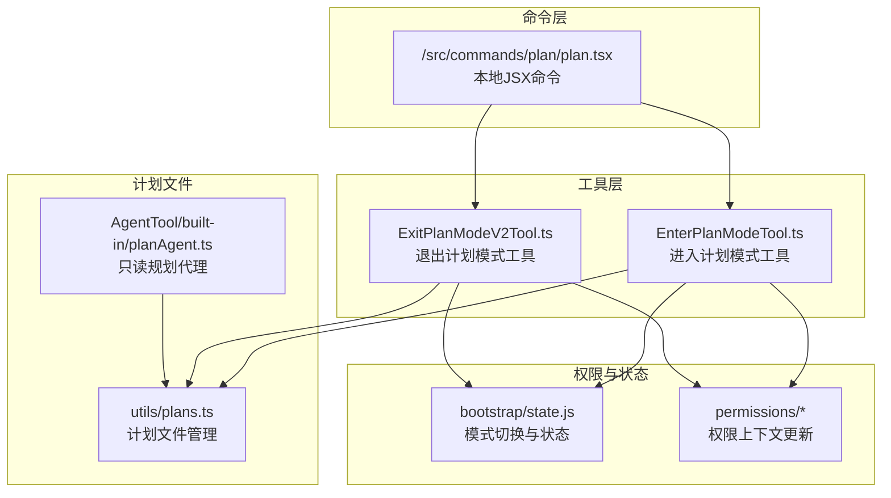
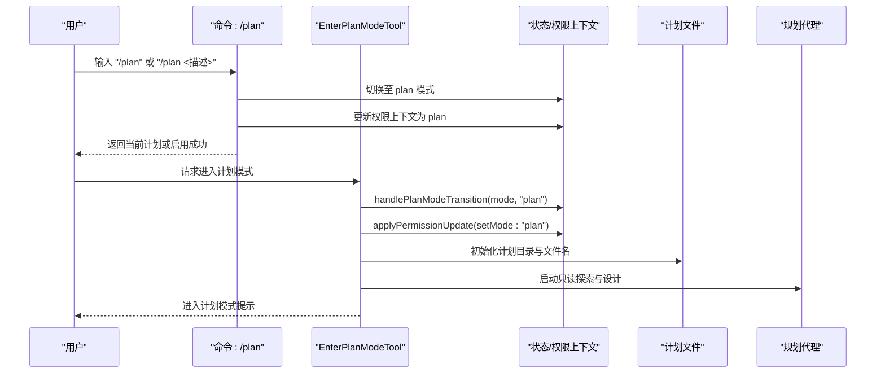
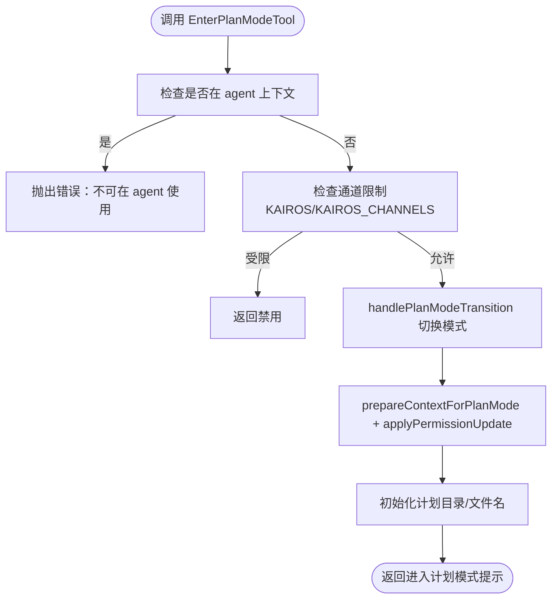
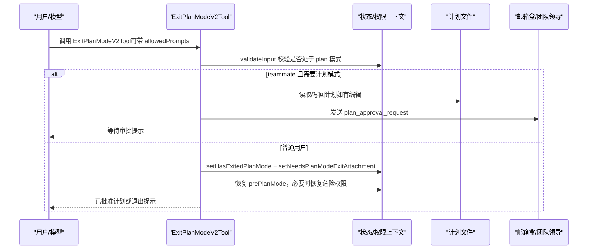
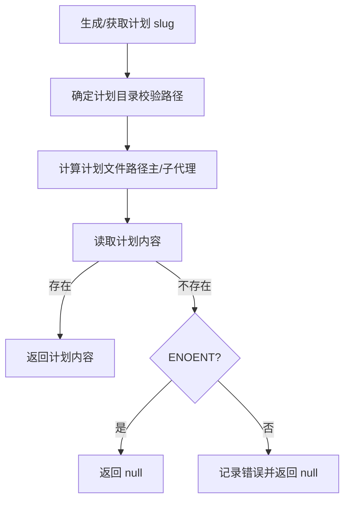
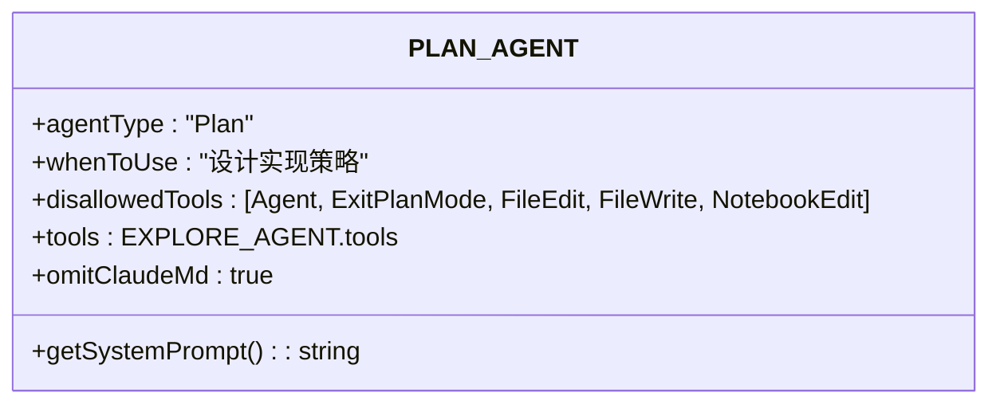
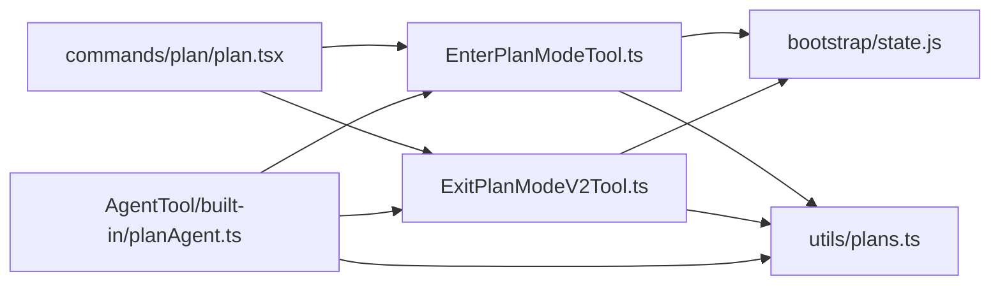

# 计划模式工具

<cite>
**本文档引用的文件**
- [EnterPlanModeTool.ts](file://src/tools/EnterPlanModeTool/EnterPlanModeTool.ts)
- [ExitPlanModeV2Tool.ts](file://src/tools/ExitPlanModeTool/ExitPlanModeV2Tool.ts)
- [plan.tsx](file://src/commands/plan/plan.tsx)
- [index.ts](file://src/commands/plan/index.ts)
- [planAgent.ts](file://src/tools/AgentTool/built-in/planAgent.ts)
- [planModeV2.ts](file://src/utils/planModeV2.ts)
- [plans.ts](file://src/utils/plans.ts)
- [UI.tsx（进入）](file://src/tools/EnterPlanModeTool/UI.tsx)
- [UI.tsx（退出）](file://src/tools/ExitPlanModeTool/UI.tsx)
- [constants.ts（进入）](file://src/tools/EnterPlanModeTool/constants.ts)
- [constants.ts（退出）](file://src/tools/ExitPlanModeTool/constants.ts)
</cite>

## 目录
1. [简介](#简介)
2. [项目结构](#项目结构)
3. [核心组件](#核心组件)
4. [架构总览](#架构总览)
5. [详细组件分析](#详细组件分析)
6. [依赖关系分析](#依赖关系分析)
7. [性能考量](#性能考量)
8. [故障排除指南](#故障排除指南)
9. [结论](#结论)
10. [附录](#附录)

## 简介
本文件系统性地介绍 Claude Code 的“计划模式”工具链：从触发机制、准备阶段、工作流与决策过程，到退出时的清理与状态恢复；并阐明计划模式与普通模式之间的切换逻辑、工具调用的特殊处理与权限管理。文档还覆盖使用场景、限制条件、故障排除以及最佳实践。

## 项目结构
计划模式由“命令入口”“工具实现”“权限上下文”“计划文件持久化”“内置规划代理”等模块协同完成。关键路径如下：
- 命令层：/src/commands/plan 提供本地 JSX 命令入口，负责模式切换与计划展示
- 工具层：EnterPlanModeTool/ExitPlanModeV2Tool 实现进入/退出计划模式的工具定义与执行
- 权限与模式：通过权限上下文更新与状态机迁移实现模式切换
- 计划文件：plans.ts 负责计划文件生成、恢复、快照与路径管理
- 内置代理：planAgent.ts 定义只读探索型规划代理，限定工具集与行为
- 配置与特性开关：planModeV2.ts 提供实验特性与配额控制

图表来源
- [plan.tsx:64-121](file://src/commands/plan/plan.tsx#L64-L121)
- [EnterPlanModeTool.ts:77-102](file://src/tools/EnterPlanModeTool/EnterPlanModeTool.ts#L77-L102)
- [ExitPlanModeV2Tool.ts:243-418](file://src/tools/ExitPlanModeTool/ExitPlanModeV2Tool.ts#L243-L418)
- [plans.ts:119-144](file://src/utils/plans.ts#L119-L144)
- [planAgent.ts:73-92](file://src/tools/AgentTool/built-in/planAgent.ts#L73-L92)

章节来源
- [plan.tsx:64-121](file://src/commands/plan/plan.tsx#L64-L121)
- [index.ts:1-14](file://src/commands/plan/index.ts#L1-L14)

## 核心组件
- 进入计划模式工具（EnterPlanModeTool）
  - 触发入口：模型请求或用户命令，进入只读探索与设计阶段
  - 权限与模式：更新权限上下文为 plan 模式，记录 prePlanMode 以便退出后恢复
  - 可并发安全、只读、延迟执行，避免在不支持的通道中卡死
- 退出计划模式工具（ExitPlanModeV2Tool）
  - 用户确认后保存/同步计划文件，决定是否需要团队领导审批
  - 清理与恢复：根据 prePlanMode 恢复原模式，必要时恢复被剥离的危险权限
  - 支持编辑后的计划回写与远程会话文件快照
- 计划文件管理（plans.ts）
  - 生成唯一 slug、确定计划目录、读写计划文件
  - 支持恢复（从快照或消息历史）、分叉会话复制、远程会话增量快照
- 内置规划代理（planAgent.ts）
  - 严格限制工具集，禁止文件写操作，聚焦探索与设计
  - 提供系统提示词与工具集合，适配嵌入式搜索工具的存在与否
- 计划模式配置（planModeV2.ts）
  - 控制实验特性（面试阶段、Pewter Ledger 变体）
  - 依据订阅与限额动态调整代理数量与探索代理数量

章节来源
- [EnterPlanModeTool.ts:36-128](file://src/tools/EnterPlanModeTool/EnterPlanModeTool.ts#L36-L128)
- [ExitPlanModeV2Tool.ts:147-495](file://src/tools/ExitPlanModeTool/ExitPlanModeV2Tool.ts#L147-L495)
- [plans.ts:27-111](file://src/utils/plans.ts#L27-L111)
- [planAgent.ts:14-92](file://src/tools/AgentTool/built-in/planAgent.ts#L14-L92)
- [planModeV2.ts:5-97](file://src/utils/planModeV2.ts#L5-L97)

## 架构总览
计划模式围绕“只读探索—设计—批准—执行”的闭环构建，工具与命令通过权限上下文驱动模式切换，计划文件作为共享知识载体贯穿会话生命周期。

图表来源
- [plan.tsx:72-91](file://src/commands/plan/plan.tsx#L72-L91)
- [EnterPlanModeTool.ts:82-94](file://src/tools/EnterPlanModeTool/EnterPlanModeTool.ts#L82-L94)
- [plans.ts:79-111](file://src/utils/plans.ts#L79-L111)
- [planAgent.ts:73-92](file://src/tools/AgentTool/built-in/planAgent.ts#L73-L92)

## 详细组件分析

### 组件A：进入计划模式工具（EnterPlanModeTool）
- 触发与前置检查
  - 不在 agent 上下文使用；在特定通道（如 KAIROS_CHANNELS）禁用以避免 UI 卡死
  - 更新模式前记录 prePlanMode，确保退出后可恢复
- 权限与模式更新
  - 通过 prepareContextForPlanMode 与 applyPermissionUpdate 将模式设置为 plan
  - 输出标准化结果块，包含面试阶段或常规指导语
- 只读与并发
  - isReadOnly 与 isConcurrencySafe 保证不会误改文件且可并发调用

图表来源
- [EnterPlanModeTool.ts:77-102](file://src/tools/EnterPlanModeTool/EnterPlanModeTool.ts#L77-L102)
- [EnterPlanModeTool.ts:56-70](file://src/tools/EnterPlanModeTool/EnterPlanModeTool.ts#L56-L70)

章节来源
- [EnterPlanModeTool.ts:36-128](file://src/tools/EnterPlanModeTool/EnterPlanModeTool.ts#L36-L128)

### 组件B：退出计划模式工具（ExitPlanModeV2Tool）
- 输入校验与权限
  - 非 teammate 且不在 plan 模式时拒绝调用，并记录分析事件
  - teammate 且需要计划模式时，向团队领导发送审批请求并通过邮箱盒传递
- 文件与状态处理
  - 若输入包含已编辑计划则写回磁盘并触发远程快照
  - 设置 hasExitedPlanMode、needsPlanModeExitAttachment、needsAutoModeExitAttachment
  - 恢复 prePlanMode，必要时恢复危险权限或保持剥离状态
- 结果映射
  - 空计划：简单提示退出
  - 等待审批：显示提交信息与等待提示
  - 已批准：输出计划内容与后续建议

图表来源
- [ExitPlanModeV2Tool.ts:195-242](file://src/tools/ExitPlanModeTool/ExitPlanModeV2Tool.ts#L195-L242)
- [ExitPlanModeV2Tool.ts:243-418](file://src/tools/ExitPlanModeTool/ExitPlanModeV2Tool.ts#L243-L418)

章节来源
- [ExitPlanModeV2Tool.ts:147-495](file://src/tools/ExitPlanModeTool/ExitPlanModeV2Tool.ts#L147-L495)

### 组件C：计划文件管理（plans.ts）
- 计划目录与文件名
  - 基于设置与当前工作目录生成计划目录，确保路径在项目根内
  - 生成唯一 word slug，避免冲突；支持主会话与子代理两种文件命名
- 计划读写与恢复
  - 读取失败时返回空；ENOENT 特判用于无计划文件场景
  - 支持从文件快照或消息历史恢复计划内容
- 远程会话快照
  - 在远程环境增量写入系统消息快照，保障跨会话一致性

图表来源
- [plans.ts:32-111](file://src/utils/plans.ts#L32-L111)
- [plans.ts:135-144](file://src/utils/plans.ts#L135-L144)

章节来源
- [plans.ts:1-399](file://src/utils/plans.ts#L1-L399)

### 组件D：内置规划代理（planAgent.ts）
- 行为约束
  - 明确禁止文件写/编辑/删除/移动等变更类工具
  - 仅允许探索类工具（如 Bash、Grep、Glob、FileRead），并强调只读模式
- 系统提示词
  - 提供清晰的探索流程与输出要求，强调关键实现文件清单
- 工具集适配
  - 根据是否存在嵌入式搜索工具动态调整提示中的工具名称

图表来源
- [planAgent.ts:73-92](file://src/tools/AgentTool/built-in/planAgent.ts#L73-L92)

章节来源
- [planAgent.ts:14-92](file://src/tools/AgentTool/built-in/planAgent.ts#L14-L92)

### 组件E：计划模式配置（planModeV2.ts）
- 实验特性
  - 面试阶段开关：蚂蚁用户常开，其他用户可通过环境变量或门控开启
  - Pewter Ledger 变体：控制计划文件长度约束强度（trim/cut/cap/null）
- 代理数量
  - 根据订阅类型与限额等级动态决定规划代理与探索代理数量

章节来源
- [planModeV2.ts:50-97](file://src/utils/planModeV2.ts#L50-L97)

## 依赖关系分析
- 命令层依赖工具层与权限上下文，负责用户交互与结果渲染
- 工具层依赖状态机与计划文件模块，确保模式切换与数据一致性
- 权限模块与内置代理共同约束工具可用性，防止误操作
- 计划文件模块提供跨会话持久化能力，支撑远程与本地一致体验

图表来源
- [plan.tsx:64-121](file://src/commands/plan/plan.tsx#L64-L121)
- [EnterPlanModeTool.ts:82-94](file://src/tools/EnterPlanModeTool/EnterPlanModeTool.ts#L82-L94)
- [ExitPlanModeV2Tool.ts:357-403](file://src/tools/ExitPlanModeTool/ExitPlanModeV2Tool.ts#L357-L403)
- [plans.ts:119-144](file://src/utils/plans.ts#L119-L144)
- [planAgent.ts:73-92](file://src/tools/AgentTool/built-in/planAgent.ts#L73-L92)

章节来源
- [plan.tsx:64-121](file://src/commands/plan/plan.tsx#L64-L121)
- [EnterPlanModeTool.ts:36-128](file://src/tools/EnterPlanModeTool/EnterPlanModeTool.ts#L36-L128)
- [ExitPlanModeV2Tool.ts:147-495](file://src/tools/ExitPlanModeTool/ExitPlanModeV2Tool.ts#L147-L495)
- [plans.ts:1-399](file://src/utils/plans.ts#L1-L399)
- [planAgent.ts:14-92](file://src/tools/AgentTool/built-in/planAgent.ts#L14-L92)

## 性能考量
- 计划目录与 slug 生成采用缓存与记忆化，避免重复 IO 与路径校验
- 远程会话增量快照减少磁盘写入频率，提高跨会话一致性
- 工具并发安全与只读属性降低误操作风险，提升整体稳定性

## 故障排除指南
- 无法进入计划模式
  - 检查通道限制（KAIROS/KAIROS_CHANNELS）是否启用
  - 确认非 agent 上下文调用
  - 查看权限上下文是否正确更新
- 退出计划模式报错
  - 确认当前处于 plan 模式；非 plan 模式调用会被拒绝
  - teammate 且需要计划模式时，检查邮箱盒是否收到审批请求
- 计划文件缺失或损坏
  - 使用恢复逻辑：从文件快照或消息历史重建
  - 确认计划目录位于项目根内，避免路径越界
- 编辑后未生效
  - 确认输入包含已编辑计划内容，工具会写回磁盘并触发快照

章节来源
- [EnterPlanModeTool.ts:56-70](file://src/tools/EnterPlanModeTool/EnterPlanModeTool.ts#L56-L70)
- [ExitPlanModeV2Tool.ts:204-220](file://src/tools/ExitPlanModeTool/ExitPlanModeV2Tool.ts#L204-L220)
- [plans.ts:164-231](file://src/utils/plans.ts#L164-L231)
- [plans.ts:251-264](file://src/utils/plans.ts#L251-L264)

## 结论
计划模式通过严格的只读探索、明确的权限约束与可靠的计划文件持久化，为复杂任务提供了高价值的设计与验证流程。工具链在模式切换、状态恢复、远程一致性与权限治理方面具备完善的机制，适合在多场景下稳定落地。

## 附录

### 使用场景与最佳实践
- 场景
  - 复杂功能设计前的探索与方案比选
  - 需要团队协作与领导审批的大型改动
  - 远程会话中保持计划一致性与可追溯性
- 最佳实践
  - 先进入计划模式进行充分探索，再批准执行
  - 使用内置代理聚焦关键路径与参考实现
  - 在退出前确认计划完整性与可执行性
  - 对远程会话定期保存计划快照

### 限制条件
- 在特定通道（如 KAIROS_CHANNELS）禁用进入/退出计划模式，避免 UI 卡死
- 非 teammate 且不在 plan 模式时，退出计划模式会被拒绝
- agent 上下文不可使用进入计划模式工具

章节来源
- [EnterPlanModeTool.ts:56-70](file://src/tools/EnterPlanModeTool/EnterPlanModeTool.ts#L56-L70)
- [ExitPlanModeV2Tool.ts:167-178](file://src/tools/ExitPlanModeTool/ExitPlanModeV2Tool.ts#L167-L178)
- [ExitPlanModeV2Tool.ts:204-220](file://src/tools/ExitPlanModeTool/ExitPlanModeV2Tool.ts#L204-L220)