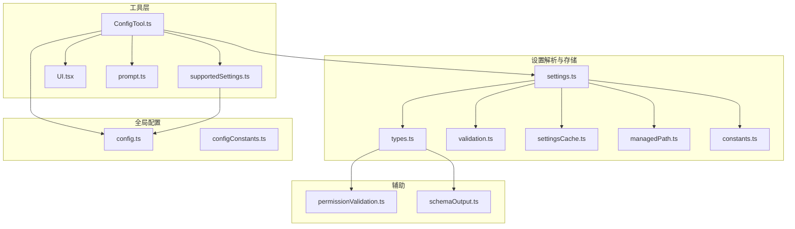
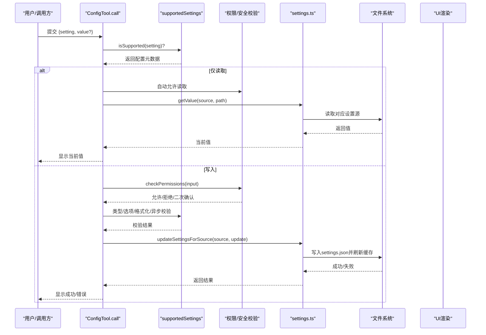
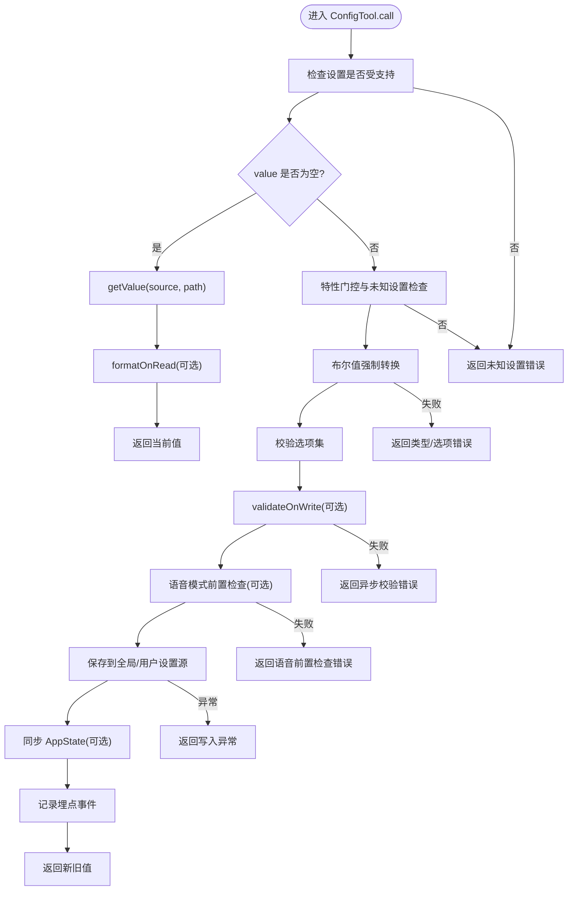
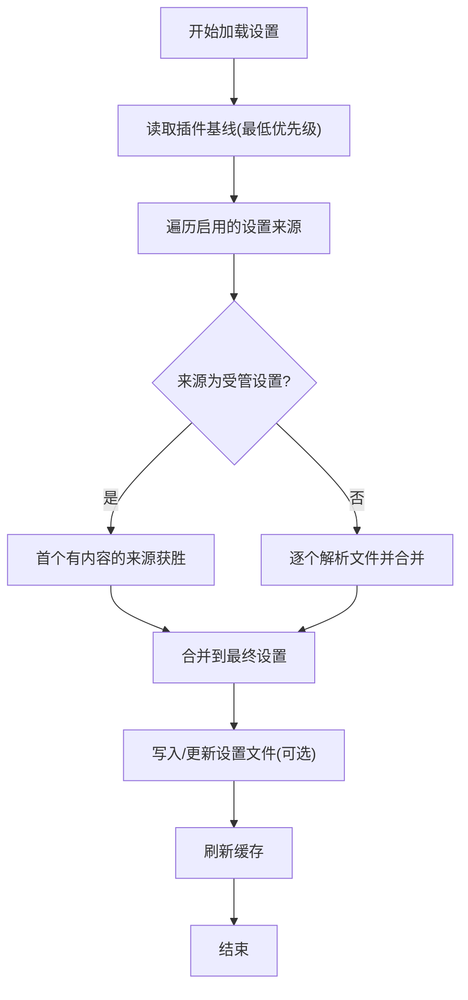
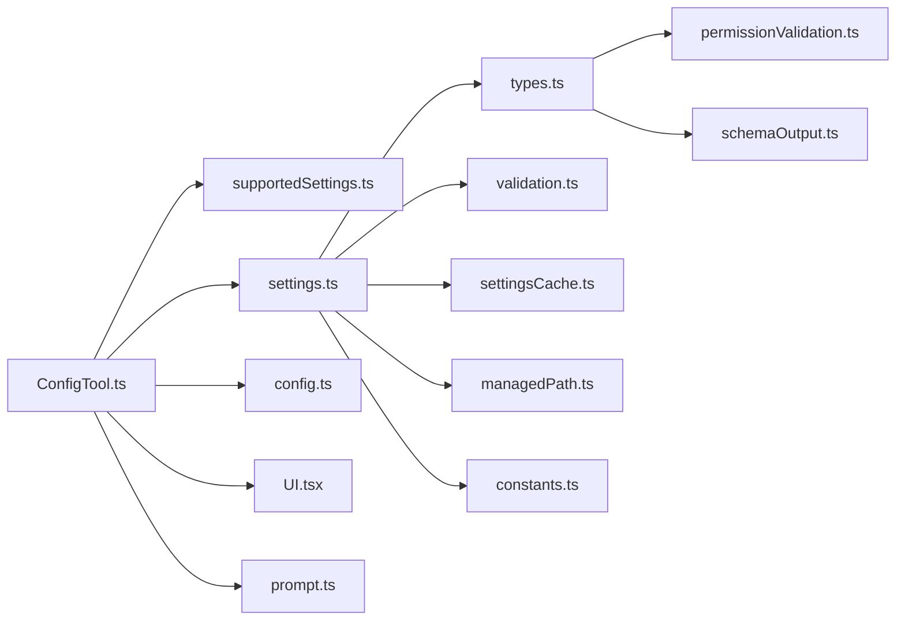

# 配置管理工具

<cite>
**本文引用的文件**
- [ConfigTool.ts](file://src/tools/ConfigTool/ConfigTool.ts)
- [supportedSettings.ts](file://src/tools/ConfigTool/supportedSettings.ts)
- [settings.ts](file://src/utils/settings/settings.ts)
- [config.ts](file://src/utils/config.ts)
- [configConstants.ts](file://src/utils/configConstants.ts)
- [types.ts](file://src/utils/settings/types.ts)
- [validation.ts](file://src/utils/settings/validation.ts)
- [constants.ts](file://src/utils/settings/constants.ts)
- [settingsCache.ts](file://src/utils/settings/settingsCache.ts)
- [managedPath.ts](file://src/utils/settings/managedPath.ts)
- [UI.tsx](file://src/tools/ConfigTool/UI.tsx)
- [prompt.ts](file://src/tools/ConfigTool/prompt.ts)
- [permissionValidation.ts](file://src/utils/settings/permissionValidation.ts)
- [schemaOutput.ts](file://src/utils/settings/schemaOutput.ts)
</cite>

## 目录
1. [简介](#简介)
2. [项目结构](#项目结构)
3. [核心组件](#核心组件)
4. [架构总览](#架构总览)
5. [详细组件分析](#详细组件分析)
6. [依赖关系分析](#依赖关系分析)
7. [性能考量](#性能考量)
8. [故障排查指南](#故障排查指南)
9. [结论](#结论)
10. [附录](#附录)

## 简介
本文件系统化阐述 Claude Code 的配置管理工具（ConfigTool）：从设置读取、写入与验证机制，到支持的配置项类型与验证规则；从全局配置与用户设置的存储差异，到变更权限控制与安全检查流程；再到配置文件格式、备份与恢复策略以及版本兼容性处理。文档同时提供常见配置场景的参考路径与最佳实践建议，帮助开发者与使用者高效、安全地管理配置。

## 项目结构
ConfigTool 位于工具层，围绕“设置注册表 + 设置解析器 + 权限与安全校验 + 存储写入”的职责划分组织代码。其核心文件如下：
- 工具入口与调用流程：ConfigTool.ts
- 支持的设置项注册与读取：supportedSettings.ts
- 设置解析与合并、文件读写与缓存：settings.ts
- 全局配置定义与默认值：config.ts
- 常量与枚举：configConstants.ts
- 设置文件 JSON Schema 定义与校验：types.ts、validation.ts
- 设置来源与优先级常量：constants.ts
- 设置缓存与插件基线：settingsCache.ts、managedPath.ts
- UI 渲染与提示：UI.tsx、prompt.ts
- 权限规则自定义校验：permissionValidation.ts
- 生成完整 JSON Schema：schemaOutput.ts



**图表来源**
- [ConfigTool.ts:1-469](file://src/tools/ConfigTool/ConfigTool.ts#L1-L469)
- [supportedSettings.ts:1-213](file://src/tools/ConfigTool/supportedSettings.ts#L1-L213)
- [settings.ts:1-1017](file://src/utils/settings/settings.ts#L1-L1017)
- [config.ts:1-1819](file://src/utils/config.ts#L1-L1819)
- [types.ts:1-1150](file://src/utils/settings/types.ts#L1-L1150)
- [validation.ts:1-267](file://src/utils/settings/validation.ts#L1-L267)
- [settingsCache.ts:1-82](file://src/utils/settings/settingsCache.ts#L1-L82)
- [managedPath.ts:1-36](file://src/utils/settings/managedPath.ts#L1-L36)
- [constants.ts:1-204](file://src/utils/settings/constants.ts#L1-L204)
- [UI.tsx:1-39](file://src/tools/ConfigTool/UI.tsx#L1-L39)
- [prompt.ts:1-95](file://src/tools/ConfigTool/prompt.ts#L1-L95)
- [permissionValidation.ts:1-264](file://src/utils/settings/permissionValidation.ts#L1-L264)
- [schemaOutput.ts:1-10](file://src/utils/settings/schemaOutput.ts#L1-L10)

**章节来源**
- [ConfigTool.ts:1-469](file://src/tools/ConfigTool/ConfigTool.ts#L1-L469)
- [supportedSettings.ts:1-213](file://src/tools/ConfigTool/supportedSettings.ts#L1-L213)
- [settings.ts:1-1017](file://src/utils/settings/settings.ts#L1-L1017)
- [config.ts:1-1819](file://src/utils/config.ts#L1-L1819)

## 核心组件
- ConfigTool 工具：负责输入参数校验、权限判定、设置读取/写入、格式化输出与 UI 渲染。
- supportedSettings 注册表：集中声明可配置项的来源、类型、选项、格式化与异步校验回调。
- settings 解析与持久化：按来源优先级合并设置，解析 JSON 文件，执行严格校验，写回磁盘并维护缓存。
- config 全局配置：定义全局配置键集合、默认值与平台相关行为。
- types/validation：通过 Zod 定义设置文件的 JSON Schema，并对无效字段进行容错与提示。
- settingsCache/managedPath：会话级缓存与受管设置目录路径管理。
- UI/prompt：向用户展示工具使用提示与结果消息。
- permissionValidation：对权限规则进行格式与语义校验，确保安全与可用。

**章节来源**
- [ConfigTool.ts:67-434](file://src/tools/ConfigTool/ConfigTool.ts#L67-L434)
- [supportedSettings.ts:15-186](file://src/tools/ConfigTool/supportedSettings.ts#L15-L186)
- [settings.ts:319-796](file://src/utils/settings/settings.ts#L319-L796)
- [config.ts:183-666](file://src/utils/config.ts#L183-L666)
- [types.ts:255-800](file://src/utils/settings/types.ts#L255-L800)
- [validation.ts:97-217](file://src/utils/settings/validation.ts#L97-L217)
- [settingsCache.ts:55-82](file://src/utils/settings/settingsCache.ts#L55-L82)
- [managedPath.ts:8-34](file://src/utils/settings/managedPath.ts#L8-L34)
- [UI.tsx:6-37](file://src/tools/ConfigTool/UI.tsx#L6-L37)
- [prompt.ts:14-77](file://src/tools/ConfigTool/prompt.ts#L14-L77)
- [permissionValidation.ts:58-239](file://src/utils/settings/permissionValidation.ts#L58-L239)

## 架构总览
ConfigTool 的工作流由“输入解析 → 设置注册表查询 → 权限与安全校验 → 读取或写入 → 结果渲染”构成。设置来源采用“插件基线 → 用户设置 → 项目设置 → 本地设置 → CLI 标记 → 受管设置（企业策略）”的优先级链路，其中受管设置与 CLI 标记始终参与，且受管设置在企业场景下具有最高优先级。



**图表来源**
- [ConfigTool.ts:98-411](file://src/tools/ConfigTool/ConfigTool.ts#L98-L411)
- [supportedSettings.ts:188-213](file://src/tools/ConfigTool/supportedSettings.ts#L188-L213)
- [settings.ts:416-524](file://src/utils/settings/settings.ts#L416-L524)
- [UI.tsx:15-37](file://src/tools/ConfigTool/UI.tsx#L15-L37)

## 详细组件分析

### ConfigTool：工具定义与调用流程
- 输入/输出模式：使用 Zod 懒加载模式定义输入与输出结构，支持 setting 与可选 value。
- 只读判定：当 value 未提供时视为只读请求，自动放行。
- 权限控制：写入请求需“询问”，并在 UI 中明确提示变更内容。
- 运行时特性门控：对 voiceEnabled 等特性开关进行运行时校验，避免泄露未知设置。
- 读取逻辑：根据配置元数据选择全局或用户设置源，支持 formatOnRead 格式化显示。
- 写入逻辑：支持“default”重置为平台默认；对布尔值进行字符串到布尔的强制转换；校验选项集；执行 validateOnWrite 异步校验；对语音模式进行前置环境检查；写入后同步 AppState 并记录埋点事件。
- 错误处理：统一捕获异常并返回人类可读的错误信息。



**图表来源**
- [ConfigTool.ts:112-411](file://src/tools/ConfigTool/ConfigTool.ts#L112-L411)

**章节来源**
- [ConfigTool.ts:67-434](file://src/tools/ConfigTool/ConfigTool.ts#L67-L434)

### supportedSettings：设置注册与元数据
- 注册表结构：每条设置包含 source（global 或 settings）、type（boolean/string）、description、path（可选）、options/getOptions（可选）、appStateKey（可选）、validateOnWrite（可选）、formatOnRead（可选）。
- 动态选项：部分设置（如 model）通过 getOptions 动态生成；部分设置（如 voiceEnabled）受特性门控影响。
- 路径解析：默认以点号分隔的路径，可通过 path 覆盖。
- 支持的设置项举例：主题、编辑器模式、调试开关、通知渠道、自动压缩、自动记忆、文件检查点、回合耗时显示、终端进度条、任务跟踪、模型覆盖、思维模式、权限默认模式、语言、队友 Spawn 模式、远程控制启动、推送通知等。

```mermaid
classDiagram
class SettingConfig {
+source : "global"|"settings"
+type : "boolean"|"string"
+description : string
+path? : string[]
+options? : string[]
+getOptions?() : string[]
+appStateKey?() : string
+validateOnWrite?(v) : Promise~{valid,error}~
+formatOnRead?(v) : unknown
}
class SUPPORTED_SETTINGS {
+注册多条 SettingConfig
+isSupported(key) : boolean
+getConfig(key) : SettingConfig
+getAllKeys() : string[]
+getOptionsForSetting(key) : string[]
+getPath(key) : string[]
}
SUPPORTED_SETTINGS --> SettingConfig : "包含"
```

**图表来源**
- [supportedSettings.ts:15-213](file://src/tools/ConfigTool/supportedSettings.ts#L15-L213)

**章节来源**
- [supportedSettings.ts:15-186](file://src/tools/ConfigTool/supportedSettings.ts#L15-L186)

### 设置解析与持久化：settings.ts
- 设置来源与优先级：用户设置 → 项目设置 → 本地设置 → CLI 标记 → 受管设置（企业策略）。受管设置与 CLI 标记始终参与。
- 文件解析：parseSettingsFile 对单个文件进行 JSON 解析与 Zod 校验，保留未知字段，记录错误列表。
- 合并与覆盖：loadSettingsFromDisk 按优先级链路合并，数组采用去重合并策略；受管设置采用“首个有内容即胜出”的策略。
- 写入与缓存：updateSettingsForSource 将更新合并到现有设置，写入文件并刷新缓存；本地设置写入后加入 .gitignore 规则。
- 缓存策略：会话级缓存与按源缓存，写入后统一失效；插件基线作为最低优先级层。
- 受管设置：支持 managed-settings.json 与 drop-in 目录，遵循 systemd/sudoers drop-in 约定。



**图表来源**
- [settings.ts:645-796](file://src/utils/settings/settings.ts#L645-L796)
- [settings.ts:416-524](file://src/utils/settings/settings.ts#L416-L524)
- [settings.ts:319-368](file://src/utils/settings/settings.ts#L319-L368)

**章节来源**
- [settings.ts:319-796](file://src/utils/settings/settings.ts#L319-L796)
- [settingsCache.ts:55-82](file://src/utils/settings/settingsCache.ts#L55-L82)
- [managedPath.ts:8-34](file://src/utils/settings/managedPath.ts#L8-L34)

### 全局配置：config.ts
- 全局配置键集合：定义了所有可持久化的全局配置键，涵盖主题、通知渠道、编辑器模式、自动压缩、回合耗时显示、终端进度条、任务跟踪、文件检查点、远程控制启动、推送通知等。
- 默认值工厂：createDefaultGlobalConfig 生成全新默认全局配置，避免深拷贝成本。
- 特性门控与运行时行为：结合 feature 标志与运行时检测，动态决定某些设置项的可用性与默认值。

**章节来源**
- [config.ts:183-666](file://src/utils/config.ts#L183-L666)
- [config.ts:585-623](file://src/utils/config.ts#L585-L623)

### 设置文件格式与验证：types.ts、validation.ts
- JSON Schema：SettingsSchema 定义了设置文件的完整结构，支持向后兼容的渐进式变更策略。
- 校验规则：formatZodError 将 Zod 错误映射为人类可读的错误信息；filterInvalidPermissionRules 在 schema 校验前过滤非法权限规则，避免整文件被拒。
- 严格模式校验：validateSettingsFileContent 支持在文件编辑时进行严格校验并生成完整 Schema 文本。

**章节来源**
- [types.ts:255-800](file://src/utils/settings/types.ts#L255-L800)
- [validation.ts:97-217](file://src/utils/settings/validation.ts#L97-L217)
- [permissionValidation.ts:58-239](file://src/utils/settings/permissionValidation.ts#L58-L239)
- [schemaOutput.ts:5-8](file://src/utils/settings/schemaOutput.ts#L5-L8)

### 设置来源与优先级：constants.ts
- 设置来源顺序：user → project → local → flag → policy（受管设置）。
- 显示名称与解析：提供多种显示名称与解析函数，便于 UI 与日志使用。
- 启用来源：getEnabledSettingSources 总是包含 policy 与 flag，其余来源由启动状态决定。

**章节来源**
- [constants.ts:7-167](file://src/utils/settings/constants.ts#L7-L167)

### UI 与提示：UI.tsx、prompt.ts
- UI 渲染：renderToolUseMessage/renderToolResultMessage/renderToolUseRejectedMessage 根据操作类型渲染不同颜色与文案。
- 提示生成：generatePrompt 从注册表动态生成设置列表与示例，隐藏受特性门控限制的设置项。

**章节来源**
- [UI.tsx:6-37](file://src/tools/ConfigTool/UI.tsx#L6-L37)
- [prompt.ts:14-77](file://src/tools/ConfigTool/prompt.ts#L14-L77)

## 依赖关系分析
- ConfigTool 依赖 supportedSettings 获取设置元数据，依赖 settings 执行读写，依赖 config 提供全局配置默认值与键集合，依赖 UI/prompt 提供交互体验。
- settings 依赖 types/validation 进行文件解析与校验，依赖 settingsCache/managedPath 维护缓存与受管设置路径，依赖 constants 定义来源优先级。
- types 依赖 permissionValidation 对权限规则进行语义校验，依赖 schemaOutput 生成完整 Schema。



**图表来源**
- [ConfigTool.ts:1-469](file://src/tools/ConfigTool/ConfigTool.ts#L1-L469)
- [settings.ts:1-1017](file://src/utils/settings/settings.ts#L1-L1017)
- [types.ts:1-1150](file://src/utils/settings/types.ts#L1-L1150)

**章节来源**
- [ConfigTool.ts:1-469](file://src/tools/ConfigTool/ConfigTool.ts#L1-L469)
- [settings.ts:1-1017](file://src/utils/settings/settings.ts#L1-L1017)

## 性能考量
- 缓存策略：settingsCache 提供会话级与按源缓存，写入后统一失效，减少重复解析与合并开销。
- 合并算法：数组采用去重合并，避免重复元素导致的冗余与性能问题。
- 文件 I/O：writeFileSyncAndFlush_DEPRECATED 保证写入一致性；本地设置写入后异步添加 .gitignore 规则，避免阻塞主流程。
- 懒加载：输入/输出 Schema 使用 lazySchema，延迟初始化，降低冷启动成本。

[本节为通用性能讨论，不直接分析具体文件]

## 故障排查指南
- 未知设置：若设置不在 supportedSettings 中，将返回“未知设置”错误。请确认设置键名正确且受支持。
- 类型与选项错误：布尔值需为 true/false；字符串值需在 options 列表中。请核对输入类型与可选值。
- 异步校验失败：部分设置（如 model）提供 validateOnWrite 回调，失败时返回具体错误信息。请检查外部服务可用性与参数合法性。
- 语音模式前置检查失败：当开启 voiceEnabled 时，需满足账户登录、录音可用性、依赖工具存在与麦克风授权等条件。请按提示前往系统隐私设置或安装缺失依赖。
- 写入异常：文件写入失败时，统一捕获异常并返回错误信息。请检查目标路径权限与磁盘空间。
- JSON 语法错误：parseSettingsFile 对空文件返回空对象，对无效 JSON 返回空设置并记录错误。请修复 JSON 语法后再尝试。

**章节来源**
- [ConfigTool.ts:112-411](file://src/tools/ConfigTool/ConfigTool.ts#L112-L411)
- [settings.ts:201-231](file://src/utils/settings/settings.ts#L201-L231)
- [validation.ts:97-173](file://src/utils/settings/validation.ts#L97-L173)

## 结论
ConfigTool 通过“注册表 + 解析器 + 权限与安全校验 + 缓存与持久化”的清晰分层，提供了稳定、可扩展、可审计的配置管理能力。其支持的设置项覆盖全局与项目/本地层面，具备严格的类型与选项约束、灵活的异步校验与格式化能力，并在企业场景下通过受管设置实现策略落地。配合完善的 UI 与提示、详尽的错误信息与缓存优化，ConfigTool 能够在复杂环境中保持高可用与易用性。

[本节为总结性内容，不直接分析具体文件]

## 附录

### 配置项类型与验证规则
- 类型支持：boolean、string；数值类型在写入前会被强制转换为字符串或布尔值（如布尔值字符串）。
- 选项约束：通过 options 或 getOptions 动态生成，写入时必须匹配。
- 异步校验：validateOnWrite 支持外部服务校验（如模型有效性），失败时阻止写入。
- 权限规则校验：对权限规则进行格式与语义校验，确保括号匹配、工具名规范、模式合法等。

**章节来源**
- [ConfigTool.ts:184-229](file://src/tools/ConfigTool/ConfigTool.ts#L184-L229)
- [supportedSettings.ts:15-27](file://src/tools/ConfigTool/supportedSettings.ts#L15-L27)
- [permissionValidation.ts:58-239](file://src/utils/settings/permissionValidation.ts#L58-L239)

### 全局配置与用户设置的区别
- 存储位置：
  - 全局配置：存储于全局配置文件（例如 ~/.claude.json），键集合由 config.ts 定义。
  - 用户设置：存储于用户目录下的 settings.json，支持 cowork 模式下的 cowork_settings.json。
  - 项目/本地设置：存储于 .claude/settings.json 与 .claude/settings.local.json。
  - 受管设置：存储于受管设置目录（macOS: /Library/Application Support/ClaudeCode；Windows: Program Files；Linux: /etc/claude-code），支持 base 与 drop-in 文件。
- 作用域与优先级：受管设置优先级最高；其次为 CLI 标记；然后为用户设置；再为项目设置；最后为本地设置。插件基线作为最低优先级层参与合并。

**章节来源**
- [config.ts:183-666](file://src/utils/config.ts#L183-L666)
- [settings.ts:264-296](file://src/utils/settings/settings.ts#L264-L296)
- [managedPath.ts:8-34](file://src/utils/settings/managedPath.ts#L8-L34)
- [constants.ts:7-22](file://src/utils/settings/constants.ts#L7-L22)

### 配置变更的权限控制与安全检查
- 读取权限：自动放行，无需确认。
- 写入权限：需要“询问”流程，UI 明确提示即将变更的设置与值。
- 语音模式安全检查：在开启 voiceEnabled 前，检查账户登录状态、录音可用性、依赖工具与麦克风授权，失败时返回指引信息。
- 受管设置与 CLI 标记：始终参与解析，受管设置在企业场景下具有最高优先级，CLI 标记用于临时覆盖。

**章节来源**
- [ConfigTool.ts:98-107](file://src/tools/ConfigTool/ConfigTool.ts#L98-L107)
- [ConfigTool.ts:231-308](file://src/tools/ConfigTool/ConfigTool.ts#L231-L308)
- [constants.ts:159-167](file://src/utils/settings/constants.ts#L159-L167)

### 配置文件格式、备份与恢复策略
- JSON Schema：通过 SettingsSchema 定义，支持向后兼容的渐进式变更。
- 备份与恢复：系统不会自动备份设置文件；若出现损坏，可手动从最近一次有效备份恢复。建议在修改前备份 settings.json。
- 语法错误处理：parseSettingsFile 对空文件返回空对象；对无效 JSON 返回空设置并记录错误，避免覆盖安全。
- 受管设置：managed-settings.json 与 drop-in 目录遵循“base + drop-ins”合并策略，后者按字母序覆盖前者。

**章节来源**
- [types.ts:255-241](file://src/utils/settings/types.ts#L255-L241)
- [settings.ts:201-231](file://src/utils/settings/settings.ts#L201-L231)
- [settings.ts:82-121](file://src/utils/settings/settings.ts#L82-L121)

### 版本兼容性处理
- 向后兼容原则：允许新增可选字段、新增枚举值、对象属性扩展、放宽类型限制、使用联合类型等；禁止删除字段、删除枚举值、使可选字段变必填、收紧类型、重命名字段等。
- 自动处理：无效字段被保留但不生效，避免整文件被拒；类型强制转换（如 env 变量）提升兼容性。
- 测试保障：提供向后兼容测试用例，确保变更不会破坏既有配置。

**章节来源**
- [types.ts:210-241](file://src/utils/settings/types.ts#L210-L241)

### 常见配置场景与最佳实践
- 获取当前值：不提供 value 参数，自动放行读取。
- 设置布尔值：使用 true/false 字面量，避免字符串拼写错误。
- 设置模型：通过 model 设置覆盖默认模型；若为空或 null 表示使用默认。
- 设置权限模式：permissions.defaultMode 支持多种模式，建议根据团队安全策略选择。
- 语音模式：开启前确保已登录 Claude.ai 账户、录音设备可用、依赖工具存在并授予麦克风权限。
- 受管设置：企业管理员通过 managed-settings.json 与 drop-in 文件下发策略，用户无法覆盖。

**章节来源**
- [prompt.ts:50-77](file://src/tools/ConfigTool/prompt.ts#L50-L77)
- [supportedSettings.ts:29-186](file://src/tools/ConfigTool/supportedSettings.ts#L29-L186)
- [settings.ts:645-796](file://src/utils/settings/settings.ts#L645-L796)