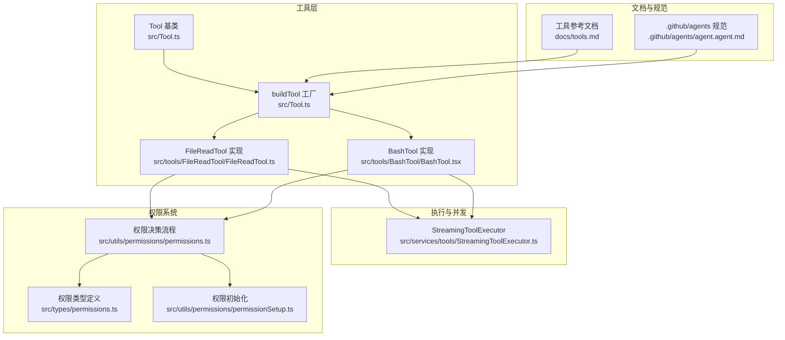
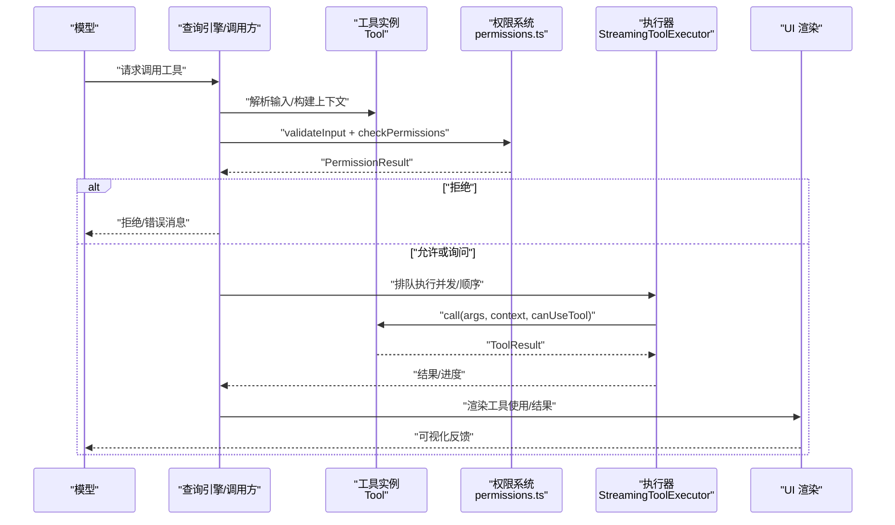
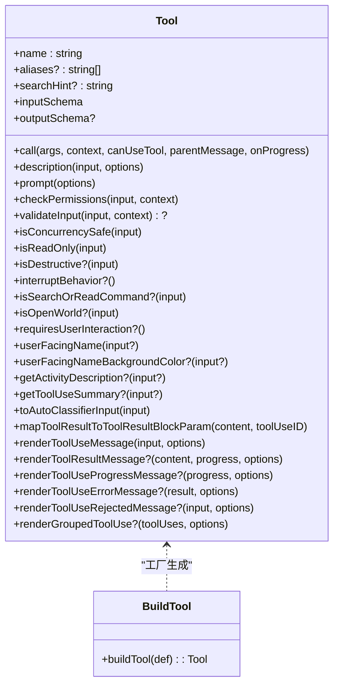
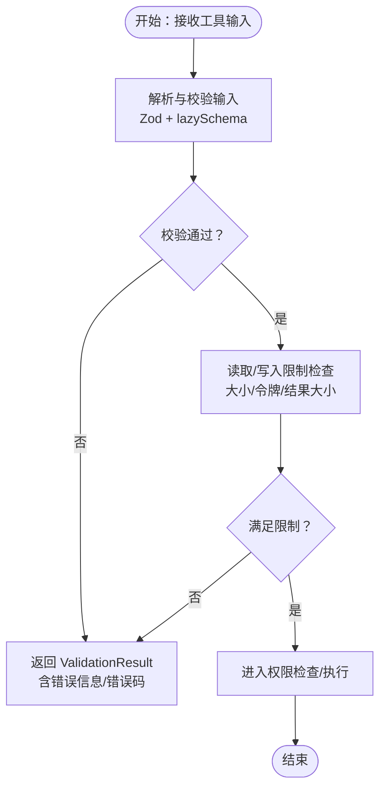
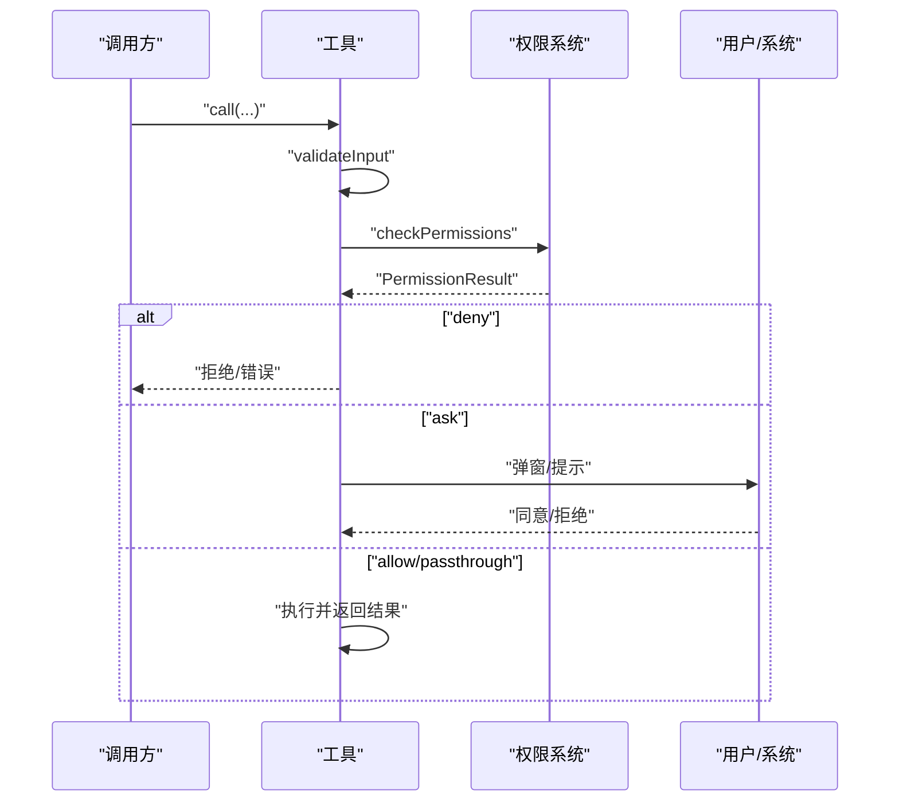
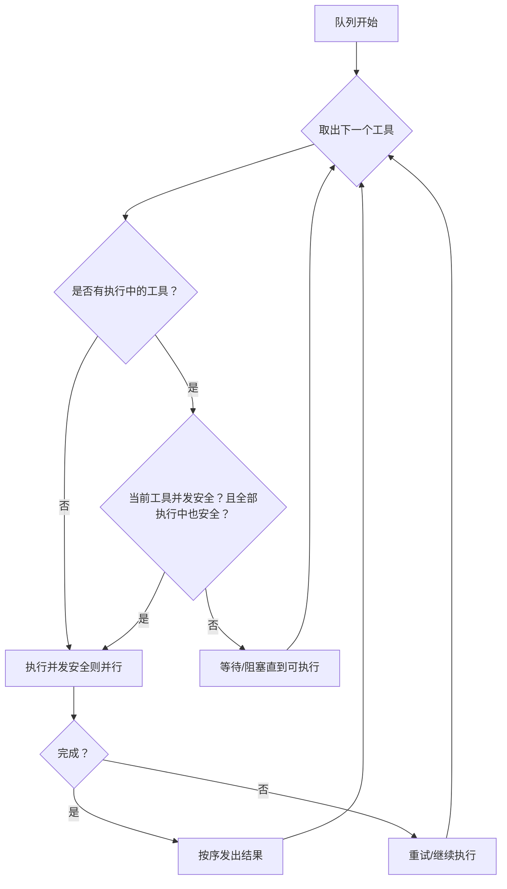
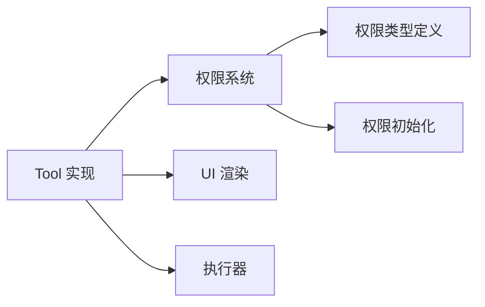

# 自定义工具开发

<cite>
**本文引用的文件**
- [src/Tool.ts](file://src/Tool.ts)
- [src/tools/FileReadTool/FileReadTool.ts](file://src/tools/FileReadTool/FileReadTool.ts)
- [src/tools/BashTool/BashTool.tsx](file://src/tools/BashTool/BashTool.tsx)
- [src/services/tools/StreamingToolExecutor.ts](file://src/services/tools/StreamingToolExecutor.ts)
- [src/utils/permissions/permissions.ts](file://src/utils/permissions/permissions.ts)
- [src/utils/permissions/permissionSetup.ts](file://src/utils/permissions/permissionSetup.ts)
- [src/types/permissions.ts](file://src/types/permissions.ts)
- [src/services/tools/toolExecution.ts](file://src/services/tools/toolExecution.ts)
- [docs/tools.md](file://docs/tools.md)
- [.github/agents/agent.agent.md](file://.github/agents/agent.agent.md)
- [src/constants/errorIds.ts](file://src/constants/errorIds.ts)
- [src/remote/remotePermissionBridge.ts](file://src/remote/remotePermissionBridge.ts)
- [src/cli/print.ts](file://src/cli/print.ts)
- [src/constants/prompts.ts](file://src/constants/prompts.ts)
- [src/tools/SyntheticOutputTool/SyntheticOutputTool.ts](file://src/tools/SyntheticOutputTool/SyntheticOutputTool.ts)
</cite>

## 目录
1. [简介](#简介)
2. [项目结构](#项目结构)
3. [核心组件](#核心组件)
4. [架构总览](#架构总览)
5. [详细组件分析](#详细组件分析)
6. [依赖分析](#依赖分析)
7. [性能考虑](#性能考虑)
8. [故障排查指南](#故障排查指南)
9. [结论](#结论)
10. [附录](#附录)

## 简介
本指南面向希望在 Claude Code 中开发自定义工具的工程师，系统讲解如何基于 Tool 基类与 buildTool 工厂函数创建工具，涵盖输入输出模式设计、数据校验与错误处理、权限系统集成（含权限检查、用户确认、安全防护）、并发与性能优化、以及调试技巧与最佳实践。文档以仓库现有工具实现为依据，结合类型定义与运行时行为，帮助你快速上手并高质量交付工具。

## 项目结构
- 工具基类与工厂：位于 src/Tool.ts，提供 Tool 接口、默认行为、buildTool 工厂与工具上下文等核心能力。
- 典型工具实现：
  - 文件读取工具：src/tools/FileReadTool/FileReadTool.ts，展示输入校验、权限检查、并发安全、结果映射与 UI 渲染。
  - Shell 执行工具：src/tools/BashTool/BashTool.tsx，展示命令解析、只读约束、UI 进度与拒绝/错误渲染、并发控制与沙箱策略。
- 并发执行器：src/services/tools/StreamingToolExecutor.ts，负责工具并发调度与顺序保证。
- 权限系统：src/utils/permissions/permissions.ts、src/utils/permissions/permissionSetup.ts、src/types/permissions.ts，覆盖权限模式、规则、决策与上下文。
- 工具开发参考文档：docs/tools.md；Agent 开发规范：.github/agents/agent.agent.md。
- 错误分类与诊断：src/services/tools/toolExecution.ts、src/constants/errorIds.ts。
- 远程工具桩：src/remote/remotePermissionBridge.ts。
- CLI 权限提示与中止：src/cli/print.ts。
- 安全提示与风险清单：src/constants/prompts.ts。
- 结构化输出工具缓存：src/tools/SyntheticOutputTool/SyntheticOutputTool.ts。

图表来源
- [src/Tool.ts:1-795](file://src/Tool.ts#L1-L795)
- [src/tools/FileReadTool/FileReadTool.ts:1-800](file://src/tools/FileReadTool/FileReadTool.ts#L1-L800)
- [src/tools/BashTool/BashTool.tsx:1-200](file://src/tools/BashTool/BashTool.tsx#L1-L200)
- [src/services/tools/StreamingToolExecutor.ts:34-151](file://src/services/tools/StreamingToolExecutor.ts#L34-L151)
- [src/utils/permissions/permissions.ts:1208-1236](file://src/utils/permissions/permissions.ts#L1208-L1236)
- [src/types/permissions.ts:1-443](file://src/types/permissions.ts#L1-L443)
- [src/utils/permissions/permissionSetup.ts:900-928](file://src/utils/permissions/permissionSetup.ts#L900-L928)
- [docs/tools.md:1-174](file://docs/tools.md#L1-L174)
- [.github/agents/agent.agent.md:66-109](file://.github/agents/agent.agent.md#L66-L109)

章节来源
- [src/Tool.ts:1-795](file://src/Tool.ts#L1-L795)
- [docs/tools.md:1-174](file://docs/tools.md#L1-L174)
- [.github/agents/agent.agent.md:66-109](file://.github/agents/agent.agent.md#L66-L109)

## 核心组件
- Tool 接口与默认行为
  - Tool 定义了调用签名、输入/输出模式、权限检查、并发安全、UI 渲染、摘要与活动描述、自动分类器输入等扩展点。
  - buildTool 提供一组安全默认值（如启用、并发安全、只读、破坏性、权限检查、自动分类器输入、用户可见名），避免每个工具重复实现。
- 工具上下文 ToolUseContext
  - 携带命令集合、调试开关、主循环模型、工具集、是否非交互会话、MCP 客户端与资源、文件读取限制、消息与历史状态、权限上下文回调等，贯穿工具生命周期。
- 并发执行器 StreamingToolExecutor
  - 控制并发安全工具并行与非并发工具串行，维护顺序、错误传播与子进程中断信号。
- 权限系统
  - 权限模式（默认、计划、绕过、自动）、规则（通配符匹配）、决策（允许/询问/拒绝/透传）与上下文（额外工作目录、规则源、是否避免弹窗等）。
- 错误分类与诊断
  - classifyToolError 将错误归类为可遥测字符串，便于日志与分析；错误 ID 常量用于追踪来源。

章节来源
- [src/Tool.ts:362-695](file://src/Tool.ts#L362-L695)
- [src/Tool.ts:757-792](file://src/Tool.ts#L757-L792)
- [src/services/tools/StreamingToolExecutor.ts:34-151](file://src/services/tools/StreamingToolExecutor.ts#L34-L151)
- [src/utils/permissions/permissions.ts:1208-1236](file://src/utils/permissions/permissions.ts#L1208-L1236)
- [src/types/permissions.ts:14-443](file://src/types/permissions.ts#L14-L443)
- [src/services/tools/toolExecution.ts:139-171](file://src/services/tools/toolExecution.ts#L139-L171)
- [src/constants/errorIds.ts:1-15](file://src/constants/errorIds.ts#L1-L15)

## 架构总览
下图展示了从模型调用工具到权限决策、执行与 UI 渲染的完整链路。

图表来源
- [src/utils/permissions/permissions.ts:1208-1236](file://src/utils/permissions/permissions.ts#L1208-L1236)
- [src/services/tools/StreamingToolExecutor.ts:34-151](file://src/services/tools/StreamingToolExecutor.ts#L34-L151)
- [src/Tool.ts:379-404](file://src/Tool.ts#L379-L404)

## 详细组件分析

### 组件一：Tool 基类与 buildTool 工厂
- 必需实现
  - name、inputSchema、call(args, context, canUseTool, parentMessage, onProgress)、outputSchema（可选）。
  - 描述与提示：description、prompt、searchHint。
- 可选扩展
  - 并发安全：isConcurrencySafe、interruptBehavior、isSearchOrReadCommand、isOpenWorld、requiresUserInteraction。
  - 权限与输入：validateInput、checkPermissions、inputsEquivalent、getPath、preparePermissionMatcher。
  - 输出与 UI：mapToolResultToToolResultBlockParam、renderToolUseMessage、renderToolResultMessage、renderToolUseProgressMessage、renderToolUseErrorMessage、renderToolUseRejectedMessage、renderGroupedToolUse。
  - 辅助：userFacingName、userFacingNameBackgroundColor、getActivityDescription、getToolUseSummary、toAutoClassifierInput、isResultTruncated、isTransparentWrapper。
- 默认行为
  - 启用、并发安全、只读、破坏性、权限检查、自动分类器输入、用户可见名均有安全默认，确保工具最小可用。

图表来源
- [src/Tool.ts:362-695](file://src/Tool.ts#L362-L695)
- [src/Tool.ts:757-792](file://src/Tool.ts#L757-L792)

章节来源
- [src/Tool.ts:362-695](file://src/Tool.ts#L362-L695)
- [src/Tool.ts:757-792](file://src/Tool.ts#L757-L792)

### 组件二：输入输出模式设计与数据验证
- 输入模式
  - 使用 Zod schema 定义严格参数，建议配合 lazySchema 避免循环依赖。
  - 可选 inputJSONSchema 用于 MCP 工具直接提供 JSON Schema。
- 输出模式
  - 输出通过 outputSchema 描述，ToolResult.data 作为主要承载；可附加新消息、上下文修改器与 MCP 元数据。
  - mapToolResultToToolResultBlockParam 将内部输出映射为 SDK/协议块参数。
- 数据验证
  - validateInput 返回 { result: true } 或 { result: false, message, errorCode }，支持错误码与可追踪 ID。
  - 错误分类与 ID：classifyToolError 与 errorIds 帮助定位来源与类型。

图表来源
- [src/tools/FileReadTool/FileReadTool.ts:418-495](file://src/tools/FileReadTool/FileReadTool.ts#L418-L495)
- [src/services/tools/toolExecution.ts:139-171](file://src/services/tools/toolExecution.ts#L139-L171)
- [src/constants/errorIds.ts:1-15](file://src/constants/errorIds.ts#L1-L15)

章节来源
- [src/tools/FileReadTool/FileReadTool.ts:227-333](file://src/tools/FileReadTool/FileReadTool.ts#L227-L333)
- [src/tools/FileReadTool/FileReadTool.ts:418-495](file://src/tools/FileReadTool/FileReadTool.ts#L418-L495)
- [src/services/tools/toolExecution.ts:139-171](file://src/services/tools/toolExecution.ts#L139-L171)
- [src/constants/errorIds.ts:1-15](file://src/constants/errorIds.ts#L1-L15)

### 组件三：权限系统集成（检查、确认与防护）
- 权限模式与规则
  - 模式：default、plan、bypassPermissions、auto；规则：通配符匹配工具与内容。
  - 上下文：额外工作目录、规则来源、是否避免弹窗、自动化检查前置等。
- 决策流程
  - validateInput 通过后，工具实现 checkPermissions 返回 PermissionResult。
  - 若工具要求用户交互且处于需要弹窗模式，即使“询问”也会触发弹窗。
  - CLI 场景下，权限提示工具与中止信号组合，确保中断响应及时。
- 远程工具
  - 当本地未加载远程工具时，remotePermissionBridge 提供最小工具桩，路由到回退权限请求。

图表来源
- [src/utils/permissions/permissions.ts:1208-1236](file://src/utils/permissions/permissions.ts#L1208-L1236)
- [src/cli/print.ts:4178-4263](file://src/cli/print.ts#L4178-L4263)
- [src/remote/remotePermissionBridge.ts:48-78](file://src/remote/remotePermissionBridge.ts#L48-L78)
- [src/types/permissions.ts:14-443](file://src/types/permissions.ts#L14-L443)

章节来源
- [src/utils/permissions/permissions.ts:1208-1236](file://src/utils/permissions/permissions.ts#L1208-L1236)
- [src/cli/print.ts:4178-4263](file://src/cli/print.ts#L4178-L4263)
- [src/remote/remotePermissionBridge.ts:48-78](file://src/remote/remotePermissionBridge.ts#L48-L78)
- [src/types/permissions.ts:14-443](file://src/types/permissions.ts#L14-L443)

### 组件四：并发处理与执行器
- 并发策略
  - 并发安全工具可并行；非并发工具串行，且需保持调用顺序。
  - 子进程错误时，通过子中止控制器向兄弟进程广播中止，避免资源浪费。
- 顺序与缓冲
  - 结果按接收顺序缓冲并发出，保证 UI 一致性。

图表来源
- [src/services/tools/StreamingToolExecutor.ts:34-151](file://src/services/tools/StreamingToolExecutor.ts#L34-L151)

章节来源
- [src/services/tools/StreamingToolExecutor.ts:34-151](file://src/services/tools/StreamingToolExecutor.ts#L34-L151)

### 组件五：UI 渲染与用户体验
- 调用消息与结果消息
  - renderToolUseMessage 渲染调用占位；renderToolResultMessage 渲染结果；renderToolUseProgressMessage 渲染进度；renderToolUseErrorMessage/renderToolUseRejectedMessage 渲染错误/拒绝。
- 摘要与活动描述
  - getToolUseSummary、getActivityDescription 用于紧凑视图与转轮提示文案。
- 搜索文本提取
  - extractSearchText 用于转录索引，确保渲染与索引一致。

章节来源
- [src/Tool.ts:566-667](file://src/Tool.ts#L566-L667)
- [src/tools/FileReadTool/FileReadTool.ts:367-417](file://src/tools/FileReadTool/FileReadTool.ts#L367-L417)

### 组件六：开发示例与最佳实践
- 示例：FileReadTool
  - 输入校验：路径展开、拒绝规则、UNC 路径、二进制扩展、设备文件阻断。
  - 权限检查：基于工具上下文与规则匹配。
  - 并发安全：只读工具标记为并发安全。
  - 结果映射：根据类型映射为文本/图像/笔记本/PDF/部分页等。
  - UI：摘要、标签、错误/拒绝消息、搜索文本提取为空（不索引）。
- 示例：BashTool
  - 命令解析与只读约束、静默命令识别、UI 进度与拒绝/错误渲染。
  - 并发控制与沙箱策略、任务输出与磁盘预览。
- 最佳实践
  - 使用 buildTool 与默认行为，减少样板代码。
  - 输入/输出 schema 使用 lazySchema，避免循环依赖。
  - 明确 isConcurrencySafe 与 isReadOnly，提升并发与安全性。
  - 在 validateInput 中尽早失败，减少后续开销。
  - 使用 PermissionResult 的 updatedInput 与 decisionReason，便于审计与自动模式。
  - 对大结果进行分片/持久化与预览，避免超长传输。
  - 使用 classifyToolError 与 errorIds，统一错误分类与追踪。

章节来源
- [src/tools/FileReadTool/FileReadTool.ts:337-718](file://src/tools/FileReadTool/FileReadTool.ts#L337-L718)
- [src/tools/BashTool/BashTool.tsx:1-200](file://src/tools/BashTool/BashTool.tsx#L1-L200)
- [docs/tools.md:19-50](file://docs/tools.md#L19-L50)
- [.github/agents/agent.agent.md:66-109](file://.github/agents/agent.agent.md#L66-L109)

## 依赖分析
- 工具对权限系统的依赖
  - 工具通过 ToolUseContext 获取权限上下文，并在 checkPermissions 中使用规则匹配与模式判断。
- 工具对执行器的依赖
  - 执行器根据 isConcurrencySafe 与工具队列决定并发策略，保证顺序与一致性。
- 工具对 UI 的依赖
  - 通过渲染函数与工具摘要/活动描述驱动 UI 表达，同时通过 extractSearchText 保障索引一致性。

图表来源
- [src/Tool.ts:362-695](file://src/Tool.ts#L362-L695)
- [src/utils/permissions/permissions.ts:1208-1236](file://src/utils/permissions/permissions.ts#L1208-L1236)
- [src/types/permissions.ts:14-443](file://src/types/permissions.ts#L14-L443)
- [src/utils/permissions/permissionSetup.ts:900-928](file://src/utils/permissions/permissionSetup.ts#L900-L928)
- [src/services/tools/StreamingToolExecutor.ts:34-151](file://src/services/tools/StreamingToolExecutor.ts#L34-L151)

章节来源
- [src/Tool.ts:362-695](file://src/Tool.ts#L362-L695)
- [src/utils/permissions/permissions.ts:1208-1236](file://src/utils/permissions/permissions.ts#L1208-L1236)
- [src/types/permissions.ts:14-443](file://src/types/permissions.ts#L14-L443)
- [src/utils/permissions/permissionSetup.ts:900-928](file://src/utils/permissions/permissionSetup.ts#L900-L928)
- [src/services/tools/StreamingToolExecutor.ts:34-151](file://src/services/tools/StreamingToolExecutor.ts#L34-L151)

## 性能考虑
- 并发与顺序
  - 合理标记 isConcurrencySafe，将只读/无副作用操作并行化，降低整体延迟。
- 大结果处理
  - 使用 maxResultSizeChars 与持久化预览，避免一次性传输超长内容。
- 缓存与去重
  - 文件读取去重（相同范围且未变更时返回“未变更”占位），减少重复传输与缓存创建。
- 解析与编译
  - 对昂贵的模式编译（如 Ajv）进行弱映射缓存，避免重复开销。
- I/O 与限制
  - 读取限制（最大字节/令牌数）在调用前尽早评估，减少无效 I/O。

章节来源
- [src/tools/FileReadTool/FileReadTool.ts:534-573](file://src/tools/FileReadTool/FileReadTool.ts#L534-L573)
- [src/tools/SyntheticOutputTool/SyntheticOutputTool.ts:103-125](file://src/tools/SyntheticOutputTool/SyntheticOutputTool.ts#L103-L125)

## 故障排查指南
- 错误分类与追踪
  - 使用 classifyToolError 获取稳定可遥测的错误类型；结合 errorIds 定位来源。
- 输入校验失败
  - validateInput 应返回明确 message 与 errorCode，便于 UI 与日志定位。
- 权限相关问题
  - 检查权限模式与规则匹配；若工具要求用户交互，确认弹窗路径与自动化检查前置设置。
- CLI 中断与权限提示
  - 确保权限提示工具与中止信号组合正确，避免死锁等待。
- 远程工具
  - 本地未加载的远程工具将走工具桩与回退权限请求，确认远端 MCP 服务器连接与工具暴露。

章节来源
- [src/services/tools/toolExecution.ts:139-171](file://src/services/tools/toolExecution.ts#L139-L171)
- [src/constants/errorIds.ts:1-15](file://src/constants/errorIds.ts#L1-L15)
- [src/tools/FileReadTool/FileReadTool.ts:418-495](file://src/tools/FileReadTool/FileReadTool.ts#L418-L495)
- [src/utils/permissions/permissions.ts:1208-1236](file://src/utils/permissions/permissions.ts#L1208-L1236)
- [src/cli/print.ts:4178-4263](file://src/cli/print.ts#L4178-L4263)
- [src/remote/remotePermissionBridge.ts:48-78](file://src/remote/remotePermissionBridge.ts#L48-L78)

## 结论
通过遵循 Tool 基类与 buildTool 的约定、严谨的数据验证与权限集成、合理的并发策略与 UI 设计，你可以高效地在 Claude Code 中交付高质量的自定义工具。建议优先采用只读/并发安全的默认策略，尽早失败与清晰报错，善用缓存与去重，结合权限系统与自动模式提升安全性与可用性。

## 附录
- 开发规范要点
  - 使用 buildTool 与默认行为，减少样板代码。
  - 输入/输出 schema 使用 lazySchema，避免循环依赖。
  - 明确 isConcurrencySafe 与 isReadOnly，提升并发与安全性。
  - 在 validateInput 中尽早失败，减少后续开销。
  - 使用 PermissionResult 的 updatedInput 与 decisionReason，便于审计与自动模式。
  - 对大结果进行分片/持久化与预览，避免超长传输。
  - 使用 classifyToolError 与 errorIds，统一错误分类与追踪。
- 安全提示与风险清单
  - 参考安全提示与风险清单，避免高危操作与敏感上传。

章节来源
- [.github/agents/agent.agent.md:66-109](file://.github/agents/agent.agent.md#L66-L109)
- [src/constants/prompts.ts:260-267](file://src/constants/prompts.ts#L260-L267)