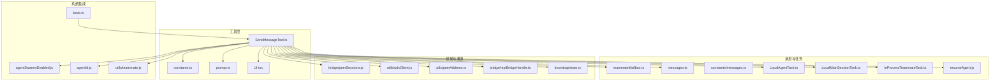
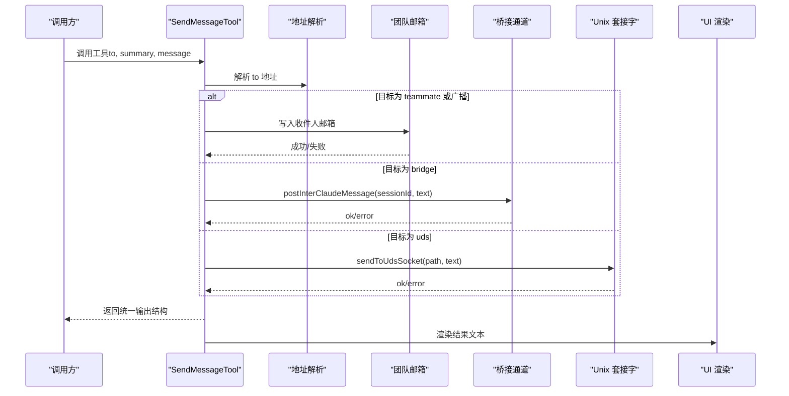
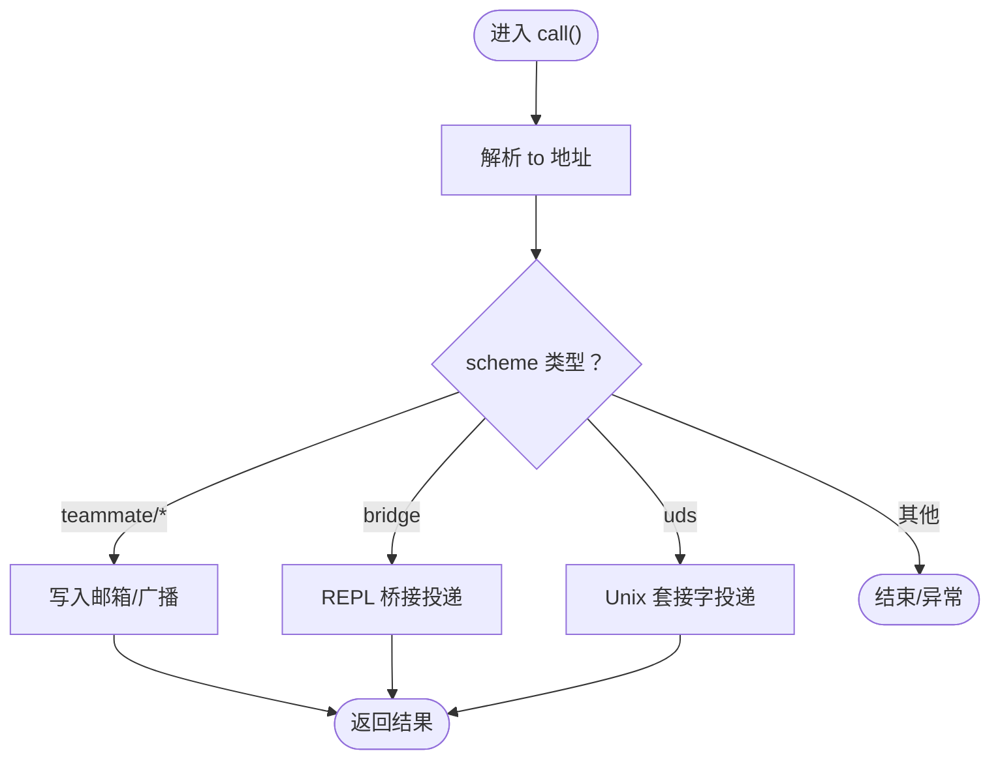
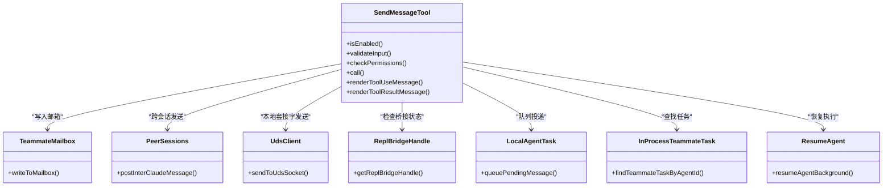

# 消息发送工具

<cite>
**本文引用的文件**
- [SendMessageTool.ts](file://src/tools/SendMessageTool/SendMessageTool.ts)
- [constants.ts](file://src/tools/SendMessageTool/constants.ts)
- [prompt.ts](file://src/tools/SendMessageTool/prompt.ts)
- [UI.tsx](file://src/tools/SendMessageTool/UI.tsx)
- [messages.ts](file://src/utils/messages.ts)
- [messages.ts（常量）](file://src/constants/messages.ts)
- [teammateMailbox.ts](file://src/utils/teammateMailbox.ts)
- [peerSessions.ts](file://src/bridge/peerSessions.js)
- [udsClient.js](file://src/utils/udsClient.js)
- [InProcessTeammateTask.ts](file://src/tasks/InProcessTeammateTask/InProcessTeammateTask.ts)
- [LocalAgentTask.ts](file://src/tasks/LocalAgentTask/LocalAgentTask.ts)
- [LocalMainSessionTask.ts](file://src/tasks/LocalMainSessionTask.ts)
- [resumeAgent.js](file://src/tools/AgentTool/resumeAgent.js)
- [agentId.js](file://src/utils/agentId.js)
- [teammate.js](file://src/utils/teammate.js)
- [agentSwarmsEnabled.js](file://src/utils/agentSwarmsEnabled.js)
- [peerAddress.ts](file://src/utils/peerAddress.ts)
- [replBridgeHandle.ts](file://src/bridge/replBridgeHandle.ts)
- [state.ts](file://src/bootstrap/state.ts)
- [tools.ts](file://src/tools.ts)
</cite>

## 目录
1. [简介](#简介)
2. [项目结构](#项目结构)
3. [核心组件](#核心组件)
4. [架构总览](#架构总览)
5. [详细组件分析](#详细组件分析)
6. [依赖关系分析](#依赖关系分析)
7. [性能考量](#性能考量)
8. [故障排查指南](#故障排查指南)
9. [结论](#结论)
10. [附录](#附录)

## 简介
本文件面向 Claude Code 的“消息发送工具”（SendMessageTool），系统性阐述其消息发送与接收机制、消息格式、传输协议与状态管理；解释消息路由、优先级处理与错误重试策略；详述 UI 组件的消息输入界面、预览与发送状态展示；提供消息模板系统、批量发送与定时发送的使用指南；覆盖消息安全传输、加密与隐私保护；并给出与外部通信渠道（本地 Unix 套接字、远程控制桥接）的集成方法与最佳实践。

## 项目结构
SendMessageTool 位于工具模块中，围绕“消息路由—权限校验—跨通道投递—结果渲染”的主干流程组织代码，同时与任务系统、邮件箱、桥接通道、UI 渲染等子系统协作。

图示来源
- [SendMessageTool.ts:520-919](file://src/tools/SendMessageTool/SendMessageTool.ts#L520-L919)
- [teammateMailbox.ts](file://src/utils/teammateMailbox.ts)
- [messages.ts:141-169](file://src/utils/messages.ts#L141-L169)
- [LocalAgentTask.ts](file://src/tasks/LocalAgentTask/LocalAgentTask.js)
- [LocalMainSessionTask.ts](file://src/tasks/LocalMainSessionTask.ts)
- [InProcessTeammateTask.ts](file://src/tasks/InProcessTeammateTask/InProcessTeammateTask.js)
- [resumeAgent.js](file://src/tools/AgentTool/resumeAgent.js)
- [peerSessions.ts](file://src/bridge/peerSessions.js)
- [udsClient.js](file://src/utils/udsClient.js)
- [peerAddress.ts](file://src/utils/peerAddress.ts)
- [replBridgeHandle.ts](file://src/bridge/replBridgeHandle.ts)
- [state.ts](file://src/bootstrap/state.ts)
- [tools.ts:68-70](file://src/tools.ts#L68-L70)

章节来源
- [SendMessageTool.ts:520-919](file://src/tools/SendMessageTool/SendMessageTool.ts#L520-L919)
- [tools.ts:68-70](file://src/tools.ts#L68-L70)

## 核心组件
- 工具定义与输入模式：通过 Zod 模式定义 to、summary、message 字段，支持字符串消息与结构化消息（如关闭请求/响应、计划审批响应）。
- 路由与投递：根据目标地址解析 scheme（teammate 名称、广播、uds、bridge），分别写入团队邮箱或通过桥接/UDS 发送。
- 结构化消息协议：支持 shutdown_request/shutdown_response、plan_approval_response 等类型，用于团队内协议交互。
- 权限与安全：对跨会话（bridge/uds）发送进行显式许可提示与连接状态检查，拒绝不合规输入。
- UI 渲染：在终端 UI 中以简洁文本反馈发送结果，避免泄露内部 routing 信息。

章节来源
- [SendMessageTool.ts:67-87](file://src/tools/SendMessageTool/SendMessageTool.ts#L67-L87)
- [SendMessageTool.ts:92-131](file://src/tools/SendMessageTool/SendMessageTool.ts#L92-L131)
- [prompt.ts:5-48](file://src/tools/SendMessageTool/prompt.ts#L5-L48)
- [UI.tsx:6-30](file://src/tools/SendMessageTool/UI.tsx#L6-L30)

## 架构总览
SendMessageTool 的调用流从工具入口开始，经过输入校验、地址解析、目标判定、消息写入或跨通道投递，最终返回统一输出结构并在 UI 中渲染。

图示来源
- [SendMessageTool.ts:741-798](file://src/tools/SendMessageTool/SendMessageTool.ts#L741-L798)
- [peerSessions.ts](file://src/bridge/peerSessions.js)
- [udsClient.js](file://src/utils/udsClient.js)
- [UI.tsx:15-30](file://src/tools/SendMessageTool/UI.tsx#L15-L30)

## 详细组件分析

### 输入与输出模型
- 输入模式
  - to：接收者，支持 teammate 名称、广播“*”、uds:socket-path、bridge:session-id。
  - summary：当 message 为字符串时必填，用于 UI 预览。
  - message：字符串或结构化消息对象（shutdown_request/response、plan_approval_response）。
- 输出模型
  - 普通消息：包含 success、message、可选 routing（sender/target 颜色、摘要、内容）。
  - 广播：包含 success、message、recipients 列表、可选 routing。
  - 请求/响应：包含 success、message、request_id、target/request_id。

章节来源
- [SendMessageTool.ts:67-87](file://src/tools/SendMessageTool/SendMessageTool.ts#L67-L87)
- [SendMessageTool.ts:101-131](file://src/tools/SendMessageTool/SendMessageTool.ts#L101-L131)

### 消息路由与投递
- 同机/同会话
  - 将消息写入目标 teammate 的邮箱（writeToMailbox），自动携带发件人、颜色、时间戳与摘要。
  - 广播：读取团队成员列表，逐个投递，返回成功数与收件人列表。
- 跨会话
  - bridge：通过 REPL 桥接通道 postInterClaudeMessage 投递，仅允许纯文本；需检查桥接句柄与活跃状态。
  - uds：通过本地 Unix 域套接字 sendToUdsSocket 投递，支持纯文本；失败时返回错误信息。
- 代理/子代理
  - 若目标是已注册的本地子代理，按运行状态选择队列投递或后台恢复执行，再通知用户。

图示来源
- [SendMessageTool.ts:741-798](file://src/tools/SendMessageTool/SendMessageTool.ts#L741-L798)
- [teammateMailbox.ts](file://src/utils/teammateMailbox.ts)
- [peerSessions.ts](file://src/bridge/peerSessions.js)
- [udsClient.js](file://src/utils/udsClient.js)

章节来源
- [SendMessageTool.ts:149-266](file://src/tools/SendMessageTool/SendMessageTool.ts#L149-L266)
- [SendMessageTool.ts:268-518](file://src/tools/SendMessageTool/SendMessageTool.ts#L268-L518)
- [SendMessageTool.ts:741-912](file://src/tools/SendMessageTool/SendMessageTool.ts#L741-L912)

### 结构化消息协议
- 关闭请求/响应
  - shutdown_request：发起关闭请求，携带 request_id、from、reason。
  - shutdown_response：批准或拒绝关闭，携带 request_id、approve、reason。
  - 批准路径：若为 in-process 子代理，尝试中断其任务；否则触发优雅退出。
- 计划审批响应
  - plan_approval_response：团队领导批准/拒绝计划，携带 request_id、approved、feedback。
  - 仅团队领导可操作，非领导调用将被拒绝。

章节来源
- [SendMessageTool.ts:46-65](file://src/tools/SendMessageTool/SendMessageTool.ts#L46-L65)
- [SendMessageTool.ts:268-518](file://src/tools/SendMessageTool/SendMessageTool.ts#L268-L518)

### 权限与安全
- 跨会话限制
  - bridge/uds 仅允许纯文本消息，结构化消息禁止跨会话发送。
  - 发送前进行显式许可提示（ask 行为），并检查 REPL 桥接是否可用。
- 连接状态校验
  - 在实际发送前再次校验桥接句柄与活跃状态，避免在等待许可期间连接断开导致的无效发送。
- 输入约束
  - to 不得为空、不得包含“@”、广播不可使用结构化消息、拒绝关闭响应必须发送给团队领导等。

章节来源
- [SendMessageTool.ts:585-718](file://src/tools/SendMessageTool/SendMessageTool.ts#L585-L718)

### UI 组件与状态展示
- 输入界面
  - 使用 SendMessageTool 的描述与提示，指导用户填写 to、summary、message。
- 预览与结果
  - UI 渲染函数根据输出类型决定是否显示 routing/request_id 等内部字段；普通发送结果以简洁文本呈现。
- 文本占位
  - 当无内容时使用统一占位符，避免空内容导致的显示问题。

章节来源
- [prompt.ts:5-48](file://src/tools/SendMessageTool/prompt.ts#L5-L48)
- [UI.tsx:6-30](file://src/tools/SendMessageTool/UI.tsx#L6-L30)
- [messages.ts（常量）:1-3](file://src/constants/messages.ts#L1-L3)

### 任务与状态管理
- 子代理消息队列
  - 若目标是本地子代理且处于运行中，消息将排队等待下一轮工具回合处理。
- 自动恢复与通知
  - 若目标停止，尝试后台恢复执行并返回输出文件位置；若无法恢复，返回清理原因。
- 主会话与任务状态
  - 主会话任务与本地任务状态影响消息投递策略与恢复行为。

章节来源
- [SendMessageTool.ts:800-874](file://src/tools/SendMessageTool/SendMessageTool.ts#L800-L874)
- [LocalAgentTask.ts](file://src/tasks/LocalAgentTask/LocalAgentTask.js)
- [LocalMainSessionTask.ts](file://src/tasks/LocalMainSessionTask.ts)
- [InProcessTeammateTask.ts](file://src/tasks/InProcessTeammateTask/InProcessTeammateTask.js)
- [resumeAgent.js](file://src/tools/AgentTool/resumeAgent.js)

## 依赖关系分析

图示来源
- [SendMessageTool.ts:520-919](file://src/tools/SendMessageTool/SendMessageTool.ts#L520-L919)
- [teammateMailbox.ts](file://src/utils/teammateMailbox.ts)
- [peerSessions.ts](file://src/bridge/peerSessions.js)
- [udsClient.js](file://src/utils/udsClient.js)
- [replBridgeHandle.ts](file://src/bridge/replBridgeHandle.ts)
- [LocalAgentTask.ts](file://src/tasks/LocalAgentTask/LocalAgentTask.js)
- [InProcessTeammateTask.ts](file://src/tasks/InProcessTeammateTask/InProcessTeammateTask.js)
- [resumeAgent.js](file://src/tools/AgentTool/resumeAgent.js)

章节来源
- [SendMessageTool.ts:520-919](file://src/tools/SendMessageTool/SendMessageTool.ts#L520-L919)

## 性能考量
- 广播成本
  - 广播复杂度与团队规模线性相关，应谨慎使用，仅在全员确需时发送。
- 队列投递
  - 对于运行中的本地子代理，消息进入队列等待，避免阻塞当前轮次，提升吞吐。
- 跨通道延迟
  - bridge/uds 发送受网络与本地 I/O 影响，建议在 UI 中提供进度提示与重试策略（见故障排查）。

## 故障排查指南
- “to 必须为裸名称或 '*'”
  - 确保未包含“@”，且广播仅用于字符串消息。
- “summary 为字符串时必填”
  - 提供 5–10 词摘要以便 UI 预览。
- “跨会话仅支持纯文本”
  - 结构化消息无法通过 bridge/uds 发送，请改用 teammate 名称或本地套接字。
- “Remote Control 未连接”
  - 发送 bridge:... 前先建立桥接连接，或在发送前确认 isReplBridgeActive。
- “无法找到子代理任务”
  - 若目标已清理或无转录，将无法恢复；请检查任务状态与磁盘缓存。
- 错误信息获取
  - 使用统一错误消息提取工具，便于在 UI 中展示具体失败原因。

章节来源
- [SendMessageTool.ts:604-718](file://src/tools/SendMessageTool/SendMessageTool.ts#L604-L718)
- [SendMessageTool.ts:741-798](file://src/tools/SendMessageTool/SendMessageTool.ts#L741-L798)
- [messages.ts:141-169](file://src/utils/messages.ts#L141-L169)

## 结论
SendMessageTool 通过统一的输入模式与输出结构，实现了从同会话到跨会话的多通道消息投递；借助结构化消息协议支撑团队内的关闭与计划审批流程；配合权限校验与连接状态检查，确保安全可控；UI 层以简洁文本反馈结果，兼顾易用性与安全性。对于大规模广播与跨机器通信，建议结合队列与重试策略，优化用户体验与系统稳定性。

## 附录

### 使用指南与最佳实践
- 普通消息
  - to 为 teammate 名称或“*”；message 为字符串时必须提供 summary。
- 结构化消息
  - 仅在同会话内使用；广播禁止结构化消息；关闭/计划审批响应需遵循协议字段。
- 跨会话发送
  - bridge：仅纯文本，先建立桥接连接；uds：本地套接字路径有效。
- 模板与批量
  - 可在上层逻辑中生成多条消息，逐条调用工具；批量广播建议评估团队规模与必要性。
- 定时发送
  - 通过外部调度器（如 Cron 工具）在指定时间触发 SendMessageTool 调用。
- 安全与隐私
  - 避免在 message 中包含敏感信息；跨会话发送需显式许可；严格校验 to 与地址格式。

章节来源
- [prompt.ts:5-48](file://src/tools/SendMessageTool/prompt.ts#L5-L48)
- [SendMessageTool.ts:585-718](file://src/tools/SendMessageTool/SendMessageTool.ts#L585-L718)
- [SendMessageTool.ts:741-798](file://src/tools/SendMessageTool/SendMessageTool.ts#L741-L798)