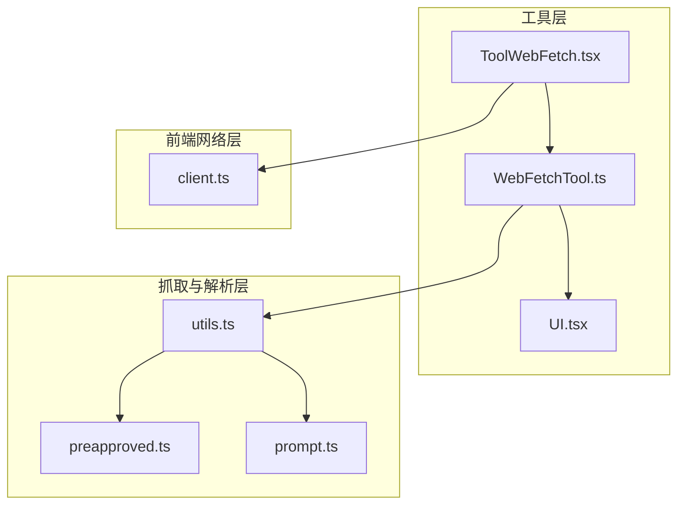
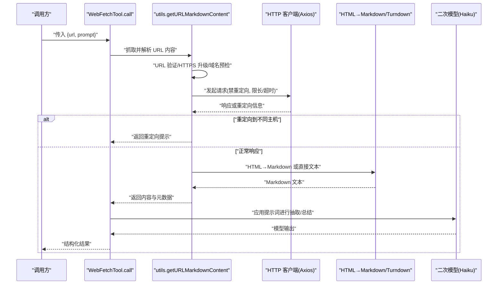
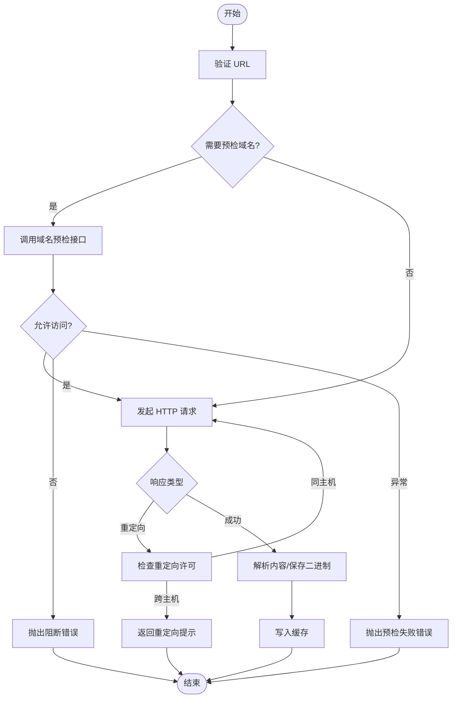
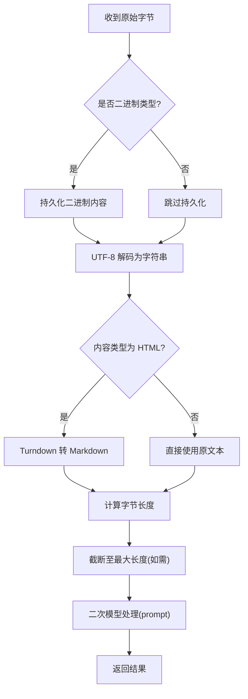
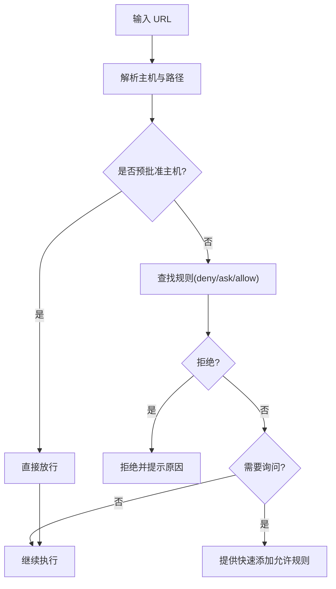
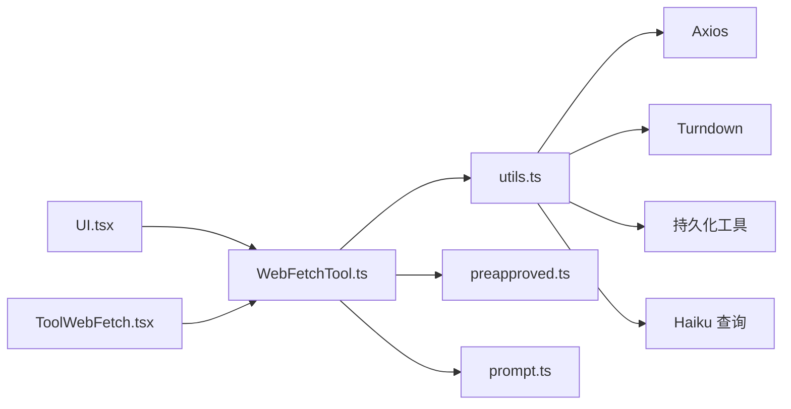

# 网页抓取工具

<cite>
**本文引用的文件**
- [WebFetchTool.ts](file://src/tools/WebFetchTool/WebFetchTool.ts)
- [utils.ts](file://src/tools/WebFetchTool/utils.ts)
- [preapproved.ts](file://src/tools/WebFetchTool/preapproved.ts)
- [prompt.ts](file://src/tools/WebFetchTool/prompt.ts)
- [UI.tsx](file://src/tools/WebFetchTool/UI.tsx)
- [ToolWebFetch.tsx](file://web/components/tools/ToolWebFetch.tsx)
- [client.ts](file://web/lib/api/client.ts)
</cite>

## 目录
1. [简介](#简介)
2. [项目结构](#项目结构)
3. [核心组件](#核心组件)
4. [架构总览](#架构总览)
5. [详细组件分析](#详细组件分析)
6. [依赖关系分析](#依赖关系分析)
7. [性能考量](#性能考量)
8. [故障排查指南](#故障排查指南)
9. [结论](#结论)
10. [附录](#附录)

## 简介
本文件面向 Claude Code 的网页抓取工具 WebFetchTool，系统性阐述其 HTTP 请求处理、页面解析与数据提取流程，以及权限与安全控制、缓存与增量更新、错误恢复与重试策略、反爬虫与网络限制应对等关键能力。文档同时给出可操作的实践建议，帮助在保证合规与性能的前提下高效使用该工具。

## 项目结构
WebFetchTool 的实现主要分布在以下模块：
- 工具定义与调用：WebFetchTool.ts
- HTTP 抓取、解析与提示词工程：utils.ts
- 预批准域名白名单：preapproved.ts
- 工具描述与二次模型提示词模板：prompt.ts
- 命令行与终端 UI 渲染：UI.tsx
- Web 前端展示组件：ToolWebFetch.tsx
- Web 前端请求客户端（通用）：client.ts

图表来源
- [WebFetchTool.ts:66-307](file://src/tools/WebFetchTool/WebFetchTool.ts#L66-L307)
- [utils.ts:384-519](file://src/tools/WebFetchTool/utils.ts#L384-L519)
- [preapproved.ts:14-168](file://src/tools/WebFetchTool/preapproved.ts#L14-L168)
- [prompt.ts:3-46](file://src/tools/WebFetchTool/prompt.ts#L3-L46)
- [UI.tsx:9-71](file://src/tools/WebFetchTool/UI.tsx#L9-L71)
- [ToolWebFetch.tsx:46-125](file://web/components/tools/ToolWebFetch.tsx#L46-L125)
- [client.ts:150-196](file://web/lib/api/client.ts#L150-L196)

章节来源
- [WebFetchTool.ts:66-307](file://src/tools/WebFetchTool/WebFetchTool.ts#L66-L307)
- [utils.ts:384-519](file://src/tools/WebFetchTool/utils.ts#L384-L519)
- [preapproved.ts:14-168](file://src/tools/WebFetchTool/preapproved.ts#L14-L168)
- [prompt.ts:3-46](file://src/tools/WebFetchTool/prompt.ts#L3-L46)
- [UI.tsx:9-71](file://src/tools/WebFetchTool/UI.tsx#L9-L71)
- [ToolWebFetch.tsx:46-125](file://web/components/tools/ToolWebFetch.tsx#L46-L125)
- [client.ts:150-196](file://web/lib/api/client.ts#L150-L196)

## 核心组件
- 工具定义与调用链：负责输入校验、权限检查、调用抓取函数、二次模型处理、输出封装与 UI 渲染。
- 抓取与解析引擎：统一的 HTTP 抓取、重定向许可判断、HTML 到 Markdown 转换、二进制内容持久化、缓存与长度截断。
- 预批准域名白名单：限定特定代码类站点的免预检直通访问。
- 提示词工程：根据是否预批准域生成二次模型提示词，约束引用与版权合规。
- 前端展示：命令行与 Web 侧的工具结果渲染与状态展示。

章节来源
- [WebFetchTool.ts:24-48](file://src/tools/WebFetchTool/WebFetchTool.ts#L24-L48)
- [utils.ts:384-519](file://src/tools/WebFetchTool/utils.ts#L384-L519)
- [preapproved.ts:14-168](file://src/tools/WebFetchTool/preapproved.ts#L14-L168)
- [prompt.ts:23-46](file://src/tools/WebFetchTool/prompt.ts#L23-L46)
- [UI.tsx:9-71](file://src/tools/WebFetchTool/UI.tsx#L9-L71)
- [ToolWebFetch.tsx:46-125](file://web/components/tools/ToolWebFetch.tsx#L46-L125)

## 架构总览
WebFetchTool 的执行路径从工具调用开始，贯穿权限检查、URL 验证、域名预检、HTTP 抓取、内容解析与二次模型处理，最终返回结构化输出并在前后端渲染。

图表来源
- [WebFetchTool.ts:208-299](file://src/tools/WebFetchTool/WebFetchTool.ts#L208-L299)
- [utils.ts:384-519](file://src/tools/WebFetchTool/utils.ts#L384-L519)
- [utils.ts:262-366](file://src/tools/WebFetchTool/utils.ts#L262-L366)
- [utils.ts:521-567](file://src/tools/WebFetchTool/utils.ts#L521-L567)

## 详细组件分析

### HTTP 请求与重定向控制
- 请求参数与限制
  - 最大内容长度：10 MB
  - 单次请求超时：60 秒
  - 最大重定向跳数：10 次
  - 禁止自动跟随重定向，仅允许“同源/仅变更路径/仅变更 www”等安全重定向
- 重定向检测与处理
  - 对 301/302/307/308 状态码进行位置解析与许可判断
  - 若跨主机重定向，返回重定向信息供用户按新 URL 重新发起请求
- 特殊错误处理
  - 企业出口代理阻断：识别 403 + 自定义头部后抛出专用错误
  - x402 支付要求：解析响应头后自动重试并附加支付头
- URL 规范化
  - http 自动升级为 https
  - URL 长度上限与协议/凭据过滤

图表来源
- [utils.ts:139-169](file://src/tools/WebFetchTool/utils.ts#L139-L169)
- [utils.ts:176-203](file://src/tools/WebFetchTool/utils.ts#L176-L203)
- [utils.ts:262-366](file://src/tools/WebFetchTool/utils.ts#L262-L366)
- [utils.ts:384-519](file://src/tools/WebFetchTool/utils.ts#L384-L519)

章节来源
- [utils.ts:108-129](file://src/tools/WebFetchTool/utils.ts#L108-L129)
- [utils.ts:205-243](file://src/tools/WebFetchTool/utils.ts#L205-L243)
- [utils.ts:262-366](file://src/tools/WebFetchTool/utils.ts#L262-L366)
- [utils.ts:384-519](file://src/tools/WebFetchTool/utils.ts#L384-L519)

### 页面解析与内容提取
- HTML 到 Markdown
  - 使用延迟加载的 Turndown 将 HTML 转换为 Markdown，避免冷启动开销
  - 非 HTML 类型直接作为原始文本处理
- 二进制内容处理
  - 识别二进制类型后落盘保存，记录文件路径与大小，便于后续查看
- 结果截断与二次模型处理
  - 当内容过长时截断至 10 万字符并提示
  - 通过二次模型（Haiku）对 Markdown 应用用户提示词，生成抽取/总结结果
- 缓存策略
  - URL 级 LRU 缓存，15 分钟 TTL，50 MB 总容量
  - 域名预检独立缓存，5 分钟 TTL，避免重复往返

图表来源
- [utils.ts:477-518](file://src/tools/WebFetchTool/utils.ts#L477-L518)
- [utils.ts:521-567](file://src/tools/WebFetchTool/utils.ts#L521-L567)
- [utils.ts:66-79](file://src/tools/WebFetchTool/utils.ts#L66-L79)

章节来源
- [utils.ts:477-518](file://src/tools/WebFetchTool/utils.ts#L477-L518)
- [utils.ts:521-567](file://src/tools/WebFetchTool/utils.ts#L521-L567)
- [utils.ts:66-79](file://src/tools/WebFetchTool/utils.ts#L66-L79)

### 权限与安全控制
- 预批准域名白名单
  - 对常见编程语言与框架文档站点开放免预检访问
  - 严格限制为 GET 请求，不继承沙箱网络限制，避免上传与敏感操作
- 权限决策流程
  - 优先匹配预批准主机；否则基于规则集（allow/deny/ask）进行决策
  - 未授权时提供快速添加“允许规则”的建议
- 用户提示
  - 明确标注“认证/私有链接将失败”，建议优先使用 MCP 提供的已认证工具

图表来源
- [WebFetchTool.ts:104-180](file://src/tools/WebFetchTool/WebFetchTool.ts#L104-L180)
- [preapproved.ts:14-168](file://src/tools/WebFetchTool/preapproved.ts#L14-L168)
- [WebFetchTool.ts:50-64](file://src/tools/WebFetchTool/WebFetchTool.ts#L50-L64)

章节来源
- [WebFetchTool.ts:104-180](file://src/tools/WebFetchTool/WebFetchTool.ts#L104-L180)
- [preapproved.ts:14-168](file://src/tools/WebFetchTool/preapproved.ts#L14-L168)
- [WebFetchTool.ts:50-64](file://src/tools/WebFetchTool/WebFetchTool.ts#L50-L64)

### 数据缓存、增量更新与版本管理
- 缓存设计
  - URL 级 LRU 缓存，键为原始 URL，值包含内容、字节数、状态码、内容类型及二进制持久化信息
  - TTL 15 分钟，容量上限 50 MB；域名预检缓存独立，TTL 5 分钟
- 增量更新
  - 同一 URL 在缓存有效期内直接命中，避免重复抓取
  - 二进制内容持久化路径随时间戳与随机串生成，确保可追溯
- 版本与兼容
  - 缓存项包含内容类型与持久化信息，便于后续版本扩展与回溯

章节来源
- [utils.ts:50-79](file://src/tools/WebFetchTool/utils.ts#L50-L79)
- [utils.ts:384-519](file://src/tools/WebFetchTool/utils.ts#L384-L519)

### 错误恢复与重试策略
- 工具内部错误
  - 域名阻断与预检失败：抛出明确错误类型，避免记录为内部错误
  - 企业代理阻断：识别 403 + 自定义头部后抛出专用错误
  - x402 支付要求：解析响应头后自动重试并附加支付头
- 前端请求客户端（通用）
  - 5xx 错误与非中止异常自动重试，指数退避
  - 超时与取消分别映射为 408 与 abort 错误
- 建议
  - 对于 WebFetchTool 的调用，建议在上层捕获并提示用户重试或调整 URL

章节来源
- [utils.ts:316-366](file://src/tools/WebFetchTool/utils.ts#L316-L366)
- [client.ts:132-144](file://web/lib/api/client.ts#L132-L144)
- [client.ts:176-196](file://web/lib/api/client.ts#L176-L196)

### 反爬虫应对、IP 代理与请求频率控制
- 反爬虫与网络限制
  - 域名预检：通过外部接口确认可抓取性，失败时抛出明确错误
  - 企业代理阻断识别：通过响应头判断并提示
  - 重定向许可：严格限制为同源或仅变更 www/路径，防止开放重定向风险
- IP 代理与频率控制
  - 工具未内置代理轮换与速率限制逻辑，建议通过外部网络策略或 MCP 工具链配合实现
  - 对于高并发场景，建议在调用层增加队列与退避策略

章节来源
- [utils.ts:176-203](file://src/tools/WebFetchTool/utils.ts#L176-L203)
- [utils.ts:205-243](file://src/tools/WebFetchTool/utils.ts#L205-L243)
- [utils.ts:316-366](file://src/tools/WebFetchTool/utils.ts#L316-L366)

### 请求头管理、Cookie 与会话保持
- 请求头
  - 默认 Accept 包含 text/markdown, text/html, */*
  - 使用专用 User-Agent，便于服务端识别与统计
- Cookie 与会话
  - 工具默认不携带 Cookie，避免跨站会话泄露
  - 认证/私有内容请优先使用 MCP 提供的已认证工具

章节来源
- [utils.ts:278-282](file://src/tools/WebFetchTool/utils.ts#L278-L282)
- [WebFetchTool.ts:181-190](file://src/tools/WebFetchTool/WebFetchTool.ts#L181-L190)

### 前端展示与交互
- 命令行与 Web 展示
  - 展示 URL、状态码徽章、提示词摘要与结果正文
  - 支持展开/折叠长结果，显示近似大小
- 状态反馈
  - 运行中显示“正在抓取…”脉冲提示
  - 错误时以红色字体展示错误信息

章节来源
- [UI.tsx:9-71](file://src/tools/WebFetchTool/UI.tsx#L9-L71)
- [ToolWebFetch.tsx:46-125](file://web/components/tools/ToolWebFetch.tsx#L46-L125)

## 依赖关系分析
- 组件耦合
  - WebFetchTool 依赖 utils 的抓取与解析能力，依赖 preapproved 的白名单判定，依赖 prompt 的提示词模板
  - UI 层与工具层解耦，通过标准化输出进行渲染
- 外部依赖
  - HTTP 客户端：Axios
  - HTML→Markdown：Turndown（延迟加载）
  - 二进制内容存储：持久化工具
  - 二次模型：Haiku 查询接口

图表来源
- [WebFetchTool.ts:66-307](file://src/tools/WebFetchTool/WebFetchTool.ts#L66-L307)
- [utils.ts:1-18](file://src/tools/WebFetchTool/utils.ts#L1-L18)
- [preapproved.ts:14-168](file://src/tools/WebFetchTool/preapproved.ts#L14-L168)
- [prompt.ts:23-46](file://src/tools/WebFetchTool/prompt.ts#L23-L46)
- [UI.tsx:9-71](file://src/tools/WebFetchTool/UI.tsx#L9-L71)
- [ToolWebFetch.tsx:46-125](file://web/components/tools/ToolWebFetch.tsx#L46-L125)

章节来源
- [WebFetchTool.ts:66-307](file://src/tools/WebFetchTool/WebFetchTool.ts#L66-L307)
- [utils.ts:1-18](file://src/tools/WebFetchTool/utils.ts#L1-L18)

## 性能考量
- 冷启动优化
  - Turndown 延迟加载，首次抓取后再复用实例
- 内存与 CPU
  - 限制单次内容长度与最大内容长度，避免内存峰值过高
  - HTML→DOM 构建前释放底层 ArrayBuffer，降低峰值占用
- 缓存收益
  - URL 级 LRU 缓存显著减少重复抓取与解析成本
- I/O 与网络
  - 企业代理阻断与重定向许可提前拦截，减少无效往返

章节来源
- [utils.ts:88-97](file://src/tools/WebFetchTool/utils.ts#L88-L97)
- [utils.ts:465-470](file://src/tools/WebFetchTool/utils.ts#L465-L470)
- [utils.ts:66-79](file://src/tools/WebFetchTool/utils.ts#L66-L79)

## 故障排查指南
- 常见问题与定位
  - 域名被阻断：检查域名预检结果与错误类型
  - 企业代理阻断：确认 403 + 自定义头部
  - 跨主机重定向：遵循工具返回的重定向提示重新发起请求
  - URL 无效：检查 URL 格式、长度与协议
- 建议步骤
  - 先尝试预批准域名（如文档站点）
  - 如需认证内容，优先使用 MCP 工具链提供的认证抓取
  - 对于不稳定站点，利用缓存与重试策略

章节来源
- [utils.ts:176-203](file://src/tools/WebFetchTool/utils.ts#L176-L203)
- [utils.ts:316-366](file://src/tools/WebFetchTool/utils.ts#L316-L366)
- [WebFetchTool.ts:216-249](file://src/tools/WebFetchTool/WebFetchTool.ts#L216-L249)

## 结论
WebFetchTool 在安全性、性能与可用性之间取得平衡：严格的域名预检与重定向许可保障安全边界；LRU 缓存与延迟加载提升性能；清晰的错误类型与 UI 反馈改善体验。对于认证/私有内容与高并发场景，建议结合 MCP 工具链与外部网络策略共同使用，以满足更复杂的需求。

## 附录
- 关键常量与阈值
  - 最大内容长度：10 MB
  - 单次请求超时：60 秒
  - 最大重定向跳数：10 次
  - URL 最大长度：2000 字符
  - 缓存 TTL：15 分钟
  - 缓存容量：50 MB
  - 二次模型内容截断：10 万字符
- 前端请求客户端（通用）重试
  - 5xx 错误与非中止异常自动重试，指数退避
  - 超时映射为 408，取消映射为 abort

章节来源
- [utils.ts:108-129](file://src/tools/WebFetchTool/utils.ts#L108-L129)
- [utils.ts:66-79](file://src/tools/WebFetchTool/utils.ts#L66-L79)
- [client.ts:132-144](file://web/lib/api/client.ts#L132-L144)
- [client.ts:176-196](file://web/lib/api/client.ts#L176-L196)