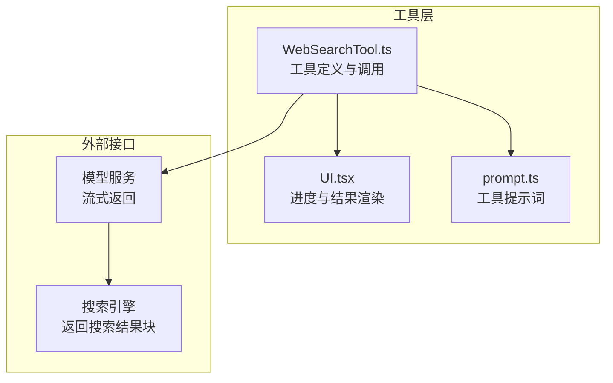
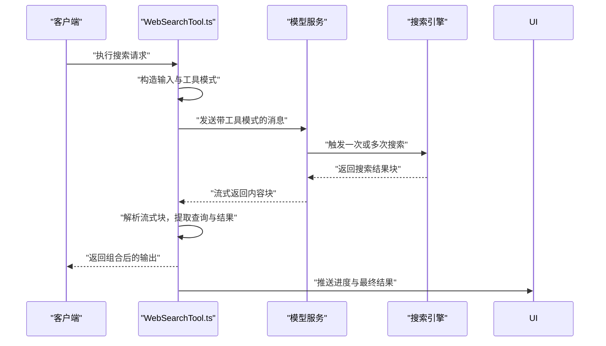
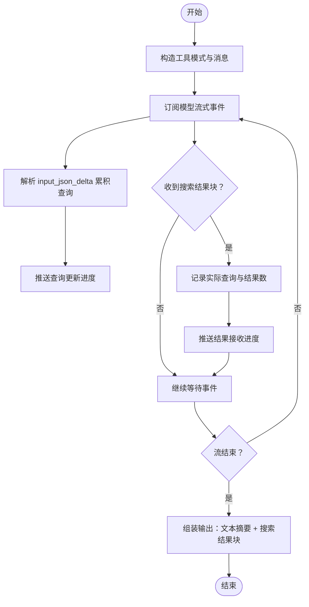
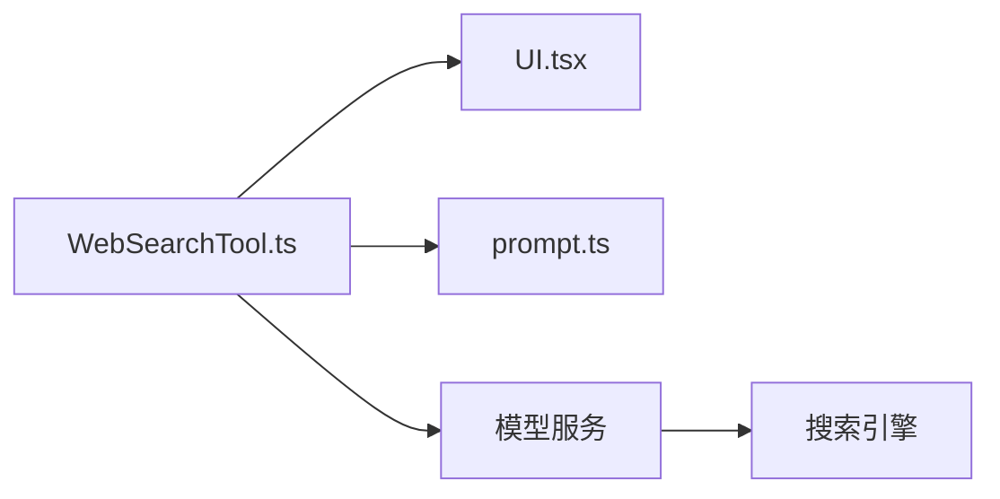

# 网页搜索工具

<cite>
**本文引用的文件**
- [WebSearchTool.ts](file://src/tools/WebSearchTool/WebSearchTool.ts)
- [UI.tsx](file://src/tools/WebSearchTool/UI.tsx)
- [prompt.ts](file://src/tools/WebSearchTool/prompt.ts)
- [classifyForCollapse.ts](file://src/tools/MCPTool/classifyForCollapse.ts)
- [utils.ts](file://src/tools/WebFetchTool/utils.ts)
</cite>

## 目录
1. [简介](#简介)
2. [项目结构](#项目结构)
3. [核心组件](#核心组件)
4. [架构总览](#架构总览)
5. [详细组件分析](#详细组件分析)
6. [依赖关系分析](#依赖关系分析)
7. [性能考量](#性能考量)
8. [故障排查指南](#故障排查指南)
9. [结论](#结论)
10. [附录](#附录)

## 简介
本文件面向 Claude Code 的网页搜索工具 WebSearchTool，系统化阐述其搜索引擎集成方式、查询处理流程、结果排序与去重策略、搜索语法与过滤条件、结果预览与展示、搜索历史与个性化推荐、搜索建议、多引擎支持与负载均衡、搜索质量监控，以及安全、内容过滤与隐私保护等主题。文档以源码为依据，辅以可视化图示帮助读者理解端到端工作流。

## 项目结构
WebSearchTool 位于工具模块中，采用“工具定义 + UI 渲染 + 提示词”的分层设计：
- 工具定义：负责输入校验、调用模型、解析流式响应、组装输出、渲染进度与结果。
- UI 渲染：负责工具使用消息、进度消息与最终结果消息的前端展示。
- 提示词：定义工具能力边界、来源要求与使用注意事项。

图表来源
- [WebSearchTool.ts:152-437](file://src/tools/WebSearchTool/WebSearchTool.ts#L152-L437)
- [UI.tsx:1-102](file://src/tools/WebSearchTool/UI.tsx#L1-L102)
- [prompt.ts:1-36](file://src/tools/WebSearchTool/prompt.ts#L1-L36)

章节来源
- [WebSearchTool.ts:152-437](file://src/tools/WebSearchTool/WebSearchTool.ts#L152-L437)
- [UI.tsx:1-102](file://src/tools/WebSearchTool/UI.tsx#L1-L102)
- [prompt.ts:1-36](file://src/tools/WebSearchTool/prompt.ts#L1-L36)

## 核心组件
- 工具定义与调用
  - 输入模式：查询文本、允许域名列表、阻止域名列表。
  - 输出模式：混合文本摘要与搜索结果块（标题、链接），以及耗时统计。
  - 能力开关：根据 API 提供商与模型版本动态启用。
  - 权限检查：通过权限建议引导用户授权。
- UI 渲染
  - 工具使用消息：在详细模式下显示域名过滤条件。
  - 进度消息：实时显示“正在搜索”和“找到 N 条结果”。
  - 结果消息：汇总搜索次数与耗时。
- 提示词
  - 强制要求在回答末尾列出“Sources:”并以 Markdown 链接形式呈现来源。
  - 支持域名过滤与地域限制说明。

章节来源
- [WebSearchTool.ts:25-66](file://src/tools/WebSearchTool/WebSearchTool.ts#L25-L66)
- [WebSearchTool.ts:152-437](file://src/tools/WebSearchTool/WebSearchTool.ts#L152-L437)
- [UI.tsx:8-24](file://src/tools/WebSearchTool/UI.tsx#L8-L24)
- [UI.tsx:55-92](file://src/tools/WebSearchTool/UI.tsx#L55-L92)
- [prompt.ts:5-34](file://src/tools/WebSearchTool/prompt.ts#L5-L34)

## 架构总览
WebSearchTool 的调用链路如下：客户端发起查询 → 工具构造工具模式与消息 → 模型服务返回流式内容块 → 工具解析并聚合结果 → UI 展示进度与最终结果。

图表来源
- [WebSearchTool.ts:254-400](file://src/tools/WebSearchTool/WebSearchTool.ts#L254-L400)

章节来源
- [WebSearchTool.ts:254-400](file://src/tools/WebSearchTool/WebSearchTool.ts#L254-L400)

## 详细组件分析

### 搜索引擎集成与查询处理
- 工具模式与最大使用次数
  - 工具模式包含 allowed_domains、blocked_domains 与 max_uses 字段；max_uses 固定为 8，用于限制单次会话内搜索次数。
- 流式响应解析
  - 工具按事件类型解析 content_block_start 与 content_block_delta，累积 input_json_delta 中的查询字段，用于进度更新。
  - 当遇到 web_search_tool_result 块时，记录该次搜索的实际查询与结果数量，触发“结果已接收”进度。
- 输出组装
  - 将文本摘要与搜索结果块合并为统一输出；对空结果进行兜底处理；在最终输出中追加“Sources:”与来源链接格式要求。

图表来源
- [WebSearchTool.ts:299-388](file://src/tools/WebSearchTool/WebSearchTool.ts#L299-L388)
- [WebSearchTool.ts:86-150](file://src/tools/WebSearchTool/WebSearchTool.ts#L86-L150)

章节来源
- [WebSearchTool.ts:76-84](file://src/tools/WebSearchTool/WebSearchTool.ts#L76-L84)
- [WebSearchTool.ts:299-388](file://src/tools/WebSearchTool/WebSearchTool.ts#L299-L388)
- [WebSearchTool.ts:86-150](file://src/tools/WebSearchTool/WebSearchTool.ts#L86-L150)

### 结果排序与去重策略
- 排序
  - 工具未显式实现自定义排序逻辑；返回结果顺序由上游搜索引擎决定。
- 去重
  - 工具未实现 URL 或内容级别的去重；如需去重，应在上游或下游阶段补充去重策略。

章节来源
- [WebSearchTool.ts:115-129](file://src/tools/WebSearchTool/WebSearchTool.ts#L115-L129)

### 搜索语法支持、过滤条件与结果预览
- 搜索语法
  - 工具未内置高级搜索语法（如布尔运算、字段限定）；具体语法能力取决于上游搜索引擎与工具模式。
- 过滤条件
  - 支持 allowed_domains 与 blocked_domains 两种域名过滤方式，二者不可同时使用。
- 结果预览
  - UI 在详细模式下展示查询与过滤条件；进度消息显示“正在搜索”与“找到 N 条结果”，最终消息汇总搜索次数与耗时。

章节来源
- [WebSearchTool.ts:25-37](file://src/tools/WebSearchTool/WebSearchTool.ts#L25-L37)
- [WebSearchTool.ts:235-253](file://src/tools/WebSearchTool/WebSearchTool.ts#L235-L253)
- [UI.tsx:25-54](file://src/tools/WebSearchTool/UI.tsx#L25-L54)
- [UI.tsx:55-78](file://src/tools/WebSearchTool/UI.tsx#L55-L78)
- [UI.tsx:79-92](file://src/tools/WebSearchTool/UI.tsx#L79-L92)

### 搜索历史管理、个性化推荐与搜索建议
- 搜索历史
  - 工具未内置历史记录持久化；可在上层会话或消息上下文中维护历史。
- 个性化推荐
  - 工具未内置基于历史的个性化推荐；可结合会话上下文与用户偏好扩展。
- 搜索建议
  - 工具未内置自动补全或建议生成；可通过外部服务或本地启发式扩展。

（本节为概念性说明，不直接分析具体文件）

### 多引擎支持、负载均衡与质量监控
- 多引擎支持
  - 工具定义中未体现多引擎切换逻辑；当前为单一工具模式调用。
- 负载均衡
  - 未见跨引擎的负载均衡实现；如需多引擎，可在工具层引入选择器与失败转移。
- 质量监控
  - 工具记录耗时与搜索次数，可用于基础质量指标；更细粒度的监控可扩展至上游引擎与模型服务。

章节来源
- [WebSearchTool.ts:168-193](file://src/tools/WebSearchTool/WebSearchTool.ts#L168-L193)
- [WebSearchTool.ts:390-399](file://src/tools/WebSearchTool/WebSearchTool.ts#L390-L399)

### 安全、内容过滤与隐私保护
- URL 安全性
  - 工具未对 URL 进行强约束校验；可参考 fetch 工具中的 URL 合法性检查思路，在工具层增加用户名/密码剔除、主机名可解析性等基础校验。
- 内容过滤
  - 工具未内置敏感内容过滤；可在上游或下游阶段接入内容过滤服务。
- 隐私保护
  - 工具未内置隐私脱敏；可在输出前对敏感信息进行脱敏处理。

章节来源
- [utils.ts:151-174](file://src/tools/WebFetchTool/utils.ts#L151-L174)

## 依赖关系分析
- 工具与模型服务
  - 通过流式 API 获取内容块，解析工具使用与搜索结果。
- 工具与 UI
  - UI 依赖工具输出结构进行进度与结果渲染。
- 工具与提示词
  - 提示词约束“Sources:”与来源链接格式，确保合规输出。

图表来源
- [WebSearchTool.ts:152-437](file://src/tools/WebSearchTool/WebSearchTool.ts#L152-L437)
- [UI.tsx:1-102](file://src/tools/WebSearchTool/UI.tsx#L1-L102)
- [prompt.ts:1-36](file://src/tools/WebSearchTool/prompt.ts#L1-L36)

章节来源
- [WebSearchTool.ts:152-437](file://src/tools/WebSearchTool/WebSearchTool.ts#L152-L437)
- [UI.tsx:1-102](file://src/tools/WebSearchTool/UI.tsx#L1-L102)
- [prompt.ts:1-36](file://src/tools/WebSearchTool/prompt.ts#L1-L36)

## 性能考量
- 并发与只读
  - 工具声明并发安全且只读，适合在多任务环境中复用。
- 耗时统计
  - 工具记录从开始到结束的总耗时，便于性能评估与优化。
- 模型选择
  - 可根据特性开关选择更快速的小模型以降低延迟。

章节来源
- [WebSearchTool.ts:200-205](file://src/tools/WebSearchTool/WebSearchTool.ts#L200-L205)
- [WebSearchTool.ts:390-399](file://src/tools/WebSearchTool/WebSearchTool.ts#L390-L399)
- [WebSearchTool.ts:262-290](file://src/tools/WebSearchTool/WebSearchTool.ts#L262-L290)

## 故障排查指南
- 输入校验错误
  - 缺少查询文本或同时指定允许与阻止域名时，工具会返回明确的错误信息与错误码。
- 权限问题
  - 工具返回权限建议，指引用户在本地设置中添加规则以允许使用。
- 搜索结果异常
  - 若上游返回错误块，工具会记录错误并将其作为字符串结果返回，便于诊断。

章节来源
- [WebSearchTool.ts:235-253](file://src/tools/WebSearchTool/WebSearchTool.ts#L235-L253)
- [WebSearchTool.ts:209-222](file://src/tools/WebSearchTool/WebSearchTool.ts#L209-L222)
- [WebSearchTool.ts:115-122](file://src/tools/WebSearchTool/WebSearchTool.ts#L115-L122)

## 结论
WebSearchTool 通过标准化的工具模式与流式解析，实现了从查询到结果的自动化串联，并在 UI 层提供了清晰的进度与结果反馈。其能力边界由提示词严格约束，确保输出合规。当前实现聚焦于单一搜索引擎与基础过滤，若需扩展多引擎、排序去重、个性化与内容过滤，可在工具层或上游服务中逐步增强。

## 附录
- 相关工具分类（用于理解搜索生态）
  - 工具分类清单中包含多种搜索工具名称，可作为扩展多引擎与搜索建议的参考来源。

章节来源
- [classifyForCollapse.ts:58-139](file://src/tools/MCPTool/classifyForCollapse.ts#L58-L139)