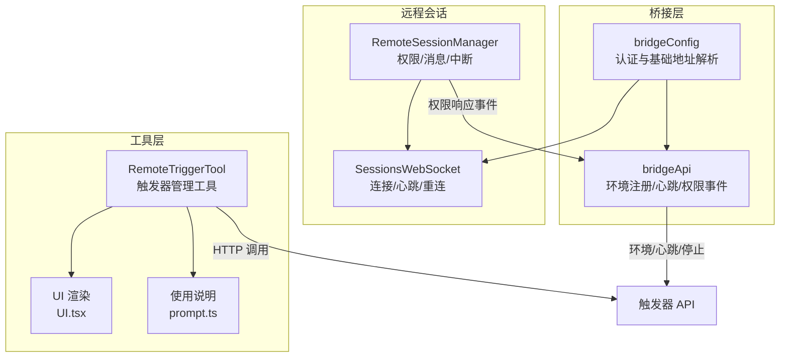
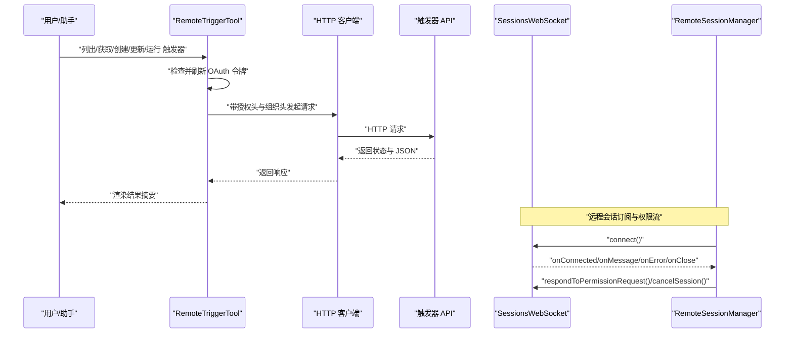
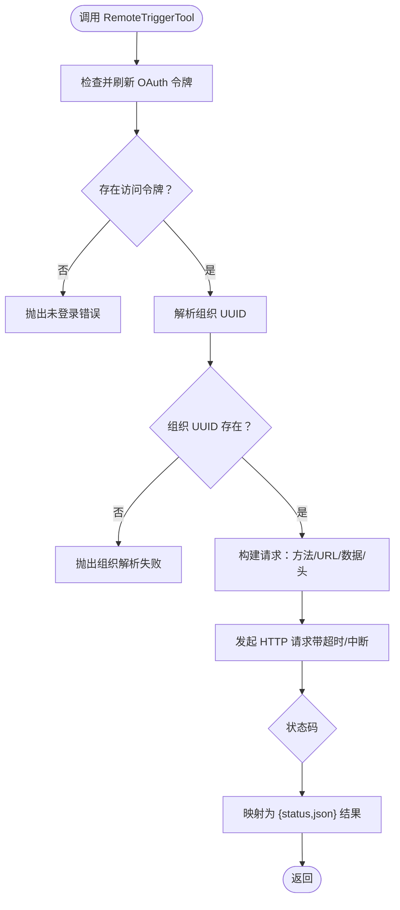
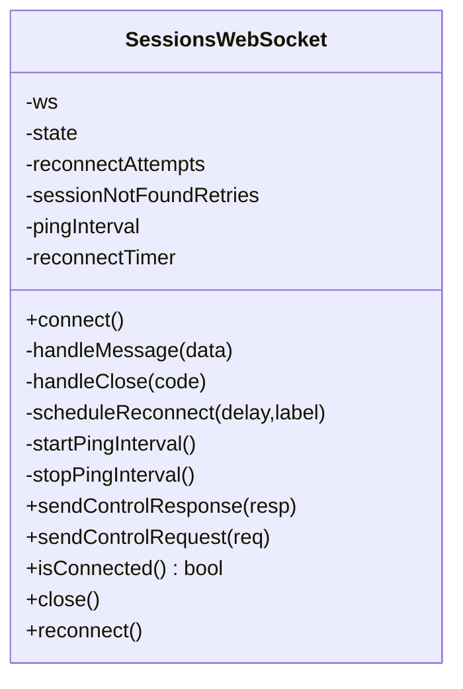
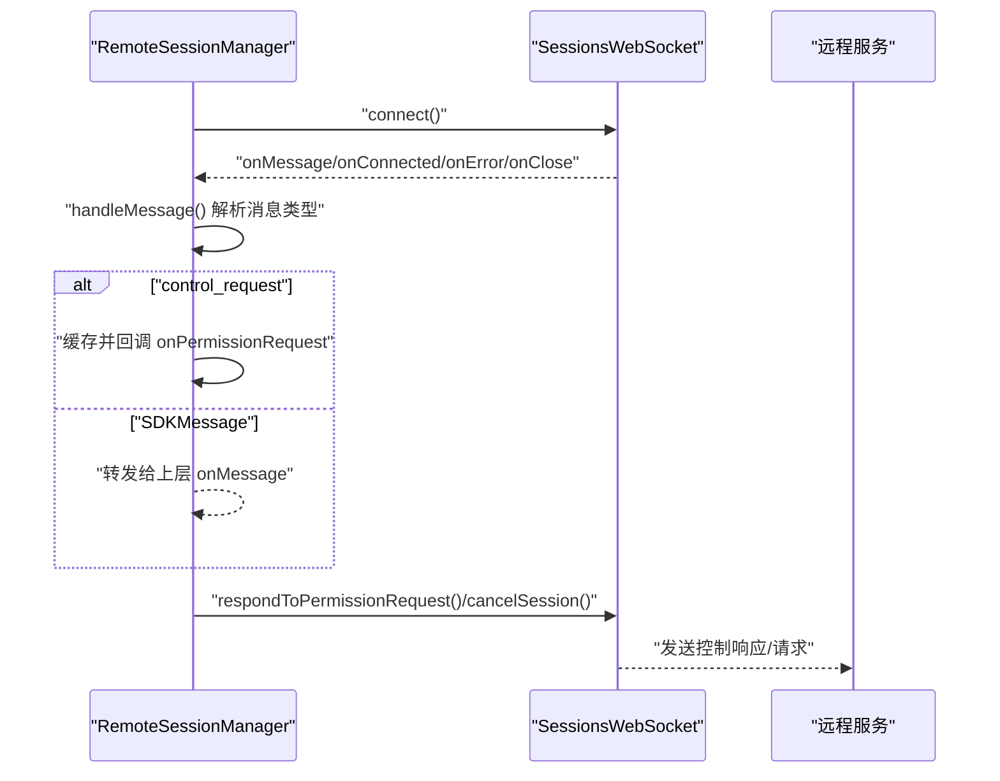
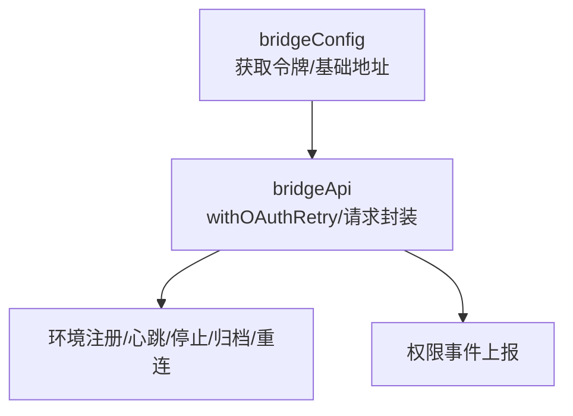
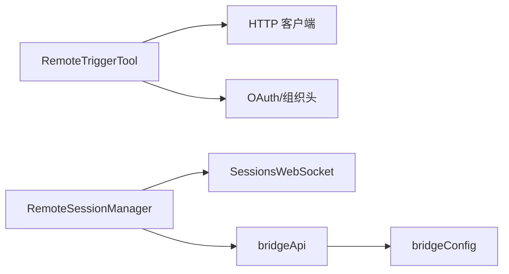

# 远程触发工具

<cite>
**本文引用的文件**   
- [RemoteTriggerTool.ts](file://src/tools/RemoteTriggerTool/RemoteTriggerTool.ts)
- [UI.tsx](file://src/tools/RemoteTriggerTool/UI.tsx)
- [prompt.ts](file://src/tools/RemoteTriggerTool/prompt.ts)
- [SessionsWebSocket.ts](file://src/remote/SessionsWebSocket.ts)
- [RemoteSessionManager.ts](file://src/remote/RemoteSessionManager.ts)
- [bridgeApi.ts](file://src/bridge/bridgeApi.ts)
- [bridgeConfig.ts](file://src/bridge/bridgeConfig.ts)
- [scheduleRemoteAgents.ts](file://src/skills/bundled/scheduleRemoteAgents.ts)
</cite>

## 目录
1. [简介](#简介)
2. [项目结构](#项目结构)
3. [核心组件](#核心组件)
4. [架构总览](#架构总览)
5. [详细组件分析](#详细组件分析)
6. [依赖关系分析](#依赖关系分析)
7. [性能与可靠性](#性能与可靠性)
8. [安全与合规](#安全与合规)
9. [使用指南](#使用指南)
10. [故障排查](#故障排查)
11. [结论](#结论)

## 简介
本文件面向 Claude Code 的“远程触发工具”（RemoteTriggerTool），系统性阐述其远程事件触发与处理机制，覆盖以下主题：
- 远程连接建立：OAuth 认证、组织维度标识、WebSocket 订阅与心跳
- 心跳检测与断线重连策略：指数退避、会话不存在的临时重试、永久关闭码处理
- 触发条件配置、事件过滤与消息路由规则：触发器生命周期管理与运行时调度
- 远程命令执行、文件同步与状态监控：通过触发器 API 实现定时任务编排
- 安全认证机制、访问控制与审计日志：令牌注入、组织隔离、错误分类与致命错误处理
- 分布式系统集成、负载均衡与故障转移：多环境注册、轮询与回退策略

## 项目结构
RemoteTriggerTool 位于工具层，负责调用 claude.ai 的触发器 API；与之协同的远程会话管理由 SessionsWebSocket 和 RemoteSessionManager 提供，桥接层（bridge）提供环境注册、心跳与权限事件等能力。

图表来源
- [RemoteTriggerTool.ts:46-161](file://src/tools/RemoteTriggerTool/RemoteTriggerTool.ts#L46-L161)
- [UI.tsx:1-18](file://src/tools/RemoteTriggerTool/UI.tsx#L1-L18)
- [prompt.ts:1-17](file://src/tools/RemoteTriggerTool/prompt.ts#L1-L17)
- [SessionsWebSocket.ts:82-404](file://src/remote/SessionsWebSocket.ts#L82-L404)
- [RemoteSessionManager.ts:95-324](file://src/remote/RemoteSessionManager.ts#L95-L324)
- [bridgeApi.ts:68-451](file://src/bridge/bridgeApi.ts#L68-L451)
- [bridgeConfig.ts:38-48](file://src/bridge/bridgeConfig.ts#L38-L48)

章节来源
- [RemoteTriggerTool.ts:18-161](file://src/tools/RemoteTriggerTool/RemoteTriggerTool.ts#L18-L161)
- [SessionsWebSocket.ts:17-404](file://src/remote/SessionsWebSocket.ts#L17-L404)
- [RemoteSessionManager.ts:95-324](file://src/remote/RemoteSessionManager.ts#L95-L324)
- [bridgeApi.ts:68-451](file://src/bridge/bridgeApi.ts#L68-L451)
- [bridgeConfig.ts:14-48](file://src/bridge/bridgeConfig.ts#L14-L48)

## 核心组件
- RemoteTriggerTool：定义输入输出模式、启用条件、只读判定、自动分类提示，并封装对触发器 API 的 HTTP 调用，自动注入 OAuth 令牌与组织维度头。
- SessionsWebSocket：负责 WebSocket 连接、鉴权（请求头）、心跳（ping）、断线重连（指数退避与有限重试）、错误与关闭码处理。
- RemoteSessionManager：在 WebSocket 基础上，协调 SDK 消息、权限请求/响应、中断信号发送与会话状态管理。
- bridgeApi/bridgeConfig：提供桥接环境注册、心跳、权限事件上报等能力，并统一认证与基础地址解析。

章节来源
- [RemoteTriggerTool.ts:46-161](file://src/tools/RemoteTriggerTool/RemoteTriggerTool.ts#L46-L161)
- [SessionsWebSocket.ts:82-404](file://src/remote/SessionsWebSocket.ts#L82-L404)
- [RemoteSessionManager.ts:95-324](file://src/remote/RemoteSessionManager.ts#L95-L324)
- [bridgeApi.ts:68-451](file://src/bridge/bridgeApi.ts#L68-L451)
- [bridgeConfig.ts:14-48](file://src/bridge/bridgeConfig.ts#L14-L48)

## 架构总览
RemoteTriggerTool 作为用户侧工具，通过 OAuth 令牌与组织 UUID 访问触发器 API；远程会话通过 SessionsWebSocket 订阅并维持长连接，配合 RemoteSessionManager 处理权限与中断；桥接层提供环境注册、心跳与权限事件上报，确保跨环境的可扩展与可观测。

图表来源
- [RemoteTriggerTool.ts:78-151](file://src/tools/RemoteTriggerTool/RemoteTriggerTool.ts#L78-L151)
- [SessionsWebSocket.ts:100-205](file://src/remote/SessionsWebSocket.ts#L100-L205)
- [RemoteSessionManager.ts:108-141](file://src/remote/RemoteSessionManager.ts#L108-L141)

## 详细组件分析

### RemoteTriggerTool 组件分析
- 输入/输出模式：严格对象，支持 action（list/get/create/update/run）、trigger_id、body；输出包含 HTTP 状态与 JSON 字符串化结果。
- 启用条件：特性开关与策略允许（远程会话策略）共同决定是否可用。
- 只读判定：list/get 为只读，其余写操作需谨慎。
- 认证与组织：自动获取 OAuth 令牌与组织 UUID，并注入到请求头中。
- API 映射：根据 action 选择 GET/POST 与不同 URL；run 动作为 POST /run。
- 超时与中断：设置超时与取消信号，避免长时间阻塞。

图表来源
- [RemoteTriggerTool.ts:78-151](file://src/tools/RemoteTriggerTool/RemoteTriggerTool.ts#L78-L151)

章节来源
- [RemoteTriggerTool.ts:18-161](file://src/tools/RemoteTriggerTool/RemoteTriggerTool.ts#L18-L161)
- [prompt.ts:1-17](file://src/tools/RemoteTriggerTool/prompt.ts#L1-17)
- [UI.tsx:1-18](file://src/tools/RemoteTriggerTool/UI.tsx#L1-L18)

### SessionsWebSocket 组件分析
- 连接建立：基于 OAuth 配置的 BASE_API_URL 构造 wss 地址，使用 Authorization 头进行鉴权；支持代理与 TLS 选项。
- 心跳检测：周期性 ping，异常忽略，交由关闭处理器统一收敛。
- 断线重连：
  - 普通关闭：最多有限次重连，指数退避延迟。
  - 4001（会话不存在）：短暂重试上限，避免因后端压缩导致的瞬态丢失。
  - 永久关闭码：直接停止重连。
- 控制消息：支持发送控制请求（如中断）与控制响应。

图表来源
- [SessionsWebSocket.ts:82-404](file://src/remote/SessionsWebSocket.ts#L82-L404)

章节来源
- [SessionsWebSocket.ts:17-404](file://src/remote/SessionsWebSocket.ts#L17-L404)

### RemoteSessionManager 组件分析
- 协调：WebSocket 订阅、HTTP 发送消息、权限请求/响应流程。
- 权限处理：接收 control_request（如 can_use_tool），缓存待决请求，回调上层决策；支持取消与错误响应。
- 中断与重连：提供中断信号与强制重连能力，适配容器重启后的订阅失效场景。

图表来源
- [RemoteSessionManager.ts:108-214](file://src/remote/RemoteSessionManager.ts#L108-L214)
- [SessionsWebSocket.ts:100-205](file://src/remote/SessionsWebSocket.ts#L100-L205)

章节来源
- [RemoteSessionManager.ts:95-324](file://src/remote/RemoteSessionManager.ts#L95-L324)

### 桥接层（bridgeApi/bridgeConfig）
- 统一认证与基础地址：优先使用开发环境变量覆盖，否则回退到 OAuth 配置。
- 环境注册/心跳/停止/归档/重连：提供环境维度的生命周期管理与健康保障。
- 权限事件上报：将权限响应事件上报至远程会话，驱动 RemoteSessionManager 的权限流。

图表来源
- [bridgeConfig.ts:38-48](file://src/bridge/bridgeConfig.ts#L38-L48)
- [bridgeApi.ts:68-451](file://src/bridge/bridgeApi.ts#L68-L451)

章节来源
- [bridgeConfig.ts:14-48](file://src/bridge/bridgeConfig.ts#L14-L48)
- [bridgeApi.ts:68-451](file://src/bridge/bridgeApi.ts#L68-L451)

## 依赖关系分析
- RemoteTriggerTool 依赖 OAuth 令牌与组织 UUID，通过工具层注入到请求头，避免令牌暴露到 Shell。
- SessionsWebSocket 与 RemoteSessionManager 共同构成远程会话的稳定通道，前者专注连接与心跳，后者聚焦权限与消息编排。
- bridgeApi/bridgeConfig 为桥接环境提供统一的认证与地址解析，支撑跨环境的注册、心跳与权限事件。

图表来源
- [RemoteTriggerTool.ts:78-98](file://src/tools/RemoteTriggerTool/RemoteTriggerTool.ts#L78-L98)
- [SessionsWebSocket.ts:100-119](file://src/remote/SessionsWebSocket.ts#L100-L119)
- [RemoteSessionManager.ts:133-140](file://src/remote/RemoteSessionManager.ts#L133-L140)
- [bridgeApi.ts:68-89](file://src/bridge/bridgeApi.ts#L68-L89)
- [bridgeConfig.ts:38-48](file://src/bridge/bridgeConfig.ts#L38-L48)

章节来源
- [RemoteTriggerTool.ts:78-98](file://src/tools/RemoteTriggerTool/RemoteTriggerTool.ts#L78-L98)
- [SessionsWebSocket.ts:100-119](file://src/remote/SessionsWebSocket.ts#L100-L119)
- [RemoteSessionManager.ts:133-140](file://src/remote/RemoteSessionManager.ts#L133-L140)
- [bridgeApi.ts:68-89](file://src/bridge/bridgeApi.ts#L68-L89)
- [bridgeConfig.ts:38-48](file://src/bridge/bridgeConfig.ts#L38-L48)

## 性能与可靠性
- 连接与心跳
  - 心跳间隔固定，ping 异常不打断业务，交由关闭处理器收敛。
  - 重连采用指数退避与有限尝试，避免风暴式重连。
- 超时与中断
  - 触发器 API 请求设置超时与取消信号，防止长时间阻塞。
- 会话稳定性
  - 对 4001（会话不存在）进行有限重试，缓解后端压缩期间的瞬态丢失。
  - 永久关闭码直接终止重连，避免无效资源消耗。

章节来源
- [SessionsWebSocket.ts:17-404](file://src/remote/SessionsWebSocket.ts#L17-L404)
- [RemoteTriggerTool.ts:135-142](file://src/tools/RemoteTriggerTool/RemoteTriggerTool.ts#L135-L142)

## 安全与合规
- 认证与授权
  - 工具层自动注入 OAuth 令牌与组织 UUID，避免令牌外泄。
  - 桥接层统一处理 401 刷新与 403/404/410 等致命错误，便于上层统一处理。
- 访问控制
  - 特性开关与策略允许共同决定工具可用性，确保最小权限启用。
- 审计与可观测
  - 日志记录连接状态、错误与关闭原因，便于审计与问题定位。
  - 错误类型提取与致命错误分类，区分可恢复与不可恢复场景。

章节来源
- [RemoteTriggerTool.ts:78-98](file://src/tools/RemoteTriggerTool/RemoteTriggerTool.ts#L78-L98)
- [bridgeApi.ts:454-508](file://src/bridge/bridgeApi.ts#L454-L508)
- [bridgeApi.ts:516-524](file://src/bridge/bridgeApi.ts#L516-L524)

## 使用指南
- 触发器管理
  - 列表/获取：仅读操作，适合预览与诊断。
  - 创建/更新：需要 body 参数，支持部分更新与 MCP 连接管理。
  - 运行：立即触发一次执行。
- 触发条件配置
  - 使用 Cron 表达式（UTC），最小间隔 1 小时；根据本地时区转换为 UTC。
  - 为每个触发器指定环境（environment_id），决定远程执行环境。
- 事件过滤与消息路由
  - 通过权限请求/响应控制工具使用范围，结合中断信号实现可控取消。
- 远程命令执行、文件同步与状态监控
  - 通过触发器 API 编排远程任务；结合桥接层的心跳与归档能力监控会话状态。
- 分布式集成与故障转移
  - 多环境注册与轮询，结合心跳与重连策略实现故障转移与高可用。

章节来源
- [prompt.ts:6-15](file://src/tools/RemoteTriggerTool/prompt.ts#L6-L15)
- [scheduleRemoteAgents.ts:249-312](file://src/skills/bundled/scheduleRemoteAgents.ts#L249-L312)
- [bridgeApi.ts:149-197](file://src/bridge/bridgeApi.ts#L149-L197)
- [bridgeApi.ts:387-417](file://src/bridge/bridgeApi.ts#L387-L417)

## 故障排查
- 无访问令牌或组织 UUID
  - 现象：调用前校验失败。
  - 处理：先执行登录，再重试。
- 401/403/404/410 等错误
  - 401：尝试刷新令牌或重新登录。
  - 403：检查组织权限与角色。
  - 404：确认触发器 ID 或接口可用性。
  - 410：会话过期，需重新启动远程控制。
- 连接不稳定
  - 关注重连日志与关闭码；4001 属于瞬态，超过重试上限将停止。
  - 如遇永久关闭码，检查服务端策略或网络代理配置。
- 权限请求未响应
  - 确认上层已及时响应权限请求；必要时发送中断信号取消当前请求。

章节来源
- [RemoteTriggerTool.ts:80-89](file://src/tools/RemoteTriggerTool/RemoteTriggerTool.ts#L80-L89)
- [bridgeApi.ts:454-508](file://src/bridge/bridgeApi.ts#L454-L508)
- [SessionsWebSocket.ts:234-288](file://src/remote/SessionsWebSocket.ts#L234-L288)
- [RemoteSessionManager.ts:189-214](file://src/remote/RemoteSessionManager.ts#L189-L214)

## 结论
RemoteTriggerTool 以简洁的输入输出模型与严格的认证注入，实现了对触发器 API 的安全调用；SessionsWebSocket 与 RemoteSessionManager 提供了稳健的远程会话通道与权限编排；桥接层则保障了跨环境的注册、心跳与事件上报。整体方案在安全性、可靠性与可观测性方面具备良好实践，适用于分布式远程任务编排与自动化运维场景。