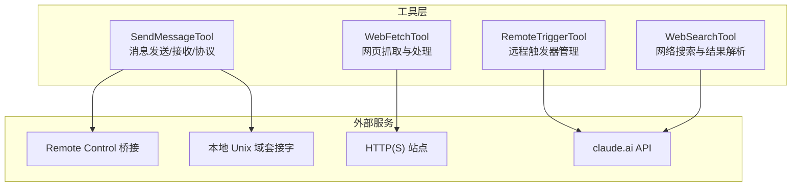
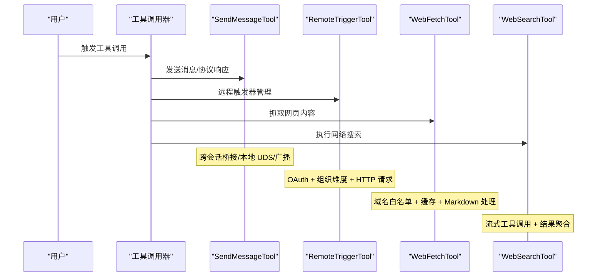
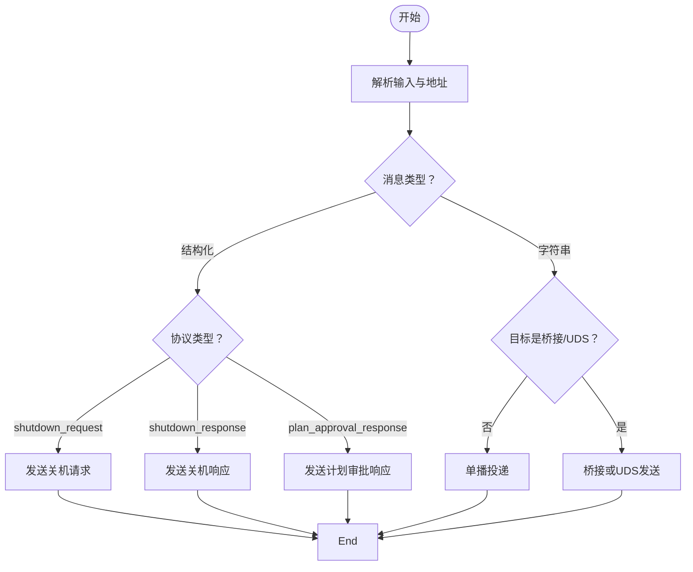
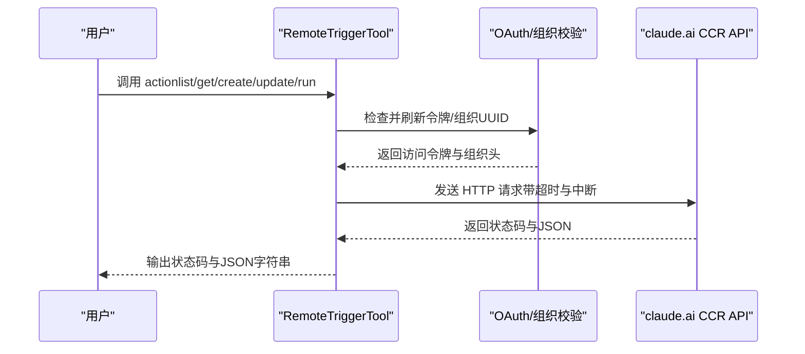
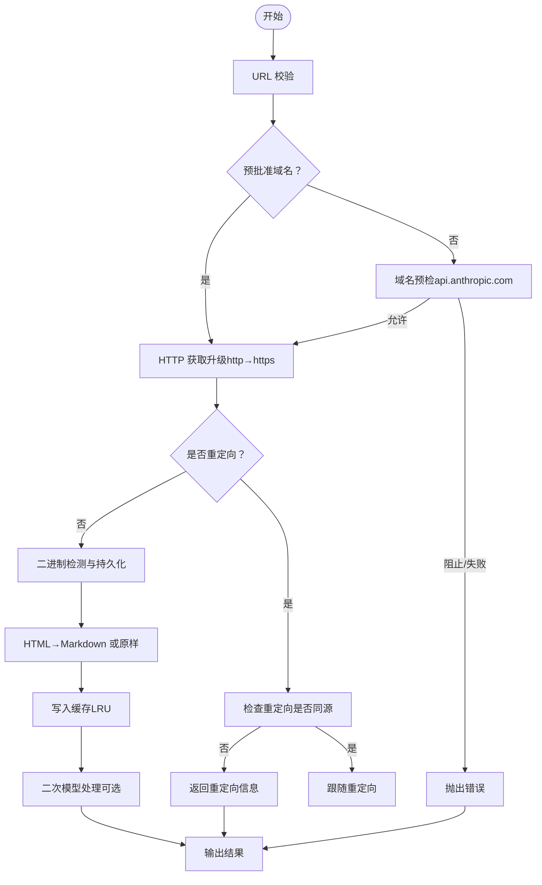
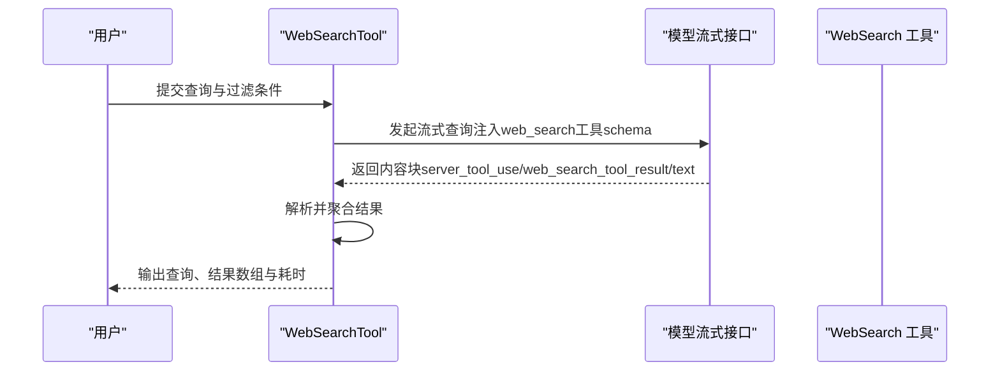
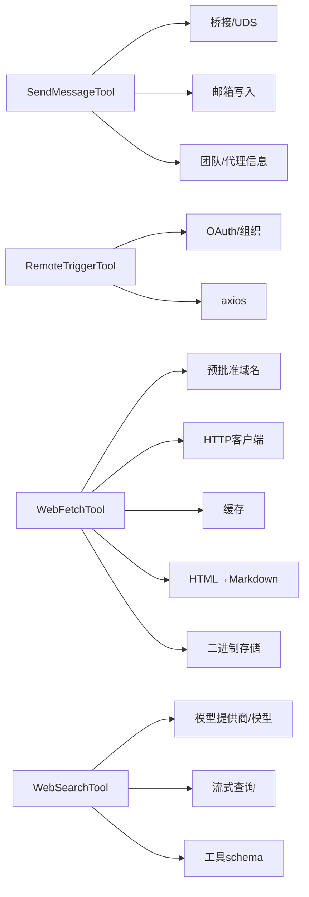

# 通信工具

<cite>
**本文引用的文件**
- [SendMessageTool.ts](file://src/tools/SendMessageTool/SendMessageTool.ts)
- [constants.ts](file://src/tools/SendMessageTool/constants.ts)
- [prompt.ts](file://src/tools/SendMessageTool/prompt.ts)
- [RemoteTriggerTool.ts](file://src/tools/RemoteTriggerTool/RemoteTriggerTool.ts)
- [prompt.ts](file://src/tools/RemoteTriggerTool/prompt.ts)
- [WebFetchTool.ts](file://src/tools/WebFetchTool/WebFetchTool.ts)
- [preapproved.ts](file://src/tools/WebFetchTool/preapproved.ts)
- [utils.ts](file://src/tools/WebFetchTool/utils.ts)
- [prompt.ts](file://src/tools/WebFetchTool/prompt.ts)
- [WebSearchTool.ts](file://src/tools/WebSearchTool/WebSearchTool.ts)
- [prompt.ts](file://src/tools/WebSearchTool/prompt.ts)
</cite>

## 目录
1. [简介](#简介)
2. [项目结构](#项目结构)
3. [核心组件](#核心组件)
4. [架构总览](#架构总览)
5. [详细组件分析](#详细组件分析)
6. [依赖关系分析](#依赖关系分析)
7. [性能考量](#性能考量)
8. [故障排查指南](#故障排查指南)
9. [结论](#结论)
10. [附录：API 集成与安全最佳实践](#附录api-集成与安全最佳实践)

## 简介
本文件系统性梳理 Claude Code 的通信工具体系，重点覆盖以下四类工具：
- SendMessageTool：消息发送与接收（含跨会话桥接、广播、计划审批与关机请求等协议）
- RemoteTriggerTool：通过 claude.ai CCR API 管理远程触发器（定时任务/自动化）
- WebFetchTool：从 URL 获取内容并进行提取与总结
- WebSearchTool：基于模型的网络搜索与结果解析

文档将从架构、数据流、处理逻辑、错误恢复、安全与性能等方面进行深入分析，并提供 API 集成指南与最佳实践。

## 项目结构
通信工具位于 src/tools 下，按功能模块划分：
- SendMessageTool：消息路由、协议处理、跨会话桥接与本地 UDS 发送
- RemoteTriggerTool：OAuth 认证、组织维度校验、HTTP 请求与响应映射
- WebFetchTool：权限规则、域名白名单、HTTP 获取、HTML 转 Markdown、缓存与二次处理
- WebSearchTool：模型流式调用、工具 schema 注入、进度回调与结果聚合

**图示来源**
- [SendMessageTool.ts:740-800](file://src/tools/SendMessageTool/SendMessageTool.ts#L740-L800)
- [RemoteTriggerTool.ts:78-161](file://src/tools/RemoteTriggerTool/RemoteTriggerTool.ts#L78-L161)
- [WebFetchTool.ts:208-299](file://src/tools/WebFetchTool/WebFetchTool.ts#L208-L299)
- [WebSearchTool.ts:254-399](file://src/tools/WebSearchTool/WebSearchTool.ts#L254-L399)

**章节来源**
- [SendMessageTool.ts:520-538](file://src/tools/SendMessageTool/SendMessageTool.ts#L520-L538)
- [RemoteTriggerTool.ts:46-62](file://src/tools/RemoteTriggerTool/RemoteTriggerTool.ts#L46-L62)
- [WebFetchTool.ts:66-71](file://src/tools/WebFetchTool/WebFetchTool.ts#L66-L71)
- [WebSearchTool.ts:152-156](file://src/tools/WebSearchTool/WebSearchTool.ts#L152-L156)

## 核心组件
- SendMessageTool：支持对单个代理、团队广播、跨会话桥接与本地 UDS、以及协议化的关机与计划审批交互；具备输入校验、权限提示、路由信息输出与 UI 渲染。
- RemoteTriggerTool：封装 claude.ai CCR 触发器 API，自动注入 OAuth 令牌与组织头，支持 list/get/create/update/run 动作。
- WebFetchTool：严格的 URL 校验、域名预批准列表、带重定向检查的 HTTP 获取、HTML 到 Markdown 转换、缓存与二次模型处理。
- WebSearchTool：通过模型流式执行 web_search 工具，解析 server_tool_use 与 web_search_tool_result，聚合结果并生成 UI 友好的输出。

**章节来源**
- [SendMessageTool.ts:520-583](file://src/tools/SendMessageTool/SendMessageTool.ts#L520-L583)
- [RemoteTriggerTool.ts:46-77](file://src/tools/RemoteTriggerTool/RemoteTriggerTool.ts#L46-L77)
- [WebFetchTool.ts:66-100](file://src/tools/WebFetchTool/WebFetchTool.ts#L66-L100)
- [WebSearchTool.ts:152-205](file://src/tools/WebSearchTool/WebSearchTool.ts#L152-L205)

## 架构总览
下图展示四类工具在系统中的角色与交互路径：

**图示来源**
- [SendMessageTool.ts:741-798](file://src/tools/SendMessageTool/SendMessageTool.ts#L741-L798)
- [RemoteTriggerTool.ts:78-151](file://src/tools/RemoteTriggerTool/RemoteTriggerTool.ts#L78-L151)
- [WebFetchTool.ts:208-299](file://src/tools/WebFetchTool/WebFetchTool.ts#L208-L299)
- [WebSearchTool.ts:254-399](file://src/tools/WebSearchTool/WebSearchTool.ts#L254-L399)

## 详细组件分析

### SendMessageTool：消息发送与接收机制
- 输入与类型推断
  - 支持字符串消息与结构化消息（关机请求/响应、计划审批响应）。
  - 自动分类：根据 to 与 message 类型推断出具体动作（message/broadcast/协议响应）。
- 路由与投递
  - 单播：写入目标代理邮箱，携带摘要、颜色与时间戳。
  - 广播：读取团队文件，排除自身后批量投递。
  - 协议响应：关机请求/批准/拒绝、计划审批批准/拒绝，均通过邮箱传递并返回请求 ID。
- 跨会话通信
  - 桥接（bridge）：仅允许纯文本消息，需已建立 Remote Control 连接且处于双向模式。
  - 本地 UDS（uds）：通过本地套接字发送，不强制要求摘要。
- 权限与安全
  - 对 bridge 地址发送需要显式许可，防止跨机器提示注入。
  - 对非本地地址的结构化消息禁止跨会话发送。
- 输出与 UI
  - 输出包含 success、message、可选 routing/request_id/recipients 等字段，便于 UI 呈现。

**图示来源**
- [SendMessageTool.ts:741-798](file://src/tools/SendMessageTool/SendMessageTool.ts#L741-L798)
- [SendMessageTool.ts:149-266](file://src/tools/SendMessageTool/SendMessageTool.ts#L149-L266)
- [SendMessageTool.ts:268-518](file://src/tools/SendMessageTool/SendMessageTool.ts#L268-L518)

**章节来源**
- [SendMessageTool.ts:67-87](file://src/tools/SendMessageTool/SendMessageTool.ts#L67-L87)
- [SendMessageTool.ts:539-569](file://src/tools/SendMessageTool/SendMessageTool.ts#L539-L569)
- [SendMessageTool.ts:585-718](file://src/tools/SendMessageTool/SendMessageTool.ts#L585-L718)
- [SendMessageTool.ts:741-798](file://src/tools/SendMessageTool/SendMessageTool.ts#L741-L798)
- [constants.ts:1-3](file://src/tools/SendMessageTool/constants.ts#L1-L3)
- [prompt.ts:1-51](file://src/tools/SendMessageTool/prompt.ts#L1-L51)

### RemoteTriggerTool：远程触发与事件处理
- 功能范围
  - 支持 list/get/create/update/run 动作，统一通过 claude.ai CCR API。
- 认证与组织
  - 自动刷新 OAuth 令牌，读取组织 UUID，注入必要的请求头（Authorization、Content-Type、Anthropic 版本、Beta 标记、组织头）。
- 请求与响应
  - 使用 axios 发起请求，设置超时与中断信号，统一返回状态码与 JSON 字符串。
- 并发与只读
  - 并发安全，读操作（list/get）标记为只读。

**图示来源**
- [RemoteTriggerTool.ts:78-151](file://src/tools/RemoteTriggerTool/RemoteTriggerTool.ts#L78-L151)
- [prompt.ts:1-17](file://src/tools/RemoteTriggerTool/prompt.ts#L1-L17)

**章节来源**
- [RemoteTriggerTool.ts:18-31](file://src/tools/RemoteTriggerTool/RemoteTriggerTool.ts#L18-L31)
- [RemoteTriggerTool.ts:57-68](file://src/tools/RemoteTriggerTool/RemoteTriggerTool.ts#L57-L68)
- [RemoteTriggerTool.ts:104-133](file://src/tools/RemoteTriggerTool/RemoteTriggerTool.ts#L104-L133)
- [RemoteTriggerTool.ts:135-151](file://src/tools/RemoteTriggerTool/RemoteTriggerTool.ts#L135-L151)
- [prompt.ts:1-17](file://src/tools/RemoteTriggerTool/prompt.ts#L1-L17)

### WebFetchTool：网络请求与数据获取
- 权限与规则
  - 优先匹配预批准域名列表；否则按工具输入生成规则内容，查询 deny/ask/allow 规则，必要时引导用户授权。
- 输入校验
  - URL 必须可解析；对私有/内部域、凭据、过长 URL 等进行限制。
- 域名预批准与重定向
  - 预批准域名直接放行；重定向仅允许同源（www 变更或路径变更），否则返回重定向信息提示用户改用新 URL。
- 抓取与转换
  - 升级 http 至 https；对二进制内容持久化到磁盘并记录路径；HTML 转 Markdown；缓存 15 分钟、50MB。
- 二次处理
  - 对非预批准域名或内容较长时，使用小模型对 Markdown 应用提示进行抽取/总结；支持中断与长度截断。
- 输出
  - 包含字节数、状态码、状态文本、处理结果、耗时、原始 URL，以及二进制文件保存提示。

**图示来源**
- [WebFetchTool.ts:104-180](file://src/tools/WebFetchTool/WebFetchTool.ts#L104-L180)
- [WebFetchTool.ts:191-204](file://src/tools/WebFetchTool/WebFetchTool.ts#L191-L204)
- [WebFetchTool.ts:208-299](file://src/tools/WebFetchTool/WebFetchTool.ts#L208-L299)
- [utils.ts:139-169](file://src/tools/WebFetchTool/utils.ts#L139-L169)
- [utils.ts:176-203](file://src/tools/WebFetchTool/utils.ts#L176-L203)
- [utils.ts:262-366](file://src/tools/WebFetchTool/utils.ts#L262-L366)
- [utils.ts:384-519](file://src/tools/WebFetchTool/utils.ts#L384-L519)
- [preapproved.ts:14-131](file://src/tools/WebFetchTool/preapproved.ts#L14-L131)

**章节来源**
- [WebFetchTool.ts:50-64](file://src/tools/WebFetchTool/WebFetchTool.ts#L50-L64)
- [WebFetchTool.ts:104-180](file://src/tools/WebFetchTool/WebFetchTool.ts#L104-L180)
- [WebFetchTool.ts:191-204](file://src/tools/WebFetchTool/WebFetchTool.ts#L191-L204)
- [WebFetchTool.ts:208-299](file://src/tools/WebFetchTool/WebFetchTool.ts#L208-L299)
- [utils.ts:50-83](file://src/tools/WebFetchTool/utils.ts#L50-L83)
- [utils.ts:139-203](file://src/tools/WebFetchTool/utils.ts#L139-L203)
- [utils.ts:262-366](file://src/tools/WebFetchTool/utils.ts#L262-L366)
- [utils.ts:384-567](file://src/tools/WebFetchTool/utils.ts#L384-L567)
- [preapproved.ts:14-168](file://src/tools/WebFetchTool/preapproved.ts#L14-L168)
- [prompt.ts:1-48](file://src/tools/WebFetchTool/prompt.ts#L1-L48)

### WebSearchTool：网络搜索与结果解析
- 启用条件
  - 根据模型提供商与模型名称决定是否启用（如 firstParty/vertex/foundry）。
- 工具 schema
  - 注入 web_search_20250305 工具，限制最大使用次数为 8。
- 流式执行
  - 通过模型流式接口获取内容块，解析 server_tool_use 与 web_search_tool_result，累积结果与进度。
- 结果聚合
  - 将多个搜索块合并为统一输出结构，包含查询、结果数组与耗时；支持 UI 进度回调。
- 输出映射
  - 将结果格式化为 UI 友好文本，强调必须包含来源链接。

**图示来源**
- [WebSearchTool.ts:152-205](file://src/tools/WebSearchTool/WebSearchTool.ts#L152-L205)
- [WebSearchTool.ts:254-399](file://src/tools/WebSearchTool/WebSearchTool.ts#L254-L399)
- [WebSearchTool.ts:401-434](file://src/tools/WebSearchTool/WebSearchTool.ts#L401-L434)
- [prompt.ts:1-36](file://src/tools/WebSearchTool/prompt.ts#L1-L36)

**章节来源**
- [WebSearchTool.ts:76-84](file://src/tools/WebSearchTool/WebSearchTool.ts#L76-L84)
- [WebSearchTool.ts:152-205](file://src/tools/WebSearchTool/WebSearchTool.ts#L152-L205)
- [WebSearchTool.ts:254-399](file://src/tools/WebSearchTool/WebSearchTool.ts#L254-L399)
- [WebSearchTool.ts:401-434](file://src/tools/WebSearchTool/WebSearchTool.ts#L401-L434)
- [prompt.ts:1-36](file://src/tools/WebSearchTool/prompt.ts#L1-L36)

## 依赖关系分析
- SendMessageTool
  - 依赖桥接与会话管理（桥接/UDS）、邮箱写入、团队与代理信息、请求 ID 生成、调试日志与优雅退出。
- RemoteTriggerTool
  - 依赖 OAuth 配置、组织 UUID、策略限制、axios、工具描述与 UI 渲染。
- WebFetchTool
  - 依赖权限规则引擎、域名预批准列表、HTTP 客户端、缓存、HTML→Markdown 转换、二进制持久化、模型二次处理。
- WebSearchTool
  - 依赖模型提供商与模型选择、流式查询接口、工具 schema 注入、进度回调与 UI 渲染。

**图示来源**
- [SendMessageTool.ts:1-42](file://src/tools/SendMessageTool/SendMessageTool.ts#L1-L42)
- [RemoteTriggerTool.ts:1-16](file://src/tools/RemoteTriggerTool/RemoteTriggerTool.ts#L1-L16)
- [WebFetchTool.ts:1-22](file://src/tools/WebFetchTool/WebFetchTool.ts#L1-L22)
- [WebSearchTool.ts:1-17](file://src/tools/WebSearchTool/WebSearchTool.ts#L1-L17)

**章节来源**
- [SendMessageTool.ts:1-42](file://src/tools/SendMessageTool/SendMessageTool.ts#L1-L42)
- [RemoteTriggerTool.ts:1-16](file://src/tools/RemoteTriggerTool/RemoteTriggerTool.ts#L1-L16)
- [WebFetchTool.ts:1-22](file://src/tools/WebFetchTool/WebFetchTool.ts#L1-L22)
- [WebSearchTool.ts:1-17](file://src/tools/WebSearchTool/WebSearchTool.ts#L1-L17)

## 性能考量
- 缓存与去重
  - WebFetchTool 使用 LRU 缓存（15 分钟、50MB），避免重复抓取；域名预检缓存（5 分钟）减少重复检查。
- 资源限制
  - 最大内容长度、超时、最大重定向次数，防止资源滥用与死循环。
- 模型调用
  - WebSearchTool 在特定特性开启时使用更小更快模型；WebFetchTool 对长内容截断并使用小模型处理。
- 中断与可观测性
  - 所有网络与模型调用均支持 AbortController 中断；WebSearchTool 提供进度回调，便于 UI 更新。

**章节来源**
- [utils.ts:66-83](file://src/tools/WebFetchTool/utils.ts#L66-L83)
- [utils.ts:112-125](file://src/tools/WebFetchTool/utils.ts#L112-L125)
- [WebSearchTool.ts:262-291](file://src/tools/WebSearchTool/WebSearchTool.ts#L262-L291)
- [WebFetchTool.ts:264-278](file://src/tools/WebFetchTool/WebFetchTool.ts#L264-L278)

## 故障排查指南
- SendMessageTool
  - 桥接/UDS 发送失败：确认连接状态与会话有效性；仅纯文本可跨会话发送。
  - 广播无收件人：检查团队成员数量与自身身份。
  - 协议响应错误：核对请求 ID、目标与 approve/reason 字段。
- RemoteTriggerTool
  - 未认证：先执行登录流程；检查组织 UUID 解析。
  - 请求超时/被中断：调整超时或重试；确保网络可达。
- WebFetchTool
  - 域名被阻止/检查失败：查看预检返回；必要时添加授权规则。
  - 重定向至不同主机：按提示使用新 URL 再次调用。
  - 402 支付要求：启用 x402 协议并按指引完成支付后重试。
- WebSearchTool
  - 结果为空：检查查询合法性与过滤条件；确认启用条件满足。
  - 未包含来源：确保遵循“必须包含来源链接”的要求。

**章节来源**
- [SendMessageTool.ts:631-718](file://src/tools/SendMessageTool/SendMessageTool.ts#L631-L718)
- [RemoteTriggerTool.ts:80-89](file://src/tools/RemoteTriggerTool/RemoteTriggerTool.ts#L80-L89)
- [utils.ts:176-203](file://src/tools/WebFetchTool/utils.ts#L176-L203)
- [utils.ts:262-366](file://src/tools/WebFetchTool/utils.ts#L262-L366)
- [WebSearchTool.ts:235-253](file://src/tools/WebSearchTool/WebSearchTool.ts#L235-L253)

## 结论
上述通信工具围绕“安全、可控、可观测”的原则设计：
- SendMessageTool 提供多通道消息与协议化交互，兼顾本地与跨会话场景；
- RemoteTriggerTool 将远程自动化纳入受控 API；
- WebFetchTool 在严格权限与资源限制下实现高效的内容抓取与处理；
- WebSearchTool 通过流式工具调用与进度反馈提升用户体验。

建议在生产环境中结合权限规则、速率限制与监控告警，持续优化缓存与模型调用策略。

## 附录：API 集成与安全最佳实践
- 认证方式
  - RemoteTriggerTool：通过内置 OAuth 流程自动注入访问令牌与组织头；确保账户登录与组织绑定有效。
- 速率限制
  - WebSearchTool：限制最大使用次数为 8；合理规划查询频率。
  - WebFetchTool：缓存与域名预检减少重复请求；控制并发与超时。
- 数据格式
  - RemoteTriggerTool：统一 JSON 请求体；响应为状态码与 JSON 字符串。
  - WebFetchTool：输出包含字节、状态码、处理结果与耗时；二进制内容提供持久化路径。
  - WebSearchTool：结果数组中混合文本与链接块，UI 显示时应分别处理。
- 网络安全
  - SendMessageTool：跨会话仅允许纯文本；桥接/UDS 地址需显式许可。
  - WebFetchTool：预批准域名仅限 GET；严格重定向检查；企业网络阻断识别与提示。
  - RemoteTriggerTool：组织维度头与 Anthropic 版本头确保正确路由与兼容性。
- 性能优化
  - 启用缓存与域名预检；对长内容截断与分片处理；使用更小模型进行二次处理；合理设置超时与中断信号。

**章节来源**
- [RemoteTriggerTool.ts:91-98](file://src/tools/RemoteTriggerTool/RemoteTriggerTool.ts#L91-L98)
- [WebFetchTool.ts:287-288](file://src/tools/WebFetchTool/WebFetchTool.ts#L287-L288)
- [WebSearchTool.ts:82-83](file://src/tools/WebSearchTool/WebSearchTool.ts#L82-L83)
- [WebFetchTool.ts:112-125](file://src/tools/WebFetchTool/WebFetchTool.ts#L112-L125)
- [WebFetchTool.ts:17-18](file://src/tools/WebFetchTool/WebFetchTool.ts#L17-L18)