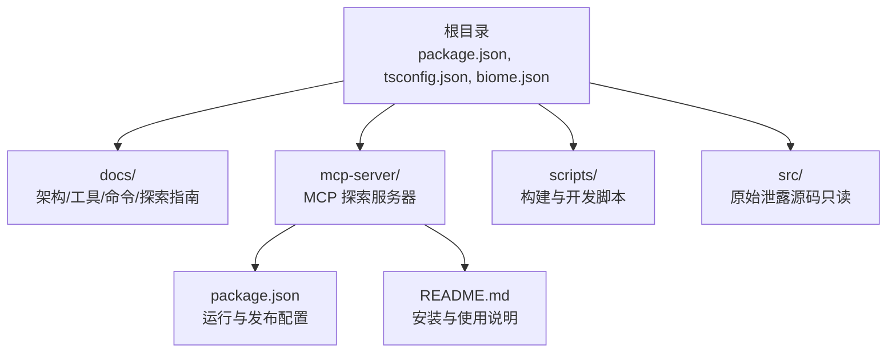
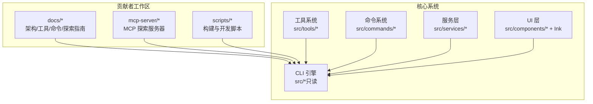
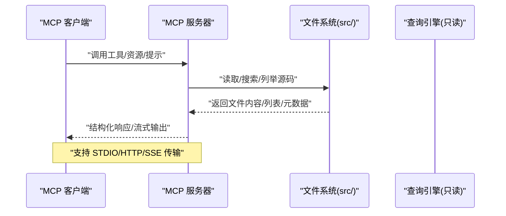
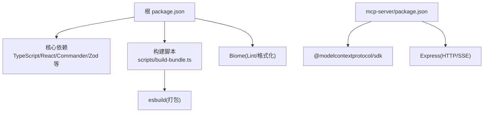

# 代码贡献流程

<cite>
**本文档引用的文件**
- [CONTRIBUTING.md](file://CONTRIBUTING.md)
- [README.md](file://README.md)
- [package.json](file://package.json)
- [biome.json](file://biome.json)
- [tsconfig.json](file://tsconfig.json)
- [scripts/build-bundle.ts](file://scripts/build-bundle.ts)
- [scripts/dev.ts](file://scripts/dev.ts)
- [.gitignore](file://.gitignore)
- [.mcp.json](file://.mcp.json)
- [mcp-server/README.md](file://mcp-server/README.md)
- [mcp-server/package.json](file://mcp-server/package.json)
- [docs/architecture.md](file://docs/architecture.md)
- [docs/exploration-guide.md](file://docs/exploration-guide.md)
- [docs/tools.md](file://docs/tools.md)
- [docs/commands.md](file://docs/commands.md)
</cite>

## 目录
1. [简介](#简介)
2. [项目结构](#项目结构)
3. [核心组件](#核心组件)
4. [架构总览](#架构总览)
5. [详细组件分析](#详细组件分析)
6. [依赖关系分析](#依赖关系分析)
7. [性能考虑](#性能考虑)
8. [故障排查指南](#故障排查指南)
9. [结论](#结论)
10. [附录](#附录)

## 简介
本指南面向希望为 Claude Code 项目做出贡献的开发者，聚焦于以下三类可修改与可扩展内容：
- 文档与分析：改进 docs/ 目录中的架构、子系统、工具与命令参考，以及探索指南
- MCP 服务器：增强 mcp-server/ 的功能与可用性（支持 STDIO、Streamable HTTP、SSE）
- 工具与脚本：编写辅助研究源码的脚本或工具（不涉及对原始泄露源码的修改）

同时明确：src/ 目录为原始泄露源码，应保持不变；任何改动仅限于上述三个方向。

章节来源
- [CONTRIBUTING.md:1-73](file://CONTRIBUTING.md#L1-L73)
- [README.md:435-440](file://README.md#L435-L440)

## 项目结构
该项目采用多模块布局：
- 根目录：核心 CLI、构建脚本、类型与配置
- docs/：架构、工具、命令、探索指南等文档
- mcp-server/：独立的 MCP 探索服务器，支持多种传输协议
- scripts/：构建与开发辅助脚本
- 其他：Web 前端、服务层、工具与命令实现等（仅供阅读与分析）

图表来源
- [README.md:193-236](file://README.md#L193-L236)
- [mcp-server/README.md:1-280](file://mcp-server/README.md#L1-L280)
- [package.json:1-95](file://package.json#L1-L95)

章节来源
- [README.md:193-236](file://README.md#L193-L236)
- [mcp-server/README.md:1-280](file://mcp-server/README.md#L1-L280)
- [package.json:1-95](file://package.json#L1-L95)

## 核心组件
- 贡献范围与限制
  - 可贡献：文档、MCP 服务器、分析文章、工具与脚本、MCP 服务器及基础设施的缺陷修复
  - 不可修改：src/ 目录为原始泄露源码，必须保持原样
- 分支策略与工作流
  - 使用功能分支进行开发，遵循清晰的提交信息
  - 通过 Pull Request 提交变更，接受代码审查
- 代码风格
  - TypeScript（严格模式），ES 模块
  - 缩进：Biome 配置使用制表符缩进，src/ 目录为 2 空格以匹配配置
  - 命名：描述性变量名，注释简洁
- 质量保障
  - Lint：Biome
  - 类型检查：TypeScript
  - 构建：基于 esbuild 的单文件打包，生成可执行 CLI

章节来源
- [CONTRIBUTING.md:9-61](file://CONTRIBUTING.md#L9-L61)
- [biome.json:26-31](file://biome.json#L26-L31)
- [tsconfig.json:2-26](file://tsconfig.json#L2-L26)
- [package.json:12-24](file://package.json#L12-L24)

## 架构总览
从贡献角度，Claude Code 的整体架构由“CLI 引擎 + 工具与命令系统 + UI 层 + 外部服务”构成。对于贡献者而言，重点在于：
- 文档与分析：帮助理解架构、子系统、工具与命令
- MCP 服务器：作为外部客户端探索源码的桥梁
- 开发与质量工具：确保新增代码符合风格与质量标准

图表来源
- [docs/architecture.md:1-225](file://docs/architecture.md#L1-L225)
- [docs/exploration-guide.md:1-247](file://docs/exploration-guide.md#L1-L247)
- [README.md:240-339](file://README.md#L240-L339)

章节来源
- [docs/architecture.md:1-225](file://docs/architecture.md#L1-L225)
- [docs/exploration-guide.md:1-247](file://docs/exploration-guide.md#L1-L247)
- [README.md:240-339](file://README.md#L240-L339)

## 详细组件分析

### 文档与分析贡献
- 贡献目标
  - 完善 docs/architecture.md、docs/tools.md、docs/commands.md、docs/exploration-guide.md 等
  - 补充子系统深度解析（Bridge、MCP、权限、插件、技能、任务、记忆、语音等）
  - 提供新的探索路径与 grep 模式建议
- 贡献方式
  - 在 docs/ 下新增或修改 Markdown 文件
  - 保持与现有文档一致的结构与术语
  - 通过 Pull Request 提交，经代码审查后合并

章节来源
- [CONTRIBUTING.md:9-15](file://CONTRIBUTING.md#L9-L15)
- [docs/architecture.md:1-225](file://docs/architecture.md#L1-L225)
- [docs/tools.md:1-174](file://docs/tools.md#L1-L174)
- [docs/commands.md:1-212](file://docs/commands.md#L1-L212)
- [docs/exploration-guide.md:1-247](file://docs/exploration-guide.md#L1-L247)

### MCP 服务器增强
- 功能范围
  - 支持 STDIO、Streamable HTTP、SSE 三种传输
  - 提供工具：列出工具/命令、读取源码文件、搜索源码、目录浏览、架构概览
  - 提供资源与提示模板，便于引导探索
- 开发与部署
  - 开发：npm run dev（热编译）、npm run build（编译到 dist/）
  - 运行：npm start（STDIO）、npm run start:http（HTTP/SSE）
  - 部署：Railway、Vercel、Docker 等
- 配置与环境变量
  - CLAUDE_CODE_SRC_ROOT：指向 src/ 的路径
  - PORT：HTTP 端口（默认 3000）
  - MCP_API_KEY：HTTP 认证令牌（Bearer）

图表来源
- [mcp-server/README.md:17-48](file://mcp-server/README.md#L17-L48)
- [mcp-server/README.md:57-80](file://mcp-server/README.md#L57-L80)
- [mcp-server/README.md:138-145](file://mcp-server/README.md#L138-L145)

章节来源
- [mcp-server/README.md:1-280](file://mcp-server/README.md#L1-L280)
- [mcp-server/package.json:15-20](file://mcp-server/package.json#L15-L20)

### 工具与脚本开发
- 贡献范围
  - 辅助研究源码的脚本（如批量 grep、统计、可视化）
  - CI/CD 流程优化脚本
  - 文档生成与维护脚本
- 质量与风格
  - TypeScript（严格模式），ES 模块
  - 使用 Biome 进行格式化与 Lint
  - 与现有脚本风格保持一致（如 scripts/build-bundle.ts、scripts/dev.ts）

章节来源
- [CONTRIBUTING.md:53-61](file://CONTRIBUTING.md#L53-L61)
- [biome.json:1-50](file://biome.json#L1-L50)
- [scripts/build-bundle.ts:1-198](file://scripts/build-bundle.ts#L1-L198)
- [scripts/dev.ts:1-16](file://scripts/dev.ts#L1-L16)

### 代码风格与规范
- TypeScript 与模块
  - 严格模式（tsconfig.json）
  - ES 模块（package.json type: module）
- 缩进与格式
  - Biome 配置：制表符缩进，行宽 100，单引号，按需分号
  - src/ 目录为 2 空格以匹配 Biome 配置
- 命名约定
  - 描述性变量名，最小注释
- Lint 与类型检查
  - npm run lint（Biome）
  - npm run typecheck（TypeScript）

章节来源
- [CONTRIBUTING.md:53-61](file://CONTRIBUTING.md#L53-L61)
- [biome.json:26-31](file://biome.json#L26-L31)
- [tsconfig.json:2-26](file://tsconfig.json#L2-L26)
- [package.json:12-24](file://package.json#L12-L24)

### Pull Request 提交流程
- 分支策略
  - 从主干派生功能分支，命名清晰
- 提交规范
  - 清晰的提交信息，说明变更目的与影响
- 代码审查
  - 至少一名维护者审查
  - 关注贡献范围、风格一致性与质量指标
- 合并条件
  - 通过 Lint 与类型检查
  - 无重大问题，文档与测试（如有）更新到位

章节来源
- [CONTRIBUTING.md:62-68](file://CONTRIBUTING.md#L62-L68)

## 依赖关系分析
- 根项目依赖
  - TypeScript、React + Ink、Commander.js、Zod、Anthropic SDK、OpenTelemetry、MCP SDK 等
- MCP 服务器依赖
  - @modelcontextprotocol/sdk、Express（HTTP/SSE）
- 构建与开发
  - esbuild（单文件打包）、tsx（开发时热编译）、Bun（运行时）

图表来源
- [package.json:25-75](file://package.json#L25-L75)
- [mcp-server/package.json:21-30](file://mcp-server/package.json#L21-L30)
- [scripts/build-bundle.ts:8-145](file://scripts/build-bundle.ts#L8-L145)

章节来源
- [package.json:1-95](file://package.json#L1-L95)
- [mcp-server/package.json:1-34](file://mcp-server/package.json#L1-L34)
- [scripts/build-bundle.ts:1-198](file://scripts/build-bundle.ts#L1-L198)

## 性能考虑
- 构建性能
  - 单文件打包减少加载与启动时间
  - 按需引入重型模块（OpenTelemetry、gRPC 等）
- 运行时性能
  - 单线程事件循环 + 并发渲染
  - 特征标志死代码消除（bun:bundle）
- MCP 服务器
  - HTTP/SSE 适合远程客户端，注意状态管理与超时处理
  - Vercel 函数有执行时长限制，建议优先使用持久连接（Railway/Docker）

章节来源
- [docs/architecture.md:145-187](file://docs/architecture.md#L145-L187)
- [mcp-server/README.md:181-192](file://mcp-server/README.md#L181-L192)

## 故障排查指南
- 构建失败
  - 检查 esbuild 配置与外部依赖排除列表
  - 确认 TypeScript 严格模式与 tsconfig 设置
- Lint/格式化问题
  - 使用 npm run lint 与 npm run format
  - 检查 .gitignore 中是否误排除了 src/
- 运行时错误
  - 确认 CLAUDE_CODE_SRC_ROOT 指向正确的 src/ 路径
  - 检查 MCP_API_KEY 与认证头设置
- 开发调试
  - 使用 scripts/dev.ts 直接运行 CLI
  - 使用 MCP 服务器的健康检查端点与日志

章节来源
- [scripts/build-bundle.ts:147-198](file://scripts/build-bundle.ts#L147-L198)
- [biome.json:1-50](file://biome.json#L1-L50)
- [mcp-server/README.md:138-145](file://mcp-server/README.md#L138-L145)
- [scripts/dev.ts:1-16](file://scripts/dev.ts#L1-L16)
- [.gitignore:1-46](file://.gitignore#L1-L46)

## 结论
本指南明确了在 Claude Code 项目中可贡献的方向与边界：文档、MCP 服务器与工具脚本是开放的贡献领域，而 src/ 目录为原始泄露源码，严禁修改。通过统一的风格规范、严格的 Lint/类型检查与清晰的 PR 流程，贡献者可以高效地提升项目的可读性、可用性与可维护性。

## 附录
- 快速开始
  - 克隆仓库并安装依赖
  - 运行 npm run lint 与 npm run typecheck
  - 在 docs/ 或 mcp-server/ 中进行贡献
- MCP 服务器一键安装与注册
  - 通过 npm 包直接添加服务器
  - 或本地构建后注册到客户端配置

章节来源
- [CONTRIBUTING.md:22-51](file://CONTRIBUTING.md#L22-L51)
- [README.md:87-122](file://README.md#L87-L122)
- [mcp-server/README.md:228-248](file://mcp-server/README.md#L228-L248)