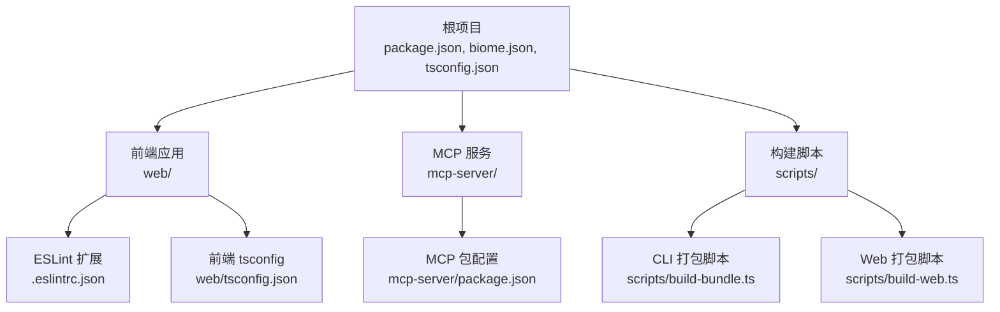
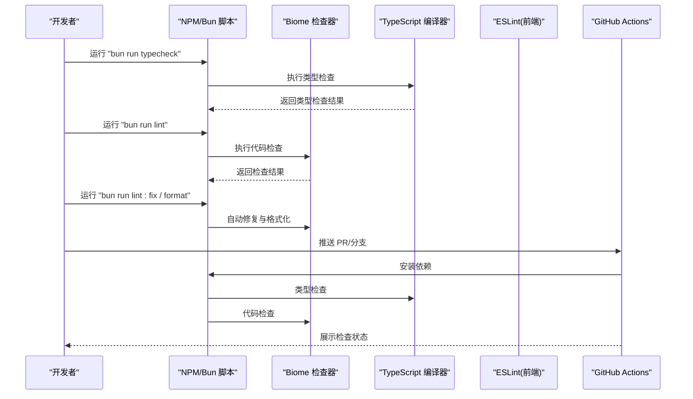
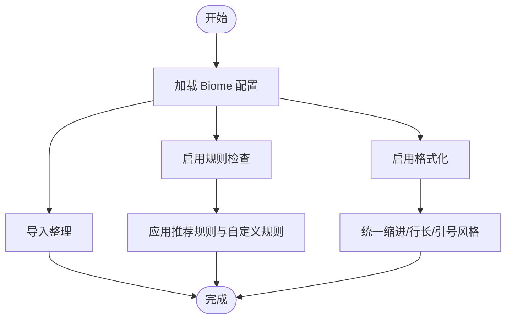
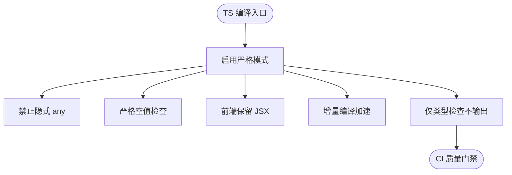
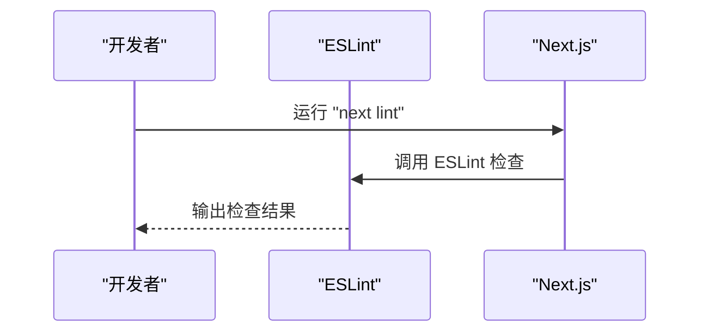
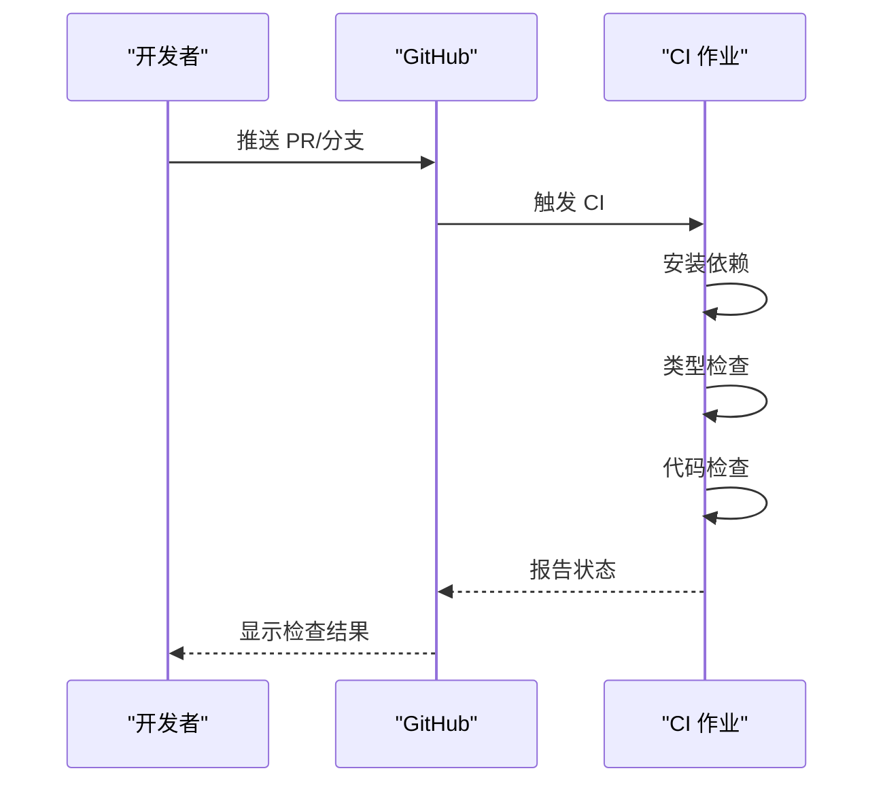
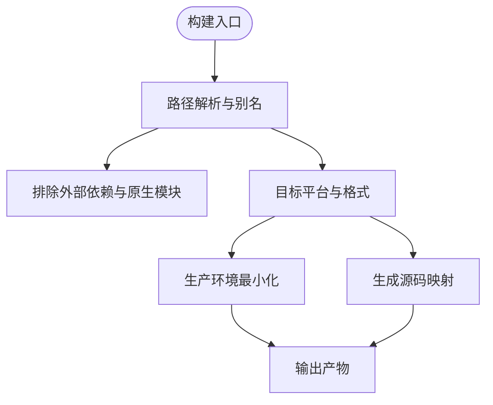
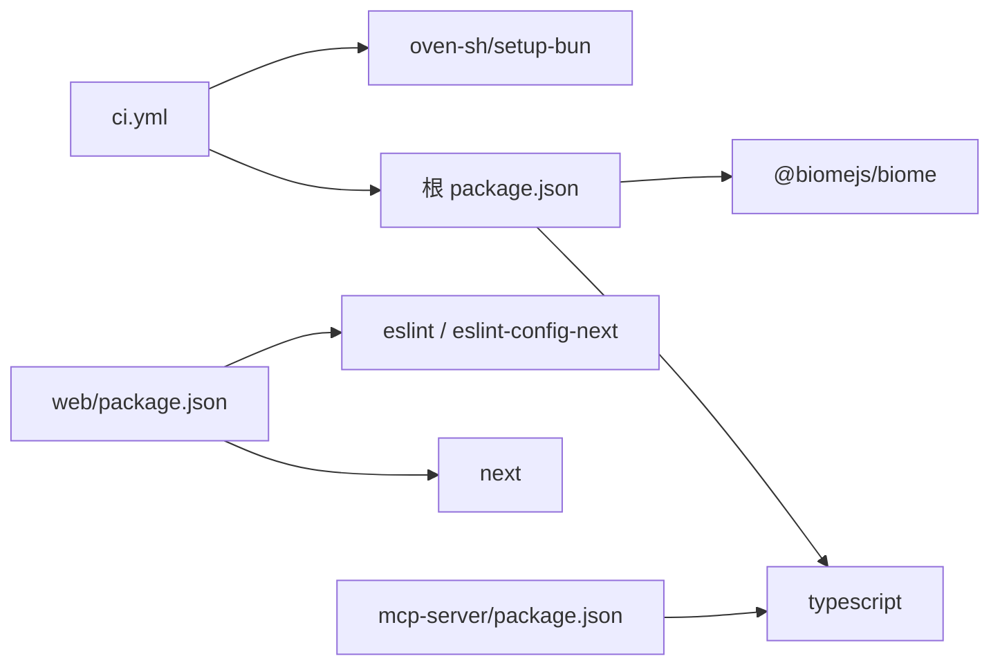

# 代码质量工具

<cite>
**本文引用的文件**
- [biome.json](file://biome.json)
- [package.json](file://package.json)
- [tsconfig.json](file://tsconfig.json)
- [.github/workflows/ci.yml](file://.github/workflows/ci.yml)
- [web/.eslintrc.json](file://web/.eslintrc.json)
- [web/package.json](file://web/package.json)
- [mcp-server/package.json](file://mcp-server/package.json)
- [scripts/build-bundle.ts](file://scripts/build-bundle.ts)
- [scripts/build-web.ts](file://scripts/build-web.ts)
- [web/tsconfig.json](file://web/tsconfig.json)
</cite>

## 目录
1. [简介](#简介)
2. [项目结构](#项目结构)
3. [核心组件](#核心组件)
4. [架构总览](#架构总览)
5. [详细组件分析](#详细组件分析)
6. [依赖关系分析](#依赖关系分析)
7. [性能考量](#性能考量)
8. [故障排查指南](#故障排查指南)
9. [结论](#结论)
10. [附录](#附录)

## 简介
本指南面向 Claude Code 团队与贡献者，系统讲解代码质量工具链的配置与使用，覆盖以下要点：
- Biome 代码检查与格式化的规则配置、自动修复与持续集成集成
- TypeScript 类型检查的重要性、严格模式配置与类型安全最佳实践
- ESLint 与 Prettier 在前端 Next.js 子项目的使用方式与扩展
- 代码审查自动化流程：GitHub Actions 工作流与质量门禁设置
- 代码质量度量与改进策略，帮助长期维护高质量代码库

## 项目结构
该项目采用多包/多子项目布局，主要涉及以下与质量工具直接相关的目录与文件：
- 根级质量配置：Biome 配置、TypeScript 全局配置、根脚本与工作流
- 前端子项目：Next.js 应用（web/），包含独立的 ESLint 配置与脚本
- MCP 服务：独立 Node 项目，使用 TypeScript 构建与发布
- 构建脚本：用于 CLI 与浏览器终端前端的打包脚本，内含构建期质量提示

图表来源
- [package.json:12-24](file://package.json#L12-L24)
- [biome.json:1-50](file://biome.json#L1-L50)
- [tsconfig.json:1-28](file://tsconfig.json#L1-L28)
- [web/.eslintrc.json:1-4](file://web/.eslintrc.json#L1-L4)
- [web/package.json:5-11](file://web/package.json#L5-L11)
- [mcp-server/package.json:15-20](file://mcp-server/package.json#L15-L20)
- [scripts/build-bundle.ts:66-145](file://scripts/build-bundle.ts#L66-L145)
- [scripts/build-web.ts:25-38](file://scripts/build-web.ts#L25-L38)

章节来源
- [package.json:12-24](file://package.json#L12-L24)
- [biome.json:1-50](file://biome.json#L1-L50)
- [tsconfig.json:1-28](file://tsconfig.json#L1-L28)
- [web/.eslintrc.json:1-4](file://web/.eslintrc.json#L1-L4)
- [web/package.json:5-11](file://web/package.json#L5-L11)
- [mcp-server/package.json:15-20](file://mcp-server/package.json#L15-L20)
- [scripts/build-bundle.ts:66-145](file://scripts/build-bundle.ts#L66-L145)
- [scripts/build-web.ts:25-38](file://scripts/build-web.ts#L25-L38)

## 核心组件
本节聚焦于与代码质量直接相关的配置与脚本，说明其职责与交互。

- Biome 配置与脚本集成
  - Biome 负责导入整理、语法检查、格式化与忽略规则配置
  - 根 package.json 中定义了 lint、lint:fix、format、check 等脚本，直接调用 Biome
  - 通过组织导入、推荐规则、风格与复杂度规则，形成统一的静态检查基线

- TypeScript 类型检查
  - 根 tsconfig.json 启用严格模式，确保类型安全与一致性
  - 前端 web/tsconfig.json 同样启用严格模式，并针对 Next.js 进行 JSX 与模块解析优化
  - 根 package.json 提供 typecheck 脚本，CI 中执行类型检查作为质量门禁

- ESLint 与 Prettier（前端）
  - web/.eslintrc.json 继承 Next.js 核心 Web Vitals 规则，保证前端工程化标准
  - web/package.json 提供 lint 与 type-check 脚本，结合 Next.js 生态进行静态分析

- GitHub Actions 质量门禁
  - .github/workflows/ci.yml 使用 Bun 环境，顺序执行依赖安装、类型检查与代码检查
  - 该工作流即为“质量门禁”，任何失败都会阻止合并

- 构建脚本中的质量提示
  - scripts/build-bundle.ts 与 scripts/build-web.ts 在构建过程中进行路径解析、外部依赖排除与最小化等处理，间接提升产物质量与可维护性

章节来源
- [biome.json:1-50](file://biome.json#L1-L50)
- [package.json:12-24](file://package.json#L12-L24)
- [tsconfig.json:2-18](file://tsconfig.json#L2-L18)
- [web/tsconfig.json:2-26](file://web/tsconfig.json#L2-L26)
- [web/.eslintrc.json:1-4](file://web/.eslintrc.json#L1-L4)
- [web/package.json:5-11](file://web/package.json#L5-L11)
- [.github/workflows/ci.yml:10-28](file://.github/workflows/ci.yml#L10-L28)
- [scripts/build-bundle.ts:66-145](file://scripts/build-bundle.ts#L66-L145)
- [scripts/build-web.ts:25-38](file://scripts/build-web.ts#L25-L38)

## 架构总览
下图展示从开发者本地到 CI 的质量检查流水线，以及各工具在其中的角色：

图表来源
- [package.json:12-24](file://package.json#L12-L24)
- [.github/workflows/ci.yml:10-28](file://.github/workflows/ci.yml#L10-L28)

章节来源
- [package.json:12-24](file://package.json#L12-L24)
- [.github/workflows/ci.yml:10-28](file://.github/workflows/ci.yml#L10-L28)

## 详细组件分析

### Biome 配置与使用
- 导入整理与规则
  - 启用导入整理，避免冗余与未使用导入
  - 启用推荐规则集，覆盖复杂度、正确性、风格与可疑问题
  - 对特定规则进行显式开关或警告级别调整，以平衡团队风格与质量

- 格式化策略
  - 通用格式化开启，缩进使用制表符，宽度与行长按团队偏好设定
  - JavaScript 与 JSON 的格式化细节分别配置，确保跨语言一致性

- 文件忽略
  - 忽略 node_modules、dist 与声明文件，减少无关文件干扰

- 与脚本联动
  - lint、lint:fix、format、check 等脚本直接调用 Biome，便于本地与 CI 一致化

图表来源
- [biome.json:1-50](file://biome.json#L1-L50)
- [package.json:12-24](file://package.json#L12-L24)

章节来源
- [biome.json:1-50](file://biome.json#L1-L50)
- [package.json:12-24](file://package.json#L12-L24)

### TypeScript 类型检查与严格模式
- 严格模式配置
  - 根 tsconfig.json 与 web/tsconfig.json 均启用 strict，确保类型安全
  - 针对前端使用 preserve JSX 与增量编译，兼顾开发体验与性能

- 作为质量门禁
  - 根 package.json 的 typecheck 脚本在 CI 中执行，失败即阻断合并

- 最佳实践建议
  - 保持函数与变量显式类型，避免 any；利用联合类型表达业务状态
  - 对异步逻辑使用 Promise/Async/Await 明确错误处理
  - 利用编译器选项如 noImplicitAny、strictNullChecks 强化约束

图表来源
- [tsconfig.json:2-18](file://tsconfig.json#L2-L18)
- [web/tsconfig.json:2-16](file://web/tsconfig.json#L2-L16)
- [package.json](file://package.json#L19)

章节来源
- [tsconfig.json:2-18](file://tsconfig.json#L2-L18)
- [web/tsconfig.json:2-16](file://web/tsconfig.json#L2-L16)
- [package.json](file://package.json#L19)

### ESLint 与 Prettier（前端 Next.js）
- ESLint 配置
  - web/.eslintrc.json 继承 Next.js 核心 Web Vitals 规范，确保前端工程化标准
  - 结合 web/package.json 的 lint 与 type-check 脚本，形成统一的前端质量基线

- Prettier 使用
  - 仓库未提供独立 Prettier 配置文件，但 Next.js 项目通常与 ESLint 协同工作
  - 若需引入 Prettier，可在项目中添加配置并将其与 ESLint 规则对齐，避免冲突

图表来源
- [web/.eslintrc.json:1-4](file://web/.eslintrc.json#L1-L4)
- [web/package.json:9-10](file://web/package.json#L9-L10)

章节来源
- [web/.eslintrc.json:1-4](file://web/.eslintrc.json#L1-L4)
- [web/package.json:9-10](file://web/package.json#L9-L10)

### GitHub Actions 工作流与质量门禁
- 工作流概览
  - 使用 Bun 环境，安装依赖后依次执行类型检查与代码检查
  - 任一阶段失败将导致整个作业失败，形成质量门禁

- 发布工作流（MCP 服务）
  - mcp-server 子项目使用独立的发布工作流，负责构建与发布到 npm 与 MCP 注册中心
  - 该工作流与主仓库的 CI 分离，确保服务发布的稳定性与安全性

图表来源
- [.github/workflows/ci.yml:1-30](file://.github/workflows/ci.yml#L1-L30)

章节来源
- [.github/workflows/ci.yml:1-30](file://.github/workflows/ci.yml#L1-L30)
- [mcp-server/package.json:15-20](file://mcp-server/package.json#L15-L20)

### 构建脚本中的质量提示
- CLI 打包脚本
  - 通过 esbuild 进行单文件打包，排除不可打包的原生模块与内部包
  - 定义宏常量与源码映射，便于调试与版本追踪

- 浏览器终端前端打包脚本
  - 面向浏览器平台，支持 CSS 内联与最小化，适配多目标浏览器

图表来源
- [scripts/build-bundle.ts:66-145](file://scripts/build-bundle.ts#L66-L145)
- [scripts/build-web.ts:25-38](file://scripts/build-web.ts#L25-L38)

章节来源
- [scripts/build-bundle.ts:66-145](file://scripts/build-bundle.ts#L66-L145)
- [scripts/build-web.ts:25-38](file://scripts/build-web.ts#L25-L38)

## 依赖关系分析
- 工具链耦合
  - 根 package.json 将 Biome 作为开发依赖，通过脚本统一调用
  - TypeScript 作为核心类型检查工具，贯穿前端与 MCP 服务
  - ESLint 与 Next.js 生态紧密耦合，前端质量由两者共同保障

- 外部依赖与集成点
  - GitHub Actions 作为质量门禁，依赖 Bun 环境与 npm/yarn 锁定文件
  - MCP 服务发布流程依赖 npm 与 MCP 注册中心 CLI

图表来源
- [package.json:77-88](file://package.json#L77-L88)
- [web/package.json:40-51](file://web/package.json#L40-L51)
- [.github/workflows/ci.yml:16-21](file://.github/workflows/ci.yml#L16-L21)
- [mcp-server/package.json:25-30](file://mcp-server/package.json#L25-L30)

章节来源
- [package.json:77-88](file://package.json#L77-L88)
- [web/package.json:40-51](file://web/package.json#L40-L51)
- [.github/workflows/ci.yml:16-21](file://.github/workflows/ci.yml#L16-L21)
- [mcp-server/package.json:25-30](file://mcp-server/package.json#L25-L30)

## 性能考量
- 类型检查性能
  - 增量编译与严格模式会增加检查时间，建议在本地使用快速路径，在 CI 中启用完整检查
  - 将大型库的类型声明放入单独的 d.ts 文件，减少全局扫描范围

- 构建与打包性能
  - CLI 与 Web 打包脚本已启用最小化与源码映射控制，生产构建时关闭源码映射以提升速度
  - 排除不可打包的原生模块与内部包，避免不必要的依赖解析开销

- ESLint 性能
  - 仅对变更文件运行检查，或使用缓存机制减少重复计算
  - 合理拆分规则集，避免过度复杂的规则组合影响性能

## 故障排查指南
- Biome 检查失败
  - 使用 lint:fix 自动修复常见问题；对于复杂规则冲突，参考规则配置进行微调
  - 检查忽略列表是否误排除了必要文件

- TypeScript 类型错误
  - 优先修复顶层错误，再处理连锁报错
  - 在严格模式下，逐步放宽部分规则以定位问题根因，随后恢复严格模式

- ESLint 报错
  - 检查 .eslintrc.json 的继承链与本地规则覆盖
  - 确保编辑器插件与命令行版本一致，避免“本地通过、CI 失败”的差异

- CI 失败
  - 确认 Bun 版本与依赖锁文件一致
  - 在本地复现 CI 步骤：安装依赖、类型检查、代码检查

章节来源
- [biome.json:1-50](file://biome.json#L1-L50)
- [package.json:12-24](file://package.json#L12-L24)
- [web/.eslintrc.json:1-4](file://web/.eslintrc.json#L1-L4)
- [.github/workflows/ci.yml:16-28](file://.github/workflows/ci.yml#L16-L28)

## 结论
本指南梳理了 Claude Code 项目在 Biome、TypeScript、ESLint/Prettier、GitHub Actions 与构建脚本方面的质量工具链配置与使用方法。通过统一的规则、严格的类型检查与 CI 门禁，能够有效提升代码一致性与可维护性。建议团队在日常开发中坚持“先本地修复，再提交”的流程，并在 PR 中关注 CI 状态，持续优化规则与脚本，使质量工具成为开发效率的助推器而非阻碍。

## 附录
- 常用命令速查
  - 类型检查：bun run typecheck
  - 代码检查：bun run lint
  - 自动修复：bun run lint:fix
  - 格式化：bun run format
  - 前端检查：cd web && bun run lint
  - 前端类型检查：cd web && bun run type-check

章节来源
- [package.json:12-24](file://package.json#L12-L24)
- [web/package.json:5-11](file://web/package.json#L5-L11)